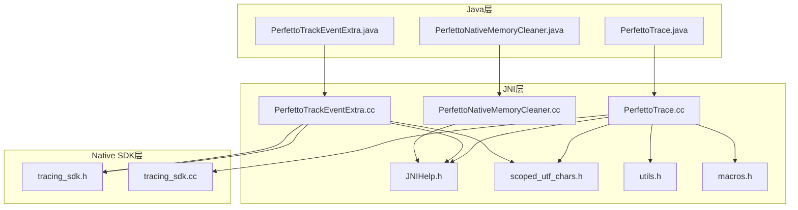
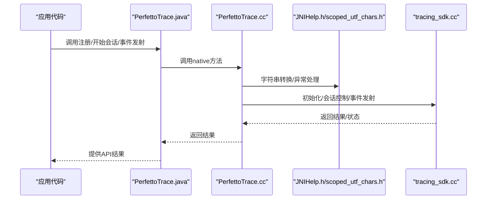
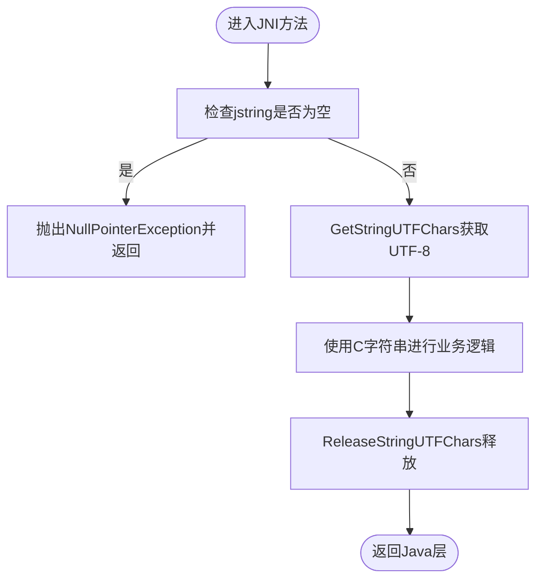
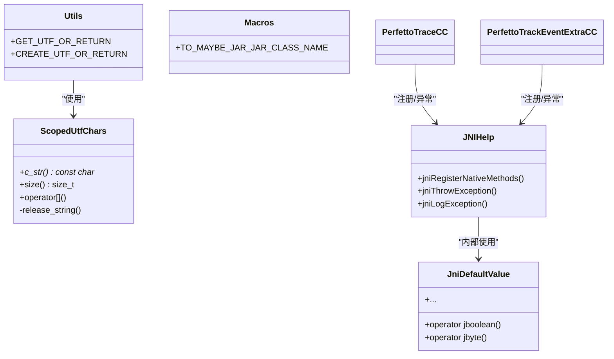
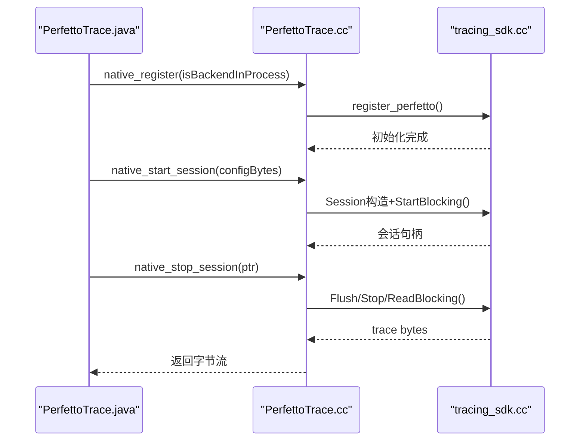
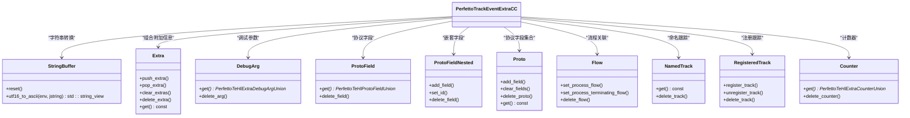
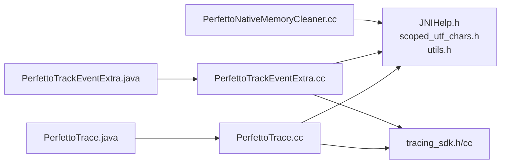

# Android SDK使用

<cite>
**本文引用的文件**
- [PerfettoTrace.java](file://src/android_sdk/java/main/dev/perfetto/sdk/PerfettoTrace.java)
- [PerfettoTrackEventExtra.java](file://src/android_sdk/java/main/dev/perfetto/sdk/PerfettoTrackEventExtra.java)
- [PerfettoNativeMemoryCleaner.java](file://src/android_sdk/java/main/dev/perfetto/sdk/PerfettoNativeMemoryCleaner.java)
- [PerfettoTrace.cc](file://src/android_sdk/jni/dev_perfetto_sdk_PerfettoTrace.cc)
- [PerfettoTrackEventExtra.cc](file://src/android_sdk/jni/dev_perfetto_sdk_PerfettoTrackEventExtra.cc)
- [PerfettoNativeMemoryCleaner.cc](file://src/android_sdk/jni/dev_perfetto_sdk_PerfettoNativeMemoryCleaner.cc)
- [tracing_sdk.h](file://src/android_sdk/perfetto_sdk_for_jni/tracing_sdk.h)
- [tracing_sdk.cc](file://src/android_sdk/perfetto_sdk_for_jni/tracing_sdk.cc)
- [JNIHelp.h](file://src/android_sdk/nativehelper/JNIHelp.h)
- [scoped_utf_chars.h](file://src/android_sdk/nativehelper/scoped_utf_chars.h)
- [utils.h](file://src/android_sdk/nativehelper/utils.h)
- [macros.h](file://src/android_sdk/jni/macros.h)
- [perfetto_android_sdk.gni](file://gn/perfetto_android_sdk.gni)
- [AndroidManifest.xml](file://src/android_sdk/java/main/AndroidManifest.xml)
</cite>

## 目录
1. [简介](#简介)
2. [项目结构](#项目结构)
3. [核心组件](#核心组件)
4. [架构总览](#架构总览)
5. [详细组件分析](#详细组件分析)
6. [依赖关系分析](#依赖关系分析)
7. [性能考量](#性能考量)
8. [故障排查指南](#故障排查指南)
9. [结论](#结论)
10. [附录](#附录)

## 简介
本指南面向在Android应用中集成Perfetto Android SDK的开发者，系统讲解JNI桥接设计与实现、Native Helper工具库、SDK使用方法（初始化、追踪配置、事件记录）、集成步骤（Gradle、NDK、构建脚本）、Android版本兼容与ABI支持、性能优化策略，并提供常见问题的解决方案与调试技巧。

## 项目结构
Android SDK由三层组成：
- Java层：提供易用的API入口与生命周期管理（注册、会话、事件构造器等）。
- JNI层：将Java调用桥接到C++，负责参数转换、内存管理与异常处理。
- Native SDK层：封装Perfetto公共API，提供追踪会话、事件发射、类别注册、触发器激活等功能。

**图表来源**
- [PerfettoTrace.java](file://src/android_sdk/java/main/dev/perfetto/sdk/PerfettoTrace.java)
- [PerfettoTrackEventExtra.java](file://src/android_sdk/java/main/dev/perfetto/sdk/PerfettoTrackEventExtra.java)
- [PerfettoNativeMemoryCleaner.java](file://src/android_sdk/java/main/dev/perfetto/sdk/PerfettoNativeMemoryCleaner.java)
- [PerfettoTrace.cc](file://src/android_sdk/jni/dev_perfetto_sdk_PerfettoTrace.cc)
- [PerfettoTrackEventExtra.cc](file://src/android_sdk/jni/dev_perfetto_sdk_PerfettoTrackEventExtra.cc)
- [PerfettoNativeMemoryCleaner.cc](file://src/android_sdk/jni/dev_perfetto_sdk_PerfettoNativeMemoryCleaner.cc)
- [JNIHelp.h](file://src/android_sdk/nativehelper/JNIHelp.h)
- [scoped_utf_chars.h](file://src/android_sdk/nativehelper/scoped_utf_chars.h)
- [utils.h](file://src/android_sdk/nativehelper/utils.h)
- [macros.h](file://src/android_sdk/jni/macros.h)
- [tracing_sdk.h](file://src/android_sdk/perfetto_sdk_for_jni/tracing_sdk.h)
- [tracing_sdk.cc](file://src/android_sdk/perfetto_sdk_for_jni/tracing_sdk.cc)

**章节来源**
- [PerfettoTrace.java](file://src/android_sdk/java/main/dev/perfetto/sdk/PerfettoTrace.java)
- [PerfettoTrackEventExtra.java](file://src/android_sdk/java/main/dev/perfetto/sdk/PerfettoTrackEventExtra.java)
- [PerfettoNativeMemoryCleaner.java](file://src/android_sdk/java/main/dev/perfetto/sdk/PerfettoNativeMemoryCleaner.java)
- [PerfettoTrace.cc](file://src/android_sdk/jni/dev_perfetto_sdk_PerfettoTrace.cc)
- [PerfettoTrackEventExtra.cc](file://src/android_sdk/jni/dev_perfetto_sdk_PerfettoTrackEventExtra.cc)
- [PerfettoNativeMemoryCleaner.cc](file://src/android_sdk/jni/dev_perfetto_sdk_PerfettoNativeMemoryCleaner.cc)
- [JNIHelp.h](file://src/android_sdk/nativehelper/JNIHelp.h)
- [scoped_utf_chars.h](file://src/android_sdk/nativehelper/scoped_utf_chars.h)
- [utils.h](file://src/android_sdk/nativehelper/utils.h)
- [macros.h](file://src/android_sdk/jni/macros.h)
- [tracing_sdk.h](file://src/android_sdk/perfetto_sdk_for_jni/tracing_sdk.h)
- [tracing_sdk.cc](file://src/android_sdk/perfetto_sdk_for_jni/tracing_sdk.cc)

## 核心组件
- Java API入口：提供注册、会话管理、事件构造器、跟踪UUID获取、触发器激活等能力。
- JNI桥接：将Java方法映射到C++，进行字符串转换、数组拷贝、对象生命周期管理。
- Native Helper工具库：提供安全的字符串转换、本地引用管理、异常抛出与日志记录。
- Native SDK封装：对Perfetto公共API进行轻量封装，统一事件发射、会话控制与资源释放。

**章节来源**
- [PerfettoTrace.java](file://src/android_sdk/java/main/dev/perfetto/sdk/PerfettoTrace.java)
- [PerfettoTrackEventExtra.java](file://src/android_sdk/java/main/dev/perfetto/sdk/PerfettoTrackEventExtra.java)
- [PerfettoNativeMemoryCleaner.java](file://src/android_sdk/java/main/dev/perfetto/sdk/PerfettoNativeMemoryCleaner.java)
- [PerfettoTrace.cc](file://src/android_sdk/jni/dev_perfetto_sdk_PerfettoTrace.cc)
- [PerfettoTrackEventExtra.cc](file://src/android_sdk/jni/dev_perfetto_sdk_PerfettoTrackEventExtra.cc)
- [PerfettoNativeMemoryCleaner.cc](file://src/android_sdk/jni/dev_perfetto_sdk_PerfettoNativeMemoryCleaner.cc)
- [JNIHelp.h](file://src/android_sdk/nativehelper/JNIHelp.h)
- [scoped_utf_chars.h](file://src/android_sdk/nativehelper/scoped_utf_chars.h)
- [utils.h](file://src/android_sdk/nativehelper/utils.h)
- [tracing_sdk.h](file://src/android_sdk/perfetto_sdk_for_jni/tracing_sdk.h)
- [tracing_sdk.cc](file://src/android_sdk/perfetto_sdk_for_jni/tracing_sdk.cc)

## 架构总览
下图展示从Java到JNI再到Native SDK的整体调用链路与职责分工。

**图表来源**
- [PerfettoTrace.java](file://src/android_sdk/java/main/dev/perfetto/sdk/PerfettoTrace.java)
- [PerfettoTrace.cc](file://src/android_sdk/jni/dev_perfetto_sdk_PerfettoTrace.cc)
- [JNIHelp.h](file://src/android_sdk/nativehelper/JNIHelp.h)
- [scoped_utf_chars.h](file://src/android_sdk/nativehelper/scoped_utf_chars.h)
- [tracing_sdk.cc](file://src/android_sdk/perfetto_sdk_for_jni/tracing_sdk.cc)

## 详细组件分析

### JNI桥接与数据类型转换
- 指针传递：通过jlong在Java与C++之间传递原生对象指针，避免跨语言复制。
- 字符串转换：使用ScopedUtfChars与GET_UTF_OR_RETURN宏安全地获取UTF-8 C字符串；对null输入抛出空指针异常。
- 数组处理：字节数组通过GetByteArrayRegion与NewByteArray进行零拷贝或最小拷贝。
- 异常与日志：通过jniRegisterNativeMethods与jniThrowException等工具保证失败时的可诊断性。

**图表来源**
- [PerfettoTrace.cc](file://src/android_sdk/jni/dev_perfetto_sdk_PerfettoTrace.cc)
- [scoped_utf_chars.h](file://src/android_sdk/nativehelper/scoped_utf_chars.h)
- [JNIHelp.h](file://src/android_sdk/nativehelper/JNIHelp.h)

**章节来源**
- [PerfettoTrace.cc](file://src/android_sdk/jni/dev_perfetto_sdk_PerfettoTrace.cc)
- [PerfettoTrackEventExtra.cc](file://src/android_sdk/jni/dev_perfetto_sdk_PerfettoTrackEventExtra.cc)
- [scoped_utf_chars.h](file://src/android_sdk/nativehelper/scoped_utf_chars.h)
- [utils.h](file://src/android_sdk/nativehelper/utils.h)
- [JNIHelp.h](file://src/android_sdk/nativehelper/JNIHelp.h)

### Native Helper工具库
- JNIHelp：提供RegisterNatives包装、异常抛出、栈追踪摘要、日志输出等工具，确保注册失败时可定位类名与原因。
- ScopedUtfChars：RAII风格的UTF-8字符串包装，自动释放，避免泄漏。
- utils：提供GET_UTF_OR_RETURN/CREATE_UTF_OR_RETURN宏族，简化空值检查与异常传播。
- macros：提供JarJar前缀宏与类名拼装工具，便于打包后类名映射。

**图表来源**
- [scoped_utf_chars.h](file://src/android_sdk/nativehelper/scoped_utf_chars.h)
- [utils.h](file://src/android_sdk/nativehelper/utils.h)
- [JNIHelp.h](file://src/android_sdk/nativehelper/JNIHelp.h)
- [macros.h](file://src/android_sdk/jni/macros.h)
- [PerfettoTrace.cc](file://src/android_sdk/jni/dev_perfetto_sdk_PerfettoTrace.cc)
- [PerfettoTrackEventExtra.cc](file://src/android_sdk/jni/dev_perfetto_sdk_PerfettoTrackEventExtra.cc)

**章节来源**
- [JNIHelp.h](file://src/android_sdk/nativehelper/JNIHelp.h)
- [scoped_utf_chars.h](file://src/android_sdk/nativehelper/scoped_utf_chars.h)
- [utils.h](file://src/android_sdk/nativehelper/utils.h)
- [macros.h](file://src/android_sdk/jni/macros.h)

### Perfetto SDK for JNI
- 注册与初始化：首次调用时根据是否使用系统后端初始化Perfetto生产者与高层事件API。
- 事件发射：按类别启用状态决定是否发射；支持instant、slice(begin/end)、counter等类型。
- 会话管理：创建、启动、刷新、停止、读取追踪数据，返回字节流。
- 跟踪标识：提供进程与线程跟踪UUID，用于事件归属与父子关系建模。
- 触发器：按名称激活触发器并设置TTL。

**图表来源**
- [PerfettoTrace.java](file://src/android_sdk/java/main/dev/perfetto/sdk/PerfettoTrace.java)
- [PerfettoTrace.cc](file://src/android_sdk/jni/dev_perfetto_sdk_PerfettoTrace.cc)
- [tracing_sdk.cc](file://src/android_sdk/perfetto_sdk_for_jni/tracing_sdk.cc)

**章节来源**
- [tracing_sdk.h](file://src/android_sdk/perfetto_sdk_for_jni/tracing_sdk.h)
- [tracing_sdk.cc](file://src/android_sdk/perfetto_sdk_for_jni/tracing_sdk.cc)
- [PerfettoTrace.cc](file://src/android_sdk/jni/dev_perfetto_sdk_PerfettoTrace.cc)

### Track Event Extra与高性能字符串缓冲
- 高性能字符串转换：StringBuffer采用线程局部缓冲与溢出列表，避免频繁分配，支持快速路径与慢速路径切换。
- Extra/Proto/Field体系：以组合方式构建事件附加信息，支持整型、布尔、双精度、字符串、嵌套字段与内联化字符串。
- 内存清理：通过PerfettoNativeMemoryCleaner回调释放原生资源，配合Java侧NativeAllocationRegistry。

**图表来源**
- [PerfettoTrackEventExtra.cc](file://src/android_sdk/jni/dev_perfetto_sdk_PerfettoTrackEventExtra.cc)
- [tracing_sdk.h](file://src/android_sdk/perfetto_sdk_for_jni/tracing_sdk.h)

**章节来源**
- [PerfettoTrackEventExtra.cc](file://src/android_sdk/jni/dev_perfetto_sdk_PerfettoTrackEventExtra.cc)
- [PerfettoNativeMemoryCleaner.cc](file://src/android_sdk/jni/dev_perfetto_sdk_PerfettoNativeMemoryCleaner.cc)
- [tracing_sdk.h](file://src/android_sdk/perfetto_sdk_for_jni/tracing_sdk.h)

## 依赖关系分析
- Java层依赖JNI层生成的native方法签名。
- JNI层依赖Native Helper工具库与Native SDK封装。
- Native SDK封装依赖Perfetto公共头文件与ABI。

**图表来源**
- [PerfettoTrace.java](file://src/android_sdk/java/main/dev/perfetto/sdk/PerfettoTrace.java)
- [PerfettoTrackEventExtra.java](file://src/android_sdk/java/main/dev/perfetto/sdk/PerfettoTrackEventExtra.java)
- [PerfettoTrace.cc](file://src/android_sdk/jni/dev_perfetto_sdk_PerfettoTrace.cc)
- [PerfettoTrackEventExtra.cc](file://src/android_sdk/jni/dev_perfetto_sdk_PerfettoTrackEventExtra.cc)
- [PerfettoNativeMemoryCleaner.cc](file://src/android_sdk/jni/dev_perfetto_sdk_PerfettoNativeMemoryCleaner.cc)
- [JNIHelp.h](file://src/android_sdk/nativehelper/JNIHelp.h)
- [scoped_utf_chars.h](file://src/android_sdk/nativehelper/scoped_utf_chars.h)
- [utils.h](file://src/android_sdk/nativehelper/utils.h)
- [tracing_sdk.h](file://src/android_sdk/perfetto_sdk_for_jni/tracing_sdk.h)
- [tracing_sdk.cc](file://src/android_sdk/perfetto_sdk_for_jni/tracing_sdk.cc)

**章节来源**
- [PerfettoTrace.java](file://src/android_sdk/java/main/dev/perfetto/sdk/PerfettoTrace.java)
- [PerfettoTrackEventExtra.java](file://src/android_sdk/java/main/dev/perfetto/sdk/PerfettoTrackEventExtra.java)
- [PerfettoTrace.cc](file://src/android_sdk/jni/dev_perfetto_sdk_PerfettoTrace.cc)
- [PerfettoTrackEventExtra.cc](file://src/android_sdk/jni/dev_perfetto_sdk_PerfettoTrackEventExtra.cc)
- [PerfettoNativeMemoryCleaner.cc](file://src/android_sdk/jni/dev_perfetto_sdk_PerfettoNativeMemoryCleaner.cc)
- [JNIHelp.h](file://src/android_sdk/nativehelper/JNIHelp.h)
- [scoped_utf_chars.h](file://src/android_sdk/nativehelper/scoped_utf_chars.h)
- [utils.h](file://src/android_sdk/nativehelper/utils.h)
- [tracing_sdk.h](file://src/android_sdk/perfetto_sdk_for_jni/tracing_sdk.h)
- [tracing_sdk.cc](file://src/android_sdk/perfetto_sdk_for_jni/tracing_sdk.cc)

## 性能考量
- 字符串转换优化：StringBuffer采用线程局部缓冲与溢出列表，减少动态分配与拷贝。
- 事件发射路径：仅在类别启用时发射，降低开销。
- 会话读取：使用回调式读取，避免额外拷贝。
- 原生资源回收：通过PerfettoNativeMemoryCleaner与Java侧注册回调，及时释放原生对象，防止泄漏。
- 构建与ABI：建议针对目标ABI裁剪产物大小，避免不必要的符号导出。

[本节为通用指导，无需特定文件来源]

## 故障排查指南
- 注册失败：检查类名拼装与JarJar前缀宏；查看JNI日志定位具体类名。
- 空指针异常：确认jstring非空后再转换；使用GET_UTF_OR_RETURN宏族。
- OOM/异常传播：使用CREATE_UTF_OR_RETURN宏族创建jstring时注意OOM处理。
- 会话读取为空：确认已Flush/Stop再Read，检查配置与后端模式。
- 触发器无效：确认触发器名称与TTL设置正确，且后端为系统模式。

**章节来源**
- [JNIHelp.h](file://src/android_sdk/nativehelper/JNIHelp.h)
- [utils.h](file://src/android_sdk/nativehelper/utils.h)
- [scoped_utf_chars.h](file://src/android_sdk/nativehelper/scoped_utf_chars.h)
- [PerfettoTrace.cc](file://src/android_sdk/jni/dev_perfetto_sdk_PerfettoTrace.cc)
- [PerfettoTrackEventExtra.cc](file://src/android_sdk/jni/dev_perfetto_sdk_PerfettoTrackEventExtra.cc)

## 结论
Perfetto Android SDK通过清晰的分层设计与完善的Native Helper工具库，在保证易用性的同时兼顾性能与可靠性。遵循本文的集成与优化建议，可在多Android版本与ABI上稳定运行，并获得高质量的追踪数据。

[本节为总结，无需特定文件来源]

## 附录

### Gradle与NDK集成要点
- 在模块级build.gradle中启用C/C++编译与CMake/Bazel构建。
- 配置ndk.abiFilters以限定目标ABI，减小APK体积。
- 将Perfetto头文件与库纳入CMakeLists.txt或BUILD.gn，确保链接到perfetto公共库。
- 使用perfetto_android_sdk.gni作为SDK构建配置参考。

**章节来源**
- [perfetto_android_sdk.gni](file://gn/perfetto_android_sdk.gni)

### Android版本与ABI支持
- 支持范围：基于JNI版本与NDK最低版本要求确定。
- ABI：arm64-v8a、armeabi-v7a、x86、x86_64，按需裁剪。
- 兼容性：系统后端需要相应权限与服务支持；进程内后端无需系统服务。

**章节来源**
- [AndroidManifest.xml](file://src/android_sdk/java/main/AndroidManifest.xml)

### 使用示例（步骤）
- 在Java层调用PerfettoTrace.register(isBackendInProcess)完成注册。
- 创建Category并注册，随后通过事件构造器写入事件。
- 使用PerfettoTrace.Session传入配置字节流开启会话，结束后读取字节流。
- 如需触发器，调用PerfettoTrace.activateTrigger(name, ttlMs)。

**章节来源**
- [PerfettoTrace.java](file://src/android_sdk/java/main/dev/perfetto/sdk/PerfettoTrace.java)