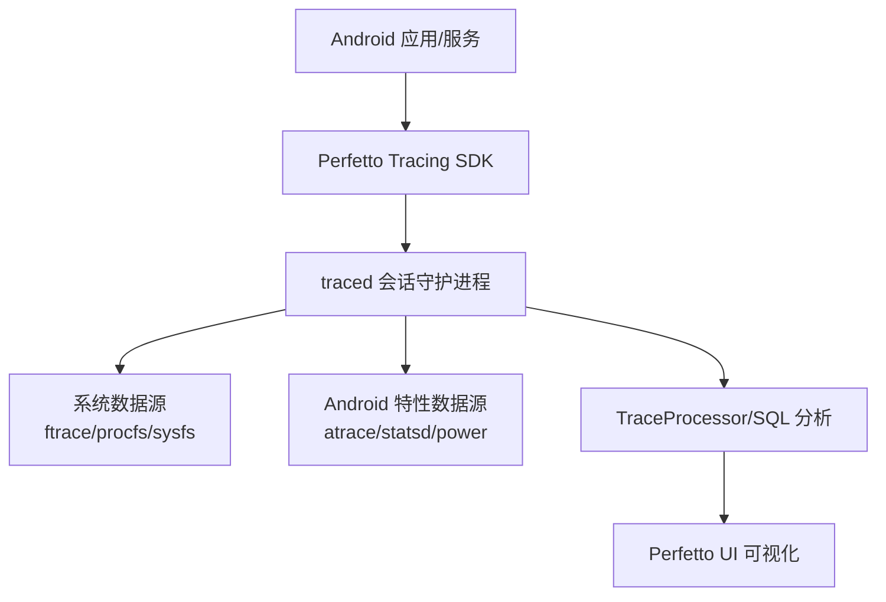
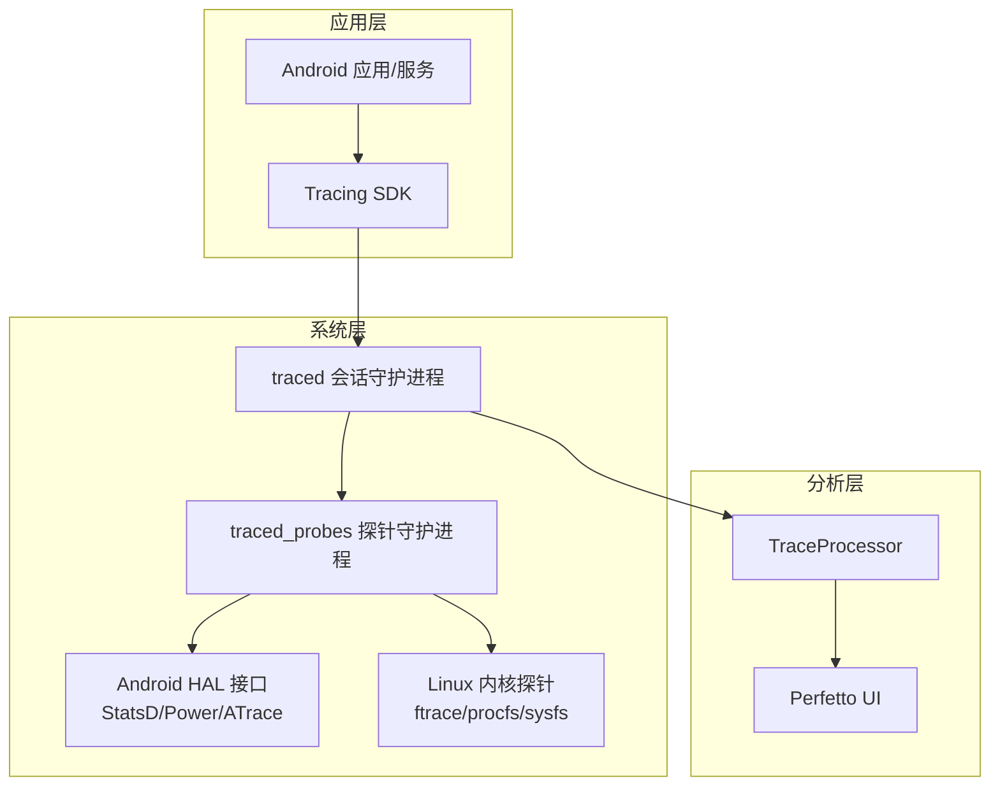
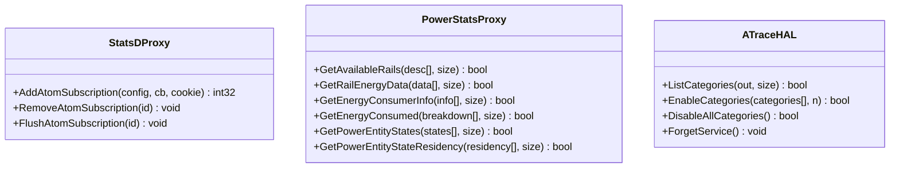
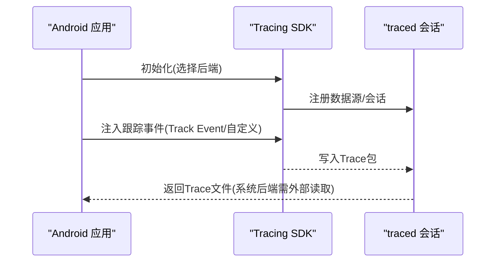
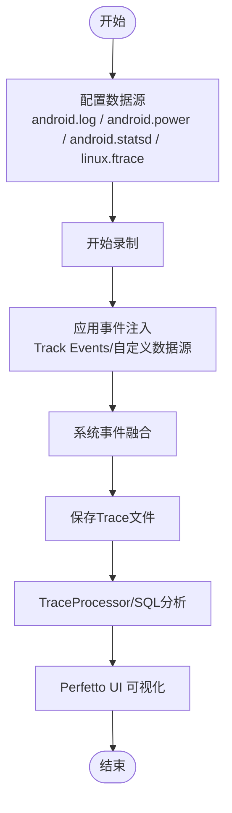
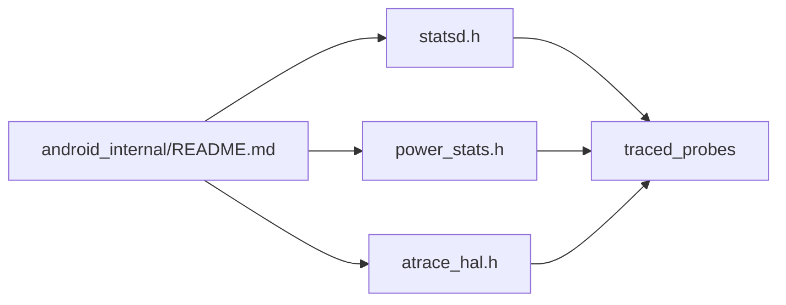

# Android集成

<cite>
**本文引用的文件**
- [README.md](file://README.md)
- [android-trace-analysis.md](file://docs/getting-started/android-trace-analysis.md)
- [tracing-sdk.md](file://docs/instrumentation/tracing-sdk.md)
- [android-version-notes.md](file://docs/reference/android-version-notes.md)
- [android.gni](file://gn/standalone/android.gni)
- [system-tracing.md](file://docs/getting-started/system-tracing.md)
- [android-log.md](file://docs/data-sources/android-log.md)
- [battery-counters.md](file://docs/data-sources/battery-counters.md)
- [syscalls.md](file://docs/data-sources/syscalls.md)
- [statsd.h](file://src/android_internal/statsd.h)
- [power_stats.h](file://src/android_internal/power_stats.h)
- [atrace_hal.h](file://src/android_internal/atrace_hal.h)
- [README.md（android_internal）](file://src/android_internal/README.md)
</cite>

## 目录
1. [简介](#简介)
2. [项目结构](#项目结构)
3. [核心组件](#核心组件)
4. [架构总览](#架构总览)
5. [详细组件分析](#详细组件分析)
6. [依赖关系分析](#依赖关系分析)
7. [性能考量](#性能考量)
8. [故障排除指南](#故障排除指南)
9. [结论](#结论)
10. [附录](#附录)

## 简介
本技术文档面向在Android平台上集成与使用Perfetto进行系统级与应用级性能分析的工程师与开发者。内容覆盖：
- Android平台特性与集成方式：系统服务集成、HAL接口、平台特定优化
- Android SDK使用：JNI接口、原生库集成、应用集成策略
- Android特有追踪能力：系统属性监控、StatsD日志集成、电源统计收集
- 完整的应用性能分析工作流：调试配置、追踪执行、结果分析
- 与Android调试工具链的集成：adb命令、DDMS工具、系统日志分析
- 性能调优建议、内存管理最佳实践、电池优化策略
- 故障排除指南与常见问题解决方案

Perfetto是Android与Chromium默认的追踪系统，支持在Android与Linux上采集系统级探针（调度、CPU频率、内存、系统调用等），并通过浏览器端UI与SQL分析引擎进行可视化与程序化分析。

**章节来源**
- [README.md:1-101](file://README.md#L1-L101)

## 项目结构
围绕Android集成的关键目录与文件：
- 文档与指南
  - docs/getting-started：系统追踪录制、Android追踪分析、SQL查询示例
  - docs/data-sources：Android日志、电池计数器、系统调用等数据源说明
  - docs/instrumentation：Tracing SDK使用指南
  - docs/reference：Android版本注意事项
- 平台与构建
  - gn/standalone/android.gni：Android NDK/ABI参数声明
- Android内部集成
  - src/android_internal：StatsD/HAL代理头文件与动态加载机制说明
- 示例与工具
  - examples/sdk：C++ SDK示例
  - python/tools：record_android_trace等实用脚本

**图表来源**
- [system-tracing.md:1-302](file://docs/getting-started/system-tracing.md#L1-L302)
- [tracing-sdk.md:1-419](file://docs/instrumentation/tracing-sdk.md#L1-L419)

**章节来源**
- [system-tracing.md:1-302](file://docs/getting-started/system-tracing.md#L1-L302)
- [tracing-sdk.md:1-419](file://docs/instrumentation/tracing-sdk.md#L1-L419)
- [gn/standalone/android.gni:1-62](file://gn/standalone/android.gni#L1-L62)

## 核心组件
- Tracing SDK（C++17）
  - 支持应用内事件注入（Track Events）、自定义数据源（Custom Data Sources）
  - 支持in-process与system两种后端模式，融合应用与系统事件
- traced/traced_probes
  - 系统会话守护进程与探针/互操作守护进程，负责采集ftrace、procfs/sysfs、Android HAL等
- 数据源与模块
  - Android日志、ATrace、StatsD、电池计数器、系统调用、CPU频率/调度等
- 分析与可视化
  - TraceProcessor + Perfetto SQL；Web UI本地渲染

**章节来源**
- [tracing-sdk.md:1-419](file://docs/instrumentation/tracing-sdk.md#L1-L419)
- [system-tracing.md:1-302](file://docs/getting-started/system-tracing.md#L1-L302)

## 架构总览
Android平台的Perfetto集成采用“应用侧SDK + 系统侧守护进程”的双层架构：
- 应用侧通过Tracing SDK注入事件，或通过系统后端与系统事件融合
- 系统侧由traced统一调度，traced_probes对接Android HAL与Linux内核探针
- 数据经TraceProcessor解析，最终在UI中呈现

**图表来源**
- [system-tracing.md:1-302](file://docs/getting-started/system-tracing.md#L1-L302)
- [README.md:1-101](file://README.md#L1-L101)
- [README.md（android_internal）:1-36](file://src/android_internal/README.md#L1-L36)

## 详细组件分析

### Android系统服务与HAL集成
- StatsD订阅与回调
  - 通过android_internal中的StatsD代理函数实现订阅、刷新与移除，避免直接依赖Android内部头文件
- 电源统计（PowerStats）
  - 提供轨道描述、能量消费分解、实体状态与驻留时间等接口，用于设备能耗分析
- ATrace HAL
  - 列举/启用/禁用厂商类别，桥接传统ATrace到Perfetto生态

**图表来源**
- [statsd.h:1-64](file://src/android_internal/statsd.h#L1-L64)
- [power_stats.h:1-137](file://src/android_internal/power_stats.h#L1-L137)
- [atrace_hal.h:1-62](file://src/android_internal/atrace_hal.h#L1-L62)

**章节来源**
- [statsd.h:1-64](file://src/android_internal/statsd.h#L1-L64)
- [power_stats.h:1-137](file://src/android_internal/power_stats.h#L1-L137)
- [atrace_hal.h:1-62](file://src/android_internal/atrace_hal.h#L1-L62)
- [README.md（android_internal）:1-36](file://src/android_internal/README.md#L1-L36)

### Android SDK与JNI接口
- SDK集成
  - 提供单头/单源聚合文件，支持CMake构建；可选择in-process或system后端
  - Track Events适合轻量级应用事件；自定义数据源适用于高吞吐/强类型场景
- JNI与原生库
  - Android NDK参数在gn/standalone/android.gni中声明，支持arm/arm64/x86/x64
  - 建议在应用工程中以静态库形式集成perfetto.cc，并链接线程库
- 应用集成策略
  - 在应用启动时初始化Tracing，按需启用track_event或自定义数据源
  - 使用系统后端时，通过perfetto CLI控制会话生命周期

**图表来源**
- [tracing-sdk.md:1-419](file://docs/instrumentation/tracing-sdk.md#L1-L419)
- [gn/standalone/android.gni:1-62](file://gn/standalone/android.gni#L1-L62)

**章节来源**
- [tracing-sdk.md:1-419](file://docs/instrumentation/tracing-sdk.md#L1-L419)
- [gn/standalone/android.gni:1-62](file://gn/standalone/android.gni#L1-L62)

### Android特有追踪功能
- 系统日志（android.log）
  - 录制logd事件，支持按优先级、标签、缓冲区过滤，UI中显示摘要与表格
- StatsD日志集成
  - 通过StatsD订阅接口接收原子事件，结合TraceProcessor模块进行分析
- 电源统计（android.power）
  - 电池计数器：容量百分比、电荷微安时、瞬时电流
  - 电源轨监控（ODPM）：按硬件子系统拆分能耗
- 系统调用（syscalls）
  - 记录syscall号，支持跨线程切片分析

**图表来源**
- [android-log.md:1-76](file://docs/data-sources/android-log.md#L1-L76)
- [battery-counters.md:1-169](file://docs/data-sources/battery-counters.md#L1-L169)
- [syscalls.md:1-55](file://docs/data-sources/syscalls.md#L1-L55)
- [system-tracing.md:1-302](file://docs/getting-started/system-tracing.md#L1-L302)

**章节来源**
- [android-log.md:1-76](file://docs/data-sources/android-log.md#L1-L76)
- [battery-counters.md:1-169](file://docs/data-sources/battery-counters.md#L1-L169)
- [syscalls.md:1-55](file://docs/data-sources/syscalls.md#L1-L55)
- [system-tracing.md:1-302](file://docs/getting-started/system-tracing.md#L1-L302)

### Android应用性能分析工作流
- 调试配置
  - 选择录制模式（停止满/环形缓冲/长trace）、缓冲大小、最大时长
  - 启用CPU调度/频率、ATrace用户空间注解、EventLog(logcat)
- 追踪执行
  - 通过Perfetto UI或record_android_trace脚本执行录制
- 结果分析
  - 使用SQL模块化查询（Android进程元数据、内存、CPU利用率、后台任务状态等）
  - 将查询结果映射到Timeline进行定位

**章节来源**
- [system-tracing.md:1-302](file://docs/getting-started/system-tracing.md#L1-L302)
- [android-trace-analysis.md:1-672](file://docs/getting-started/android-trace-analysis.md#L1-L672)

### 与Android调试工具链集成
- adb命令
  - 使用adb连接设备，配合record_android_trace脚本进行录制与拉取
- DDMS工具
  - 可与Perfetto UI联动查看系统日志与事件
- 系统日志分析
  - android.log数据源与logcat等价，支持过滤与同步时间轴展示

**章节来源**
- [system-tracing.md:1-302](file://docs/getting-started/system-tracing.md#L1-L302)
- [android-log.md:1-76](file://docs/data-sources/android-log.md#L1-L76)

## 依赖关系分析
- 组件耦合
  - traced_probes与Android HAL之间通过独立.so与C接口解耦，避免链接重定位开销
  - StatsD/Power/ATrace代理头文件仅暴露C接口，避免名称修饰与类型外泄
- 外部依赖
  - Android NDK工具链参数在android.gni中集中声明，确保跨架构一致性
- 潜在循环依赖
  - android_internal目录目标为叶子节点，禁止对perfetto目标产生ODR风险

**图表来源**
- [README.md（android_internal）:1-36](file://src/android_internal/README.md#L1-L36)
- [statsd.h:1-64](file://src/android_internal/statsd.h#L1-L64)
- [power_stats.h:1-137](file://src/android_internal/power_stats.h#L1-L137)
- [atrace_hal.h:1-62](file://src/android_internal/atrace_hal.h#L1-L62)

**章节来源**
- [README.md（android_internal）:1-36](file://src/android_internal/README.md#L1-L36)
- [statsd.h:1-64](file://src/android_internal/statsd.h#L1-L64)
- [power_stats.h:1-137](file://src/android_internal/power_stats.h#L1-L137)
- [atrace_hal.h:1-62](file://src/android_internal/atrace_hal.h#L1-L62)

## 性能考量
- 录制模式选择
  - 环形缓冲：适合短时高负载场景，避免丢弃关键事件
  - 长trace：适合长时间观测，注意磁盘与内存占用
- 数据源裁剪
  - 仅启用必要数据源，减少Trace体积与解析开销
- 缓冲与持久化
  - 合理设置缓冲大小与最大时长，平衡实时性与完整性
- UI与分析
  - 大型Trace建议离线分析，避免浏览器卡顿

[本节为通用指导，不直接分析具体文件]

## 故障排除指南
- Android版本差异
  - 不同Android版本存在功能差异与限制，需参考版本注意事项
- StatsD订阅异常
  - 确认订阅配置正确、回调cookie传递无误、订阅ID唯一
- 电源统计不可用
  - 设备需具备相应硬件支持；ODPM在部分机型尚未普及
- ATrace类别不可用
  - 某些厂商类别需动态加载，确认已启用对应HAL接口
- 旧版设备兼容
  - 部分配置项在旧版本不支持，需降级或调整

**章节来源**
- [android-version-notes.md:1-33](file://docs/reference/android-version-notes.md#L1-L33)
- [statsd.h:1-64](file://src/android_internal/statsd.h#L1-L64)
- [power_stats.h:1-137](file://src/android_internal/power_stats.h#L1-L137)
- [atrace_hal.h:1-62](file://src/android_internal/atrace_hal.h#L1-L62)

## 结论
Perfetto在Android平台提供了从应用到系统的全栈追踪能力。通过Tracing SDK与系统守护进程的协同，结合StatsD、电源统计与系统日志等Android特有能力，能够高效定位性能瓶颈、分析内存与电量消耗，并与adb/DDMS/系统日志形成完整的调试闭环。遵循本文的工作流与最佳实践，可在保证低开销的前提下获得高质量的性能洞察。

[本节为总结性内容，不直接分析具体文件]

## 附录
- 关键术语
  - StatsD：Android系统统计事件推送框架
  - HAL：硬件抽象层，提供系统服务访问接口
  - ODPM：设备侧电源轨监控
- 参考路径
  - Android日志数据源：[android-log.md](file://docs/data-sources/android-log.md)
  - 电池计数器数据源：[battery-counters.md](file://docs/data-sources/battery-counters.md)
  - 系统调用数据源：[syscalls.md](file://docs/data-sources/syscalls.md)
  - Android版本注意事项：[android-version-notes.md](file://docs/reference/android-version-notes.md)

[本节为补充信息，不直接分析具体文件]