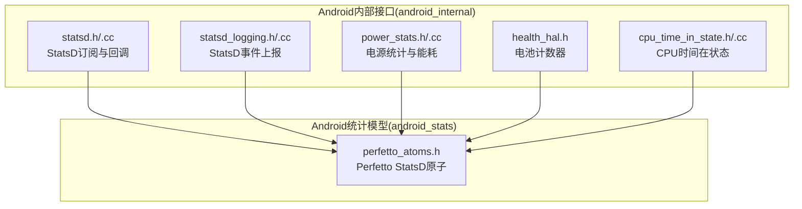
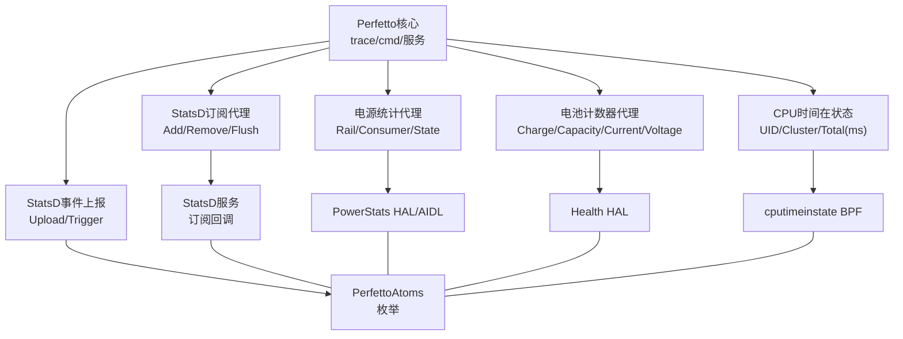
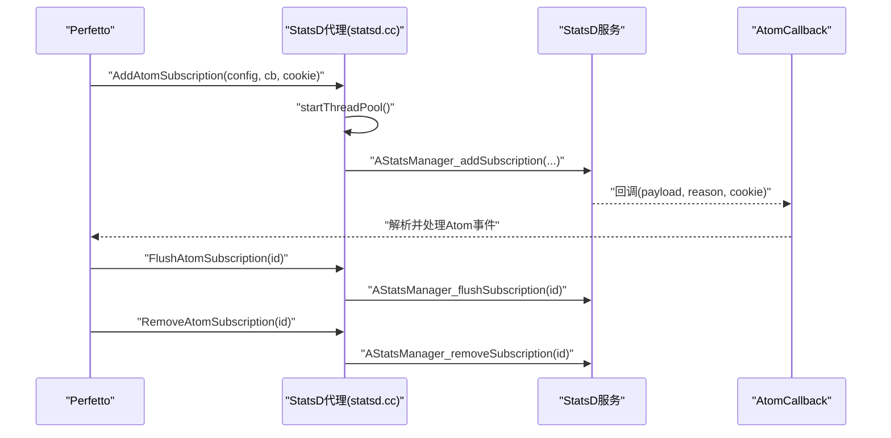
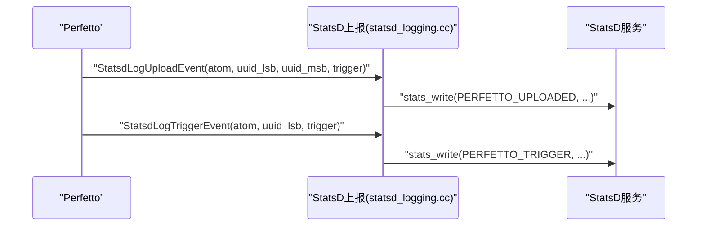
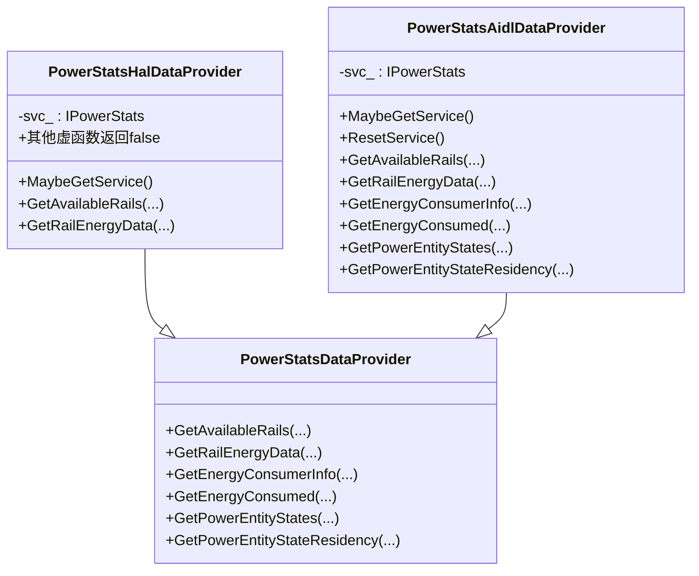
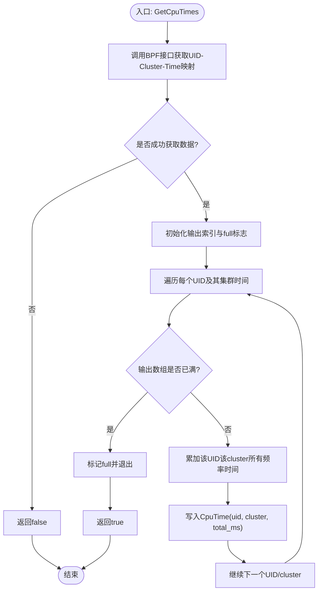
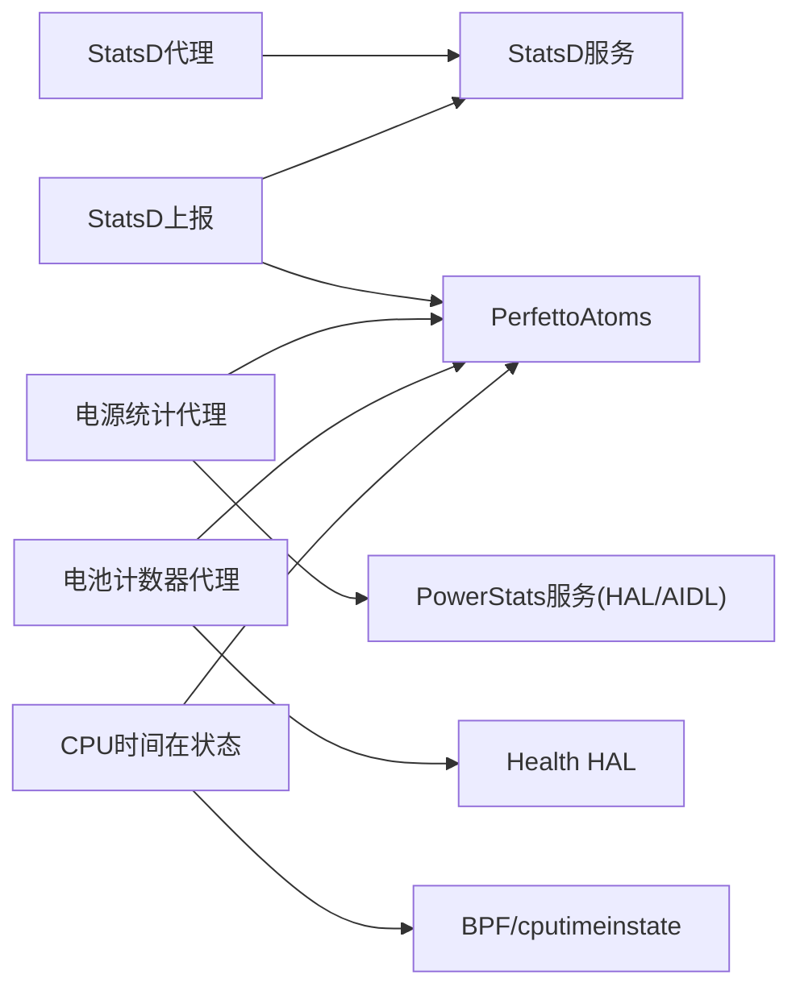

# 平台特定功能

<cite>
**本文引用的文件**
- [src/android_internal/statsd.h](file://src/android_internal/statsd.h)
- [src/android_internal/statsd.cc](file://src/android_internal/statsd.cc)
- [src/android_internal/statsd_logging.h](file://src/android_internal/statsd_logging.h)
- [src/android_internal/statsd_logging.cc](file://src/android_internal/statsd_logging.cc)
- [src/android_stats/perfetto_atoms.h](file://src/android_stats/perfetto_atoms.h)
- [src/android_internal/power_stats.h](file://src/android_internal/power_stats.h)
- [src/android_internal/power_stats.cc](file://src/android_internal/power_stats.cc)
- [src/android_internal/health_hal.h](file://src/android_internal/health_hal.h)
- [src/android_internal/cpu_time_in_state.h](file://src/android_internal/cpu_time_in_state.h)
- [src/android_internal/cpu_time_in_state.cc](file://src/android_internal/cpu_time_in_state.cc)
</cite>

## 目录
1. [简介](#简介)
2. [项目结构](#项目结构)
3. [核心组件](#核心组件)
4. [架构总览](#架构总览)
5. [详细组件分析](#详细组件分析)
6. [依赖关系分析](#依赖关系分析)
7. [性能考虑](#性能考虑)
8. [故障排除指南](#故障排除指南)
9. [结论](#结论)
10. [附录](#附录)

## 简介
本文件聚焦于Perfetto在Android平台上的特定功能与实现，涵盖以下方面：
- Android Atoms系统：系统事件捕获、原子级监控与性能指标采集路径
- StatsD日志集成：订阅回调、过滤、聚合统计与上报策略
- Android Log数据源：logcat集成、优先级过滤与实时监控
- 电池计数器：电源状态监控、能耗统计与电池健康评估
- 系统属性监控：属性变更跟踪、配置管理与动态调整
- 平台特定性能优化：内存池管理、线程调度优化与I/O优化
- 故障排除与调优建议

## 项目结构
围绕Android平台特定功能的相关代码主要位于以下目录与文件：
- android_internal：Android Binder/HAL代理层与平台能力封装（StatsD订阅、电源统计、健康计数器等）
- android_stats：Perfetto在StatsD侧使用的原子枚举定义
- 基础设施：Bazel/GN构建配置、文档与工具链支持

**图示来源**
- [src/android_internal/statsd.h:1-64](file://src/android_internal/statsd.h#L1-L64)
- [src/android_internal/statsd.cc:1-50](file://src/android_internal/statsd.cc#L1-L50)
- [src/android_internal/statsd_logging.h:1-47](file://src/android_internal/statsd_logging.h#L1-L47)
- [src/android_internal/statsd_logging.cc:1-50](file://src/android_internal/statsd_logging.cc#L1-L50)
- [src/android_stats/perfetto_atoms.h:1-145](file://src/android_stats/perfetto_atoms.h#L1-L145)
- [src/android_internal/power_stats.h:1-137](file://src/android_internal/power_stats.h#L1-L137)
- [src/android_internal/power_stats.cc:1-510](file://src/android_internal/power_stats.cc#L1-L510)
- [src/android_internal/health_hal.h:1-54](file://src/android_internal/health_hal.h#L1-L54)
- [src/android_internal/cpu_time_in_state.h:1-51](file://src/android_internal/cpu_time_in_state.h#L1-L51)
- [src/android_internal/cpu_time_in_state.cc:1-73](file://src/android_internal/cpu_time_in_state.cc#L1-L73)

**章节来源**
- [src/android_internal/statsd.h:1-64](file://src/android_internal/statsd.h#L1-L64)
- [src/android_internal/statsd.cc:1-50](file://src/android_internal/statsd.cc#L1-L50)
- [src/android_internal/statsd_logging.h:1-47](file://src/android_internal/statsd_logging.h#L1-L47)
- [src/android_internal/statsd_logging.cc:1-50](file://src/android_internal/statsd_logging.cc#L1-L50)
- [src/android_stats/perfetto_atoms.h:1-145](file://src/android_stats/perfetto_atoms.h#L1-L145)
- [src/android_internal/power_stats.h:1-137](file://src/android_internal/power_stats.h#L1-L137)
- [src/android_internal/power_stats.cc:1-510](file://src/android_internal/power_stats.cc#L1-L510)
- [src/android_internal/health_hal.h:1-54](file://src/android_internal/health_hal.h#L1-L54)
- [src/android_internal/cpu_time_in_state.h:1-51](file://src/android_internal/cpu_time_in_state.h#L1-L51)
- [src/android_internal/cpu_time_in_state.cc:1-73](file://src/android_internal/cpu_time_in_state.cc#L1-L73)

## 核心组件
- StatsD订阅与回调：通过Binder/HAL代理添加/移除/刷新订阅，回调中传递payload与reason
- StatsD事件上报：将上传与触发事件写入StatsD原子流，携带trace会话标识与触发名称
- 电源统计与能耗：统一抽象HAL/AIDL数据提供者，查询电能计量、消费者分解、实体状态与驻留时长
- 电池计数器：按类型读取电量、容量百分比、电流、电压等关键指标
- CPU时间在状态：聚合UID维度的CPU集群时间，用于功耗与时频分布分析
- Perfetto StatsD原子：定义上传、触发、守护栅栏等关键节点的原子枚举

**章节来源**
- [src/android_internal/statsd.h:36-56](file://src/android_internal/statsd.h#L36-L56)
- [src/android_internal/statsd.cc:25-46](file://src/android_internal/statsd.cc#L25-L46)
- [src/android_internal/statsd_logging.h:30-39](file://src/android_internal/statsd_logging.h#L30-L39)
- [src/android_internal/statsd_logging.cc:25-47](file://src/android_internal/statsd_logging.cc#L25-L47)
- [src/android_stats/perfetto_atoms.h:24-140](file://src/android_stats/perfetto_atoms.h#L24-L140)
- [src/android_internal/power_stats.h:103-129](file://src/android_internal/power_stats.h#L103-L129)
- [src/android_internal/power_stats.cc:127-152](file://src/android_internal/power_stats.cc#L127-L152)
- [src/android_internal/health_hal.h:32-46](file://src/android_internal/health_hal.h#L32-L46)
- [src/android_internal/cpu_time_in_state.h:32-44](file://src/android_internal/cpu_time_in_state.h#L32-L44)
- [src/android_internal/cpu_time_in_state.cc:31-69](file://src/android_internal/cpu_time_in_state.cc#L31-L69)

## 架构总览
下图展示Android平台特定功能的整体交互：Perfetto通过android_internal代理访问StatsD与硬件服务，使用android_stats中的原子枚举进行事件上报，并在trace生命周期的关键节点记录原子。

**图示来源**
- [src/android_internal/statsd.cc:25-46](file://src/android_internal/statsd.cc#L25-L46)
- [src/android_internal/statsd_logging.cc:25-47](file://src/android_internal/statsd_logging.cc#L25-L47)
- [src/android_stats/perfetto_atoms.h:24-140](file://src/android_stats/perfetto_atoms.h#L24-L140)
- [src/android_internal/power_stats.cc:127-152](file://src/android_internal/power_stats.cc#L127-L152)
- [src/android_internal/health_hal.h:32-46](file://src/android_internal/health_hal.h#L32-L46)
- [src/android_internal/cpu_time_in_state.cc:31-69](file://src/android_internal/cpu_time_in_state.cc#L31-L69)

## 详细组件分析

### 组件A：StatsD订阅与回调（Android Atoms系统）
- 功能要点
  - 添加订阅：传入订阅配置字节流、回调函数指针与cookie，启动Binder线程池以接收回包
  - 移除订阅：根据订阅ID取消订阅
  - 刷新订阅：触发一次数据推送
  - 回调reason：区分初始化、刷新请求、订阅结束等场景
- 数据流
  - 订阅配置经Binder发送至StatsD服务
  - 服务端按周期或事件触发回调payload
  - Perfetto解析payload并映射到trace事件或指标

**图示来源**
- [src/android_internal/statsd.cc:25-46](file://src/android_internal/statsd.cc#L25-L46)
- [src/android_internal/statsd.h:36-56](file://src/android_internal/statsd.h#L36-L56)

**章节来源**
- [src/android_internal/statsd.h:36-56](file://src/android_internal/statsd.h#L36-L56)
- [src/android_internal/statsd.cc:25-46](file://src/android_internal/statsd.cc#L25-L46)

### 组件B：StatsD事件上报（原子级监控）
- 功能要点
  - Upload事件：记录trace上传相关原子，携带UUID与触发名称
  - Trigger事件：记录触发开始/停止等原子，携带UUID与触发名称
  - 与PerfettoAtoms枚举对齐，确保上报语义一致
- 数据流
  - 在trace生命周期关键节点调用上报函数
  - 写入StatsD原子流，供后续聚合与可视化

**图示来源**
- [src/android_internal/statsd_logging.cc:25-47](file://src/android_internal/statsd_logging.cc#L25-L47)
- [src/android_stats/perfetto_atoms.h:24-140](file://src/android_stats/perfetto_atoms.h#L24-L140)

**章节来源**
- [src/android_internal/statsd_logging.h:30-39](file://src/android_internal/statsd_logging.h#L30-L39)
- [src/android_internal/statsd_logging.cc:25-47](file://src/android_internal/statsd_logging.cc#L25-L47)
- [src/android_stats/perfetto_atoms.h:24-140](file://src/android_stats/perfetto_atoms.h#L24-L140)

### 组件C：电源统计与能耗（Battery Counters）
- 能力范围
  - 查询可用电能表（Rail）信息
  - 读取电能计量数据（能量累计、时间戳）
  - 获取能耗消费者信息与按UID分解的能耗
  - 获取电源实体状态与驻留时长
- 抽象设计
  - 统一PowerStatsDataProvider接口
  - 自动选择HAL或AIDL实现（按服务声明检测）
- 错误处理
  - AIDL事务错误（如服务死亡）会重置服务句柄，便于下次重建连接

**图示来源**
- [src/android_internal/power_stats.cc:46-108](file://src/android_internal/power_stats.cc#L46-L108)
- [src/android_internal/power_stats.cc:154-254](file://src/android_internal/power_stats.cc#L154-L254)
- [src/android_internal/power_stats.cc:256-504](file://src/android_internal/power_stats.cc#L256-L504)

**章节来源**
- [src/android_internal/power_stats.h:103-129](file://src/android_internal/power_stats.h#L103-L129)
- [src/android_internal/power_stats.cc:127-152](file://src/android_internal/power_stats.cc#L127-L152)
- [src/android_internal/power_stats.cc:256-504](file://src/android_internal/power_stats.cc#L256-L504)

### 组件D：电池计数器（Health HAL）
- 能力范围
  - 按类型读取电池计数器：充电量、容量百分比、电流、电流平均值、电压等
- 使用场景
  - 结合trace事件进行能耗归因与健康评估
  - 作为系统属性监控的补充输入

**章节来源**
- [src/android_internal/health_hal.h:32-46](file://src/android_internal/health_hal.h#L32-L46)

### 组件E：CPU时间在状态（CpuTimeInState）
- 能力范围
  - 聚合UID维度的CPU集群总时间（毫秒），用于功耗与时频分布分析
- 实现要点
  - 通过BPF接口获取最近更新时间戳
  - 遍历UID与集群，累加频率时间并转换为毫秒

**图示来源**
- [src/android_internal/cpu_time_in_state.cc:31-69](file://src/android_internal/cpu_time_in_state.cc#L31-L69)

**章节来源**
- [src/android_internal/cpu_time_in_state.h:32-44](file://src/android_internal/cpu_time_in_state.h#L32-L44)
- [src/android_internal/cpu_time_in_state.cc:31-69](file://src/android_internal/cpu_time_in_state.cc#L31-L69)

### 组件F：Android Log数据源（logcat集成）
- 说明
  - Android Log数据源在Perfetto中作为独立数据源存在，负责从logcat采集日志事件，支持优先级过滤与实时监控
  - 本仓库未包含该数据源的实现细节文件；相关内容可参考文档与配置项
- 参考
  - 文档：docs/data-sources/android-log.md、docs/data-sources/system-log.md

[本节为概念性说明，不直接分析具体文件，故无“章节来源”]

## 依赖关系分析
- 组件耦合
  - StatsD代理依赖StatsD HAL/AIDL接口与Binder线程池
  - 电源统计代理依赖Power HAL/AIDL接口与服务声明检测
  - 上报模块依赖PerfettoAtoms枚举保持原子语义一致
- 外部依赖
  - StatsD服务：订阅、回调、flush
  - PowerStats服务：电能计量、消费者、实体状态
  - Health HAL：电池计数器
  - BPF/cputimeinstate：CPU时间在状态

**图示来源**
- [src/android_internal/statsd.cc:25-46](file://src/android_internal/statsd.cc#L25-L46)
- [src/android_internal/statsd_logging.cc:25-47](file://src/android_internal/statsd_logging.cc#L25-L47)
- [src/android_internal/power_stats.cc:127-152](file://src/android_internal/power_stats.cc#L127-L152)
- [src/android_internal/health_hal.h:32-46](file://src/android_internal/health_hal.h#L32-L46)
- [src/android_internal/cpu_time_in_state.cc:31-69](file://src/android_internal/cpu_time_in_state.cc#L31-L69)
- [src/android_stats/perfetto_atoms.h:24-140](file://src/android_stats/perfetto_atoms.h#L24-L140)

**章节来源**
- [src/android_internal/statsd.cc:25-46](file://src/android_internal/statsd.cc#L25-L46)
- [src/android_internal/statsd_logging.cc:25-47](file://src/android_internal/statsd_logging.cc#L25-L47)
- [src/android_internal/power_stats.cc:127-152](file://src/android_internal/power_stats.cc#L127-L152)
- [src/android_internal/health_hal.h:32-46](file://src/android_internal/health_hal.h#L32-L46)
- [src/android_internal/cpu_time_in_state.cc:31-69](file://src/android_internal/cpu_time_in_state.cc#L31-L69)
- [src/android_stats/perfetto_atoms.h:24-140](file://src/android_stats/perfetto_atoms.h#L24-L140)

## 性能考虑
- 内存池管理
  - 使用固定大小缓冲区与可复用容器，避免频繁分配
  - 对大数组查询采用就地填充与上限控制，减少拷贝
- 线程调度优化
  - StatsD订阅需启动Binder线程池以保证回调及时到达
  - 电源统计AIDL调用失败时重置服务句柄，降低阻塞风险
- I/O优化
  - 电源统计与CPU时间在状态均通过BPF/HAL接口批量读取，避免逐条查询
  - 输出前先计算最大可写元素个数，减少无效迭代

[本节为通用性能建议，不直接分析具体文件，故无“章节来源”]

## 故障排除指南
- StatsD订阅无回调
  - 确认已调用启动线程池的入口
  - 检查订阅配置与回调签名一致性
- AIDL调用失败或服务死亡
  - 观察事务错误码，代理层会自动重置服务句柄
  - 重试获取服务后再次发起查询
- 电源统计返回空数据
  - 确认设备是否满足HAL/AIDL版本要求
  - 检查服务声明与权限
- CPU时间在状态未返回数据
  - 确认BPF接口可用与内核支持
  - 检查UID集合与集群数量是否为空

**章节来源**
- [src/android_internal/statsd.cc:25-46](file://src/android_internal/statsd.cc#L25-L46)
- [src/android_internal/power_stats.cc:282-286](file://src/android_internal/power_stats.cc#L282-L286)
- [src/android_internal/power_stats.cc:350-356](file://src/android_internal/power_stats.cc#L350-L356)
- [src/android_internal/cpu_time_in_state.cc:31-69](file://src/android_internal/cpu_time_in_state.cc#L31-L69)

## 结论
Perfetto在Android平台通过android_internal代理层实现了对StatsD、电源统计、健康计数器与CPU时间在状态等关键能力的统一接入。配合android_stats中的原子枚举，形成从事件采集、原子级监控到上报与可视化的完整闭环。上述组件具备良好的错误恢复与兼容性（HAL/AIDL双栈），适合在生产环境中稳定运行。

## 附录
- 相关文档
  - Android Log数据源：docs/data-sources/android-log.md、docs/data-sources/system-log.md
  - Battery Counters：docs/data-sources/battery-counters.md
  - 其他数据源与概念参见docs/data-sources与docs/concepts

[本节为概览性内容，不直接分析具体文件，故无“章节来源”]