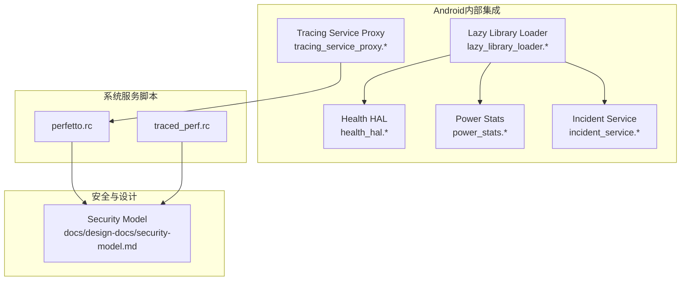
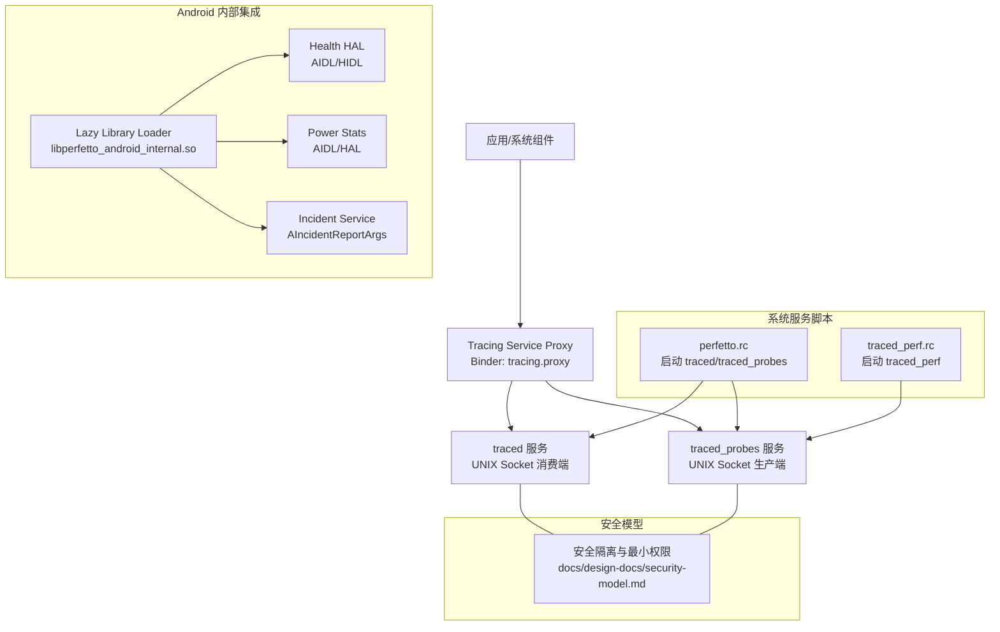
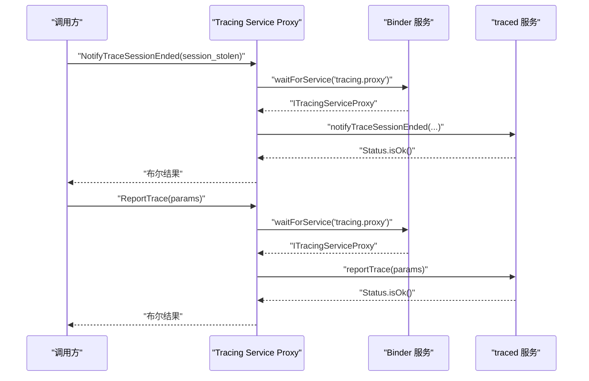
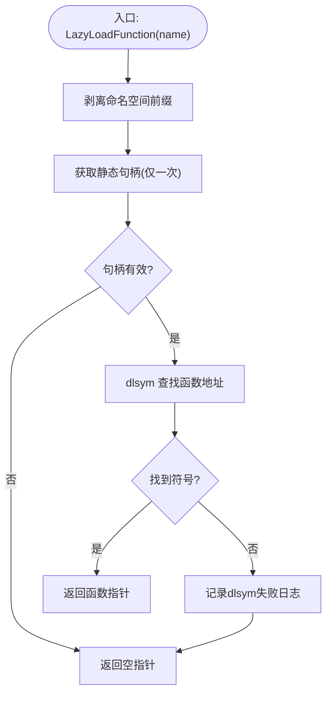
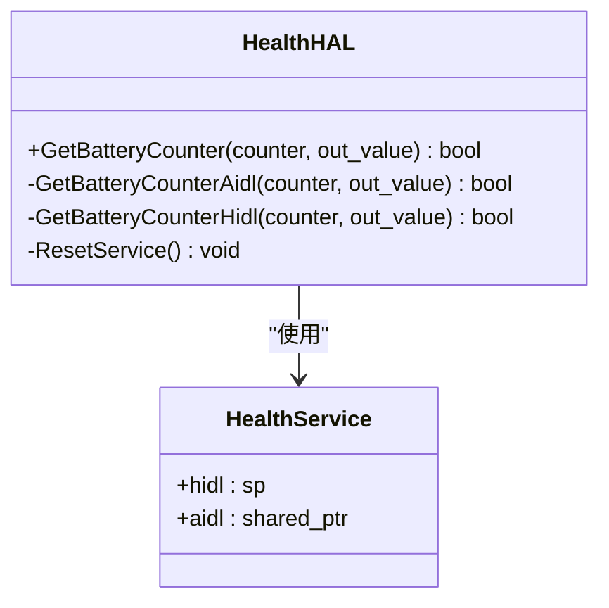
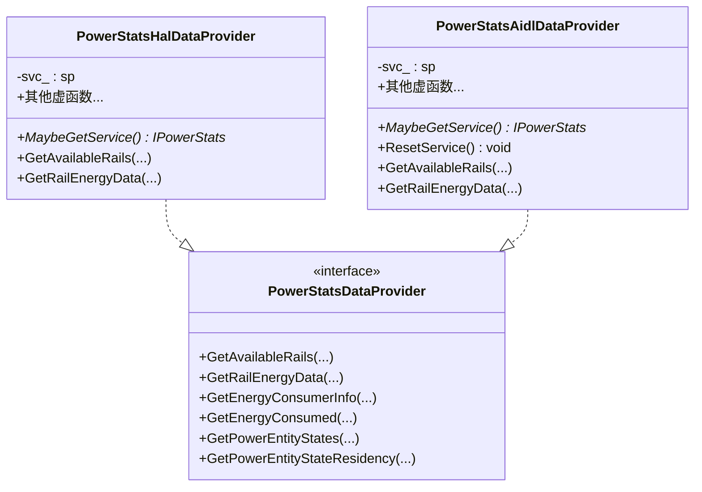
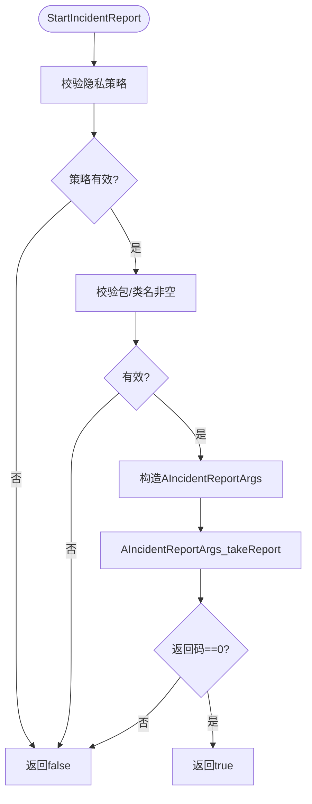
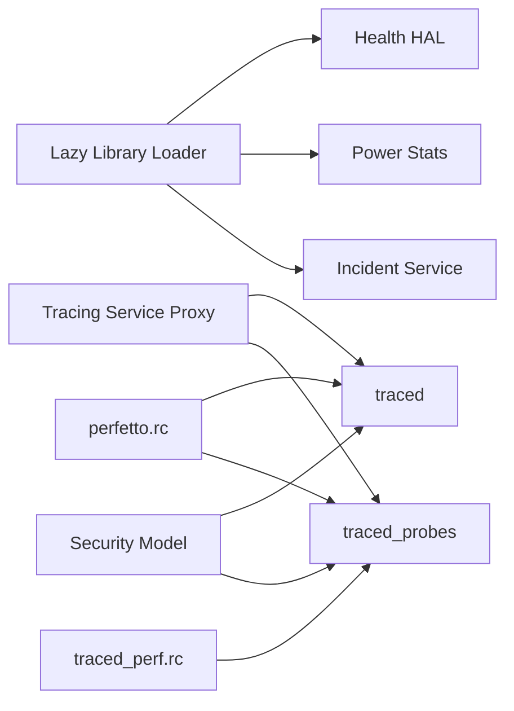

# 系统服务集成

<cite>
**本文引用的文件**
- [tracing_service_proxy.h](file://src/android_internal/tracing_service_proxy.h)
- [tracing_service_proxy.cc](file://src/android_internal/tracing_service_proxy.cc)
- [lazy_library_loader.h](file://src/android_internal/lazy_library_loader.h)
- [lazy_library_loader.cc](file://src/android_internal/lazy_library_loader.cc)
- [health_hal.h](file://src/android_internal/health_hal.h)
- [health_hal.cc](file://src/android_internal/health_hal.cc)
- [power_stats.h](file://src/android_internal/power_stats.h)
- [power_stats.cc](file://src/android_internal/power_stats.cc)
- [incident_service.h](file://src/android_internal/incident_service.h)
- [incident_service.cc](file://src/android_internal/incident_service.cc)
- [perfetto.rc](file://perfetto.rc)
- [traced_perf.rc](file://traced_perf.rc)
- [security-model.md](file://docs/design-docs/security-model.md)
</cite>

## 目录
1. [引言](#引言)
2. [项目结构](#项目结构)
3. [核心组件](#核心组件)
4. [架构总览](#架构总览)
5. [详细组件分析](#详细组件分析)
6. [依赖关系分析](#依赖关系分析)
7. [性能考量](#性能考量)
8. [故障排除指南](#故障排除指南)
9. [结论](#结论)
10. [附录](#附录)

## 引言
本文件面向在Android平台上集成Perfetto系统服务的工程师与测试人员，聚焦以下主题：
- Tracing Service代理的实现机制：服务发现、连接建立与生命周期管理
- Lazy Library Loader的工作原理：动态库加载策略、版本兼容性与错误处理
- Health HAL与Power Stats的集成：硬件抽象层接口、电源统计采集与系统健康监控
- 系统服务启动流程、权限管理与安全隔离机制
- 服务崩溃恢复、资源清理与性能监控最佳实践
- 常见异常、内存泄漏与性能问题的诊断方法

## 项目结构
本仓库采用按功能域分层的组织方式，Android内部集成代码主要位于src/android_internal目录，系统服务的启动脚本位于根目录的*.rc文件中。下图展示与本主题直接相关的模块与文件：

**图表来源**
- [tracing_service_proxy.cc:36-82](file://src/android_internal/tracing_service_proxy.cc#L36-L82)
- [lazy_library_loader.cc:40-76](file://src/android_internal/lazy_library_loader.cc#L40-L76)
- [health_hal.cc:32-170](file://src/android_internal/health_hal.cc#L32-L170)
- [power_stats.cc:110-152](file://src/android_internal/power_stats.cc#L110-L152)
- [incident_service.cc:31-54](file://src/android_internal/incident_service.cc#L31-L54)
- [perfetto.rc:15-101](file://perfetto.rc#L15-L101)
- [traced_perf.rc:23-49](file://traced_perf.rc#L23-L49)
- [security-model.md:1-31](file://docs/design-docs/security-model.md#L1-L31)

**章节来源**
- [perfetto.rc:15-101](file://perfetto.rc#L15-L101)
- [traced_perf.rc:23-49](file://traced_perf.rc#L23-L49)

## 核心组件
- Tracing Service代理：通过Binder服务名“tracing.proxy”发现并调用通知会话结束与上报Trace的能力，封装参数与状态返回。
- Lazy Library Loader：延迟加载libperfetto_android_internal.so中的符号，支持命名空间剥离与一次性加载策略，并在非Android构建环境下进行严格限制。
- Health HAL：统一访问AIDL与HIDL的电池计数器接口，自动回退到旧版HIDL，保证兼容性。
- Power Stats：适配Android S之前的HAL与之后的AIDL接口，统一Rail、能耗、实体状态等数据的采集与转换。
- Incident Service：封装incident报告的发起参数与隐私策略，简化上层调用。

**章节来源**
- [tracing_service_proxy.h:25-38](file://src/android_internal/tracing_service_proxy.h#L25-L38)
- [tracing_service_proxy.cc:40-82](file://src/android_internal/tracing_service_proxy.cc#L40-L82)
- [lazy_library_loader.h:26-41](file://src/android_internal/lazy_library_loader.h#L26-L41)
- [lazy_library_loader.cc:42-76](file://src/android_internal/lazy_library_loader.cc#L42-L76)
- [health_hal.h:32-48](file://src/android_internal/health_hal.h#L32-L48)
- [health_hal.cc:53-170](file://src/android_internal/health_hal.cc#L53-L170)
- [power_stats.h:103-130](file://src/android_internal/power_stats.h#L103-L130)
- [power_stats.cc:110-152](file://src/android_internal/power_stats.cc#L110-L152)
- [incident_service.h:34-37](file://src/android_internal/incident_service.h#L34-L37)
- [incident_service.cc:31-54](file://src/android_internal/incident_service.cc#L31-L54)

## 架构总览
下图展示了从应用或系统组件到Tracing Service代理、再到系统服务与硬件抽象层的整体交互路径，以及安全隔离与启动控制的关键节点。

**图表来源**
- [tracing_service_proxy.cc:36-82](file://src/android_internal/tracing_service_proxy.cc#L36-L82)
- [perfetto.rc:15-101](file://perfetto.rc#L15-L101)
- [traced_perf.rc:23-49](file://traced_perf.rc#L23-L49)
- [security-model.md:1-31](file://docs/design-docs/security-model.md#L1-L31)

## 详细组件分析

### 组件一：Tracing Service代理（服务发现、连接与生命周期）
- 服务发现与调用
  - 使用waitForService按名称“tracing.proxy”获取ITracingServiceProxy实例
  - 调用notifyTraceSessionEnded与reportTrace，封装TraceReportParams并传递文件描述符
- 生命周期管理
  - 通过perfetto.rc中的属性开关控制traced/traced_probes的启停
  - traced_probes在崩溃后通过onrestart执行后台清理任务，确保procfs配置被恢复
- 错误处理
  - 返回值基于Status.isOk()判断；reportTrace失败时记录错误日志

**图表来源**
- [tracing_service_proxy.cc:40-82](file://src/android_internal/tracing_service_proxy.cc#L40-L82)

**章节来源**
- [tracing_service_proxy.h:25-38](file://src/android_internal/tracing_service_proxy.h#L25-L38)
- [tracing_service_proxy.cc:40-82](file://src/android_internal/tracing_service_proxy.cc#L40-L82)
- [perfetto.rc:40-54](file://perfetto.rc#L40-L54)

### 组件二：Lazy Library Loader（动态库加载策略、版本兼容与错误处理）
- 加载策略
  - 仅在首次调用时通过dlopen加载libperfetto_android_internal.so，且使用RTLD_NOW立即解析符号
  - 符号名支持带命名空间的全限定名，内部剥离命名空间后查找
- 版本兼容性
  - 非Android构建环境默认禁用，可通过环境变量强制启用（不建议用于生产）
- 错误处理
  - dlopen/dlsym失败时记录日志；在Windows平台直接触发断言

**图表来源**
- [lazy_library_loader.cc:42-76](file://src/android_internal/lazy_library_loader.cc#L42-L76)

**章节来源**
- [lazy_library_loader.h:26-41](file://src/android_internal/lazy_library_loader.h#L26-L41)
- [lazy_library_loader.cc:42-76](file://src/android_internal/lazy_library_loader.cc#L42-L76)

### 组件三：Health HAL（电池计数器接口与回退机制）
- 接口能力
  - 支持多种电池计数器类型（电荷、容量百分比、电流、平均电流、电压）
- 访问路径
  - 优先尝试AIDL IHealth服务；若不可用则回退至HIDL V2_0::IHealth
  - 对于AIDL/HIDL调用均处理死对象与回调状态，必要时重置服务缓存
- 数据转换
  - 电压单位从mV转换为uV以满足框架期望

**图表来源**
- [health_hal.cc:32-51](file://src/android_internal/health_hal.cc#L32-L51)
- [health_hal.cc:158-170](file://src/android_internal/health_hal.cc#L158-L170)

**章节来源**
- [health_hal.h:32-48](file://src/android_internal/health_hal.h#L32-L48)
- [health_hal.cc:53-170](file://src/android_internal/health_hal.cc#L53-L170)

### 组件四：Power Stats（电源统计采集与多代接口适配）
- 统一数据模型
  - 提供Rail、能耗、消费者信息、实体状态与驻留时间等结构体
- 多代接口适配
  - Android S之前：使用android::hardware::power::stats::V1_0::IPowerStats（HAL）
  - Android S及以上：使用android::hardware::power::stats::IPowerStats（AIDL）
- 数据采集流程
  - 通过IServiceManager检测AIDL接口可用性，选择对应实现
  - AIDL路径对DEAD_OBJECT进行捕获并重置服务句柄，提升鲁棒性
  - 将结果映射到统一的数据结构，保证上层调用一致性

**图表来源**
- [power_stats.cc:46-123](file://src/android_internal/power_stats.cc#L46-L123)
- [power_stats.cc:159-164](file://src/android_internal/power_stats.cc#L159-L164)
- [power_stats.cc:257-267](file://src/android_internal/power_stats.cc#L257-L267)

**章节来源**
- [power_stats.h:103-130](file://src/android_internal/power_stats.h#L103-L130)
- [power_stats.cc:110-152](file://src/android_internal/power_stats.cc#L110-L152)
- [power_stats.cc:159-252](file://src/android_internal/power_stats.cc#L159-L252)
- [power_stats.cc:257-504](file://src/android_internal/power_stats.cc#L257-L504)

### 组件五：Incident Service（事件上报与隐私策略）
- 参数校验
  - 校验隐私策略与目标包/类名的有效性
- 报告发起
  - 构造AIncidentReportArgs，设置接收者、隐私策略与数据段
  - 调用takeReport发起上报，返回错误码

**图表来源**
- [incident_service.cc:31-54](file://src/android_internal/incident_service.cc#L31-L54)

**章节来源**
- [incident_service.h:34-37](file://src/android_internal/incident_service.h#L34-L37)
- [incident_service.cc:31-54](file://src/android_internal/incident_service.cc#L31-L54)

## 依赖关系分析
- 组件耦合
  - Tracing Service代理依赖Binder服务发现与ITracingServiceProxy接口
  - Lazy Library Loader为Health HAL、Power Stats、Incident Service提供统一的符号加载入口
  - Power Stats同时依赖AIDL与HIDL接口，运行时根据系统版本选择
- 外部依赖与集成点
  - 系统服务由perfetto.rc与traced_perf.rc控制启停与权限
  - 安全模型强调对生产者与消费者的隔离与最小权限原则

**图表来源**
- [lazy_library_loader.cc:42-76](file://src/android_internal/lazy_library_loader.cc#L42-L76)
- [health_hal.cc:32-51](file://src/android_internal/health_hal.cc#L32-L51)
- [power_stats.cc:110-123](file://src/android_internal/power_stats.cc#L110-L123)
- [incident_service.cc:31-54](file://src/android_internal/incident_service.cc#L31-L54)
- [tracing_service_proxy.cc:40-82](file://src/android_internal/tracing_service_proxy.cc#L40-L82)
- [perfetto.rc:15-101](file://perfetto.rc#L15-L101)
- [traced_perf.rc:23-49](file://traced_perf.rc#L23-L49)
- [security-model.md:1-31](file://docs/design-docs/security-model.md#L1-L31)

**章节来源**
- [perfetto.rc:15-101](file://perfetto.rc#L15-L101)
- [traced_perf.rc:23-49](file://traced_perf.rc#L23-L49)
- [security-model.md:1-31](file://docs/design-docs/security-model.md#L1-L31)

## 性能考量
- 动态库加载
  - 一次性加载与RTLD_NOW可减少运行时解析开销，但需避免频繁卸载导致的稳定性问题
- Binder调用
  - 在高频上报场景中，建议批量合并参数与复用文件描述符，降低跨进程调用次数
- 电源统计采集
  - AIDL路径对DEAD_OBJECT进行快速重置，避免阻塞后续请求
- 系统服务启动
  - traced_probes的onrestart清理逻辑有助于在崩溃后快速恢复，减少对trace数据的影响

[本节为通用指导，无需列出具体文件来源]

## 故障排除指南
- Tracing Service代理
  - 现象：NotifyTraceSessionEnded/ReportTrace返回false
  - 排查：确认“tracing.proxy”服务是否可用；检查Status错误信息；验证文件描述符有效性
- Lazy Library Loader
  - 现象：dlopen/dlsym失败
  - 排查：确认目标库存在且ABI匹配；在非Android构建环境中避免强制启用；查看日志定位失败原因
- Health HAL
  - 现象：电池计数器读取失败或返回0
  - 排查：确认AIDL/HIDL服务可用性；处理死对象后重试；核对计数器类型与单位换算
- Power Stats
  - 现象：Rail/能耗数据为空或部分字段缺失
  - 排查：确认系统版本对应的接口（HAL/AIDL）；关注DEAD_OBJECT并重置服务；检查输入数组大小
- Incident Service
  - 现象：上报失败
  - 排查：确认隐私策略与包/类名参数；检查takeReport返回码
- 系统服务与权限
  - 现象：服务无法启动或无权限访问
  - 排查：核对perfetto.rc/traced_perf.rc中的用户组与capabilities；遵循安全模型的最小权限原则

**章节来源**
- [tracing_service_proxy.cc:40-82](file://src/android_internal/tracing_service_proxy.cc#L40-L82)
- [lazy_library_loader.cc:42-76](file://src/android_internal/lazy_library_loader.cc#L42-L76)
- [health_hal.cc:158-170](file://src/android_internal/health_hal.cc#L158-L170)
- [power_stats.cc:257-504](file://src/android_internal/power_stats.cc#L257-L504)
- [incident_service.cc:31-54](file://src/android_internal/incident_service.cc#L31-L54)
- [perfetto.rc:15-101](file://perfetto.rc#L15-L101)
- [traced_perf.rc:23-49](file://traced_perf.rc#L23-L49)
- [security-model.md:1-31](file://docs/design-docs/security-model.md#L1-L31)

## 结论
本文围绕Perfetto在Android系统中的服务集成，系统梳理了Tracing Service代理的服务发现与调用、Lazy Library Loader的一次性加载与兼容策略、Health HAL与Power Stats的多代接口适配与错误恢复、Incident Service的隐私策略与参数校验，并结合*.rc脚本与安全模型阐述了启动流程、权限管理与安全隔离。通过上述机制与最佳实践，可在复杂设备生态中稳定地采集系统级Trace与电源统计，支撑性能分析与健康监控。

[本节为总结性内容，无需列出具体文件来源]

## 附录
- 关键API与数据结构参考
  - Tracing Service代理：NotifyTraceSessionEnded、ReportTrace
  - Lazy Library Loader：LazyLoadFunction、PERFETTO_LAZY_LOAD宏
  - Health HAL：GetBatteryCounter、BatteryCounter枚举
  - Power Stats：RailDescriptor、RailEnergyData、EnergyConsumerInfo、EnergyEstimationBreakdown、PowerEntityState、PowerEntityStateResidency
  - Incident Service：StartIncidentReport

**章节来源**
- [tracing_service_proxy.h:25-38](file://src/android_internal/tracing_service_proxy.h#L25-L38)
- [lazy_library_loader.h:26-41](file://src/android_internal/lazy_library_loader.h#L26-L41)
- [health_hal.h:32-48](file://src/android_internal/health_hal.h#L32-L48)
- [power_stats.h:34-130](file://src/android_internal/power_stats.h#L34-L130)
- [incident_service.h:34-37](file://src/android_internal/incident_service.h#L34-L37)