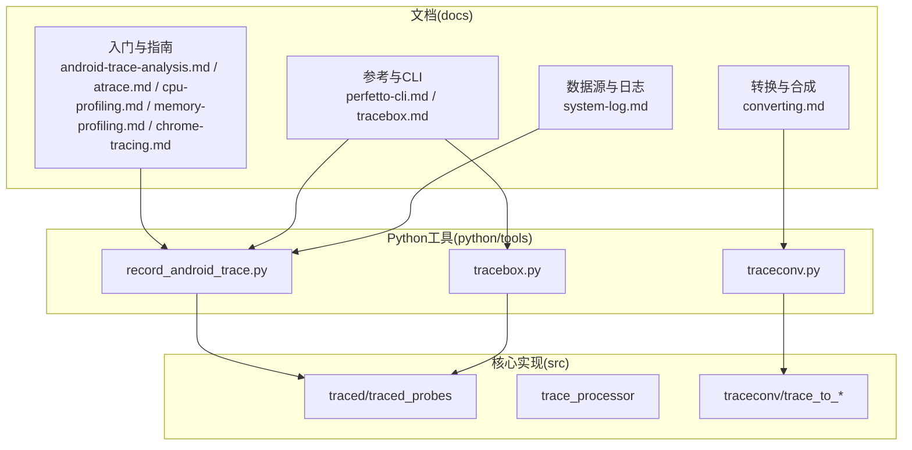
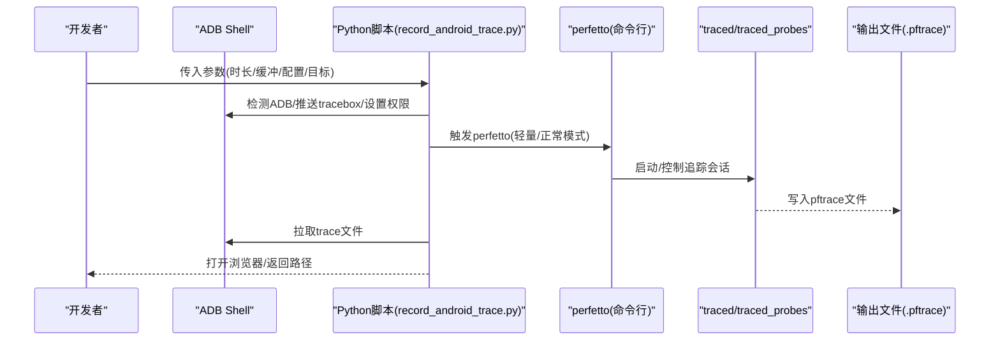
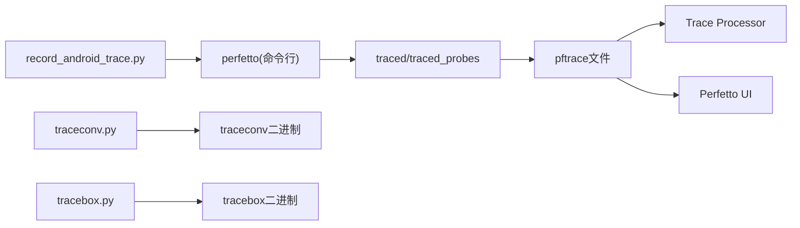
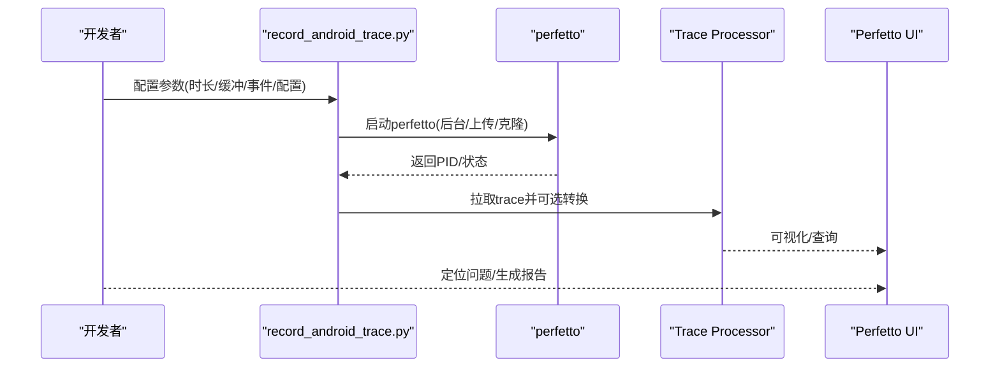

# 调试工具集成

<cite>
**本文引用的文件**
- [README.md](file://README.md)
- [android-trace-analysis.md](file://docs/getting-started/android-trace-analysis.md)
- [perfetto-cli.md](file://docs/reference/perfetto-cli.md)
- [record_android_trace.py](file://python/tools/record_android_trace.py)
- [traceconv.py](file://python/tools/traceconv.py)
- [atrace.md](file://docs/getting-started/atrace.md)
- [chrome-tracing.md](file://docs/getting-started/chrome-tracing.md)
- [system-log.md](file://docs/data-sources/system-log.md)
- [memory-profiling.md](file://docs/getting-started/memory-profiling.md)
- [cpu-profiling.md](file://docs/getting-started/cpu-profiling.md)
- [tracebox.md](file://docs/reference/tracebox.md)
- [tracebox.py](file://python/tools/tracebox.py)
- [converting.md](file://docs/getting-started/converting.md)
</cite>

## 目录
1. [简介](#简介)
2. [项目结构](#项目结构)
3. [核心组件](#核心组件)
4. [架构总览](#架构总览)
5. [详细组件分析](#详细组件分析)
6. [依赖关系分析](#依赖关系分析)
7. [性能考量](#性能考量)
8. [故障排查指南](#故障排查指南)
9. [结论](#结论)
10. [附录](#附录)

## 简介
本指南面向在Android平台上进行系统与应用级性能调试与追踪分析的工程师，基于Perfetto工具链，覆盖从设备准备、追踪配置到结果解读的完整工作流；同时涵盖ADB命令行工具使用、Systrace集成（传统格式转换与新格式支持）、Chrome DevTools集成（远程调试、性能分析与内存监控）、Python脚本工具（自动化录制、批量处理与结果分析）、系统日志分析（logcat过滤、错误定位与性能问题诊断），以及调试环境搭建、工具链配置与常见问题解决方案，并提供性能瓶颈识别与优化建议。

## 项目结构
Perfetto是一个由多个组件构成的系统：高性能追踪守护进程、低开销追踪SDK、广泛的系统级探针、浏览器端UI、以及基于SQL的分析引擎。其文档与工具分布在以下关键目录中：
- docs：官方文档，包含入门、参考、数据源、可视化等章节
- python/tools：Python脚本工具，如记录Android追踪、转换trace、启动tracebox等
- src：核心实现（服务、解析器、转换器等）
- protos：Trace与配置的协议定义
- infra：CI/部署相关

**图表来源**
- [android-trace-analysis.md:1-672](file://docs/getting-started/android-trace-analysis.md#L1-L672)
- [perfetto-cli.md:1-215](file://docs/reference/perfetto-cli.md#L1-L215)
- [record_android_trace.py:1-545](file://python/tools/record_android_trace.py#L1-L545)
- [traceconv.py:1-34](file://python/tools/traceconv.py#L1-L34)
- [tracebox.py:1-34](file://python/tools/tracebox.py#L1-L34)
- [system-log.md:1-94](file://docs/data-sources/system-log.md#L1-L94)
- [converting.md:1-800](file://docs/getting-started/converting.md#L1-L800)

**章节来源**
- [README.md:1-101](file://README.md#L1-L101)

## 核心组件
- 追踪采集与服务
  - traced/traced_probes：系统级追踪服务与探针
  - perfetto CLI：命令行客户端，支持轻量模式（atrace/ftrace）与正常模式（完整配置）
  - tracebox：打包了traced、traced_probes与perfetto的自启/手动模式二合一工具
- 分析与可视化
  - Trace Processor：SQL查询与分析引擎
  - Perfetto UI：浏览器端可视化界面
- 数据源与日志
  - Android logcat、ATrace、ftrace、perf事件、内存与CPU计数器等
- 转换与合成
  - traceconv：trace转换工具（含pprof、systrace、文本等）
  - 自定义合成：将任意时间戳数据转换为Perfetto trace

**章节来源**
- [perfetto-cli.md:1-215](file://docs/reference/perfetto-cli.md#L1-L215)
- [tracebox.md:1-104](file://docs/reference/tracebox.md#L1-L104)
- [system-log.md:1-94](file://docs/data-sources/system-log.md#L1-L94)
- [converting.md:1-800](file://docs/getting-started/converting.md#L1-L800)

## 架构总览
下图展示了Android端典型追踪工作流：通过ADB与Python脚本触发perfetto，采集系统与应用数据，生成pftrace文件，再在UI或Trace Processor中分析。

**图表来源**
- [record_android_trace.py:241-440](file://python/tools/record_android_trace.py#L241-L440)
- [perfetto-cli.md:140-215](file://docs/reference/perfetto-cli.md#L140-L215)
- [tracebox.md:15-71](file://docs/reference/tracebox.md#L15-L71)

## 详细组件分析

### ADB与设备准备
- 设备连接与ADB
  - 使用脚本自动检测ADB路径，必要时使用随仓库提供的hermetic ADB
  - 支持指定ANDROID_SERIAL串号，便于多设备场景
- 权限与兼容性
  - 在旧版Android或sideload模式下，可能需要root或以特定用户运行
  - 对于老版本设备，tracebox会被推送到/data/local/tmp并以可执行权限运行
- 日志辅助
  - 录制期间拉起logcat perfetto子系统日志，便于问题定位

**章节来源**
- [record_android_trace.py:451-470](file://python/tools/record_android_trace.py#L451-L470)
- [record_android_trace.py:241-440](file://python/tools/record_android_trace.py#L241-L440)

### 追踪配置与执行（perfetto CLI）
- 轻量模式
  - 通过命令行参数直接启用atrace/ftrace事件，适合快速录制
  - 支持指定时长、环形缓冲区大小、应用级别atrace
- 正常模式
  - 使用配置文件（pbtxt或二进制proto），支持复杂数据源组合
  - 可启用android.log、ftrace、linux.perf、heapprofd等
- 服务控制
  - 支持后台录制、克隆现有会话、附加/分离、查询状态等

**章节来源**
- [perfetto-cli.md:140-215](file://docs/reference/perfetto-cli.md#L140-L215)

### Systrace集成（传统格式与新格式）
- 传统Systrace格式
  - 可通过traceconv将Perfetto trace转换为systrace兼容格式，便于旧工具链使用
- 新格式支持
  - Perfetto原生pftrace格式具备更丰富的数据与更强的分析能力
  - traceconv亦支持pprof等现代格式，利于与perf等生态对接

**章节来源**
- [traceconv.py:1-34](file://python/tools/traceconv.py#L1-L34)

### Chrome DevTools集成
- 在桌面Chrome上直接录制，支持跨标签页追踪
- Android端需开启系统级集成开关后方可录制Chrome trace
- 可通过UI选择目标平台与类别，或使用crossbench自动化

**章节来源**
- [chrome-tracing.md:1-83](file://docs/getting-started/chrome-tracing.md#L1-L83)

### Python脚本工具
- record_android_trace.py
  - 自动化录制：解析参数、推送/启动tracebox、拉取trace、可选打开浏览器
  - 支持列表事件、ftrace事件、全量配置、上报/报告器API等
- traceconv.py
  - 统一入口调用预置的traceconv二进制，完成格式转换
- tracebox.py
  - 统一入口调用预置的tracebox二进制，支持自启/手动模式

**章节来源**
- [record_android_trace.py:86-227](file://python/tools/record_android_trace.py#L86-L227)
- [record_android_trace.py:241-440](file://python/tools/record_android_trace.py#L241-L440)
- [traceconv.py:1-34](file://python/tools/traceconv.py#L1-L34)
- [tracebox.py:1-34](file://python/tools/tracebox.py#L1-L34)

### 系统日志分析（logcat与Android日志）
- 在Perfetto中嵌入logcat消息，便于与追踪数据联动分析
- 可按缓冲区、优先级、标签过滤，SQL查询android_logs表
- 常用于错误定位、异常堆栈关联与性能问题诊断

**章节来源**
- [system-log.md:40-94](file://docs/data-sources/system-log.md#L40-L94)

### Android追踪分析（SQL与UI）
- 查找切片、聚合统计、进程元数据、内存使用、CPU利用率、阻塞原因等
- 通过JOIN与聚合函数定位热点、异常与瓶颈
- UI侧可直接查询与可视化火焰图、计数器、调度轨迹等

**章节来源**
- [android-trace-analysis.md:1-672](file://docs/getting-started/android-trace-analysis.md#L1-L672)

### ATrace集成与事件模型
- 线程作用域同步切片、跨线程异步切片、计数器
- 支持系统类（am/pm/wm等）与应用类（按包名）两类事件
- 事件在UI中以进程/线程轨道展示，在SQL中映射为slice/counter表

**章节来源**
- [atrace.md:1-528](file://docs/getting-started/atrace.md#L1-L528)
- [atrace.md:1-124](file://docs/data-sources/atrace.md#L1-L124)

### 内存与CPU性能分析
- 内存剖析
  - 原生堆采样（heapprofd）与Java堆转储（JVM/ART集成）
  - UI火焰图与SQL聚合查询，识别泄漏与高占用路径
- CPU性能
  - perf计数器与调用栈采样，结合ftrace调度事件
  - 支持pprof导出与符号化

**章节来源**
- [memory-profiling.md:1-515](file://docs/getting-started/memory-profiling.md#L1-L515)
- [cpu-profiling.md:1-452](file://docs/getting-started/cpu-profiling.md#L1-L452)

### 自定义数据合成与转换
- 将任意时间戳数据转换为Perfetto trace，支持切片、计数器、流（flow）与层级轨道
- 通过TraceProcessor与UI进行查询与可视化，便于跨系统数据融合

**章节来源**
- [converting.md:1-800](file://docs/getting-started/converting.md#L1-L800)

## 依赖关系分析
- 工具链耦合
  - record_android_trace.py依赖ADB、tracebox与perfetto CLI
  - traceconv.py/tracebox.py作为统一入口，调用预置二进制
- 数据流
  - traced/traced_probes采集系统/应用数据，写入pftrace
  - Trace Processor/Perfetto UI读取pftrace进行分析与可视化
- 配置与协议
  - TraceConfig/DataSourceConfig定义数据源与事件集合
  - Protobuf schema确保跨语言一致性

**图表来源**
- [record_android_trace.py:241-440](file://python/tools/record_android_trace.py#L241-L440)
- [traceconv.py:1-34](file://python/tools/traceconv.py#L1-L34)
- [tracebox.py:1-34](file://python/tools/tracebox.py#L1-L34)

**章节来源**
- [perfetto-cli.md:1-215](file://docs/reference/perfetto-cli.md#L1-L215)
- [tracebox.md:1-104](file://docs/reference/tracebox.md#L1-L104)

## 性能考量
- 追踪开销
  - ftrace与atrace存在固定开销，应按需启用事件集
  - heapprofd与perf采样频率需平衡精度与负载
- 缓冲与持久化
  - 合理设置环形缓冲区大小与丢弃策略，避免OOM
  - 长时追踪建议写入文件并分段管理
- 符号化与可视化
  - 未符号化的调用栈会影响定位效率，建议提前准备调试符号
  - 大trace建议使用Trace Processor离线分析

[本节为通用指导，不直接分析具体文件]

## 故障排查指南
- ADB连接不稳定
  - 脚本内置重试机制与最大失败次数限制，出现过多ADB错误会终止
  - 建议检查设备授权、USB调试与驱动
- 权限不足
  - 在旧版Android或非root设备上，可能无法访问全部ftrace事件
  - 可尝试以root或user模式运行，或使用tracebox sideload
- 输出文件缺失或为空
  - 确认perfetto进程仍在运行，或使用--attach/--detach恢复
  - 检查输出路径权限与磁盘空间
- 日志过滤无效
  - 确认android.log配置中的缓冲区、标签与优先级设置
  - 使用SQL验证过滤条件是否生效

**章节来源**
- [record_android_trace.py:375-410](file://python/tools/record_android_trace.py#L375-L410)
- [perfetto-cli.md:112-137](file://docs/reference/perfetto-cli.md#L112-L137)
- [system-log.md:40-94](file://docs/data-sources/system-log.md#L40-L94)

## 结论
Perfetto为Android与Linux平台提供了统一、强大的系统级追踪与分析能力。通过合理配置数据源、利用Python脚本自动化录制、结合UI与Trace Processor进行SQL分析，可高效定位性能瓶颈与功能缺陷。配合Systrace与Chrome DevTools生态，可进一步扩展分析维度与工具链兼容性。

[本节为总结性内容，不直接分析具体文件]

## 附录

### A. 设备准备清单
- 安装ADB并授权设备
- 准备tracebox/traceconv预置二进制（或使用脚本自动下载）
- 确认目标应用具备profileable/debuggable属性（如需）

**章节来源**
- [record_android_trace.py:451-470](file://python/tools/record_android_trace.py#L451-L470)
- [memory-profiling.md:70-121](file://docs/getting-started/memory-profiling.md#L70-L121)

### B. 常用命令速查
- 轻量模式录制（示例）
  - perfetto --out 文件名 -t 时长 -b 缓冲 事件...
- 正常模式录制（示例）
  - perfetto -c 配置.pbtxt --txt -o 输出.pftrace
- trace转换（示例）
  - python3 traceconv systrace 输入.pftrace
  - python3 traceconv profile --perf 输入.pftrace

**章节来源**
- [perfetto-cli.md:140-215](file://docs/reference/perfetto-cli.md#L140-L215)
- [traceconv.py:1-34](file://python/tools/traceconv.py#L1-L34)

### C. 典型分析流程（代码级序列）

**图表来源**
- [record_android_trace.py:241-440](file://python/tools/record_android_trace.py#L241-L440)
- [cpu-profiling.md:258-358](file://docs/getting-started/cpu-profiling.md#L258-L358)