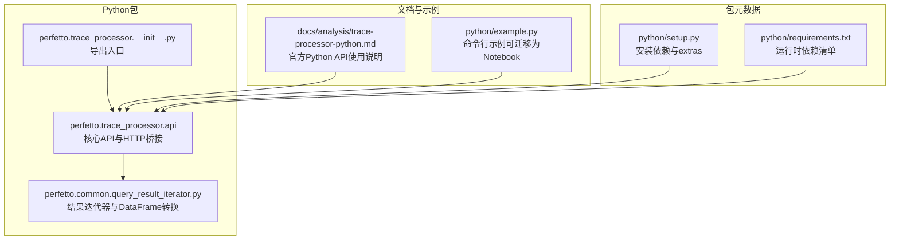
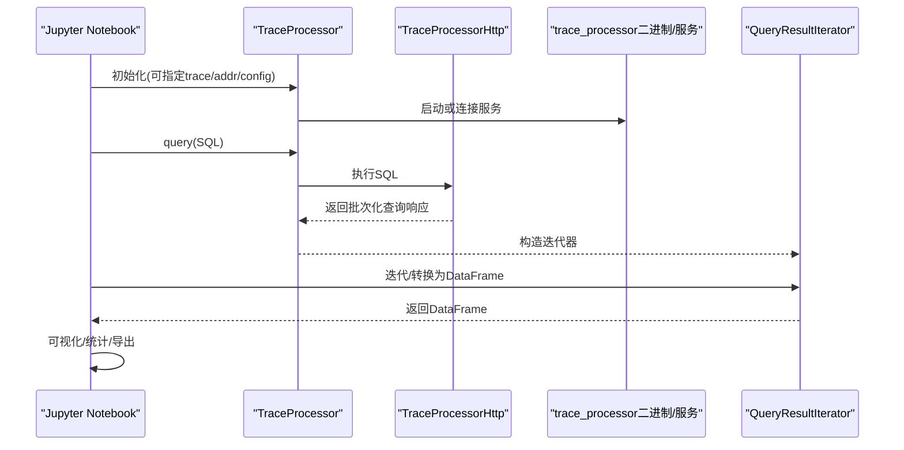
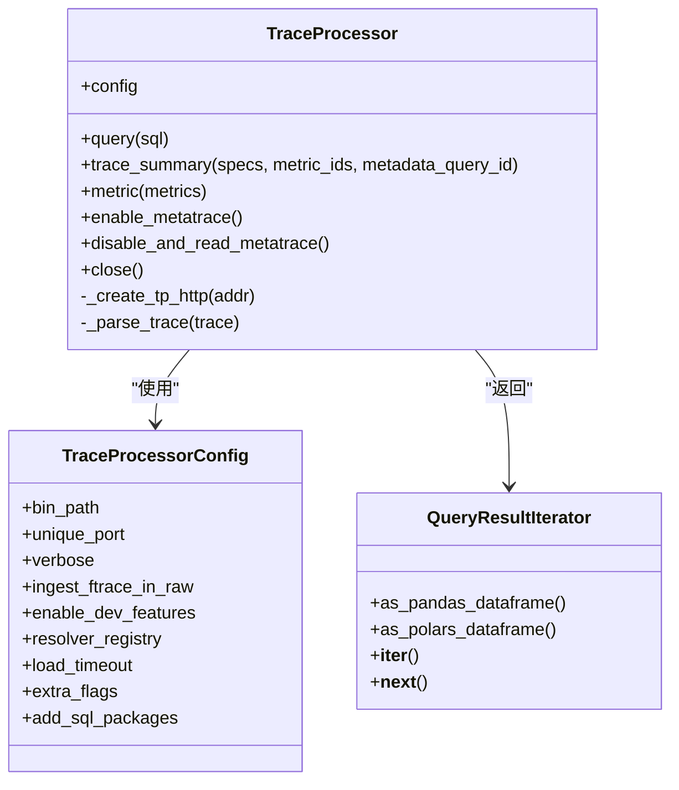
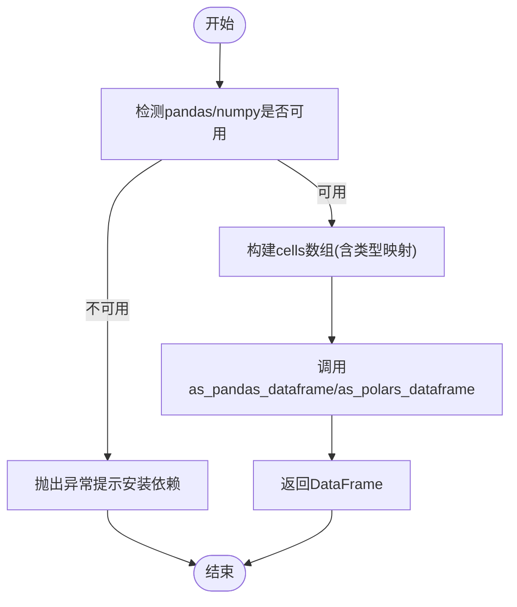
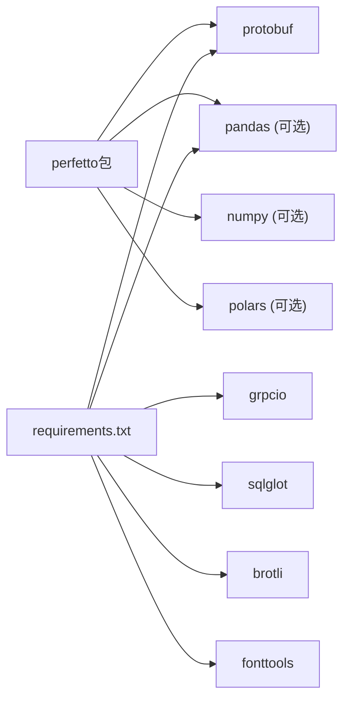

# Jupyter Notebook集成

<cite>
**本文引用的文件**   
- [python/README.md](file://python/README.md)
- [python/setup.py](file://python/setup.py)
- [python/requirements.txt](file://python/requirements.txt)
- [python/example.py](file://python/example.py)
- [python/perfetto/trace_processor/__init__.py](file://python/perfetto/trace_processor/__init__.py)
- [python/perfetto/trace_processor/api.py](file://python/perfetto/trace_processor/api.py)
- [python/perfetto/common/query_result_iterator.py](file://python/perfetto/common/query_result_iterator.py)
- [docs/analysis/trace-processor-python.md](file://docs/analysis/trace-processor-python.md)
</cite>

## 目录
1. [简介](#简介)
2. [项目结构](#项目结构)
3. [核心组件](#核心组件)
4. [架构总览](#架构总览)
5. [组件详解](#组件详解)
6. [依赖关系分析](#依赖关系分析)
7. [性能与内存管理](#性能与内存管理)
8. [故障排查指南](#故障排查指南)
9. [结论](#结论)
10. [附录：完整工作流示例](#附录完整工作流示例)

## 简介
本文件面向在Jupyter Notebook中使用Perfetto Python API进行交互式分析的用户，提供从环境准备、依赖安装、内核配置到数据加载、SQL查询、可视化与报告生成的全流程指南。文档基于仓库内的Python API与官方文档，确保内容可追溯至源码与文档文件。

## 项目结构
围绕Jupyter集成的关键位置如下：
- Python包与入口：位于python/perfetto/trace_processor，对外暴露TraceProcessor、TraceProcessorConfig等核心类
- 示例与用法：位于python/example.py与docs/analysis/trace-processor-python.md
- 包元数据与依赖：位于python/setup.py与python/requirements.txt
- 查询结果迭代器：位于python/perfetto/common/query_result_iterator.py，支持pandas/polars/numpy转换

**图示来源**
- [python/perfetto/trace_processor/api.py:122-361](file://python/perfetto/trace_processor/api.py#L122-L361)
- [python/perfetto/trace_processor/__init__.py:16-21](file://python/perfetto/trace_processor/__init__.py#L16-L21)
- [python/perfetto/common/query_result_iterator.py:73-181](file://python/perfetto/common/query_result_iterator.py#L73-L181)
- [docs/analysis/trace-processor-python.md:1-383](file://docs/analysis/trace-processor-python.md#L1-L383)
- [python/example.py:1-70](file://python/example.py#L1-L70)
- [python/setup.py:1-43](file://python/setup.py#L1-L43)
- [python/requirements.txt:1-8](file://python/requirements.txt#L1-L8)

**章节来源**
- [python/README.md:1-10](file://python/README.md#L1-L10)
- [python/setup.py:1-43](file://python/setup.py#L1-L43)
- [python/requirements.txt:1-8](file://python/requirements.txt#L1-L8)
- [docs/analysis/trace-processor-python.md:1-383](file://docs/analysis/trace-processor-python.md#L1-L383)

## 核心组件
- TraceProcessor：Python侧主入口，负责启动/连接trace_processor服务、解析trace、执行SQL、计算trace_summary、启用/读取metatrace等
- TraceProcessorConfig：用于定制trace_processor二进制路径、端口策略、日志级别、SQL包加载、超时与额外参数
- QueryResultIterator：对查询结果进行批量迭代，并提供as_pandas_dataframe/as_polars_dataframe转换能力
- TraceProcessorHttp：与trace_processor服务通过HTTP通信的适配层（由API内部使用）

关键职责与行为要点：
- 支持从文件路径、文件对象、字节生成器、trace URI等多种方式加载trace
- 支持连接已存在的trace_processor实例或自动下载并启动预编译二进制
- 提供trace_summary替代已弃用的metric接口
- 提供enable_metatrace/disable_and_read_metatrace用于性能自监控

**章节来源**
- [python/perfetto/trace_processor/api.py:122-361](file://python/perfetto/trace_processor/api.py#L122-L361)
- [python/perfetto/trace_processor/__init__.py:16-21](file://python/perfetto/trace_processor/__init__.py#L16-L21)
- [python/perfetto/common/query_result_iterator.py:73-181](file://python/perfetto/common/query_result_iterator.py#L73-L181)

## 架构总览
下图展示了Notebook中一次典型分析流程：用户在单元格中初始化TraceProcessor，加载trace，执行SQL，将结果转为DataFrame后进行可视化。

**图示来源**
- [python/perfetto/trace_processor/api.py:182-202](file://python/perfetto/trace_processor/api.py#L182-L202)
- [python/perfetto/trace_processor/api.py:295-306](file://python/perfetto/trace_processor/api.py#L295-L306)
- [python/perfetto/common/query_result_iterator.py:141-165](file://python/perfetto/common/query_result_iterator.py#L141-L165)

## 组件详解

### TraceProcessor类与生命周期
- 初始化：支持trace参数（文件/对象/生成器/URI）或addr参数（连接已有实例），以及config定制
- 加载trace：通过resolver_registry解析trace，分块发送给HTTP接口，最后通知EOF
- 关闭：终止子进程、关闭连接，清理资源

**图示来源**
- [python/perfetto/trace_processor/api.py:58-120](file://python/perfetto/trace_processor/api.py#L58-L120)
- [python/perfetto/trace_processor/api.py:122-361](file://python/perfetto/trace_processor/api.py#L122-L361)
- [python/perfetto/common/query_result_iterator.py:73-181](file://python/perfetto/common/query_result_iterator.py#L73-L181)

**章节来源**
- [python/perfetto/trace_processor/api.py:122-361](file://python/perfetto/trace_processor/api.py#L122-L361)

### 查询结果迭代器与DataFrame转换
- QueryResultIterator提供行级访问与长度、迭代协议
- 支持as_pandas_dataframe与as_polars_dataframe两种转换
- 内部使用numpy优化数组布局；缺失值映射为None

**图示来源**
- [python/perfetto/common/query_result_iterator.py:105-165](file://python/perfetto/common/query_result_iterator.py#L105-L165)

**章节来源**
- [python/perfetto/common/query_result_iterator.py:73-181](file://python/perfetto/common/query_result_iterator.py#L73-L181)

### 配置与环境准备（Notebook）
- 安装：使用pip安装perfetto，可选安装pandas、numpy、polars
- 依赖：setup.py声明protobuf为必需，pandas/numpy/polars为可选extras
- 运行时依赖：requirements.txt列出grpcio、pandas、protobuf等版本
- Notebook内核：建议使用Python 3.9–3.12（setup.py声明兼容范围）

**章节来源**
- [python/setup.py:26-42](file://python/setup.py#L26-L42)
- [python/requirements.txt:1-8](file://python/requirements.txt#L1-L8)
- [docs/analysis/trace-processor-python.md:8-14](file://docs/analysis/trace-processor-python.md#L8-L14)

### 在Notebook中加载轨迹与执行SQL
- 基本步骤：初始化TraceProcessor，query执行SQL，迭代或转换为DataFrame
- 示例参考：docs/analysis/trace-processor-python.md与python/example.py

**章节来源**
- [docs/analysis/trace-processor-python.md:18-70](file://docs/analysis/trace-processor-python.md#L18-L70)
- [python/example.py:21-69](file://python/example.py#L21-L69)

### 可视化与报告生成（Notebook特性）
- matplotlib：可直接使用pandas的plot接口或seaborn等
- plotly：可将DataFrame转换为plotly图形对象
- HTML表格：可使用DataFrame.to_html()或pandas.io.formats.format.HTMLFormatter输出
- 动态图表：Notebook支持自动渲染matplotlib/plotly等，无需额外魔法命令

**章节来源**
- [docs/analysis/trace-processor-python.md:225-240](file://docs/analysis/trace-processor-python.md#L225-L240)

### 与matplotlib、plotly等库的集成
- pandas DataFrame可直接绘图（如折线图、柱状图）
- plotly适合交互式图表，可结合DataFrame生成
- HTML表格渲染：DataFrame.to_html()或IPython.display.HTML

**章节来源**
- [docs/analysis/trace-processor-python.md:225-240](file://docs/analysis/trace-processor-python.md#L225-L240)

## 依赖关系分析
- 必需依赖：protobuf（setup.py）
- 可选依赖：pandas、numpy（用于as_pandas_dataframe）、polars（用于as_polars_dataframe）
- 运行时依赖：grpcio、pandas、protobuf、sqlglot、brotli、fonttools等（requirements.txt）

**图示来源**
- [python/setup.py:26-42](file://python/setup.py#L26-L42)
- [python/requirements.txt:1-8](file://python/requirements.txt#L1-L8)

**章节来源**
- [python/setup.py:26-42](file://python/setup.py#L26-L42)
- [python/requirements.txt:1-8](file://python/requirements.txt#L1-L8)

## 性能与内存管理
- 使用as_pandas_dataframe时，建议在查询后立即消费结果，避免长时间持有大对象
- 对于超大数据集，优先考虑分页查询或限制列/行数
- 利用trace_summary替代metric，获得更灵活的结构化输出
- 启用metatrace定位慢查询瓶颈，生成metatrace文件后可在另一个TraceProcessor中打开分析

**章节来源**
- [docs/analysis/trace-processor-python.md:241-299](file://docs/analysis/trace-processor-python.md#L241-L299)
- [python/perfetto/trace_processor/api.py:237-252](file://python/perfetto/trace_processor/api.py#L237-L252)

## 故障排查指南
- 无法导入模块：确认已安装pandas/numpy/polars（如需）与protobuf
- 查询结果为空：检查SQL语法与表名；确认trace已正确加载
- DataFrame转换报错：确认已安装pandas与numpy；polars需单独安装
- 资源未释放：确保在Notebook末尾调用tp.close()或使用上下文管理器with语句
- 连接失败：检查addr格式与trace_processor服务状态

**章节来源**
- [python/perfetto/common/query_result_iterator.py:141-165](file://python/perfetto/common/query_result_iterator.py#L141-L165)
- [python/perfetto/trace_processor/api.py:338-361](file://python/perfetto/trace_processor/api.py#L338-L361)
- [docs/analysis/trace-processor-python.md:107-124](file://docs/analysis/trace-processor-python.md#L107-L124)

## 结论
在Jupyter中使用Perfetto Python API进行交互式分析，核心在于：正确安装依赖、合理配置TraceProcessor、高效执行SQL并利用DataFrame进行可视化与报告生成。通过trace_summary与metatrace可进一步提升分析深度与性能洞察。

## 附录：完整工作流示例
以下为Notebook中的完整工作流步骤（不含具体代码内容，仅给出路径与要点）：
- 环境准备：安装perfetto与可选依赖（见setup.py与requirements.txt）
- 初始化与加载：参考docs/analysis/trace-processor-python.md中的初始化与加载示例
- SQL查询与结果处理：参考docs/analysis/trace-processor-python.md与python/example.py
- 可视化：使用pandas绘图或plotly，HTML表格渲染参考pandas.to_html
- 报告导出：将DataFrame保存为CSV/Excel或HTML表格
- 资源清理：调用tp.close()或使用上下文管理器

**章节来源**
- [docs/analysis/trace-processor-python.md:18-70](file://docs/analysis/trace-processor-python.md#L18-L70)
- [python/example.py:21-69](file://python/example.py#L21-L69)
- [python/perfetto/trace_processor/api.py:338-361](file://python/perfetto/trace_processor/api.py#L338-L361)