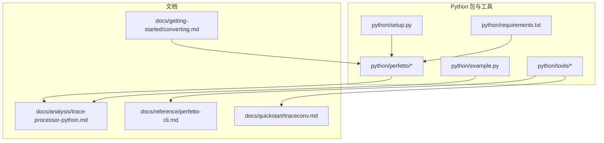
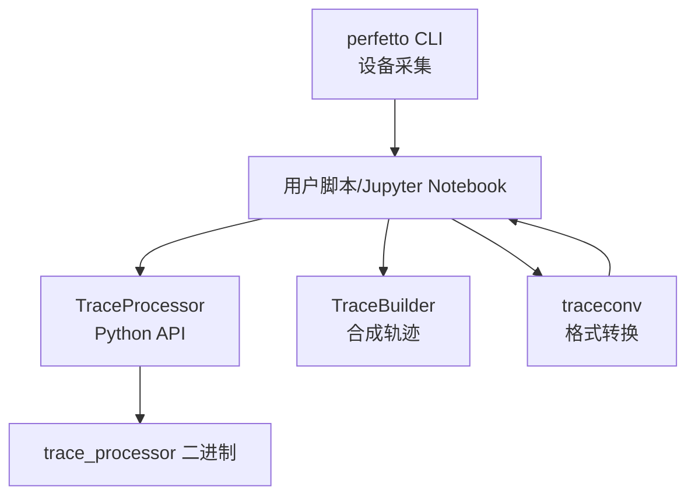
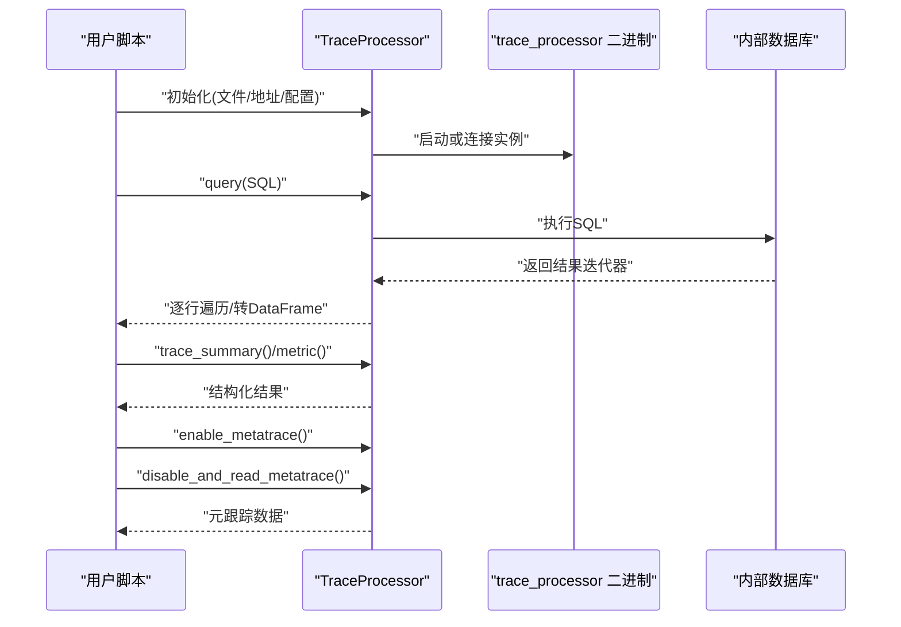
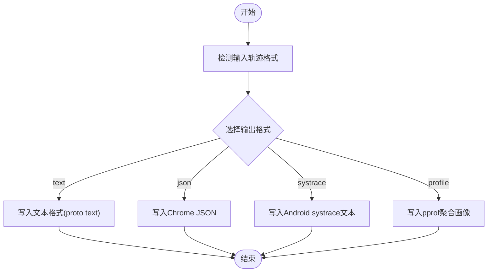
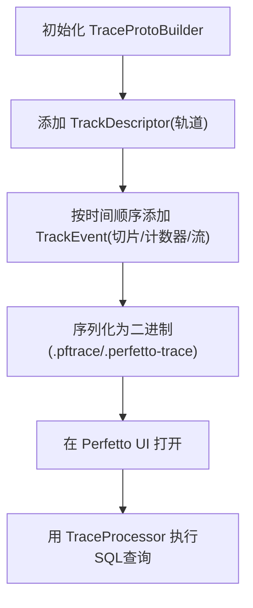
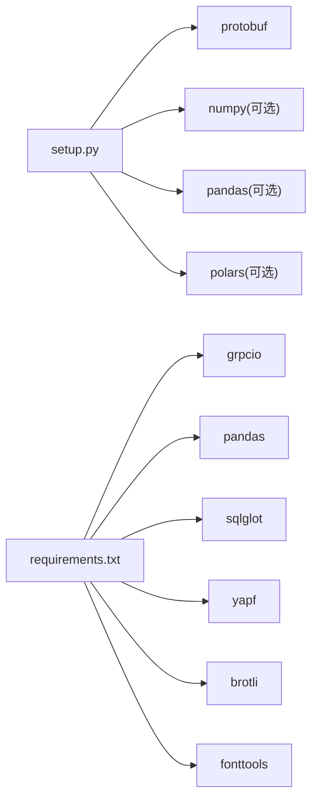

# Python API和工具

<cite>
**本文引用的文件**
- [python/README.md](file://python/README.md)
- [python/setup.py](file://python/setup.py)
- [python/requirements.txt](file://python/requirements.txt)
- [python/example.py](file://python/example.py)
- [python/perfetto/__init__.py](file://python/perfetto/__init__.py)
- [docs/analysis/trace-processor-python.md](file://docs/analysis/trace-processor-python.md)
- [docs/reference/perfetto-cli.md](file://docs/reference/perfetto-cli.md)
- [docs/getting-started/converting.md](file://docs/getting-started/converting.md)
- [docs/quickstart/traceconv.md](file://docs/quickstart/traceconv.md)
</cite>

## 目录
1. [简介](#简介)
2. [项目结构](#项目结构)
3. [核心组件](#核心组件)
4. [架构总览](#架构总览)
5. [详细组件分析](#详细组件分析)
6. [依赖分析](#依赖分析)
7. [性能考虑](#性能考虑)
8. [故障排查指南](#故障排查指南)
9. [结论](#结论)
10. [附录](#附录)

## 简介
本文件面向使用 Perfetto 的 Python 用户，系统化介绍 Python 绑定与工具链，覆盖以下主题：
- TraceProcessor API：轨迹读取、SQL 查询执行、结果迭代与导出（含 Pandas/Polars）
- 批处理工具与自动化：traceconv 转换、命令行采集 perfetto、批量分析脚本
- 自定义轨迹生成：基于 TraceBuilder 的合成轨迹与可视化
- 与 Jupyter Notebook 集成：交互式分析最佳实践
- 错误处理、性能优化与大规模数据处理建议
- 自定义分析脚本开发与调试技巧

## 项目结构
仓库中与 Python API 和工具相关的关键位置如下：
- python/：Python 包与工具入口、示例与安装配置
- docs/analysis/trace-processor-python.md：TraceProcessor Python API 官方使用指南
- docs/reference/perfetto-cli.md：perfetto 命令行采集工具参考
- docs/getting-started/converting.md：将任意时间序列数据转换为 Perfetto 轨迹的指南
- docs/quickstart/traceconv.md：traceconv 转换工具用法

**图示来源**
- [python/perfetto/__init__.py:1-19](file://python/perfetto/__init__.py#L1-L19)
- [python/setup.py:1-43](file://python/setup.py#L1-L43)
- [python/requirements.txt:1-8](file://python/requirements.txt#L1-L8)
- [python/example.py:1-70](file://python/example.py#L1-L70)
- [docs/analysis/trace-processor-python.md:1-383](file://docs/analysis/trace-processor-python.md#L1-L383)
- [docs/reference/perfetto-cli.md:1-215](file://docs/reference/perfetto-cli.md#L1-L215)
- [docs/getting-started/converting.md:1-1275](file://docs/getting-started/converting.md#L1-L1275)
- [docs/quickstart/traceconv.md:1-46](file://docs/quickstart/traceconv.md#L1-L46)

**章节来源**
- [python/README.md:1-10](file://python/README.md#L1-L10)
- [python/setup.py:1-43](file://python/setup.py#L1-L43)
- [python/requirements.txt:1-8](file://python/requirements.txt#L1-L8)
- [python/perfetto/__init__.py:1-19](file://python/perfetto/__init__.py#L1-L19)

## 核心组件
- TraceProcessor：Python 中对 C++ TraceProcessor 库的封装，支持本地启动或连接已有实例，提供 SQL 查询、指标汇总、元跟踪（metatracing）等功能。
- TraceBuilder：用于从自定义时间序列数据生成 Perfetto 轨迹，支持切片、计数器、流（因果关系）、层级轨道等。
- traceconv：将 Perfetto 原生二进制轨迹转换为 text/json/systrace/pprof 等格式，便于在其他工具中打开或进一步分析。
- perfetto 命令行：用于在设备上采集系统级/应用级轨迹，支持轻量模式与完整配置模式。

**章节来源**
- [docs/analysis/trace-processor-python.md:1-383](file://docs/analysis/trace-processor-python.md#L1-L383)
- [docs/getting-started/converting.md:1-1275](file://docs/getting-started/converting.md#L1-L1275)
- [docs/quickstart/traceconv.md:1-46](file://docs/quickstart/traceconv.md#L1-L46)
- [docs/reference/perfetto-cli.md:1-215](file://docs/reference/perfetto-cli.md#L1-L215)

## 架构总览
下图展示了 Python API 在整体生态中的位置：通过 TraceProcessor 连接或启动 TraceProcessor 实例，执行 SQL 查询；通过 TraceBuilder 生成自定义轨迹；通过 traceconv 将原生轨迹转换为其他格式；通过 perfetto 命令行采集设备轨迹。

**图示来源**
- [docs/analysis/trace-processor-python.md:72-137](file://docs/analysis/trace-processor-python.md#L72-L137)
- [docs/getting-started/converting.md:38-154](file://docs/getting-started/converting.md#L38-L154)
- [docs/quickstart/traceconv.md:1-46](file://docs/quickstart/traceconv.md#L1-L46)
- [docs/reference/perfetto-cli.md:1-215](file://docs/reference/perfetto-cli.md#L1-L215)

## 详细组件分析

### TraceProcessor API 使用指南
- 初始化方式
  - 本地加载：支持文件路径、字节对象、生成器、URI 等多种输入
  - 连接现有实例：通过地址连接已运行的 trace_processor，并可同时加载新轨迹
  - 配置项：二进制路径、是否启用详细日志、加载自定义 SQL 模块包等
- 查询与结果处理
  - query 返回可迭代的结果集，支持转为 Pandas 或 Polars 数据框
  - 可进行可视化与统计分析
- 指标与摘要
  - trace_summary 提供结构化摘要，替代已弃用的 metric 接口
- 元跟踪（Metatracing）
  - 可开启/关闭并读取 trace_processor 自身的性能元数据，便于诊断性能瓶颈

**图示来源**
- [docs/analysis/trace-processor-python.md:72-137](file://docs/analysis/trace-processor-python.md#L72-L137)
- [docs/analysis/trace-processor-python.md:138-383](file://docs/analysis/trace-processor-python.md#L138-L383)

**章节来源**
- [docs/analysis/trace-processor-python.md:18-383](file://docs/analysis/trace-processor-python.md#L18-L383)

### 批处理工具与自动化
- traceconv
  - 支持输出 text、json、systrace、profile 等格式
  - 可直接下载最新二进制或按版本下载
- perfetto 命令行
  - 轻量模式：通过命令行参数快速采集 ftrace/atrace
  - 正常模式：通过配置文件完全定制采集内容
  - 支持后台录制、克隆会话、附加/分离、上传等高级选项

**图示来源**
- [docs/quickstart/traceconv.md:13-38](file://docs/quickstart/traceconv.md#L13-L38)

**章节来源**
- [docs/quickstart/traceconv.md:1-46](file://docs/quickstart/traceconv.md#L1-L46)
- [docs/reference/perfetto-cli.md:1-215](file://docs/reference/perfetto-cli.md#L1-L215)

### 自定义轨迹生成与分析
- 基础概念
  - Perfetto 轨迹由 TracePacket 序列组成，常用负载为 TrackEvent
  - 支持切片（函数/任务区间）、计数器（随时间变化的数值）、流（跨轨道因果链接）、层级轨道（树形分组）
- 生成流程
  - 使用 TraceBuilder 构造包，填充 TrackDescriptor 与 TrackEvent
  - 写出二进制文件后可在 Perfetto UI 打开并用 TraceProcessor 查询
- 常见场景
  - 基本时间线切片、嵌套切片、异步重叠事件、计数器、流、轨道层级

**图示来源**
- [docs/getting-started/converting.md:38-154](file://docs/getting-started/converting.md#L38-L154)
- [docs/getting-started/converting.md:155-800](file://docs/getting-started/converting.md#L155-L800)

**章节来源**
- [docs/getting-started/converting.md:1-1275](file://docs/getting-started/converting.md#L1-L1275)

### 与 Jupyter Notebook 集成与交互式分析
- 建议做法
  - 使用 as_pandas_dataframe() 或 as_polars_dataframe() 将查询结果转为 DataFrame，结合 Matplotlib/Plotly 等库进行可视化
  - 将查询封装为函数，便于复用与参数化
  - 对大型查询使用分页/采样策略，避免内存压力
- 注意事项
  - 在 Notebook 中合理管理 TraceProcessor 生命周期，及时 close 释放资源
  - 对于长时间运行的查询，可结合 enable_metatrace/disable_and_read_metatrace 分析性能热点

**章节来源**
- [docs/analysis/trace-processor-python.md:169-236](file://docs/analysis/trace-processor-python.md#L169-L236)

## 依赖分析
- Python 包安装与依赖
  - 核心：protobuf
  - 可选：numpy、pandas、polars
  - 工具：grpcio、sqlglot、yapf、brotli、fonttools 等
- 包结构
  - perfetto 包含 trace_processor、trace_builder、trace_uri_resolver、common 等模块
  - trace_processor 子包包含 *.descriptor 资源文件

**图示来源**
- [python/setup.py:26-33](file://python/setup.py#L26-L33)
- [python/requirements.txt:1-8](file://python/requirements.txt#L1-L8)

**章节来源**
- [python/setup.py:1-43](file://python/setup.py#L1-L43)
- [python/requirements.txt:1-8](file://python/requirements.txt#L1-L8)

## 性能考虑
- 查询与结果处理
  - 大结果集优先使用迭代器逐行处理，必要时再转为 DataFrame
  - 使用 as_polars_dataframe() 可获得更优的性能与内存占用（可选依赖）
- 轨迹规模
  - 对超大轨迹采用分段查询、采样与分区策略
  - 合理设置缓冲区大小与查询范围，避免一次性载入过多数据
- 元跟踪（Metatracing）
  - 在定位性能瓶颈时临时开启，完成后立即关闭并读取元跟踪数据，避免长期运行带来的额外开销

**章节来源**
- [docs/analysis/trace-processor-python.md:169-236](file://docs/analysis/trace-processor-python.md#L169-L236)
- [docs/analysis/trace-processor-python.md:279-299](file://docs/analysis/trace-processor-python.md#L279-L299)

## 故障排查指南
- 常见问题
  - 未指定轨迹或地址：初始化 TraceProcessor 时必须提供文件路径或连接地址
  - 缺少可选依赖：若需 DataFrame 导出，请安装 pandas/polars/numpy
  - 权限与路径：确保 traceconv/trace_processor 二进制具备执行权限
- 调试建议
  - 使用 TraceProcessorConfig 启用详细日志，观察 trace_processor 输出
  - 对复杂 SQL 使用 trace_summary 替代 metric 获取结构化结果
  - 利用元跟踪定位慢查询与热点

**章节来源**
- [python/example.py:40-47](file://python/example.py#L40-L47)
- [docs/analysis/trace-processor-python.md:107-137](file://docs/analysis/trace-processor-python.md#L107-L137)
- [docs/analysis/trace-processor-python.md:279-299](file://docs/analysis/trace-processor-python.md#L279-L299)

## 结论
Perfetto 的 Python API 为轨迹分析提供了强大的 SQL 查询能力与灵活的工具链。通过 TraceProcessor 可以高效完成轨迹读取、查询与导出；借助 TraceBuilder 能将任意时间序列数据转化为 Perfetto 轨迹；traceconv 与 perfetto 命令行则完善了从采集到可视化的全链路。配合 Jupyter Notebook，用户可以构建交互式的分析工作流，并通过元跟踪与结构化摘要实现深度性能诊断。

## 附录
- 快速开始
  - 安装：pip install perfetto
  - 示例：参考 python/example.py 的命令行参数与基本查询流程
- 进一步阅读
  - TraceProcessor Python API：docs/analysis/trace-processor-python.md
  - 轨迹转换：docs/quickstart/traceconv.md
  - 设备采集：docs/reference/perfetto-cli.md
  - 自定义轨迹：docs/getting-started/converting.md

**章节来源**
- [python/example.py:1-70](file://python/example.py#L1-L70)
- [docs/analysis/trace-processor-python.md:1-383](file://docs/analysis/trace-processor-python.md#L1-L383)
- [docs/quickstart/traceconv.md:1-46](file://docs/quickstart/traceconv.md#L1-L46)
- [docs/reference/perfetto-cli.md:1-215](file://docs/reference/perfetto-cli.md#L1-L215)
- [docs/getting-started/converting.md:1-1275](file://docs/getting-started/converting.md#L1-L1275)