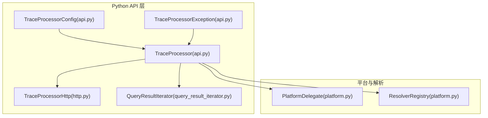
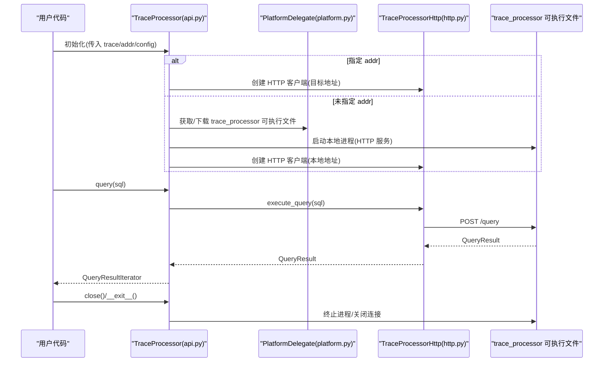
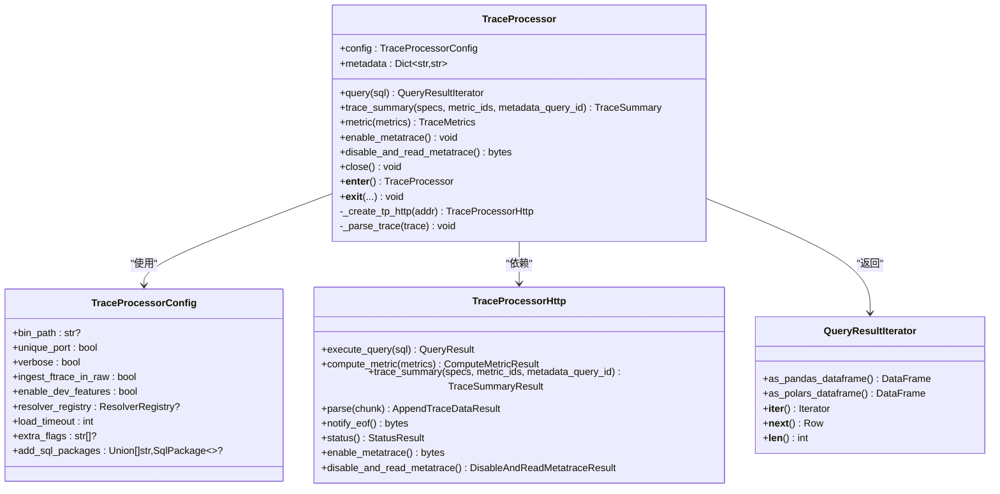
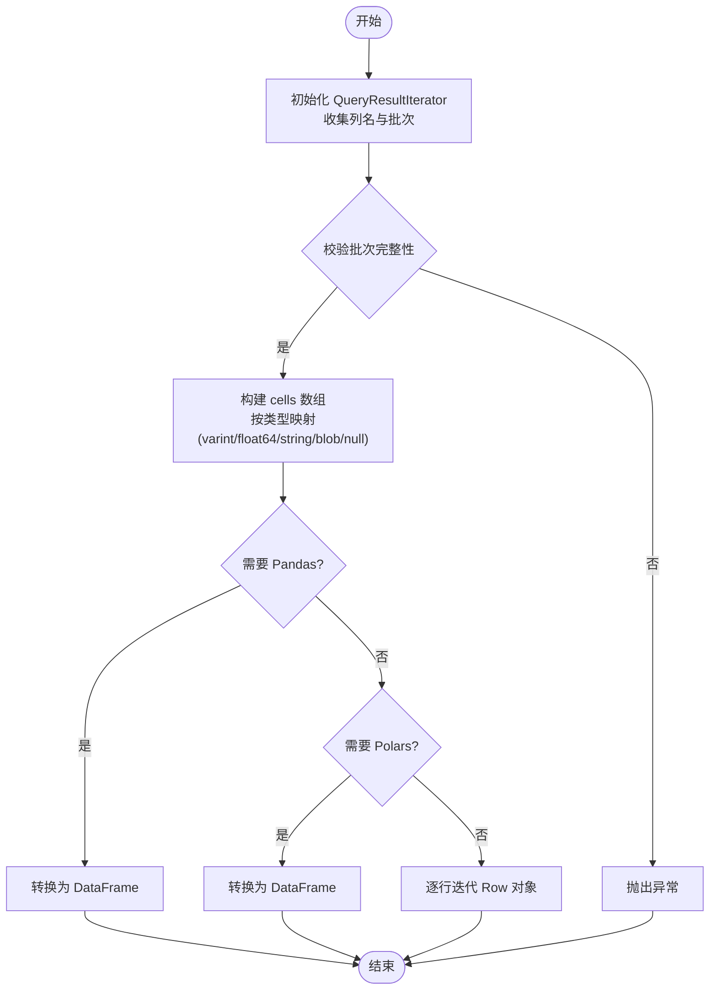
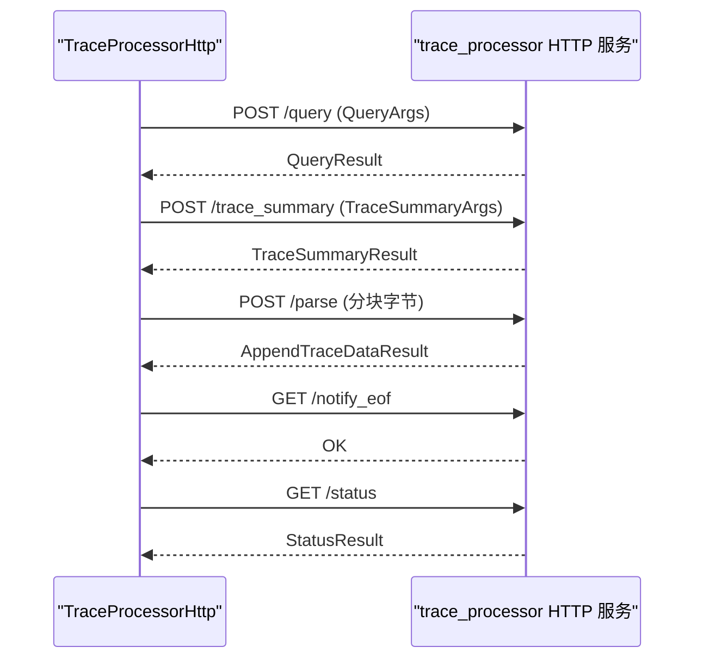
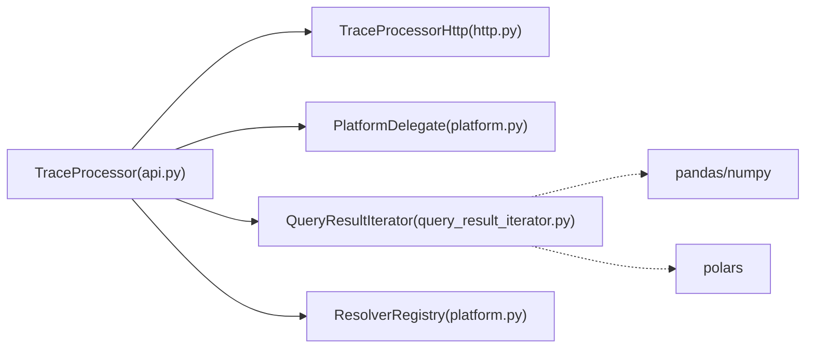

# TraceProcessor Python API

<cite>
**本文档引用的文件**
- [python\perfetto\trace_processor\api.py](file://python\perfetto\trace_processor\api.py)
- [python\perfetto\trace_processor\http.py](file://python\perfetto\trace_processor\http.py)
- [python\perfetto\common\query_result_iterator.py](file://python\perfetto\common\query_result_iterator.py)
- [python\perfetto\trace_processor\platform.py](file://python\perfetto\trace_processor\platform.py)
- [python\perfetto\trace_processor\__init__.py](file://python\perfetto\trace_processor\__init__.py)
- [python\example.py](file://python\example.py)
- [docs\analysis\trace-processor-python.md](file://docs\analysis\trace-processor-python.md)
- [docs\analysis\trace-processor.md](file://docs\analysis\trace-processor.md)
- [python\test\api_integrationtest.py](file://python\test\api_integrationtest.py)
</cite>

## 目录
1. [简介](#简介)
2. [项目结构](#项目结构)
3. [核心组件](#核心组件)
4. [架构总览](#架构总览)
5. [详细组件分析](#详细组件分析)
6. [依赖关系分析](#依赖关系分析)
7. [性能考虑](#性能考虑)
8. [故障排查指南](#故障排查指南)
9. [结论](#结论)
10. [附录](#附录)

## 简介
本文件为 TraceProcessor Python API 的权威使用文档，面向需要通过 Python 分析 Perfetto 轨迹（trace）的开发者与数据分析师。文档覆盖以下关键主题：
- 轨迹读取：支持从文件路径、文件对象、字节生成器、URI 解析器等多种来源加载轨迹
- SQL 查询执行：通过 HTTP 接口调用后端 trace_processor 实例，返回可迭代的结果集
- 结果处理与导出：支持逐行迭代、转换为 Pandas 或 Polars DataFrame、以及元数据访问
- 远程服务连接：通过地址直连已运行的 trace_processor 实例，或在本地启动新实例
- 配置与最佳实践：二进制路径、超时、SQL 包、开发特性开关、并发与内存管理
- 错误处理与调试：异常类型、常见错误场景、元跟踪（metatrace）辅助诊断

## 项目结构
该 Python API 的核心位于 python/perfetto/trace_processor 目录，主要模块职责如下：
- api.py：TraceProcessor 主类、配置类、异常类型定义
- http.py：HTTP 客户端封装，负责与 trace_processor RPC 交互
- query_result_iterator.py：查询结果迭代器与 DataFrame 转换工具
- platform.py：平台抽象层，负责下载/定位 trace_processor 可执行文件、端口选择、默认解析器注册
- __init__.py：对外公开的 API 入口

**图表来源**
- [python\perfetto\trace_processor\api.py:122-361](file://python\perfetto\trace_processor\api.py#L122-L361)
- [python\perfetto\trace_processor\http.py:22-109](file://python\perfetto\trace_processor\http.py#L22-L109)
- [python\perfetto\common\query_result_iterator.py:72-181](file://python\perfetto\common\query_result_iterator.py#L72-L181)
- [python\perfetto\trace_processor\platform.py:33-89](file://python\perfetto\trace_processor\platform.py#L33-L89)

**章节来源**
- [python\perfetto\trace_processor\api.py:122-361](file://python\perfetto\trace_processor\api.py#L122-L361)
- [python\perfetto\trace_processor\http.py:22-109](file://python\perfetto\trace_processor\http.py#L22-L109)
- [python\perfetto\common\query_result_iterator.py:72-181](file://python\perfetto\common\query_result_iterator.py#L72-L181)
- [python\perfetto\trace_processor\platform.py:33-89](file://python\perfetto\trace_processor\platform.py#L33-L89)

## 核心组件
- TraceProcessor 类：主入口，负责初始化、连接建立、轨迹解析、查询执行、资源管理
- TraceProcessorConfig 类：配置项集合，控制二进制路径、端口策略、超时、SQL 包、开发特性等
- TraceProcessorHttp 类：HTTP 客户端，封装 /query、/compute_metric、/trace_summary、/parse、/notify_eof、/status、/enable_metatrace、/disable_and_read_metatrace 等 RPC 接口
- QueryResultIterator：查询结果迭代器，支持逐行遍历与 DataFrame 转换
- PlatformDelegate：平台抽象，负责 trace_processor 可执行文件的获取与运行、端口分配、默认解析器注册
- TraceReference 与 ResolverRegistry：URI 轨迹解析机制，支持自定义解析器

**章节来源**
- [python\perfetto\trace_processor\api.py:122-361](file://python\perfetto\trace_processor\api.py#L122-L361)
- [python\perfetto\trace_processor\http.py:22-109](file://python\perfetto\trace_processor\http.py#L22-L109)
- [python\perfetto\common\query_result_iterator.py:72-181](file://python\perfetto\common\query_result_iterator.py#L72-L181)
- [python\perfetto\trace_processor\platform.py:33-89](file://python\perfetto\trace_processor\platform.py#L33-L89)

## 架构总览
TraceProcessor Python API 的工作流分为两类：
- 本地模式：自动下载/定位 trace_processor 可执行文件，启动本地 HTTP 服务，解析轨迹并执行 SQL 查询
- 远程模式：直接连接已运行的 trace_processor 实例，复用其已加载的轨迹进行查询

**图表来源**
- [python\perfetto\trace_processor\api.py:126-306](file://python\perfetto\trace_processor\api.py#L126-L306)
- [python\perfetto\trace_processor\http.py:28-36](file://python\perfetto\trace_processor\http.py#L28-L36)
- [python\perfetto\trace_processor\platform.py:41-55](file://python\perfetto\trace_processor\platform.py#L41-L55)

## 详细组件分析

### TraceProcessor 类
- 初始化参数
  - trace：支持路径字符串、文件对象、字节生成器、URI 字符串或解析器对象
  - addr：已运行实例的地址（如 localhost:9001）
  - config：TraceProcessorConfig 配置对象
  - file_path（已废弃）：请改用 trace
- 关键方法
  - query(sql)：执行 SQL 并返回 QueryResultIterator
  - trace_summary(specs, metric_ids, metadata_query_id)：计算结构化摘要（推荐替代已弃用的 metric）
  - metric(metrics)：已弃用，兼容保留
  - enable_metatrace()/disable_and_read_metatrace()：启用并读取 trace_processor 自身的元跟踪
  - metadata：只读属性，返回解析器注入的元数据
  - close()/__enter__/__exit__：资源管理与生命周期控制
- 内部流程
  - 若传入 trace，先通过 ResolverRegistry 解析为单一轨迹，分块发送到 /parse，最后调用 /notify_eof
  - 若传入 addr，则直接连接远程实例；否则启动本地 trace_processor 并创建 HTTP 客户端

**图表来源**
- [python\perfetto\trace_processor\api.py:122-361](file://python\perfetto\trace_processor\api.py#L122-L361)
- [python\perfetto\trace_processor\http.py:22-109](file://python\perfetto\trace_processor\http.py#L22-L109)
- [python\perfetto\common\query_result_iterator.py:72-181](file://python\perfetto\common\query_result_iterator.py#L72-L181)

**章节来源**
- [python\perfetto\trace_processor\api.py:122-361](file://python\perfetto\trace_processor\api.py#L122-L361)

### TraceProcessorConfig 配置详解
- bin_path：trace_processor 可执行文件路径；未设置则自动下载预编译版本
- unique_port：是否为每个实例分配唯一端口
- verbose：是否输出详细日志
- ingest_ftrace_in_raw：是否将 ftrace 事件原始导入到 ftrace_event 表
- enable_dev_features：启用开发特性（不稳定）
- resolver_registry：自定义 URI 解析器注册表
- load_timeout：二进制启动超时（秒）
- extra_flags：传递给 trace_processor 的额外命令行标志
- add_sql_packages：加载 PerfettoSQL 包，支持字符串路径或 SqlPackage 对象

**章节来源**
- [python\perfetto\trace_processor\api.py:58-120](file://python\perfetto\trace_processor\api.py#L58-L120)

### QueryResultIterator 结果处理
- 行访问：逐行迭代，每行对象动态暴露列名作为属性
- DataFrame 转换：
  - as_pandas_dataframe()：需安装 pandas 和 numpy
  - as_polars_dataframe()：需安装 polars
- 内存与性能：
  - 使用 NumPy 数组加速类型映射与 reshape
  - 支持大结果集的批量传输（is_last_batch 校验）

**图表来源**
- [python\perfetto\common\query_result_iterator.py:88-181](file://python\perfetto\common\query_result_iterator.py#L88-L181)

**章节来源**
- [python\perfetto\common\query_result_iterator.py:72-181](file://python\perfetto\common\query_result_iterator.py#L72-L181)

### HTTP API 与远程连接
- 本地启动：通过 load_shell 获取本地 URL，创建 TraceProcessorHttp
- 远程连接：解析 addr（netloc/path），创建 HTTP 客户端
- 接口列表：
  - /query：执行 SQL，返回 QueryResult
  - /compute_metric：计算指标（已弃用替代方案为 trace_summary）
  - /trace_summary：计算结构化摘要
  - /parse：分块解析轨迹
  - /notify_eof：通知解析完成
  - /status：查询状态
  - /enable_metatrace、/disable_and_read_metatrace：元跟踪控制

**图表来源**
- [python\perfetto\trace_processor\http.py:28-96](file://python\perfetto\trace_processor\http.py#L28-L96)

**章节来源**
- [python\perfetto\trace_processor\http.py:22-109](file://python\perfetto\trace_processor\http.py#L22-L109)

### 示例与常见任务
- 基本查询与迭代
  - 参考：[docs\analysis\trace-processor-python.md:22-44](file://docs\analysis\trace-processor-python.md#L22-L44)
- 转换为 Pandas DataFrame
  - 参考：[docs\analysis\trace-processor-python.md:46-70](file://docs\analysis\trace-processor-python.md#L46-L70)
- 连接到远程实例
  - 参考：[docs\analysis\trace-processor-python.md:94-105](file://docs\analysis\trace-processor-python.md#L94-L105)
- 配置与 SQL 包加载
  - 参考：[docs\analysis\trace-processor-python.md:107-137](file://docs\analysis\trace-processor-python.md#L107-L137)
- Trace Summary 计算
  - 参考：[docs\analysis\trace-processor-python.md:241-277](file://docs\analysis\trace-processor-python.md#L241-L277)
- 元跟踪（metatrace）
  - 参考：[docs\analysis\trace-processor-python.md:279-299](file://docs\analysis\trace-processor-python.md#L279-L299)

**章节来源**
- [docs\analysis\trace-processor-python.md:18-383](file://docs\analysis\trace-processor-python.md#L18-L383)

## 依赖关系分析
- TraceProcessor 依赖 TraceProcessorHttp 执行 RPC 调用
- TraceProcessor 通过 PlatformDelegate 获取/启动 trace_processor 可执行文件
- QueryResultIterator 依赖 pandas/polars/numpy（可选）进行 DataFrame 转换
- ResolverRegistry 提供 TraceReference 解析能力，支持自定义解析器

**图表来源**
- [python\perfetto\trace_processor\api.py:169-173](file://python\perfetto\trace_processor\api.py#L169-L173)
- [python\perfetto\common\query_result_iterator.py:141-165](file://python\perfetto\common\query_result_iterator.py#L141-L165)

**章节来源**
- [python\perfetto\trace_processor\api.py:169-173](file://python\perfetto\trace_processor\api.py#L169-L173)
- [python\perfetto\common\query_result_iterator.py:141-165](file://python\perfetto\common\query_result_iterator.py#L141-L165)

## 性能考虑
- 大结果集处理
  - 优先使用 QueryResultIterator 逐行迭代，避免一次性加载到内存
  - 当需要聚合分析时，再使用 as_pandas_dataframe() 或 as_polars_dataframe()
- DataFrame 转换
  - pandas + numpy：性能更优，适合大规模数值计算
  - polars：零拷贝与惰性计算，适合复杂查询链路
- 并发与多实例
  - 使用 unique_port 为每个 TraceProcessor 实例分配独立端口，避免端口冲突
  - 在多核环境下，合理拆分查询任务，避免单实例过载
- 超时与稳定性
  - 通过 config.load_timeout 控制启动等待时间
  - 对于长时间运行的查询，结合元跟踪（metatrace）定位热点

[本节为通用指导，无需特定文件引用]

## 故障排查指南
- 常见异常
  - TraceProcessorException：RPC 返回错误时抛出，包含错误信息
  - 文件/路径无效：检查 bin_path 是否存在
  - 解析失败：确认 trace 参数仅解析为单一轨迹
- 元跟踪（metatrace）
  - 使用 enable_metatrace() 启用，执行若干查询后调用 disable_and_read_metatrace() 获取二进制元跟踪，可用于进一步分析
- 单元测试参考
  - 测试覆盖了多种初始化方式、错误场景、SQL 包加载、trace_summary 成功/失败等情形
  - 参考：[python\test\api_integrationtest.py:131-649](file://python\test\api_integrationtest.py#L131-L649)

**章节来源**
- [python\test\api_integrationtest.py:131-649](file://python\test\api_integrationtest.py#L131-L649)
- [python\perfetto\trace_processor\api.py:40-42](file://python\perfetto\trace_processor\api.py#L40-L42)

## 结论
TraceProcessor Python API 将高性能的 C++ trace_processor 库与 Python 生态无缝集成，既支持本地快速启动，也支持远程实例连接。通过统一的 SQL 查询接口与灵活的结果处理方式，开发者可以高效完成轨迹读取、查询执行、结果导出与可视化分析。建议在生产环境中结合配置项、元跟踪与 DataFrame 工具链，实现稳定、可观测且高性能的分析流水线。

[本节为总结性内容，无需特定文件引用]

## 附录

### 快速上手示例（路径引用）
- 基本查询与迭代：[docs\analysis\trace-processor-python.md:22-44](file://docs\analysis\trace-processor-python.md#L22-L44)
- 转换为 Pandas DataFrame：[docs\analysis\trace-processor-python.md:46-70](file://docs\analysis\trace-processor-python.md#L46-L70)
- 连接远程实例：[docs\analysis\trace-processor-python.md:94-105](file://docs\analysis\trace-processor-python.md#L94-L105)
- 配置与 SQL 包加载：[docs\analysis\trace-processor-python.md:107-137](file://docs\analysis\trace-processor-python.md#L107-L137)
- Trace Summary 计算：[docs\analysis\trace-processor-python.md:241-277](file://docs\analysis\trace-processor-python.md#L241-L277)
- 元跟踪（metatrace）：[docs\analysis\trace-processor-python.md:279-299](file://docs\analysis\trace-processor-python.md#L279-L299)

### API 方法一览（路径引用）
- TraceProcessor.query：[python\perfetto\trace_processor\api.py:182-202](file://python\perfetto\trace_processor\api.py#L182-L202)
- TraceProcessor.trace_summary：[python\perfetto\trace_processor\api.py:203-235](file://python\perfetto\trace_processor\api.py#L203-L235)
- TraceProcessor.metric（已弃用）：[python\perfetto\trace_processor\api.py:254-274](file://python\perfetto\trace_processor\api.py#L254-L274)
- TraceProcessor.enable_metatrace/disable_and_read_metatrace：[python\perfetto\trace_processor\api.py:237-252](file://python\perfetto\trace_processor\api.py#L237-L252)
- TraceProcessorHttp 接口：[python\perfetto\trace_processor\http.py:28-108](file://python\perfetto\trace_processor\http.py#L28-L108)
- QueryResultIterator 转 DataFrame：[python\perfetto\common\query_result_iterator.py:141-165](file://python\perfetto\common\query_result_iterator.py#L141-L165)