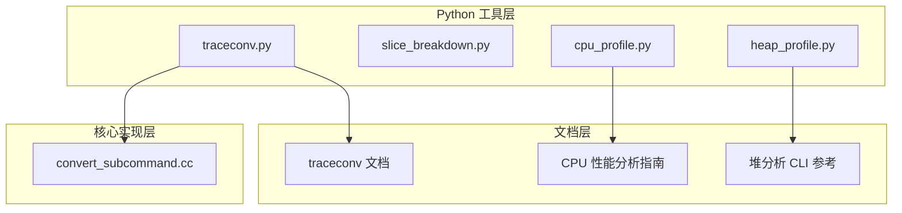
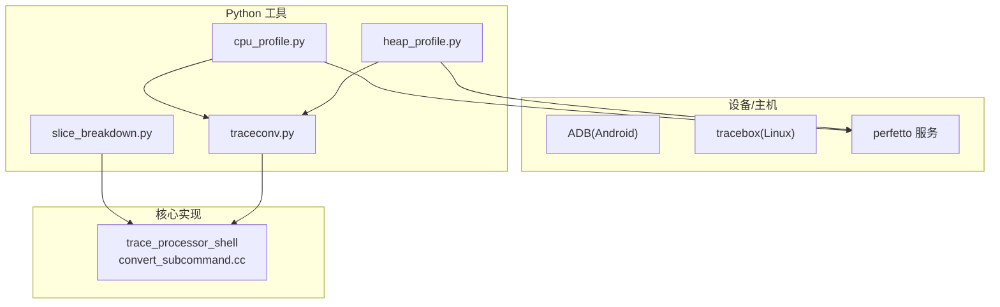
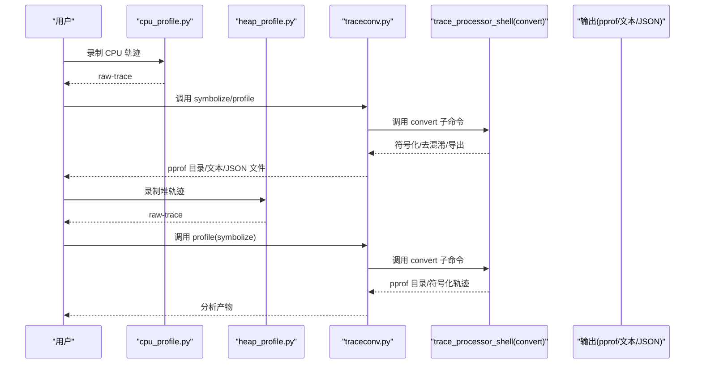
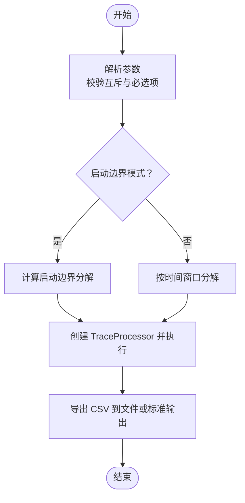
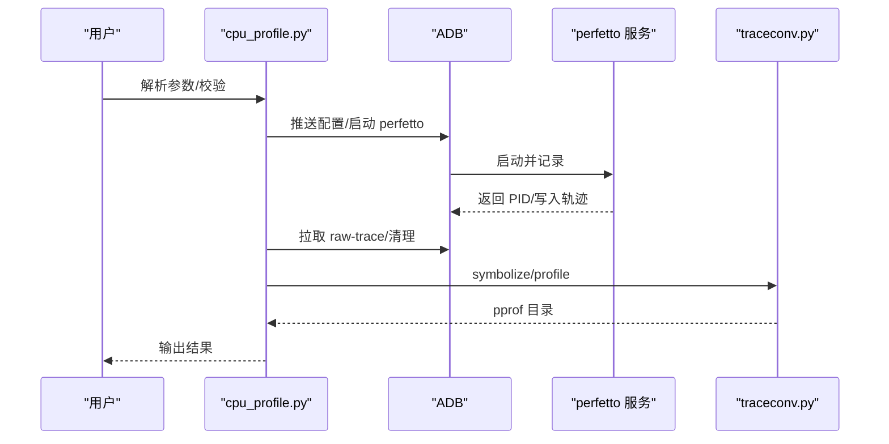
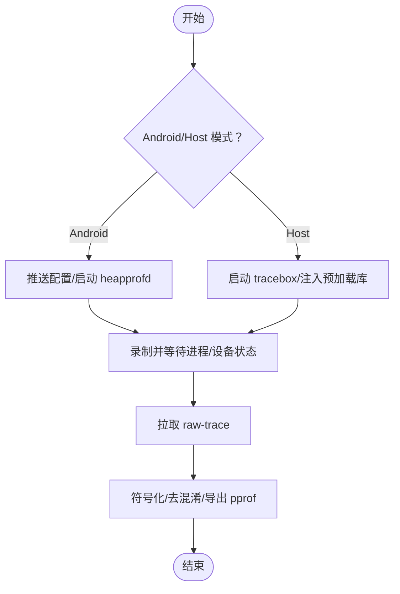
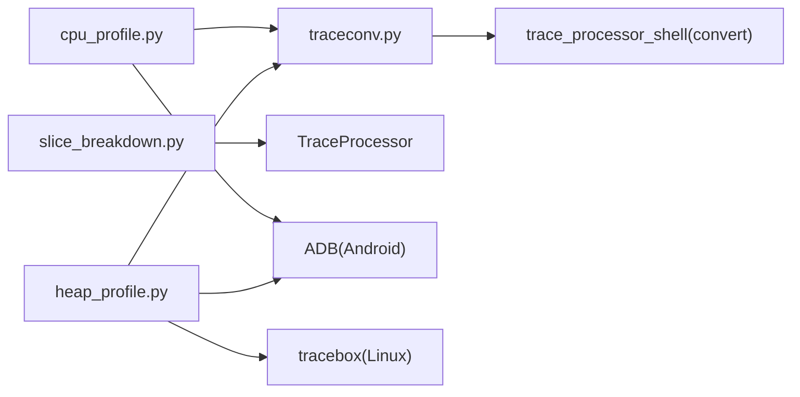

# 批处理工具

<cite>
**本文引用的文件**
- [traceconv.py](file://python/tools/traceconv.py)
- [slice_breakdown.py](file://python/tools/slice_breakdown.py)
- [cpu_profile.py](file://python/tools/cpu_profile.py)
- [heap_profile.py](file://python/tools/heap_profile.py)
- [traceconv 文档](file://docs/quickstart/traceconv.md)
- [CPU 性能分析指南](file://docs/getting-started/cpu-profiling.md)
- [堆分析 CLI 参考](file://docs/reference/heap_profile-cli.md)
- [trace_processor 转换子命令](file://src/trace_processor/shell/convert_subcommand.cc)
</cite>

## 目录
1. [简介](#简介)
2. [项目结构](#项目结构)
3. [核心组件](#核心组件)
4. [架构总览](#架构总览)
5. [详细组件分析](#详细组件分析)
6. [依赖关系分析](#依赖关系分析)
7. [性能考量](#性能考量)
8. [故障排查指南](#故障排查指南)
9. [结论](#结论)
10. [附录](#附录)

## 简介
本文件面向使用 Perfetto 批处理工具链进行轨迹转换与性能/内存分析的工程师与研究者。重点覆盖以下工具：
- traceconv：将 Perfetto 原生二进制轨迹转换为多种外部格式（文本、JSON、systrace、pprof）并支持符号化与去混淆。
- slice_breakdown：对用户态切片进行自时间分解，按进程/线程/线程状态统计。
- cpu_profile：在 Android/Linux 上录制 CPU 性能计数器与调用栈采样，并可选符号化与导出 pprof。
- heap_profile：在 Android/Linux 上采集原生堆分配轨迹，支持符号化、去混淆与 pprof 导出。

文档将从系统架构、数据流、处理逻辑、集成点、错误处理与性能特性等方面进行深入解析，并提供使用示例、组合工作流与常见问题解决方案。

## 项目结构
本节概览与批处理工具直接相关的目录与文件组织方式：
- Python 工具层：位于 python/tools 下，封装了 traceconv、slice_breakdown、cpu_profile、heap_profile 的命令行入口与业务逻辑。
- 文档层：docs/quickstart 与 docs/reference 提供使用说明与 CLI 参数参考。
- 核心实现层：src/trace_processor/shell/convert_subcommand.cc 展示了 traceconv 子命令在 trace_processor_shell 中的桥接实现。

**图表来源**
- [traceconv.py:1-34](file://python/tools/traceconv.py#L1-L34)
- [slice_breakdown.py:1-82](file://python/tools/slice_breakdown.py#L1-L82)
- [cpu_profile.py:1-523](file://python/tools/cpu_profile.py#L1-L523)
- [heap_profile.py:1-744](file://python/tools/heap_profile.py#L1-L744)
- [traceconv 文档:1-46](file://docs/quickstart/traceconv.md#L1-L46)
- [CPU 性能分析指南:1-452](file://docs/getting-started/cpu-profiling.md#L1-L452)
- [堆分析 CLI 参考:1-100](file://docs/reference/heap_profile-cli.md#L1-L100)
- [trace_processor 转换子命令:93-137](file://src/trace_processor/shell/convert_subcommand.cc#L93-L137)

**章节来源**
- [traceconv.py:1-34](file://python/tools/traceconv.py#L1-L34)
- [slice_breakdown.py:1-82](file://python/tools/slice_breakdown.py#L1-L82)
- [cpu_profile.py:1-523](file://python/tools/cpu_profile.py#L1-L523)
- [heap_profile.py:1-744](file://python/tools/heap_profile.py#L1-L744)
- [traceconv 文档:1-46](file://docs/quickstart/traceconv.md#L1-L46)
- [CPU 性能分析指南:1-452](file://docs/getting-started/cpu-profiling.md#L1-L452)
- [堆分析 CLI 参考:1-100](file://docs/reference/heap_profile-cli.md#L1-L100)
- [trace_processor 转换子命令:93-137](file://src/trace_processor/shell/convert_subcommand.cc#L93-L137)

## 核心组件
- traceconv：负责将 Perfetto 原生轨迹转换为 text/json/systrace/profile 等格式；支持符号化与去混淆；通过预编译二进制分发。
- slice_breakdown：基于 TraceProcessor 对用户态切片进行自时间分解，输出 CSV 报表。
- cpu_profile：自动化构建 Perfetto 配置，录制 CPU 性能计数器与调用栈采样，拉取原始轨迹，符号化并导出 pprof。
- heap_profile：在 Android/Linux 上采集原生堆分配轨迹，支持符号化、去混淆与 pprof 导出；提供 Android 与 Host 两种模式。

**章节来源**
- [traceconv.py:23-34](file://python/tools/traceconv.py#L23-L34)
- [slice_breakdown.py:46-82](file://python/tools/slice_breakdown.py#L46-L82)
- [cpu_profile.py:76-168](file://python/tools/cpu_profile.py#L76-L168)
- [heap_profile.py:350-744](file://python/tools/heap_profile.py#L350-L744)

## 架构总览
下图展示了批处理工具的整体架构与数据流：Python 工具通过预编译二进制（traceconv、tracebox 等）与设备/本地环境交互，生成原始轨迹，再由 traceconv 进行格式转换与符号化，最终产出 pprof 等分析产物。

**图表来源**
- [cpu_profile.py:329-395](file://python/tools/cpu_profile.py#L329-L395)
- [heap_profile.py:631-739](file://python/tools/heap_profile.py#L631-L739)
- [traceconv.py:23-34](file://python/tools/traceconv.py#L23-L34)
- [slice_breakdown.py:34-43](file://python/tools/slice_breakdown.py#L34-L43)
- [trace_processor 转换子命令:93-137](file://src/trace_processor/shell/convert_subcommand.cc#L93-L137)

## 详细组件分析

### traceconv 工具
- 功能概述
  - 将 Perfetto 原生二进制轨迹转换为 text、json、systrace、profile 等格式。
  - 支持符号化（symbolize）、去混淆（deobfuscate）与 pprof 导出。
  - 通过预编译二进制分发，便于跨平台使用。
- 关键实现要点
  - 使用预编译清单与下载机制，确保 traceconv 可用。
  - 在 trace_processor_shell 中以 convert 子命令形式桥接 traceconv 的核心能力。
- 输入输出与格式
  - 输入：Perfetto 原生二进制轨迹文件。
  - 输出：根据子命令选择 text/json/systrace/profile；profile 模式输出 pprof 目录。
- 使用场景
  - 将 Android 设备或 Linux 主机上的 Perfetto 轨迹导入 chrome://tracing 或本地 pprof 工具。
  - 在浏览器中通过 ui.perfetto.dev 无缝打开 Legacy UI。
- 命令行参数与行为
  - 通过子命令选择输出格式与后处理（如 --perf、--java-heap、--no-annotations 等）。
  - 与符号路径、输出目录等参数配合使用。

**图表来源**
- [cpu_profile.py:506-518](file://python/tools/cpu_profile.py#L506-L518)
- [heap_profile.py:150-254](file://python/tools/heap_profile.py#L150-L254)
- [traceconv.py:23-34](file://python/tools/traceconv.py#L23-L34)
- [trace_processor 转换子命令:93-137](file://src/trace_processor/shell/convert_subcommand.cc#L93-L137)

**章节来源**
- [traceconv.py:23-34](file://python/tools/traceconv.py#L23-L34)
- [traceconv 文档:13-30](file://docs/quickstart/traceconv.md#L13-L30)
- [trace_processor 转换子命令:93-137](file://src/trace_processor/shell/convert_subcommand.cc#L93-L137)

### slice_breakdown 切片分解工具
- 功能概述
  - 给定一个轨迹文件，计算用户态切片的“自时间”分解，按进程、线程与线程状态聚合。
- 关键实现要点
  - 通过 TraceProcessorConfig 指定 shell 路径与日志级别。
  - 支持指定时间窗口或启动边界（startup bounds）进行分解。
  - 输出 CSV 文件，支持标准输出重定向。
- 输入输出与格式
  - 输入：轨迹文件路径。
  - 输出：CSV 表格，列包含进程、线程、线程状态与自时间。
- 使用场景
  - 定位用户态热点函数与线程状态切换开销。
  - 结合 UI 进行时间轴与火焰图分析。
- 命令行参数与行为
  - --file：必需，输入轨迹文件。
  - --shell-path：可选，TraceProcessor 可执行路径。
  - --start-ts/--end-ts：可选，时间窗口。
  - --startup-bounds/--startup-package/--process-name：可选，启动边界模式。
  - --verbose：可选，启用详细日志。
  - --out-csv：必需，输出 CSV 文件路径（支持 - 表示标准输出）。

**图表来源**
- [slice_breakdown.py:46-82](file://python/tools/slice_breakdown.py#L46-L82)
- [slice_breakdown.py:34-43](file://python/tools/slice_breakdown.py#L34-L43)

**章节来源**
- [slice_breakdown.py:15-82](file://python/tools/slice_breakdown.py#L15-L82)

### cpu_profile CPU 性能分析工具
- 功能概述
  - 自动构建 Perfetto 配置，录制 CPU 性能计数器与调用栈采样，支持硬件事件与软件定时器。
  - 支持符号化与 pprof 导出；可打印配置用于调试。
- 关键实现要点
  - 解析与验证命令行参数，支持自定义配置文件与进程名匹配策略。
  - 通过 ADB 推送配置、启动 perfetto、拉取轨迹、清理设备端残留。
  - 调用 traceconv 进行符号化与 pprof 导出。
- 输入输出与格式
  - 输入：Android 设备（需满足版本要求）或本地 Linux 主机。
  - 输出：raw-trace、symbolized-trace、pprof 目录。
- 使用场景
  - 定位 CPU 瓶颈、识别热点调用栈、结合调度与系统调用数据进行综合分析。
- 命令行参数与行为
  - -f/--frequency：采样频率（默认 100 Hz）。
  - -d/--duration：时长（毫秒，0 表示直到中断）。
  - -e/--event：硬件计数器事件（如 HW_CPU_CYCLES、HW_INSTRUCTIONS 等）。
  - -k/--kernel-frames：是否收集内核帧。
  - -n/--name：待采样的进程名列表（逗号分隔）。
  - -p/--partial-matching：部分匹配运行中的进程名。
  - -c/--config：自定义配置文件（与 -f/-d/-n 冲突）。
  - --no-annotations：不附加 ART 模式注解。
  - --print-config：仅打印配置。
  - -o/--output：输出目录。
  - 其他：ADB 连接检查、中断处理、符号化与 pprof 导出。

**图表来源**
- [cpu_profile.py:76-168](file://python/tools/cpu_profile.py#L76-L168)
- [cpu_profile.py:329-395](file://python/tools/cpu_profile.py#L329-L395)
- [cpu_profile.py:423-488](file://python/tools/cpu_profile.py#L423-L488)

**章节来源**
- [cpu_profile.py:15-523](file://python/tools/cpu_profile.py#L15-L523)
- [CPU 性能分析指南:173-358](file://docs/getting-started/cpu-profiling.md#L173-L358)

### heap_profile 堆分析工具
- 功能概述
  - 在 Android/Linux 上采集原生堆分配轨迹，支持符号化、去混淆与 pprof 导出。
  - 提供 Android 与 Host 两种模式；Host 模式通过 LD_PRELOAD 注入。
- 关键实现要点
  - Android 模式：通过 ADB 推送配置、启动 heapprofd、拉取轨迹、可选符号化与去混淆。
  - Host 模式：通过 tracebox 启动系统套接字，注入预加载库，等待进程退出后停止会话。
  - 支持连续转储、块客户端策略、目标堆选择等高级选项。
- 输入输出与格式
  - 输入：Android 设备或本地进程。
  - 输出：raw-trace、symbolized-trace、pprof 目录；Windows 下不生成 gzip。
- 使用场景
  - 定位内存泄漏、高分配热点、分析不同堆（如 libc.malloc、ART）的行为。
- 命令行参数与行为
  - 通用参数：-i/--interval、-d/--duration、-p/--pid、-n/--name、-c/--continuous-dump、--shmem-size、--block-client 等。
  - Android 特有：--no-running、--no-startup、--all-heaps、--heaps、--disable-selinux、--simpleperf 等。
  - Host 特有：--preload-library、--tracebox-binary、--cmd。
  - 其他：--print-config、--no-annotations、--output 等。

**图表来源**
- [heap_profile.py:257-337](file://python/tools/heap_profile.py#L257-L337)
- [heap_profile.py:631-739](file://python/tools/heap_profile.py#L631-L739)

**章节来源**
- [heap_profile.py:1-744](file://python/tools/heap_profile.py#L1-L744)
- [堆分析 CLI 参考:13-100](file://docs/reference/heap_profile-cli.md#L13-L100)

## 依赖关系分析
- Python 工具之间的耦合
  - cpu_profile 与 heap_profile 均依赖 traceconv 进行符号化与 pprof 导出。
  - slice_breakdown 依赖 TraceProcessor 进行轨迹读取与分解。
- 外部依赖
  - ADB：Android 模式下的设备通信与文件传输。
  - tracebox：Linux Host 模式下的系统套接字与会话管理。
  - trace_processor_shell：traceconv 子命令的核心执行引擎。
- 预编译二进制
  - traceconv、tracebox 等通过预编译清单自动下载，确保跨平台可用性。

**图表来源**
- [cpu_profile.py:397-407](file://python/tools/cpu_profile.py#L397-L407)
- [heap_profile.py:257-337](file://python/tools/heap_profile.py#L257-L337)
- [slice_breakdown.py:34-43](file://python/tools/slice_breakdown.py#L34-L43)
- [trace_processor 转换子命令:93-137](file://src/trace_processor/shell/convert_subcommand.cc#L93-L137)

**章节来源**
- [cpu_profile.py:397-407](file://python/tools/cpu_profile.py#L397-L407)
- [heap_profile.py:257-337](file://python/tools/heap_profile.py#L257-L337)
- [slice_breakdown.py:34-43](file://python/tools/slice_breakdown.py#L34-L43)
- [trace_processor 转换子命令:93-137](file://src/trace_processor/shell/convert_subcommand.cc#L93-L137)

## 性能考量
- 采样频率与缓冲区
  - CPU 采样频率过高会增加内核与用户态开销；建议根据目标平台 PMU 能力与负载进行权衡。
  - 堆采样间隔过小可能导致频繁转储与 I/O 压力；可通过 --shmem-size 与 --block-client 策略平衡吞吐与延迟。
- 数据源组合
  - 将 CPU 采样与调度、系统调用、CPU 频率等数据源组合在同一时间线上，有助于定位跨域瓶颈。
- 符号化与去混淆
  - 缺失符号会显著影响火焰图可读性；优先准备调试符号与 ProGuard 映射。
- 输出格式选择
  - pprof 更适合纯火焰图可视化；文本/JSON 适合进一步脚本化处理与二次分析。

## 故障排查指南
- ADB 相关
  - 设备未连接或多设备：设置 ANDROID_SERIAL 指定设备；确认 ADB 权限与授权。
  - Android 版本不满足：cpu_profile/heap_profile 对 Android T/R 等版本有最低要求。
- 输出目录
  - 输出目录非空或不存在：确保目录为空且存在；Host 模式下 Linux 下会创建临时目录。
- 符号化失败
  - 未找到 traceconv 或下载失败：检查网络与预编译清单；手动指定 --traceconv-binary。
  - 符号路径缺失：设置 PERFETTO_BINARY_PATH 或 ANDROID_PRODUCT_OUT/symbols。
- 堆分析已知问题
  - 不同 Android 版本存在已知问题与规避方案，可参考堆分析文档中的已知问题链接。
- 中断与清理
  - 使用 Ctrl+C 正常中断；脚本会尝试发送 INT 信号并等待进程退出，随后拉取轨迹并清理设备端残留。

**章节来源**
- [cpu_profile.py:61-74](file://python/tools/cpu_profile.py#L61-L74)
- [cpu_profile.py:329-395](file://python/tools/cpu_profile.py#L329-L395)
- [heap_profile.py:93-119](file://python/tools/heap_profile.py#L93-L119)
- [heap_profile.py:631-739](file://python/tools/heap_profile.py#L631-L739)

## 结论
Perfetto 批处理工具链提供了从采集、转换到可视化的完整闭环：traceconv 负责多格式输出与符号化；slice_breakdown 提供用户态切片自时间分解；cpu_profile 与 heap_profile 则分别覆盖 CPU 与内存领域的采样与分析。通过合理配置参数、组合数据源与利用符号化/去混淆能力，可以高效定位系统级与应用级性能与内存问题。

## 附录
- 实际使用示例（步骤化）
  - CPU 性能分析
    - 在 Android 上：使用 cpu_profile -n 包名 -f 100 开始录制，Ctrl+C 停止；在输出目录查看 raw-trace 与 pprof。
    - 在 Linux 上：使用 tracebox 记录后，使用 traceconv profile --perf 生成 pprof。
  - 堆分析
    - Android：使用 heap_profile android -n 包名 -d 10000 -i 4096 采集；完成后在输出目录查看 pprof。
    - Host：使用 heap_profile host -n 进程名 --cmd -- mybinary 采集。
  - 轨迹转换
    - 使用 traceconv text/json/systrace/profile 输入文件 输出文件；必要时添加符号化与去混淆步骤。
  - 切片分解
    - 使用 slice_breakdown --file 轨迹.pb --out-csv breakdown.csv；或 --startup-bounds 指定启动边界。
- 常见工作流
  - CPU 瓶颈定位：先用 cpu_profile 采集，再在 UI 中查看火焰图；结合调度与系统调用数据。
  - 内存泄漏排查：用 heap_profile 采集，结合 pprof/Speedscope 查看堆分配热点与调用栈。
  - 多格式对比：用 traceconv 导出 JSON/text/systrace，分别用于不同工具链与团队协作。