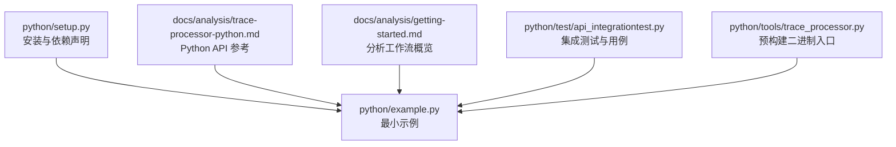
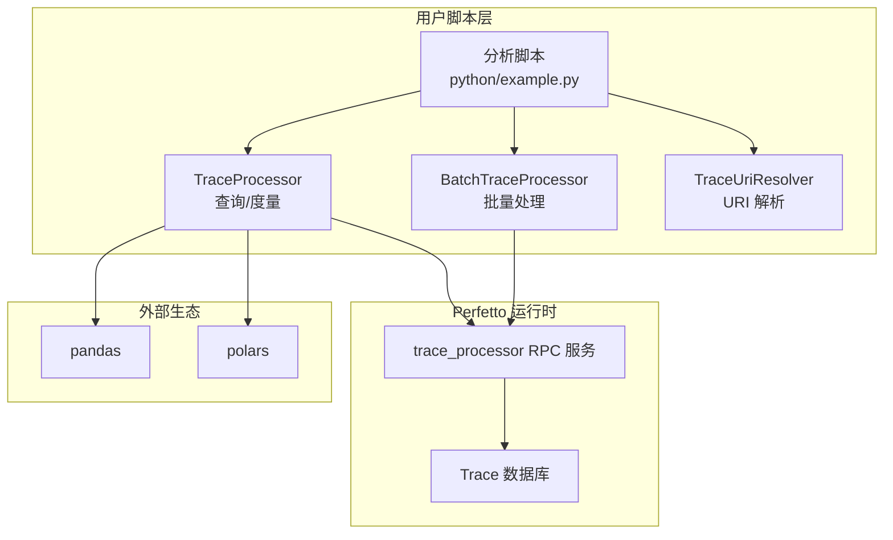
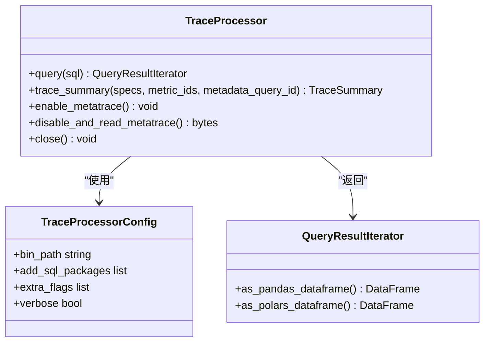
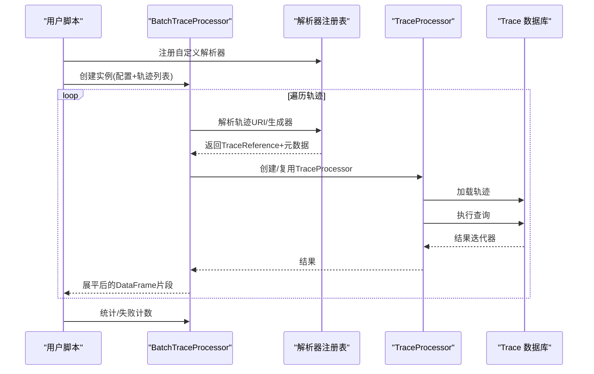
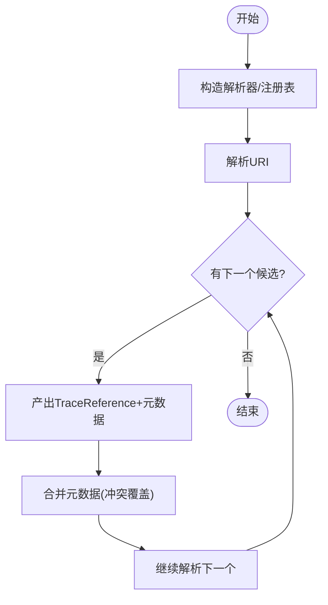
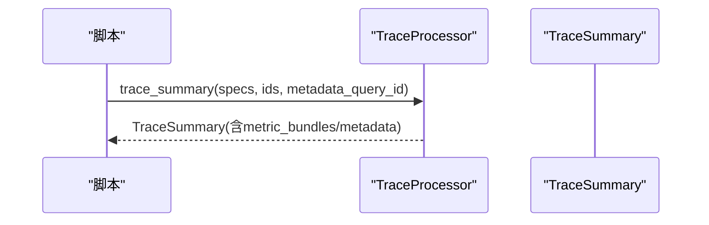
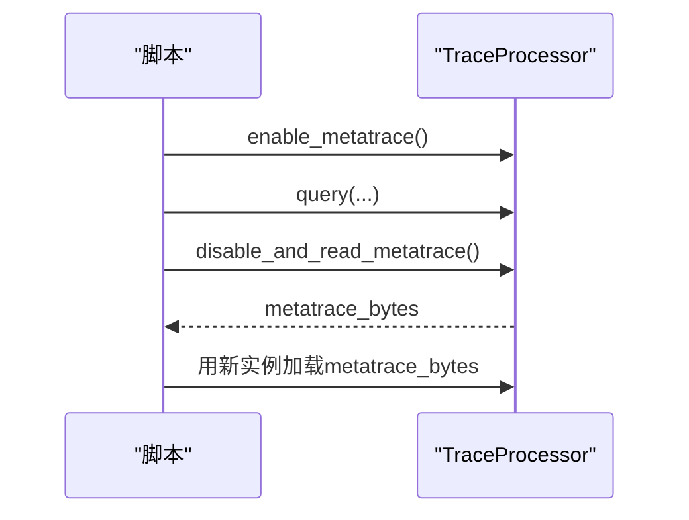
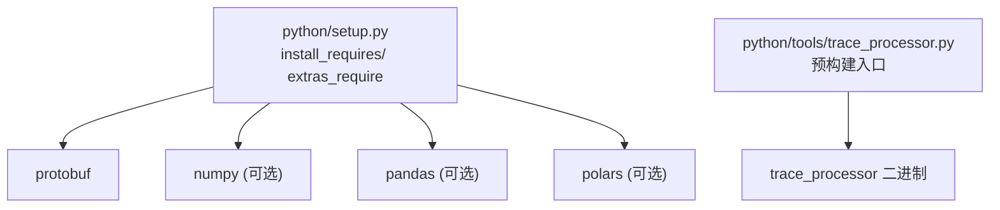

# 自定义分析脚本

<cite>
**本文引用的文件**
- [python/README.md](file://python/README.md)
- [python/setup.py](file://python/setup.py)
- [python/requirements.txt](file://python/requirements.txt)
- [python/example.py](file://python/example.py)
- [docs/analysis/trace-processor-python.md](file://docs/analysis/trace-processor-python.md)
- [docs/analysis/getting-started.md](file://docs/analysis/getting-started.md)
- [python/test/api_integrationtest.py](file://python/test/api_integrationtest.py)
- [python/tools/trace_processor.py](file://python/tools/trace_processor.py)
</cite>

## 目录
1. [简介](#简介)
2. [项目结构](#项目结构)
3. [核心组件](#核心组件)
4. [架构总览](#架构总览)
5. [详细组件分析](#详细组件分析)
6. [依赖分析](#依赖分析)
7. [性能考虑](#性能考虑)
8. [故障排查指南](#故障排查指南)
9. [结论](#结论)
10. [附录](#附录)

## 简介
本指南面向使用 Perfetto Python API 开发“自定义分析脚本与自动化工具”的工程师与测试人员。内容覆盖从基础用法到高级模式（批量处理、元跟踪、度量汇总），并提供测试与验证方法、部署与分发策略、代码组织最佳实践以及调试与性能优化建议。目标是帮助你在不深入 C++ 内核的前提下，利用 Python 生态高效完成轨迹加载、数据处理、结果生成与报告输出。

## 项目结构
与 Python 分析脚本开发直接相关的关键位置如下：
- 包与入口：python/setup.py 定义了安装包、依赖与可选生态扩展；python/example.py 提供最小可用示例。
- 文档与参考：docs/analysis/trace-processor-python.md 为 Python API 的权威参考；docs/analysis/getting-started.md 提供整体分析工作流概览。
- 测试与工具：python/test/api_integrationtest.py 展示了 TraceProcessor、BatchTraceProcessor、URI 解析器、统计与失败处理等真实用例；python/tools/trace_processor.py 提供预构建二进制的便捷入口。

**图示来源**
- [python/setup.py:1-43](file://python/setup.py#L1-L43)
- [python/example.py:1-70](file://python/example.py#L1-L70)
- [docs/analysis/trace-processor-python.md:1-383](file://docs/analysis/trace-processor-python.md#L1-L383)
- [docs/analysis/getting-started.md:1-90](file://docs/analysis/getting-started.md#L1-L90)
- [python/test/api_integrationtest.py:1-649](file://python/test/api_integrationtest.py#L1-L649)
- [python/tools/trace_processor.py:1-34](file://python/tools/trace_processor.py#L1-L34)

**章节来源**
- [python/README.md:1-10](file://python/README.md#L1-L10)
- [python/setup.py:1-43](file://python/setup.py#L1-L43)
- [python/requirements.txt:1-8](file://python/requirements.txt#L1-L8)
- [docs/analysis/trace-processor-python.md:1-383](file://docs/analysis/trace-processor-python.md#L1-L383)
- [docs/analysis/getting-started.md:1-90](file://docs/analysis/getting-started.md#L1-L90)
- [python/test/api_integrationtest.py:1-649](file://python/test/api_integrationtest.py#L1-L649)
- [python/tools/trace_processor.py:1-34](file://python/tools/trace_processor.py#L1-L34)

## 核心组件
- TraceProcessor：Python 对 C++ Trace Processor 的绑定，负责轨迹加载、查询执行、度量汇总与元跟踪。
- TraceProcessorConfig：用于定制二进制路径、SQL 包、日志级别、附加标志等。
- QueryResultIterator：查询结果迭代器，支持转为 pandas/polars 数据帧。
- TraceSummary：结构化度量汇总，替代已弃用的 metric()。
- BatchTraceProcessor：批量处理多个轨迹，支持观察者、失败处理策略与统计。
- TraceUriResolver：URI 轨迹解析器，支持链式解析与元数据合并。

典型脚本开发模式（基本流程）：
- 初始化 TraceProcessor（本地文件/字节流/生成器/URI/URI 解析器）
- 执行 SQL 查询，获得迭代器或转换为 DataFrame
- 使用 TraceSummary 生成结构化度量
- 关闭连接释放资源

**章节来源**
- [docs/analysis/trace-processor-python.md:72-137](file://docs/analysis/trace-processor-python.md#L72-L137)
- [docs/analysis/trace-processor-python.md:138-224](file://docs/analysis/trace-processor-python.md#L138-L224)
- [docs/analysis/trace-processor-python.md:241-277](file://docs/analysis/trace-processor-python.md#L241-L277)
- [python/test/api_integrationtest.py:104-118](file://python/test/api_integrationtest.py#L104-L118)
- [python/test/api_integrationtest.py:39-93](file://python/test/api_integrationtest.py#L39-L93)

## 架构总览
下图展示了“自定义分析脚本”在系统中的位置与交互：

**图示来源**
- [docs/analysis/trace-processor-python.md:138-224](file://docs/analysis/trace-processor-python.md#L138-L224)
- [docs/analysis/trace-processor-python.md:241-277](file://docs/analysis/trace-processor-python.md#L241-L277)
- [python/test/api_integrationtest.py:104-118](file://python/test/api_integrationtest.py#L104-L118)
- [python/test/api_integrationtest.py:39-93](file://python/test/api_integrationtest.py#L39-L93)

## 详细组件分析

### 组件一：TraceProcessor（轨迹加载与查询）
- 支持多种输入形式：文件路径、文件对象、字节生成器、URI、URI 解析器实例。
- 配置项：二进制路径、SQL 包、附加标志、日志级别、解析器注册表。
- 查询接口：返回迭代器，可转 pandas 或 polars；也可直接遍历。
- 元跟踪：可启用并读取 trace_processor 自身的性能元数据。
- 度量汇总：推荐使用 trace_summary 替代已弃用的 metric()。

**图示来源**
- [docs/analysis/trace-processor-python.md:138-224](file://docs/analysis/trace-processor-python.md#L138-L224)
- [docs/analysis/trace-processor-python.md:279-299](file://docs/analysis/trace-processor-python.md#L279-L299)
- [docs/analysis/trace-processor-python.md:301-383](file://docs/analysis/trace-processor-python.md#L301-L383)

**章节来源**
- [docs/analysis/trace-processor-python.md:72-137](file://docs/analysis/trace-processor-python.md#L72-L137)
- [docs/analysis/trace-processor-python.md:138-224](file://docs/analysis/trace-processor-python.md#L138-L224)
- [docs/analysis/trace-processor-python.md:279-299](file://docs/analysis/trace-processor-python.md#L279-L299)
- [docs/analysis/trace-processor-python.md:301-383](file://docs/analysis/trace-processor-python.md#L301-L383)

### 组件二：BatchTraceProcessor（批量分析）
- 输入：TraceListReference（可为单个或多个轨迹，支持 URI 与解析器）。
- 观察者：可收集每条轨迹处理耗时等统计信息。
- 失败处理：加载失败与执行失败的策略（抛异常或计数）。
- 输出：统一查询与展平为 DataFrame，便于横向对比与报告生成。

**图示来源**
- [python/test/api_integrationtest.py:104-118](file://python/test/api_integrationtest.py#L104-L118)
- [python/test/api_integrationtest.py:39-93](file://python/test/api_integrationtest.py#L39-L93)
- [python/test/api_integrationtest.py:275-304](file://python/test/api_integrationtest.py#L275-L304)

**章节来源**
- [python/test/api_integrationtest.py:104-118](file://python/test/api_integrationtest.py#L104-L118)
- [python/test/api_integrationtest.py:275-304](file://python/test/api_integrationtest.py#L275-L304)

### 组件三：TraceUriResolver（URI 解析与元数据）
- 支持前缀式 URI（如 simple:path=...）与嵌套解析（递归解析器）。
- 返回结果包含数据源元信息，支持键冲突时的覆盖策略。
- 可与 BatchTraceProcessor 协同，实现跨数据源的统一分析。

**图示来源**
- [python/test/api_integrationtest.py:39-93](file://python/test/api_integrationtest.py#L39-L93)
- [python/test/api_integrationtest.py:542-596](file://python/test/api_integrationtest.py#L542-L596)
- [python/test/api_integrationtest.py:597-649](file://python/test/api_integrationtest.py#L597-L649)

**章节来源**
- [python/test/api_integrationtest.py:39-93](file://python/test/api_integrationtest.py#L39-L93)
- [python/test/api_integrationtest.py:542-596](file://python/test/api_integrationtest.py#L542-L596)
- [python/test/api_integrationtest.py:597-649](file://python/test/api_integrationtest.py#L597-L649)

### 组件四：TraceSummary（结构化度量）
- 以规范化的 Protobuf 输出替代旧版 metric()，适合大规模监控与回归检测。
- 支持多指标规格、元数据查询与按 ID 控制是否执行。

**图示来源**
- [docs/analysis/trace-processor-python.md:241-277](file://docs/analysis/trace-processor-python.md#L241-L277)
- [python/test/api_integrationtest.py:352-406](file://python/test/api_integrationtest.py#L352-L406)
- [python/test/api_integrationtest.py:407-433](file://python/test/api_integrationtest.py#L407-L433)

**章节来源**
- [docs/analysis/trace-processor-python.md:241-277](file://docs/analysis/trace-processor-python.md#L241-L277)
- [python/test/api_integrationtest.py:352-406](file://python/test/api_integrationtest.py#L352-L406)
- [python/test/api_integrationtest.py:407-433](file://python/test/api_integrationtest.py#L407-L433)

### 组件五：元跟踪（Metatracing）
- 可对 trace_processor 的内部执行进行采样，导出为轨迹以便进一步分析。
- 适用于定位查询慢点、评估二进制性能。

**图示来源**
- [docs/analysis/trace-processor-python.md:279-299](file://docs/analysis/trace-processor-python.md#L279-L299)

**章节来源**
- [docs/analysis/trace-processor-python.md:279-299](file://docs/analysis/trace-processor-python.md#L279-L299)

## 依赖分析
- 安装依赖：protobuf（核心）、可选 numpy/pandas（pandas）、polars（polars）。
- 运行时二进制：可通过 TraceProcessorConfig 指定自定义路径，或使用预构建入口脚本。
- 版本兼容：setup.py 声明支持 Python 3.9~3.12。

**图示来源**
- [python/setup.py:26-33](file://python/setup.py#L26-L33)
- [python/requirements.txt:1-8](file://python/requirements.txt#L1-L8)
- [python/tools/trace_processor.py:27-31](file://python/tools/trace_processor.py#L27-L31)

**章节来源**
- [python/setup.py:26-33](file://python/setup.py#L26-L33)
- [python/requirements.txt:1-8](file://python/requirements.txt#L1-L8)
- [python/tools/trace_processor.py:27-31](file://python/tools/trace_processor.py#L27-L31)

## 性能考虑
- 优先使用 TraceSummary 进行大规模稳定输出，避免逐条轨迹手写复杂查询。
- 在 BatchTraceProcessor 中使用观察者统计执行时间，识别瓶颈轨迹。
- 将查询结果转为 DataFrame 后再做聚合与可视化，减少多次往返查询。
- 合理设置 TraceProcessorConfig 的 verbose 与附加标志，平衡可观测性与开销。
- 对于超大轨迹，尽量在 SQL 层做裁剪与聚合，减少 Python 层内存压力。

[本节为通用指导，无需特定文件来源]

## 故障排查指南
- 初始化失败：检查 trace 参数类型（路径/文件/生成器/URI/解析器）与权限。
- 连接失败：确认 trace_processor 二进制可执行且端口可用；必要时指定 bin_path。
- 查询报错：使用 FailureHandling.INCREMENT_STAT 查看失败计数；结合元数据定位问题轨迹。
- 元数据缺失：当从路径加载时会自动注入 _path；从文件/生成器加载时为空，需通过解析器注入。
- 元跟踪：若导出的元跟踪无法加载，确认使用相同版本的二进制。

**章节来源**
- [python/test/api_integrationtest.py:133-148](file://python/test/api_integrationtest.py#L133-L148)
- [python/test/api_integrationtest.py:275-304](file://python/test/api_integrationtest.py#L275-L304)
- [python/test/api_integrationtest.py:542-596](file://python/test/api_integrationtest.py#L542-L596)
- [python/test/api_integrationtest.py:597-649](file://python/test/api_integrationtest.py#L597-L649)
- [docs/analysis/trace-processor-python.md:279-299](file://docs/analysis/trace-processor-python.md#L279-L299)

## 结论
借助 TraceProcessor 与 BatchTraceProcessor，你可以快速构建从“交互探索—程序化分析—规模化自动化”的完整分析管线。配合 TraceSummary 与 URI 解析器，既能满足灵活的定制需求，又能保证输出的稳定性与可比性。通过完善的测试与元跟踪能力，可以持续优化性能并提升可靠性。

[本节为总结，无需特定文件来源]

## 附录

### A. 基本模式与示例清单
- 轨迹加载与查询
  - 示例路径：[python/example.py:21-66](file://python/example.py#L21-L66)
  - 参考文档：[docs/analysis/trace-processor-python.md:72-137](file://docs/analysis/trace-processor-python.md#L72-L137)
- 结果转 DataFrame 与可视化
  - 参考文档：[docs/analysis/trace-processor-python.md:169-224](file://docs/analysis/trace-processor-python.md#L169-L224)
- TraceSummary（结构化度量）
  - 参考文档：[docs/analysis/trace-processor-python.md:241-277](file://docs/analysis/trace-processor-python.md#L241-L277)
  - 测试用例：[python/test/api_integrationtest.py:352-406](file://python/test/api_integrationtest.py#L352-L406)
- 批量处理与失败处理
  - 测试用例：[python/test/api_integrationtest.py:275-304](file://python/test/api_integrationtest.py#L275-L304)
- URI 解析与元数据合并
  - 测试用例：[python/test/api_integrationtest.py:216-274](file://python/test/api_integrationtest.py#L216-L274)
  - 测试用例：[python/test/api_integrationtest.py:542-649](file://python/test/api_integrationtest.py#L542-L649)

### B. 测试与验证方法
- 单元测试：基于 unittest 的 API 行为验证（查询、异常、元数据、解析器）。
- 集成测试：端到端验证 BatchTraceProcessor、URI 解析器、统计与失败处理。
- 性能基准：使用观察者统计每条轨迹执行时间，定位慢查询与异常轨迹。

**章节来源**
- [python/test/api_integrationtest.py:1-649](file://python/test/api_integrationtest.py#L1-L649)

### C. 部署与分发
- 安装：pip 安装 perfetto 包；根据需要选择 extras（pandas/polares）。
- 二进制：通过 TraceProcessorConfig 指定自定义路径；或使用预构建入口脚本。
- 版本管理：关注 setup.py 中的 Python 版本范围与依赖版本。

**章节来源**
- [python/setup.py:18-42](file://python/setup.py#L18-L42)
- [python/tools/trace_processor.py:27-31](file://python/tools/trace_processor.py#L27-L31)

### D. 代码组织最佳实践
- 模块化设计：将轨迹加载、查询封装为独立函数/类；将可视化与报告生成解耦。
- 错误处理：区分加载失败与查询失败，采用不同策略（抛异常/计数/跳过）。
- 日志记录：开启 verbose 以捕获 trace_processor 输出；在脚本中记录关键步骤与耗时。
- 配置管理：集中管理 TraceProcessorConfig、SQL 包路径与附加标志。

**章节来源**
- [docs/analysis/trace-processor-python.md:107-137](file://docs/analysis/trace-processor-python.md#L107-L137)
- [python/test/api_integrationtest.py:275-304](file://python/test/api_integrationtest.py#L275-L304)

### E. 调试技巧与性能优化建议
- 使用元跟踪导出 trace_processor 的内部执行，定位热点。
- 在 BatchTraceProcessor 中使用观察者统计执行时间，识别异常轨迹。
- 将 SQL 层做足裁剪与聚合，减少 Python 层数据搬运。
- 通过 URI 解析器统一数据源，确保元数据一致与可追溯。

**章节来源**
- [docs/analysis/trace-processor-python.md:279-299](file://docs/analysis/trace-processor-python.md#L279-L299)
- [python/test/api_integrationtest.py:238-247](file://python/test/api_integrationtest.py#L238-L247)