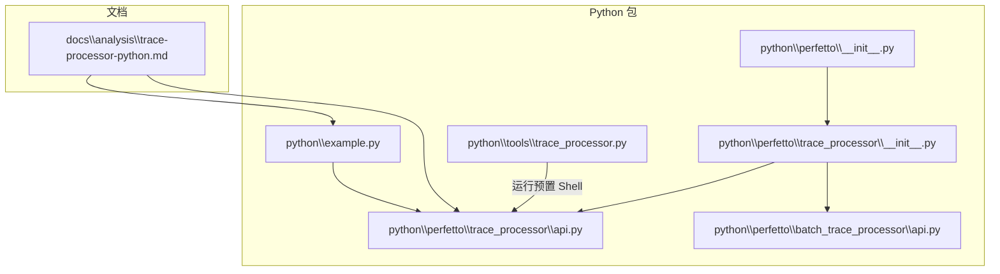
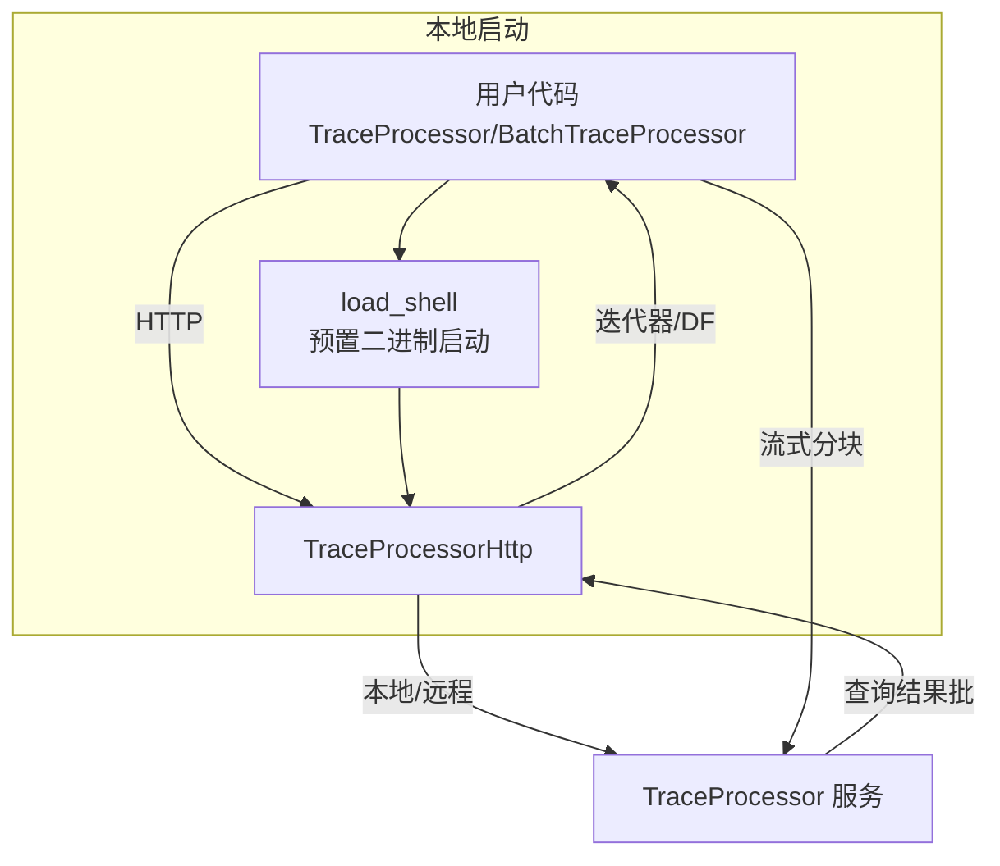
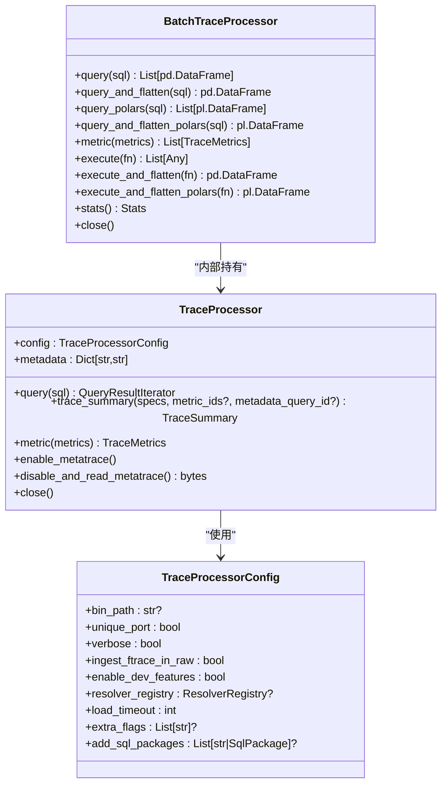
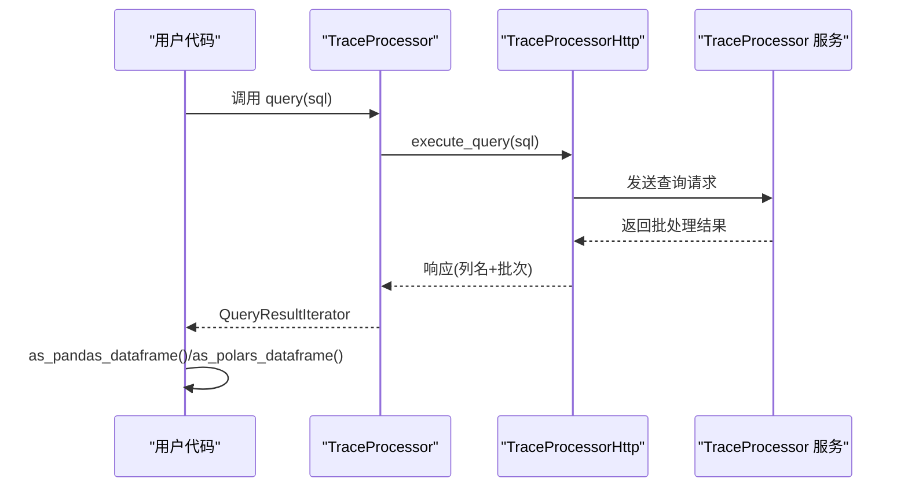
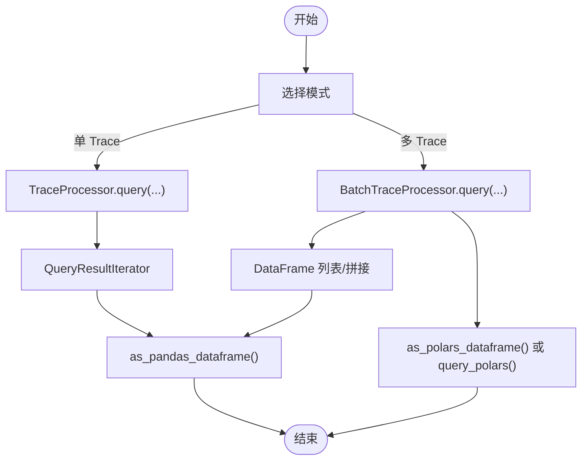
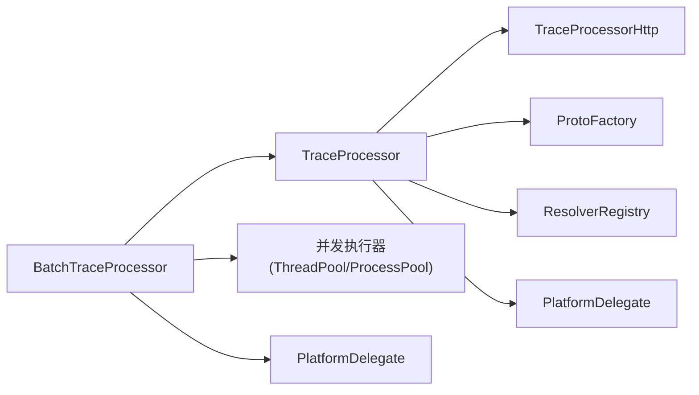

# Python API

<cite>
**本文引用的文件**
- [python\perfetto\trace_processor\api.py](file://python\perfetto\trace_processor\api.py)
- [python\example.py](file://python\example.py)
- [python\perfetto\__init__.py](file://python\perfetto\__init__.py)
- [python\perfetto\trace_processor\__init__.py](file://python\perfetto\trace_processor\__init__.py)
- [python\perfetto\batch_trace_processor\api.py](file://python\perfetto\batch_trace_processor\api.py)
- [python\tools\trace_processor.py](file://python\tools\trace_processor.py)
- [docs\analysis\trace-processor-python.md](file://docs\analysis\trace-processor-python.md)
</cite>

## 目录
1. [简介](#简介)
2. [项目结构](#项目结构)
3. [核心组件](#核心组件)
4. [架构总览](#架构总览)
5. [详细组件分析](#详细组件分析)
6. [依赖关系分析](#依赖关系分析)
7. [性能考虑](#性能考虑)
8. [故障排除指南](#故障排除指南)
9. [结论](#结论)
10. [附录](#附录)

## 简介
本文件面向使用 Trace Processor 的 Python 绑定进行系统级跟踪分析的开发者，提供从初始化、配置到查询执行、Shell 模式、与 pandas/polars 集成、性能优化与内存管理、以及常见问题排查的完整技术文档。读者无需深入底层即可高效完成常见分析任务。

## 项目结构
与 Python API 相关的关键位置如下：
- 核心 API 实现：python\perfetto\trace_processor\api.py（TraceProcessor 类、配置、查询执行、资源关闭）
- 批处理 API：python\perfetto\batch_trace_processor\api.py（批量并行处理 Trace）
- 示例与用法：python\example.py（命令行参数解析、基本查询与 DataFrame 转换）
- 包入口与导出：python\perfetto\__init__.py、python\perfetto\trace_processor\__init__.py（包路径扩展与对外 API 导出）
- Shell 启动器：python\tools\trace_processor.py（预置二进制 Shell 启动）
- 文档参考：docs\analysis\trace-processor-python.md（Python 使用与 pandas 集成示例）

**图表来源**
- [python\perfetto\__init__.py:1-19](file://python\perfetto\__init__.py#L1-L19)
- [python\perfetto\trace_processor\__init__.py:16-21](file://python\perfetto\trace_processor\__init__.py#L16-L21)
- [python\perfetto\trace_processor\api.py:122-361](file://python\perfetto\trace_processor\api.py#L122-L361)
- [python\perfetto\batch_trace_processor\api.py:104-507](file://python\perfetto\batch_trace_processor\api.py#L104-L507)
- [python\example.py:16-70](file://python\example.py#L16-L70)
- [python\tools\trace_processor.py:23-34](file://python\tools\trace_processor.py#L23-L34)
- [docs\analysis\trace-processor-python.md:207-239](file://docs\analysis\trace-processor-python.md#L207-L239)

**章节来源**
- [python\perfetto\__init__.py:1-19](file://python\perfetto\__init__.py#L1-L19)
- [python\perfetto\trace_processor\__init__.py:16-21](file://python\perfetto\trace_processor\__init__.py#L16-L21)
- [python\perfetto\trace_processor\api.py:122-361](file://python\perfetto\trace_processor\api.py#L122-L361)
- [python\perfetto\batch_trace_processor\api.py:104-507](file://python\perfetto\batch_trace_processor\api.py#L104-L507)
- [python\example.py:16-70](file://python\example.py#L16-L70)
- [python\tools\trace_processor.py:23-34](file://python\tools\trace_processor.py#L23-L34)
- [docs\analysis\trace-processor-python.md:207-239](file://docs\analysis\trace-processor-python.md#L207-L239)

## 核心组件
- TraceProcessorConfig：控制 TraceProcessor 行为的配置项，如二进制路径、端口策略、日志级别、是否启用开发特性、URI 解析器注册表、加载超时、额外启动参数、SQL 包加载等。
- TraceProcessor：核心类，负责：
  - 初始化与连接（本地二进制或远程地址）
  - 加载单个 Trace（支持文件路径、文件对象、字节生成器、Trace URI、自定义 Resolver）
  - 执行 SQL 查询并返回迭代器，可转为 pandas/polars DataFrame
  - 计算指标（metric）与结构化摘要（trace_summary）
  - 元数据访问与资源清理（close）
- BatchTraceProcessor：用于在多个 Trace 上并行执行查询或指标计算，并可将结果拼接为统一 DataFrame；支持失败处理策略（抛异常或统计计数）。

**章节来源**
- [python\perfetto\trace_processor\api.py:58-120](file://python\perfetto\trace_processor\api.py#L58-L120)
- [python\perfetto\trace_processor\api.py:122-361](file://python\perfetto\trace_processor\api.py#L122-L361)
- [python\perfetto\batch_trace_processor\api.py:72-103](file://python\perfetto\batch_trace_processor\api.py#L72-L103)
- [python\perfetto\batch_trace_processor\api.py:104-507](file://python\perfetto\batch_trace_processor\api.py#L104-L507)

## 架构总览
TraceProcessor 的 Python API 通过 HTTP 客户端与本地或远程 Trace Processor 服务通信。当未指定地址时，会自动拉起预置二进制并通过 Shell 启动服务；当指定地址时，直接连接已有实例。Trace 加载采用流式分块推送，查询结果以批处理形式返回，支持转换为 pandas/polars 数据帧。

**图表来源**
- [python\perfetto\trace_processor\api.py:289-306](file://python\perfetto\trace_processor\api.py#L289-L306)
- [python\perfetto\trace_processor\api.py:308-328](file://python\perfetto\trace_processor\api.py#L308-L328)
- [python\perfetto\trace_processor\api.py:182-201](file://python\perfetto\trace_processor\api.py#L182-L201)
- [python\tools\trace_processor.py:23-34](file://python\tools\trace_processor.py#L23-L34)

## 详细组件分析

### TraceProcessor 类
- 初始化与连接
  - 支持通过 trace 参数加载单个 Trace（多种输入类型），或通过 addr 连接到已运行的服务。
  - 若未提供 addr，则通过 load_shell 自动启动本地服务并建立 HTTP 连接。
- 查询执行
  - query(sql) 返回 QueryResultIterator，可逐行遍历；也可调用 as_pandas_dataframe()/as_polars_dataframe() 转为数据帧。
  - 错误通过 TraceProcessorException 抛出。
- Trace 加载
  - 通过 TraceUriResolver 注册表解析 trace，仅支持单个 Trace；多 Trace 请使用 BatchTraceProcessor。
- 资源管理
  - close() 会终止子进程、关闭连接、释放资源；支持 with 上下文管理器自动关闭。

**图表来源**
- [python\perfetto\trace_processor\api.py:58-120](file://python\perfetto\trace_processor\api.py#L58-L120)
- [python\perfetto\trace_processor\api.py:122-361](file://python\perfetto\trace_processor\api.py#L122-L361)
- [python\perfetto\batch_trace_processor\api.py:72-103](file://python\perfetto\batch_trace_processor\api.py#L72-L103)
- [python\perfetto\batch_trace_processor\api.py:104-507](file://python\perfetto\batch_trace_processor\api.py#L104-L507)

**章节来源**
- [python\perfetto\trace_processor\api.py:122-361](file://python\perfetto\trace_processor\api.py#L122-L361)

### 查询执行流程（execute_query）
- 输入：SQL 字符串
- 处理：通过 HTTP 客户端发送请求，TraceProcessor 服务执行查询并返回批处理结果
- 输出：QueryResultIterator；可转 pandas/polars DataFrame
- 错误：若响应含错误字段，抛出 TraceProcessorException

**图表来源**
- [python\perfetto\trace_processor\api.py:182-201](file://python\perfetto\trace_processor\api.py#L182-L201)

**章节来源**
- [python\perfetto\trace_processor\api.py:182-201](file://python\perfetto\trace_processor\api.py#L182-L201)

### Shell 模式与批处理
- Shell 启动器
  - python\tools\trace_processor.py 提供对预置二进制的统一入口，便于在不同环境下运行 Trace Processor Shell。
- 批处理 API
  - BatchTraceProcessor 支持多 Trace 并行加载与查询，提供多种聚合输出（DataFrame 列表、拼接后的单表、Polars 支持）。
  - 支持失败处理策略：抛异常或统计失败次数。

**图表来源**
- [python\perfetto\batch_trace_processor\api.py:217-315](file://python\perfetto\batch_trace_processor\api.py#L217-L315)
- [python\tools\trace_processor.py:23-34](file://python\tools\trace_processor.py#L23-L34)

**章节来源**
- [python\perfetto\batch_trace_processor\api.py:104-507](file://python\perfetto\batch_trace_processor\api.py#L104-L507)
- [python\tools\trace_processor.py:23-34](file://python\tools\trace_processor.py#L23-L34)

### 与 pandas/polars 集成
- pandas：QueryResultIterator 提供 as_pandas_dataframe()；可直接进行绘图、统计等分析。
- polars：QueryResultIterator 提供 as_polars_dataframe()；BatchTraceProcessor 提供 query_polars()/query_and_flatten_polars()。
- 文档示例展示了从查询结果到可视化的基本流程。

**章节来源**
- [docs\analysis\trace-processor-python.md:207-239](file://docs\analysis\trace-processor-python.md#L207-L239)
- [python\perfetto\batch_trace_processor\api.py:274-315](file://python\perfetto\batch_trace_processor\api.py#L274-L315)

## 依赖关系分析
- TraceProcessor 依赖：
  - TraceProcessorHttp（HTTP 通信）
  - PlatformDelegate（平台委托，用于解析器注册表与执行器）
  - ProtoFactory（协议消息工厂）
  - TraceUriResolver（Trace 解析与元数据）
- BatchTraceProcessor 依赖：
  - TraceProcessor（每个 Trace 单独实例）
  - 多线程/进程执行器（根据平台委托与 CPU 数量动态选择）
  - pandas/polars（可选）

**图表来源**
- [python\perfetto\trace_processor\api.py:168-173](file://python\perfetto\trace_processor\api.py#L168-L173)
- [python\perfetto\batch_trace_processor\api.py:173-202](file://python\perfetto\batch_trace_processor\api.py#L173-L202)

**章节来源**
- [python\perfetto\trace_processor\api.py:168-173](file://python\perfetto\trace_processor\api.py#L168-L173)
- [python\perfetto\batch_trace_processor\api.py:173-202](file://python\perfetto\batch_trace_processor\api.py#L173-L202)

## 性能考虑
- 并行度
  - BatchTraceProcessor 默认按 CPU 核心数或限制值（最大 32）设置加载/查询线程池，充分利用多核 CPU。
- 内存管理
  - 使用 with 上下文管理器确保 TraceProcessor/BatchTraceProcessor 正确关闭，避免资源泄漏。
  - 在大数据量查询后及时丢弃不再使用的 DataFrame，必要时使用分块读取或限制返回行数。
- I/O 与网络
  - 本地启动二进制时注意 unique_port 与 load_timeout 设置，避免端口冲突与启动超时。
  - 远程 addr 模式下关注网络延迟与带宽，尽量减少不必要的往返。
- SQL 优化
  - 尽量在 SQL 中过滤数据（WHERE/HAVING/LIMIT），减少结果集大小。
  - 使用 trace_summary 替代 metric 以获得更灵活的结构化输出。

[本节为通用指导，不直接分析具体文件]

## 故障排除指南
- 无法启动 TraceProcessor 二进制
  - 检查 bin_path 与 unique_port；适当提高 load_timeout；确认系统环境满足依赖。
- 连接失败或超时
  - 确认 addr 格式正确；检查防火墙与端口占用；尝试本地启动后再连接。
- 查询报错
  - 捕获 TraceProcessorException，查看错误信息；检查 SQL 语法与表结构。
- Trace 加载失败
  - trace 参数需解析为单个 Trace；多 Trace 请改用 BatchTraceProcessor。
- pandas/polars 缺失
  - 安装相应依赖后重试；BatchTraceProcessor 在缺少 polars 时会显式提示。
- 资源未释放
  - 显式调用 close() 或使用 with 上下文；避免长时间持有大型 DataFrame。

**章节来源**
- [python\perfetto\trace_processor\api.py:164-166](file://python\perfetto\trace_processor\api.py#L164-L166)
- [python\perfetto\trace_processor\api.py:314-328](file://python\perfetto\trace_processor\api.py#L314-L328)
- [python\perfetto\batch_trace_processor\api.py:419-422](file://python\perfetto\batch_trace_processor\api.py#L419-L422)

## 结论
Trace Processor 的 Python API 提供了简洁而强大的接口，既适合单 Trace 快速探索，也适合多 Trace 批量分析。通过合理配置与并行执行、结合 pandas/polars 进行数据处理与可视化，可以高效完成系统级跟踪数据的分析任务。遵循资源管理与性能优化建议，可在大规模数据场景下保持稳定与高效。

[本节为总结性内容，不直接分析具体文件]

## 附录

### 快速上手示例（路径指引）
- 基本查询与 DataFrame 转换：参见 [python\example.py:49-61](file://python\example.py#L49-L61)
- pandas 可视化示例：参见 [docs\analysis\trace-processor-python.md:227-235](file://docs\analysis\trace-processor-python.md#L227-L235)
- Shell 启动器入口：参见 [python\tools\trace_processor.py:30-31](file://python\tools\trace_processor.py#L30-L31)

### 常用 API 参考（路径指引）
- TraceProcessor.query：参见 [python\perfetto\trace_processor\api.py:182-201](file://python\perfetto\trace_processor\api.py#L182-L201)
- TraceProcessor.metric/trace_summary：参见 [python\perfetto\trace_processor\api.py:254-274](file://python\perfetto\trace_processor\api.py#L254-L274)
- BatchTraceProcessor.query/query_and_flatten：参见 [python\perfetto\batch_trace_processor\api.py:217-272](file://python\perfetto\batch_trace_processor\api.py#L217-L272)
- 关闭与资源释放：参见 [python\perfetto\trace_processor\api.py:338-360](file://python\perfetto\trace_processor\api.py#L338-L360)