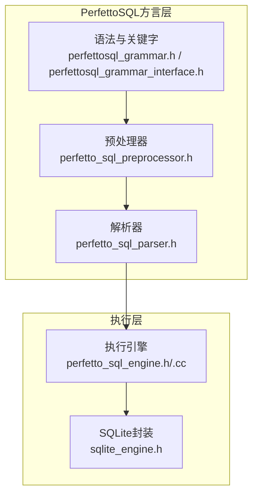
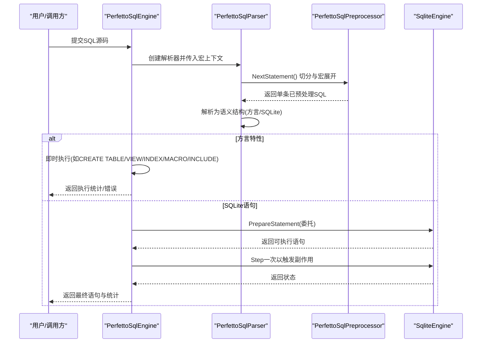
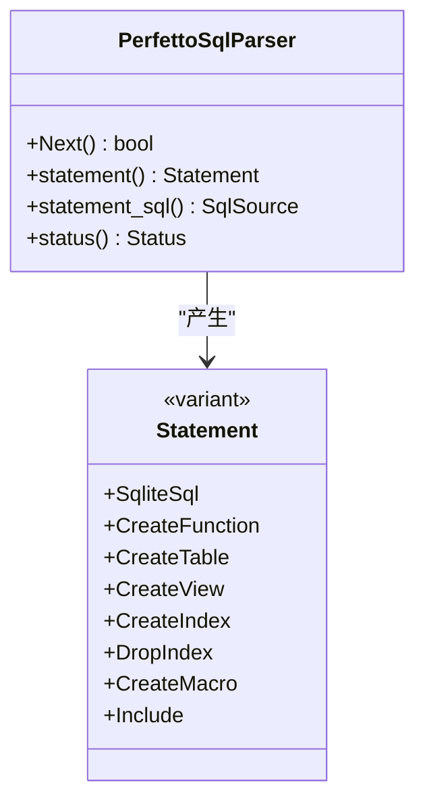
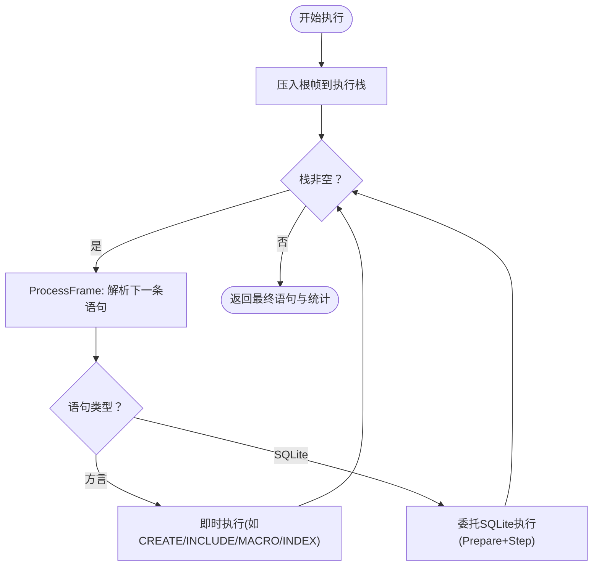

# SQL查询引擎

<cite>
**本文引用的文件**
- [perfetto_sql_engine.h](file://src/trace_processor/perfetto_sql/engine/perfetto_sql_engine.h)
- [perfetto_sql_engine.cc](file://src/trace_processor/perfetto_sql/engine/perfetto_sql_engine.cc)
- [perfetto_sql_parser.h](file://src/trace_processor/perfetto_sql/parser/perfetto_sql_parser.h)
- [perfettosql_grammar.h](file://src/trace_processor/perfetto_sql/grammar/perfettosql_grammar.h)
- [perfettosql_grammar_interface.h](file://src/trace_processor/perfetto_sql/grammar/perfettosql_grammar_interface.h)
- [perfetto_sql_preprocessor.h](file://src/trace_processor/perfetto_sql/preprocessor/perfetto_sql_preprocessor.h)
- [sqlite_engine.h](file://src/trace_processor/sqlite/sqlite_engine.h)
- [perfetto-sql-syntax.md](file://docs/analysis/perfetto-sql-syntax.md)
- [perfetto-sql-backcompat.md](file://docs/analysis/perfetto-sql-backcompat.md)
</cite>

## 目录
1. [简介](#简介)
2. [项目结构](#项目结构)
3. [核心组件](#核心组件)
4. [架构总览](#架构总览)
5. [详细组件分析](#详细组件分析)
6. [依赖关系分析](#依赖关系分析)
7. [性能考量](#性能考量)
8. [故障排查指南](#故障排查指南)
9. [结论](#结论)
10. [附录](#附录)

## 简介
本文件面向Perfetto SQL查询引擎，系统化阐述其基于SQLite的SQL方言（PerfettoSQL）：语法规范、关键字、数据类型与操作符；以及查询解析器、查询计划器与执行引擎的工作机制；并给出优化策略（索引、查询重写、执行计划分析）、示例与与标准SQL的差异及兼容性说明，最后提供性能分析工具的使用建议。

## 项目结构
Perfetto SQL查询引擎位于trace_processor子系统中，围绕“预处理-解析-执行”的流水线组织代码，核心模块如下：
- 词法与语法：基于SQLite的词法与语法定义，扩展了PerfettoSQL的关键字与语义。
- 预处理器：负责宏展开、语句切分等。
- 解析器：将SQL解析为内部语义结构，区分SQLite语句与PerfettoSQL方言特性。
- 执行引擎：桥接PerfettoSQL与SQLite，负责方言特性执行与SQLite委托执行。
- SQLite封装：对SQLite C API进行薄封装，统一注册函数/窗口函数/聚合函数与虚拟表模块。

图表来源
- [perfettosql_grammar.h:1-178](file://src/trace_processor/perfetto_sql/grammar/perfettosql_grammar.h#L1-L178)
- [perfettosql_grammar_interface.h:1-156](file://src/trace_processor/perfetto_sql/grammar/perfettosql_grammar_interface.h#L1-L156)
- [perfetto_sql_preprocessor.h:1-79](file://src/trace_processor/perfetto_sql/preprocessor/perfetto_sql_preprocessor.h#L1-L79)
- [perfetto_sql_parser.h:1-176](file://src/trace_processor/perfetto_sql/parser/perfetto_sql_parser.h#L1-L176)
- [perfetto_sql_engine.h:1-501](file://src/trace_processor/perfetto_sql/engine/perfetto_sql_engine.h#L1-L501)
- [sqlite_engine.h:1-167](file://src/trace_processor/sqlite/sqlite_engine.h#L1-L167)

章节来源
- [perfetto_sql_engine.h:1-501](file://src/trace_processor/perfetto_sql/engine/perfetto_sql_engine.h#L1-L501)
- [perfetto_sql_parser.h:1-176](file://src/trace_processor/perfetto_sql/parser/perfetto_sql_parser.h#L1-L176)
- [perfetto_sql_preprocessor.h:1-79](file://src/trace_processor/perfetto_sql/preprocessor/perfetto_sql_preprocessor.h#L1-L79)
- [perfettosql_grammar.h:1-178](file://src/trace_processor/perfetto_sql/grammar/perfettosql_grammar.h#L1-L178)
- [perfettosql_grammar_interface.h:1-156](file://src/trace_processor/perfetto_sql/grammar/perfettosql_grammar_interface.h#L1-L156)
- [sqlite_engine.h:1-167](file://src/trace_processor/sqlite/sqlite_engine.h#L1-L167)

## 核心组件
- 语法与关键字
  - PerfettoSQL直接继承SQLite语法，并在SQLite之上增加方言特性，如INCLUDE模块、CREATE PERFETTO FUNCTION/TABLE/VIEW/INDEX/MACRO等。
  - 关键字映射由语法头文件维护，包含CREATE/PERFETTO/MODULE/INCLUDE/INDEX/VIEW/INDEX等。
- 预处理器
  - 负责将输入SQL切分为语句、执行宏展开、处理注释与空白。
- 解析器
  - 将SQL解析为内部语义结构，识别PerfettoSQL方言构造（函数、表、视图、索引、宏、模块包含）与SQLite语句。
- 执行引擎
  - 对方言特性即时执行（如CREATE PERFETTO TABLE/VIEW/INDEX/MACRO/INCLUDE），对SQLite语句委托给SQLite执行。
  - 维护执行栈以支持INCLUDE模块的嵌套与展开。
- SQLite封装
  - 提供函数/聚合函数/窗口函数注册与虚拟表模块注册能力，统一SQLite API使用。

章节来源
- [perfettosql_grammar.h:1-178](file://src/trace_processor/perfetto_sql/grammar/perfettosql_grammar.h#L1-L178)
- [perfettosql_grammar_interface.h:1-156](file://src/trace_processor/perfetto_sql/grammar/perfettosql_grammar_interface.h#L1-L156)
- [perfetto_sql_preprocessor.h:1-79](file://src/trace_processor/perfetto_sql/preprocessor/perfetto_sql_preprocessor.h#L1-L79)
- [perfetto_sql_parser.h:1-176](file://src/trace_processor/perfetto_sql/parser/perfetto_sql_parser.h#L1-L176)
- [perfetto_sql_engine.h:1-501](file://src/trace_processor/perfetto_sql/engine/perfetto_sql_engine.h#L1-L501)
- [sqlite_engine.h:1-167](file://src/trace_processor/sqlite/sqlite_engine.h#L1-L167)

## 架构总览
下图展示从SQL输入到SQLite执行的整体流程，以及方言特性如何被识别与处理。

图表来源
- [perfetto_sql_engine.cc:518-781](file://src/trace_processor/perfetto_sql/engine/perfetto_sql_engine.cc#L518-L781)
- [perfetto_sql_parser.h:48-176](file://src/trace_processor/perfetto_sql/parser/perfetto_sql_parser.h#L48-L176)
- [perfetto_sql_preprocessor.h:36-79](file://src/trace_processor/perfetto_sql/preprocessor/perfetto_sql_preprocessor.h#L36-L79)
- [sqlite_engine.h:90-120](file://src/trace_processor/sqlite/sqlite_engine.h#L90-L120)

## 详细组件分析

### 语法与关键字
- PerfettoSQL语法基于SQLite，所有合法SQLite SQL在PerfettoSQL中同样有效。
- 增强特性通过关键字标识，如PERFETTO、INCLUDE、MODULE、RETURNS、FUNCTION、TABLE、VIEW、INDEX、MACRO等。
- 语法头文件定义了大量TK_*令牌常量，覆盖SQLite关键字与PerfettoSQL新增关键字。

章节来源
- [perfettosql_grammar.h:1-178](file://src/trace_processor/perfetto_sql/grammar/perfettosql_grammar.h#L1-L178)
- [perfettosql_grammar_interface.h:35-156](file://src/trace_processor/perfetto_sql/grammar/perfettosql_grammar_interface.h#L35-L156)

### 预处理器
- 职责
  - 将SQL切分为单条语句。
  - 宏展开：根据宏名与参数替换SQL片段。
  - 词法分析：使用SQLite词法器进行标记化。
- 数据结构
  - 宏定义包含名称、参数列表与SQL体。
- 错误处理
  - 通过状态对象返回错误，避免未定义行为。

章节来源
- [perfetto_sql_preprocessor.h:36-79](file://src/trace_processor/perfetto_sql/preprocessor/perfetto_sql_preprocessor.h#L36-L79)

### 解析器
- 职责
  - 读取一条已预处理的SQL，解析为内部语义结构。
  - 识别以下方言构造：CREATE PERFETTO FUNCTION、CREATE PERFETTO TABLE、CREATE PERFETTO VIEW、CREATE PERFETTO INDEX、DROP PERFETTO INDEX、CREATE PERFETTO MACRO、INCLUDE PERFETTO MODULE。
  - 其余为SQLite语句，原样委托执行。
- 输出
  - Next()返回true表示解析成功；随后可通过statement()/statement_sql()获取语义与原始SQL。
  - 若返回false，必须调用status()获取错误。

图表来源
- [perfetto_sql_parser.h:48-176](file://src/trace_processor/perfetto_sql/parser/perfetto_sql_parser.h#L48-L176)

章节来源
- [perfetto_sql_parser.h:1-176](file://src/trace_processor/perfetto_sql/parser/perfetto_sql_parser.h#L1-L176)

### 执行引擎
- 职责
  - 初始化静态表与函数。
  - 执行SQL：对方言语句即时执行，对SQLite语句委托给SQLite。
  - 支持INCLUDE模块的迭代式执行栈，避免深递归。
  - 维护函数/聚合函数/窗口函数注册计数与对象计数。
- 关键流程
  - Execute/ExecuteUntilLastStatement：驱动解析与执行。
  - ProcessFrame：处理根/包含/通配符帧，推进语句、准备与首次步进。
  - OnCommit/OnRollback：事务回调，用于状态管理。
- 方言特性执行
  - CREATE PERFETTO FUNCTION：注册运行时或委托函数。
  - CREATE PERFETTO TABLE/VIEW：构建DataFrame并注册为虚拟表。
  - CREATE PERFETTO INDEX：在Perfetto表上建立索引。
  - CREATE PERFETTO MACRO：注册宏（预处理阶段展开）。
  - INCLUDE PERFETTO MODULE：按模块键加载SQL并执行。

图表来源
- [perfetto_sql_engine.cc:554-781](file://src/trace_processor/perfetto_sql/engine/perfetto_sql_engine.cc#L554-L781)

章节来源
- [perfetto_sql_engine.h:56-443](file://src/trace_processor/perfetto_sql/engine/perfetto_sql_engine.h#L56-L443)
- [perfetto_sql_engine.cc:518-781](file://src/trace_processor/perfetto_sql/engine/perfetto_sql_engine.cc#L518-L781)

### SQLite封装
- 职责
  - 统一封装SQLite C API，提供函数/聚合函数/窗口函数注册与虚拟表模块注册。
  - PreparedStatement封装sqlite3_stmt，提供Step/IsDone/status等接口。
  - 提供提交/回滚回调钩子，便于执行引擎进行事务管理。
- 使用场景
  - 执行引擎在委托SQLite执行时使用PrepareStatement与Step。
  - 注册Perfetto内置函数、窗口函数与虚拟表模块。

章节来源
- [sqlite_engine.h:44-167](file://src/trace_processor/sqlite/sqlite_engine.h#L44-L167)

### 语法规范与方言特性
- 模块包含
  - INCLUDE PERFETTO MODULE用于导入标准库模块，支持通配符与交互式开发。
- 类型系统
  - LONG/DOUBLE/BOOLEAN/STRING/BYTES/TIMESTAMP/DURATION/ARGSETID/ID/JOINID/ID(table.column)等。
- 函数与宏
  - CREATE PERFETTO FUNCTION支持标量与表值两种返回类型。
  - CREATE PERFETTO MACRO支持Expr/TableOrSubquery/ColumnName等类型。
- 表与视图
  - CREATE PERFETTO TABLE/VIEW支持显式schema，且Perfetto表为只读分析表。
- 索引
  - CREATE/DROP PERFETTO INDEX在Perfetto表上建立排序索引，提升过滤/连接性能。

章节来源
- [perfetto-sql-syntax.md:1-300](file://docs/analysis/perfetto-sql-syntax.md#L1-L300)

## 依赖关系分析
- 组件耦合
  - 执行引擎同时依赖解析器与SQLite封装，形成“解析-执行”闭环。
  - 解析器依赖语法头文件与预处理器。
  - 预处理器依赖SQLite词法器。
- 外部依赖
  - SQLite C API作为底层执行引擎。
  - 标准库模块通过包注册机制注入到执行引擎。

图表来源
- [perfetto_sql_parser.h:1-176](file://src/trace_processor/perfetto_sql/parser/perfetto_sql_parser.h#L1-L176)
- [perfetto_sql_preprocessor.h:1-79](file://src/trace_processor/perfetto_sql/preprocessor/perfetto_sql_preprocessor.h#L1-L79)
- [perfetto_sql_engine.h:1-501](file://src/trace_processor/perfetto_sql/engine/perfetto_sql_engine.h#L1-L501)
- [sqlite_engine.h:1-167](file://src/trace_processor/sqlite/sqlite_engine.h#L1-L167)
- [perfettosql_grammar.h:1-178](file://src/trace_processor/perfetto_sql/grammar/perfettosql_grammar.h#L1-L178)

章节来源
- [perfetto_sql_engine.h:1-501](file://src/trace_processor/perfetto_sql/engine/perfetto_sql_engine.h#L1-L501)
- [perfetto_sql_parser.h:1-176](file://src/trace_processor/perfetto_sql/parser/perfetto_sql_parser.h#L1-L176)
- [perfetto_sql_preprocessor.h:1-79](file://src/trace_processor/perfetto_sql/preprocessor/perfetto_sql_preprocessor.h#L1-L79)
- [sqlite_engine.h:1-167](file://src/trace_processor/sqlite/sqlite_engine.h#L1-L167)

## 性能考量
- 索引策略
  - 在高频过滤/连接列上建立Perfetto索引，利用内部排序结构加速二分查找。
  - 注意索引的内存成本，仅在确有收益时启用。
- 查询重写
  - 将等值谓词前置，配合多列索引的前导列使用。
  - 使用CTE缓存重复子查询结果，减少重复扫描。
- 执行计划分析
  - 利用执行引擎提供的统计信息（语句数量、输出语句数量、列数）评估查询开销。
  - 对复杂查询，优先拆分为多个简单步骤，便于定位瓶颈。
- 内存与CPU
  - 避免不必要的类型转换与字符串处理。
  - 合理使用窗口函数与聚合函数，避免过大的窗口大小导致内存峰值。

## 故障排查指南
- 常见错误与症状
  - 语法错误：检查关键字是否正确（如PERFETTO、MODULE、RETURNS等）。
  - 类型不匹配：确认函数/视图schema与查询列一致。
  - 事务问题：关注OnCommit/OnRollback回调是否触发，必要时回滚并重试。
- 追溯与诊断
  - 执行引擎在错误时会附加traceback信息，便于定位具体语句位置。
  - 使用SqliteEngine::PreparedStatement.status()获取底层SQLite错误详情。
- 兼容性问题
  - 参考Backward Compatibility文档，了解字段移除与语义变化（如slice表的stack_id列、track表type列语义变更）。

章节来源
- [perfetto_sql_engine.cc:177-191](file://src/trace_processor/perfetto_sql/engine/perfetto_sql_engine.cc#L177-L191)
- [sqlite_engine.h:62-82](file://src/trace_processor/sqlite/sqlite_engine.h#L62-L82)
- [perfetto-sql-backcompat.md:1-185](file://docs/analysis/perfetto-sql-backcompat.md#L1-L185)

## 结论
Perfetto SQL查询引擎以SQLite为核心，通过预处理、解析与执行三层架构实现对PerfettoSQL方言的高效支持。其关键优势在于：
- 与SQLite语法高度兼容，同时提供模块化、索引与高性能分析表等增强能力；
- 清晰的执行栈与事务回调机制，确保复杂SQL（尤其是包含模块）的稳定执行；
- 丰富的内置函数与窗口函数，满足Trace Processor场景下的分析需求。

## 附录

### 语法与关键字速查
- 新增关键字：PERFETTO、INCLUDE、MODULE、RETURNS、FUNCTION、TABLE、VIEW、INDEX、MACRO、OR、AND、NOT、IS、LIKE、BETWEEN、IN、ESCAPE、CONCAT、COLLATE、WINDOW、OVER、FILTER等。
- 令牌映射参考：TK_*常量定义于语法头文件。

章节来源
- [perfettosql_grammar.h:1-178](file://src/trace_processor/perfetto_sql/grammar/perfettosql_grammar.h#L1-L178)

### 数据类型与操作符
- 类型：LONG、DOUBLE、BOOLEAN、STRING、BYTES、TIMESTAMP、DURATION、ARGSETID、ID、JOINID(table.column)、ID(table.column)。
- 操作符：算术(+,-,*,/,%)、比较(=,!=,<,<=,>,>=)、位运算(&,|,<<,>>), 逻辑(AND, OR, NOT)、字符串(CONCAT)、正则/模糊(MATCH, LIKE)、范围(BETWEEN)、存在(IN, ISNULL, NOTNULL)等。

章节来源
- [perfetto-sql-syntax.md:57-75](file://docs/analysis/perfetto-sql-syntax.md#L57-L75)

### 示例与最佳实践
- 基本查询：SELECT/INSERT/UPDATE/DELETE（遵循SQLite语法）。
- 连接操作：JOIN/LATERAL JOIN/自连接，结合索引列过滤。
- 聚合函数：COUNT/SUM/AVG/MIN/MAX/GROUP BY/HAVING。
- 窗口函数：ROW_NUMBER()/RANK()/SUM() OVER(...)等。
- 子查询：标量子查询、EXISTS/IN子查询。
- 模块包含：INCLUDE PERFETTO MODULE android.* 或具体模块路径。
- 宏与函数：CREATE PERFETTO MACRO简化重复表达；CREATE PERFETTO FUNCTION提升复用性。
- 索引：CREATE PERFETTO INDEX在高频过滤/连接列上建立索引。

章节来源
- [perfetto-sql-syntax.md:23-300](file://docs/analysis/perfetto-sql-syntax.md#L23-L300)

### 与标准SQL的差异与兼容性
- 完全兼容SQLite语法；新增PerfettoSQL方言特性。
- 字段与语义变更：参考Backward Compatibility文档，了解字段移除与type列语义变化等迁移路径。

章节来源
- [perfetto-sql-backcompat.md:1-185](file://docs/analysis/perfetto-sql-backcompat.md#L1-L185)