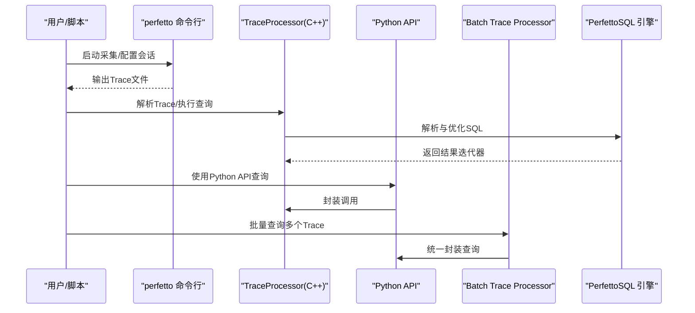
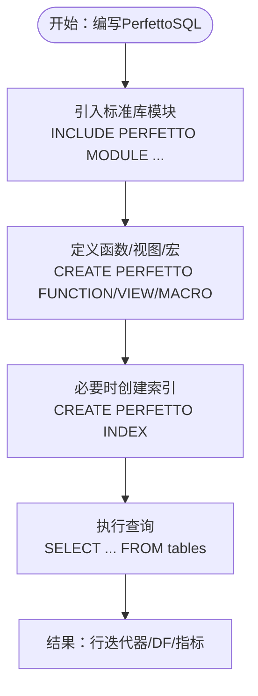
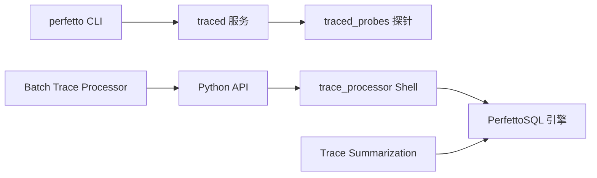

# Trace Processor分析引擎

<cite>
**本文档引用的文件**
- [docs/analysis/trace-processor.md](file://docs/analysis/trace-processor.md)
- [docs/analysis/trace-processor-python.md](file://docs/analysis/trace-processor-python.md)
- [docs/analysis/perfetto-sql-getting-started.md](file://docs/analysis/perfetto-sql-getting-started.md)
- [docs/analysis/perfetto-sql-syntax.md](file://docs/analysis/perfetto-sql-syntax.md)
- [docs/analysis/builtin.md](file://docs/analysis/builtin.md)
- [docs/analysis/metrics.md](file://docs/analysis/metrics.md)
- [docs/analysis/batch-trace-processor.md](file://docs/analysis/batch-trace-processor.md)
- [docs/analysis/getting-started.md](file://docs/analysis/getting-started.md)
- [docs/reference/perfetto-cli.md](file://docs/reference/perfetto-cli.md)
- [docs/reference/traced.md](file://docs/reference/traced.md)
- [docs/reference/traced_probes.md](file://docs/reference/traced_probes.md)
- [docs/reference/tracebox.md](file://docs/reference/tracebox.md)
- [docs/reference/synthetic-track-event.md](file://docs/reference/synthetic-track-event.md)
- [docs/analysis/style-guide.md](file://docs/analysis/style-guide.md)
</cite>

## 目录
1. [简介](#简介)
2. [项目结构](#项目结构)
3. [核心组件](#核心组件)
4. [架构总览](#架构总览)
5. [详细组件分析](#详细组件分析)
6. [依赖关系分析](#依赖关系分析)
7. [性能考虑](#性能考虑)
8. [故障排查指南](#故障排查指南)
9. [结论](#结论)
10. [附录](#附录)

## 简介
本文件面向Perfetto Trace Processor分析引擎，系统化阐述其基于SQLite的SQL查询引擎、数据导入与导出机制、内置SQL函数与聚合分析能力，并提供Python API使用指南与性能优化实践。文档同时覆盖批量Trace Processor、指标计算与Trace Summarization、常见分析场景（性能瓶颈、内存泄漏、CPU使用率）以及大数据集处理策略。

## 项目结构
Perfetto以“Trace Processor”为核心，提供C++库、交互式Shell、Python API与批量分析能力；配合CLI工具与服务模型，实现从采集到分析的完整链路。

```mermaid
graph TB
subgraph "采集与服务"
CLI["perfetto 命令行<br/>tracebox 自启动模式"]
TRACED["traced 调度服务"]
PROBES["traced_probes 系统探针"]
end
subgraph "分析层"
SHELL["trace_processor Shell"]
PYAPI["Python Trace Processor API"]
BTP["Batch Trace Processor"]
SUMM["Trace Summarization 指标"]
end
subgraph "查询语言"
SQL["PerfettoSQL 标准库<br/>内置函数/视图/宏"]
end
CLI --> TRACED
TRACED <- --> PROBES
SHELL --> SQL
PYAPI --> SHELL
BTP --> PYAPI
SUMM --> SQL
```

**图表来源**
- [docs/reference/perfetto-cli.md:1-215](file://docs/reference/perfetto-cli.md#L1-L215)
- [docs/reference/traced.md:1-114](file://docs/reference/traced.md#L1-L114)
- [docs/reference/traced_probes.md:1-464](file://docs/reference/traced_probes.md#L1-L464)
- [docs/analysis/trace-processor.md:1-226](file://docs/analysis/trace-processor.md#L1-L226)
- [docs/analysis/trace-processor-python.md:1-383](file://docs/analysis/trace-processor-python.md#L1-L383)
- [docs/analysis/batch-trace-processor.md:1-213](file://docs/analysis/batch-trace-processor.md#L1-L213)
- [docs/analysis/perfetto-sql-getting-started.md:1-673](file://docs/analysis/perfetto-sql-getting-started.md#L1-L673)

**章节来源**
- [docs/analysis/getting-started.md:1-90](file://docs/analysis/getting-started.md#L1-L90)
- [docs/reference/perfetto-cli.md:1-215](file://docs/reference/perfetto-cli.md#L1-L215)
- [docs/reference/traced.md:1-114](file://docs/reference/traced.md#L1-L114)
- [docs/reference/traced_probes.md:1-464](file://docs/reference/traced_probes.md#L1-L464)

## 核心组件
- Trace Processor C++库：解析多格式Trace、构建结构化表、提供SQL接口与标准库。
- Trace Processor Shell：交互式命令行，便于探索与验证查询。
- Python API：封装C++库，结合Pandas/Polars进行数据分析与可视化。
- Batch Trace Processor：对大规模Trace集合进行快速批处理分析。
- Trace Summarization：稳定可复现的指标输出，适合监控与回归检测。
- PerfettoSQL：在Trace Processor之上扩展的SQL方言，支持函数、视图、宏与索引等高级特性。

**章节来源**
- [docs/analysis/trace-processor.md:1-226](file://docs/analysis/trace-processor.md#L1-L226)
- [docs/analysis/trace-processor-python.md:1-383](file://docs/analysis/trace-processor-python.md#L1-L383)
- [docs/analysis/batch-trace-processor.md:1-213](file://docs/analysis/batch-trace-processor.md#L1-L213)
- [docs/analysis/perfetto-sql-getting-started.md:1-673](file://docs/analysis/perfetto-sql-getting-started.md#L1-L673)

## 架构总览
Trace Processor以“解析-建模-查询-导出”的流水线工作：采集端通过CLI或服务写入Trace；Trace Processor将其转换为统一的内部表结构；用户通过PerfettoSQL查询；结果可返回行迭代器、DataFrame或指标摘要。



**图表来源**
- [docs/reference/perfetto-cli.md:1-215](file://docs/reference/perfetto-cli.md#L1-L215)
- [docs/analysis/trace-processor.md:193-226](file://docs/analysis/trace-processor.md#L193-L226)
- [docs/analysis/trace-processor-python.md:138-383](file://docs/analysis/trace-processor-python.md#L138-L383)
- [docs/analysis/batch-trace-processor.md:1-213](file://docs/analysis/batch-trace-processor.md#L1-L213)

## 详细组件分析

### SQL查询引擎与语法
- 语法基础：兼容SQLite语法，扩展PerfettoSQL关键字与构造器（函数、表、视图、宏、索引）。
- 标准库：提供大量预置模块与视图，如调度上下文、切片上下文、时间转换、CPU/内存/堆分析等。
- 高级特性：支持Span Join、祖先/后代切片、前后连接流、EXTRACT_ARG等专用算子表。



**图表来源**
- [docs/analysis/perfetto-sql-syntax.md:1-300](file://docs/analysis/perfetto-sql-syntax.md#L1-L300)
- [docs/analysis/perfetto-sql-getting-started.md:421-673](file://docs/analysis/perfetto-sql-getting-started.md#L421-L673)

**章节来源**
- [docs/analysis/perfetto-sql-syntax.md:1-300](file://docs/analysis/perfetto-sql-syntax.md#L1-L300)
- [docs/analysis/perfetto-sql-getting-started.md:1-673](file://docs/analysis/perfetto-sql-getting-started.md#L1-L673)

### 数据导入与导出机制
- 输入格式：支持Perfetto原生Trace、ftrace、Chrome JSON等多种格式；可通过trace_processor Shell或Python API读取文件路径、字节流、生成器或URI。
- 导出选项：Shell与Python API均支持将查询结果转为Pandas/Polars DataFrame，或直接以文本/CSV形式输出；指标场景推荐使用Trace Summarization生成结构化Protobuf。
- Trace URI：支持GCS/HTTP等协议的Trace定位与拉取，便于云端Trace分析。

**章节来源**
- [docs/analysis/trace-processor.md:203-226](file://docs/analysis/trace-processor.md#L203-L226)
- [docs/analysis/trace-processor-python.md:72-137](file://docs/analysis/trace-processor-python.md#L72-L137)
- [docs/analysis/batch-trace-processor.md:138-173](file://docs/analysis/batch-trace-processor.md#L138-L173)

### 内置SQL函数与分析工具
- 分析函数：如EXTRACT_ARG、CAT_STACKS、STACK_FROM_STACK_PROFILE_CALLSITE等，用于参数提取与调用栈拼接。
- 专用算子表：Span Join、ANCESTOR_SLICE、DESCENDANT_SLICE、FOLLOWING_FLOW/PRECEDING_FLOW等，用于复杂时序关联分析。
- 时间转换与单位：time.conversion模块提供纳秒/毫秒转换辅助。

**章节来源**
- [docs/analysis/builtin.md:1-127](file://docs/analysis/builtin.md#L1-L127)
- [docs/analysis/perfetto-sql-getting-started.md:421-673](file://docs/analysis/perfetto-sql-getting-started.md#L421-L673)

### 指标计算与Trace Summarization
- Trace Summarization：替代旧版metrics系统，以稳定结构化输出为目标，支持维度分组与聚合。
- 兼容性：旧版metric()仍可用，但建议迁移到trace_summary()。
- 批量场景：结合Batch Trace Processor对大规模Trace集合进行指标抽取与汇总。

**章节来源**
- [docs/analysis/trace-processor-python.md:241-383](file://docs/analysis/trace-processor-python.md#L241-L383)
- [docs/analysis/metrics.md:1-578](file://docs/analysis/metrics.md#L1-L578)
- [docs/analysis/batch-trace-processor.md:1-213](file://docs/analysis/batch-trace-processor.md#L1-L213)

### Python API使用指南
- 初始化：支持文件路径、文件对象、字节生成器、Trace URI；可连接本地实例或指定二进制路径。
- 查询：query()返回行迭代器，可转为Pandas/Polars DataFrame；trace_summary()生成结构化指标。
- 调试：enable_metatrace()/disable_and_read_metatrace()记录Trace Processor自身性能，便于分析查询开销。

**章节来源**
- [docs/analysis/trace-processor-python.md:72-383](file://docs/analysis/trace-processor-python.md#L72-L383)

### 大规模Trace处理与批量分析
- Batch Trace Processor：对数百个Trace进行亚秒级查询，支持Pandas/Polars与扁平化合并。
- 内存管理：每个Trace常驻内存，注意平均大小S与数量N带来的2*S*N内存占用。
- Trace URI：解耦存储与加载，支持自定义Resolver对接云/网络资源。

**章节来源**
- [docs/analysis/batch-trace-processor.md:1-213](file://docs/analysis/batch-trace-processor.md#L1-L213)

### 常见分析场景与查询思路
- 性能瓶颈识别：利用调度表与切片上下文视图，结合Span Join对齐CPU频率与调度区间，定位长尾与抖动。
- 内存泄漏检测：通过堆分配表与调用栈解析，统计累积大小与自大小，识别热点对象类型。
- CPU使用率分析：按进程/线程聚合调度时长，结合计数器（如CPU频率）进行归因分析。

**章节来源**
- [docs/analysis/perfetto-sql-getting-started.md:117-243](file://docs/analysis/perfetto-sql-getting-started.md#L117-L243)

## 依赖关系分析



**图表来源**
- [docs/reference/perfetto-cli.md:1-215](file://docs/reference/perfetto-cli.md#L1-L215)
- [docs/reference/traced.md:1-114](file://docs/reference/traced.md#L1-L114)
- [docs/reference/traced_probes.md:1-464](file://docs/reference/traced_probes.md#L1-L464)
- [docs/analysis/trace-processor.md:1-226](file://docs/analysis/trace-processor.md#L1-L226)
- [docs/analysis/trace-processor-python.md:1-383](file://docs/analysis/trace-processor-python.md#L1-L383)
- [docs/analysis/batch-trace-processor.md:1-213](file://docs/analysis/batch-trace-processor.md#L1-L213)

**章节来源**
- [docs/reference/tracebox.md:1-104](file://docs/reference/tracebox.md#L1-L104)
- [docs/reference/traced.md:1-114](file://docs/reference/traced.md#L1-L114)
- [docs/reference/traced_probes.md:1-464](file://docs/reference/traced_probes.md#L1-L464)

## 性能考虑
- 过滤优先：尽量在WHERE中尽早过滤，减少扫描行数。
- 使用索引：对频繁过滤/连接的列创建Perfetto索引，显著提升排序/查找性能。
- 选择合适工具：小规模交互用Shell，大批量用Batch Trace Processor；需要稳定指标输出用Trace Summarization。
- 内存控制：关注Trace数量与大小，避免OOM；必要时拆分任务或降低并发。
- 格式与导出：优先使用二进制Trace，减少解析成本；导出时按需选择DataFrame或直接文本。

[本节为通用指导，无需特定文件引用]

## 故障排查指南
- 查询无结果或慢：检查WHERE条件是否过宽；确认列名与类型；尝试添加索引。
- Python API异常：确保已安装pandas/polars依赖；检查Trace URI解析器配置。
- 批处理内存不足：减少并发Trace数量或增大机器内存；使用query_and_flatten减少中间DataFrame数量。
- 指标不一致：优先使用Trace Summarization替代旧版metric()；核对模块版本与数据源一致性。

**章节来源**
- [docs/analysis/trace-processor-python.md:138-383](file://docs/analysis/trace-processor-python.md#L138-L383)
- [docs/analysis/batch-trace-processor.md:174-213](file://docs/analysis/batch-trace-processor.md#L174-L213)

## 结论
Trace Processor以高性能的Trace解析与统一的PerfettoSQL查询语言为核心，结合Python API与批量分析能力，覆盖从单Trace探索到大规模监控的全场景需求。通过合理使用标准库模块、索引与Trace Summarization，可在保证稳定性的同时获得优异的分析效率。

[本节为总结性内容，无需特定文件引用]

## 附录

### PerfettoSQL风格指南
- 行宽限制、命名规范、关键字大小写与续行风格，有助于团队协作与自动格式化。

**章节来源**
- [docs/analysis/style-guide.md:1-33](file://docs/analysis/style-guide.md#L1-L33)

### 服务与采集参考
- perfetto CLI：支持轻量/正常两种模式，提供输出、克隆、上传等选项。
- traced服务：集中管理会话、缓冲区与数据源注册，保障安全隔离。
- traced_probes：系统级探针，提供内核事件与进程统计等数据源。
- tracebox：一体化二进制，支持自启动与手动模式，便于调试与集成。

**章节来源**
- [docs/reference/perfetto-cli.md:1-215](file://docs/reference/perfetto-cli.md#L1-L215)
- [docs/reference/traced.md:1-114](file://docs/reference/traced.md#L1-L114)
- [docs/reference/traced_probes.md:1-464](file://docs/reference/traced_probes.md#L1-L464)
- [docs/reference/tracebox.md:1-104](file://docs/reference/tracebox.md#L1-L104)