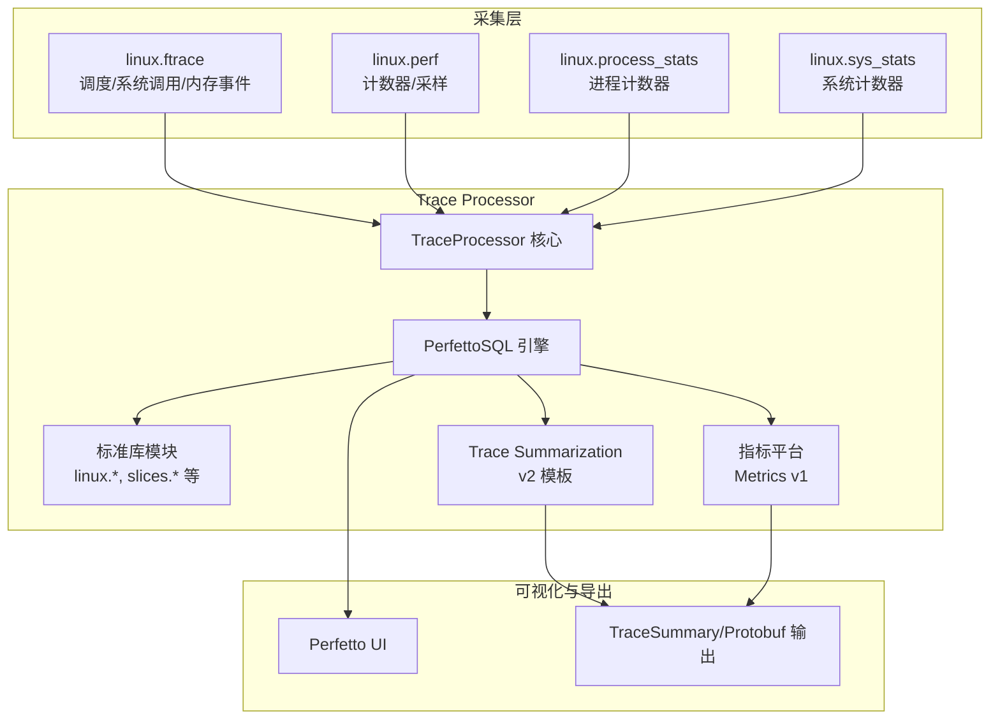
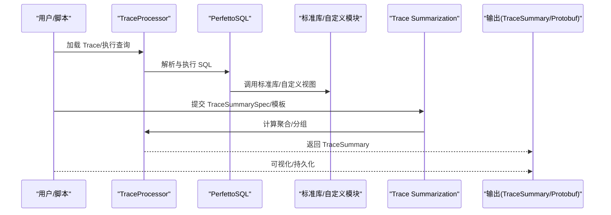
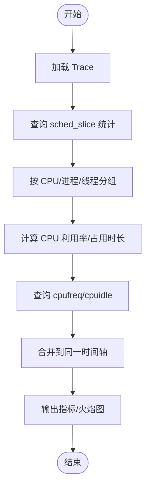
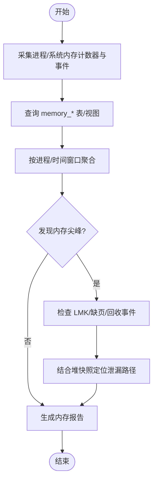
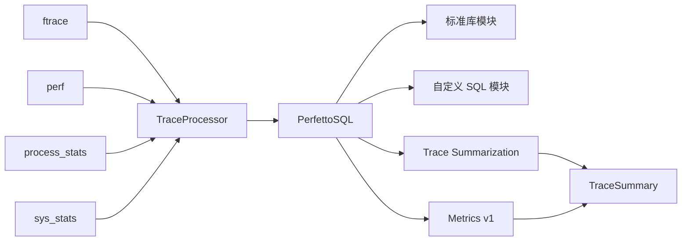

# 分析工具和指标

<cite>
**本文引用的文件**
- [docs/analysis/trace-processor.md](file://docs/analysis/trace-processor.md)
- [docs/analysis/trace-summary.md](file://docs/analysis/trace-summary.md)
- [docs/analysis/builtin.md](file://docs/analysis/builtin.md)
- [docs/analysis/metrics.md](file://docs/analysis/metrics.md)
- [docs/getting-started/cpu-profiling.md](file://docs/getting-started/cpu-profiling.md)
- [docs/data-sources/cpu-scheduling.md](file://docs/data-sources/cpu-scheduling.md)
- [docs/data-sources/cpu-freq.md](file://docs/data-sources/cpu-freq.md)
- [docs/data-sources/memory-counters.md](file://docs/data-sources/memory-counters.md)
- [docs/case-studies/memory.md](file://docs/case-studies/memory.md)
- [docs/data-sources/syscalls.md](file://docs/data-sources/syscalls.md)
</cite>

## 目录
1. [简介](#简介)
2. [项目结构](#项目结构)
3. [核心组件](#核心组件)
4. [架构总览](#架构总览)
5. [详细组件分析](#详细组件分析)
6. [依赖关系分析](#依赖关系分析)
7. [性能考量](#性能考量)
8. [故障排查指南](#故障排查指南)
9. [结论](#结论)
10. [附录](#附录)

## 简介
本文件面向使用 Trace Processor 的工程师与性能分析师，系统性梳理其分析工具与指标计算能力，覆盖以下主题：
- 内置分析指标：CPU 使用率、频率与空闲状态、内存计数器与事件、系统调用、I/O 相关事件等
- 性能分析工具：热点分析（火焰图/调用栈）、延迟分析（调度唤醒路径）、计数器采样与聚合
- 自定义指标：通过 Trace Summarization 定义稳定输出结构，或在 Metrics 平台中以 SQL 视图生成 Protobuf 指标
- 常见分析场景：应用启动时间、渲染帧时序、内存泄漏定位
- 指标数据存储与查询：Trace Summary 输出格式、SQL 表与视图、交互式查询与批处理

## 项目结构
Trace Processor 由“解析与导入层”“SQL 查询引擎”“标准库模块”“指标与摘要系统”组成。典型工作流是先采集 Trace，再通过 Trace Processor 的 SQL 接口进行探索与计算；对于自动化与规模化分析，推荐使用 Trace Summarization 或旧版 Metrics 平台。

图表来源
- [docs/analysis/trace-processor.md](file://docs/analysis/trace-processor.md)
- [docs/analysis/trace-summary.md](file://docs/analysis/trace-summary.md)
- [docs/analysis/metrics.md](file://docs/analysis/metrics.md)

章节来源
- [docs/analysis/trace-processor.md](file://docs/analysis/trace-processor.md)
- [docs/analysis/trace-summary.md](file://docs/analysis/trace-summary.md)
- [docs/analysis/metrics.md](file://docs/analysis/metrics.md)

## 核心组件
- Trace Processor Shell 与 Python API：提供命令行与编程接口，支持交互式查询、批处理与嵌入式使用
- PerfettoSQL：统一的 SQL 查询语言，支持动态表、模块化与聚合
- Trace Summarization v2：以稳定的 Protobuf 输出为目标，支持模板批量生成指标、单位与极性标注
- Metrics 平台（v1）：通过 SQL 视图生成 Protobuf 指标，支持热加载与扩展
- 标准库模块：提供常见系统与应用事件的表与视图，便于直接查询与组合

章节来源
- [docs/analysis/trace-processor.md](file://docs/analysis/trace-processor.md)
- [docs/analysis/trace-summary.md](file://docs/analysis/trace-summary.md)
- [docs/analysis/metrics.md](file://docs/analysis/metrics.md)

## 架构总览
下图展示 Trace Processor 在采集、查询、汇总与可视化的端到端流程。

图表来源
- [docs/analysis/trace-processor.md](file://docs/analysis/trace-processor.md)
- [docs/analysis/trace-summary.md](file://docs/analysis/trace-summary.md)

## 详细组件分析

### CPU 指标与分析
- 调度切片（sched_slice）：线程在各 CPU 上的运行与阻塞状态、结束原因（end_state），用于计算 CPU 占用、阻塞类型分布
- 频率与空闲（cpufreq/cpuidle）：记录频率变化与空闲深度，结合调度数据可分析能耗与调度开销
- 计数器采样（linux.perf）：按硬件/软件事件周期性采样，可叠加调度与进程信息，形成统一时间轴

图表来源
- [docs/data-sources/cpu-scheduling.md](file://docs/data-sources/cpu-scheduling.md)
- [docs/data-sources/cpu-freq.md](file://docs/data-sources/cpu-freq.md)
- [docs/getting-started/cpu-profiling.md](file://docs/getting-started/cpu-profiling.md)

章节来源
- [docs/data-sources/cpu-scheduling.md](file://docs/data-sources/cpu-scheduling.md)
- [docs/data-sources/cpu-freq.md](file://docs/data-sources/cpu-freq.md)
- [docs/getting-started/cpu-profiling.md](file://docs/getting-started/cpu-profiling.md)

### 内存指标与分析
- 进程级计数器：mem.rss、mem.rss.anon、mem.swap、mem.virt 等，支持按进程聚合与趋势分析
- 内核事件：rss_stat、mm_event 等事件驱动更新，捕捉短时内存峰值与回收/缺页行为
- LMK 与 OOM 调整：低内存回收事件与进程 oom_score_adj，辅助判断前台/后台影响
- 堆分析：原生堆与 Java 堆快照，结合调用栈定位泄漏路径

图表来源
- [docs/data-sources/memory-counters.md](file://docs/data-sources/memory-counters.md)
- [docs/case-studies/memory.md](file://docs/case-studies/memory.md)

章节来源
- [docs/data-sources/memory-counters.md](file://docs/data-sources/memory-counters.md)
- [docs/case-studies/memory.md](file://docs/case-studies/memory.md)

### 系统调用与 I/O 指标
- 系统调用追踪：记录进入/退出事件，可用于识别阻塞型调用（如 recvfrom/ioctl）与上下文切换热点
- I/O 关注点：结合 ftrace 的 syscalls 事件与调度切片，定位阻塞等待与跨 CPU 迁移

章节来源
- [docs/data-sources/syscalls.md](file://docs/data-sources/syscalls.md)

### 性能分析工具与指标计算
- 热点分析（火焰图/调用栈）
  - 使用 linux.perf 的 callstack_sampling，结合 sched/sched_waking 等事件，定位热点调用链
  - 通过内置模块与 SQL 视图生成调用栈树与累计样本数
- 延迟分析（唤醒路径）
  - 启用 sched_waking/sched_wakeup 事件，结合 UI 与 SQL 分析唤醒来源与跨 CPU 开销
- 计数器与聚合
  - 通过 PerfettoSQL 对计数器进行分组、加权平均、区间相交等操作，生成稳定指标

章节来源
- [docs/getting-started/cpu-profiling.md](file://docs/getting-started/cpu-profiling.md)
- [docs/data-sources/cpu-scheduling.md](file://docs/data-sources/cpu-scheduling.md)

### 自定义指标开发
- Trace Summarization v2 模板
  - 以 TraceSummarySpec 定义查询、维度与值列，支持批量生成多个指标并打包输出
  - 支持单位与极性标注，便于自动化仪表盘与回归检测
- Metrics 平台（v1）
  - 通过 SQL 视图生成 Protobuf 指标，支持热加载与扩展目录，适合快速迭代与本地开发
  - 提供 RUN_METRIC 机制复用视图与模块

章节来源
- [docs/analysis/trace-summary.md](file://docs/analysis/trace-summary.md)
- [docs/analysis/metrics.md](file://docs/analysis/metrics.md)

### 指标数据存储与查询接口
- Trace Summary 输出
  - 顶层消息为 TraceSummary，包含 metric_bundles 与 trace 级元数据
  - 每个 TraceMetricV2Bundle 包含一组指标规格与行数据，维度值在包内去重存储
- SQL 查询接口
  - 通过 TraceProcessor Shell 或 Python API 执行 SQL，访问标准库表与自定义视图
  - 支持交互式探索与批处理脚本化

章节来源
- [docs/analysis/trace-summary.md](file://docs/analysis/trace-summary.md)
- [docs/analysis/trace-processor.md](file://docs/analysis/trace-processor.md)

## 依赖关系分析
- 数据源依赖：linux.ftrace、linux.perf、linux.process_stats、linux.sys_stats 彼此独立，可自由组合
- 查询依赖：标准库模块提供基础表与视图，自定义 SQL 模块可被 Trace Summarization 与 Metrics 平台复用
- 输出依赖：Trace Summarization 与 Metrics 平台均依赖 SQL 查询结果的稳定性与一致性

图表来源
- [docs/analysis/trace-processor.md](file://docs/analysis/trace-processor.md)
- [docs/analysis/trace-summary.md](file://docs/analysis/trace-summary.md)
- [docs/analysis/metrics.md](file://docs/analysis/metrics.md)

章节来源
- [docs/analysis/trace-processor.md](file://docs/analysis/trace-processor.md)
- [docs/analysis/trace-summary.md](file://docs/analysis/trace-summary.md)
- [docs/analysis/metrics.md](file://docs/analysis/metrics.md)

## 性能考量
- 采样频率与开销平衡：linux.perf 的采样频率与 follower 计数器数量需与平台 PMU 能力匹配，避免多路复用导致的欠计数
- 事件选择：仅启用必要事件，减少 trace 大小与解析成本
- 查询优化：优先使用标准库视图与聚合，避免对大表做昂贵的全表扫描
- 模板化与缓存：Trace Summarization v2 模板可减少重复查询，提升规模化分析效率

## 故障排查指南
- Trace 加载失败：确认 Trace 文件完整且未被截断；检查 TraceProcessor 版本与数据源配置
- 查询无结果：核对数据源是否正确启用；确认目标表/视图是否存在；检查时间范围与过滤条件
- 指标不稳定：检查采样配置与平台差异；确认 Trace 时间同步与时钟源
- 内存尖峰与 LMK：结合 mem.lmk 与 rss_stat/mm_event，定位短时高水位与回收风暴

章节来源
- [docs/analysis/trace-processor.md](file://docs/analysis/trace-processor.md)
- [docs/data-sources/memory-counters.md](file://docs/data-sources/memory-counters.md)

## 结论
Trace Processor 提供从采集、查询到稳定输出的一体化分析能力。对于日常探索，建议优先使用标准库与交互式 SQL；对于自动化与规模化，Trace Summarization v2 是首选；若需要 Protobuf 指标输出，可沿用 Metrics 平台（v1）。通过合理选择数据源与查询模式，可高效完成 CPU/内存/系统调用/I/O 等关键指标的分析与可视化。

## 附录
- 常见分析场景示例
  - 应用启动时间：基于切片与关键用户旅程（CUJ）切片的时间相交，统计启动阶段 CPU/IO 行为
  - 渲染性能评估：结合帧时间线与调度切片，分析卡顿来源与跨 CPU 迁移
  - 内存泄漏检测：对比堆快照与调用栈，聚焦未释放分配与增长显著路径
- 最佳实践
  - 先用最小化配置采集关键事件，再逐步扩展
  - 使用 Trace Summarization v2 模板统一输出结构，便于长期回归跟踪
  - 将热点与延迟分析与计数器/事件相结合，形成闭环证据链