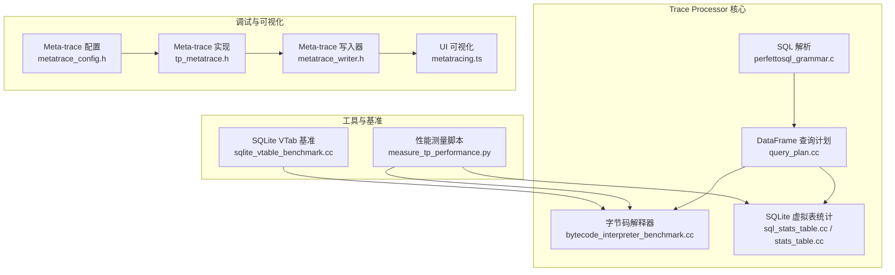
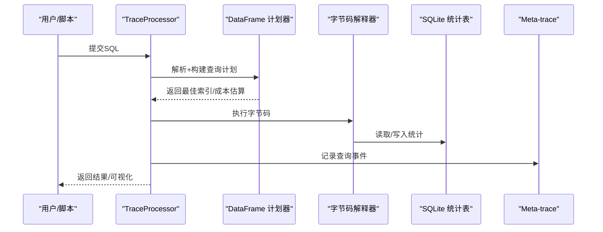
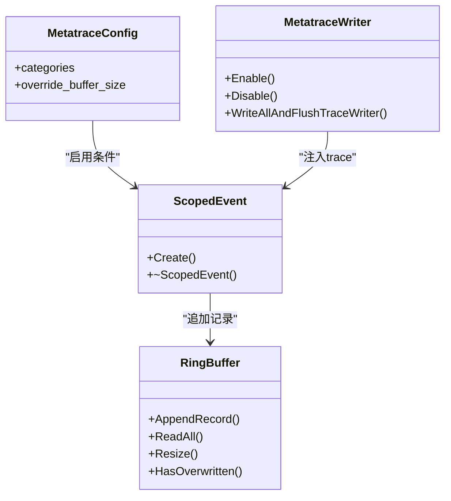
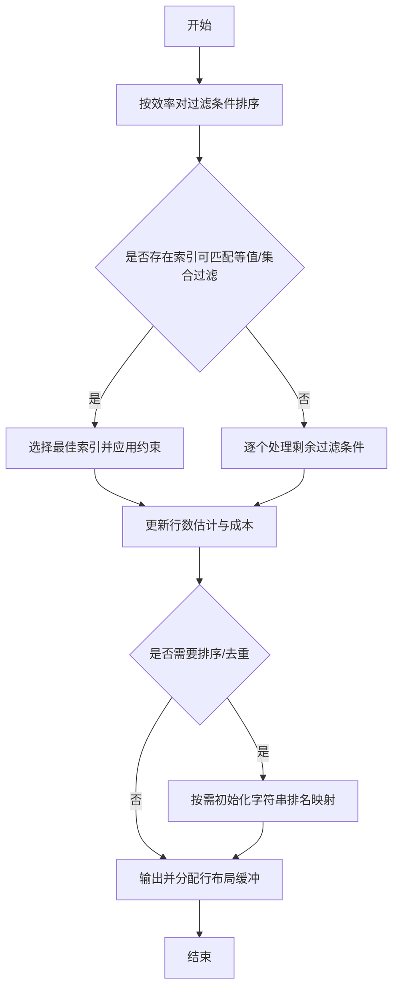
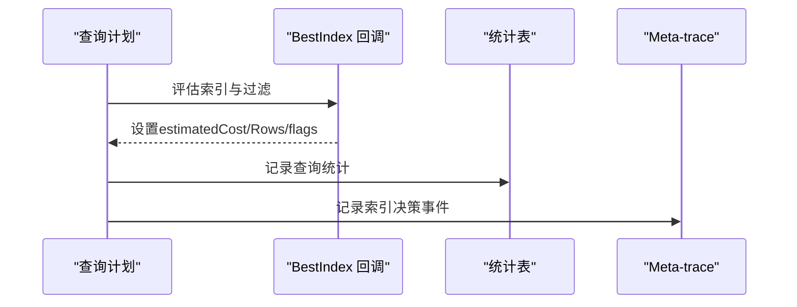
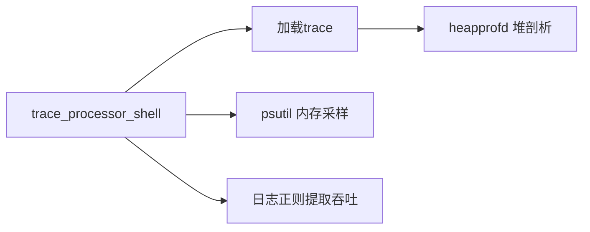
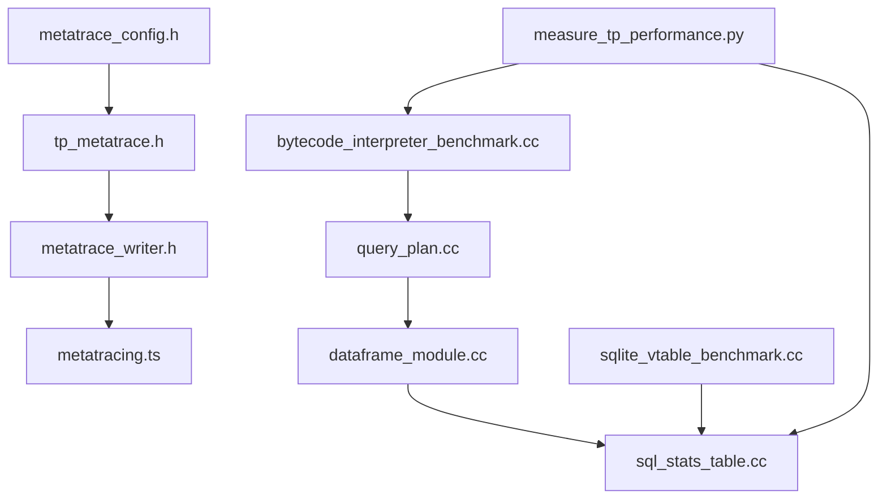

# 性能优化和调试

<cite>
**本文引用的文件**   
- [tp_metatrace.h](file://src/trace_processor/tp_metatrace.h)
- [metatrace_config.h](file://include/perfetto/trace_processor/metatrace_config.h)
- [metatrace_events.h](file://include/perfetto/ext/base/metatrace_events.h)
- [metatrace_writer.h](file://src/tracing/service/metatrace_writer.h)
- [metatracing.ts](file://ui/src/core/metatracing.ts)
- [query_plan.cc](file://src/trace_processor/core/dataframe/query_plan.cc)
- [dataframe_module.cc](file://src/trace_processor/perfetto_sql/engine/dataframe_module.cc)
- [sql_stats_table.cc](file://src/trace_processor/sqlite/sql_stats_table.cc)
- [stats_table.cc](file://src/trace_processor/sqlite/stats_table.cc)
- [perfettosql_grammar.c](file://src/trace_processor/perfetto_sql/grammar/perfettosql_grammar.c)
- [bytecode_interpreter_benchmark.cc](file://src/trace_processor/core/interpreter/bytecode_interpreter_benchmark.cc)
- [sqlite_vtable_benchmark.cc](file://src/trace_processor/sqlite/sqlite_vtable_benchmark.cc)
- [measure_tp_performance.py](file://tools/measure_tp_performance.py)
- [memory.md](file://docs/case-studies/memory.md)
- [PerfettoNativeMemoryCleaner.java](file://src/android_sdk/java/main/dev/perfetto/sdk/PerfettoNativeMemoryCleaner.java)
- [raw_process_memory_node_unittest.cc](file://src/trace_processor/importers/memory_tracker/raw_process_memory_node_unittest.cc)
</cite>

## 目录
1. [简介](#简介)
2. [项目结构](#项目结构)
3. [核心组件](#核心组件)
4. [架构总览](#架构总览)
5. [详细组件分析](#详细组件分析)
6. [依赖关系分析](#依赖关系分析)
7. [性能考量](#性能考量)
8. [故障排查指南](#故障排查指南)
9. [结论](#结论)
10. [附录](#附录)

## 简介
本文件面向Trace Processor的性能优化与调试场景，系统性梳理查询性能分析（执行计划、索引使用、成本估算）、内存优化（压缩、缓存、泄漏检测）、大数据集处理（分块、并行、资源限制）以及调试工具链（metatrace、性能剖析）。同时给出SQLite引擎相关配置与调优建议，并提供性能基准测试方法与常见问题诊断路径。

## 项目结构
Trace Processor围绕“解析-编译-执行”三段式工作流组织：解析SQL语法，生成DataFrame查询计划，再由字节码解释器执行；SQLite虚拟表模块承载统计信息与运行时元数据；UI侧提供可视化与交互能力；工具链提供性能度量脚本与基准测试。

图示来源
- [perfettosql_grammar.c:3917-3935](file://src/trace_processor/perfetto_sql/grammar/perfettosql_grammar.c#L3917-L3935)
- [query_plan.cc:1107-1141](file://src/trace_processor/core/dataframe/query_plan.cc#L1107-L1141)
- [bytecode_interpreter_benchmark.cc:44-86](file://src/trace_processor/core/interpreter/bytecode_interpreter_benchmark.cc#L44-L86)
- [sql_stats_table.cc:37-88](file://src/trace_processor/sqlite/sql_stats_table.cc#L37-L88)
- [metatrace_config.h:53-62](file://include/trace_processor/metatrace_config.h#L53-L62)
- [tp_metatrace.h:205-210](file://src/trace_processor/tp_metatrace.h#L205-L210)
- [metatrace_writer.h:55-67](file://src/tracing/service/metatrace_writer.h#L55-L67)
- [metatracing.ts:92-120](file://ui/src/core/metatracing.ts#L92-L120)
- [measure_tp_performance.py:31-65](file://tools/measure_tp_performance.py#L31-L65)
- [sqlite_vtable_benchmark.cc:210-242](file://src/trace_processor/sqlite/sqlite_vtable_benchmark.cc#L210-L242)

章节来源
- [perfettosql_grammar.c:3917-3935](file://src/trace_processor/permittosql/grammar/perfettosql_grammar.c#L3917-L3935)
- [query_plan.cc:1107-1141](file://src/trace_processor/core/dataframe/query_plan.cc#L1107-L1141)
- [bytecode_interpreter_benchmark.cc:44-86](file://src/trace_processor/core/interpreter/bytecode_interpreter_benchmark.cc#L44-L86)
- [sql_stats_table.cc:37-88](file://src/trace_processor/sqlite/sql_stats_table.cc#L37-L88)
- [metatrace_config.h:53-62](file://include/trace_processor/metatrace_config.h#L53-L62)
- [tp_metatrace.h:205-210](file://src/trace_processor/tp_metatrace.h#L205-L210)
- [metatrace_writer.h:55-67](file://src/tracing/service/metatrace_writer.h#L55-L67)
- [metatracing.ts:92-120](file://ui/src/core/metatracing.ts#L92-L120)
- [measure_tp_performance.py:31-65](file://tools/measure_tp_performance.py#L31-L65)
- [sqlite_vtable_benchmark.cc:210-242](file://src/trace_processor/sqlite/sqlite_vtable_benchmark.cc#L210-L242)

## 核心组件
- 元跟踪（Meta-trace）：用于在Trace Processor内部记录查询与执行事件，支持分类开关、缓冲区大小覆盖与事件参数注入，便于定位热点与瓶颈。
- 查询计划与成本估算：基于DataFrame的过滤、排序、去重、输出等阶段，结合索引选择与行数估计，计算近似执行成本，指导BestIndex策略。
- SQLite统计虚拟表：提供查询时间线、首next时间、结束时间等统计，辅助分析慢查询与执行路径。
- 基准与度量：通过字节码解释器与SQLite VTab基准，评估不同算子与数据规模下的性能上限与实际表现。
- 内存与泄漏检测：结合工具链脚本与Android SDK辅助类，进行堆剖析与内存统计，识别匿名脏页与共享页影响。

章节来源
- [tp_metatrace.h:205-210](file://src/trace_processor/tp_metatrace.h#L205-L210)
- [metatrace_config.h:53-62](file://include/trace_processor/metatrace_config.h#L53-L62)
- [query_plan.cc:1107-1141](file://src/trace_processor/core/dataframe/query_plan.cc#L1107-L1141)
- [dataframe_module.cc:331-362](file://src/trace_processor/perfetto_sql/engine/dataframe_module.cc#L331-L362)
- [sql_stats_table.cc:37-88](file://src/trace_processor/sqlite/sql_stats_table.cc#L37-L88)
- [bytecode_interpreter_benchmark.cc:44-86](file://src/trace_processor/core/interpreter/bytecode_interpreter_benchmark.cc#L44-L86)
- [sqlite_vtable_benchmark.cc:210-242](file://src/trace_processor/sqlite/sqlite_vtable_benchmark.cc#L210-L242)
- [measure_tp_performance.py:68-108](file://tools/measure_tp_performance.py#L68-L108)

## 架构总览
Trace Processor在执行SQL时，先由语法模块生成AST，再构建DataFrame查询计划，随后由字节码解释器按计划执行。SQLite虚拟表模块提供统计与运行时信息，Meta-trace贯穿全程记录事件，UI层负责展示与交互。

图示来源
- [query_plan.cc:1107-1141](file://src/trace_processor/core/dataframe/query_plan.cc#L1107-L1141)
- [dataframe_module.cc:331-362](file://src/trace_processor/perfetto_sql/engine/dataframe_module.cc#L331-L362)
- [sql_stats_table.cc:37-88](file://src/trace_processor/sqlite/sql_stats_table.cc#L37-L88)
- [tp_metatrace.h:205-210](file://src/trace_processor/tp_metatrace.h#L205-L210)

## 详细组件分析

### 元跟踪（Meta-trace）体系
- 配置与启用：通过配置结构体控制类别（查询时间线、函数调用、数据库操作、API时间线等）与缓冲区大小覆盖。
- 实现要点：线程局部环形缓冲、事件参数拼接、作用域事件自动时长记录、禁用时一次性读取全部记录。
- 写入与注入：服务端写入器将元跟踪事件注入trace，UI侧可解析并渲染。

图示来源
- [metatrace_config.h:53-62](file://include/trace_processor/metatrace_config.h#L53-L62)
- [tp_metatrace.h:111-161](file://src/trace_processor/tp_metatrace.h#L111-L161)
- [tp_metatrace.h:163-203](file://src/trace_processor/tp_metatrace.h#L163-L203)
- [metatrace_writer.h:55-67](file://src/tracing/service/metatrace_writer.h#L55-L67)

章节来源
- [metatrace_config.h:53-62](file://include/trace_processor/metatrace_config.h#L53-L62)
- [tp_metatrace.h:205-210](file://src/trace_processor/tp_metatrace.h#L205-L210)
- [metatrace_writer.h:55-67](file://src/tracing/service/metatrace_writer.h#L55-L67)
- [metatracing.ts:92-120](file://ui/src/core/metatracing.ts#L92-L120)

### 查询计划与成本估算
- 过滤优先级：根据列类型、排序状态、空值性等对过滤条件打分，优先应用高选择性/低成本的过滤。
- 索引选择：遍历可用索引，匹配等值/集合过滤，避免In破坏后续列的有序性；若命中更优索引则更新BestIndex。
- 行数与成本：基于不同代价模型（固定、线性、对数、排序后线性、后置运算线性）估算成本与行数，更新估计值并考虑Limit/Offset影响。
- 输出布局：按需分配行布局缓冲，处理稀疏空值位图与非空列的直接映射，减少拷贝。

图示来源
- [query_plan.cc:348-453](file://src/trace_processor/core/dataframe/query_plan.cc#L348-L453)
- [query_plan.cc:1107-1141](file://src/trace_processor/core/dataframe/query_plan.cc#L1107-L1141)
- [query_plan.cc:1140-1207](file://src/trace_processor/core/dataframe/query_plan.cc#L1140-L1207)

章节来源
- [query_plan.cc:348-453](file://src/trace_processor/core/dataframe/query_plan.cc#L348-L453)
- [query_plan.cc:1107-1141](file://src/trace_processor/core/dataframe/query_plan.cc#L1107-L1141)
- [query_plan.cc:1140-1207](file://src/trace_processor/core/dataframe/query_plan.cc#L1140-L1207)

### SQLite统计与执行监控
- 统计虚拟表：提供查询文本、开始时间、首next时间、结束时间等字段，便于定位慢查询与执行阶段耗时。
- 最佳索引回调：DataFrame模块在BestIndex中设置估计成本、行数、唯一扫描标志等，同时记录Meta-trace事件以可视化索引决策。

图示来源
- [dataframe_module.cc:331-362](file://src/trace_processor/perfetto_sql/engine/dataframe_module.cc#L331-L362)
- [sql_stats_table.cc:37-88](file://src/trace_processor/sqlite/sql_stats_table.cc#L37-L88)

章节来源
- [dataframe_module.cc:331-362](file://src/trace_processor/perfetto_sql/engine/dataframe_module.cc#L331-L362)
- [sql_stats_table.cc:37-88](file://src/trace_processor/sqlite/sql_stats_table.cc#L37-L88)

### 基准测试与性能度量
- 字节码解释器基准：覆盖线性过滤、In操作、排序等典型算子，支持不同数据规模与列表长度，评估阈值切换与二分查找路径。
- SQLite VTab基准：模拟理想虚拟表实现，测量每行步进与结果返回的性能上限，评估缓存与指针访问开销。
- 性能测量脚本：启动Trace Processor，采集加载耗时与内存占用，结合heapprofd进行堆剖析，区分峰值与静止态内存。

图示来源
- [measure_tp_performance.py:31-65](file://tools/measure_tp_performance.py#L31-L65)
- [measure_tp_performance.py:68-108](file://tools/measure_tp_performance.py#L68-L108)
- [bytecode_interpreter_benchmark.cc:44-86](file://src/trace_processor/core/interpreter/bytecode_interpreter_benchmark.cc#L44-L86)
- [sqlite_vtable_benchmark.cc:210-242](file://src/trace_processor/sqlite/sqlite_vtable_benchmark.cc#L210-L242)

章节来源
- [measure_tp_performance.py:31-65](file://tools/measure_tp_performance.py#L31-L65)
- [measure_tp_performance.py:68-108](file://tools/measure_tp_performance.py#L68-L108)
- [bytecode_interpreter_benchmark.cc:44-86](file://src/trace_processor/core/interpreter/bytecode_interpreter_benchmark.cc#L44-L86)
- [sqlite_vtable_benchmark.cc:210-242](file://src/trace_processor/sqlite/sqlite_vtable_benchmark.cc#L210-L242)

## 依赖关系分析
- 元跟踪依赖：配置头文件定义类别与缓冲区策略；实现头文件提供RingBuffer与ScopedEvent；写入器负责注入trace；UI解析并渲染。
- 查询计划依赖：DataFrame计划器依赖字节码寄存器、存储类型、索引与代价模型；BestIndex回调依赖SQLite索引信息结构。
- 统计表依赖：SQLite VTab接口实现，提供只无行表schema与游标操作。
- 基准与度量：依赖SQLite句柄、字节码解释器与随机填充数据，确保可重复与可比较。

图示来源
- [metatrace_config.h:53-62](file://include/trace_processor/metatrace_config.h#L53-L62)
- [tp_metatrace.h:205-210](file://src/trace_processor/tp_metatrace.h#L205-L210)
- [metatrace_writer.h:55-67](file://src/tracing/service/metatrace_writer.h#L55-L67)
- [metatracing.ts:92-120](file://ui/src/core/metatracing.ts#L92-L120)
- [query_plan.cc:1107-1141](file://src/trace_processor/core/dataframe/query_plan.cc#L1107-L1141)
- [dataframe_module.cc:331-362](file://src/trace_processor/perfetto_sql/engine/dataframe_module.cc#L331-L362)
- [sql_stats_table.cc:37-88](file://src/trace_processor/sqlite/sql_stats_table.cc#L37-L88)
- [bytecode_interpreter_benchmark.cc:44-86](file://src/trace_processor/core/interpreter/bytecode_interpreter_benchmark.cc#L44-L86)
- [sqlite_vtable_benchmark.cc:210-242](file://src/trace_processor/sqlite/sqlite_vtable_benchmark.cc#L210-L242)
- [measure_tp_performance.py:31-65](file://tools/measure_tp_performance.py#L31-L65)

章节来源
- [metatrace_config.h:53-62](file://include/trace_processor/metatrace_config.h#L53-L62)
- [tp_metatrace.h:205-210](file://src/trace_processor/tp_metatrace.h#L205-L210)
- [metatrace_writer.h:55-67](file://src/tracing/service/metatrace_writer.h#L55-L67)
- [metatracing.ts:92-120](file://ui/src/core/metatracing.ts#L92-L120)
- [query_plan.cc:1107-1141](file://src/trace_processor/core/dataframe/query_plan.cc#L1107-L1141)
- [dataframe_module.cc:331-362](file://src/trace_processor/perfetto_sql/engine/dataframe_module.cc#L331-L362)
- [sql_stats_table.cc:37-88](file://src/trace_processor/sqlite/sql_stats_table.cc#L37-L88)
- [bytecode_interpreter_benchmark.cc:44-86](file://src/trace_processor/core/interpreter/bytecode_interpreter_benchmark.cc#L44-L86)
- [sqlite_vtable_benchmark.cc:210-242](file://src/trace_processor/sqlite/sqlite_vtable_benchmark.cc#L210-L242)
- [measure_tp_performance.py:31-65](file://tools/measure_tp_performance.py#L31-L65)

## 性能考量
- 查询性能分析
  - 执行计划：利用BestIndex回调中的estimatedCost/Rows与idxFlags，结合Meta-trace事件，定位索引选择与扫描策略。
  - 索引使用：优先等值/集合过滤，避免In破坏后续列的有序性；对大表启用索引可显著降低行数估计与成本。
  - 成本估算：关注后置线性成本与Limit/Offset对估计的影响，合理设计查询以减少不必要的全表扫描。
- 内存优化
  - 匿名脏页与共享页：匿名脏页是内存压力的主要来源，应尽量避免；共享页按比例分摊（PSS），需关注跨进程映射。
  - 压缩与缓存：Trace Processor可通过环境变量禁用mmap以减少页抖动；结合heapprofd在峰值与静止态采集堆剖析，定位泄漏点。
  - 泄漏检测：Android SDK辅助类提供分配/释放计数统计，配合脚本进行对比分析。
- 大数据集处理
  - 分块与并行：UI侧存在分块任务与背景优先级机制，可在迭代过程中周期性检查取消与让出，避免长时间阻塞。
  - 资源限制：通过Limit/Offset控制输出规模；在DataFrame中尽早裁剪行数，减少后续算子的处理负担。

章节来源
- [query_plan.cc:1107-1141](file://src/trace_processor/core/dataframe/query_plan.cc#L1107-L1141)
- [dataframe_module.cc:331-362](file://src/trace_processor/perfetto_sql/engine/dataframe_module.cc#L331-L362)
- [memory.md:80-152](file://docs/case-studies/memory.md#L80-L152)
- [PerfettoNativeMemoryCleaner.java:79-115](file://src/android_sdk/java/main/dev/perfetto/sdk/PerfettoNativeMemoryCleaner.java#L79-L115)
- [raw_process_memory_node_unittest.cc:39-73](file://src/trace_processor/importers/memory_tracker/raw_process_memory_node_unittest.cc#L39-L73)

## 故障排查指南
- 慢查询定位
  - 查看统计表中的查询开始/首next/结束时间，结合Meta-trace事件查看索引选择与扫描阶段。
  - 若存在大量非有序In过滤，考虑改写为JOIN或临时表，或为相关列建立合适索引。
- 元跟踪启用
  - 通过配置开启查询时间线与API时间线类别，观察事件序列与参数，定位热点函数与异常耗时阶段。
- 内存问题
  - 使用性能测量脚本采集峰值与静止态堆剖析，对比匿名脏页变化；结合Android SDK辅助类统计分配/释放次数。
  - 关注共享页（PSS）占比，避免过度共享导致的内存膨胀。
- 基准回归
  - 在相同数据规模下运行字节码与SQLite VTab基准，确认阈值切换与二分查找路径是否发生退化。

章节来源
- [sql_stats_table.cc:37-88](file://src/trace_processor/sqlite/sql_stats_table.cc#L37-L88)
- [tp_metatrace.h:205-210](file://src/trace_processor/tp_metatrace.h#L205-L210)
- [measure_tp_performance.py:68-108](file://tools/measure_tp_performance.py#L68-L108)
- [memory.md:80-152](file://docs/case-studies/memory.md#L80-L152)

## 结论
通过元跟踪、查询计划成本估算、SQLite统计与基准测试的组合，可以系统地发现Trace Processor在大数据集上的性能瓶颈，并针对性地优化索引策略、内存使用与执行路径。配合脚本化的度量与剖析工具，能够持续监控回归并快速定位问题。

## 附录
- SQLite引擎配置与调优建议
  - 索引策略：优先等值/集合过滤，避免In破坏后续列有序性；对高频过滤列建立复合索引。
  - 估计参数：合理设置estimatedCost与estimatedRows，使SQLite优化器做出正确选择。
  - 统计信息：定期刷新统计表，保证查询规划器具备准确的基数信息。
- 性能基准测试方法
  - 字节码解释器：覆盖线性过滤、In操作、排序等，评估阈值切换与二分查找路径。
  - SQLite VTab：模拟理想实现，评估每行步进与列读取的性能上限。
  - 脚本化度量：采集加载时间、吞吐与内存，结合heapprofd进行堆剖析。

章节来源
- [dataframe_module.cc:331-362](file://src/trace_processor/perfetto_sql/engine/dataframe_module.cc#L331-L362)
- [bytecode_interpreter_benchmark.cc:44-86](file://src/trace_processor/core/interpreter/bytecode_interpreter_benchmark.cc#L44-L86)
- [sqlite_vtable_benchmark.cc:210-242](file://src/trace_processor/sqlite/sqlite_vtable_benchmark.cc#L210-L242)
- [measure_tp_performance.py:31-65](file://tools/measure_tp_performance.py#L31-L65)