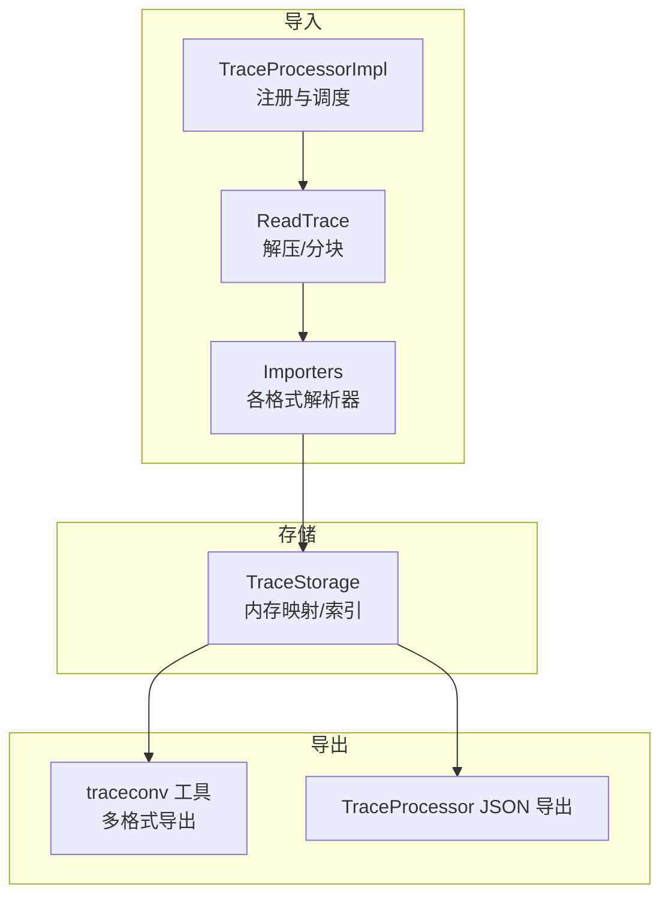
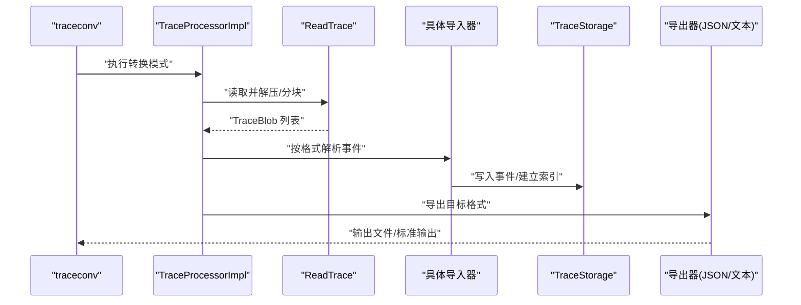
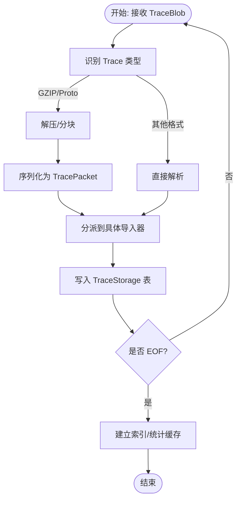
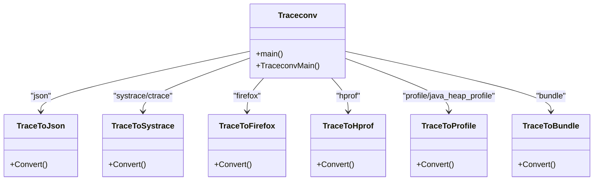
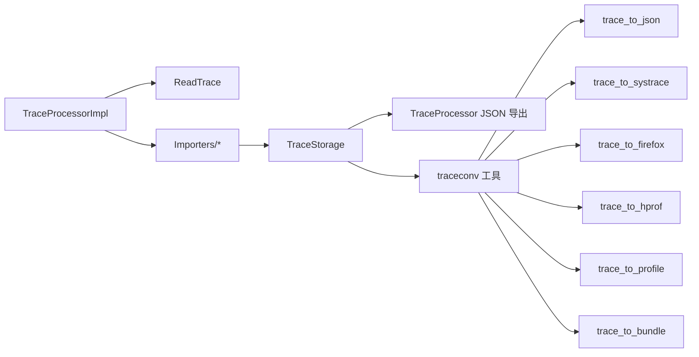

# 数据导入和导出

<cite>
**本文引用的文件**
- [export_json.h](file://src/trace_processor/export_json.h)
- [export_json.cc](file://src/trace_processor/export_json.cc)
- [read_trace.cc](file://src/trace_processor/read_trace.cc)
- [trace_processor_impl.h](file://src/trace_processor/trace_processor_impl.h)
- [trace_processor_impl.cc](file://src/trace_processor/trace_processor_impl.cc)
- [main.cc](file://src/traceconv/main.cc)
- [traceconv.cc](file://src/traceconv/traceconv.cc)
- [trace_to_json.h](file://src/traceconv/trace_to_json.h)
- [trace_to_json.cc](file://src/traceconv/trace_to_json.cc)
- [trace_to_text.h](file://src/traceconv/trace_to_text.h)
- [trace_to_text.cc](file://src/traceconv/trace_to_text.cc)
- [trace_to_systrace.h](file://src/traceconv/trace_to_systrace.h)
- [trace_to_systrace.cc](file://src/traceconv/trace_to_systrace.cc)
- [trace_to_firefox.h](file://src/traceconv/trace_to_firefox.h)
- [trace_to_firefox.cc](file://src/traceconv/trace_to_firefox.cc)
- [trace_to_hprof.h](file://src/traceconv/trace_to_hprof.h)
- [trace_to_hprof.cc](file://src/traceconv/trace_to_hprof.cc)
- [trace_to_profile.h](file://src/traceconv/trace_to_profile.h)
- [trace_to_profile.cc](file://src/traceconv/trace_to_profile.cc)
- [trace_to_bundle.h](file://src/traceconv/trace_to_bundle.h)
- [trace_to_bundle.cc](file://src/traceconv/trace_to_bundle.cc)
- [trace_to_pprof_integrationtest.cc](file://src/traceconv/trace_to_pprof_integrationtest.cc)
- [trace_to_text_integrationtest.cc](file://src/traceconv/trace_to_text_integrationtest.cc)
</cite>

## 目录
1. [简介](#简介)
2. [项目结构](#项目结构)
3. [核心组件](#核心组件)
4. [架构总览](#架构总览)
5. [详细组件分析](#详细组件分析)
6. [依赖关系分析](#依赖关系分析)
7. [性能考量](#性能考量)
8. [故障排查指南](#故障排查指南)
9. [结论](#结论)
10. [附录](#附录)

## 简介
本技术文档聚焦于 Trace Processor 的数据导入与导出能力，系统性阐述以下内容：
- 支持的输入格式：Perfetto 原生格式（Trace/TracePacket）、Chrome Tracing（JSON）、SystemTap、ftrace 等。
- 导入器实现机制：数据解析、验证与转换流程。
- 存储架构：内存映射、索引建立与查询优化。
- 输出格式：JSON、文本、Systrace、Firefox Profiler、HProf、pprof、Bundle 等。
- 批处理与流式处理：适用场景与差异。
- 数据转换工具使用指南与性能优化建议。
- 实际迁移与转换示例。

## 项目结构
围绕导入/导出的关键模块分布如下：
- 导入路径：trace_processor_impl 负责注册与调度各类导入器；read_trace 提供通用解压与分块读取能力；具体格式由 importers 子目录下的解析器完成。
- 导出路径：traceconv 工具统一入口，按模式调用 trace_to_* 模块；同时 trace_processor 内部也提供 JSON 导出接口。
- 文档与示例：docs 下的“getting-started”、“other-formats”、“converting”等章节提供了格式转换与使用指导。

**图表来源**
- [trace_processor_impl.cc:54-80](file://src/trace_processor/trace_processor_impl.cc#L54-L80)
- [read_trace.cc:77-87](file://src/trace_processor/read_trace.cc#L77-L87)
- [export_json.cc:144-156](file://src/trace_processor/export_json.cc#L144-L156)
- [traceconv.cc:290-303](file://src/traceconv/traceconv.cc#L290-L303)

**章节来源**
- [trace_processor_impl.h:53-72](file://src/trace_processor/trace_processor_impl.h#L53-L72)
- [trace_processor_impl.cc:54-80](file://src/trace_processor/trace_processor_impl.cc#L54-L80)
- [read_trace.cc:77-87](file://src/trace_processor/read_trace.cc#L77-L87)
- [export_json.h:26-38](file://src/trace_processor/export_json.h#L26-L38)
- [export_json.cc:144-156](file://src/trace_processor/export_json.cc#L144-L156)
- [traceconv.cc:290-303](file://src/traceconv/traceconv.cc#L290-L303)

## 核心组件
- TraceProcessorImpl：负责注册插件、初始化 SQL 引擎、接收 TraceBlob 并驱动解析与索引构建。
- ReadTrace：提供通用的解压与分块读取能力，支持 GZIP 与原始 Proto Trace。
- JSON 导出：TraceProcessor 内置 JSON 导出接口，支持参数过滤与元数据导出。
- traceconv：命令行工具，支持 JSON、Systrace、Firefox、HProf、pprof、Bundle 等格式转换。

**章节来源**
- [trace_processor_impl.h:53-72](file://src/trace_processor/trace_processor_impl.h#L53-L72)
- [trace_processor_impl.cc:54-80](file://src/trace_processor/trace_processor_impl.cc#L54-L80)
- [read_trace.cc:77-87](file://src/trace_processor/read_trace.cc#L77-L87)
- [export_json.h:26-38](file://src/trace_processor/export_json.h#L26-L38)
- [export_json.cc:144-156](file://src/trace_processor/export_json.cc#L144-L156)
- [traceconv.cc:290-303](file://src/traceconv/traceconv.cc#L290-L303)

## 架构总览
Trace Processor 的导入/导出架构遵循“统一入口 + 多格式适配”的设计：
- 入口：TraceProcessorImpl.Parse 接收 TraceBlob，随后根据 Trace 类型与内容选择合适的导入器。
- 解析链路：ReadTrace 对压缩包进行解压与分块；导入器将事件写入 TraceStorage。
- 查询与导出：通过 SQL 引擎与内置导出接口（JSON）或 traceconv 工具完成多格式输出。

**图表来源**
- [traceconv.cc:290-303](file://src/traceconv/traceconv.cc#L290-L303)
- [trace_processor_impl.cc:54-80](file://src/trace_processor/trace_processor_impl.cc#L54-L80)
- [read_trace.cc:77-87](file://src/trace_processor/read_trace.cc#L77-L87)
- [export_json.cc:144-156](file://src/trace_processor/export_json.cc#L144-L156)

## 详细组件分析

### 导入器实现机制
- 统一入口与调度
  - TraceProcessorImpl.Parse 接收 TraceBlob，内部维护插件与静态表函数，确保解析链路可扩展。
  - NotifyEndOfFile 触发最终化与统计缓存，为后续导出与查询提供稳定状态。
- 通用解压与分块
  - ReadTrace.DecompressTrace 支持 GZIP 与原始 Proto Trace；对压缩包内的压缩段进行解压并序列化为 TracePacket 流。
  - SerializingProtoTraceReader 将分块数据以 TracePacket 形式写回，便于后续解析器消费。
- 具体格式解析
  - 进一步的格式解析由 importers 子目录下的解析器完成（例如 JSON、Systrace、Perf、ftrace 等），它们将事件写入 TraceStorage 的对应表中。

**图表来源**
- [read_trace.cc:89-135](file://src/trace_processor/read_trace.cc#L89-L135)
- [trace_processor_impl.cc:54-80](file://src/trace_processor/trace_processor_impl.cc#L54-L80)

**章节来源**
- [trace_processor_impl.h:53-72](file://src/trace_processor/trace_processor_impl.h#L53-L72)
- [trace_processor_impl.cc:54-80](file://src/trace_processor/trace_processor_impl.cc#L54-L80)
- [read_trace.cc:89-135](file://src/trace_processor/read_trace.cc#L89-L135)

### 数据存储架构与查询优化
- 存储模型
  - TraceStorage 作为核心存储容器，承载进程/线程、切片、计数器、流、内存快照等表，并维护字符串表与参数集。
- 内存映射与索引
  - 通过内存映射与紧凑表结构降低内存占用；索引建立在关键列（时间戳、PID/TID、UTID 等）上，加速查询。
- 查询优化
  - Perfetto SQL 引擎提供窗口函数、区间连接、树遍历等操作，结合 TraceProcessorImpl 缓存边界与对象数量，减少重复计算。

**章节来源**
- [export_json.cc:676-714](file://src/trace_processor/export_json.cc#L676-L714)
- [trace_processor_impl.cc:163-176](file://src/trace_processor/trace_processor_impl.cc#L163-L176)

### 输出格式支持与实现
- JSON（Chrome Tracing）
  - TraceProcessor 内置 JSON 导出接口，支持参数过滤、元数据过滤与标签过滤，生成 traceEvents、systemTraceEvents、metadata。
  - traceconv 模式“json”同样支持 JSON 导出，并可选择截断与全排序。
- Systrace
  - traceconv 模式“systrace/ctrace”，支持 HTML/S表达式输出，可截断起始/末尾并强制全排序。
- Firefox Profiler
  - traceconv 模式“firefox”，将 Trace 转换为 Firefox Profiler 可读格式。
- HProf
  - traceconv 模式“hprof”，支持按进程与时间戳筛选导出 Java 堆快照。
- pprof/profile
  - traceconv 模式“profile/java_heap_profile”，支持多类型剖析数据导出，可指定输出目录与注解策略。
- Bundle
  - traceconv 模式“bundle”，打包符号与去混淆映射，便于离线分析。

**图表来源**
- [traceconv.cc:290-303](file://src/traceconv/traceconv.cc#L290-L303)
- [trace_to_json.cc](file://src/traceconv/trace_to_json.cc)
- [trace_to_systrace.cc](file://src/traceconv/trace_to_systrace.cc)
- [trace_to_firefox.cc](file://src/traceconv/trace_to_firefox.cc)
- [trace_to_hprof.cc](file://src/traceconv/trace_to_hprof.cc)
- [trace_to_profile.cc](file://src/traceconv/trace_to_profile.cc)
- [trace_to_bundle.cc](file://src/traceconv/trace_to_bundle.cc)

**章节来源**
- [export_json.h:26-38](file://src/trace_processor/export_json.h#L26-L38)
- [export_json.cc:144-156](file://src/trace_processor/export_json.cc#L144-L156)
- [traceconv.cc:290-303](file://src/traceconv/traceconv.cc#L290-L303)

### 批处理与流式处理
- 批处理模式
  - 适用于完整 Trace 文件的离线分析与转换。TraceProcessorImpl 在 NotifyEndOfFile 后完成索引与统计缓存，适合一次性导出。
- 流式处理模式
  - 面向实时/边到边场景，TraceProcessorImpl.Parse 可持续接收 TraceBlob 并增量写入存储；适合长时间运行的 Trace 采集与导出。

**章节来源**
- [trace_processor_impl.h:70-72](file://src/trace_processor/trace_processor_impl.h#L70-L72)
- [trace_processor_impl.cc:54-80](file://src/trace_processor/trace_processor_impl.cc#L54-L80)

### 数据转换工具使用指南
- 命令行入口
  - traceconv 主程序入口位于 main.cc，统一调度各转换模式。
- 常用模式
  - json：将 Trace 转换为 Chrome JSON 格式，支持 --truncate 与 --full-sort。
  - systrace/ctrace：转为 Systrace HTML 或压缩格式，支持截断与全排序。
  - text：转为人类可读文本，支持跳过未知字段。
  - profile/java_heap_profile：导出剖析数据，支持 --pid、--timestamps、--output-dir 等。
  - hprof：导出 Java 堆快照。
  - firefox：导出 Firefox Profiler 格式。
  - bundle：打包符号与映射文件。
  - binary：将文本 proto 转为二进制。
- 注意事项
  - bundle 模式需要显式输入/输出文件路径，不支持 stdin/stdout。
  - 截断与全排序仅在部分模式下可用。

**章节来源**
- [main.cc:19-21](file://src/traceconv/main.cc#L19-L21)
- [traceconv.cc:59-127](file://src/traceconv/traceconv.cc#L59-L127)
- [traceconv.cc:290-303](file://src/traceconv/traceconv.cc#L290-L303)
- [traceconv.cc:320-324](file://src/traceconv/traceconv.cc#L320-L324)
- [traceconv.cc:336-343](file://src/traceconv/traceconv.cc#L336-L343)
- [traceconv.cc:345-347](file://src/traceconv/traceconv.cc#L345-L347)
- [traceconv.cc:356-357](file://src/traceconv/traceconv.cc#L356-L357)
- [traceconv.cc:359-360](file://src/traceconv/traceconv.cc#L359-L360)
- [traceconv.cc:362-402](file://src/traceconv/traceconv.cc#L362-L402)

## 依赖关系分析
- 导入侧依赖
  - TraceProcessorImpl 依赖 importers 子目录下的解析器，解析器将事件写入 TraceStorage。
  - ReadTrace 依赖 gzip 解压与分块读取工具，用于处理压缩 Trace。
- 导出侧依赖
  - traceconv 依赖各 trace_to_* 模块；TraceProcessor 内置 JSON 导出依赖 TraceStorage 与参数/元数据工具。

**图表来源**
- [trace_processor_impl.cc:54-80](file://src/trace_processor/trace_processor_impl.cc#L54-L80)
- [read_trace.cc:77-87](file://src/trace_processor/read_trace.cc#L77-L87)
- [export_json.cc:144-156](file://src/trace_processor/export_json.cc#L144-L156)
- [traceconv.cc:290-303](file://src/traceconv/traceconv.cc#L290-L303)

**章节来源**
- [trace_processor_impl.cc:54-80](file://src/trace_processor/trace_processor_impl.cc#L54-L80)
- [read_trace.cc:77-87](file://src/trace_processor/read_trace.cc#L77-L87)
- [export_json.cc:144-156](file://src/trace_processor/export_json.cc#L144-L156)
- [traceconv.cc:290-303](file://src/traceconv/traceconv.cc#L290-L303)

## 性能考量
- 解压与分块
  - 使用 GzipTraceParser 与分块读取减少内存峰值，提升大 Trace 的导入稳定性。
- 索引与统计
  - NotifyEndOfFile 后缓存边界与统计信息，避免后续查询重复扫描。
- 导出优化
  - JSON 导出支持参数/元数据/标签过滤，减少冗余字段；异步事件排序合并保证输出顺序正确。
- 工具模式
  - traceconv 的“--full-sort”会增加排序成本，仅在需要严格时序时启用；“--truncate”可缩短处理时间。

**章节来源**
- [read_trace.cc:89-135](file://src/trace_processor/read_trace.cc#L89-L135)
- [export_json.cc:203-319](file://src/trace_processor/export_json.cc#L203-L319)
- [traceconv.cc:174-185](file://src/traceconv/traceconv.cc#L174-L185)
- [traceconv.cc:203-204](file://src/traceconv/traceconv.cc#L203-L204)

## 故障排查指南
- 输入类型错误
  - DecompressTrace 仅支持 GZIP 与原始 Proto Trace；若传入其他类型会返回错误。
- 解压失败
  - Gzip 解压过程中遇到错误或需要更多输入时，会返回错误状态；检查压缩包完整性。
- JSON 导出异常
  - 参数/元数据过滤可能导致字段被剥离；确认过滤谓词配置。
- traceconv 使用问题
  - bundle 模式必须提供文件路径；stdin/stdout 不支持。
  - “--truncate”和“--full-sort”仅在特定模式下有效。

**章节来源**
- [read_trace.cc:89-96](file://src/trace_processor/read_trace.cc#L89-L96)
- [read_trace.cc:125-133](file://src/trace_processor/read_trace.cc#L125-L133)
- [export_json.cc:462-513](file://src/trace_processor/export_json.cc#L462-L513)
- [traceconv.cc:373-382](file://src/traceconv/traceconv.cc#L373-L382)
- [traceconv.cc:305-317](file://src/traceconv/traceconv.cc#L305-L317)

## 结论
Trace Processor 的导入/导出体系以 TraceProcessorImpl 为核心，结合 ReadTrace 与 importers 完成多格式解析，借助 TraceStorage 提供高效查询与索引；traceconv 工具则覆盖从 JSON、Systrace、Firefox、HProf 到 pprof、Bundle 的广泛导出需求。通过批处理与流式处理模式，满足不同规模与场景的 Trace 分析与迁移任务。

## 附录
- 实际迁移与转换示例（基于工具与接口）
  - 将 Perfetto 原生 Trace 转为 Chrome JSON：使用 traceconv 模式“json”，必要时配合 --truncate 与 --full-sort。
  - 将 Trace 转为 Systrace HTML：使用 traceconv 模式“systrace”，支持截断与全排序。
  - 导出 Java 堆快照为 HProf：使用 traceconv 模式“hprof”，可按进程与时间戳筛选。
  - 导出剖析数据为 pprof：使用 traceconv 模式“profile/java_heap_profile”，可指定输出目录与注解策略。
  - 打包符号与映射：使用 traceconv 模式“bundle”，提供符号路径与自动发现选项。
  - TraceProcessor 内置 JSON 导出：通过 ExportJson 接口，支持参数/元数据/标签过滤，适合程序化导出。

**章节来源**
- [traceconv.cc:290-303](file://src/traceconv/traceconv.cc#L290-L303)
- [traceconv.cc:345-347](file://src/traceconv/traceconv.cc#L345-L347)
- [traceconv.cc:336-343](file://src/traceconv/traceconv.cc#L336-L343)
- [traceconv.cc:362-402](file://src/traceconv/traceconv.cc#L362-L402)
- [export_json.h:26-38](file://src/trace_processor/export_json.h#L26-L38)
- [export_json.cc:144-156](file://src/trace_processor/export_json.cc#L144-L156)