# OpenPerfetto AI分析系统

<cite>
**本文档引用的文件**
- [README.md](file://README.md)
- [openperfetto_page.ts](file://ui/src/plugins/org.openperfetto/sidebar/openperfetto_page.ts)
- [ai_chat.ts](file://ui/src/plugins/org.openperfetto/sidebar/ai_chat.ts)
- [agent_loop.ts](file://ui/src/plugins/org.openperfetto/agent/agent_loop.ts)
- [scene_classifier.ts](file://ui/src/plugins/org.openperfetto/agent/scene_classifier.ts)
- [context_manager.ts](file://ui/src/plugins/org.openperfetto/agent/context_manager.ts)
- [planning_gate.ts](file://ui/src/plugins/org.openperfetto/agent/planning_gate.ts)
- [artifact_store.ts](file://ui/src/plugins/org.openperfetto/agent/artifact_store.ts)
- [websocket_client.ts](file://ui/src/plugins/org.openperfetto/services/websocket_client.ts)
- [llm_stream_handler.ts](file://ui/src/plugins/org.openperfetto/services/llm_stream_handler.ts)
- [plugin_state.ts](file://ui/src/plugins/org.openperfetto/types/plugin_state.ts)
- [agent.ts](file://ui/src/plugins/org.openperfetto/types/agent.ts)
- [top_bar.ts](file://ui/src/plugins/org.openperfetto/sidebar/top_bar.ts)
- [perfetto.scss](file://ui/src/assets/perfetto.scss)
- [theme.scss](file://ui/src/assets/theme.scss)
</cite>

## 更新摘要
**所做更改**
- 新增了全面的AI聊天组件实现分析，包括增强的消息渲染系统和流式处理能力
- 更新了上下文管理器的Token预算管理系统和场景分类器的改进算法
- 增强了流式处理器的防抖缓冲机制和WebSocket通信系统的稳定性
- 完善了CSS样式系统和主题管理功能
- 扩展了场景分类器的支持场景类型和优先级体系

## 目录
1. [简介](#简介)
2. [项目结构](#项目结构)
3. [核心组件](#核心组件)
4. [架构概览](#架构概览)
5. [详细组件分析](#详细组件分析)
6. [样式系统](#样式系统)
7. [依赖关系分析](#依赖关系分析)
8. [性能考虑](#性能考虑)
9. [故障排除指南](#故障排除指南)
10. [结论](#结论)

## 简介

OpenPerfetto AI分析系统是一个基于人工智能的性能分析平台，专为Android和Linux系统设计。该系统集成了先进的AI技术与Perfetto的高性能追踪能力，为开发者提供智能化的性能问题诊断和根因分析。

### 主要特性

- **智能场景识别**：自动识别性能问题类型（滑动卡顿、启动慢、ANR等）
- **AI驱动分析**：通过对话式AI助手进行深度性能分析
- **多工具集成**：支持多种分析工具和技能的自动化调用
- **实时流式响应**：提供流畅的AI交互体验
- **可视化展示**：直观的性能数据可视化和报告生成
- **增强的样式系统**：现代化的UI设计和主题管理
- **改进的上下文管理**：智能的Token预算分配和历史消息压缩

### 技术架构

系统采用模块化设计，结合了现代前端技术栈和高性能后端服务：

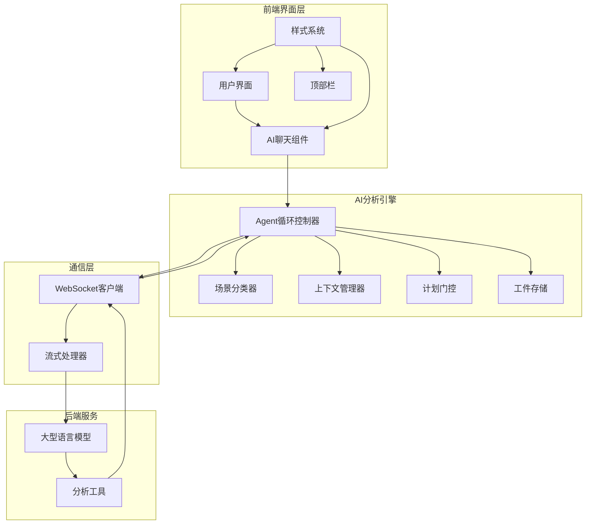

**图表来源**
- [openperfetto_page.ts:53-198](file://ui/src/plugins/org.openperfetto/sidebar/openperfetto_page.ts#L53-L198)
- [agent_loop.ts:130-187](file://ui/src/plugins/org.openperfetto/agent/agent_loop.ts#L130-L187)
- [perfetto.scss:15-95](file://ui/src/assets/perfetto.scss#L15-L95)

## 项目结构

OpenPerfetto AI分析系统采用清晰的分层架构设计，主要分为以下几个层次：

### 前端UI层
- **页面组件**：负责整体布局和用户交互
- **聊天组件**：实现AI对话功能，支持流式响应和消息渲染
- **工具栏组件**：提供系统控制功能
- **样式系统**：完整的CSS样式和主题管理

### AI分析层
- **Agent循环**：核心分析流程控制器
- **场景分类器**：智能识别性能问题类型，支持12种场景类型
- **上下文管理器**：管理分析上下文和提示词，实现智能Token预算分配
- **计划门控**：强制分析计划的提交和验证
- **工件存储**：管理分析结果和中间数据

### 通信层
- **WebSocket客户端**：建立与后端服务的连接
- **流式处理器**：处理实时AI响应，支持防抖缓冲机制

### 状态管理层
- **全局状态**：统一管理应用状态
- **连接状态**：维护与AI服务的连接

**章节来源**
- [openperfetto_page.ts:32-52](file://ui/src/plugins/org.openperfetto/sidebar/openperfetto_page.ts#L32-L52)
- [plugin_state.ts:28-76](file://ui/src/plugins/org.openperfetto/types/plugin_state.ts#L28-L76)
- [perfetto.scss:15-95](file://ui/src/assets/perfetto.scss#L15-L95)

## 核心组件

### Agent循环控制器

Agent循环控制器是整个AI分析系统的核心，实现了完整的分析流程状态机：

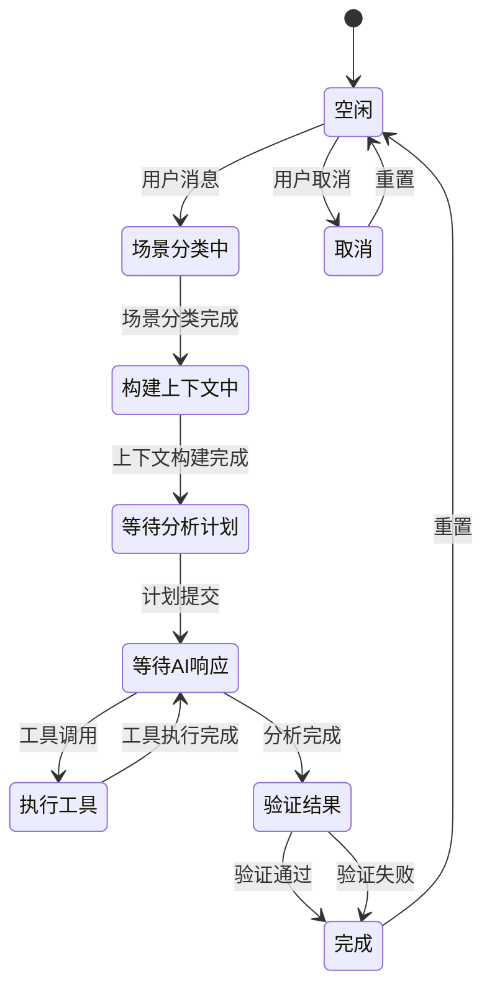

**图表来源**
- [agent_loop.ts:124-129](file://ui/src/plugins/org.openperfetto/agent/agent_loop.ts#L124-L129)

### 场景分类器

场景分类器能够智能识别不同类型的性能问题，支持12种场景类型：

| 场景类型 | 关键词 | 优先级 | 描述 |
|---------|--------|--------|------|
| scrolling | scroll, jank, fps | 10 | 滑动性能分析 |
| startup_cold | cold start, app launch | 10 | 冷启动分析 |
| anr | anr, frozen, deadlock | 15 | ANR分析（最高优先级） |
| lock_contention | lock, mutex, contention | 12 | 锁竞争分析 |
| binder_blocking | binder, ipc, transaction | 11 | Binder阻塞分析 |
| io_analysis | io, disk, file | 9 | I/O性能分析 |
| high_load | cpu, load, performance | 7 | 高CPU负载分析 |
| startup_warm | warm start, resume | 9 | 温启动分析 |
| startup_hot | hot start, quick resume | 8 | 热启动分析 |
| screen_on_off | screen on, screen off | 6 | 亮灭屏分析 |
| unlock | unlock, keyguard | 6 | 解锁性能分析 |
| general | 通用场景 | 1 | 通用分析 |

**章节来源**
- [scene_classifier.ts:45-212](file://ui/src/plugins/org.openperfetto/agent/scene_classifier.ts#L45-L212)

### 上下文管理器

上下文管理器负责构建和管理AI分析所需的上下文信息，实现了智能的Token预算分配：

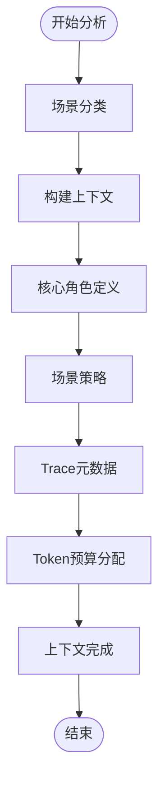

**图表来源**
- [context_manager.ts:215-231](file://ui/src/plugins/org.openperfetto/agent/context_manager.ts#L215-L231)

**章节来源**
- [context_manager.ts:48-231](file://ui/src/plugins/org.openperfetto/agent/context_manager.ts#L48-L231)

## 架构概览

OpenPerfetto AI分析系统采用微服务架构，各组件职责明确，通过清晰的接口进行通信：

### 系统架构图

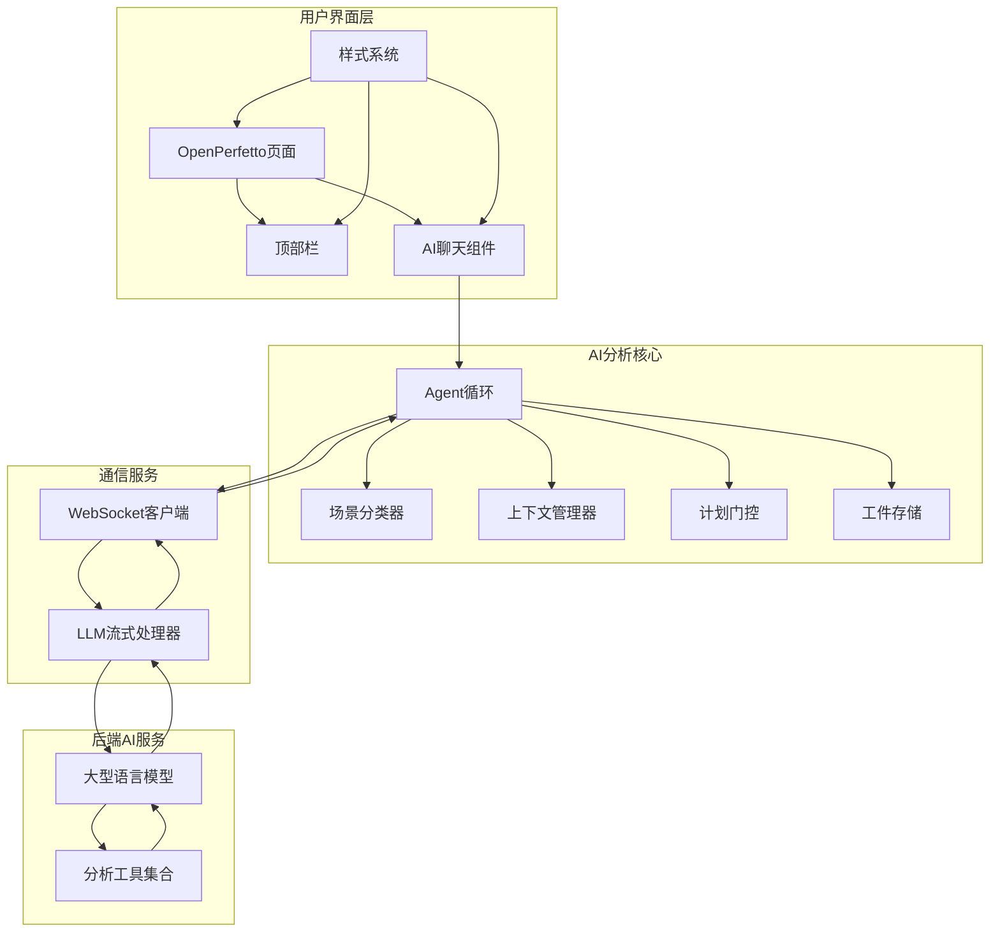

**图表来源**
- [openperfetto_page.ts:63-138](file://ui/src/plugins/org.openperfetto/sidebar/openperfetto_page.ts#L63-L138)
- [agent_loop.ts:130-187](file://ui/src/plugins/org.openperfetto/agent/agent_loop.ts#L130-L187)
- [perfetto.scss:15-95](file://ui/src/assets/perfetto.scss#L15-L95)

### 数据流架构

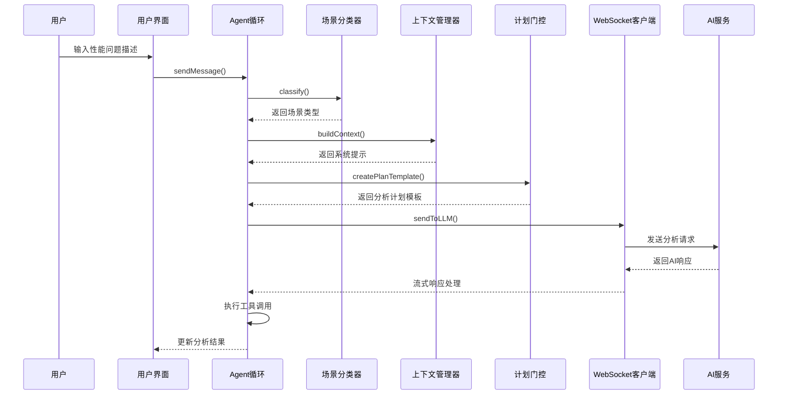

**图表来源**
- [agent_loop.ts:213-234](file://ui/src/plugins/org.openperfetto/agent/agent_loop.ts#L213-L234)
- [scene_classifier.ts:217-259](file://ui/src/plugins/org.openperfetto/agent/scene_classifier.ts#L217-L259)

## 详细组件分析

### OpenPerfetto页面组件

OpenPerfetto页面组件是整个AI分析系统的入口点，提供了完整的用户界面框架：

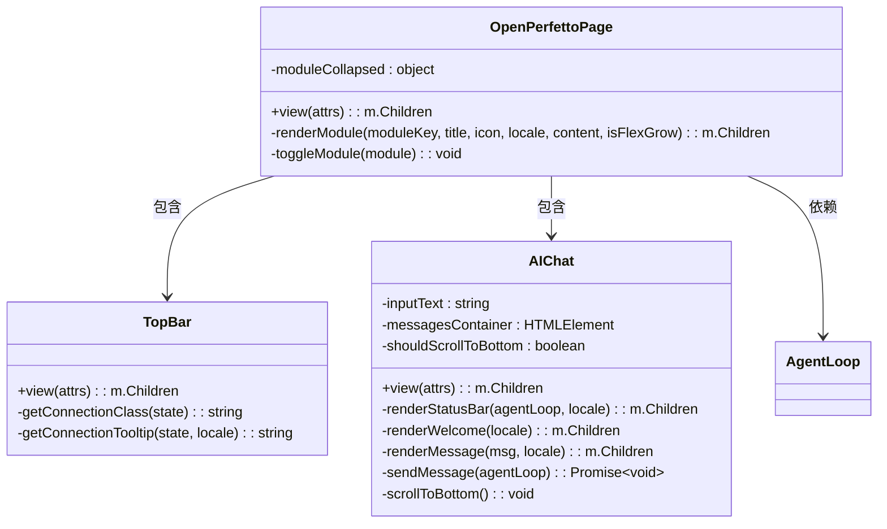

**图表来源**
- [openperfetto_page.ts:53-198](file://ui/src/plugins/org.openperfetto/sidebar/openperfetto_page.ts#L53-L198)
- [top_bar.ts:36-118](file://ui/src/plugins/org.openperfetto/sidebar/top_bar.ts#L36-L118)
- [ai_chat.ts:47-450](file://ui/src/plugins/org.openperfetto/sidebar/ai_chat.ts#L47-L450)

#### 页面布局设计

页面采用灵活的模块化布局，支持多个可折叠的功能模块：

| 模块名称 | 组件 | 功能描述 | 折叠状态 |
|---------|------|----------|----------|
| 搜索与Pin模块 | SearchPin | 性能问题搜索和标记功能 | 可折叠 |
| 标记与跳转模块 | Markers | AI标记管理和快速跳转 | 可折叠 |
| AI聊天模块 | AIChat | 核心AI分析对话界面 | 可折叠，弹性增长 |
| 设置按钮 | Settings | 系统设置入口 | 固定高度 |

**章节来源**
- [openperfetto_page.ts:56-122](file://ui/src/plugins/org.openperfetto/sidebar/openperfetto_page.ts#L56-L122)

### AI聊天组件

AI聊天组件实现了完整的对话式AI分析功能，支持多种消息类型和流式响应：

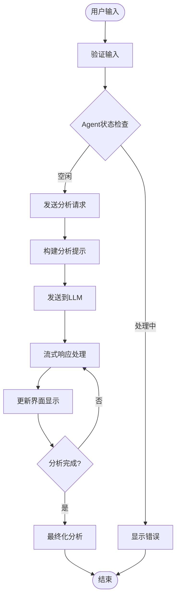

**图表来源**
- [ai_chat.ts:413-429](file://ui/src/plugins/org.openperfetto/sidebar/ai_chat.ts#L413-L429)

#### 消息渲染系统

AI聊天组件支持多种消息类型的渲染：

| 消息类型 | 渲染组件 | 功能特性 |
|---------|----------|----------|
| 用户消息 | 标准消息 | 支持Markdown渲染 |
| AI助手消息 | 流式消息 | 实时文本增量显示 |
| 工具调用消息 | 工具调用组件 | 显示工具参数和调用信息 |
| 工具结果消息 | 工具结果组件 | 显示执行状态和结果 |

**章节来源**
- [ai_chat.ts:188-357](file://ui/src/plugins/org.openperfetto/sidebar/ai_chat.ts#L188-L357)

### WebSocket通信系统

WebSocket通信系统提供了可靠的实时通信能力：

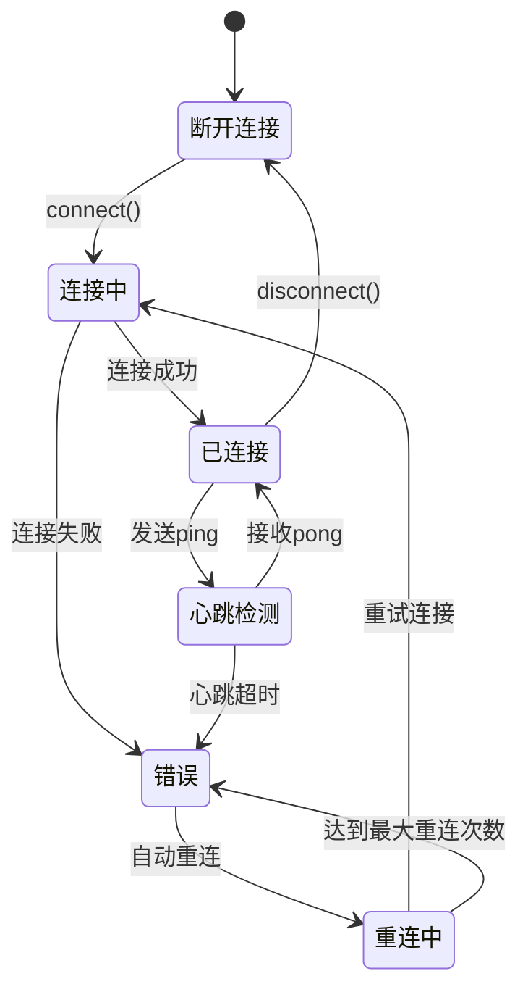

**图表来源**
- [websocket_client.ts:88-106](file://ui/src/plugins/org.openperfetto/services/websocket_client.ts#L88-L106)

#### 连接管理策略

系统实现了智能的连接管理策略：

| 连接状态 | 管理策略 | 重连延迟 |
|---------|----------|----------|
| 断开连接 | 等待手动连接 | 不适用 |
| 连接中 | 指数退避重连 | 1s, 2s, 4s, 8s, 16s |
| 已连接 | 心跳检测 | 30s心跳间隔 |
| 错误状态 | 最大30s退避 | 最大30s延迟 |

**章节来源**
- [websocket_client.ts:211-236](file://ui/src/plugins/org.openperfetto/services/websocket_client.ts#L211-L236)

### 工件存储系统

工件存储系统负责管理分析过程中的大量数据：

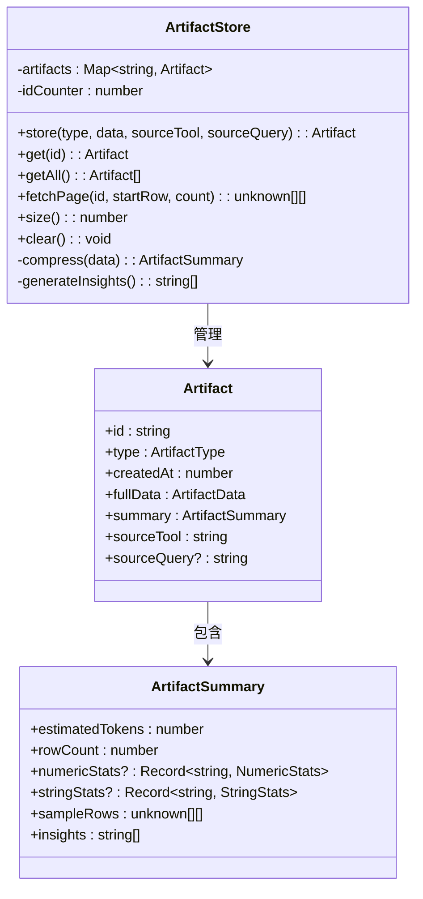

**图表来源**
- [artifact_store.ts:34-100](file://ui/src/plugins/org.openperfetto/agent/artifact_store.ts#L34-L100)

#### 数据压缩策略

系统采用了高效的采样和压缩策略：

| 采样策略 | 目标 | 实现方式 |
|---------|------|----------|
| 分位数采样 | 15-20行样本 | p25, p50, p75, p90, p95 |
| 极值保留 | Top 5 + Bottom 5 | 最大值和最小值保留 |
| 统计摘要 | 数值列统计 | min, max, avg, p50, p90, p99 |
| 自动洞察 | 关键发现 | 异常值检测和趋势分析 |

**章节来源**
- [artifact_store.ts:236-350](file://ui/src/plugins/org.openperfetto/agent/artifact_store.ts#L236-L350)

## 样式系统

OpenPerfetto AI分析系统采用了现代化的CSS样式系统，提供了完整的主题管理和组件样式支持：

### 样式架构

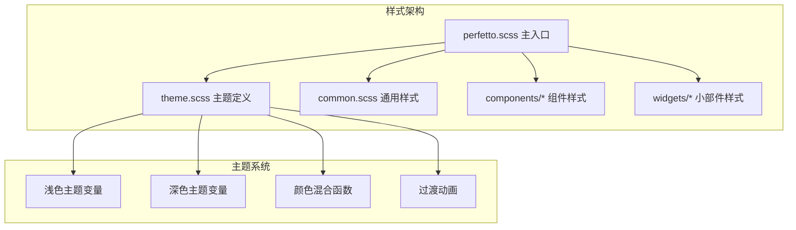

**图表来源**
- [perfetto.scss:15-95](file://ui/src/assets/perfetto.scss#L15-L95)
- [theme.scss:15-101](file://ui/src/assets/theme.scss#L15-L101)

### 主题管理

系统支持动态主题切换，包括浅色和深色主题：

| 主题特性 | 浅色主题 | 深色主题 |
|---------|----------|----------|
| 基础颜色 | 浅灰背景 | 深灰背景 |
| 文本颜色 | 深灰文字 | 浅灰文字 |
| 边框圆角 | 2px | 4px |
| 动画时序 | 150ms缓动 | 150ms缓动 |
| 阴影效果 | 轻度阴影 | 深度阴影 |

**章节来源**
- [theme.scss:15-101](file://ui/src/assets/theme.scss#L15-L101)

### 组件样式

系统提供了丰富的组件样式支持，包括：

- **对话框组件**：AI聊天界面的完整样式
- **按钮组件**：交互元素的统一样式
- **输入组件**：表单元素的样式规范
- **表格组件**：数据展示的样式系统
- **图表组件**：可视化元素的样式定义

**章节来源**
- [perfetto.scss:30-95](file://ui/src/assets/perfetto.scss#L30-L95)

## 依赖关系分析

### 组件依赖图

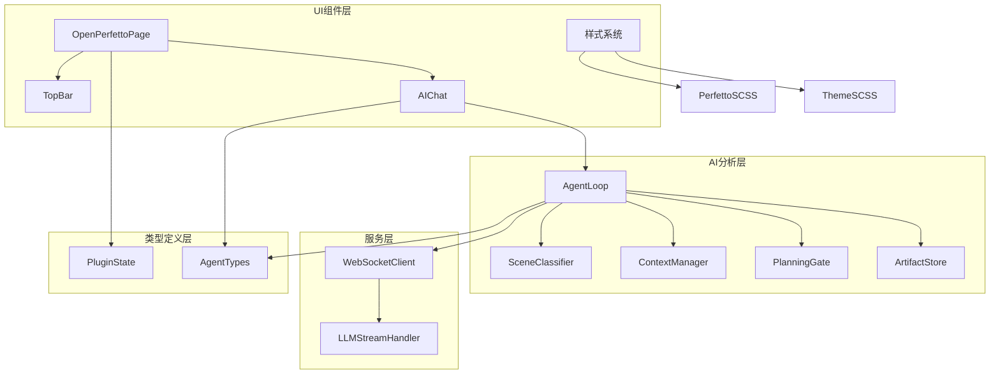

**图表来源**
- [openperfetto_page.ts:15-30](file://ui/src/plugins/org.openperfetto/sidebar/openperfetto_page.ts#L15-L30)
- [agent_loop.ts:16-29](file://ui/src/plugins/org.openperfetto/agent/agent_loop.ts#L16-L29)
- [perfetto.scss:15-95](file://ui/src/assets/perfetto.scss#L15-L95)

### 状态管理架构

系统采用集中式状态管理模式：

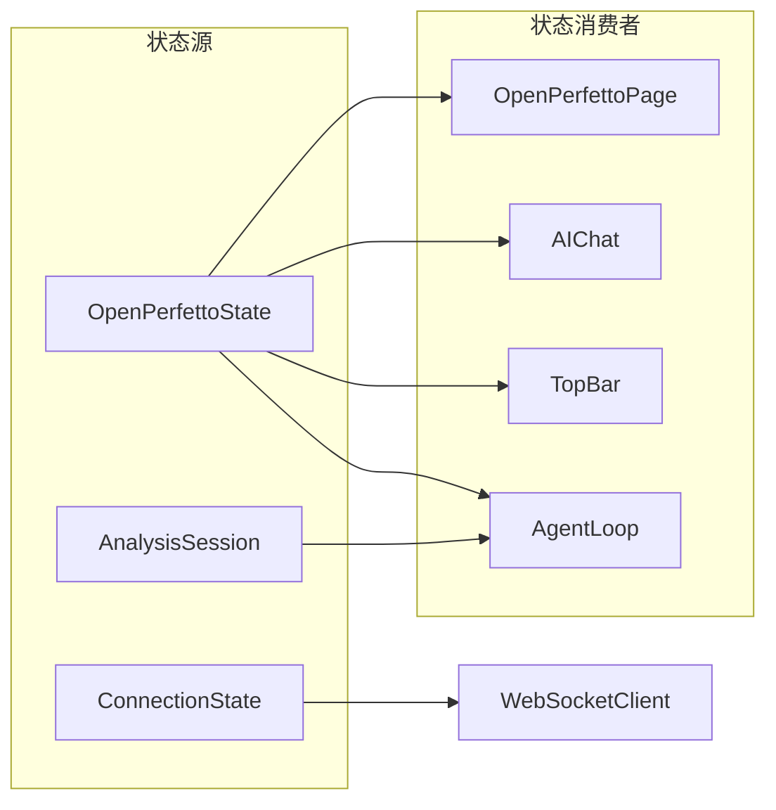

**图表来源**
- [plugin_state.ts:28-55](file://ui/src/plugins/org.openperfetto/types/plugin_state.ts#L28-L55)

**章节来源**
- [plugin_state.ts:93-124](file://ui/src/plugins/org.openperfetto/types/plugin_state.ts#L93-L124)

## 性能考虑

### Token预算管理

系统实现了智能的Token预算分配策略，确保AI分析的效率和成本控制：

| 场景类型 | 总预算 | 系统提示 | 场景策略 | Trace元数据 | 历史记录 |
|---------|--------|----------|----------|-------------|----------|
| 复杂场景(ANR, 冷启动) | 16384 | 10% | 8% | 12% | 70% |
| 标准场景(滑动, 启动) | 8192 | 12% | 8% | 10% | 70% |
| 通用场景 | 8192 | 15% | 5% | 10% | 70% |

### 并发处理优化

系统采用了多线程和异步处理策略：

- **UI线程调度**：使用requestAnimationFrame避免阻塞UI
- **工具调用并发**：支持多个工具同时执行
- **流式响应处理**：实时处理AI响应，避免阻塞
- **内存管理**：及时清理临时数据和事件监听器

### 缓存策略

系统实现了多层次的缓存机制：

- **上下文缓存**：场景分类结果缓存
- **工件缓存**：分析结果和中间数据缓存
- **连接缓存**：WebSocket连接状态缓存
- **状态缓存**：用户偏好和设置缓存

## 故障排除指南

### 常见问题及解决方案

| 问题类型 | 症状 | 可能原因 | 解决方案 |
|---------|------|----------|----------|
| 连接失败 | WebSocket连接错误 | 网络问题或服务不可用 | 检查网络连接，重启AI服务 |
| 分析超时 | 分析在30秒后停止 | 工具执行时间过长 | 优化工具配置，增加超时限制 |
| Token不足 | AI响应被截断 | 上下文过长 | 启用上下文压缩，减少历史记录 |
| 工具执行失败 | 工具返回错误 | 工具参数错误 | 检查工具参数，查看错误日志 |
| UI无响应 | 界面冻结 | 阻塞操作 | 检查长时间运行的任务 |

### 调试工具

系统提供了完善的调试和监控功能：

- **状态监控**：实时显示Agent状态和进度
- **消息日志**：记录完整的分析对话历史
- **性能指标**：监控分析时间和资源使用
- **错误追踪**：捕获和报告系统错误

**章节来源**
- [agent_loop.ts:749-772](file://ui/src/plugins/org.openperfetto/agent/agent_loop.ts#L749-L772)
- [websocket_client.ts:183-208](file://ui/src/plugins/org.openperfetto/services/websocket_client.ts#L183-L208)

## 结论

OpenPerfetto AI分析系统代表了现代性能分析技术的发展方向，成功地将人工智能技术与传统的性能分析工具相结合。系统具有以下显著优势：

### 技术优势

1. **智能化程度高**：能够自动识别性能问题类型并制定相应的分析策略
2. **用户体验优秀**：提供流畅的对话式交互体验
3. **扩展性强**：模块化设计便于功能扩展和定制
4. **性能高效**：智能的资源管理和优化策略
5. **样式现代化**：完整的CSS样式系统和主题管理

### 应用价值

- **开发效率提升**：大幅缩短性能问题诊断时间
- **问题定位准确**：通过AI辅助实现精准的根因分析
- **知识传承**：将专家经验转化为可复用的分析模式
- **成本降低**：减少对高级专家的依赖

### 发展前景

随着AI技术的不断发展，OpenPerfetto AI分析系统将在以下方面持续改进：

- **分析精度提升**：通过机器学习提高问题识别准确性
- **响应速度优化**：进一步优化算法和资源利用
- **功能扩展**：支持更多类型的性能分析场景
- **集成增强**：与其他开发工具和服务的深度集成
- **样式优化**：持续改进UI设计和用户体验

该系统为现代软件开发和性能优化提供了强有力的技术支撑，是推动行业技术进步的重要工具。