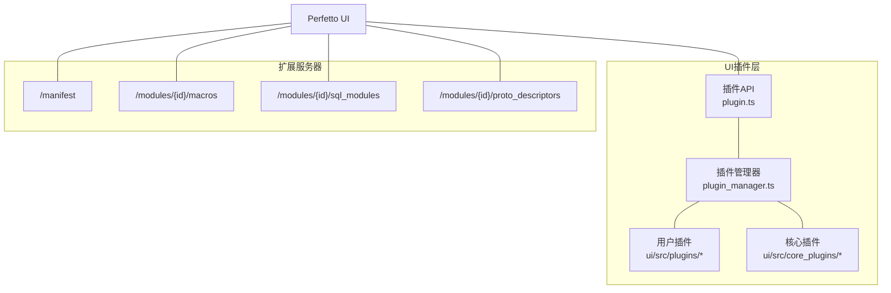
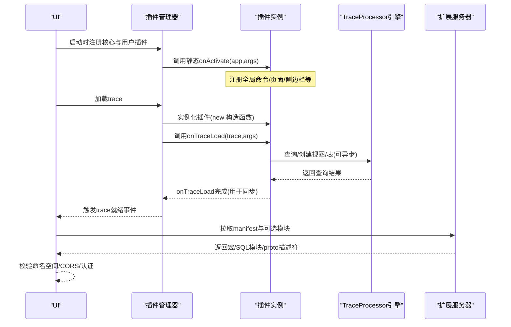
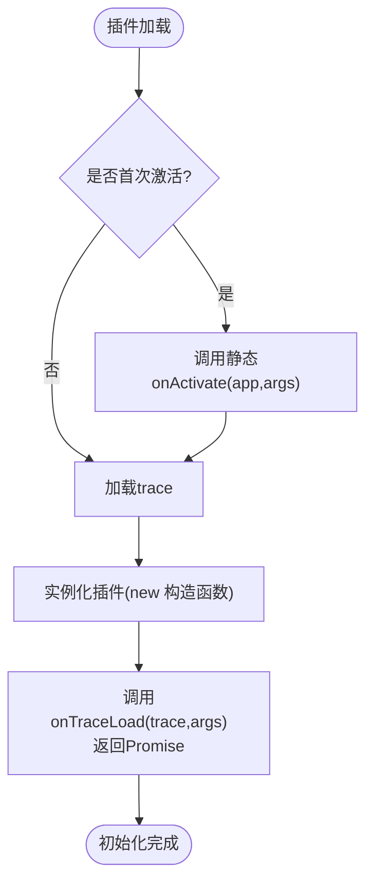
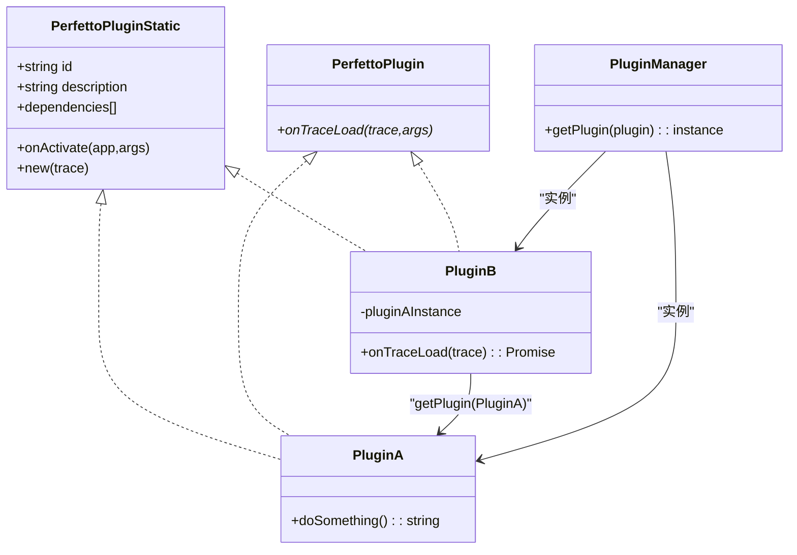
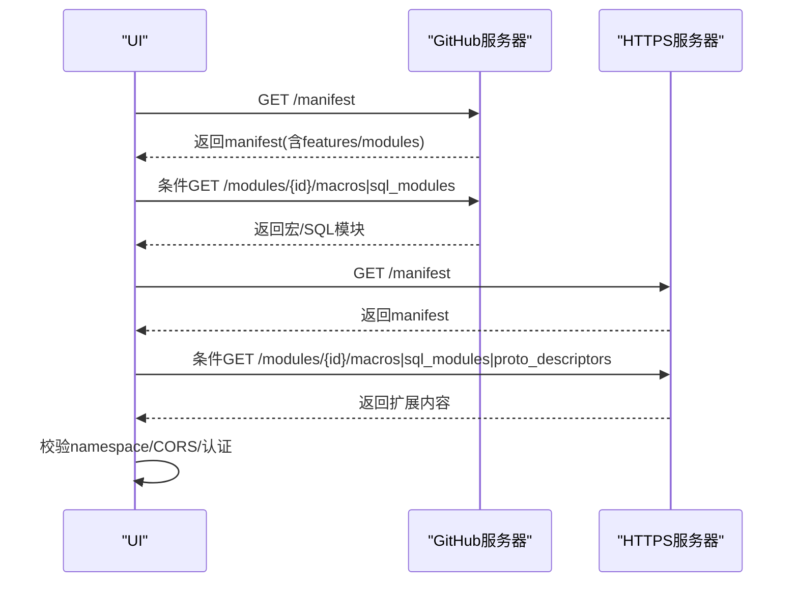
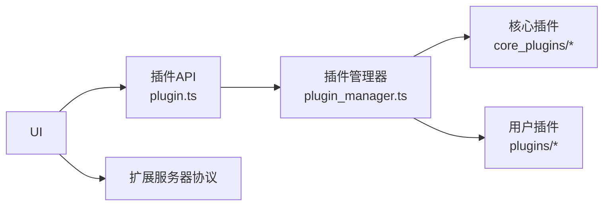

# UI插件系统

<cite>
**本文引用的文件**   
- [ui-plugins.md](file://docs/contributing/ui-plugins.md)
- [extension-servers.md](file://docs/visualization/extension-servers.md)
- [extension-server-protocol.md](file://docs/visualization/extension-server-protocol.md)
- [extending-the-ui.md](file://docs/visualization/extending-the-ui.md)
- [plugin.ts](file://ui/src/public/plugin.ts)
- [plugin_manager.ts](file://ui/src/core/plugin_manager.ts)
- [AGENTS-ui.md](file://docs/AGENTS-ui.md)
</cite>

## 目录
1. [引言](#引言)
2. [项目结构](#项目结构)
3. [核心组件](#核心组件)
4. [架构总览](#架构总览)
5. [组件详解](#组件详解)
6. [依赖关系分析](#依赖关系分析)
7. [性能考量](#性能考量)
8. [故障排查指南](#故障排查指南)
9. [结论](#结论)
10. [附录](#附录)

## 引言
本文件面向希望在Perfetto UI中开发与集成插件的工程师，系统性阐述插件架构设计、注册机制、生命周期管理、依赖注入、接口定义、不同类型插件（轨迹插件、分析工具插件、可视化扩展插件）的实现要点、开发与调试流程、与主应用的通信方式（命令、选择、工作区、分析器引擎），以及扩展服务器协议（宏、SQL模块、proto描述符）的实现细节与安全注意事项。文档同时提供最佳实践、常见问题与排障建议，并给出可直接参考的官方文档路径。

## 项目结构
Perfetto UI的插件体系由“插件API”“插件管理器”“核心插件”“扩展服务器协议”四部分组成：
- 插件API：定义插件静态类与实例接口、插件标识、可选依赖声明与生命周期钩子。
- 插件管理器：负责插件注册、实例化、依赖解析与跨插件访问。
- 核心插件：内置的系统级插件（如命令、示例、扩展服务器设置等），展示插件如何接入UI。
- 扩展服务器协议：HTTP(S)端点，提供宏、SQL模块与proto描述符，供UI按需加载。

图表来源
- [plugin.ts:1-46](file://ui/src/public/plugin.ts#L1-L46)
- [plugin_manager.ts:1-200](file://ui/src/core/plugin_manager.ts#L1-L200)
- [extension-server-protocol.md:1-278](file://docs/visualization/extension-server-protocol.md#L1-L278)

章节来源
- [plugin.ts:1-46](file://ui/src/public/plugin.ts#L1-L46)
- [plugin_manager.ts:1-200](file://ui/src/core/plugin_manager.ts#L1-L200)
- [extension-servers.md:1-393](file://docs/visualization/extension-servers.md#L1-L393)
- [extension-server-protocol.md:1-278](file://docs/visualization/extension-server-protocol.md#L1-L278)

## 核心组件
- 插件接口与静态类
  - PerfettoPluginStatic：定义插件静态成员（id、description、dependencies、onActivate）、构造函数签名与路由参数。
  - PerfettoPlugin：定义实例生命周期钩子onTraceLoad（可异步）。
  - PluginManager：提供getPlugin以跨插件获取实例。
- 插件管理器
  - 负责注册插件、按依赖顺序实例化、在trace加载时触发onTraceLoad并等待其完成，确保插件间同步与一致性。
- 扩展服务器协议
  - 提供manifest、macros、sql_modules、proto_descriptors四个端点；支持命名空间校验、CORS与多种认证头；支持GitHub托管与HTTPS自建服务。

章节来源
- [plugin.ts:19-46](file://ui/src/public/plugin.ts#L19-L46)
- [plugin_manager.ts:1-200](file://ui/src/core/plugin_manager.ts#L1-L200)
- [extension-server-protocol.md:1-278](file://docs/visualization/extension-server-protocol.md#L1-L278)

## 架构总览
下图展示了从UI启动到插件激活、再到每次trace加载时的交互流程，以及扩展服务器的加载与校验机制。

图表来源
- [plugin_manager.ts:1-200](file://ui/src/core/plugin_manager.ts#L1-L200)
- [plugin.ts:19-46](file://ui/src/public/plugin.ts#L19-L46)
- [extension-server-protocol.md:1-278](file://docs/visualization/extension-server-protocol.md#L1-L278)

## 组件详解

### 插件接口与生命周期
- 接口定义
  - 静态类：包含唯一id、可选description、可选dependencies数组、可选onActivate钩子。
  - 实例：包含可选的onTraceLoad钩子，返回Promise以保证初始化同步。
- 生命周期
  - onActivate：应用启动时调用一次，适合注册不依赖trace的全局扩展（命令、页面、侧边栏）。
  - onTraceLoad：每次trace加载时调用，适合注册与trace相关的扩展（轨迹、标签页、工作区布局）。
  - 建议：onActivate/onTraceLoad尽快完成；onTraceLoad中的异步操作必须await，确保UI能正确计时与同步。

图表来源
- [plugin.ts:19-46](file://ui/src/public/plugin.ts#L19-L46)
- [ui-plugins.md:100-180](file://docs/contributing/ui-plugins.md#L100-L180)

章节来源
- [plugin.ts:19-46](file://ui/src/public/plugin.ts#L19-L46)
- [ui-plugins.md:100-180](file://docs/contributing/ui-plugins.md#L100-L180)

### 插件注册与依赖注入
- 依赖声明
  - 在插件静态类上通过dependencies数组声明直接依赖的其他插件静态类。
- 依赖解析
  - 使用PluginManager.getPlugin获取已注册插件的实例，进行方法调用或数据共享。
- 典型场景
  - 插件A提供通用能力，插件B声明依赖A，在onTraceLoad中通过getPlugin获取A实例并复用其能力。

图表来源
- [plugin.ts:19-46](file://ui/src/public/plugin.ts#L19-L46)
- [plugin_manager.ts:150-170](file://ui/src/core/plugin_manager.ts#L150-L170)
- [ui-plugins.md:2100-2141](file://docs/contributing/ui-plugins.md#L2100-L2141)

章节来源
- [plugin.ts:19-46](file://ui/src/public/plugin.ts#L19-L46)
- [plugin_manager.ts:150-170](file://ui/src/core/plugin_manager.ts#L150-L170)
- [ui-plugins.md:2100-2141](file://docs/contributing/ui-plugins.md#L2100-L2141)

### 不同类型插件的实现要点
- 轨迹插件
  - 使用trace.tracks.registerTrack注册渲染器；结合createQuerySliceTrack或createQueryCounterTrack快速构建基于SQL的数据轨迹；通过TrackNode将轨迹挂载到当前工作区。
- 分析工具插件
  - 通过trace.engine.query执行SQL，使用schema定义列类型；结合Selection API控制UI选择状态；通过Commands API暴露快捷命令。
- 可视化扩展插件
  - 通过Workspaces API动态组织轨迹分组、固定与排序；利用TrackNodeArgs的sortOrder、collapsed、isSummary等属性优化布局体验。

章节来源
- [ui-plugins.md:550-800](file://docs/contributing/ui-plugins.md#L550-L800)

### 与主应用的通信机制
- 命令（Commands）
  - 通过app.commands或trace.commands.registerCommand注册；通过runCommand按id调用；注意命令id前缀规范与热键配置。
- 选择（Selection）
  - 通过trace.selection.selectTrackEvent/selectArea/selectTrack/selectSqlEvent/clearSelection统一控制UI选中状态与滚动行为。
- 工作区（Workspaces）
  - 通过trace.workspaces与trace.workspace管理多工作区；TrackNode用于组织轨迹树，支持pin/unpin、展开/折叠、查找与克隆。
- TraceProcessor引擎
  - 通过trace.engine.query执行SQL，使用schema约束列类型，避免JS数字精度丢失问题。

章节来源
- [ui-plugins.md:550-800](file://docs/contributing/ui-plugins.md#L550-L800)

### 扩展服务器协议（宏/SQL模块/proto描述符）
- 端点与特性
  - /manifest：返回服务器元数据、命名空间、支持特性与模块列表。
  - /modules/{module_id}/macros：返回宏列表（命令序列）。
  - /modules/{module_id}/sql_modules：返回SQL模块（表/函数/视图定义）。
  - /modules/{module_id}/proto_descriptors：返回Base64编码的FileDescriptorSet。
- 命名空间与校验
  - 宏id与SQL模块名称必须以服务器namespace开头，UI会强制校验。
- CORS与认证
  - HTTPS服务器需设置CORS头；UI根据认证类型自动附加相应请求头；GitHub托管无需手动配置CORS。
- 模块化与加载时机
  - UI在启动时拉取manifest并按启用模块加载；变更服务器配置需刷新页面生效。

图表来源
- [extension-server-protocol.md:1-278](file://docs/visualization/extension-server-protocol.md#L1-L278)
- [extension-servers.md:1-393](file://docs/visualization/extension-servers.md#L1-L393)

章节来源
- [extension-server-protocol.md:1-278](file://docs/visualization/extension-server-protocol.md#L1-L278)
- [extension-servers.md:1-393](file://docs/visualization/extension-servers.md#L1-L393)

### 开发流程与调试
- 环境准备
  - 复制Skeleton插件模板至ui/src/plugins/<your-plugin-name>，按提示替换占位符。
  - 运行本地开发服务器，访问本地UI，进入插件页面启用目标插件并刷新生效。
- 调试与样式
  - 使用浏览器开发者工具观察日志；插件样式建议以pf-前缀避免冲突。
- 打包与贡献
  - 更新OWNERS文件并提交PR；核心维护者将进行评审。

章节来源
- [ui-plugins.md:28-120](file://docs/contributing/ui-plugins.md#L28-L120)

### 最佳实践
- 生命周期
  - 将耗时逻辑放入onTraceLoad并await；避免在插件主文件体中直接执行依赖核心初始化的逻辑。
- 命名规范
  - 插件id采用反域名前缀；命令id以<pluginId>#<action>形式；宏id与SQL模块名以namespace开头。
- 性能
  - 尽量减少trace加载时的阻塞；合理使用查询schema与bigint类型避免精度损失。
- 安全
  - HTTPS扩展服务器需正确配置CORS；敏感凭据通过受控认证头传递。

章节来源
- [ui-plugins.md:150-220](file://docs/contributing/ui-plugins.md#L150-L220)
- [extension-server-protocol.md:150-190](file://docs/visualization/extension-server-protocol.md#L150-L190)

## 依赖关系分析
- 插件API与插件管理器
  - 插件API定义了插件静态类与实例接口；插件管理器负责注册、实例化与依赖解析。
- 插件与核心插件
  - 核心插件（如CoreCommands、ExtensionServers）示范了如何通过插件机制接入UI。
- 插件与扩展服务器
  - UI在启动阶段拉取扩展服务器清单与模块；宏/SQL模块在命令执行与查询编辑器中生效。

图表来源
- [plugin.ts:19-46](file://ui/src/public/plugin.ts#L19-L46)
- [plugin_manager.ts:1-200](file://ui/src/core/plugin_manager.ts#L1-L200)
- [extension-servers.md:1-393](file://docs/visualization/extension-servers.md#L1-L393)

章节来源
- [plugin.ts:19-46](file://ui/src/public/plugin.ts#L19-L46)
- [plugin_manager.ts:1-200](file://ui/src/core/plugin_manager.ts#L1-L200)
- [extension-servers.md:1-393](file://docs/visualization/extension-servers.md#L1-L393)

## 性能考量
- 初始化时间
  - onActivate/onTraceLoad应尽快完成；onTraceLoad中的异步任务需await，避免UI过早认为初始化完成。
- 数据查询
  - 使用schema明确列类型，优先使用LONG/BIGINT避免JS数字精度问题；对大结果集进行分页或限制。
- 渲染与布局
  - 合理使用Workspaces与TrackNode的排序与折叠属性，减少不必要的重绘与布局计算。

## 故障排查指南
- 扩展服务器加载失败
  - “无法获取URL”：检查网络连通性与CORS头；HTTPS必须满足CORS要求；GitHub托管无需CORS。
  - “返回状态码错误”：401/403检查认证；404检查端点路径；403检查SSO会话。
  - “JSON解析失败”：确认Content-Type为application/json且响应有效。
  - “无效响应”：对照协议参考修正字段与格式。
  - “模块未找到/命名空间不匹配”：核对manifest中的modules与宏/SQL模块命名是否符合namespace约定。
- 插件生命周期问题
  - onTraceLoad未等待异步导致UI计时异常：确保所有异步操作await后再resolve。
  - 插件依赖未解析：确认dependencies数组中引用的静态类已在注册表中。

章节来源
- [extension-server-protocol.md:150-278](file://docs/visualization/extension-server-protocol.md#L150-L278)
- [extension-servers.md:312-393](file://docs/visualization/extension-servers.md#L312-L393)
- [ui-plugins.md:150-180](file://docs/contributing/ui-plugins.md#L150-L180)

## 结论
Perfetto UI插件系统通过清晰的接口定义、严格的生命周期管理与强大的依赖注入机制，为开发者提供了深度定制UI的能力。配合扩展服务器协议，团队可以安全地共享宏与SQL模块。遵循本文的最佳实践与排障建议，可显著提升插件开发效率与运行稳定性。

## 附录
- 快速参考
  - 插件接口与生命周期：[plugin.ts:19-46](file://ui/src/public/plugin.ts#L19-L46)
  - 插件管理器与依赖注入：[plugin_manager.ts:150-170](file://ui/src/core/plugin_manager.ts#L150-L170)
  - 插件开发指南与示例：[ui-plugins.md:28-120](file://docs/contributing/ui-plugins.md#L28-L120)
  - 扩展服务器协议与设置：[extension-server-protocol.md:1-278](file://docs/visualization/extension-server-protocol.md#L1-L278)、[extension-servers.md:1-393](file://docs/visualization/extension-servers.md#L1-L393)
  - UI扩展总览与选型：[extending-the-ui.md:1-115](file://docs/visualization/extending-the-ui.md#L1-L115)
  - AGENTS中的插件架构说明：[AGENTS-ui.md:69-105](file://docs/AGENTS-ui.md#L69-L105)