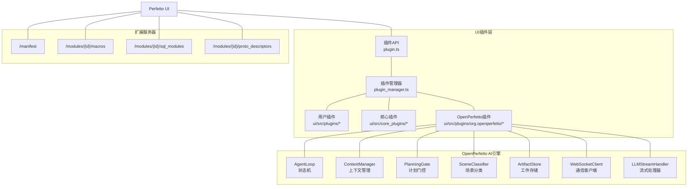
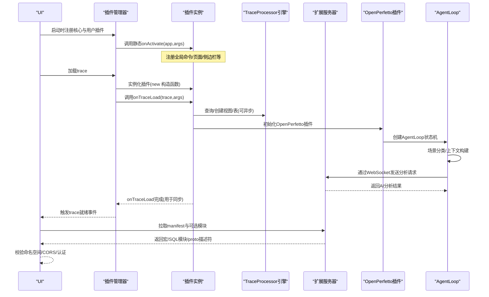
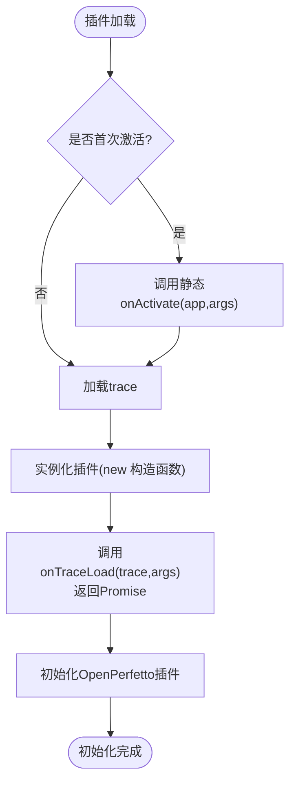
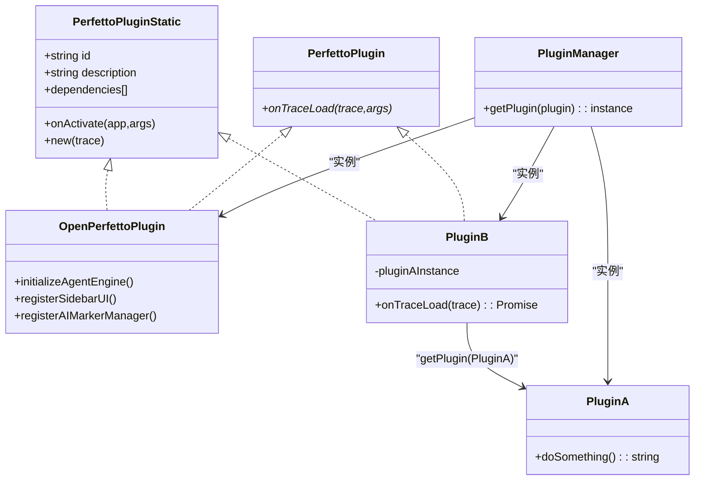
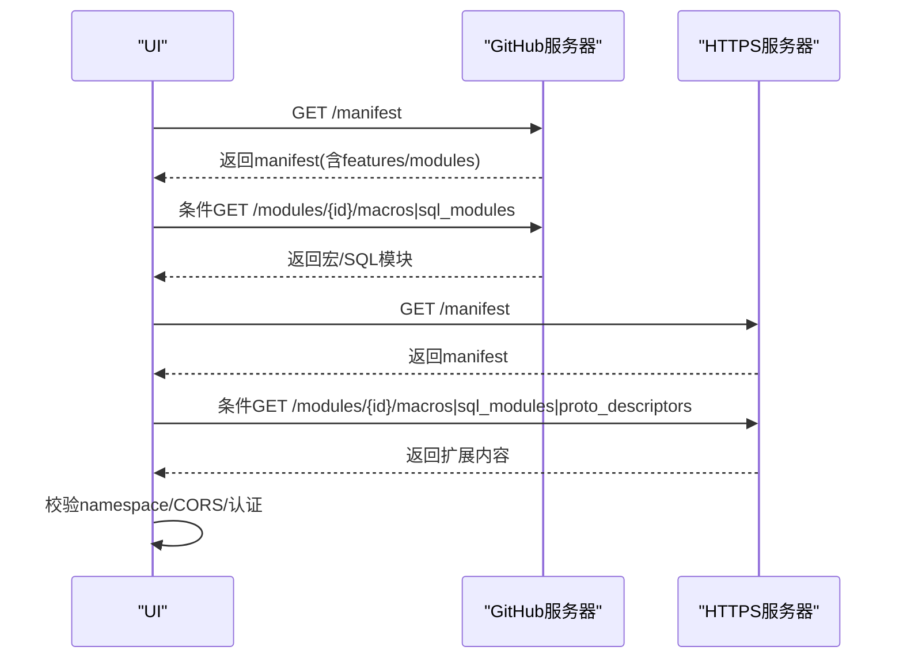
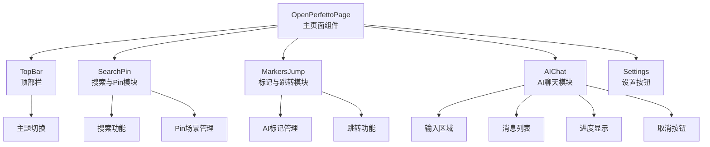
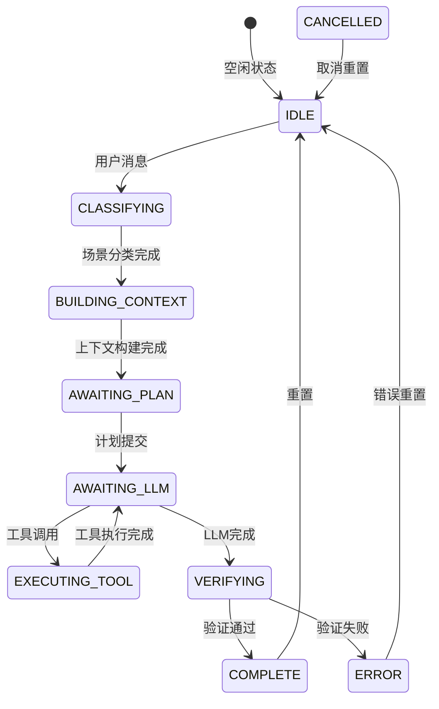
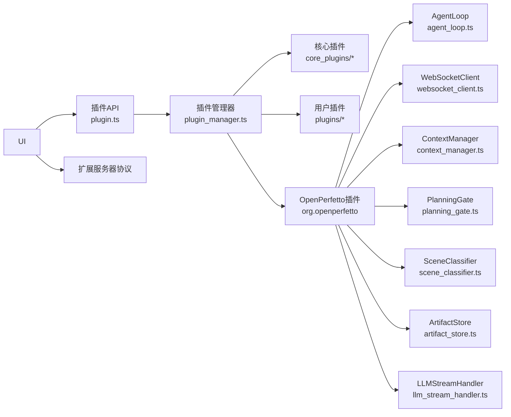

# UI插件系统

<cite>
**本文档引用的文件**   
- [ui-plugins.md](file://docs/contributing/ui-plugins.md)
- [extension-servers.md](file://docs/visualization/extension-servers.md)
- [extension-server-protocol.md](file://docs/visualization/extension-server-protocol.md)
- [extending-the-ui.md](file://docs/visualization/extending-the-ui.md)
- [plugin.ts](file://ui/src/public/plugin.ts)
- [plugin_manager.ts](file://ui/src/core/plugin_manager.ts)
- [AGENTS-ui.md](file://docs/AGENTS-ui.md)
- [index.ts](file://ui/src/plugins/org.openperfetto/index.ts)
- [openperfetto_page.ts](file://ui/src/plugins/org.openperfetto/sidebar/openperfetto_page.ts)
- [ai_chat.ts](file://ui/src/plugins/org.openperfetto/sidebar/ai_chat.ts)
- [agent_loop.ts](file://ui/src/plugins/org.openperfetto/agent/agent_loop.ts)
- [websocket_client.ts](file://ui/src/plugins/org.openperfetto/services/websocket_client.ts)
- [context_manager.ts](file://ui/src/plugins/org.openperfetto/agent/context_manager.ts)
- [planning_gate.ts](file://ui/src/plugins/org.openperfetto/agent/planning_gate.ts)
- [scene_classifier.ts](file://ui/src/plugins/org.openperfetto/agent/scene_classifier.ts)
- [artifact_store.ts](file://ui/src/plugins/org.openperfetto/agent/artifact_store.ts)
- [plugin_state.ts](file://ui/src/plugins/org.openperfetto/types/plugin_state.ts)
- [implementation-spec.md](file://docs/openperfetto/implementation-spec.md)
- [protocol.ts](file://server/src/types/protocol.ts)
</cite>

## 更新摘要
**所做更改**   
- 新增OpenPerfetto插件系统的完整架构说明
- 添加AI聊天界面和性能分析功能的技术实现细节
- 更新插件架构以包含新的Agent核心引擎
- 增加WebSocket通信协议和状态管理机制
- 扩展插件开发指南以涵盖AI增强功能
- 新增流式处理和Markdown渲染功能的详细说明
- 增强样式系统和主题支持的实现细节

## 目录
1. [引言](#引言)
2. [项目结构](#项目结构)
3. [核心组件](#核心组件)
4. [架构总览](#架构总览)
5. [组件详解](#组件详解)
6. [OpenPerfetto插件系统](#openperfetto插件系统)
7. [AI聊天界面实现](#ai聊天界面实现)
8. [Agent核心引擎](#agent核心引擎)
9. [WebSocket通信协议](#websocket通信协议)
10. [状态管理机制](#状态管理机制)
11. [样式系统增强](#样式系统增强)
12. [流式处理功能](#流式处理功能)
13. [依赖关系分析](#依赖关系分析)
14. [性能考量](#性能考量)
15. [故障排查指南](#故障排查指南)
16. [结论](#结论)
17. [附录](#附录)

## 引言
本文件面向希望在Perfetto UI中开发与集成插件的工程师，系统性阐述插件架构设计、注册机制、生命周期管理、依赖注入、接口定义、不同类型插件（轨迹插件、分析工具插件、可视化扩展插件）的实现要点、开发与调试流程、与主应用的通信方式（命令、选择、工作区、分析器引擎），以及扩展服务器协议（宏、SQL模块、proto描述符）的实现细节与安全注意事项。文档同时提供最佳实践、常见问题与排障建议，并给出可直接参考的官方文档路径。

**更新** 本版本新增了OpenPerfetto插件系统的完整实现，这是一个基于AI增强的Android性能trace分析工具，提供智能对话界面和自动化分析功能。系统包含新的AI聊天组件、改进的样式系统和增强的流式处理功能，显著提升了插件系统的AI分析能力和用户体验。

## 项目结构
Perfetto UI的插件体系由"插件API""插件管理器""核心插件""扩展服务器协议"和"OpenPerfetto AI插件"五部分组成：
- 插件API：定义插件静态类与实例接口、插件标识、可选依赖声明与生命周期钩子。
- 插件管理器：负责插件注册、实例化、依赖解析与跨插件访问。
- 核心插件：内置的系统级插件（如命令、示例、扩展服务器设置等），展示插件如何接入UI。
- OpenPerfetto插件：全新的AI增强插件，提供智能trace分析和聊天界面。
- 扩展服务器协议：HTTP(S)端点，提供宏、SQL模块与proto描述符，供UI按需加载。



**图表来源**
- [plugin.ts:1-46](file://ui/src/public/plugin.ts#L1-L46)
- [plugin_manager.ts:1-200](file://ui/src/core/plugin_manager.ts#L1-L200)
- [index.ts:1-184](file://ui/src/plugins/org.openperfetto/index.ts#L1-L184)
- [agent_loop.ts:1-932](file://ui/src/plugins/org.openperfetto/agent/agent_loop.ts#L1-L932)

**章节来源**
- [plugin.ts:1-46](file://ui/src/public/plugin.ts#L1-L46)
- [plugin_manager.ts:1-200](file://ui/src/core/plugin_manager.ts#L1-L200)
- [extension-servers.md:1-393](file://docs/visualization/extension-servers.md#L1-L393)
- [extension-server-protocol.md:1-278](file://docs/visualization/extension-server-protocol.md#L1-L278)
- [index.ts:1-184](file://ui/src/plugins/org.openperfetto/index.ts#L1-L184)

## 核心组件
- 插件接口与静态类
  - PerfettoPluginStatic：定义插件静态成员（id、description、dependencies、onActivate）、构造函数签名与路由参数。
  - PerfettoPlugin：定义实例生命周期钩子onTraceLoad（可异步）。
  - PluginManager：提供getPlugin以跨插件获取实例。
- 插件管理器
  - 负责注册插件、按依赖顺序实例化、在trace加载时触发onTraceLoad并等待其完成，确保插件间同步与一致性。
- 扩展服务器协议
  - 提供manifest、macros、sql_modules、proto_descriptors四个端点；支持命名空间校验、CORS与多种认证头；支持GitHub托管与HTTPS自建服务。

**章节来源**
- [plugin.ts:19-46](file://ui/src/public/plugin.ts#L19-L46)
- [plugin_manager.ts:1-200](file://ui/src/core/plugin_manager.ts#L1-L200)
- [extension-server-protocol.md:1-278](file://docs/visualization/extension-server-protocol.md#L1-L278)

## 架构总览
下图展示了从UI启动到插件激活、再到每次trace加载时的交互流程，以及扩展服务器的加载与校验机制。



**图表来源**
- [plugin_manager.ts:1-200](file://ui/src/core/plugin_manager.ts#L1-L200)
- [plugin.ts:19-46](file://ui/src/public/plugin.ts#L19-L46)
- [extension-server-protocol.md:1-278](file://docs/visualization/extension-server-protocol.md#L1-L278)
- [index.ts:88-158](file://ui/src/plugins/org.openperfetto/index.ts#L88-L158)
- [agent_loop.ts:295-344](file://ui/src/plugins/org.openperfetto/agent/agent_loop.ts#L295-L344)

## 组件详解

### 插件接口与生命周期
- 接口定义
  - 静态类：包含唯一id、可选description、可选dependencies数组、可选onActivate钩子。
  - 实例：包含可选的onTraceLoad钩子，返回Promise以保证初始化同步。
- 生命周期
  - onActivate：应用启动时调用一次，适合注册不依赖trace的全局扩展（命令、页面、侧边栏）。
  - onTraceLoad：每次trace加载时调用，适合注册与trace相关的扩展（轨迹、标签页、工作区布局）。
  - 建议：onActivate/onTraceLoad尽快完成；onTraceLoad中的异步操作必须await，确保UI能正确计时与同步。



**图表来源**
- [plugin.ts:19-46](file://ui/src/public/plugin.ts#L19-L46)
- [ui-plugins.md:100-180](file://docs/contributing/ui-plugins.md#L100-L180)
- [index.ts:88-158](file://ui/src/plugins/org.openperfetto/index.ts#L88-L158)

**章节来源**
- [plugin.ts:19-46](file://ui/src/public/plugin.ts#L19-L46)
- [ui-plugins.md:100-180](file://docs/contributing/ui-plugins.md#L100-L180)

### 插件注册与依赖注入
- 依赖声明
  - 在插件静态类上通过dependencies数组声明直接依赖的其他插件静态类。
- 依赖解析
  - 使用PluginManager.getPlugin获取已注册插件的实例，进行方法调用或数据共享。
- 典型场景
  - 插件A提供通用能力，插件B声明依赖A，在onTraceLoad中通过getPlugin获取A实例并复用其能力。



**图表来源**
- [plugin.ts:19-46](file://ui/src/public/plugin.ts#L19-L46)
- [plugin_manager.ts:150-170](file://ui/src/core/plugin_manager.ts#L150-L170)
- [ui-plugins.md:2100-2141](file://docs/contributing/ui-plugins.md#L2100-L2141)
- [index.ts:49-65](file://ui/src/plugins/org.openperfetto/index.ts#L49-L65)

**章节来源**
- [plugin.ts:19-46](file://ui/src/public/plugin.ts#L19-L46)
- [plugin_manager.ts:150-170](file://ui/src/core/plugin_manager.ts#L150-L170)
- [ui-plugins.md:2100-2141](file://docs/contributing/ui-plugins.md#L2100-L2141)

### 不同类型插件的实现要点
- 轨迹插件
  - 使用trace.tracks.registerTrack注册渲染器；结合createQuerySliceTrack或createQueryCounterTrack快速构建基于SQL的数据轨迹；通过TrackNode将轨迹挂载到当前工作区。
- 分析工具插件
  - 通过trace.engine.query执行SQL，使用schema定义列类型；结合Selection API控制UI选择状态；通过Commands API暴露快捷命令。
- 可视化扩展插件
  - 通过Workspaces API动态组织轨迹分组、固定与排序；利用TrackNodeArgs的sortOrder、collapsed、isSummary等属性优化布局体验。
- **AI增强插件**（新增）
  - 通过AgentLoop状态机管理AI分析流程；使用WebSocket与后端AI服务通信；通过ArtifactStore存储和压缩分析结果；实现智能场景分类和计划生成。

**章节来源**
- [ui-plugins.md:550-800](file://docs/contributing/ui-plugins.md#L550-L800)
- [agent_loop.ts:130-187](file://ui/src/plugins/org.openperfetto/agent/agent_loop.ts#L130-L187)
- [websocket_client.ts:38-69](file://ui/src/plugins/org.openperfetto/services/websocket_client.ts#L38-L69)

### 与主应用的通信机制
- 命令（Commands）
  - 通过app.commands或trace.commands.registerCommand注册；通过runCommand按id调用；注意命令id前缀规范与热键配置。
- 选择（Selection）
  - 通过trace.selection.selectTrackEvent/selectArea/selectTrack/selectSqlEvent/clearSelection统一控制UI选中状态与滚动行为。
- 工作区（Workspaces）
  - 通过trace.workspaces与trace.workspace管理多工作区；TrackNode用于组织轨迹树，支持pin/unpin、展开/折叠、查找与克隆。
- TraceProcessor引擎
  - 通过trace.engine.query执行SQL，使用schema约束列类型，避免JS数字精度丢失问题。
- **AI插件通信**（新增）
  - 通过WebSocketClient与AI后端服务建立实时通信；支持流式响应处理和工具调用；实现进度回调和状态同步。

**章节来源**
- [ui-plugins.md:550-800](file://docs/contributing/ui-plugins.md#L550-L800)
- [websocket_client.ts:145-159](file://ui/src/plugins/org.openperfetto/services/websocket_client.ts#L145-L159)

### 扩展服务器协议（宏/SQL模块/proto描述符）
- 端点与特性
  - /manifest：返回服务器元数据、命名空间、支持特性与模块列表。
  - /modules/{module_id}/macros：返回宏列表（命令序列）。
  - /modules/{module_id}/sql_modules：返回SQL模块（表/函数/视图定义）。
  - /modules/{module_id}/proto_descriptors：返回Base64编码的FileDescriptorSet。
- 命名空间与校验
  - 宏id与SQL模块名称必须以服务器namespace开头，UI会强制校验。
- CORS与认证
  - HTTPS服务器需设置CORS头；UI根据认证类型自动附加相应请求头；GitHub托管无需手动配置CORS。
- 模块化与加载时机
  - UI在启动时拉取manifest并按启用模块加载；变更服务器配置需刷新页面生效。



**图表来源**
- [extension-server-protocol.md:1-278](file://docs/visualization/extension-server-protocol.md#L1-L278)
- [extension-servers.md:1-393](file://docs/visualization/extension-servers.md#L1-L393)

**章节来源**
- [extension-server-protocol.md:1-278](file://docs/visualization/extension-server-protocol.md#L1-L278)
- [extension-servers.md:1-393](file://docs/visualization/extension-servers.md#L1-L393)

### 开发流程与调试
- 环境准备
  - 复制Skeleton插件模板至ui/src/plugins/<your-plugin-name>，按提示替换占位符。
  - 运行本地开发服务器，访问本地UI，进入插件页面启用目标插件并刷新生效。
- 调试与样式
  - 使用浏览器开发者工具观察日志；插件样式建议以pf-前缀避免冲突。
- 打包与贡献
  - 更新OWNERS文件并提交PR；核心维护者将进行评审。

**章节来源**
- [ui-plugins.md:28-120](file://docs/contributing/ui-plugins.md#L28-L120)

### 最佳实践
- 生命周期
  - 将耗时逻辑放入onTraceLoad并await；避免在插件主文件体中直接执行依赖核心初始化的逻辑。
- 命名规范
  - 插件id采用反域名前缀；命令id以<pluginId>#<action>形式；宏id与SQL模块名以namespace开头。
- 性能
  - 尽量减少trace加载时的阻塞；合理使用查询schema与bigint类型避免精度损失。
- 安全
  - HTTPS扩展服务器需正确配置CORS；敏感凭据通过受控认证头传递。
- **AI插件开发**（新增）
  - 使用AgentLoop状态机管理复杂AI流程；实现适当的错误处理和超时机制；优化WebSocket连接和重连策略。

**章节来源**
- [ui-plugins.md:150-220](file://docs/contributing/ui-plugins.md#L150-L220)
- [extension-server-protocol.md:150-190](file://docs/visualization/extension-server-protocol.md#L150-L190)
- [agent_loop.ts:749-772](file://ui/src/plugins/org.openperfetto/agent/agent_loop.ts#L749-L772)

## OpenPerfetto插件系统

### 插件架构概述
OpenPerfetto是一个基于AI增强的Android性能trace分析插件，提供智能对话界面和自动化分析功能。该插件完全遵循Perfetto插件系统标准接口，同时集成了复杂的AI分析引擎。

### 核心架构设计
- 插件注册与生命周期
  - 遵循标准Perfetto插件接口，实现onActivate和onTraceLoad钩子
  - 使用trace.mountStore管理插件状态，支持状态迁移和持久化
  - 通过trace.pages.registerPage注册独立页面，通过trace.sidebar.addMenuItem添加侧边栏入口

- 状态管理机制
  - 使用OpenPerfettoState接口管理全局状态
  - 支持版本迁移（CURRENT_STATE_VERSION = 2）
  - 集成ConnectionState管理WebSocket连接状态
  - 支持AnalysisSession跟踪分析会话

**章节来源**
- [index.ts:49-65](file://ui/src/plugins/org.openperfetto/index.ts#L49-L65)
- [plugin_state.ts:28-55](file://ui/src/plugins/org.openperfetto/types/plugin_state.ts#L28-L55)
- [implementation-spec.md:181-291](file://docs/openperfetto/implementation-spec.md#L181-L291)

## AI聊天界面实现

### 页面组件架构
OpenPerfettoPage是插件的主要UI组件，采用模块化设计，支持可折叠的子模块：



**图表来源**
- [openperfetto_page.ts:53-197](file://ui/src/plugins/org.openperfetto/sidebar/openperfetto_page.ts#L53-L197)
- [ai_chat.ts:47-450](file://ui/src/plugins/org.openperfetto/sidebar/ai_chat.ts#L47-L450)

### AI聊天组件功能
AIChat组件提供完整的聊天界面，支持：
- 消息列表渲染（用户/Assistant/Tool调用/Tool结果）
- 实时流式输出显示
- 输入框支持Shift+Enter换行，Enter发送
- 进度条和状态显示
- 取消分析功能

**章节来源**
- [openperfetto_page.ts:53-197](file://ui/src/plugins/org.openperfetto/sidebar/openperfetto_page.ts#L53-L197)
- [ai_chat.ts:47-450](file://ui/src/plugins/org.openperfetto/sidebar/ai_chat.ts#L47-L450)

## Agent核心引擎

### AgentLoop状态机
AgentLoop是OpenPerfetto的核心AI分析引擎，采用状态机模式管理复杂的分析流程：



**图表来源**
- [agent_loop.ts:34-55](file://ui/src/plugins/org.openperfetto/agent/agent_loop.ts#L34-L55)
- [agent_loop.ts:130-187](file://ui/src/plugins/org.openperfetto/agent/agent_loop.ts#L130-L187)

### 核心组件职责
- **ContextManager**：管理token预算、构建系统提示、压缩历史消息
- **PlanningGate**：强制AI提交分析计划，验证计划完整性
- **SceneClassifier**：通过关键词匹配和trace数据分析确定场景类型
- **ArtifactStore**：存储工具返回的大量数据，生成压缩摘要
- **AgentLoop**：协调整个AI分析流程的状态转换

**章节来源**
- [agent_loop.ts:130-187](file://ui/src/plugins/org.openperfetto/agent/agent_loop.ts#L130-L187)
- [context_manager.ts:48-179](file://ui/src/plugins/org.openperfetto/agent/context_manager.ts#L48-L179)
- [planning_gate.ts:30-122](file://ui/src/plugins/org.openperfetto/agent/planning_gate.ts#L30-L122)
- [scene_classifier.ts:37-212](file://ui/src/plugins/org.openperfetto/agent/scene_classifier.ts#L37-L212)
- [artifact_store.ts:34-100](file://ui/src/plugins/org.openperfetto/agent/artifact_store.ts#L34-L100)

## WebSocket通信协议

### 连接管理
WebSocketClient实现了一个完整的WebSocket客户端，支持：
- 单例模式管理
- 自动重连机制（指数退避：1s/2s/4s/8s/16s，最大30s）
- 心跳机制（每30秒发送ping）
- 连接状态管理
- 消息回调系统

### 消息格式
WebSocket消息采用统一格式：
```typescript
interface WebSocketMessage {
  type: string;           // 消息类型
  payload?: unknown;      // 消息载荷
  requestId?: string;     // 请求ID
}
```

### 进度回调机制
AgentLoop通过onProgress回调提供分析进度：
- 状态标签显示（空闲/场景分类中/构建上下文中等）
- 进度百分比计算
- 当前步骤信息
- 已用时间统计

**章节来源**
- [websocket_client.ts:38-69](file://ui/src/plugins/org.openperfetto/services/websocket_client.ts#L38-L69)
- [websocket_client.ts:145-159](file://ui/src/plugins/org.openperfetto/services/websocket_client.ts#L145-L159)
- [agent_loop.ts:87-89](file://ui/src/plugins/org.openperfetto/agent/agent_loop.ts#L87-L89)

## 状态管理机制

### 插件状态设计
OpenPerfettoState接口定义了完整的插件状态：
- **版本管理**：支持状态迁移和向后兼容
- **连接状态**：管理WebSocket连接状态
- **分析会话**：跟踪当前分析会话和消息历史
- **UI配置**：主题切换、语言设置
- **AI功能**：预置场景、搜索历史、AI标记

### 状态迁移策略
支持版本升级的迁移函数：
- 版本0 -> 1：添加searchHistory字段
- 版本1 -> 2：添加markers字段，移除sidebarExpanded
- 确保所有必需字段存在

### Store集成
使用trace.mountStore挂载状态：
- 替代props传递状态
- 所有组件通过Store读写状态
- 支持migrateState处理版本升级
- 使用trace.trash注册资源清理回调

**章节来源**
- [plugin_state.ts:197-291](file://ui/src/plugins/org.openperfetto/types/plugin_state.ts#L197-L291)
- [implementation-spec.md:255-261](file://docs/openperfetto/implementation-spec.md#L255-L261)

## 样式系统增强

### 主题系统
OpenPerfetto插件实现了完整的主题系统，支持明暗主题切换：
- **主题状态管理**：通过OpenPerfettoState.theme管理当前主题
- **动态样式类**：根据主题状态动态应用CSS类名
- **组件主题适配**：所有UI组件支持主题切换

### 模块化样式设计
- **模块化CSS类**：每个模块使用独立的CSS类前缀
- **折叠状态样式**：支持模块折叠/展开的视觉反馈
- **响应式布局**：适配不同屏幕尺寸和窗口大小

### 图标系统
- **Material Icons集成**：使用Material Icons库提供丰富的图标
- **角色图标区分**：用户消息、AI助手、系统消息、工具调用使用不同图标
- **状态图标反馈**：连接状态、处理状态使用相应的视觉图标

**章节来源**
- [openperfetto_page.ts:68-71](file://ui/src/plugins/org.openperfetto/sidebar/openperfetto_page.ts#L68-L71)
- [ai_chat.ts:226-241](file://ui/src/plugins/org.openperfetto/sidebar/ai_chat.ts#L226-L241)

## 流式处理功能

### 流式响应处理
AgentLoop实现了高效的流式响应处理机制：
- **防抖缓冲**：使用100ms防抖延迟合并小文本片段
- **增量渲染**：实时更新UI显示，提供流畅的阅读体验
- **内存优化**：及时清理流式缓冲区，避免内存泄漏

### Markdown渲染增强
AI聊天界面支持富文本渲染：
- **代码块支持**：```code```语法高亮显示
- **行内代码**：`code`语法行内代码显示
- **粗体斜体**：**bold**和*italic*语法支持
- **HTML转义**：防止XSS攻击的安全渲染

### 实时进度反馈
- **状态栏显示**：实时显示当前分析状态
- **进度指示器**：加载动画和进度条
- **取消功能**：用户可随时取消正在进行的分析

**章节来源**
- [agent_loop.ts:150-153](file://ui/src/plugins/org.openperfetto/agent/agent_loop.ts#L150-L153)
- [agent_loop.ts:787-797](file://ui/src/plugins/org.openperfetto/agent/agent_loop.ts#L787-L797)
- [ai_chat.ts:262-286](file://ui/src/plugins/org.openperfetto/sidebar/ai_chat.ts#L262-L286)

## 依赖关系分析
- 插件API与插件管理器
  - 插件API定义了插件静态类与实例接口；插件管理器负责注册、实例化与依赖解析。
- 插件与核心插件
  - 核心插件（如CoreCommands、ExtensionServers）示范了如何通过插件机制接入UI。
- 插件与扩展服务器
  - UI在启动阶段拉取扩展服务器清单与模块；宏/SQL模块在命令执行与查询编辑器中生效。
- **OpenPerfetto插件依赖**
  - AgentLoop依赖ContextManager、PlanningGate、SceneClassifier、ArtifactStore
  - WebSocketClient提供AI服务通信支持
  - Store管理插件状态和UI配置
  - LLMStreamHandler处理流式响应



**图表来源**
- [plugin.ts:19-46](file://ui/src/public/plugin.ts#L19-L46)
- [plugin_manager.ts:1-200](file://ui/src/core/plugin_manager.ts#L1-L200)
- [index.ts:16-28](file://ui/src/plugins/org.openperfetto/index.ts#L16-L28)
- [agent_loop.ts:24-29](file://ui/src/plugins/org.openperfetto/agent/agent_loop.ts#L24-L29)

**章节来源**
- [plugin.ts:19-46](file://ui/src/public/plugin.ts#L19-L46)
- [plugin_manager.ts:1-200](file://ui/src/core/plugin_manager.ts#L1-L200)
- [extension-servers.md:1-393](file://docs/visualization/extension-servers.md#L1-L393)
- [index.ts:16-28](file://ui/src/plugins/org.openperfetto/index.ts#L16-L28)

## 性能考量
- 初始化时间
  - onActivate/onTraceLoad应尽快完成；onTraceLoad中的异步任务需await，避免UI过早认为初始化完成。
- 数据查询
  - 使用schema明确列类型，优先使用LONG/BIGINT避免JS数字精度问题；对大结果集进行分页或限制。
- 渲染与布局
  - 合理使用Workspaces与TrackNode的排序与折叠属性，减少不必要的重绘与布局计算。
- **AI插件性能**（新增）
  - AgentLoop设置最大迭代次数（20次）和超时限制（5分钟）
  - 使用流式响应处理，避免长时间阻塞UI线程
  - 优化WebSocket连接和重连策略
  - 实现适当的错误处理和资源清理
  - Markdown渲染使用防抖机制减少DOM操作

**章节来源**
- [agent_loop.ts:159-162](file://ui/src/plugins/org.openperfetto/agent/agent_loop.ts#L159-L162)
- [agent_loop.ts:749-772](file://ui/src/plugins/org.openperfetto/agent/agent_loop.ts#L749-L772)
- [websocket_client.ts:46-49](file://ui/src/plugins/org.openperfetto/services/websocket_client.ts#L46-L49)

## 故障排查指南
- 扩展服务器加载失败
  - "无法获取URL"：检查网络连通性与CORS头；HTTPS必须满足CORS要求；GitHub托管无需CORS。
  - "返回状态码错误"：401/403检查认证；404检查端点路径；403检查SSO会话。
  - "JSON解析失败"：确认Content-Type为application/json且响应有效。
  - "无效响应"：对照协议参考修正字段与格式。
  - "模块未找到/命名空间不匹配"：核对manifest中的modules与宏/SQL模块命名是否符合namespace约定。
- 插件生命周期问题
  - onTraceLoad未等待异步导致UI计时异常：确保所有异步操作await后再resolve。
  - 插件依赖未解析：确认dependencies数组中引用的静态类已在注册表中。
- **AI插件问题**（新增）
  - "WebSocket连接失败"：检查AI服务地址配置和网络连通性
  - "分析超时"：检查AgentLoop超时设置（MAX_DURATION_MS = 300000ms）
  - "工具调用失败"：检查工具执行结果和错误信息
  - "状态同步问题"：确认Store状态更新和UI重绘
  - "流式渲染异常"：检查防抖缓冲和DOM更新逻辑

**章节来源**
- [extension-server-protocol.md:150-278](file://docs/visualization/extension-server-protocol.md#L150-L278)
- [extension-servers.md:312-393](file://docs/visualization/extension-servers.md#L312-L393)
- [ui-plugins.md:150-180](file://docs/contributing/ui-plugins.md#L150-L180)
- [agent_loop.ts:749-772](file://ui/src/plugins/org.openperfetto/agent/agent_loop.ts#L749-L772)
- [websocket_client.ts:222-236](file://ui/src/plugins/org.openperfetto/services/websocket_client.ts#L222-L236)

## 结论
Perfetto UI插件系统通过清晰的接口定义、严格的生命周期管理与强大的依赖注入机制，为开发者提供了深度定制UI的能力。配合扩展服务器协议，团队可以安全地共享宏与SQL模块。OpenPerfetto插件系统的引入进一步增强了AI分析能力，通过AgentLoop状态机、WebSocket通信和智能上下文管理，实现了从trace数据到AI分析结果的完整自动化流程。新增的流式处理功能、改进的样式系统和增强的Markdown渲染功能显著提升了用户体验。遵循本文的最佳实践与排障建议，可显著提升插件开发效率与运行稳定性。

## 附录
- 快速参考
  - 插件接口与生命周期：[plugin.ts:19-46](file://ui/src/public/plugin.ts#L19-L46)
  - 插件管理器与依赖注入：[plugin_manager.ts:150-170](file://ui/src/core/plugin_manager.ts#L150-L170)
  - 插件开发指南与示例：[ui-plugins.md:28-120](file://docs/contributing/ui-plugins.md#L28-L120)
  - 扩展服务器协议与设置：[extension-server-protocol.md:1-278](file://docs/visualization/extension-server-protocol.md#L1-L278)、[extension-servers.md:1-393](file://docs/visualization/extension-servers.md#L1-L393)
  - UI扩展总览与选型：[extending-the-ui.md:1-115](file://docs/visualization/extending-the-ui.md#L1-L115)
  - AGENTS中的插件架构说明：[AGENTS-ui.md:69-105](file://docs/AGENTS-ui.md#L69-L105)
  - **OpenPerfetto实现规格**：[implementation-spec.md:1-800](file://docs/openperfetto/implementation-spec.md#L1-L800)
  - **OpenPerfetto插件入口**：[index.ts:49-158](file://ui/src/plugins/org.openperfetto/index.ts#L49-L158)
  - **AI聊天组件**：[ai_chat.ts:47-450](file://ui/src/plugins/org.openperfetto/sidebar/ai_chat.ts#L47-L450)
  - **AgentLoop状态机**：[agent_loop.ts:130-932](file://ui/src/plugins/org.openperfetto/agent/agent_loop.ts#L130-L932)
  - **WebSocket通信协议**：[websocket_client.ts:1-263](file://ui/src/plugins/org.openperfetto/services/websocket_client.ts#L1-L263)
  - **样式系统增强**：[openperfetto_page.ts:1-198](file://ui/src/plugins/org.openperfetto/sidebar/openperfetto_page.ts#L1-L198)
  - **流式处理功能**：[protocol.ts:1-140](file://server/src/types/protocol.ts#L1-L140)