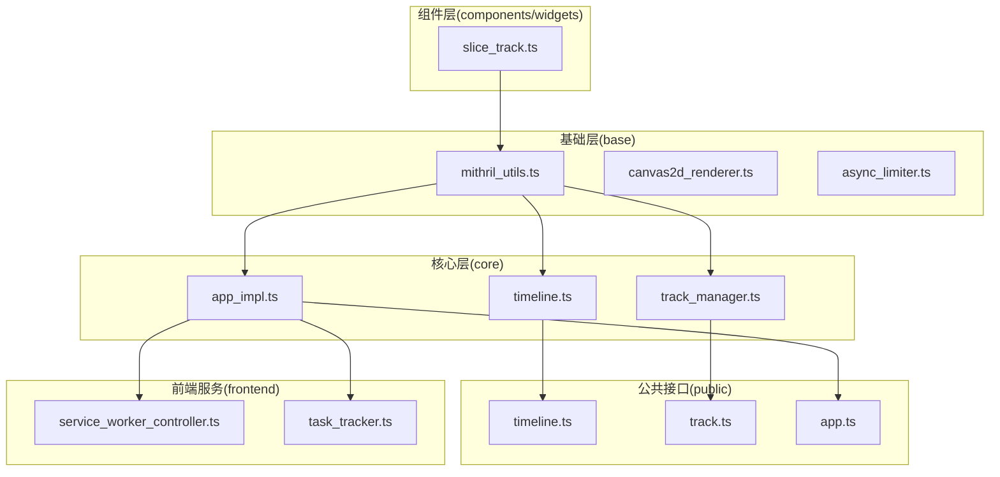
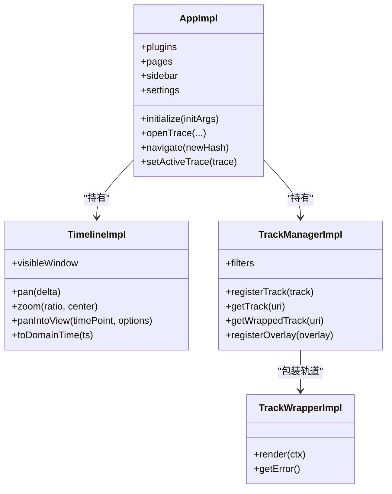
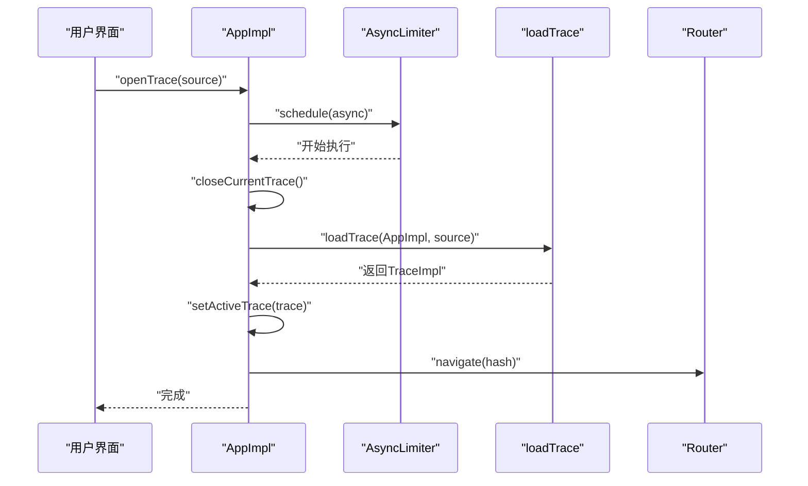
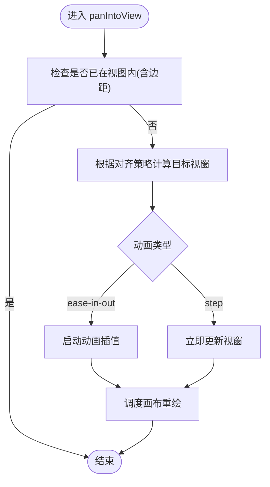
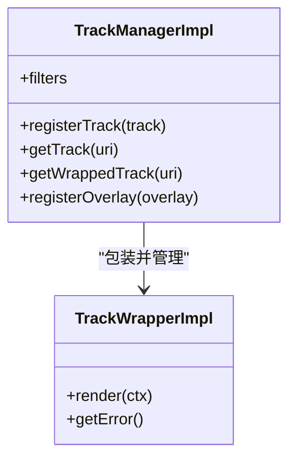
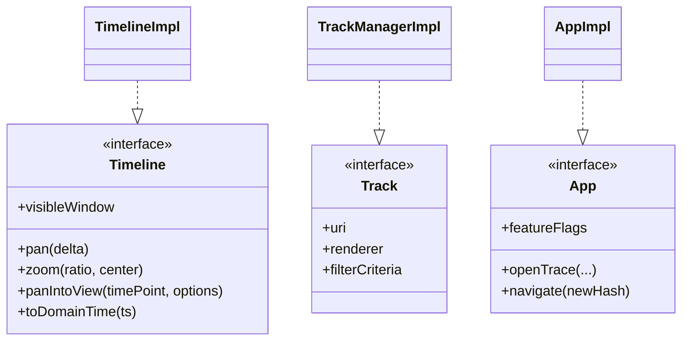
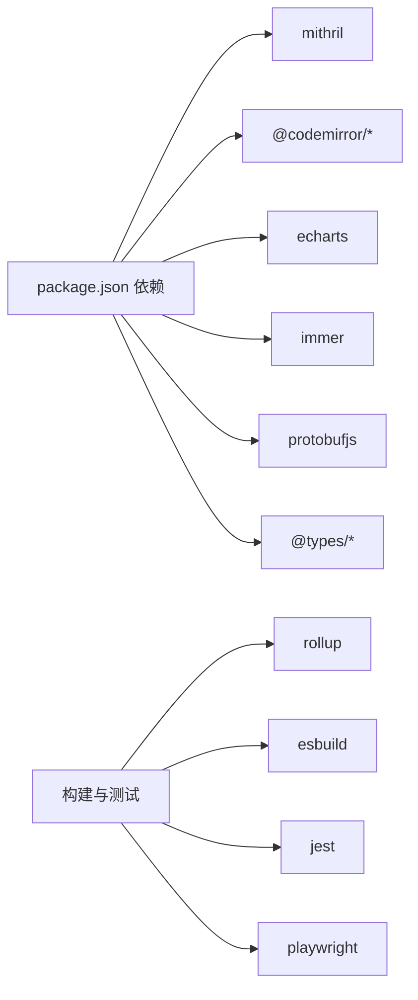

# UI架构设计

<cite>
**本文引用的文件**
- [ui/src/core/app_impl.ts](file://ui/src/core/app_impl.ts)
- [ui/src/core/timeline.ts](file://ui/src/core/timeline.ts)
- [ui/src/core/track_manager.ts](file://ui/src/core/track_manager.ts)
- [ui/src/base/mithril_utils.ts](file://ui/src/base/mithril_utils.ts)
- [ui/src/components/tracks/slice_track.ts](file://ui/src/components/tracks/slice_track.ts)
- [ui/src/public/timeline.ts](file://ui/src/public/timeline.ts)
- [ui/src/public/track.ts](file://ui/src/public/track.ts)
- [ui/src/public/app.ts](file://ui/src/public/app.ts)
- [ui/src/frontend/service_worker_controller.ts](file://ui/src/frontend/service_worker_controller.ts)
- [ui/src/frontend/task_tracker/task_tracker.ts](file://ui/src/frontend/task_tracker/task_tracker.ts)
- [ui/package.json](file://ui/package.json)
</cite>

## 目录
1. [引言](#引言)
2. [项目结构](#项目结构)
3. [核心组件](#核心组件)
4. [架构总览](#架构总览)
5. [详细组件分析](#详细组件分析)
6. [依赖分析](#依赖分析)
7. [性能考量](#性能考量)
8. [故障排查指南](#故障排查指南)
9. [结论](#结论)
10. [附录](#附录)

## 引言
本文件面向Perfetto Web界面的前端架构设计，聚焦于基于Mithril.js的轻量级前端框架体系，系统阐述组件系统设计、状态管理模式与数据流架构；重点解析核心模块如app_impl.ts、timeline.ts、track_manager.ts等的职责与交互关系；说明TypeScript类型系统在UI中的应用（接口定义、类型安全与编译时检查）；总结模块化设计原则（可复用组件、插件架构与扩展机制），并给出架构决策的技术背景与高性能前端渲染实现方式，最后提供代码组织结构、命名约定与开发最佳实践。

## 项目结构
Perfetto Web前端位于ui/src目录下，采用按功能域分层的组织方式：
- base：通用工具与基础设施（时间、异步控制、渲染抽象等）
- core：应用核心状态与业务逻辑（应用实例、时间轴、轨道管理、路由、设置、插件等）
- public：对外暴露的公共接口与类型定义（Timeline、Track、App等）
- frontend：前端运行时服务（Service Worker、任务跟踪器等）
- components/widgets：可复用UI组件与可视化控件
- plugins：插件系统与扩展点
- assets：样式与静态资源
- 入口与构建：通过package.json与build.js进行打包与测试

**图表来源**
- [ui/src/base/mithril_utils.ts](file://ui/src/base/mithril_utils.ts)
- [ui/src/core/app_impl.ts](file://ui/src/core/app_impl.ts)
- [ui/src/core/timeline.ts](file://ui/src/core/timeline.ts)
- [ui/src/core/track_manager.ts](file://ui/src/core/track_manager.ts)
- [ui/src/public/timeline.ts](file://ui/src/public/timeline.ts)
- [ui/src/public/track.ts](file://ui/src/public/track.ts)
- [ui/src/public/app.ts](file://ui/src/public/app.ts)
- [ui/src/frontend/service_worker_controller.ts](file://ui/src/frontend/service_worker_controller.ts)
- [ui/src/frontend/task_tracker/task_tracker.ts](file://ui/src/frontend/task_tracker/task_tracker.ts)
- [ui/src/components/tracks/slice_track.ts](file://ui/src/components/tracks/slice_track.ts)

**章节来源**
- [ui/src/core/app_impl.ts](file://ui/src/core/app_impl.ts)
- [ui/src/core/timeline.ts](file://ui/src/core/timeline.ts)
- [ui/src/core/track_manager.ts](file://ui/src/core/track_manager.ts)
- [ui/src/base/mithril_utils.ts](file://ui/src/base/mithril_utils.ts)
- [ui/src/components/tracks/slice_track.ts](file://ui/src/components/tracks/slice_track.ts)
- [ui/src/public/timeline.ts](file://ui/src/public/timeline.ts)
- [ui/src/public/track.ts](file://ui/src/public/track.ts)
- [ui/src/public/app.ts](file://ui/src/public/app.ts)
- [ui/src/frontend/service_worker_controller.ts](file://ui/src/frontend/service_worker_controller.ts)
- [ui/src/frontend/task_tracker/task_tracker.ts](file://ui/src/frontend/task_tracker/task_tracker.ts)

## 核心组件
- 应用单例与全局状态：AppImpl负责应用生命周期、路由、设置、插件、分析、服务工作线程、任务跟踪等全局能力，并协调Trace加载与切换。
- 时间轴状态：TimelineImpl封装可见窗口、悬停光标、高亮切片、缩放平移、动画过渡与时间轴原点计算等。
- 轨道管理：TrackManagerImpl注册、查找、包装轨道，提供过滤条件与覆盖层支持，保证渲染错误隔离与稳定输出。
- Mithril集成：通过mithril_utils.ts统一引入Mithril，确保组件声明与渲染的一致性。
- 插件与扩展：通过插件管理器注入SQL包、Protobuf描述符与命令宏，实现UI扩展能力。
- 前端服务：ServiceWorkerController与TaskTracker提供离线与任务监控能力。

**章节来源**
- [ui/src/core/app_impl.ts](file://ui/src/core/app_impl.ts)
- [ui/src/core/timeline.ts](file://ui/src/core/timeline.ts)
- [ui/src/core/track_manager.ts](file://ui/src/core/track_manager.ts)
- [ui/src/base/mithril_utils.ts](file://ui/src/base/mithril_utils.ts)
- [ui/src/frontend/service_worker_controller.ts](file://ui/src/frontend/service_worker_controller.ts)
- [ui/src/frontend/task_tracker/task_tracker.ts](file://ui/src/frontend/task_tracker/task_tracker.ts)

## 架构总览
Perfetto Web前端采用“核心状态+公共接口+组件渲染”的分层架构：
- 核心状态由AppImpl与TimelineImpl提供，贯穿整个应用生命周期与轨迹展示。
- 公共接口（public/*）定义了跨模块契约（如Timeline、Track、App），确保低耦合与高内聚。
- 组件层通过Mithril进行声明式渲染，结合TrackManager与渲染上下文完成可视化输出。
- 插件系统通过异步注入扩展引擎能力与UI行为，保持主干简洁与可扩展性。

**图表来源**
- [ui/src/core/app_impl.ts](file://ui/src/core/app_impl.ts)
- [ui/src/core/timeline.ts](file://ui/src/core/timeline.ts)
- [ui/src/core/track_manager.ts](file://ui/src/core/track_manager.ts)

**章节来源**
- [ui/src/core/app_impl.ts](file://ui/src/core/app_impl.ts)
- [ui/src/core/timeline.ts](file://ui/src/core/timeline.ts)
- [ui/src/core/track_manager.ts](file://ui/src/core/track_manager.ts)

## 详细组件分析

### AppImpl：应用单例与全局状态
职责与交互要点：
- 单例模式：initialize创建唯一实例，供全局访问。
- Trace生命周期：openTrace系列方法统一调度，使用AsyncLimiter避免并发加载冲突；loadTrace完成后设置当前Trace并触发重绘。
- 管理器聚合：集中管理插件、页面、侧边栏、命令、分析、服务工作线程、任务跟踪等。
- 扩展注入：sqlPackages、protoDescriptors、macros通过Promise收集后合并，供引擎与UI使用。
- 导航与嵌入：通过Router与嵌入模式开关控制页面行为。

**图表来源**
- [ui/src/core/app_impl.ts](file://ui/src/core/app_impl.ts)

**章节来源**
- [ui/src/core/app_impl.ts](file://ui/src/core/app_impl.ts)

### TimelineImpl：时间轴状态与动画
职责与交互要点：
- 可见窗口：HighPrecisionTimeSpan维护起止与持续时间，提供clamp与fitWithin约束。
- 缩放与平移：pan/zoom基于时间轴变换，限制最小持续时间，防止过度放大。
- 视图对齐：panIntoView/panSpanIntoView支持居中、最近对齐与缩放对齐，带边距与动画选项。
- 动画系统：ease-in-out插值，spam检测避免频繁请求导致抖动。
- 时间轴原点：根据TimestampFormat与自定义时区计算时间轴起点，支撑多种时间显示格式。

**图表来源**
- [ui/src/core/timeline.ts](file://ui/src/core/timeline.ts)

**章节来源**
- [ui/src/core/timeline.ts](file://ui/src/core/timeline.ts)

### TrackManagerImpl：轨道注册与渲染包装
职责与交互要点：
- 注册与查找：通过Registry按URI注册TrackWrapperImpl，提供getTrack/getWrappedTrack。
- 过滤与筛选：支持名称过滤与多条件过滤，配合criteriaFilters与predicate。
- 错误隔离：TrackWrapperImpl捕获渲染异常，后续渲染成为no-op，避免崩溃传播。
- 覆盖层：registerOverlay提供UI叠加层能力，便于高亮或提示信息。

**图表来源**
- [ui/src/core/track_manager.ts](file://ui/src/core/track_manager.ts)

**章节来源**
- [ui/src/core/track_manager.ts](file://ui/src/core/track_manager.ts)

### Mithril集成与组件渲染
- 统一导入：通过mithril_utils.ts集中引入Mithril，确保组件声明风格一致。
- 组件示例：slice_track.ts等组件以Mithril进行声明式渲染，结合TrackManager与渲染上下文绘制可视化元素。
- 渲染抽象：canvas2d_renderer.ts等基础渲染工具为组件提供底层绘制能力。

**章节来源**
- [ui/src/base/mithril_utils.ts](file://ui/src/base/mithril_utils.ts)
- [ui/src/components/tracks/slice_track.ts](file://ui/src/components/tracks/slice_track.ts)

### 公共接口与类型系统
- Timeline接口：定义可见窗口、时间转换、格式设置等契约，TimelineImpl实现该接口。
- Track接口：定义轨道描述、渲染器与过滤条件，TrackManagerImpl围绕该接口组织轨道生态。
- App接口：定义应用能力边界，AppImpl实现该接口并与核心模块协作。

**图表来源**
- [ui/src/public/timeline.ts](file://ui/src/public/timeline.ts)
- [ui/src/public/track.ts](file://ui/src/public/track.ts)
- [ui/src/public/app.ts](file://ui/src/public/app.ts)
- [ui/src/core/timeline.ts](file://ui/src/core/timeline.ts)
- [ui/src/core/track_manager.ts](file://ui/src/core/track_manager.ts)
- [ui/src/core/app_impl.ts](file://ui/src/core/app_impl.ts)

**章节来源**
- [ui/src/public/timeline.ts](file://ui/src/public/timeline.ts)
- [ui/src/public/track.ts](file://ui/src/public/track.ts)
- [ui/src/public/app.ts](file://ui/src/public/app.ts)

## 依赖分析
- 框架与库：Mithril 2.x作为核心视图框架，@types/mithril提供类型支持；ECharts用于图表；CodeMirror用于SQL编辑；Immer用于不可变更新；ProtobufJS用于协议处理。
- 构建与测试：Rollup、ESBuild、Jest、Playwright等工具链支撑构建、打包与测试。
- 前端服务：ServiceWorkerController与TaskTracker提供离线与任务监控能力，增强用户体验与可观测性。

**图表来源**
- [ui/package.json](file://ui/package.json)

**章节来源**
- [ui/package.json](file://ui/package.json)

## 性能考量
- 渲染调度：通过RAF调度与Canvas重绘，避免频繁DOM操作，降低主线程压力。
- 动画优化：ease-in-out插值与spam检测，减少动画抖动与重排开销。
- 并发控制：AsyncLimiter确保轨迹加载串行化，避免注册表状态竞争与内存峰值。
- 错误隔离：TrackWrapper捕获渲染异常，防止单个轨道崩溃影响整体UI。
- 类型安全：严格的接口与类型定义在编译期发现潜在问题，减少运行时错误与调试成本。
- 资源管理：ServiceWorker与任务跟踪提升离线可用性与性能可观测性。

## 故障排查指南
- 轨道渲染异常：若某轨道导致UI卡顿或崩溃，检查TrackWrapperImpl的错误缓存与日志输出，定位具体轨道URI并隔离修复。
- 时间轴跳变：确认panIntoView/zoom参数与最小持续时间限制，避免超出trace边界。
- 并发加载冲突：确认AsyncLimiter是否正确包裹openTrace流程，避免多实例同时初始化。
- 插件注入失败：核对sqlPackages、protoDescriptors、macros的Promise收集与合并逻辑，确保在Trace加载前完成解析。
- Service Worker与任务跟踪：检查ServiceWorkerController与TaskTracker的状态与事件回调，确保离线与监控功能正常。

**章节来源**
- [ui/src/core/track_manager.ts](file://ui/src/core/track_manager.ts)
- [ui/src/core/timeline.ts](file://ui/src/core/timeline.ts)
- [ui/src/core/app_impl.ts](file://ui/src/core/app_impl.ts)
- [ui/src/frontend/service_worker_controller.ts](file://ui/src/frontend/service_worker_controller.ts)
- [ui/src/frontend/task_tracker/task_tracker.ts](file://ui/src/frontend/task_tracker/task_tracker.ts)

## 结论
Perfetto Web前端以Mithril.js为核心，结合清晰的分层架构与严格的类型系统，实现了高性能、可扩展且稳定的轨迹可视化界面。AppImpl、TimelineImpl与TrackManagerImpl构成三大支柱，分别承担应用状态、时间轴控制与轨道管理职责；公共接口确保模块间低耦合；插件系统与扩展机制保障了功能演进的灵活性。通过RAF调度、动画优化、并发控制与错误隔离等手段，系统在复杂Trace场景下仍能保持流畅体验。

## 附录
- 代码组织结构建议：按功能域划分目录（base/core/public/frontend/components/plugins/assets），遵循单一职责与高内聚原则。
- 命名约定：类名使用帕斯卡命名，方法与变量使用驼峰命名；接口以大写I前缀或抽象名词表示。
- 开发最佳实践：优先使用不可变更新（如Immer）、严格类型检查（TypeScript）、单元测试与端到端测试（Jest/Playwright）相结合；对关键路径进行性能基准测试与回归验证。