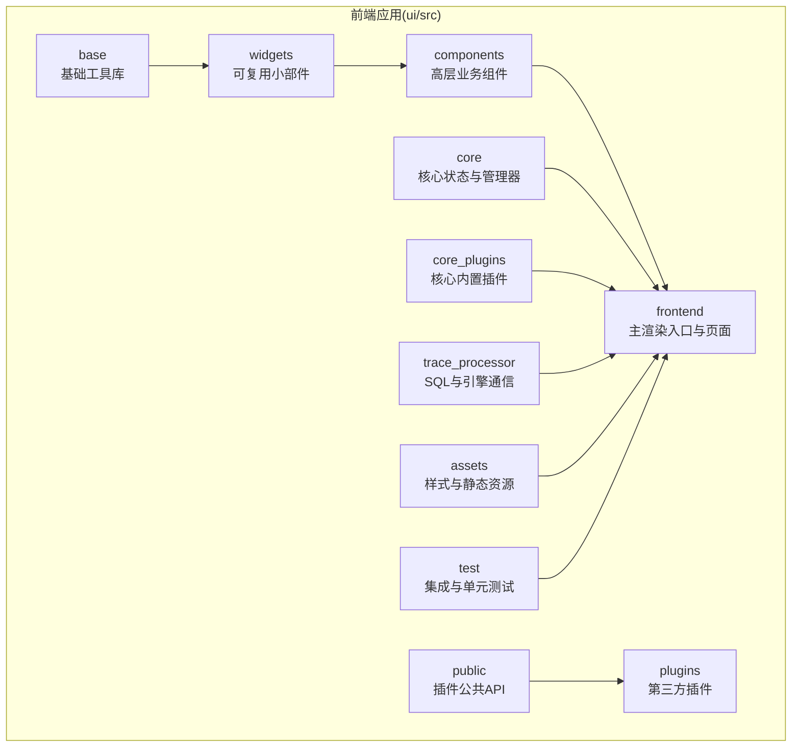
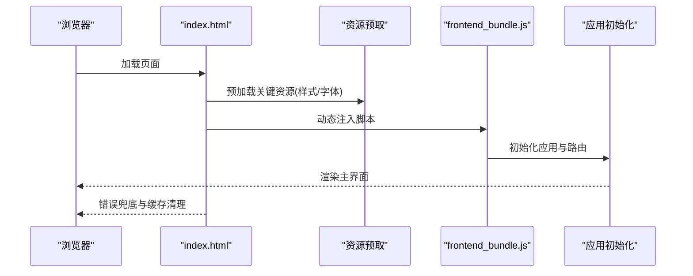
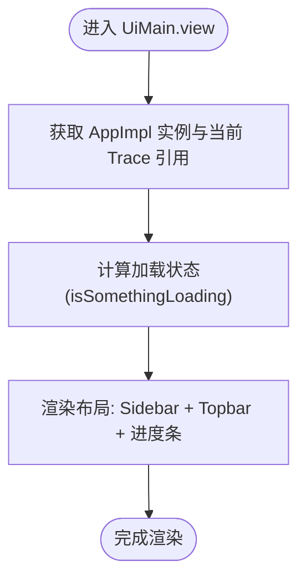
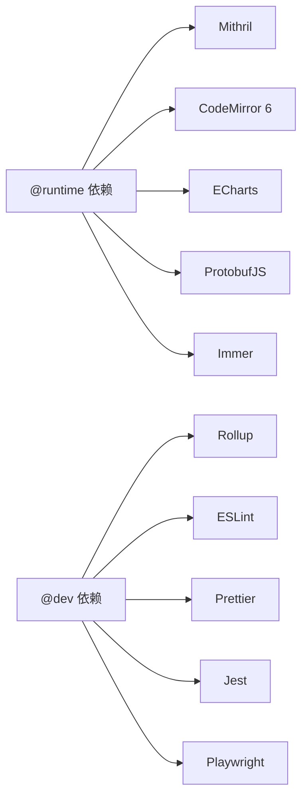

# Web界面和可视化

<cite>
**本文引用的文件**
- [ui/package.json](file://ui/package.json)
- [ui/tsconfig.json](file://ui/tsconfig.json)
- [ui/src/assets/index.html](file://ui/src/assets/index.html)
- [docs/AGENTS-ui.md](file://docs/AGENTS-ui.md)
- [docs/contributing/ui-getting-started.md](file://docs/contributing/ui-getting-started.md)
- [ui/src/frontend/ui_main.ts](file://ui/src/frontend/ui_main.ts)
</cite>

## 目录
1. [简介](#简介)
2. [项目结构](#项目结构)
3. [核心组件](#核心组件)
4. [架构总览](#架构总览)
5. [详细组件分析](#详细组件分析)
6. [依赖分析](#依赖分析)
7. [性能考虑](#性能考虑)
8. [故障排查指南](#故障排查指南)
9. [结论](#结论)
10. [附录](#附录)

## 简介
本文件面向Perfetto Web界面与可视化系统的开发者与使用者，系统性阐述基于TypeScript的前端架构、组件体系、状态管理与用户交互模式；详解时间轴可视化（轨迹显示、缩放导航、注释标记）、交互式分析（查询面板、结果表格、图表展示）以及UI插件扩展能力；并覆盖响应式设计、跨浏览器兼容、与后端服务的通信机制（含WebSocket）、主题定制、国际化与无障碍访问等工程实践。

## 项目结构
Perfetto UI采用单页应用（SPA）架构，使用Mithril框架进行渲染，核心代码位于ui/src目录，按职责划分为基础库、小部件、组件、核心逻辑、公共API、插件、前端入口、TraceProcessor引擎层、测试与资源资产等模块。整体结构遵循“分层清晰、职责分离”的原则，便于扩展与维护。

图示来源
- [docs/AGENTS-ui.md:13-29](file://docs/AGENTS-ui.md#L13-L29)

章节来源
- [docs/AGENTS-ui.md:13-29](file://docs/AGENTS-ui.md#L13-L29)

## 核心组件
- 渲染框架：Mithril类组件作为UI构建单元，通过view方法返回虚拟DOM树，实现高效、简洁的声明式渲染。
- 组件系统：widgets提供按钮、菜单、弹窗、表单控件、数据网格、标签页、加载指示器等通用UI；components提供聚合面板、查询表格等更高层的业务组件。
- 状态管理：全局状态集中于State类，通过动作（actions）进行变更，确保状态可预测与可追踪；非序列化状态放入NonSerializableState以避免JSON序列化限制。
- 资源与样式：统一使用SCSS，遵循命名规范（pf-前缀），并通过主题变量实现主题定制与一致性。

章节来源
- [docs/contributing/ui-getting-started.md:94-121](file://docs/contributing/ui-getting-started.md#L94-L121)
- [docs/AGENTS-ui.md:158-172](file://docs/AGENTS-ui.md#L158-L172)
- [docs/AGENTS-ui.md:305-340](file://docs/AGENTS-ui.md#L305-L340)

## 架构总览
下图展示了从页面加载到应用启动、资源预取、脚本加载与错误处理的整体流程，体现前端的健壮性与性能优化策略。

图示来源
- [ui/src/assets/index.html:103-142](file://ui/src/assets/index.html#L103-L142)

章节来源
- [ui/src/assets/index.html:103-142](file://ui/src/assets/index.html#L103-L142)

## 详细组件分析

### 主界面与生命周期
UiMain作为应用主容器，负责根据当前Trace动态更新标题、渲染侧边栏与顶部栏，并在加载过程中显示进度条。其视图会根据应用状态（如是否正在加载Trace、Trace引擎请求挂起数、任务跟踪器）决定进度条的显示状态。

图示来源
- [ui/src/frontend/ui_main.ts:38-68](file://ui/src/frontend/ui_main.ts#L38-L68)

章节来源
- [ui/src/frontend/ui_main.ts:38-68](file://ui/src/frontend/ui_main.ts#L38-L68)

### 时间轴可视化与交互
- 轨迹显示：通过组件系统组合实现多轨道事件展示，支持进程/线程、CPU调度、GPU、内存等多维度轨迹。
- 缩放导航：提供时间轴缩放与平移，结合最小时间轴（Minimap）辅助快速定位与跳转。
- 注释标记：允许用户在时间轴上添加注释，便于标注关键事件或分析节点。
- 响应式与跨浏览器：通过SCSS媒体查询与CSS Grid/Flexbox实现响应式布局；TypeScript编译目标与polyfill策略保障主流浏览器兼容。

章节来源
- [docs/AGENTS-ui.md:158-172](file://docs/AGENTS-ui.md#L158-L172)

### 交互式分析工具
- 查询面板：基于CodeMirror 6提供语法高亮、自动补全、搜索与Lint能力，支持Perfetto SQL编辑与执行。
- 结果表格：数据网格组件支持排序、筛选、分页与列宽调整，适配大数据量场景。
- 图表展示：集成ECharts实现折线图、柱状图、热力图等可视化，支持与时间轴联动选择与钻取。

章节来源
- [ui/package.json:10-50](file://ui/package.json#L10-L50)
- [ui/package.json:36](file://ui/package.json#L36)

### UI插件开发指南
- 公共API：通过public导出插件可用的接口与类型，确保插件与宿主应用的契约稳定。
- 插件注册：在core_plugins中实现核心插件，在plugins中扩展第三方插件；插件通过公共API接入UI组件、状态与引擎。
- 生命周期：插件需遵循初始化、激活、销毁的生命周期，避免内存泄漏与状态污染。
- 最佳实践：优先使用现有widgets与components，避免重复造轮子；严格遵守样式与主题规范，确保一致的用户体验。

章节来源
- [docs/AGENTS-ui.md:13-29](file://docs/AGENTS-ui.md#L13-L29)

### 与后端服务通信机制
- WebSocket：用于实时数据流推送（如Trace增量更新、引擎状态变化），客户端通过连接池与重连策略保证稳定性。
- 数据传输：采用Protobuf序列化协议，结合压缩（如gzip/pako）提升传输效率；前端通过trace_processor层封装SQL查询与结果解析。
- 实时更新：结合任务跟踪器与状态订阅，实现UI与后端数据的双向同步与局部刷新。

章节来源
- [docs/visualization/extension-server-protocol.md](file://docs/visualization/extension-server-protocol.md)
- [ui/package.json:46-47](file://ui/package.json#L46-L47)

### 主题定制、国际化与无障碍访问
- 主题定制：通过SCSS主题变量与CSS自定义属性实现明暗主题切换；组件样式统一使用pf-前缀，避免冲突。
- 国际化：字符串资源集中管理，配合运行时语言切换；组件文本与ARIA标签保持本地化一致性。
- 无障碍访问：遵循WCAG标准，提供键盘导航、焦点管理、语义化标签与屏幕阅读器友好提示。

章节来源
- [docs/AGENTS-ui.md:305-340](file://docs/AGENTS-ui.md#L305-L340)

## 依赖分析
前端依赖主要分为运行时库（Mithril、CodeMirror、ECharts、ProtobufJS、Immer等）与开发工具链（Rollup、ESLint、Prettier、Jest、Playwright等）。TypeScript配置限定lib与输出目标，确保在现代浏览器中具备良好兼容性。

图示来源
- [ui/package.json:9-50](file://ui/package.json#L9-L50)
- [ui/tsconfig.json:12-23](file://ui/tsconfig.json#L12-L23)

章节来源
- [ui/package.json:9-50](file://ui/package.json#L9-L50)
- [ui/tsconfig.json:12-23](file://ui/tsconfig.json#L12-L23)

## 性能考虑
- 资源预取：在页面早期预加载关键样式与字体，减少首次绘制延迟。
- 懒加载与条件渲染：对重型组件采用Gate进行条件渲染与状态保留，避免不必要的重渲染。
- 状态不可变：使用Immer等库在不破坏不可变性前提下简化状态更新，降低复杂度与Bug风险。
- 打包与压缩：通过Rollup与Uglify进行代码分割与混淆，结合gzip压缩减小体积。
- 浏览器兼容：合理设置lib与目标环境，必要时引入polyfill，确保在旧版本浏览器中可用。

章节来源
- [ui/src/assets/index.html:118-135](file://ui/src/assets/index.html#L118-L135)
- [docs/AGENTS-ui.md:150-156](file://docs/AGENTS-ui.md#L150-L156)

## 故障排查指南
- 页面长时间无响应：检查网络状况与缓存，尝试强制刷新与清除缓存；若问题持续，查看控制台错误信息与调试区域。
- 应用启动失败：确认frontend_bundle.js加载成功，检查版本映射与CDN路径；利用错误兜底页面收集LocalStorage与调试信息。
- 插件异常：核对插件生命周期与公共API契约，避免在销毁阶段仍写入状态；逐步禁用插件定位问题。

章节来源
- [ui/src/assets/index.html:103-142](file://ui/src/assets/index.html#L103-L142)

## 结论
Perfetto Web界面以Mithril为核心、以组件化与状态管理为基础，结合丰富的可视化与交互工具，提供了强大的Trace分析体验。通过严格的目录结构、样式规范与工程化工具链，系统在可维护性、性能与可扩展性方面均达到较高水准。建议在二次开发中遵循既有模式与最佳实践，确保与核心生态的一致性。

## 附录
- 快速开始：参考UI开发入门文档，了解Mithril组件与状态管理的基本用法。
- 目录结构：参考UI开发文档，明确各模块职责与扩展点。
- 构建与测试：使用提供的脚本进行构建、单元测试与集成测试，确保改动质量。

章节来源
- [docs/contributing/ui-getting-started.md:94-121](file://docs/contributing/ui-getting-started.md#L94-L121)
- [docs/AGENTS-ui.md:13-29](file://docs/AGENTS-ui.md#L13-L29)