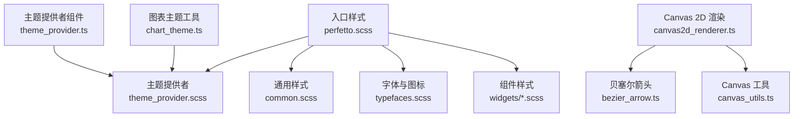
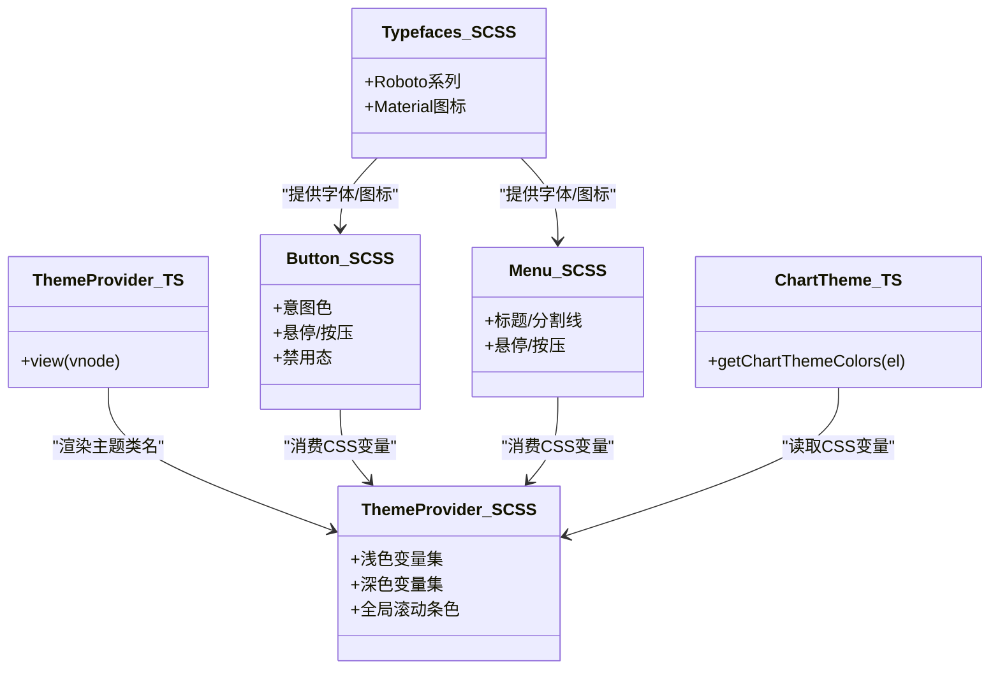
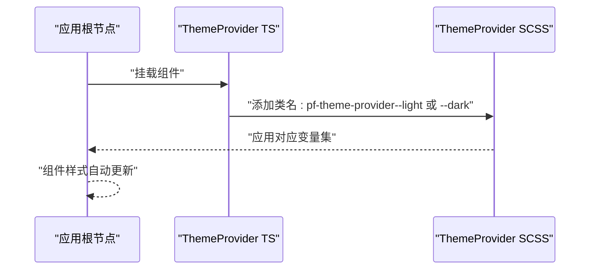
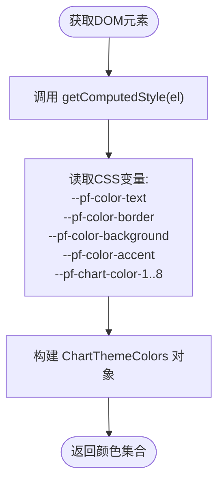
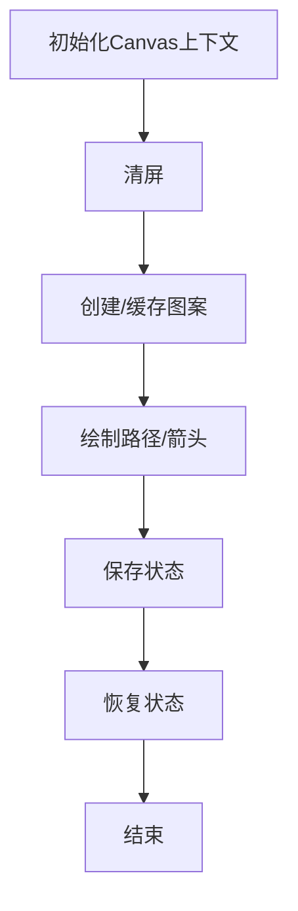
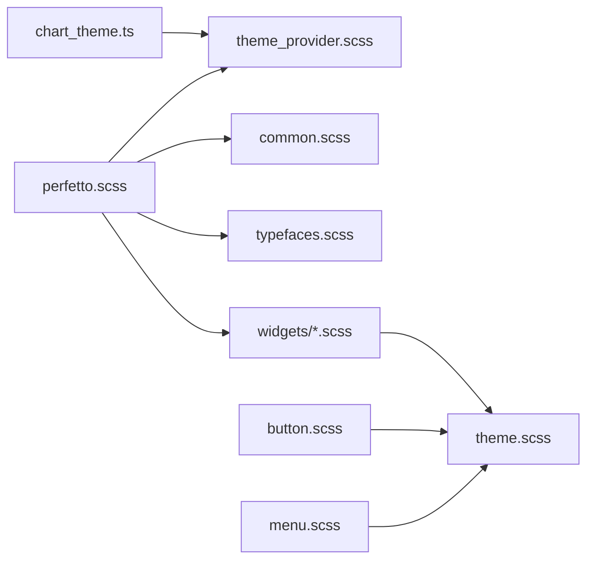

# 主题定制和样式系统

<cite>
**本文引用的文件**
- [ui/src/assets/theme.scss](file://ui/src/assets/theme.scss)
- [ui/src/assets/theme_provider.scss](file://ui/src/assets/theme_provider.scss)
- [ui/src/frontend/theme_provider.ts](file://ui/src/frontend/theme_provider.ts)
- [ui/src/assets/perfetto.scss](file://ui/src/assets/perfetto.scss)
- [ui/src/assets/typefaces.scss](file://ui/src/assets/typefaces.scss)
- [ui/src/assets/common.scss](file://ui/src/assets/common.scss)
- [ui/src/assets/widgets/button.scss](file://ui/src/assets/widgets/button.scss)
- [ui/src/assets/widgets/menu.scss](file://ui/src/assets/widgets/menu.scss)
- [ui/src/components/widgets/charts/chart_theme.ts](file://ui/src/components/widgets/charts/chart_theme.ts)
- [ui/src/base/canvas2d_renderer.ts](file://ui/src/base/canvas2d_renderer.ts)
- [ui/src/base/bezier_arrow.ts](file://ui/src/base/bezier_arrow.ts)
- [ui/src/base/canvas_utils.ts](file://ui/src/base/canvas_utils.ts)
</cite>

## 目录
1. [简介](#简介)
2. [项目结构](#项目结构)
3. [核心组件](#核心组件)
4. [架构总览](#架构总览)
5. [详细组件分析](#详细组件分析)
6. [依赖关系分析](#依赖关系分析)
7. [性能考量](#性能考量)
8. [故障排查指南](#故障排查指南)
9. [结论](#结论)
10. [附录](#附录)

## 简介
本文件面向Perfetto前端的主题定制与样式系统，系统性阐述基于CSS变量的主题架构、颜色方案、字体与间距规范、深色/浅色模式实现机制（含自动切换、用户偏好持久化与系统主题同步）、样式组件化设计（原子化CSS、BEM命名约定与响应式断点）、以及在图形渲染中对Canvas 2D绘制的优化策略。同时提供自定义主题开发指南、主题切换性能优化建议与测试验证最佳实践。

## 项目结构
Perfetto UI 的样式体系以SCSS模块化组织，通过入口样式文件统一导入各功能域样式；主题变量集中于主题提供者样式文件并通过CSS变量下发到组件层；Typefaces负责字体加载与图标字体；通用基础样式(common.scss)定义全局变量、排版与响应式断点；组件样式遵循BEM命名并使用原子化设计原则；图表主题工具从CSS变量读取颜色，确保主题切换时自动更新。

**图示来源**
- [ui/src/assets/perfetto.scss:15-95](file://ui/src/assets/perfetto.scss#L15-L95)
- [ui/src/assets/theme_provider.scss:15-133](file://ui/src/assets/theme_provider.scss#L15-L133)
- [ui/src/frontend/theme_provider.ts:21-31](file://ui/src/frontend/theme_provider.ts#L21-L31)
- [ui/src/assets/widgets/button.scss:15-287](file://ui/src/assets/widgets/button.scss#L15-L287)
- [ui/src/assets/widgets/menu.scss:15-105](file://ui/src/assets/widgets/menu.scss#L15-L105)
- [ui/src/components/widgets/charts/chart_theme.ts:49-64](file://ui/src/components/widgets/charts/chart_theme.ts#L49-L64)
- [ui/src/base/canvas2d_renderer.ts:15-351](file://ui/src/base/canvas2d_renderer.ts#L15-L351)
- [ui/src/base/bezier_arrow.ts:37-41](file://ui/src/base/bezier_arrow.ts#L37-L41)
- [ui/src/base/canvas_utils.ts:51-107](file://ui/src/base/canvas_utils.ts#L51-L107)

**章节来源**
- [ui/src/assets/perfetto.scss:15-95](file://ui/src/assets/perfetto.scss#L15-L95)
- [ui/src/assets/theme_provider.scss:15-133](file://ui/src/assets/theme_provider.scss#L15-L133)
- [ui/src/assets/common.scss:17-35](file://ui/src/assets/common.scss#L17-L35)

## 核心组件
- 主题变量与混入：通过SCSS变量与函数定义圆角、阴影、过渡动画、交互悬停/按压色等通用样式参数，并提供可复用的混入（如焦点环、过渡、Material图标）。
- 主题提供者：以CSS类包裹应用根节点，设置背景、文本色、滚动条色等全局属性，并定义浅色/深色两套CSS变量值。
- 图表主题工具：从DOM元素读取CSS变量，生成图表颜色集合，保证ECharts等可视化组件随主题变化而自动更新。
- 字体与图标：定义Roboto系列字体与Material Symbols Sharp图标字体，提供图标混入与字体加载占位策略。
- 组件样式：按钮、菜单等组件遵循BEM命名，使用原子化设计与CSS变量，实现意图色、禁用态、紧凑态等多形态。
- 响应式断点：在common.scss中定义全局断点与媒体查询，适配不同设备与交互方式。

**章节来源**
- [ui/src/assets/theme.scss:15-101](file://ui/src/assets/theme.scss#L15-L101)
- [ui/src/assets/theme_provider.scss:15-133](file://ui/src/assets/theme_provider.scss#L15-L133)
- [ui/src/components/widgets/charts/chart_theme.ts:33-64](file://ui/src/components/widgets/charts/chart_theme.ts#L33-L64)
- [ui/src/assets/typefaces.scss:1-82](file://ui/src/assets/typefaces.scss#L1-L82)
- [ui/src/assets/widgets/button.scss:15-287](file://ui/src/assets/widgets/button.scss#L15-L287)
- [ui/src/assets/widgets/menu.scss:15-105](file://ui/src/assets/widgets/menu.scss#L15-L105)
- [ui/src/assets/common.scss:49-60](file://ui/src/assets/common.scss#L49-L60)

## 架构总览
主题系统采用“CSS变量驱动 + SCSS混入 + 组件样式”的分层架构：
- 变量层：在主题提供者中定义深/浅两套CSS变量，覆盖背景、文本、边框、强调色、图表调色板等。
- 混入层：在theme.scss中提供过渡、焦点、图标等通用混入，供组件样式复用。
- 组件层：按钮、菜单等组件直接消费CSS变量，实现意图色、悬停/按压态、禁用态等。
- 图表层：chart_theme.ts从DOM读取CSS变量，构建图表颜色对象，避免硬编码颜色。
- 字体层：typefaces.scss集中管理字体与图标字体，配合common.scss的全局排版变量。
- 运行时：theme_provider.ts以Mithril组件形式包裹应用，动态切换主题类名，从而切换CSS变量集。

**图示来源**
- [ui/src/frontend/theme_provider.ts:21-31](file://ui/src/frontend/theme_provider.ts#L21-L31)
- [ui/src/assets/theme_provider.scss:15-133](file://ui/src/assets/theme_provider.scss#L15-L133)
- [ui/src/assets/widgets/button.scss:15-287](file://ui/src/assets/widgets/button.scss#L15-L287)
- [ui/src/assets/widgets/menu.scss:15-105](file://ui/src/assets/widgets/menu.scss#L15-L105)
- [ui/src/components/widgets/charts/chart_theme.ts:49-64](file://ui/src/components/widgets/charts/chart_theme.ts#L49-L64)
- [ui/src/assets/typefaces.scss:1-82](file://ui/src/assets/typefaces.scss#L1-L82)

## 详细组件分析

### 主题变量与混入（theme.scss）
- 定义圆角、阴影、动画时间曲线等通用参数。
- 提供color-hover-surface与color-active-surface函数，用于计算交互表面的悬停/按压色，增强对比与可感知性。
- 提供focus混入与transition混入，统一焦点样式与过渡属性列表。
- 提供material-icon混入，结合图标字体实现伪元素图标。

**章节来源**
- [ui/src/assets/theme.scss:15-101](file://ui/src/assets/theme.scss#L15-L101)

### 主题提供者（theme_provider.scss + theme_provider.ts）
- 主题提供者SCSS：
  - 使用容器类包裹应用根节点，设置全局color与background，并通过scrollbar-color统一滚动条外观。
  - 定义浅色与深色两套CSS变量，覆盖文本、背景、边框、强调色、意图色、图表调色板、侧边栏风格等。
  - 深色模式下提供图片反色滤镜变量，便于在特定场景下保持视觉一致性。
- 主题提供者TS组件：
  - 以Mithril组件渲染容器类，并根据传入theme属性动态附加--light或--dark后缀类名，从而切换CSS变量集。

**图示来源**
- [ui/src/frontend/theme_provider.ts:21-31](file://ui/src/frontend/theme_provider.ts#L21-L31)
- [ui/src/assets/theme_provider.scss:15-133](file://ui/src/assets/theme_provider.scss#L15-L133)

**章节来源**
- [ui/src/assets/theme_provider.scss:15-133](file://ui/src/assets/theme_provider.scss#L15-L133)
- [ui/src/frontend/theme_provider.ts:21-31](file://ui/src/frontend/theme_provider.ts#L21-L31)

### 图表主题工具（chart_theme.ts）
- 设计要点：
  - 颜色来自CSS变量而非硬编码，确保主题更新时图表自动适配。
  - 从传入元素或其祖先树读取变量，保证嵌入式构建仍可用。
  - 所有颜色敏感项（坐标轴、系列、提示框）均包含在ECharts选项对象内，Mithril重绘时重新构建选项，触发ECharts更新。
- 接口：
  - ChartThemeColors接口返回文本色、边框色、背景色、强调色与图表调色板数组。
  - getChartThemeColors(el)函数从DOM读取CSS变量并返回颜色对象。

**图示来源**
- [ui/src/components/widgets/charts/chart_theme.ts:49-64](file://ui/src/components/widgets/charts/chart_theme.ts#L49-L64)

**章节来源**
- [ui/src/components/widgets/charts/chart_theme.ts:15-64](file://ui/src/components/widgets/charts/chart_theme.ts#L15-L64)

### 字体与图标（typefaces.scss + common.scss）
- 字体：
  - Roboto、Roboto Condensed、Roboto Mono三类字体，分别用于正文、紧凑文本与代码。
  - Material Symbols Sharp作为图标字体，提供填充/非填充变体与图标混入。
- 图标：
  - icon与icon-filled混入统一图标尺寸、字重、行高与填充状态。
  - hidden-while-fonts-loading混入在字体未加载完成时隐藏图标元素，避免布局抖动。
- 全局排版：
  - common.scss定义全局字体变量、字号层级、根元素排版与基础重置。
  - 在指针为粗略设备（平板）时禁用长按选择，避免与鼠标模拟冲突。

**章节来源**
- [ui/src/assets/typefaces.scss:1-82](file://ui/src/assets/typefaces.scss#L1-L82)
- [ui/src/assets/common.scss:17-35](file://ui/src/assets/common.scss#L17-L35)
- [ui/src/assets/common.scss:49-60](file://ui/src/assets/common.scss#L49-L60)

### 组件样式（按钮与菜单）
- 按钮（button.scss）：
  - 支持填充、描边、最小化三种外观，意图色包括primary、success、danger、warning。
  - 交互态通过color_hover/color_active函数计算悬停/按压背景色，禁用态降低不透明度。
  - 提供紧凑态、仅图标态、加载态等变体，统一使用CSS变量控制文本与背景色。
- 菜单（menu.scss）：
  - 标题/分割线/项的BEM结构清晰，支持左右图标与标签区域网格布局。
  - 交互态同样使用color_hover/color_active函数，禁用态文本降级为次级色。

**章节来源**
- [ui/src/assets/widgets/button.scss:15-287](file://ui/src/assets/widgets/button.scss#L15-L287)
- [ui/src/assets/widgets/menu.scss:15-105](file://ui/src/assets/widgets/menu.scss#L15-L105)

### 响应式断点与媒体查询
- 断点来源：
  - common.scss定义全局断点与媒体查询，适配触摸设备与不同交互方式。
  - 项目其他样式文件中存在更多断点与媒体查询，用于页面布局与组件在小屏/横屏下的表现。
- 设计原则：
  - 以原子化与语义化结合的方式组织样式，避免重复定义。
  - 在组件层通过BEM命名与局部变量控制不同断点下的表现。

**章节来源**
- [ui/src/assets/common.scss:49-60](file://ui/src/assets/common.scss#L49-L60)

### GL/Canvas 2D 渲染与着色器系统
说明：在当前仓库中未发现独立的GL着色器源文件。与图形渲染相关的内容主要集中在Canvas 2D绘制与辅助工具中，可用于实现矢量图形、路径与图案的高性能绘制。以下为现有能力概述：

- Canvas 2D 渲染器：
  - 使用变换矩阵进行几何变换，支持离屏Canvas缓存图案以减少重复绘制开销。
  - 提供清屏、裁剪、状态保存与恢复等常用操作。
- 贝塞尔箭头：
  - 基于当前画布上下文绘制箭头，颜色与宽度由当前上下文决定，便于与主题色一致。
- Canvas 工具：
  - 提供裁剪、状态保存/恢复等实用工具，便于复杂绘制流程的组织。

**图示来源**
- [ui/src/base/canvas2d_renderer.ts:15-351](file://ui/src/base/canvas2d_renderer.ts#L15-L351)
- [ui/src/base/bezier_arrow.ts:37-41](file://ui/src/base/bezier_arrow.ts#L37-L41)
- [ui/src/base/canvas_utils.ts:51-107](file://ui/src/base/canvas_utils.ts#L51-L107)

**章节来源**
- [ui/src/base/canvas2d_renderer.ts:15-351](file://ui/src/base/canvas2d_renderer.ts#L15-L351)
- [ui/src/base/bezier_arrow.ts:37-41](file://ui/src/base/bezier_arrow.ts#L37-L41)
- [ui/src/base/canvas_utils.ts:51-107](file://ui/src/base/canvas_utils.ts#L51-L107)

## 依赖关系分析
- 入口样式perfetto.scss统一导入主题提供者、通用样式、字体与各组件样式，形成模块化依赖链。
- 组件样式依赖theme.scss提供的混入与变量，间接依赖主题提供者的CSS变量。
- 图表主题工具依赖DOM树中的CSS变量，与主题提供者强耦合。
- 字体与图标样式被按钮、菜单等组件样式所依赖。
- Canvas相关工具为渲染层提供基础能力，与主题系统解耦但可配合主题色使用。

**图示来源**
- [ui/src/assets/perfetto.scss:15-95](file://ui/src/assets/perfetto.scss#L15-L95)
- [ui/src/assets/theme_provider.scss:15-133](file://ui/src/assets/theme_provider.scss#L15-L133)
- [ui/src/assets/common.scss:17-35](file://ui/src/assets/common.scss#L17-L35)
- [ui/src/assets/typefaces.scss:1-82](file://ui/src/assets/typefaces.scss#L1-L82)
- [ui/src/assets/widgets/button.scss:15-287](file://ui/src/assets/widgets/button.scss#L15-L287)
- [ui/src/assets/widgets/menu.scss:15-105](file://ui/src/assets/widgets/menu.scss#L15-L105)
- [ui/src/assets/theme.scss:15-101](file://ui/src/assets/theme.scss#L15-L101)
- [ui/src/components/widgets/charts/chart_theme.ts:49-64](file://ui/src/components/widgets/charts/chart_theme.ts#L49-L64)

**章节来源**
- [ui/src/assets/perfetto.scss:15-95](file://ui/src/assets/perfetto.scss#L15-L95)

## 性能考量
- CSS变量缓存与批量更新：
  - 主题切换通过切换容器类名实现，浏览器可批量更新CSS变量，避免逐元素重算。
  - 图表颜色通过getChartThemeColors一次性读取，减少多次查询开销。
- 动态样式注入：
  - 通过Mithril组件动态附加类名，无需额外脚本注入样式，降低运行时成本。
- 渐变过渡效果：
  - transition混入统一了过渡属性与时序，避免重复声明；动画时长与缓动函数集中定义，便于统一优化。
- Canvas绘制优化：
  - 离屏Canvas缓存图案，减少重复绘制；状态保存/恢复避免频繁上下文切换。
- 字体加载：
  - 使用font-display: swap与hidden-while-fonts-loading，减少FOIT/FOFT带来的布局抖动与重绘。

**章节来源**
- [ui/src/assets/theme.scss:75-93](file://ui/src/assets/theme.scss#L75-L93)
- [ui/src/components/widgets/charts/chart_theme.ts:49-64](file://ui/src/components/widgets/charts/chart_theme.ts#L49-L64)
- [ui/src/base/canvas2d_renderer.ts:327-351](file://ui/src/base/canvas2d_renderer.ts#L327-L351)
- [ui/src/assets/typefaces.scss:76-81](file://ui/src/assets/typefaces.scss#L76-L81)

## 故障排查指南
- 主题颜色未生效：
  - 确认应用根节点已包裹ThemeProvider组件且类名正确（--light/--dark）。
  - 检查组件是否直接使用CSS变量而非硬编码颜色。
- 图表颜色异常：
  - 确保chart_theme.ts从包含CSS变量的DOM元素读取变量。
  - 在嵌入式构建中确认父级DOM包含主题变量。
- 字体闪烁或布局抖动：
  - 检查typefaces.scss的字体加载策略与hidden-while-fonts-loading使用。
- 交互态不一致：
  - 检查按钮/菜单是否使用color_hover/color_active函数或等效逻辑。
- Canvas绘制异常：
  - 检查离屏Canvas缓存是否正确创建与复用；确认状态保存/恢复时机。

**章节来源**
- [ui/src/frontend/theme_provider.ts:21-31](file://ui/src/frontend/theme_provider.ts#L21-L31)
- [ui/src/assets/widgets/button.scss:15-287](file://ui/src/assets/widgets/button.scss#L15-L287)
- [ui/src/assets/widgets/menu.scss:15-105](file://ui/src/assets/widgets/menu.scss#L15-L105)
- [ui/src/components/widgets/charts/chart_theme.ts:15-31](file://ui/src/components/widgets/charts/chart_theme.ts#L15-L31)
- [ui/src/assets/typefaces.scss:76-81](file://ui/src/assets/typefaces.scss#L76-L81)
- [ui/src/base/canvas2d_renderer.ts:327-351](file://ui/src/base/canvas2d_renderer.ts#L327-L351)

## 结论
Perfetto的主题系统以CSS变量为核心，结合SCSS混入与组件样式，实现了跨组件的一致性与可扩展性。通过主题提供者组件与图表主题工具，系统在运行时能够自动适配深/浅色模式并驱动可视化组件更新。在Canvas渲染方面，通过离屏缓存与状态管理提升性能。整体设计遵循原子化与BEM命名约定，配合响应式断点与字体系统，满足多端体验需求。

## 附录

### 自定义主题开发指南
- 颜色调色板设计：
  - 在主题提供者中新增或调整CSS变量，确保文本、背景、边框、强调色与意图色成对出现。
  - 为图表补充调色板变量，保证数据可视化一致性。
- 品牌色彩集成：
  - 将品牌主色映射到--pf-color-primary与--pf-color-text-on-primary，确保按钮与高亮元素符合品牌规范。
- 无障碍对比度：
  - 确保文本与背景的对比度满足WCAG标准；必要时调整--pf-color-text与--pf-color-background。
- 深/浅色模式同步：
  - 通过系统主题监听与用户偏好存储，动态切换ThemeProvider的类名，实现自动同步。

**章节来源**
- [ui/src/assets/theme_provider.scss:27-131](file://ui/src/assets/theme_provider.scss#L27-L131)
- [ui/src/components/widgets/charts/chart_theme.ts:33-42](file://ui/src/components/widgets/charts/chart_theme.ts#L33-L42)

### 主题切换性能优化清单
- 使用CSS变量与类名切换替代逐元素样式更新。
- 复用transition混入，统一动画参数。
- 缓存离屏Canvas图案，减少重复绘制。
- 在图表层一次性读取变量，避免多次查询。

**章节来源**
- [ui/src/assets/theme.scss:75-93](file://ui/src/assets/theme.scss#L75-L93)
- [ui/src/base/canvas2d_renderer.ts:327-351](file://ui/src/base/canvas2d_renderer.ts#L327-L351)
- [ui/src/components/widgets/charts/chart_theme.ts:49-64](file://ui/src/components/widgets/charts/chart_theme.ts#L49-L64)

### 主题测试与验证最佳实践
- 视觉回归测试：
  - 在浅/深色模式下截图关键页面与组件，使用自动化工具比对差异。
- 可访问性测试：
  - 使用对比度检测工具验证文本与背景对比度。
- 交互一致性：
  - 测试按钮、菜单等组件在不同模式下的悬停/按压/禁用态表现。
- 字体与图标：
  - 验证字体加载策略与图标显示在不同网络/设备条件下的稳定性。

[本节为通用指导，无需列出具体文件来源]