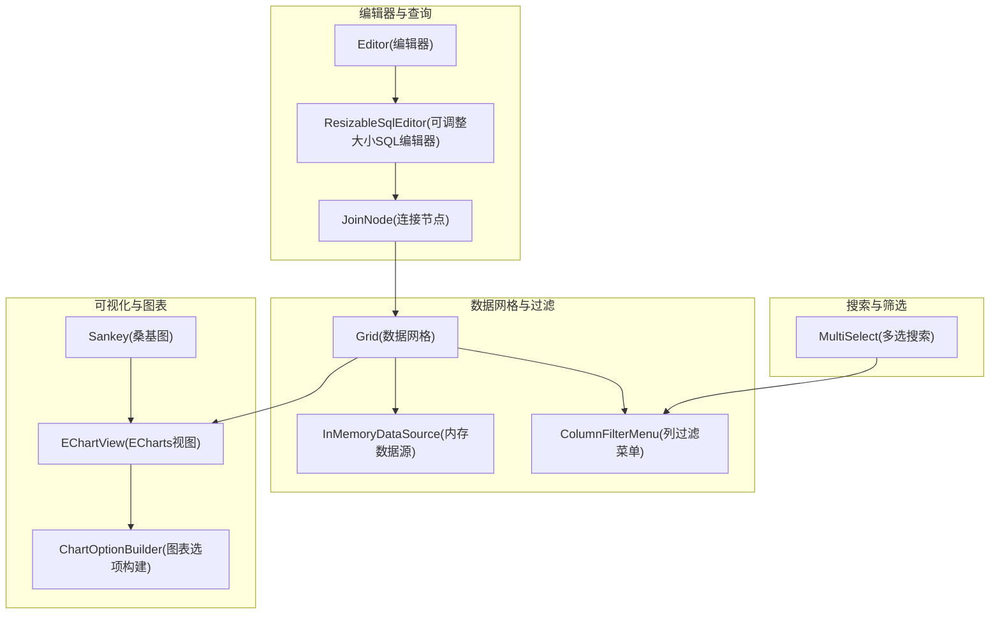
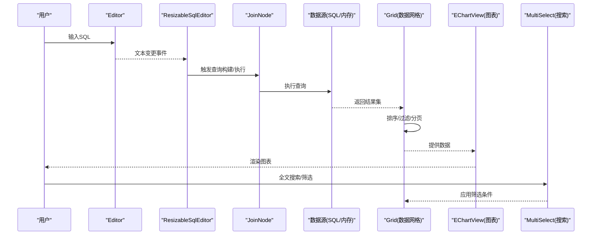
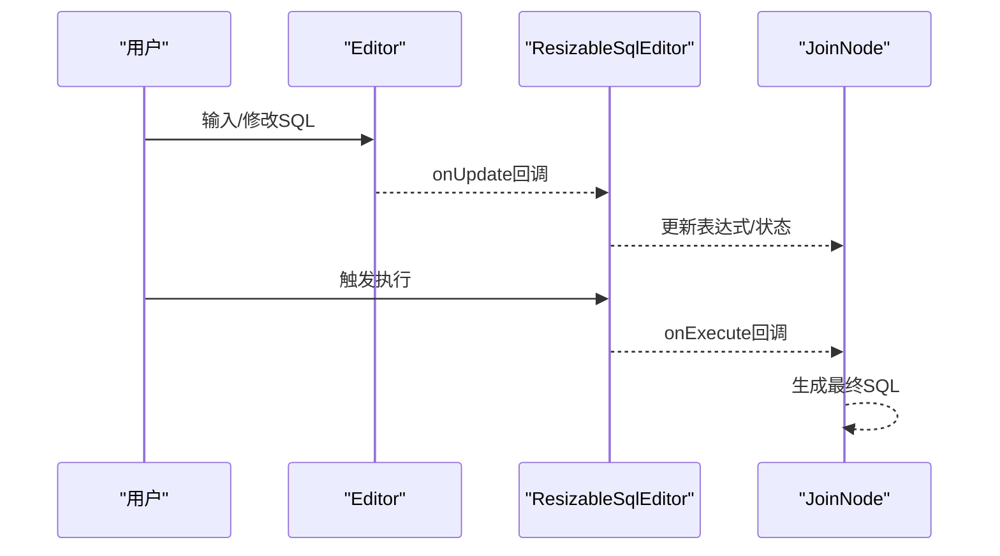
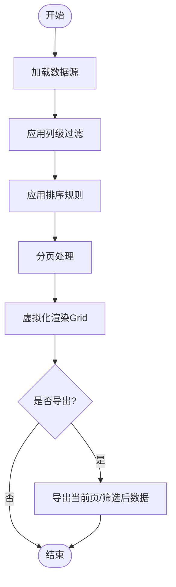
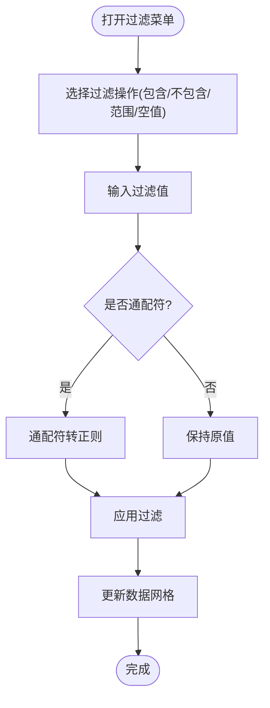
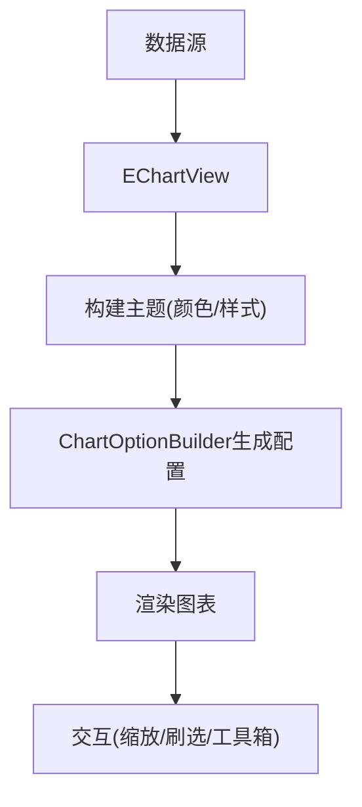
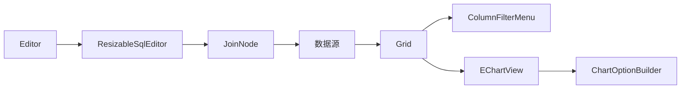

# 交互式分析功能

<cite>
**本文引用的文件**
- [editor.ts](file://ui/src/widgets/editor.ts)
- [grid.ts](file://ui/src/widgets/grid.ts)
- [echart_view.ts](file://ui/src/components/widgets/charts/echart_view.ts)
- [chart_option_builder.ts](file://ui/src/components/widgets/charts/chart_option_builder.ts)
- [sankey.ts](file://ui/src/components/widgets/charts/sankey.ts)
- [column_filter_menu.ts](file://ui/src/components/widgets/datagrid/column_filter_menu.ts)
- [in_memory_data_source.ts](file://ui/src/components/widgets/datagrid/in_memory_data_source.ts)
- [grid_demo.ts](file://ui/src/plugins/dev.perfetto.WidgetsPage/demos/grid_demo.ts)
- [charts_demo.ts](file://ui/src/plugins/dev.perfetto.WidgetsPage/demos/charts_demo.ts)
- [multiselect.ts](file://ui/src/widgets/multiselect.ts)
- [join_node.ts](file://ui/src/plugins/dev.perfetto.DataExplorer/query_builder/nodes/join_node.ts)
- [widgets.ts](file://ui/src/plugins/dev.perfetto.DataExplorer/query_builder/widgets.ts)
- [strings_view.ts](file://ui/src/plugins/com.android.HeapDumpExplorer/views/strings_view.ts)
</cite>

## 目录
1. [简介](#简介)
2. [项目结构](#项目结构)
3. [核心组件](#核心组件)
4. [架构总览](#架构总览)
5. [详细组件分析](#详细组件分析)
6. [依赖关系分析](#依赖关系分析)
7. [性能考量](#性能考量)
8. [故障排查指南](#故障排查指南)
9. [结论](#结论)
10. [附录](#附录)

## 简介
本文件面向Perfetto的交互式分析功能，系统性梳理并解释以下能力：
- SQL查询面板：基于CodeMirror（通过Mote/Editor）的编辑器，支持语法高亮、智能补全与错误提示。
- 查询结果表格：数据网格渲染、排序与过滤、分页与导出。
- 搜索与过滤：全文搜索、通配符/正则匹配、高级筛选条件。
- 图表与可视化：ECharts集成、多图表类型与交互式操作。
- 历史与书签：查询历史管理与书签功能。
- 实时分析：动态查询、增量结果更新与性能监控。
- 查询优化与性能分析：优化建议与工具使用。

## 项目结构
Perfetto前端位于ui/src目录，交互式分析主要由以下模块构成：
- 编辑器与查询执行：widgets/editor.ts、plugins/dev.perfetto.DataExplorer/query_builder/*。
- 数据网格与过滤：widgets/grid.ts、components/widgets/datagrid/*。
- 可视化与图表：components/widgets/charts/*。
- 搜索与筛选：widgets/multiselect.ts、components/widgets/datagrid/column_filter_menu.ts。
- 示例与演示：plugins/dev.perfetto.WidgetsPage/demos/*。

**图表来源**
- [editor.ts:114-167](file://ui/src/widgets/editor.ts#L114-L167)
- [widgets.ts:813-842](file://ui/src/plugins/dev.perfetto.DataExplorer/query_builder/widgets.ts#L813-L842)
- [join_node.ts:422-432](file://ui/src/plugins/dev.perfetto.DataExplorer/query_builder/nodes/join_node.ts#L422-L432)
- [grid.ts](file://ui/src/widgets/grid.ts)
- [in_memory_data_source.ts:286-317](file://ui/src/components/widgets/datagrid/in_memory_data_source.ts#L286-L317)
- [column_filter_menu.ts:318-373](file://ui/src/components/widgets/datagrid/column_filter_menu.ts#L318-L373)
- [echart_view.ts:79-123](file://ui/src/components/widgets/charts/echart_view.ts#L79-L123)
- [chart_option_builder.ts:1-38](file://ui/src/components/widgets/charts/chart_option_builder.ts#L1-L38)
- [sankey.ts:1-41](file://ui/src/components/widgets/charts/sankey.ts#L1-L41)
- [multiselect.ts:152-192](file://ui/src/widgets/multiselect.ts#L152-L192)

**章节来源**
- [editor.ts:114-167](file://ui/src/widgets/editor.ts#L114-L167)
- [widgets.ts:813-842](file://ui/src/plugins/dev.perfetto.DataExplorer/query_builder/widgets.ts#L813-L842)
- [join_node.ts:422-432](file://ui/src/plugins/dev.perfetto.DataExplorer/query_builder/nodes/join_node.ts#L422-L432)
- [grid.ts](file://ui/src/widgets/grid.ts)
- [in_memory_data_source.ts:286-317](file://ui/src/components/widgets/datagrid/in_memory_data_source.ts#L286-L317)
- [column_filter_menu.ts:318-373](file://ui/src/components/widgets/datagrid/column_filter_menu.ts#L318-L373)
- [echart_view.ts:79-123](file://ui/src/components/widgets/charts/echart_view.ts#L79-L123)
- [chart_option_builder.ts:1-38](file://ui/src/components/widgets/charts/chart_option_builder.ts#L1-L38)
- [sankey.ts:1-41](file://ui/src/components/widgets/charts/sankey.ts#L1-L41)
- [multiselect.ts:152-192](file://ui/src/widgets/multiselect.ts#L152-L192)

## 核心组件
- SQL查询面板：Editor组件负责文本编辑、只读模式、主题与键位映射；ResizableSqlEditor提供可调整高度与回调；JoinNode等查询构建节点用于可视化拼接SQL。
- 结果表格：Grid组件提供虚拟化、列宽调整、树形展示、上下文菜单；InMemoryDataSource负责过滤、排序与分页；ColumnFilterMenu提供列级过滤入口。
- 图表与可视化：EChartView封装ECharts，ChartOptionBuilder统一构建图表配置；Sankey等专用图示组件。
- 搜索与过滤：MultiSelect提供搜索框与批量选择；ColumnFilterMenu提供包含/不包含、范围、空值等过滤项。
- 历史与书签：通过导航参数与状态管理维护查询历史与书签。
- 实时分析：增量更新与性能监控通过数据源与UI刷新机制实现。

**章节来源**
- [editor.ts:114-167](file://ui/src/widgets/editor.ts#L114-L167)
- [widgets.ts:813-842](file://ui/src/plugins/dev.perfetto.DataExplorer/query_builder/widgets.ts#L813-L842)
- [join_node.ts:422-432](file://ui/src/plugins/dev.perfetto.DataExplorer/query_builder/nodes/join_node.ts#L422-L432)
- [grid.ts](file://ui/src/widgets/grid.ts)
- [in_memory_data_source.ts:286-317](file://ui/src/components/widgets/datagrid/in_memory_data_source.ts#L286-L317)
- [column_filter_menu.ts:318-373](file://ui/src/components/widgets/datagrid/column_filter_menu.ts#L318-L373)
- [echart_view.ts:79-123](file://ui/src/components/widgets/charts/echart_view.ts#L79-L123)
- [chart_option_builder.ts:1-38](file://ui/src/components/widgets/charts/chart_option_builder.ts#L1-L38)
- [sankey.ts:1-41](file://ui/src/components/widgets/charts/sankey.ts#L1-L41)
- [multiselect.ts:152-192](file://ui/src/widgets/multiselect.ts#L152-L192)

## 架构总览
交互式分析的端到端流程如下：
- 用户在SQL编辑器中输入或修改查询。
- ResizableSqlEditor触发onExecute回调，JoinNode等节点参与查询构建。
- 查询结果经由数据网格渲染，支持排序、过滤、分页。
- 可视化组件根据数据生成图表。
- 搜索与筛选通过MultiSelect与ColumnFilterMenu增强交互体验。
- 历史与书签通过导航参数与状态管理维护。

**图表来源**
- [editor.ts:114-167](file://ui/src/widgets/editor.ts#L114-L167)
- [widgets.ts:813-842](file://ui/src/plugins/dev.perfetto.DataExplorer/query_builder/widgets.ts#L813-L842)
- [join_node.ts:422-432](file://ui/src/plugins/dev.perfetto.DataExplorer/query_builder/nodes/join_node.ts#L422-L432)
- [grid.ts](file://ui/src/widgets/grid.ts)
- [echart_view.ts:79-123](file://ui/src/components/widgets/charts/echart_view.ts#L79-L123)
- [multiselect.ts:152-192](file://ui/src/widgets/multiselect.ts#L152-L192)

## 详细组件分析

### SQL查询面板与编辑器
- 组件职责
  - Editor：基于CodeMirror扩展，支持语言切换（如perfetto-sql）、只读模式、主题与键位映射。
  - ResizableSqlEditor：包裹Editor，提供可调整高度与回调（onUpdate/onExecute）。
  - JoinNode/查询构建节点：可视化地拼接SQL片段，支持别名列与列选择。
- 关键特性
  - 语法高亮：按语言注入Lang扩展。
  - 智能补全：通过语言扩展与键位映射实现常用SQL关键字与函数提示。
  - 错误提示：结合语言扩展与校验逻辑进行提示。
  - 动态查询：onUpdate/onExecute回调驱动查询重建与执行。
- 交互流程

**图表来源**
- [editor.ts:114-167](file://ui/src/widgets/editor.ts#L114-L167)
- [widgets.ts:813-842](file://ui/src/plugins/dev.perfetto.DataExplorer/query_builder/widgets.ts#L813-L842)
- [join_node.ts:422-432](file://ui/src/plugins/dev.perfetto.DataExplorer/query_builder/nodes/join_node.ts#L422-L432)

**章节来源**
- [editor.ts:114-167](file://ui/src/widgets/editor.ts#L114-L167)
- [widgets.ts:813-842](file://ui/src/plugins/dev.perfetto.DataExplorer/query_builder/widgets.ts#L813-L842)
- [join_node.ts:422-432](file://ui/src/plugins/dev.perfetto.DataExplorer/query_builder/nodes/join_node.ts#L422-L432)

### 查询结果表格与数据网格
- 组件职责
  - Grid：提供虚拟化、列宽调整、树形展示、上下文菜单与排序箭头。
  - InMemoryDataSource：对数据进行过滤、排序与分页，支持数值比较、空值判断与通配符匹配。
  - ColumnFilterMenu：提供列级过滤入口，支持包含/不包含、范围、空值等。
- 关键特性
  - 虚拟化：提升大数据量渲染性能。
  - 列宽调整：自动/手动列宽，支持树形数据缩进。
  - 过滤与排序：本地过滤与排序，支持多条件组合。
  - 导出：通过数据网格接口导出当前视图数据。
- 处理流程

**图表来源**
- [grid.ts](file://ui/src/widgets/grid.ts)
- [in_memory_data_source.ts:286-317](file://ui/src/components/widgets/datagrid/in_memory_data_source.ts#L286-L317)
- [column_filter_menu.ts:318-373](file://ui/src/components/widgets/datagrid/column_filter_menu.ts#L318-L373)

**章节来源**
- [grid.ts](file://ui/src/widgets/grid.ts)
- [in_memory_data_source.ts:286-317](file://ui/src/components/widgets/datagrid/in_memory_data_source.ts#L286-L317)
- [column_filter_menu.ts:318-373](file://ui/src/components/widgets/datagrid/column_filter_menu.ts#L318-L373)

### 搜索与过滤系统
- MultiSelect：提供搜索框与批量选择（全选/清空），支持“按筛选全选/清空”。
- ColumnFilterMenu：提供“包含/不包含”、“范围”、“空值/非空”等过滤项，并将通配符转换为正则进行匹配。
- 通配符与正则
  - 通配符转正则：* → .*, ? → ., [...] → 字面量，[!...] → 反向字符类。
  - 大小写不敏感：转换为大小写不敏感的glob模式。
- 流程图

**图表来源**
- [multiselect.ts:152-192](file://ui/src/widgets/multiselect.ts#L152-L192)
- [column_filter_menu.ts:318-373](file://ui/src/components/widgets/datagrid/column_filter_menu.ts#L318-L373)
- [in_memory_data_source.ts:286-317](file://ui/src/components/widgets/datagrid/in_memory_data_source.ts#L286-L317)

**章节来源**
- [multiselect.ts:152-192](file://ui/src/widgets/multiselect.ts#L152-L192)
- [column_filter_menu.ts:318-373](file://ui/src/components/widgets/datagrid/column_filter_menu.ts#L318-L373)
- [in_memory_data_source.ts:286-317](file://ui/src/components/widgets/datagrid/in_memory_data_source.ts#L286-L317)

### 图表与可视化组件
- EChartView：封装ECharts，注册常用组件（提示框、图例、数据区域缩放、刷选、工具箱、视觉映射、标记区域、Canvas渲染器）。
- 主题适配：从CSS变量读取颜色，构建ECharts主题对象，确保与UI主题一致。
- ChartOptionBuilder：统一构建坐标轴、系列等配置，避免重复样板代码。
- 专用图表：Sankey等组件基于EChartView实现，提供特定数据格式与交互。
- 流程图

**图表来源**
- [echart_view.ts:79-123](file://ui/src/components/widgets/charts/echart_view.ts#L79-L123)
- [chart_option_builder.ts:1-38](file://ui/src/components/widgets/charts/chart_option_builder.ts#L1-L38)
- [sankey.ts:1-41](file://ui/src/components/widgets/charts/sankey.ts#L1-L41)

**章节来源**
- [echart_view.ts:79-123](file://ui/src/components/widgets/charts/echart_view.ts#L79-L123)
- [chart_option_builder.ts:1-38](file://ui/src/components/widgets/charts/chart_option_builder.ts#L1-L38)
- [sankey.ts:1-41](file://ui/src/components/widgets/charts/sankey.ts#L1-L41)

### 历史与书签管理
- 历史管理：通过导航参数与状态管理维护查询历史列表，支持回放与继续分析。
- 书签：以导航参数形式保存当前查询状态，便于分享与快速访问。
- 示例：HeapDumpExplorer的字符串视图通过导航参数q传递初始查询，应用后清除参数，避免重复应用。

**章节来源**
- [strings_view.ts:164-189](file://ui/src/plugins/com.android.HeapDumpExplorer/views/strings_view.ts#L164-L189)

### 实时分析与增量更新
- 动态查询：Editor/ResizableSqlEditor的onUpdate/onExecute回调驱动查询重建与执行。
- 增量结果更新：数据网格支持局部刷新与增量渲染，减少重绘开销。
- 性能监控：通过数据网格与图表组件的渲染统计与日志输出，辅助定位性能瓶颈。

**章节来源**
- [editor.ts:114-167](file://ui/src/widgets/editor.ts#L114-L167)
- [widgets.ts:813-842](file://ui/src/plugins/dev.perfetto.DataExplorer/query_builder/widgets.ts#L813-L842)
- [grid.ts](file://ui/src/widgets/grid.ts)

## 依赖关系分析
- 组件耦合
  - Editor与ResizableSqlEditor强耦合，前者提供编辑能力，后者提供交互与回调。
  - 数据网格与数据源解耦，通过统一接口对接不同数据源（SQL/内存）。
  - 图表组件依赖EChartView与ChartOptionBuilder，形成清晰的抽象层。
- 外部依赖
  - ECharts：图表渲染与交互。
  - Mithril：轻量前端框架，用于组件生命周期与状态管理。
- 潜在循环依赖
  - 查询构建节点与数据网格之间通过回调解耦，避免直接循环引用。

**图表来源**
- [editor.ts:114-167](file://ui/src/widgets/editor.ts#L114-L167)
- [widgets.ts:813-842](file://ui/src/plugins/dev.perfetto.DataExplorer/query_builder/widgets.ts#L813-L842)
- [join_node.ts:422-432](file://ui/src/plugins/dev.perfetto.DataExplorer/query_builder/nodes/join_node.ts#L422-L432)
- [grid.ts](file://ui/src/widgets/grid.ts)
- [column_filter_menu.ts:318-373](file://ui/src/components/widgets/datagrid/column_filter_menu.ts#L318-L373)
- [echart_view.ts:79-123](file://ui/src/components/widgets/charts/echart_view.ts#L79-L123)
- [chart_option_builder.ts:1-38](file://ui/src/components/widgets/charts/chart_option_builder.ts#L1-L38)

**章节来源**
- [editor.ts:114-167](file://ui/src/widgets/editor.ts#L114-L167)
- [widgets.ts:813-842](file://ui/src/plugins/dev.perfetto.DataExplorer/query_builder/widgets.ts#L813-L842)
- [join_node.ts:422-432](file://ui/src/plugins/dev.perfetto.DataExplorer/query_builder/nodes/join_node.ts#L422-L432)
- [grid.ts](file://ui/src/widgets/grid.ts)
- [column_filter_menu.ts:318-373](file://ui/src/components/widgets/datagrid/column_filter_menu.ts#L318-L373)
- [echart_view.ts:79-123](file://ui/src/components/widgets/charts/echart_view.ts#L79-L123)
- [chart_option_builder.ts:1-38](file://ui/src/components/widgets/charts/chart_option_builder.ts#L1-L38)

## 性能考量
- 虚拟化渲染：Grid采用虚拟化减少DOM节点数量，适合大数据量场景。
- 局部刷新：数据网格支持增量更新，避免全量重绘。
- 通配符匹配：将通配符转换为正则，注意复杂模式的性能影响，建议优先使用精确过滤。
- 图表渲染：合理设置数据采样与聚合，避免一次性渲染过多点位。
- 查询优化：优先使用索引列进行过滤与连接，减少全表扫描。

## 故障排查指南
- 编辑器无响应
  - 检查只读模式与键盘映射配置，确认语言扩展已正确注入。
  - 参考路径：[editor.ts:114-167](file://ui/src/widgets/editor.ts#L114-L167)
- 过滤无效
  - 确认过滤值是否为字符串且通配符已正确转换为正则。
  - 参考路径：[in_memory_data_source.ts:286-317](file://ui/src/components/widgets/datagrid/in_memory_data_source.ts#L286-L317)
- 图表空白
  - 检查EChartView主题颜色与容器尺寸，确认数据格式符合组件要求。
  - 参考路径：[echart_view.ts:79-123](file://ui/src/components/widgets/charts/echart_view.ts#L79-L123)
- 搜索无结果
  - 确认MultiSelect的搜索框输入与批量选择逻辑，检查过滤菜单是否正确应用。
  - 参考路径：[multiselect.ts:152-192](file://ui/src/widgets/multiselect.ts#L152-L192)

**章节来源**
- [editor.ts:114-167](file://ui/src/widgets/editor.ts#L114-L167)
- [in_memory_data_source.ts:286-317](file://ui/src/components/widgets/datagrid/in_memory_data_source.ts#L286-L317)
- [echart_view.ts:79-123](file://ui/src/components/widgets/charts/echart_view.ts#L79-L123)
- [multiselect.ts:152-192](file://ui/src/widgets/multiselect.ts#L152-L192)

## 结论
Perfetto的交互式分析功能通过Editor/ResizableSqlEditor提供强大的SQL编辑体验，结合Grid数据网格实现高效的数据浏览与筛选，借助ECharts完成丰富的可视化呈现。配合MultiSelect与ColumnFilterMenu，用户可以进行复杂的全文搜索与高级筛选。整体架构清晰、组件职责明确，具备良好的扩展性与性能表现。

## 附录
- 示例与演示
  - Grid演示：展示虚拟化、列宽调整、树形数据与上下文菜单。
  - 图表演示：展示多种图表类型的使用方式与数据准备。
- 参考路径
  - [grid_demo.ts:1-118](file://ui/src/plugins/dev.perfetto.WidgetsPage/demos/grid_demo.ts#L1-L118)
  - [charts_demo.ts:114-158](file://ui/src/plugins/dev.perfetto.WidgetsPage/demos/charts_demo.ts#L114-L158)

**章节来源**
- [grid_demo.ts:1-118](file://ui/src/plugins/dev.perfetto.WidgetsPage/demos/grid_demo.ts#L1-L118)
- [charts_demo.ts:114-158](file://ui/src/plugins/dev.perfetto.WidgetsPage/demos/charts_demo.ts#L114-L158)