# 后端通信和数据流

<cite>
**本文引用的文件**
- [websocket_bridge.h](file://src/websocket_bridge/websocket_bridge.h)
- [websocket_bridge.cc](file://src/websocket_bridge/websocket_bridge.cc)
- [http_rpc_engine.ts](file://ui/src/trace_processor/http_rpc_engine.ts)
- [wasm_bridge.ts](file://ui/src/engine/wasm_bridge.ts)
- [rpc.cc](file://src/trace_processor/rpc/rpc.cc)
- [httpd.cc](file://src/trace_processor/rpc/httpd.cc)
- [wasm_bridge.cc](file://src/trace_processor/rpc/wasm_bridge.cc)
- [wasm_typescript_declaration.d.ts](file://gn/standalone/wasm_typescript_declaration.d.ts)
- [query_slot.ts](file://ui/src/base/query_slot.ts)
- [index.ts（TimelineSync 插件）](file://ui/src/plugins/dev.perfetto.TimelineSync/index.ts)
- [service_worker_controller.ts](file://ui/src/frontend/service_worker_controller.ts)
- [index.ts（OpenPerfetto后端服务）](file://server/src/index.ts)
- [websocket.ts（OpenPerfetto路由）](file://server/src/routes/websocket.ts)
- [health.ts（OpenPerfetto健康检查）](file://server/src/routes/health.ts)
- [session_manager.ts（会话管理）](file://server/src/services/session_manager.ts)
- [websocket_client.ts（前端WebSocket客户端）](file://ui/src/plugins/org.openperfetto/services/websocket_client.ts)
- [implementation-spec.md（OpenPerfetto实现规格）](file://docs/openperfetto/implementation-spec.md)
</cite>

## 更新摘要
**所做更改**
- 新增OpenPerfetto后端通信架构章节，涵盖Node.js Fastify服务、WebSocket路由和健康检查
- 更新WebSocket桥接服务章节，增加OpenPerfetto专用WebSocket客户端实现
- 新增会话管理与状态同步机制，包括连接池管理和消息路由
- 更新安全与防护章节，增加CORS配置、速率限制和错误分类处理
- 新增性能监控与诊断章节，涵盖连接健康检查和内存使用统计

## 目录
1. [引言](#引言)
2. [项目结构](#项目结构)
3. [核心组件](#核心组件)
4. [架构总览](#架构总览)
5. [详细组件分析](#详细组件分析)
6. [OpenPerfetto后端通信架构](#openperfetto后端通信架构)
7. [依赖关系分析](#依赖关系分析)
8. [性能考量](#性能考量)
9. [故障排查指南](#故障排查指南)
10. [结论](#结论)
11. [附录](#附录)

## 引言
本文件面向 Perfetto 后端通信与数据流系统，聚焦以下主题：
- WebSocket 桥接服务：连接建立、消息路由与错误处理
- WASM 桥接：WebAssembly 模块加载、内存管理与性能优化
- RPC 通信协议：HTTP API 调用、请求/响应模式与超时/重试
- 数据流架构：轨迹数据传输、增量更新与缓存策略
- 实时同步机制：事件订阅、推送通知与状态一致性
- **新增** OpenPerfetto后端服务：Node.js Fastify微服务架构、WebSocket路由、健康检查与会话管理
- 性能监控与诊断：网络延迟、传输统计与连接健康检查
- 安全与离线：CORS配置、身份验证与数据加密、离线与缓存策略

## 项目结构
后端通信与数据流涉及四类关键路径：
- 前端 UI 通过 HTTP/WebSocket 与本地 RPC 服务交互
- 本地 RPC 服务与 Trace Processor 进程或 WASM 执行环境交互
- 可选的 WebSocket 桥接服务用于跨进程/平台（如 Android ADB/traced）通信
- **新增** OpenPerfetto后端服务提供AI增强功能的WebSocket通信与会话管理

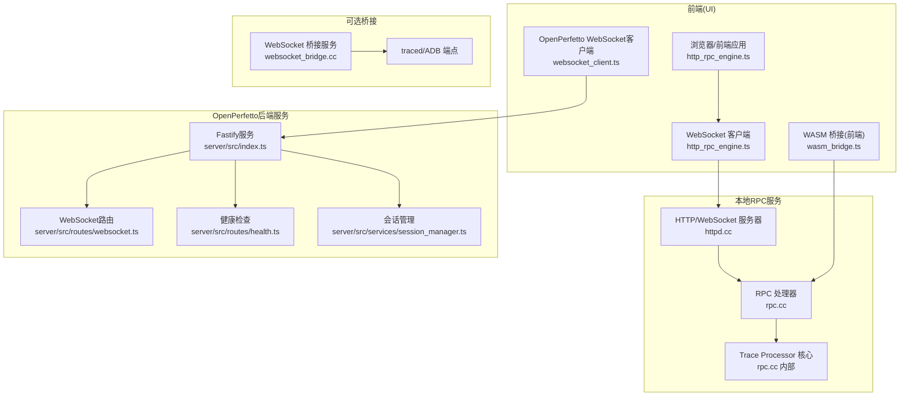

**图表来源**
- [http_rpc_engine.ts:29-153](file://ui/src/trace_processor/http_rpc_engine.ts#L29-L153)
- [httpd.cc:53-271](file://src/trace_processor/rpc/httpd.cc#L53-L271)
- [rpc.cc:138-491](file://src/trace_processor/rpc/rpc.cc#L138-L491)
- [websocket_bridge.cc:45-281](file://src/websocket_bridge/websocket_bridge.cc#L45-L281)
- [websocket_client.ts:38-263](file://ui/src/plugins/org.openperfetto/services/websocket_client.ts#L38-L263)
- [index.ts（OpenPerfetto后端服务）:1-279](file://server/src/index.ts#L1-L279)

**章节来源**
- [http_rpc_engine.ts:29-153](file://ui/src/trace_processor/http_rpc_engine.ts#L29-L153)
- [httpd.cc:53-271](file://src/trace_processor/rpc/httpd.cc#L53-L271)
- [rpc.cc:138-491](file://src/trace_processor/rpc/rpc.cc#L138-L491)
- [websocket_bridge.cc:45-281](file://src/websocket_bridge/websocket_bridge.cc#L45-L281)
- [websocket_client.ts:38-263](file://ui/src/plugins/org.openperfetto/services/websocket_client.ts#L38-L263)
- [index.ts（OpenPerfetto后端服务）:1-279](file://server/src/index.ts#L1-L279)

## 核心组件
- WebSocket 桥接服务：在本地监听端口，将浏览器 WebSocket 请求转发到 traced 或 ADB 端点，支持 CORS 配置与连接生命周期管理
- HTTP/WebSocket RPC 引擎：前端通过 WebSocket 与本地 9001 端口 RPC 服务通信，支持连接探测、队列化发送与消息分片处理
- RPC 协议与序列化：基于 Protobuf 的 TraceProcessor RPC，支持流式查询、度量计算、摘要生成与元跟踪
- WASM 桥接：前端通过 MessagePort 将二进制请求写入 WASM 堆缓冲区，回调返回批量响应；支持 Memory64/Memory32 自适应
- 实时同步与缓存：UI 查询槽与插件广播通道实现视图同步与增量更新；Service Worker 支持离线与更新提示
- **新增** OpenPerfetto后端服务：基于Node.js Fastify的微服务架构，提供WebSocket通信、健康检查、会话管理与AI增强功能
- **新增** 会话管理与状态同步：连接池管理、消息路由、错误分类处理与优雅关机机制

**章节来源**
- [websocket_bridge.cc:45-281](file://src/websocket_bridge/websocket_bridge.cc#L45-L281)
- [http_rpc_engine.ts:29-153](file://ui/src/trace_processor/http_rpc_engine.ts#L29-L153)
- [rpc.cc:138-491](file://src/trace_processor/rpc/rpc.cc#L138-L491)
- [wasm_bridge.ts:47-177](file://ui/src/engine/wasm_bridge.ts#L47-L177)
- [query_slot.ts:171-308](file://ui/src/base/query_slot.ts#L171-L308)
- [index.ts（TimelineSync 插件）:28-443](file://ui/src/plugins/dev.perfetto.TimelineSync/index.ts#L28-L443)
- [index.ts（OpenPerfetto后端服务）:1-279](file://server/src/index.ts#L1-L279)
- [websocket.ts（OpenPerfetto路由）](file://server/src/routes/websocket.ts)
- [health.ts（OpenPerfetto健康检查）](file://server/src/routes/health.ts)
- [session_manager.ts（会话管理）](file://server/src/services/session_manager.ts)

## 架构总览
下图展示从浏览器到 Trace Processor 的完整链路，以及可选的 WebSocket 桥接路径和新增的 OpenPerfetto后端服务。

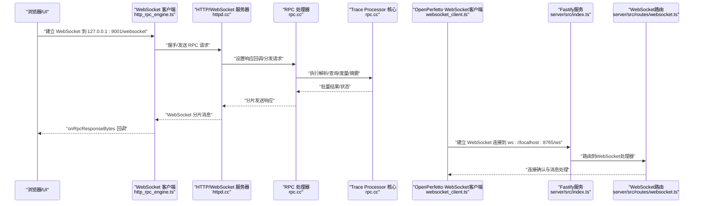

**图表来源**
- [http_rpc_engine.ts:47-110](file://ui/src/trace_processor/http_rpc_engine.ts#L47-L110)
- [httpd.cc:261-269](file://src/trace_processor/rpc/httpd.cc#L261-L269)
- [rpc.cc:138-294](file://src/trace_processor/rpc/rpc.cc#L138-L294)
- [websocket_client.ts:88-106](file://ui/src/plugins/org.openperfetto/services/websocket_client.ts#L88-L106)
- [index.ts（OpenPerfetto后端服务）:256-269](file://server/src/index.ts#L256-L269)

## 详细组件分析

### WebSocket 桥接服务
- 监听端口与端点映射：本地监听端口，将 /traced 映射到 traced Unix 套接字，/adb 映射到 ADB TCP 端点
- CORS 允许来源：默认允许 ui.perfetto.dev 与本地开发端口，支持命令行追加额外来源
- 连接生命周期：握手成功后建立双向转发；任一侧断开均清理对侧连接
- 错误处理：连接失败返回 500，握手失败返回 404，日志记录来源与错误

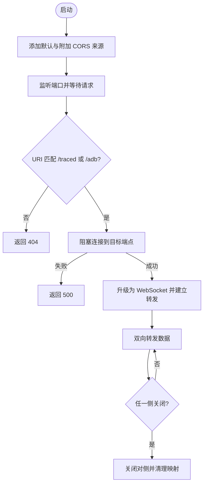

**图表来源**
- [websocket_bridge.cc:126-281](file://src/websocket_bridge/websocket_bridge.cc#L126-L281)

**章节来源**
- [websocket_bridge.h:22-24](file://src/websocket_bridge/websocket_bridge.h#L22-L24)
- [websocket_bridge.cc:126-281](file://src/websocket_bridge/websocket_bridge.cc#L126-L281)

### HTTP/WebSocket RPC 引擎（前端）
- 连接建立：首次发送时构造 WebSocket，注册 onopen/onmessage/onclose/onerror
- 连接恢复：连接断开码 1006 触发自动重连；已排队请求在重连后顺序发送
- 消息处理：收到 Blob 后入队，异步串行解包为 ArrayBuffer，回调上层引擎
- 连接探测：通过 /status 发送 POST，超时时间短，非致命错误便于 UI 探测

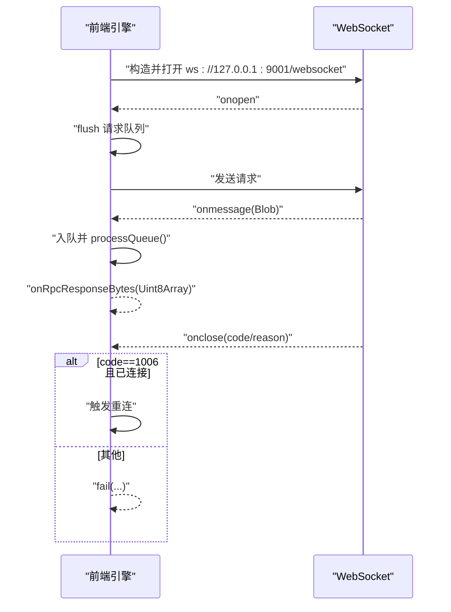

**图表来源**
- [http_rpc_engine.ts:47-110](file://ui/src/trace_processor/http_rpc_engine.ts#L47-L110)

**章节来源**
- [http_rpc_engine.ts:29-153](file://ui/src/trace_processor/http_rpc_engine.ts#L29-L153)

### RPC 通信协议与序列化
- 请求/响应模型：按序号 seq 维护请求序列，乱序则报错并断开
- 流式查询：查询结果以批次发送，批次大小约 128KB，避免额外堆分配
- 方法覆盖：支持解析、结束输入、查询、度量、摘要、状态、重置、SQL 包注册、汇总器管理等
- 错误处理：致命帧错误直接断开；单字段缺失返回错误信息；过大批次优雅降级

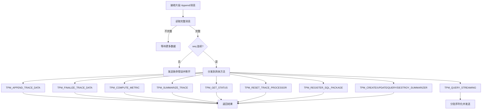

**图表来源**
- [rpc.cc:138-491](file://src/trace_processor/rpc/rpc.cc#L138-L491)

**章节来源**
- [rpc.cc:138-491](file://src/trace_processor/rpc/rpc.cc#L138-L491)

### WASM 桥接（前端）
- 模块选择：优先检测 Memory64 支持，否则回退到 Memory32；分别导入对应生成模块
- 初始化：初始化时注册回调函数，分配请求缓冲区地址，通过 ccall 传递给 C++ 端
- 请求分片：当请求超过固定缓冲区大小时，切分为多个片段写入堆并多次调用入口函数
- 响应回传：C++ 回调将堆中数据切片回传，使用 postMessage 传输并转移 ArrayBuffer
- 错误收集：捕获 stderr 最近若干行，崩溃时一并抛出

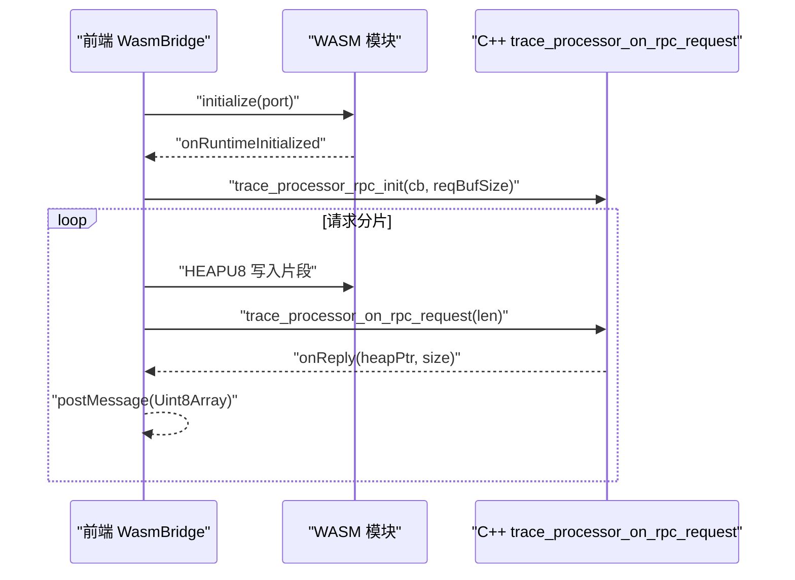

**图表来源**
- [wasm_bridge.ts:80-138](file://ui/src/engine/wasm_bridge.ts#L80-L138)
- [wasm_typescript_declaration.d.ts:47-68](file://gn/standalone/wasm_typescript_declaration.d.ts#L47-L68)

**章节来源**
- [wasm_bridge.ts:47-177](file://ui/src/engine/wasm_bridge.ts#L47-L177)
- [wasm_typescript_declaration.d.ts:17-68](file://gn/standalone/wasm_typescript_declaration.d.ts#L17-L68)
- [wasm_bridge.cc](file://src/trace_processor/rpc/wasm_bridge.cc)

### 数据流与增量更新
- 流式查询：查询结果以批次发送，前端可选择等待全部或增量消费
- 查询槽与缓存：单槽单条目缓存，支持"仅保留最新任务"与"单次条目缓存"，键变更时可选择复用旧数据
- 增量状态：测试用例演示了增量状态的重建与清理流程，确保状态一致性

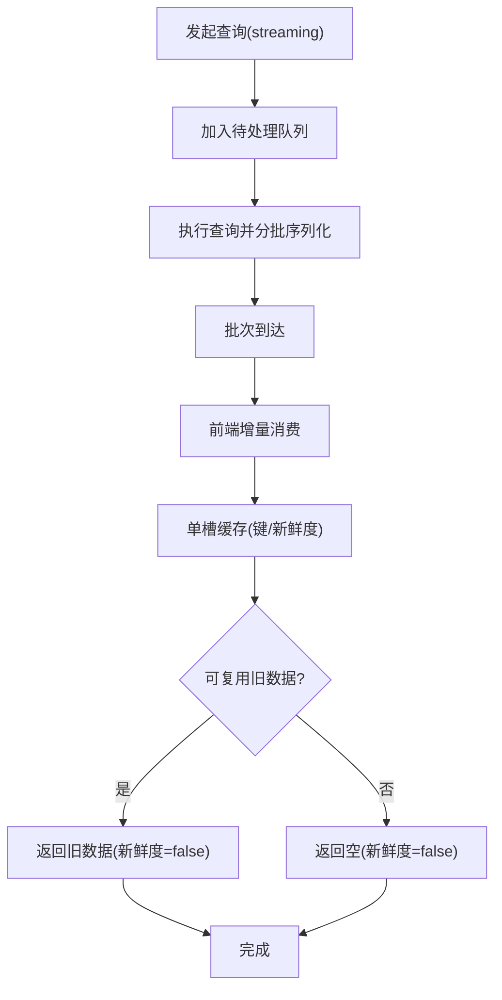

**图表来源**
- [rpc.cc:240-294](file://src/trace_processor/rpc/rpc.cc#L240-L294)
- [query_slot.ts:182-298](file://ui/src/base/query_slot.ts#L182-L298)

**章节来源**
- [rpc.cc:562-570](file://src/trace_processor/rpc/rpc.cc#L562-L570)
- [query_slot.ts:171-308](file://ui/src/base/query_slot.ts#L171-L308)

### 实时数据同步机制
- Timeline 同步插件：通过 BroadcastChannel 广播自身存在与视图边界，接收其他标签页的心跳与视图更新，进行映射与同步
- 心跳与去活：定期清理长时间未心跳的客户端，避免陈旧信息干扰
- 视图映射：基于初始视图边界计算比例，将远端视图映射到当前视图

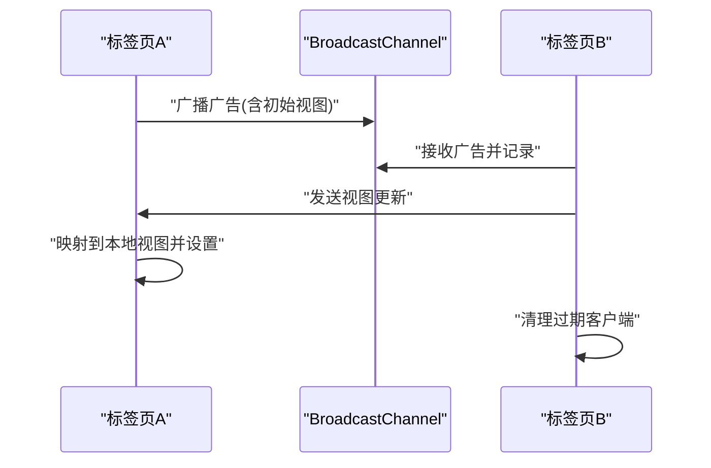

**图表来源**
- [index.ts（TimelineSync 插件）:325-361](file://ui/src/plugins/dev.perfetto.TimelineSync/index.ts#L325-L361)

**章节来源**
- [index.ts（TimelineSync 插件）:28-443](file://ui/src/plugins/dev.perfetto.TimelineSync/index.ts#L28-L443)

### HTTP/WebSocket 服务器（后端）
- CORS 默认来源：ui.perfetto.dev、本地开发端口
- 端点职责：/status 返回状态；/websocket 升级为 WebSocket；/rpc 与 /query 提供历史接口
- 分片发送：WebSocket 与 HTTP 分块传输统一使用 SendRpcChunk，异常时终止连接
- 序号校验：HTTP 也维护请求序号，确保顺序性

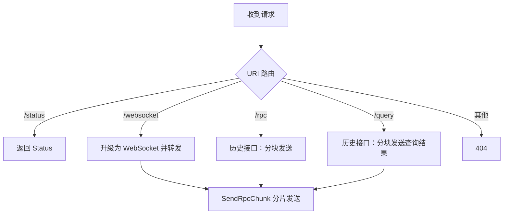

**图表来源**
- [httpd.cc:120-271](file://src/trace_processor/rpc/httpd.cc#L120-L271)

**章节来源**
- [httpd.cc:42-118](file://src/trace_processor/rpc/httpd.cc#L42-L118)
- [httpd.cc:120-271](file://src/trace_processor/rpc/httpd.cc#L120-L271)

## OpenPerfetto后端通信架构

### Fastify服务架构
OpenPerfetto后端采用Node.js Fastify框架构建高性能微服务，提供WebSocket通信、REST API和AI增强功能。

- **服务配置**：支持请求超时、连接超时配置，结构化日志记录，traceId追踪
- **中间件集成**：CORS、WebSocket、速率限制插件，统一错误处理与响应格式
- **优雅关机**：信号处理、连接池清理、会话管理销毁

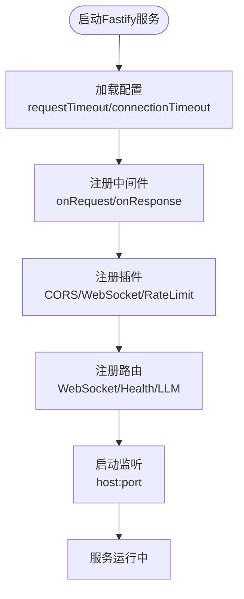

**图表来源**
- [index.ts（OpenPerfetto后端服务）:88-216](file://server/src/index.ts#L88-L216)

**章节来源**
- [index.ts（OpenPerfetto后端服务）:1-279](file://server/src/index.ts#L1-L279)

### WebSocket路由与消息处理
基于@fastify/websocket实现的WebSocket路由系统，支持连接池管理、消息路由和状态同步。

- **连接池管理**：connectionPool维护活跃连接，支持连接数限制和优雅关闭
- **消息路由**：根据消息类型分发到相应处理器，支持ping/pong心跳机制
- **状态同步**：会话状态管理，支持多客户端状态同步

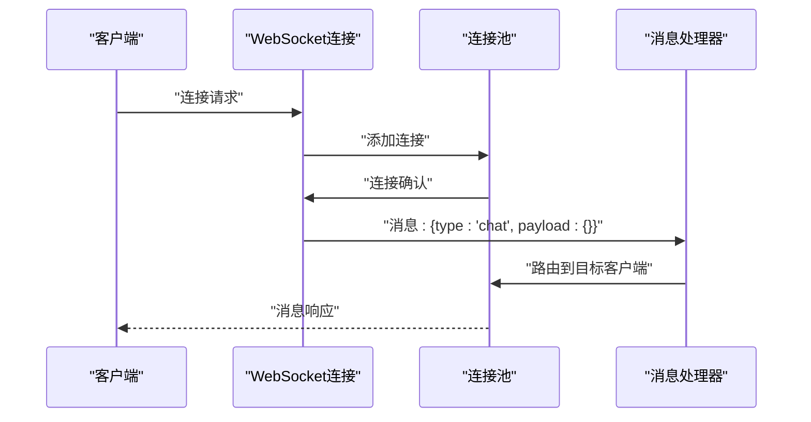

**图表来源**
- [websocket.ts（OpenPerfetto路由）:660-690](file://server/src/routes/websocket.ts#L660-L690)

**章节来源**
- [websocket.ts（OpenPerfetto路由）](file://server/src/routes/websocket.ts)

### 健康检查与监控
提供完整的健康检查API，支持服务状态、连接数、内存使用等指标监控。

- **健康状态**：status字段指示服务健康状态（ok/degraded/unhealthy）
- **运行时指标**：uptime格式化显示、内存使用统计（heapUsed/heapTotal/external/rss）
- **连接监控**：WebSocket连接数统计，支持实时连接状态查看

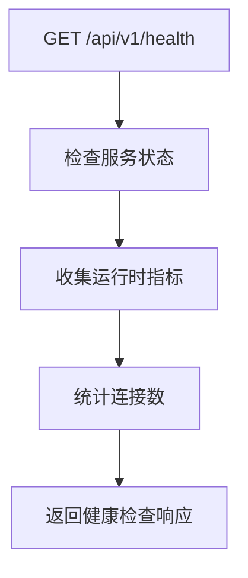

**图表来源**
- [health.ts（OpenPerfetto健康检查）:19-58](file://server/src/routes/health.ts#L19-L58)

**章节来源**
- [health.ts（OpenPerfetto健康检查）](file://server/src/routes/health.ts)

### 会话管理与状态同步
基于SessionManager的会话管理系统，支持多客户端状态同步和资源清理。

- **会话生命周期**：创建、维护、销毁完整的会话管理流程
- **状态同步**：支持多客户端间的状态同步与消息广播
- **资源清理**：优雅关机时的资源清理和连接池管理

**章节来源**
- [session_manager.ts（会话管理）](file://server/src/services/session_manager.ts)

## 依赖关系分析
- 前端依赖
  - http_rpc_engine.ts 依赖 Protobuf 解码器与 HTTP 工具，负责 WebSocket 生命周期与消息队列
  - wasm_bridge.ts 依赖生成的 WASM 模块与类型声明，负责 JS/WASM 互操作与内存指针转换
  - **新增** websocket_client.ts 依赖OpenPerfetto后端服务，负责AI增强功能的WebSocket通信
- 后端依赖
  - httpd.cc 依赖 base::HttpServer 与 WebSocket 升级能力，向 rpc.cc 注入响应回调
  - rpc.cc 依赖 QueryResultSerializer 与 TraceProcessor，负责解析、查询与度量
  - websocket_bridge.cc 依赖 base::HttpServer 与 base::UnixSocket，负责 CORS 与端点转发
  - **新增** server/src/index.ts 依赖Fastify框架与各种插件，构建完整的后端服务

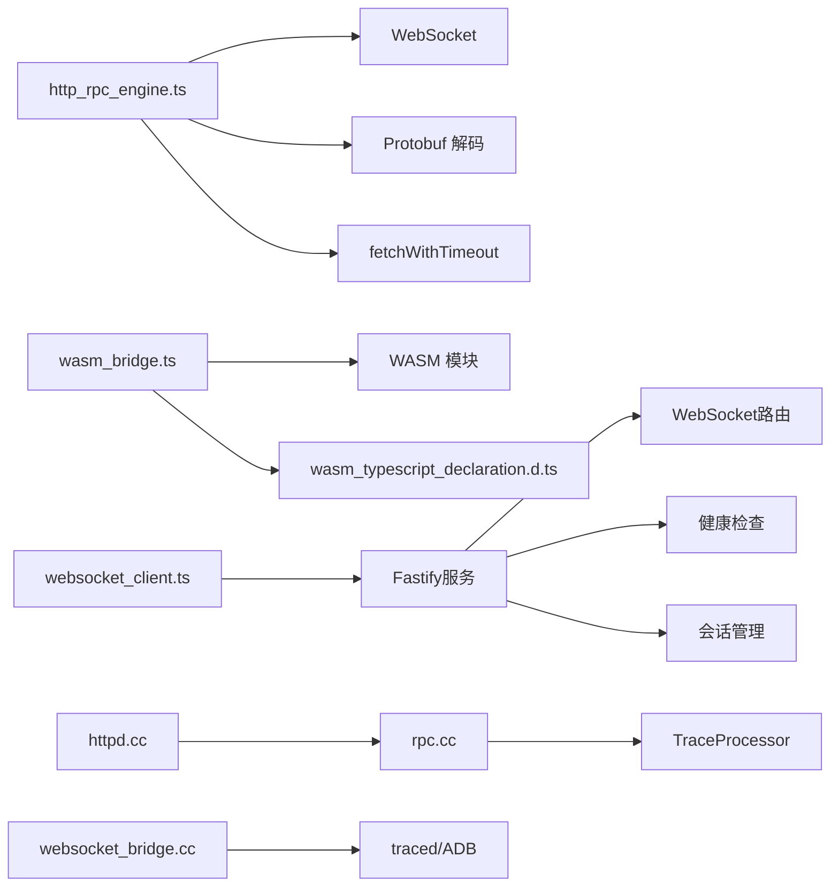

**图表来源**
- [http_rpc_engine.ts:15-19](file://ui/src/trace_processor/http_rpc_engine.ts#L15-L19)
- [wasm_bridge.ts:15-26](file://ui/src/engine/wasm_bridge.ts#L15-L26)
- [wasm_typescript_declaration.d.ts:17-68](file://gn/standalone/wasm_typescript_declaration.d.ts#L17-L68)
- [websocket_client.ts:15-27](file://ui/src/plugins/org.openperfetto/services/websocket_client.ts#L15-L27)
- [httpd.cc:53-99](file://src/trace_processor/rpc/httpd.cc#L53-L99)
- [rpc.cc:101-116](file://src/trace_processor/rpc/rpc.cc#L101-L116)
- [websocket_bridge.cc:152-174](file://src/websocket_bridge/websocket_bridge.cc#L152-L174)
- [index.ts（OpenPerfetto后端服务）:168-216](file://server/src/index.ts#L168-L216)

**章节来源**
- [http_rpc_engine.ts:15-19](file://ui/src/trace_processor/http_rpc_engine.ts#L15-L19)
- [wasm_bridge.ts:15-26](file://ui/src/engine/wasm_bridge.ts#L15-L26)
- [wasm_typescript_declaration.d.ts:17-68](file://gn/standalone/wasm_typescript_declaration.d.ts#L17-L68)
- [websocket_client.ts:15-27](file://ui/src/plugins/org.openperfetto/services/websocket_client.ts#L15-L27)
- [httpd.cc:53-99](file://src/trace_processor/rpc/httpd.cc#L53-L99)
- [rpc.cc:101-116](file://src/trace_processor/rpc/rpc.cc#L101-L116)
- [websocket_bridge.cc:152-174](file://src/websocket_bridge/websocket_bridge.cc#L152-L174)
- [index.ts（OpenPerfetto后端服务）:168-216](file://server/src/index.ts#L168-L216)

## 性能考量
- 批处理与分片：RPC 查询采用约 128KB 批次，减少堆分配与网络往返
- 内存管理：WASM 使用固定大小请求缓冲区，必要时分片写入；Memory64/Memory32 自动适配
- 队列与并发：前端 WebSocket 引擎串行处理消息队列，避免并发竞争
- 进度与统计：RPC 层打印解析进度，便于诊断吞吐与瓶颈
- 缓存策略：查询槽单条目缓存与键比较，支持在键变化时复用旧数据，降低重复查询成本
- **新增** 连接池优化：OpenPerfetto后端使用连接池管理WebSocket连接，支持连接数限制和资源回收
- **新增** 速率限制：Fastify rate-limit插件防止恶意请求和资源滥用
- **新增** 结构化日志：统一的日志格式和traceId追踪，便于性能分析和问题定位

**章节来源**
- [rpc.cc:58-97](file://src/trace_processor/rpc/rpc.cc#L58-L97)
- [wasm_bridge.ts:31-36](file://ui/src/engine/wasm_bridge.ts#L31-L36)
- [wasm_bridge.ts:140-157](file://ui/src/engine/wasm_bridge.ts#L140-L157)
- [rpc.cc:593-605](file://src/trace_processor/rpc/rpc.cc#L593-L605)
- [query_slot.ts:182-298](file://ui/src/base/query_slot.ts#L182-L298)
- [index.ts（OpenPerfetto后端服务）:183-196](file://server/src/index.ts#L183-L196)

## 故障排查指南
- WebSocket 断开与重连
  - 现象：macOS 关盖导致 1006 断开
  - 处理：前端自动重连并刷新队列；若非 1006，标记失败
- 连接探测失败
  - 现象：/status 404/超时
  - 处理：记录失败原因，不影响 UI 其他功能
- RPC 序列错乱
  - 现象：请求序号不连续
  - 处理：服务端发送致命错误并断开，需重新建立连接
- WASM 崩溃
  - 现象：调用入口抛出异常
  - 处理：收集最近 stderr 行，合并到错误信息中抛出
- Service Worker 更新
  - 现象：新版本可用
  - 处理：通过控制器监听 updatefound 事件并提示用户
- **新增** OpenPerfetto后端服务故障
  - 现象：WebSocket连接失败、健康检查异常
  - 处理：检查服务日志、连接池状态、会话管理器状态
- **新增** 速率限制触发
  - 现象：429 Too Many Requests错误
  - 处理：检查客户端请求频率，调整速率限制配置

**章节来源**
- [http_rpc_engine.ts:77-89](file://ui/src/trace_processor/http_rpc_engine.ts#L77-L89)
- [http_rpc_engine.ts:112-139](file://ui/src/trace_processor/http_rpc_engine.ts#L112-L139)
- [rpc.cc:194-208](file://src/trace_processor/rpc/rpc.cc#L194-L208)
- [wasm_bridge.ts:111-119](file://ui/src/engine/wasm_bridge.ts#L111-L119)
- [service_worker_controller.ts:136-151](file://ui/src/frontend/service_worker_controller.ts#L136-L151)
- [index.ts（OpenPerfetto后端服务）:235-250](file://server/src/index.ts#L235-L250)

## 结论
该系统通过 HTTP/WebSocket 与本地 RPC 服务实现高性能、低延迟的数据处理与可视化；WASM 桥接进一步提升前端可扩展性与资源利用效率；WebSocket 桥接为 Android/设备侧调试提供便捷通道；**新增的OpenPerfetto后端服务**通过Node.js Fastify微服务架构提供AI增强功能，包括WebSocket通信、健康检查、会话管理和速率限制等企业级特性；查询槽与插件广播通道保障了 UI 的实时同步与一致体验。配合完善的错误处理、序列化与缓存策略，整体具备良好的稳定性与可观测性。

## 附录
- 安全与防护
  - CORS：默认允许 ui.perfetto.dev 与本地开发端口；可通过命令行追加来源
  - 身份验证：当前实现未内置认证；建议在反向代理层启用认证与 TLS
  - 数据加密：建议通过 HTTPS/WS 与反向代理开启 TLS
  - **新增** 速率限制：Fastify rate-limit插件防止恶意请求和资源滥用
  - **新增** 错误分类：统一的错误分类和响应格式，便于客户端处理
- 离线与缓存
  - Service Worker：监听安装与更新事件，支持离线提示
  - 查询缓存：单槽缓存与键比较，支持在键变化时复用旧数据
  - **新增** 连接池：WebSocket连接池管理，支持连接数限制和资源回收
- 性能监控
  - 网络延迟：WebSocket 连接探测与分片传输统计
  - 传输统计：RPC 层打印解析进度，辅助定位瓶颈
  - 连接健康：序列号校验与错误断开，确保一致性
  - **新增** 服务监控：健康检查API提供实时服务状态和性能指标
  - **新增** 日志追踪：结构化日志和traceId追踪，便于问题定位
- **新增** OpenPerfetto后端服务特性
  - 微服务架构：基于Fastify的高性能Node.js服务
  - WebSocket路由：支持消息路由和状态同步
  - 会话管理：多客户端状态同步和资源管理
  - 企业级特性：CORS、速率限制、优雅关机等

**章节来源**
- [websocket_bridge.cc:152-170](file://src/websocket_bridge/websocket_bridge.cc#L152-L170)
- [httpd.cc:104-111](file://src/trace_processor/rpc/httpd.cc#L104-L111)
- [rpc.cc:593-605](file://src/trace_processor/rpc/rpc.cc#L593-L605)
- [service_worker_controller.ts:136-151](file://ui/src/frontend/service_worker_controller.ts#L136-L151)
- [query_slot.ts:182-298](file://ui/src/base/query_slot.ts#L182-L298)
- [index.ts（OpenPerfetto后端服务）:170-196](file://server/src/index.ts#L170-L196)
- [health.ts（OpenPerfetto健康检查）:19-58](file://server/src/routes/health.ts#L19-L58)
- [implementation-spec.md（OpenPerfetto实现规格）](file://docs/openperfetto/implementation-spec.md)