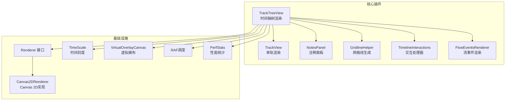
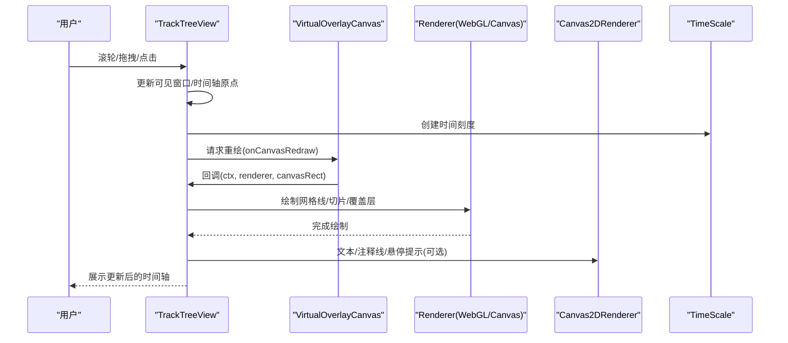
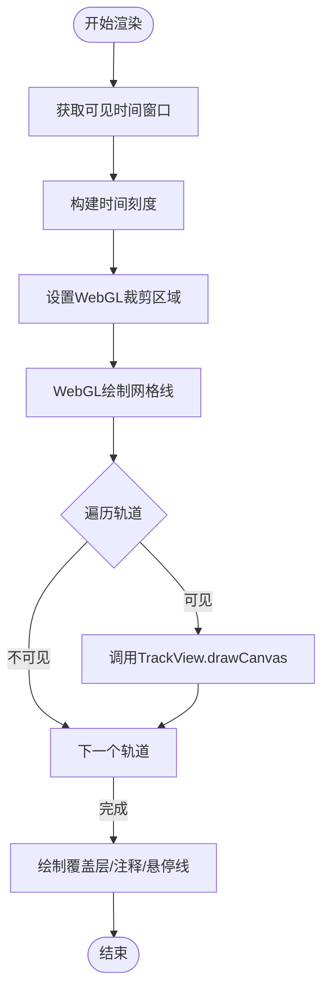
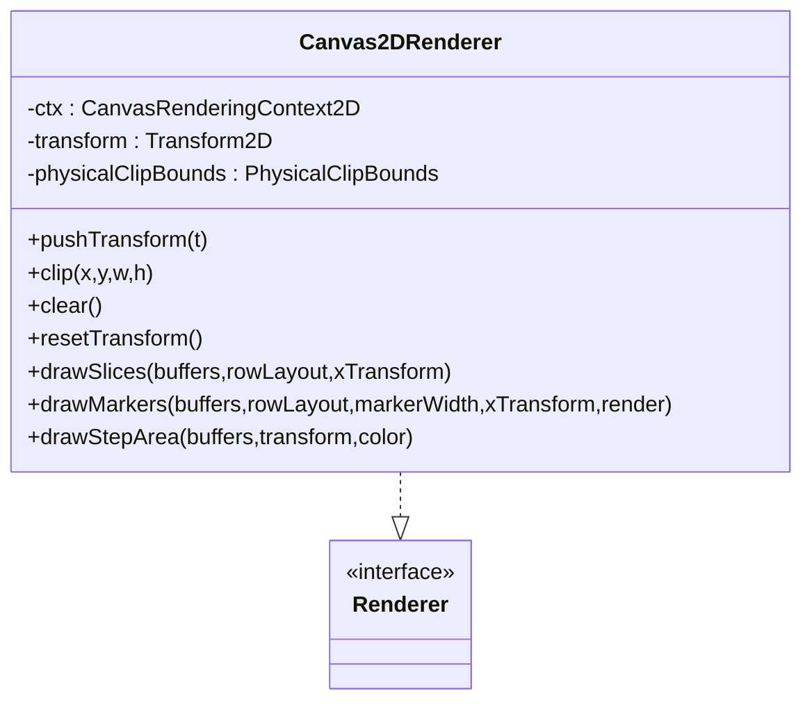
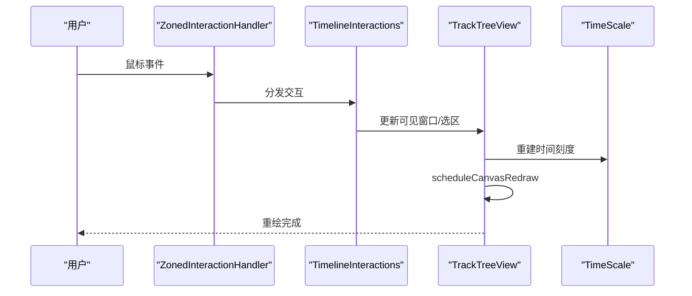
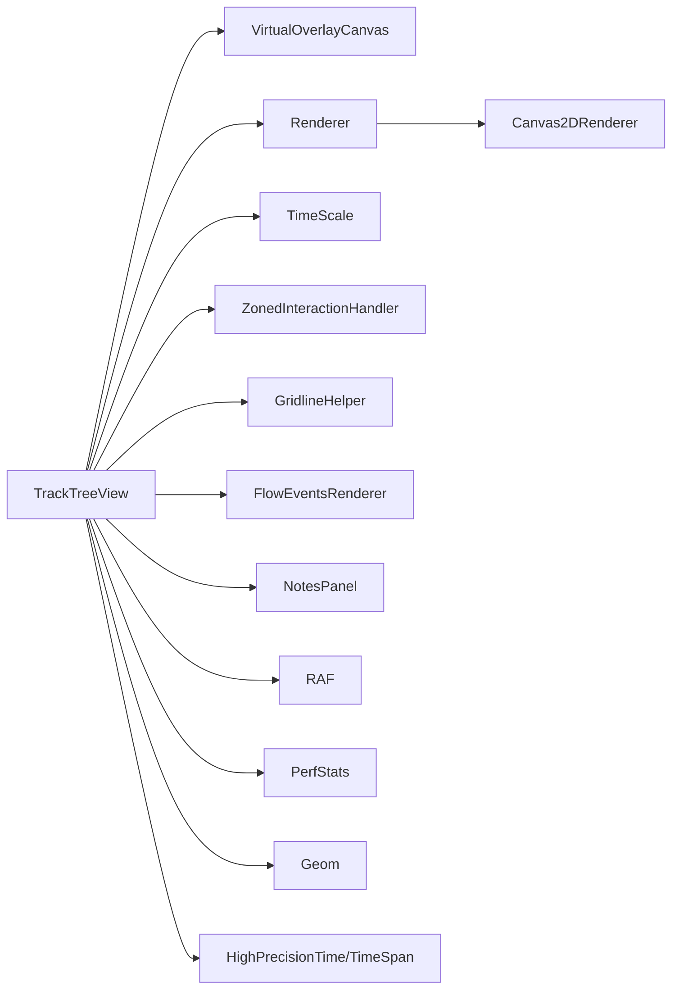

# 时间轴可视化

<cite>
**本文引用的文件**
- [track_tree_view.ts](file://ui/src/core_plugins/dev.perfetto.Timeline/track_tree_view.ts)
- [canvas2d_renderer.ts](file://ui/src/base/canvas2d_renderer.ts)
- [notes_panel.ts](file://ui/src/core_plugins/dev.perfetto.Timeline/notes_panel.ts)
- [gridline_helper.ts](file://ui/src/core_plugins/dev.perfetto.Timeline/gridline_helper.ts)
- [timeline_interactions.ts](file://ui/src/core_plugins/dev.perfetto.Timeline/timeline_interactions.ts)
- [track_view.ts](file://ui/src/core_plugins/dev.perfetto.Timeline/track_view.ts)
- [virtual_overlay_canvas.ts](file://ui/src/widgets/virtual_overlay_canvas.ts)
- [renderer.ts](file://ui/src/base/renderer.ts)
- [time_scale.ts](file://ui/src/base/time_scale.ts)
- [high_precision_time.ts](file://ui/src/base/high_precision_time.ts)
- [high_precision_time_span.ts](file://ui/src/base/high_precision_time_span.ts)
- [vertical_line_helper.ts](file://ui/src/base/vertical_line_helper.ts)
- [css_constants.ts](file://ui/src/frontend/css_constants.ts)
- [zoned_interaction_handler.ts](file://ui/src/base/zoned_interaction_handler.ts)
- [geom.ts](file://ui/src/base/geom.ts)
- [perf_stats.ts](file://ui/src/core/perf_stats.ts)
- [trace_impl.ts](file://ui/src/core/trace_impl.ts)
- [empty_state.ts](file://ui/src/widgets/empty_state.ts)
- [button.ts](file://ui/src/widgets/button.ts)
- [cursor_tooltip.ts](file://ui/src/widgets/cursor_tooltip.ts)
- [canvas_colors.ts](file://ui/src/public/canvas_colors.ts)
- [semantic_icons.ts](file://ui/src/base/semantic_icons.ts)
- [common.ts](file://ui/src/widgets/common.ts)
- [flow_events_renderer.ts](file://ui/src/core_plugins/dev.perfetto.Timeline/flow_events_renderer.ts)
- [feature_flags.ts](file://ui/src/core/feature_flags.ts)
- [raf.ts](file://ui/src/core/raf.ts)
- [selection.ts](file://ui/src/core/selection.ts)
- [timeline_page.scss](file://ui/src/assets/timeline_page.scss)
- [timeline_toolbar.scss](file://ui/src/assets/timeline_toolbar.scss)
- [minimap.scss](file://ui/src/assets/minimap.scss)
- [theme.scss](file://ui/src/assets/theme.scss)
- [topbar.scss](file://ui/src/assets/topbar.scss)
- [sidebar.scss](file://ui/src/assets/sidebar.scss)
- [statusbar.scss](file://ui/src/assets/statusbar.scss)
- [details.scss](file://ui/src/assets/details.scss)
- [cookie_consent.scss](file://ui/src/assets/cookie_consent.scss)
- [help_modal.scss](file://ui/src/assets/help_modal.scss)
- [perf_monitor.scss](file://ui/src/assets/perf_monitor.scss)
- [bigtrace.html](file://ui/src/assets/bigtrace.html)
- [index.html](file://ui/src/assets/index.html)
- [perfetto.scss](file://ui/src/assets/perfetto.scss)
- [typefaces.scss](file://ui/src/assets/typefaces.scss)
- [common.scss](file://ui/src/assets/common.scss)
- [theme_provider.scss](file://ui/src/assets/theme_provider.scss)
- [build.js](file://ui/build.js)
- [package.json](file://ui/package.json)
- [eslint.config.js](file://ui/eslint.config.js)
- [playwright.config.ts](file://ui/playwright.config.ts)
- [pnpm-lock.yaml](file://ui/pnpm-lock.yaml)
- [tsconfig.base.json](file://ui/tsconfig.base.json)
- [tsconfig.json](file://ui/tsconfig.json)
- [BUILD.gn](file://ui/BUILD.gn)
- [README.md](file://ui/README.md)
</cite>

## 目录
1. [简介](#简介)
2. [项目结构](#项目结构)
3. [核心组件](#核心组件)
4. [架构总览](#架构总览)
5. [详细组件分析](#详细组件分析)
6. [依赖关系分析](#依赖关系分析)
7. [性能考量](#性能考量)
8. [故障排查指南](#故障排查指南)
9. [结论](#结论)
10. [附录](#附录)

## 简介
本技术文档面向Perfetto时间轴可视化系统，聚焦于时间轴渲染引擎、Canvas 2D与WebGL混合渲染、虚拟滚动、交互体系（缩放/平移/注释/标记）、实时数据更新与增量渲染、以及可扩展的轨迹组件开发指南。文档同时覆盖响应式设计与移动端适配实践，帮助开发者快速理解并扩展时间轴可视化能力。

## 项目结构
时间轴可视化主要位于UI前端工程中，核心模块包括：
- 核心插件：dev.perfetto.Timeline（时间轴主渲染、交互、注释面板）
- 基础设施：Canvas2D渲染器、时间刻度、几何工具、RAF调度、性能统计
- 轨迹视图：TrackView负责单条轨迹的绘制与DOM桥接
- 虚拟画布：VirtualOverlayCanvas提供大列表场景下的虚拟滚动与按需重绘
- 样式与主题：SCSS主题与页面布局样式

**图表来源**
- [track_tree_view.ts:156-359](file://ui/src/core_plugins/dev.perfetto.Timeline/track_tree_view.ts#L156-L359)
- [canvas2d_renderer.ts:43-331](file://ui/src/base/canvas2d_renderer.ts#L43-L331)
- [virtual_overlay_canvas.ts](file://ui/src/widgets/virtual_overlay_canvas.ts)
- [renderer.ts](file://ui/src/base/renderer.ts)
- [time_scale.ts](file://ui/src/base/time_scale.ts)
- [notes_panel.ts:98-106](file://ui/src/core_plugins/dev.perfetto.Timeline/notes_panel.ts#L98-L106)
- [gridline_helper.ts](file://ui/src/core_plugins/dev.perfetto.Timeline/gridline_helper.ts)
- [timeline_interactions.ts](file://ui/src/core_plugins/dev.perfetto.Timeline/timeline_interactions.ts)
- [flow_events_renderer.ts](file://ui/src/core_plugins/dev.perfetto.Timeline/flow_events_renderer.ts)

**章节来源**
- [track_tree_view.ts:15-120](file://ui/src/core_plugins/dev.perfetto.Timeline/track_tree_view.ts#L15-L120)
- [README.md:1-51](file://ui/README.md#L1-L51)

## 核心组件
- TrackTreeView：时间轴主容器，负责虚拟滚动、网格线、轨迹批量绘制、交互注册、注释与悬停线绘制、覆盖层渲染与性能统计。
- Canvas2DRenderer：在WebGL不可用或禁用时的Canvas 2D回退实现，提供切片、标记、阶梯面积等绘制方法，并进行CPU侧裁剪与变换管理。
- VirtualOverlayCanvas：虚拟画布，仅在可见区域绘制，极大降低DOM与Canvas重绘成本。
- TrackView：单条轨迹的视图包装，承载DOM节点与Canvas绘制回调。
- NotesPanel：注释面板，支持点击、悬停、拖拽选择时间区间，与主时间轴联动。
- GridlineHelper：基于时间刻度生成网格线位置，用于WebGL批量绘制。
- TimelineInteractions：封装拖拽平移、滚轮缩放、区域选择、手柄调整等交互。
- FlowEventsRenderer：渲染跨时间轴的流事件（如数据流、调用链）。
- Renderer接口与实现：统一抽象WebGL与Canvas 2D绘制，支持变换、裁剪、缓冲区批处理。

**章节来源**
- [track_tree_view.ts:418-487](file://ui/src/core_plugins/dev.perfetto.Timeline/track_tree_view.ts#L418-L487)
- [canvas2d_renderer.ts:43-331](file://ui/src/base/canvas2d_renderer.ts#L43-L331)
- [virtual_overlay_canvas.ts](file://ui/src/widgets/virtual_overlay_canvas.ts)
- [track_view.ts](file://ui/src/core_plugins/dev.perfetto.Timeline/track_view.ts)
- [notes_panel.ts:98-106](file://ui/src/core_plugins/dev.perfetto.Timeline/notes_panel.ts#L98-L106)
- [gridline_helper.ts](file://ui/src/core_plugins/dev.perfetto.Timeline/gridline_helper.ts)
- [timeline_interactions.ts](file://ui/src/core_plugins/dev.perfetto.Timeline/timeline_interactions.ts)
- [flow_events_renderer.ts](file://ui/src/core_plugins/dev.perfetto.Timeline/flow_events_renderer.ts)
- [renderer.ts](file://ui/src/base/renderer.ts)

## 架构总览
时间轴渲染采用“WebGL矩形 + Canvas 2D文本/装饰”的混合策略：WebGL负责大量矩形切片与网格线的高性能绘制，Canvas 2D负责文本、注释线、悬停提示等精细内容。通过VirtualOverlayCanvas实现虚拟滚动，仅对可见区域进行绘制；通过ZonedInteractionHandler集中处理交互事件；通过RAF调度保证流畅重绘。

**图表来源**
- [track_tree_view.ts:418-487](file://ui/src/core_plugins/dev.perfetto.Timeline/track_tree_view.ts#L418-L487)
- [canvas2d_renderer.ts:43-331](file://ui/src/base/canvas2d_renderer.ts#L43-L331)
- [virtual_overlay_canvas.ts](file://ui/src/widgets/virtual_overlay_canvas.ts)
- [time_scale.ts](file://ui/src/base/time_scale.ts)

## 详细组件分析

### 时间轴渲染引擎（TrackTreeView）
- 虚拟滚动与可见性判断：根据浮动画布矩形与轨道垂直边界计算是否需要绘制，避免全量重绘。
- 网格线绘制：基于时间刻度生成主刻度位置，使用Slice缓冲区以WebGL批量绘制1px宽垂直线。
- 轨迹绘制：遍历可见轨道，调用TrackView.drawCanvas进行各自渲染；支持性能统计与调试容器。
- 注释与悬停：绘制悬停光标与注释时间线，支持半透明跨度标记。
- 交互集成：注册拖拽平移、滚轮导航、区域选择、手柄调整等交互，支持吸附到轨道快。
- 覆盖层：渲染额外的覆盖物（如工具提示、标注框等）。

**图表来源**
- [track_tree_view.ts:418-487](file://ui/src/core_plugins/dev.perfetto.Timeline/track_tree_view.ts#L418-L487)
- [gridline_helper.ts](file://ui/src/core_plugins/dev.perfetto.Timeline/gridline_helper.ts)
- [vertical_line_helper.ts](file://ui/src/base/vertical_line_helper.ts)

**章节来源**
- [track_tree_view.ts:418-487](file://ui/src/core_plugins/dev.perfetto.Timeline/track_tree_view.ts#L418-L487)
- [track_tree_view.ts:552-586](file://ui/src/core_plugins/dev.perfetto.Timeline/track_tree_view.ts#L552-L586)
- [track_tree_view.ts:588-786](file://ui/src/core_plugins/dev.perfetto.Timeline/track_tree_view.ts#L588-L786)
- [track_tree_view.ts:829-932](file://ui/src/core_plugins/dev.perfetto.Timeline/track_tree_view.ts#L829-L932)
- [track_tree_view.ts:934-1003](file://ui/src/core_plugins/dev.perfetto.Timeline/track_tree_view.ts#L934-L1003)

### Canvas 2D渲染器（Canvas2DRenderer）
- 变换与裁剪：保存/恢复上下文，维护当前2D变换矩阵；将裁剪区域转换为物理坐标进行CPU侧裁剪。
- 批量绘制：
  - drawSlices：将切片缓冲区（起止时间、深度、颜色、图案）映射到屏幕像素，进行颜色合并与必要时的渐变/斜纹叠加。
  - drawMarkers：绘制标记（如事件点），支持按颜色分组减少状态切换。
  - drawStepArea：阶梯面积填充与描边，支持透明度与范围指示器。
- 性能优化：CPU侧裁剪与颜色缓存，避免不必要的绘制与状态变更。

**图表来源**
- [canvas2d_renderer.ts:43-331](file://ui/src/base/canvas2d_renderer.ts#L43-L331)
- [renderer.ts](file://ui/src/base/renderer.ts)

**章节来源**
- [canvas2d_renderer.ts:43-331](file://ui/src/base/canvas2d_renderer.ts#L43-L331)

### 虚拟滚动与按需重绘（VirtualOverlayCanvas）
- 仅在可见区域触发重绘，显著降低DOM与Canvas绘制开销。
- 通过回调注入onCanvasRedraw，传入Canvas上下文、渲染器与浮动画布矩形，驱动主渲染循环。
- 与TrackTreeView配合，滚动时动态刷新DOM以维持视口内轨道的高质量渲染。

**章节来源**
- [track_tree_view.ts:320-356](file://ui/src/core_plugins/dev.perfetto.Timeline/track_tree_view.ts#L320-L356)
- [virtual_overlay_canvas.ts](file://ui/src/widgets/virtual_overlay_canvas.ts)

### 缩放与平移交互（TimelineInteractions）
- 拖拽平移：Shift+拖拽实现全局时间轴平移，支持ZonedInteractionHandler区域化处理。
- 滚轮缩放：滚轮改变时间轴范围，结合时间刻度与可见窗口更新。
- 区域选择：拖拽创建时间区间，支持吸附到轨道快，显示半透明吸附线。
- 手柄调整：拖动区域端点调整起止时间，实时预览选区。

**图表来源**
- [track_tree_view.ts:588-786](file://ui/src/core_plugins/dev.perfetto.Timeline/track_tree_view.ts#L588-L786)
- [timeline_interactions.ts](file://ui/src/core_plugins/dev.perfetto.Timeline/timeline_interactions.ts)

**章节来源**
- [track_tree_view.ts:588-786](file://ui/src/core_plugins/dev.perfetto.Timeline/track_tree_view.ts#L588-L786)

### 注释与标记系统（NotesPanel）
- 支持点击时间轴添加注释、悬停显示注释时间线、拖拽调整注释区间。
- 默认标记与跨度标记分别以垂直线与半透明区间标识。
- 与主时间轴共享时间刻度，确保跨面板一致的视觉定位。

**章节来源**
- [notes_panel.ts:71-111](file://ui/src/core_plugins/dev.perfetto.Timeline/notes_panel.ts#L71-L111)
- [notes_panel.ts:98-106](file://ui/src/core_plugins/dev.perfetto.Timeline/notes_panel.ts#L98-L106)
- [track_tree_view.ts:966-1003](file://ui/src/core_plugins/dev.perfetto.Timeline/track_tree_view.ts#L966-L1003)

### 实时数据更新与增量渲染
- RAF调度：通过RAF回调统一触发Canvas重绘，避免帧抖动。
- 增量更新：仅在可见窗口变化、交互事件或数据到达时触发重绘。
- 状态同步：选区、悬停时间戳、注释状态与时间轴状态保持一致。

**章节来源**
- [track_tree_view.ts:320-356](file://ui/src/core_plugins/dev.perfetto.Timeline/track_tree_view.ts#L320-L356)
- [track_tree_view.ts:438-487](file://ui/src/core_plugins/dev.perfetto.Timeline/track_tree_view.ts#L438-L487)

### 自定义轨迹组件开发指南
- 渲染接口：实现轨迹渲染器的drawCanvas方法，接收时间轴可见窗口、颜色常量、Renderer实例与性能统计开关。
- 事件处理：利用TrackView提供的DOM桥接，注册hover、click、drag等事件回调。
- 样式定制：通过CSS常量与主题变量控制颜色、字体与间距；必要时引入自定义SCSS。
- 数据绑定：从TraceImpl访问轨迹数据与时间轴状态，确保与全局状态同步。

**章节来源**
- [track_view.ts](file://ui/src/core_plugins/dev.perfetto.Timeline/track_view.ts)
- [css_constants.ts](file://ui/src/frontend/css_constants.ts)
- [canvas_colors.ts](file://ui/src/public/canvas_colors.ts)

### 响应式设计与移动端适配
- 布局：时间轴页面、工具栏、侧边栏、状态栏、顶部栏采用模块化SCSS组织，支持不同屏幕尺寸。
- 主题：主题与Provider SCSS提供深浅色切换与一致性风格。
- 移动端：建议在触摸设备上优先使用手势缩放与拖拽，结合CSS媒体查询与弹性布局提升可用性。

**章节来源**
- [timeline_page.scss](file://ui/src/assets/timeline_page.scss)
- [timeline_toolbar.scss](file://ui/src/assets/timeline_toolbar.scss)
- [minimap.scss](file://ui/src/assets/minimap.scss)
- [theme.scss](file://ui/src/assets/theme.scss)
- [topbar.scss](file://ui/src/assets/topbar.scss)
- [sidebar.scss](file://ui/src/assets/sidebar.scss)
- [statusbar.scss](file://ui/src/assets/statusbar.scss)
- [details.scss](file://ui/src/assets/details.scss)
- [cookie_consent.scss](file://ui/src/assets/cookie_consent.scss)
- [help_modal.scss](file://ui/src/assets/help_modal.scss)
- [perf_monitor.scss](file://ui/src/assets/perf_monitor.scss)
- [bigtrace.html](file://ui/src/assets/bigtrace.html)
- [index.html](file://ui/src/assets/index.html)
- [perfetto.scss](file://ui/src/assets/perfetto.scss)
- [typefaces.scss](file://ui/src/assets/typefaces.scss)
- [common.scss](file://ui/src/assets/common.scss)
- [theme_provider.scss](file://ui/src/assets/theme_provider.scss)

## 依赖关系分析
- TrackTreeView依赖：VirtualOverlayCanvas、Renderer、TimeScale、ZonedInteractionHandler、GridlineHelper、FlowEventsRenderer、NotesPanel、RAF、PerfStats。
- Renderer抽象：Canvas2DRenderer实现接口，作为WebGL不可用时的回退。
- 几何与时间：Geom、TimeScale、HighPrecisionTime/TimeSpan支撑坐标转换与时间计算。
- 交互：ZonedInteractionHandler集中处理多区域交互，避免事件冲突。
- 样式：CSS常量与主题SCSS统一视觉语言。

**图表来源**
- [track_tree_view.ts:156-359](file://ui/src/core_plugins/dev.perfetto.Timeline/track_tree_view.ts#L156-L359)
- [canvas2d_renderer.ts:43-331](file://ui/src/base/canvas2d_renderer.ts#L43-L331)
- [renderer.ts](file://ui/src/base/renderer.ts)
- [time_scale.ts](file://ui/src/base/time_scale.ts)
- [zoned_interaction_handler.ts](file://ui/src/base/zoned_interaction_handler.ts)
- [geom.ts](file://ui/src/base/geom.ts)
- [high_precision_time.ts](file://ui/src/base/high_precision_time.ts)
- [high_precision_time_span.ts](file://ui/src/base/high_precision_time_span.ts)

**章节来源**
- [track_tree_view.ts:156-359](file://ui/src/core_plugins/dev.perfetto.Timeline/track_tree_view.ts#L156-L359)

## 性能考量
- 虚拟滚动：仅绘制可见轨道，减少DOM与Canvas绘制数量。
- WebGL批处理：网格线与切片使用缓冲区批量绘制，降低状态切换与调用次数。
- CPU侧裁剪：Canvas2DRenderer在绘制前进行物理坐标裁剪，避免无效像素写入。
- 颜色缓存：CSS颜色到RGBA打包缓存，减少重复解析。
- 交互节流：RAF统一调度，避免高频重绘导致掉帧。
- 性能统计：内置PerfStats记录渲染耗时与轨道数量，辅助定位瓶颈。

**章节来源**
- [track_tree_view.ts:818-827](file://ui/src/core_plugins/dev.perfetto.Timeline/track_tree_view.ts#L818-L827)
- [canvas2d_renderer.ts:104-121](file://ui/src/base/canvas2d_renderer.ts#L104-L121)
- [canvas2d_renderer.ts:290-319](file://ui/src/base/canvas2d_renderer.ts#L290-L319)

## 故障排查指南
- 无渲染或渲染异常：
  - 检查VirtualOverlayCanvas是否正确注入onCanvasRedraw回调。
  - 确认Renderer启用状态与WebGL可用性。
- 交互无效：
  - 核查ZonedInteractionHandler目标元素与生命周期挂载。
  - 确认Shift+拖拽与滚轮缩放的事件绑定。
- 注释/悬停线不显示：
  - 检查时间刻度与时间轴原点是否正确。
  - 确认注释时间戳与可见窗口重叠。
- 性能下降：
  - 启用PerfStats观察渲染耗时与轨道数量。
  - 关闭WebGL验证Canvas回退路径是否正常。

**章节来源**
- [track_tree_view.ts:320-356](file://ui/src/core_plugins/dev.perfetto.Timeline/track_tree_view.ts#L320-L356)
- [track_tree_view.ts:588-786](file://ui/src/core_plugins/dev.perfetto.Timeline/track_tree_view.ts#L588-L786)
- [track_tree_view.ts:934-1003](file://ui/src/core_plugins/dev.perfetto.Timeline/track_tree_view.ts#L934-L1003)
- [perf_stats.ts](file://ui/src/core/perf_stats.ts)

## 结论
Perfetto时间轴可视化通过“WebGL矩形 + Canvas 2D文本/装饰”的混合渲染、虚拟滚动与集中交互处理，实现了大规模轨迹的高效可视化。依托统一的Renderer抽象与严格的性能统计，系统在复杂场景下仍能保持流畅体验。开发者可基于TrackView与Renderer接口快速扩展自定义轨迹组件，并通过注释与标记系统增强分析能力。

## 附录
- 构建与运行：参考UI工程README与构建脚本，安装依赖后启动开发服务器。
- 测试：单元测试与端到端截图对比测试保障UI稳定性。
- 配置：ESLint、TypeScript配置与包管理文件确保代码质量与依赖一致性。

**章节来源**
- [README.md:1-51](file://ui/README.md#L1-L51)
- [build.js](file://ui/build.js)
- [package.json](file://ui/package.json)
- [eslint.config.js](file://ui/eslint.config.js)
- [playwright.config.ts](file://ui/playwright.config.ts)
- [pnpm-lock.yaml](file://ui/pnpm-lock.yaml)
- [tsconfig.base.json](file://ui/tsconfig.base.json)
- [tsconfig.json](file://ui/tsconfig.json)
- [BUILD.gn](file://ui/BUILD.gn)