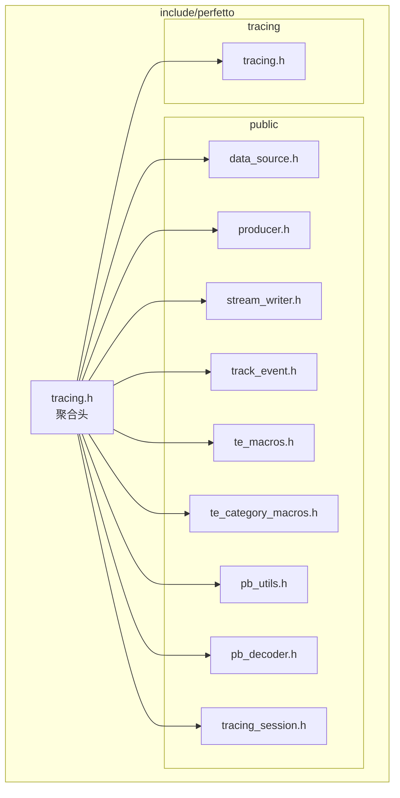
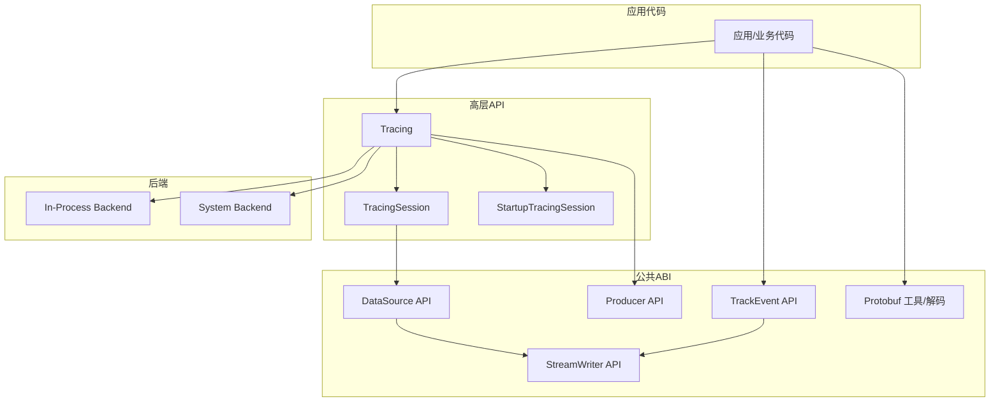
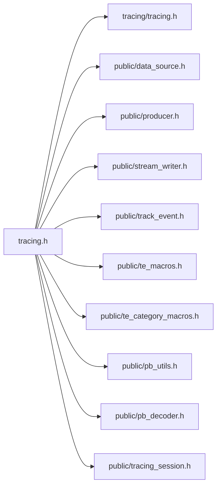

# C++ API参考

<cite>
**本文引用的文件**
- [include/perfetto/tracing.h](file://include/perfetto/tracing.h)
- [include/perfetto/public/tracing_session.h](file://include/perfetto/public/tracing_session.h)
- [include/perfetto/public/data_source.h](file://include/perfetto/public/data_source.h)
- [include/perfetto/public/producer.h](file://include/perfetto/public/producer.h)
- [include/perfetto/public/stream_writer.h](file://include/perfetto/public/stream_writer.h)
- [include/perfetto/public/track_event.h](file://include/perfetto/public/track_event.h)
- [include/perfetto/public/te_macros.h](file://include/perfetto/public/te_macros.h)
- [include/perfetto/public/te_category_macros.h](file://include/perfetto/public/te_category_macros.h)
- [include/perfetto/public/pb_decoder.h](file://include/perfetto/public/pb_decoder.h)
- [include/perfetto/public/pb_utils.h](file://include/perfetto/public/pb_utils.h)
- [include/perfetto/tracing/tracing.h](file://include/perfetto/tracing/tracing.h)
</cite>

## 目录
1. [简介](#简介)
2. [项目结构](#项目结构)
3. [核心组件](#核心组件)
4. [架构总览](#架构总览)
5. [详细组件分析](#详细组件分析)
6. [依赖关系分析](#依赖关系分析)
7. [性能考量](#性能考量)
8. [故障排查指南](#故障排查指南)
9. [结论](#结论)
10. [附录](#附录)

## 简介
本参考文档面向使用 Perfetto C++ API 的开发者，系统梳理追踪 SDK 的公共接口与使用方法，覆盖以下主题：
- 追踪会话管理：初始化、配置、启动、停止、读取、统计查询、克隆等
- 数据源接口：注册、生命周期回调、实例遍历、写入 TracePacket
- 跟踪事件（Track Event）：分类注册、宏 API、低层/高层 ABI、内核化事件名/分类内核化
- 生产者与后端：生产者初始化、触发器激活、共享内存缓冲区大小与页大小、批提交时延、直接补丁
- 原子/线程工具：原子布尔标志、线程 ID 获取、时间戳工具
- Protobuf 工具与解码：迭代器、字段类型、VarInt/Fixed 编解码、ZigZag 编解码
- 示例与最佳实践：自定义数据源、事件记录、内存映射缓冲区使用、并发与性能优化

## 项目结构
Perfetto C++ API 的公共头文件主要位于 include/perfetto 下，按功能域划分为：
- tracing：高层 API（Tracing、TracingSession、StartupTracingSession）
- public：公共 ABI 与工具（data_source、producer、stream_writer、track_event、te_macros、te_category_macros、pb_utils、pb_decoder）
- tracing.h：聚合头，包含追踪相关常用头文件

**图表来源**
- [include/perfetto/tracing.h:26-41](file://include/perfetto/tracing.h#L26-L41)
- [include/perfetto/public/data_source.h:20-31](file://include/perfetto/public/data_source.h#L20-L31)
- [include/perfetto/public/producer.h:22-25](file://include/perfetto/public/producer.h#L22-L25)
- [include/perfetto/public/stream_writer.h:23-25](file://include/perfetto/public/stream_writer.h#L23-L25)
- [include/perfetto/public/track_event.h:23-37](file://include/perfetto/public/track_event.h#L23-L37)
- [include/perfetto/public/te_macros.h:26-29](file://include/perfetto/public/te_macros.h#L26-L29)
- [include/perfetto/public/te_category_macros.h:20-21](file://include/perfetto/public/te_category_macros.h#L20-L21)
- [include/perfetto/public/pb_utils.h:24-25](file://include/perfetto/public/pb_utils.h#L24-L25)
- [include/perfetto/public/pb_decoder.h:20-23](file://include/perfetto/public/pb_decoder.h#L20-L23)
- [include/perfetto/public/tracing_session.h:20-23](file://include/perfetto/public/tracing_session.h#L20-L23)
- [include/perfetto/tracing/tracing.h:34-39](file://include/perfetto/tracing/tracing.h#L34-L39)

**章节来源**
- [include/perfetto/tracing.h:20-41](file://include/perfetto/tracing.h#L20-L41)

## 核心组件
本节概述 Perfetto C++ 公共 API 的关键模块及其职责。

- Tracing（高层入口）
  - 初始化与关闭：支持多后端（进程内/系统），可注入平台实现、日志回调、共享内存参数、策略对象等
  - 会话管理：创建 TracingSession、启动/停止、读取 Trace、统计查询、服务状态查询、克隆只读会话
  - 启动追踪：预热启动追踪，等待匹配的系统会话接管
  - 触发器：批量激活命名触发器

- TracingSession（会话生命周期）
  - 配置与启动：Setup + Start/StartBlocking
  - 停止与刷新：Stop/StopBlocking、Flush/FlushBlocking
  - 读取与统计：ReadTrace/ReadTraceBlocking、GetTraceStats/GetTraceStatsBlocking、QueryServiceState/QueryServiceStateBlocking
  - 回调：OnStart、OnError、CloneTrace

- Producer（生产者）
  - 初始化：设置启用后端、共享内存大小提示
  - 触发器：激活单个或多个触发器

- DataSource（数据源）
  - 注册：描述符序列化、回调绑定、增量状态、缓冲耗尽策略
  - 实例遍历：在当前线程上迭代活跃实例
  - 写包：Begin/End TracePacket，Flush

- StreamWriter（流式写入）
  - 字节追加/预留、可用字节数、写入大小统计
  - 分块扩容与慢路径处理

- TrackEvent（跟踪事件）
  - 分类注册/注销、回调、动态分类
  - 轨迹注册（命名/计数器）、流程（Flow）标识
  - 低层/高层 ABI 写入、内核化事件名/分类、调试参数、嵌套轨迹

- Protobuf 工具与解码
  - 字段类型、标签构造、VarInt/Fixed 编解码、ZigZag 编解码
  - 解码迭代器：遍历字段、提取标量/浮点/字符串等

**章节来源**
- [include/perfetto/tracing/tracing.h:188-330](file://include/perfetto/tracing/tracing.h#L188-L330)
- [include/perfetto/public/tracing_session.h:24-33](file://include/perfetto/public/tracing_session.h#L24-L33)
- [include/perfetto/public/producer.h:48-77](file://include/perfetto/public/producer.h#L48-L77)
- [include/perfetto/public/data_source.h:106-188](file://include/perfetto/public/data_source.h#L106-L188)
- [include/perfetto/public/stream_writer.h:27-101](file://include/perfetto/public/stream_writer.h#L27-L101)
- [include/perfetto/public/track_event.h:46-98](file://include/perfetto/public/track_event.h#L46-L98)
- [include/perfetto/public/pb_utils.h:27-177](file://include/perfetto/public/pb_utils.h#L27-L177)
- [include/perfetto/public/pb_decoder.h:37-168](file://include/perfetto/public/pb_decoder.h#L37-L168)

## 架构总览
下图展示了高层 API 与公共 ABI 的交互关系，以及数据源、生产者、追踪会话之间的协作。

**图表来源**
- [include/perfetto/tracing/tracing.h:188-330](file://include/perfetto/tracing/tracing.h#L188-L330)
- [include/perfetto/public/data_source.h:106-188](file://include/perfetto/public/data_source.h#L106-L188)
- [include/perfetto/public/producer.h:48-77](file://include/perfetto/public/producer.h#L48-L77)
- [include/perfetto/public/stream_writer.h:27-101](file://include/perfetto/public/stream_writer.h#L27-L101)
- [include/perfetto/public/track_event.h:46-98](file://include/perfetto/public/track_event.h#L46-L98)
- [include/perfetto/public/pb_utils.h:27-177](file://include/perfetto/public/pb_utils.h#L27-L177)

## 详细组件分析

### 组件一：Tracing（高层入口）
- 主要职责
  - 初始化与关闭：支持多后端、平台定制、日志回调、共享内存参数、策略对象
  - 会话创建：NewTrace 支持自动选择后端
  - 启动追踪：SetupStartupTracing/Blocking，等待系统会话接管
  - 触发器：批量激活命名触发器
- 关键参数
  - 后端位掩码、自定义平台、共享内存大小/页大小/批提交时延、直接补丁开关
  - 日志回调、策略对象、是否允许多数据源实例、是否使用单调时钟
- 使用建议
  - 在进程启动早期调用 Initialize，确保后续 API 可用
  - 对于需要系统级追踪的场景，启用 System Backend 并合理设置共享内存参数
  - 使用 TracingInitArgs 的回调与策略对象进行可观测性与安全控制

**章节来源**
- [include/perfetto/tracing/tracing.h:188-330](file://include/perfetto/tracing/tracing.h#L188-L330)
- [include/perfetto/tracing/tracing.h:74-186](file://include/perfetto/tracing/tracing.h#L74-L186)

### 组件二：TracingSession（会话生命周期）
- 主要职责
  - 配置与启动：Setup + Start/StartBlocking
  - 停止与刷新：Stop/StopBlocking、Flush/FlushBlocking
  - 读取与统计：ReadTrace/ReadTraceBlocking、GetTraceStats/GetTraceStatsBlocking、QueryServiceState/QueryServiceStateBlocking
  - 回调：OnStart、OnError、CloneTrace
- 注意事项
  - Flush 用于确保可见性；在 ReadTrace 前通常需要 Flush
  - CloneTrace 仅对同后端类型会话有效，且一次仅一个克隆请求挂起
- 性能建议
  - 合理设置批提交时延以平衡 IPC 开销与突发写入能力
  - 控制共享内存页大小以减少碎片与提升多线程写入效率

**章节来源**
- [include/perfetto/tracing/tracing.h:332-519](file://include/perfetto/tracing/tracing.h#L332-L519)

### 组件三：Producer（生产者）
- 主要职责
  - 初始化：设置启用后端、共享内存大小提示
  - 触发器：激活单个或多个触发器
- 参数说明
  - 后端位掩码、共享内存大小提示（需为 4KB 的倍数，不超过上限）

**章节来源**
- [include/perfetto/public/producer.h:26-77](file://include/perfetto/public/producer.h#L26-L77)

### 组件四：DataSource（数据源）
- 主要职责
  - 注册：生成 DataSourceDescriptor、绑定回调、设置缓冲耗尽策略
  - 实例遍历：在当前线程上迭代活跃实例
  - 写包：Begin/End TracePacket，Flush
- 关键回调
  - on_setup/on_start/on_stop/on_destroy/on_flush
  - 自定义 TLS/增量状态的创建/销毁/清理
- 线程模型
  - 回调可在任意线程被调用
  - 实例遍历与写包在调用线程上下文执行

**章节来源**
- [include/perfetto/public/data_source.h:106-188](file://include/perfetto/public/data_source.h#L106-L188)
- [include/perfetto/public/data_source.h:190-291](file://include/perfetto/public/data_source.h#L190-L291)

### 组件五：StreamWriter（流式写入）
- 主要职责
  - 提供字节追加/预留、可用字节数查询、写入大小统计
  - 处理分块扩容与慢路径逻辑
- 使用建议
  - 在写入前检查可用字节数，避免慢路径开销
  - 对于大块写入，优先使用 ReserveBytes 以减少拷贝

**章节来源**
- [include/perfetto/public/stream_writer.h:27-101](file://include/perfetto/public/stream_writer.h#L27-L101)

### 组件六：TrackEvent（跟踪事件）
- 主要职责
  - 分类注册/注销、回调、动态分类
  - 轨迹注册（命名/计数器）、流程（Flow）标识
  - 低层/高层 ABI 写入、内核化事件名/分类、调试参数、嵌套轨迹
- 宏 API（te_macros）
  - PERFETTO_TE：事件发射主宏，支持切片、即时、计数器、动态分类、调试参数、嵌套轨迹等
  - PERFETTO_TE_SCOPED：作用域结束自动发射切片结束事件
- 内核化机制
  - 事件名/分类通过内核化减少重复序列化开销

**章节来源**
- [include/perfetto/public/track_event.h:46-98](file://include/perfetto/public/track_event.h#L46-L98)
- [include/perfetto/public/track_event.h:180-237](file://include/perfetto/public/track_event.h#L180-L237)
- [include/perfetto/public/track_event.h:307-331](file://include/perfetto/public/track_event.h#L307-L331)
- [include/perfetto/public/te_macros.h:490-561](file://include/perfetto/public/te_macros.h#L490-L561)
- [include/perfetto/public/te_category_macros.h:154-177](file://include/perfetto/public/te_category_macros.h#L154-L177)

### 组件七：Protobuf 工具与解码
- 主要职责
  - 字段类型、标签构造、VarInt/Fixed 编解码、ZigZag 编解码
  - 解码迭代器：遍历字段、提取标量/浮点/字符串等

**章节来源**
- [include/perfetto/public/pb_utils.h:27-177](file://include/perfetto/public/pb_utils.h#L27-L177)
- [include/perfetto/public/pb_decoder.h:37-168](file://include/perfetto/public/pb_decoder.h#L37-L168)

### 组件八：TracingSession（公共 ABI）
- 主要职责
  - 通过公共 ABI 创建不同后端的会话实例（进程内/系统）
- 使用建议
  - 根据部署环境选择合适的后端类型

**章节来源**
- [include/perfetto/public/tracing_session.h:24-33](file://include/perfetto/public/tracing_session.h#L24-L33)

## 依赖关系分析
- 头文件聚合
  - tracing.h 将追踪相关常用头文件聚合，便于嵌入方统一包含
- 模块耦合
  - Tracing 依赖后端工厂与平台实现
  - DataSource 依赖 StreamWriter 与 Protobuf 工具
  - TrackEvent 依赖 DataSource 与 Protobuf 工具
  - Producer 依赖后端初始化参数

**图表来源**
- [include/perfetto/tracing.h:26-41](file://include/perfetto/tracing.h#L26-L41)

**章节来源**
- [include/perfetto/tracing.h:20-41](file://include/perfetto/tracing.h#L20-L41)

## 性能考量
- 共享内存参数
  - 共享内存大小提示与页大小提示影响写入突发能力与碎片率
  - 批提交时延影响 IPC 开销与缓冲区占用
- 写入路径
  - StreamWriter 的快/慢路径设计降低频繁扩容成本
  - TraceEvent 的内核化机制减少重复序列化
- 线程模型
  - 数据源回调与事件写入可能发生在任意线程，应避免阻塞与长临界区
- 刷新与读取
  - Flush 用于确保可见性；ReadTrace 前建议先 Flush
  - 读取是破坏性操作，需谨慎安排时机

[本节为通用指导，不直接分析具体文件]

## 故障排查指南
- 初始化失败
  - 检查 TracingInitArgs 的后端位掩码与平台实现
  - 查看日志回调输出或错误码
- 会话无法启动/停止
  - 确认配置与后端匹配；检查 OnError 回调
  - 对于系统后端，确认服务连接状态
- 事件丢失/截断
  - 检查缓冲耗尽策略与共享内存大小
  - 确保在停止前调用 Flush
- 读取为空或部分数据
  - 确认 Flush 与 ReadTrace 的顺序
  - 检查回调中的 has_more 标志

**章节来源**
- [include/perfetto/tracing/tracing.h:51-68](file://include/perfetto/tracing/tracing.h#L51-L68)
- [include/perfetto/tracing/tracing.h:384-404](file://include/perfetto/tracing/tracing.h#L384-L404)

## 结论
Perfetto C++ API 提供了从高层入口到底层写入的完整追踪能力。通过合理的后端选择、共享内存参数与事件写入策略，可以在保证性能的同时获得高质量的追踪数据。建议在实际工程中结合本文档的组件说明与最佳实践，逐步完成自定义数据源开发、事件记录与内存映射缓冲区使用等任务。

[本节为总结性内容，不直接分析具体文件]

## 附录

### A. 常见用法模式与示例路径
- 自定义数据源开发
  - 注册数据源与回调：[注册与回调绑定:106-188](file://include/perfetto/public/data_source.h#L106-L188)
  - 实例遍历与写包：[实例遍历与写包:190-291](file://include/perfetto/public/data_source.h#L190-L291)
- 追踪事件记录
  - 分类注册与宏使用：[分类注册/注销:46-98](file://include/perfetto/public/track_event.h#L46-L98)，[宏 API:490-561](file://include/perfetto/public/te_macros.h#L490-L561)
  - 动态分类与内核化：[动态分类:298-305](file://include/perfetto/public/track_event.h#L298-L305)，[内核化事件名/分类:439-427](file://include/perfetto/public/track_event.h#L439-L427)
- 内存映射缓冲区使用
  - 共享内存大小与页大小提示：[共享内存参数:83-110](file://include/perfetto/tracing/tracing.h#L83-L110)，[生产者初始化:48-63](file://include/perfetto/public/producer.h#L48-L63)
  - 流式写入：[StreamWriter API:27-101](file://include/perfetto/public/stream_writer.h#L27-L101)

### B. 线程安全性说明
- 数据源回调与事件写入可能在任意线程发生，需避免阻塞与长临界区
- 分类启用标志为原子布尔，读取路径快速路径短路
- 写入器内部维护指针与可用字节数，需遵循“先检查可用字节，再写入”的约定

**章节来源**
- [include/perfetto/public/data_source.h:48-53](file://include/perfetto/public/data_source.h#L48-L53)
- [include/perfetto/public/track_event.h:39-44](file://include/perfetto/public/track_event.h#L39-L44)
- [include/perfetto/public/stream_writer.h:35-54](file://include/perfetto/public/stream_writer.h#L35-L54)

### C. 版本兼容性与废弃策略
- 公共头文件采用 ABI 稳定的公共 ABI 层（public/abi），上层 API 保持向后兼容
- 公共 ABI 文件名包含版本语义（如 *_abi.h），升级时请对照变更说明
- 建议优先使用聚合头 tracing.h 以减少依赖维护成本

**章节来源**
- [include/perfetto/tracing.h:20-25](file://include/perfetto/tracing.h#L20-L25)