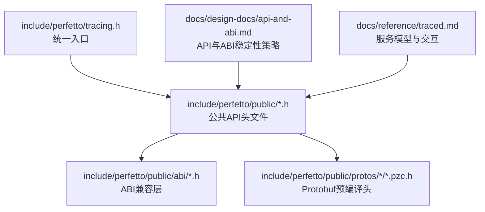
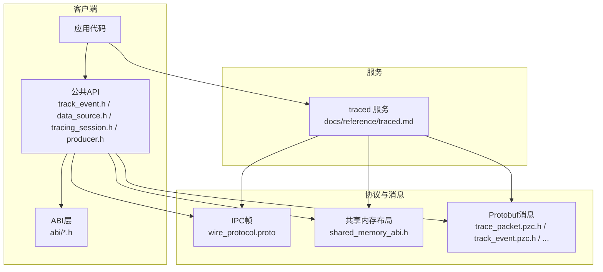
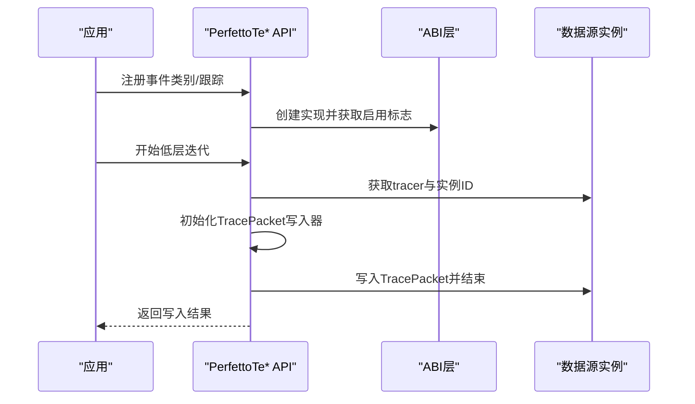
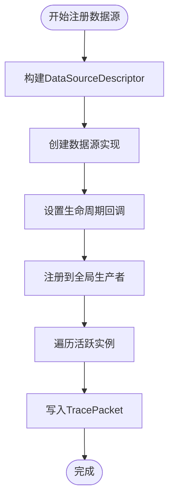
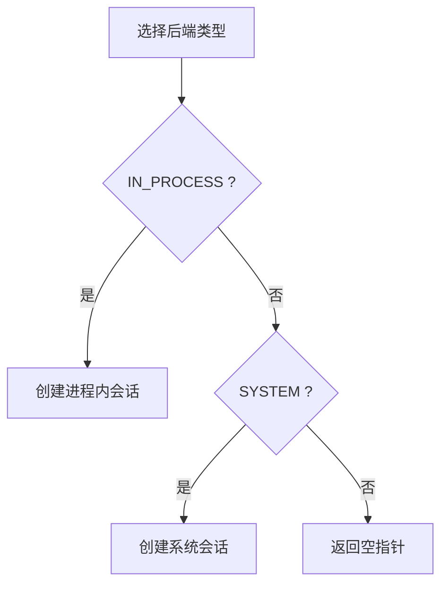
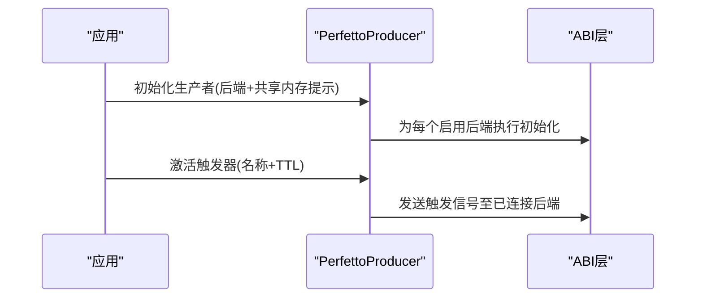
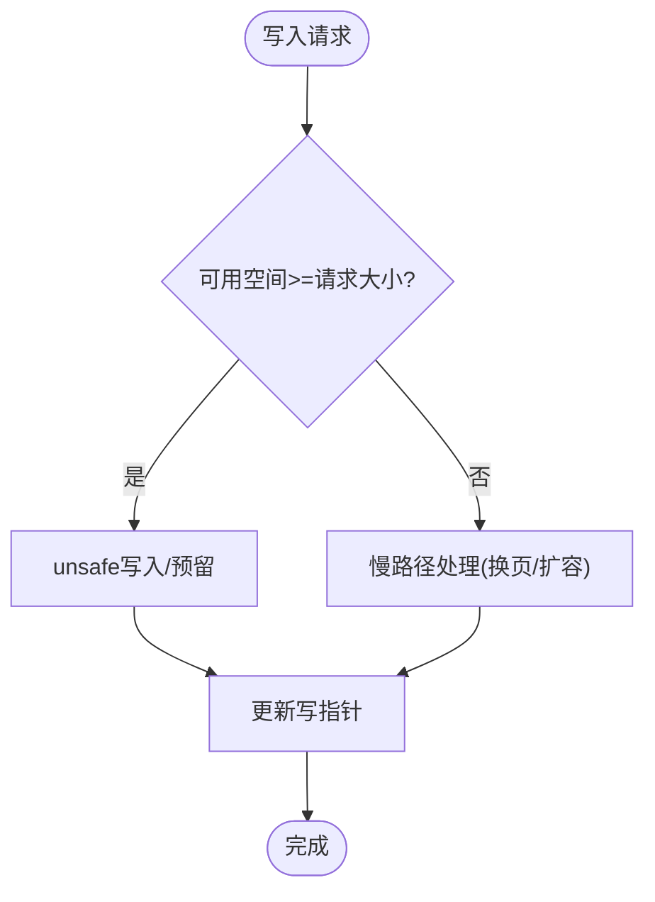
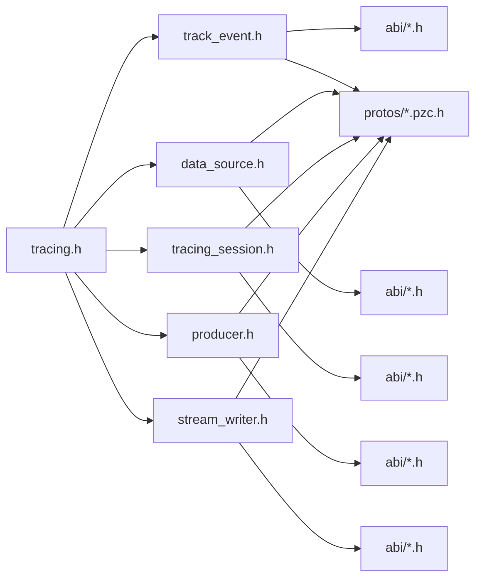

# 公共API接口

<cite>
**本文引用的文件**
- [include/perfetto/tracing.h](file://include/perfetto/tracing.h)
- [docs/design-docs/api-and-abi.md](file://docs/design-docs/api-and-abi.md)
- [docs/reference/traced.md](file://docs/reference/traced.md)
- [include/perfetto/public/track_event.h](file://include/perfetto/public/track_event.h)
- [include/perfetto/public/data_source.h](file://include/perfetto/public/data_source.h)
- [include/perfetto/public/tracing_session.h](file://include/perfetto/public/tracing_session.h)
- [include/perfetto/public/producer.h](file://include/perfetto/public/producer.h)
- [include/perfetto/public/stream_writer.h](file://include/perfetto/public/stream_writer.h)
- [include/perfetto/public/abi/track_event_abi.h](file://include/perfetto/public/abi/track_event_abi.h)
- [include/perfetto/public/abi/data_source_abi.h](file://include/perfetto/public/abi/data_source_abi.h)
- [include/perfetto/public/abi/tracing_session_abi.h](file://include/perfetto/public/abi/tracing_session_abi.h)
- [include/perfetto/public/abi/producer_abi.h](file://include/perfetto/public/abi/producer_abi.h)
- [include/perfetto/public/abi/stream_writer_abi.h](file://include/perfetto/public/abi/stream_writer_abi.h)
- [include/perfetto/public/abi/backend_type.h](file://include/perfetto/public/abi/backend_type.h)
- [include/perfetto/public/abi/atomic.h](file://include/perfetto/public/abi/atomic.h)
- [include/perfetto/public/abi/heap_buffer.h](file://include/perfetto/public/abi/heap_buffer.h)
- [include/perfetto/public/protos/trace/trace_packet.pzc.h](file://include/perfetto/public/protos/trace/trace_packet.pzc.h)
- [include/perfetto/public/protos/trace/track_event/track_event.pzc.h](file://include/perfetto/public/protos/trace/track_event/track_event.pzc.h)
- [include/perfetto/public/protos/trace/track_event/track_descriptor.pzc.h](file://include/perfetto/public/protos/trace/track_event/track_descriptor.pzc.h)
- [include/perfetto/public/protos/trace/interned_data/interned_data.pzc.h](file://include/perfetto/public/protos/trace/interned_data/interned_data.pzc.h)
- [include/perfetto/public/protos/common/data_source_descriptor.pzc.h](file://include/perfetto/public/protos/common/data_source_descriptor.pzc.h)
- [include/perfetto/public/protos/trace/trace_packet.pzc.h](file://include/perfetto/public/protos/trace/trace_packet.pzc.h)
- [include/perfetto/public/protos/trace/track_event/track_event.pzc.h](file://include/perfetto/public/protos/trace/track_event/track_event.pzc.h)
- [include/perfetto/public/protos/trace/track_event/track_descriptor.pzc.h](file://include/perfetto/public/protos/trace/track_event/track_descriptor.pzc.h)
- [include/perfetto/public/protos/trace/interned_data/interned_data.pzc.h](file://include/perfetto/public/protos/trace/interned_data/interned_data.pzc.h)
- [include/perfetto/public/protos/common/data_source_descriptor.pzc.h](file://include/perfetto/public/protos/common/data_source_descriptor.pzc.h)
</cite>

## 目录
1. [简介](#简介)
2. [项目结构](#项目结构)
3. [核心组件](#核心组件)
4. [架构总览](#架构总览)
5. [详细组件分析](#详细组件分析)
6. [依赖关系分析](#依赖关系分析)
7. [性能考量](#性能考量)
8. [故障排查指南](#故障排查指南)
9. [结论](#结论)
10. [附录](#附录)

## 简介
本文件为 Perfetto 公共 API 接口的权威参考，覆盖公共头文件结构、ABI 兼容性接口、Protobuf 消息定义、编译器工具宏与条件编译要点，并系统阐述版本管理策略、向后兼容性保证与废弃接口迁移路径。文档同时提供接口清单与使用示例，说明在不同平台下的差异与注意事项，以及 API 设计原则与扩展机制。

## 项目结构
Perfetto 的公共 API 主要由以下层次构成：
- 统一入口头文件：通过 include/perfetto/tracing.h 聚合公共追踪 API 所需的全部头文件，便于嵌入方统一包含。
- 公共头文件层（include/perfetto/public）：提供 C 风格的公共 API，包含数据源、跟踪事件、流写入器、生产者初始化、会话控制等。
- ABI 兼容层（include/perfetto/public/abi）：以稳定的 ABI 头文件封装底层实现细节，确保跨版本兼容。
- Protobuf 原型（include/perfetto/public/protos）：包含 TracePacket、TrackEvent、DataSourceDescriptor 等核心消息的预编译头文件，用于序列化与传输。

**图表来源**
- [include/perfetto/tracing.h:1-43](file://include/perfetto/tracing.h#L1-L43)
- [docs/design-docs/api-and-abi.md:1-533](file://docs/design-docs/api-and-abi.md#L1-L533)
- [docs/reference/traced.md:1-114](file://docs/reference/traced.md#L1-L114)

**章节来源**
- [include/perfetto/tracing.h:17-42](file://include/perfetto/tracing.h#L17-L42)
- [docs/design-docs/api-and-abi.md:26-80](file://docs/design-docs/api-and-abi.md#L26-L80)
- [docs/reference/traced.md:18-75](file://docs/reference/traced.md#L18-L75)

## 核心组件
- 统一入口头文件
  - include/perfetto/tracing.h 聚合了追踪 API 所需的关键头文件，推荐嵌入方优先使用该头文件进行包含，以减少依赖复杂度。
- 公共 API 头文件
  - include/perfetto/public/track_event.h：提供注册/注销事件类别、注册命名/计数器跟踪、低层迭代与写入 TracePacket 的能力。
  - include/perfetto/public/data_source.h：提供自定义数据源类型注册、实例生命周期回调、增量状态与线程局部状态支持、TracePacket 写入接口。
  - include/perfetto/public/tracing_session.h：提供基于后端（进程内/系统）的追踪会话创建接口。
  - include/perfetto/public/producer.h：提供生产者初始化参数与触发器激活接口。
  - include/perfetto/public/stream_writer.h：提供高性能流式写入器，支持字节追加、预留缓冲区、可用空间查询等。
- ABI 兼容层
  - include/perfetto/public/abi/*.h：封装底层 ABI 接口，如 track_event_abi.h、data_source_abi.h、tracing_session_abi.h、producer_abi.h、stream_writer_abi.h、backend_type.h、atomic.h、heap_buffer.h 等，确保公共 API 的 ABI 稳定性。
- Protobuf 消息
  - include/perfetto/public/protos 下的 pzc.h 文件对应 TracePacket、TrackEvent、TrackDescriptor、InternedData、DataSourceDescriptor 等消息，用于序列化与网络传输。

**章节来源**
- [include/perfetto/tracing.h:26-41](file://include/perfetto/tracing.h#L26-L41)
- [include/perfetto/public/track_event.h:17-37](file://include/perfetto/public/track_event.h#L17-L37)
- [include/perfetto/public/data_source.h:17-31](file://include/perfetto/public/data_source.h#L17-L31)
- [include/perfetto/public/tracing_session.h:17-35](file://include/perfetto/public/tracing_session.h#L17-L35)
- [include/perfetto/public/producer.h:17-25](file://include/perfetto/public/producer.h#L17-L25)
- [include/perfetto/public/stream_writer.h:17-25](file://include/perfetto/public/stream_writer.h#L17-L25)

## 架构总览
Perfetto 的公共 API 与服务模型紧密协作：
- 客户端（嵌入方应用）通过公共 API 注册数据源、写入跟踪事件或创建追踪会话。
- traced 服务作为中央调度者，负责会话管理、缓冲区管理、数据源注册与配置路由。
- 生产者与消费者通过 UNIX 套接字与共享内存进行高效通信，Protobuf 消息承载 TracePacket 数据。

**图表来源**
- [docs/reference/traced.md:18-75](file://docs/reference/traced.md#L18-L75)
- [docs/design-docs/api-and-abi.md:81-435](file://docs/design-docs/api-and-abi.md#L81-L435)

## 详细组件分析

### 组件A：跟踪事件 API（Perfetto 公共）
- 功能概述
  - 提供事件类别的注册/注销、跟踪注册、动态/静态类别写入、事件名称与注解的 interned 优化、低层迭代与包写入。
- 关键接口与流程
  - 类别注册：PerfettoTeCategoryRegister、PerfettoTeRegisterCategories、PerfettoTeCategorySetCallback、PerfettoTeCategoryUnregister、PerfettoTeUnregisterCategories。
  - 跟踪注册：PerfettoTeNamedTrackRegister、PerfettoTeCounterTrackRegister、PerfettoTeRegisteredTrackUnregister。
  - 低层迭代与写包：PerfettoTeLlBeginSlowPath、PerfettoTeLlNext、PerfettoTeLlBreak、PerfettoTeLlPacketBegin、PerfettoTeLlPacketEnd、PerfettoTeLlFlushPacket。
  - Interned 优化：PerfettoTeLlIntern、PerfettoTeLlInternContextInit/StartIfNeeded/Destroy、PerfettoTeLlInternRegisteredCat、PerfettoTeLlInternEventName、PerfettoTeLlWriteRegisteredCat/WriteDynamicCat/WriteTimestamp。
- 使用建议
  - 优先使用已注册类别与跟踪，减少字符串重复与序列化开销。
  - 在高吞吐场景下，合理利用低层迭代与包写入接口，避免不必要的拷贝。

**图表来源**
- [include/perfetto/public/track_event.h:38-98](file://include/perfetto/public/track_event.h#L38-L98)
- [include/perfetto/public/track_event.h:272-331](file://include/perfetto/public/track_event.h#L272-L331)
- [include/perfetto/public/track_event.h:339-427](file://include/perfetto/public/track_event.h#L339-L427)

**章节来源**
- [include/perfetto/public/track_event.h:38-509](file://include/perfetto/public/track_event.h#L38-L509)

### 组件B：数据源 API（Perfetto 公共）
- 功能概述
  - 注册自定义数据源类型，设置生命周期回调（setup/start/stop/destroy/flush），配置缓冲区耗尽策略与增量/线程局部状态。
  - 提供遍历当前线程活跃实例的迭代器与写入 TracePacket 的接口。
- 关键接口与流程
  - 注册：PerfettoDsRegister，内部序列化 DataSourceDescriptor 并调用 ABI 层创建实现。
  - 迭代与写包：PerfettoDsTraceIterateBegin/Next/Break、PerfettoDsTracerPacketBegin/PacketEnd、PerfettoDsTracerFlush。
  - 状态访问：PerfettoDsGetCustomTls、PerfettoDsGetIncrementalState。
- 使用建议
  - 合理设置缓冲区耗尽策略，避免在高负载下丢失数据。
  - 利用增量状态进行周期性清理，保持长期运行的稳定性。

**图表来源**
- [include/perfetto/public/data_source.h:106-188](file://include/perfetto/public/data_source.h#L106-L188)
- [include/perfetto/public/data_source.h:190-291](file://include/perfetto/public/data_source.h#L190-L291)

**章节来源**
- [include/perfetto/public/data_source.h:32-292](file://include/perfetto/public/data_source.h#L32-L292)

### 组件C：追踪会话 API（Perfetto 公共）
- 功能概述
  - 基于后端类型（进程内/系统）创建追踪会话，简化嵌入方对不同后端的适配。
- 关键接口
  - PerfettoTracingSessionCreate：根据 BackendType 选择 in-process 或 system 后端。
- 使用建议
  - 在单进程调试场景使用 IN_PROCESS；在系统级追踪场景使用 SYSTEM。

**图表来源**
- [include/perfetto/public/tracing_session.h:24-33](file://include/perfetto/public/tracing_session.h#L24-L33)

**章节来源**
- [include/perfetto/public/tracing_session.h:17-36](file://include/perfetto/public/tracing_session.h#L17-L36)

### 组件D：生产者初始化与触发器（Perfetto 公共）
- 功能概述
  - 初始化全局生产者，支持多后端启用与共享内存大小提示；提供触发器激活接口。
- 关键接口
  - PerfettoProducerInit：根据 PerfettoBackendTypes 初始化后端。
  - PerfettoProducerActivateTrigger：激活单个触发器。
- 使用建议
  - 在高写入突发场景适当增大共享内存大小提示，平衡内存占用与写入吞吐。

**图表来源**
- [include/perfetto/public/producer.h:48-77](file://include/perfetto/public/producer.h#L48-L77)

**章节来源**
- [include/perfetto/public/producer.h:17-80](file://include/perfetto/public/producer.h#L17-L80)

### 组件E：流写入器（Perfetto 公共）
- 功能概述
  - 提供高性能的流式写入器，支持字节追加、预留缓冲区、可用空间查询与慢路径处理。
- 关键接口
  - 可用空间查询：PerfettoStreamWriterAvailableBytes
  - 字节写入：PerfettoStreamWriterAppendBytes/AppendBytesUnsafe/AppendByte
  - 缓冲区预留：PerfettoStreamWriterReserveBytes/ReserveBytesUnsafe
  - 写入统计：PerfettoStreamWriterGetWrittenSize
- 使用建议
  - 在热路径中优先使用 unsafe/预留接口，减少分支判断；在边界条件下自动进入慢路径处理。

**图表来源**
- [include/perfetto/public/stream_writer.h:26-101](file://include/perfetto/public/stream_writer.h#L26-L101)

**章节来源**
- [include/perfetto/public/stream_writer.h:17-104](file://include/perfetto/public/stream_writer.h#L17-L104)

## 依赖关系分析
- 统一入口与公共 API
  - tracing.h 聚合公共 API 所需头文件，降低嵌入方的包含复杂度。
- 公共 API 与 ABI
  - 所有公共 API 头文件均包含对应的 ABI 头文件，确保 ABI 稳定性与二进制兼容。
- Protobuf 消息与序列化
  - 公共 API 通过 pzc.h 预编译头直接使用 Protobuf 消息，避免运行时解析开销。
- 服务模型与协议
  - 文档明确了 traced 服务职责、IPC 通道与共享内存布局，公共 API 通过 ABI 与协议对接。

**图表来源**
- [include/perfetto/tracing.h:26-41](file://include/perfetto/tracing.h#L26-L41)
- [include/perfetto/public/track_event.h:23-36](file://include/perfetto/public/track_event.h#L23-L36)
- [include/perfetto/public/data_source.h:23-30](file://include/perfetto/public/data_source.h#L23-L30)
- [include/perfetto/public/tracing_session.h:20-22](file://include/perfetto/public/tracing_session.h#L20-L22)
- [include/perfetto/public/producer.h:22-24](file://include/perfetto/public/producer.h#L22-L24)
- [include/perfetto/public/stream_writer.h:23-24](file://include/perfetto/public/stream_writer.h#L23-L24)

**章节来源**
- [include/perfetto/tracing.h:17-42](file://include/perfetto/tracing.h#L17-L42)
- [docs/design-docs/api-and-abi.md:81-435](file://docs/design-docs/api-and-abi.md#L81-L435)

## 性能考量
- 流写入器
  - 通过预留缓冲区与 unsafe 写入减少分支判断，提升热路径性能；在空间不足时自动进入慢路径处理。
- 追踪事件
  - 使用已注册类别与跟踪可显著减少字符串序列化与网络传输开销；合理利用 interned 优化事件名称与注解。
- 数据源
  - 合理设置缓冲区耗尽策略与共享内存大小提示，避免在高负载下出现阻塞或丢包。
- 服务模型
  - 通过共享内存与异步提交降低写入延迟，traced 服务集中处理缓冲区与安全隔离。

[本节为通用性能指导，不直接分析具体文件]

## 故障排查指南
- 常见问题
  - 未注册类别导致空指针：确保在使用前完成类别注册与启用标志检查。
  - 写入失败或丢包：检查共享内存可用空间与缓冲区耗尽策略配置。
  - 触发器未生效：确认触发器名称与 TTL 设置是否正确，且后端已连接。
- 排查步骤
  - 检查公共 API 返回值与错误码，定位失败环节。
  - 对照 Protobuf 消息结构与 ABI 版本，确认序列化字段兼容性。
  - 查看 traced 服务日志与权限配置，确认套接字访问与共享内存映射正常。

**章节来源**
- [include/perfetto/public/track_event.h:74-98](file://include/perfetto/public/track_event.h#L74-L98)
- [include/perfetto/public/stream_writer.h:32-54](file://include/perfetto/public/stream_writer.h#L32-L54)
- [include/perfetto/public/producer.h:65-77](file://include/perfetto/public/producer.h#L65-L77)

## 结论
Perfetto 的公共 API 以稳定 ABI 为核心，结合 Protobuf 消息与服务模型，提供了从事件写入到数据源扩展的完整能力。遵循本文档的版本管理策略、兼容性原则与最佳实践，可在多平台上获得一致且高性能的追踪体验。

[本节为总结性内容，不直接分析具体文件]

## 附录

### A. 版本管理与兼容性策略
- 公共 C++ API
  - 大部分公共 C++ API 在 include/perfetto/tracing/ 下稳定，偶有编译期变更，预计在 2020 年末趋于稳定。
- 新 C API/ABI
  - include/perfetto/public 下的新 C API/ABI 尚未稳定，仍在开发中。
- 追踪协议 ABI
  - 基于 Protobuf-over-UNIX-socket 与共享内存，长期稳定并双向兼容（旧服务 + 新客户端 / 新服务 + 旧客户端）。
- 协议演进
  - 除非标记为 experimental，否则消息更新保持向后兼容；Trace Processor 处理旧格式导入。

**章节来源**
- [docs/design-docs/api-and-abi.md:7-25](file://docs/design-docs/api-and-abi.md#L7-L25)
- [docs/design-docs/api-and-abi.md:81-435](file://docs/design-docs/api-and-abi.md#L81-L435)

### B. 接口清单与使用示例（路径指引）
- 统一入口
  - 包含路径：include/perfetto/tracing.h
- 跟踪事件
  - 头文件：include/perfetto/public/track_event.h
  - 示例路径：[示例路径](file://examples/sdk/example.cc)
- 数据源
  - 头文件：include/perfetto/public/data_source.h
  - 示例路径：[示例路径](file://examples/sdk/example_custom_data_source.cc)
- 追踪会话
  - 头文件：include/perfetto/public/tracing_session.h
  - 示例路径：[示例路径](file://examples/sdk/example_system_wide.cc)
- 生产者
  - 头文件：include/perfetto/public/producer.h
  - 示例路径：[示例路径](file://examples/sdk/example_console.cc)
- 流写入器
  - 头文件：include/perfetto/public/stream_writer.h
  - 示例路径：[示例路径](file://examples/sdk/example.cc)

**章节来源**
- [include/perfetto/tracing.h:20-25](file://include/perfetto/tracing.h#L20-L25)
- [include/perfetto/public/track_event.h:17-37](file://include/perfetto/public/track_event.h#L17-L37)
- [include/perfetto/public/data_source.h:17-31](file://include/perfetto/public/data_source.h#L17-L31)
- [include/perfetto/public/tracing_session.h:17-22](file://include/perfetto/public/tracing_session.h#L17-L22)
- [include/perfetto/public/producer.h:17-24](file://include/perfetto/public/producer.h#L17-L24)
- [include/perfetto/public/stream_writer.h:17-24](file://include/perfetto/public/stream_writer.h#L17-L24)

### C. 平台差异与条件编译
- 平台差异
  - UNIX 套接字路径与权限在 Android 与其他 POSIX 系统上可能不同；可通过环境变量覆盖套接字名称。
- 条件编译
  - 公共 API 头文件通过 include/perfetto/public/compiler.h 提供编译器工具宏与平台抽象，嵌入方可据此进行条件编译。
- 服务模型
  - traced 服务在 Android 上内置生产者与懒启动能力，在其他平台需按需部署。

**章节来源**
- [docs/reference/traced.md:76-114](file://docs/reference/traced.md#L76-L114)
- [docs/design-docs/api-and-abi.md:489-517](file://docs/design-docs/api-and-abi.md#L489-L517)

### D. 设计原则与扩展机制
- 设计原则
  - 以 ABI 稳定为核心，公共 API 通过 ABI 层屏蔽实现细节；Protobuf 消息保持向后兼容。
- 扩展机制
  - 自定义数据源通过 DataSourceDescriptor 描述能力；增量状态与线程局部状态支持长期运行场景。
  - 追踪事件通过类别与跟踪注册、interned 优化降低冗余数据。

**章节来源**
- [docs/design-docs/api-and-abi.md:436-533](file://docs/design-docs/api-and-abi.md#L436-L533)
- [include/perfetto/public/data_source.h:32-104](file://include/perfetto/public/data_source.h#L32-L104)
- [include/perfetto/public/track_event.h:339-427](file://include/perfetto/public/track_event.h#L339-L427)