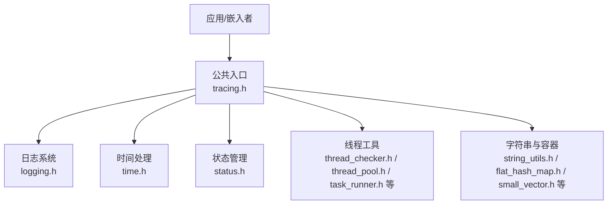
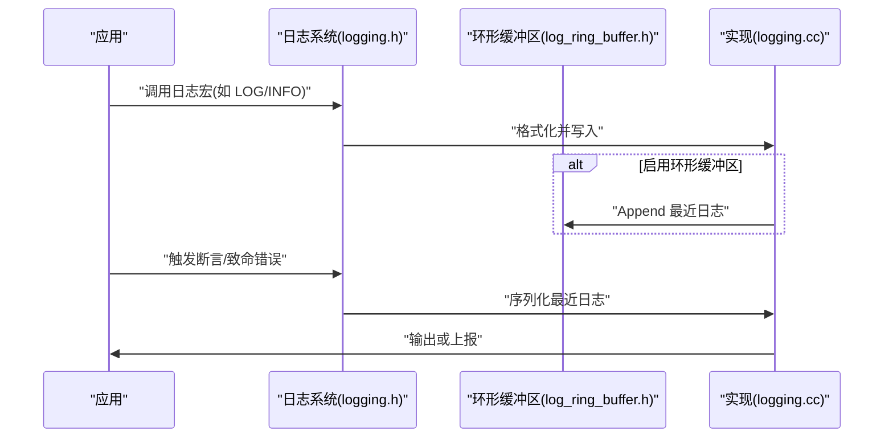
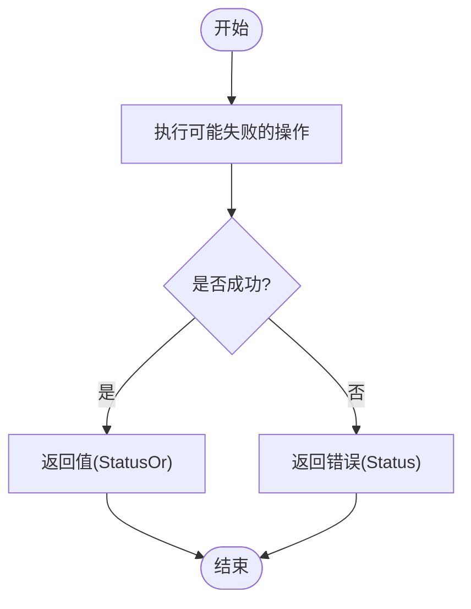
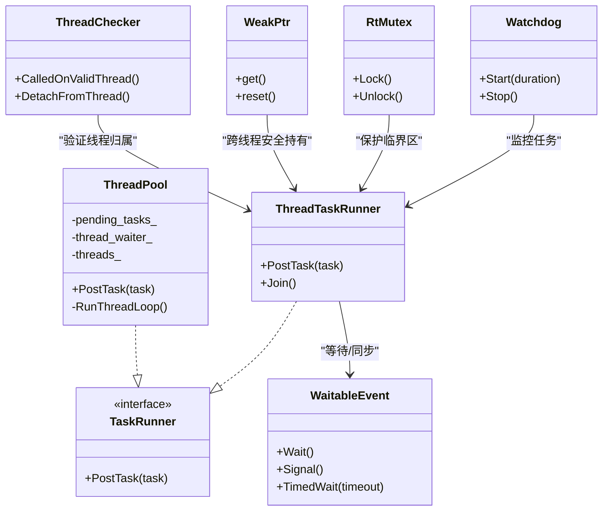
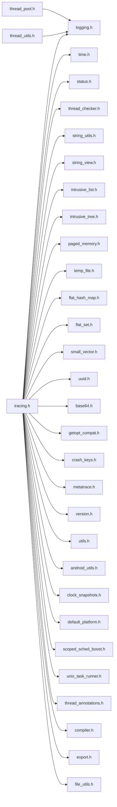

# 基础库API

<cite>
**本文引用的文件**
- [tracing.h](file://include/perfetto/tracing.h)
- [logging.h](file://include/perfetto/base/logging.h)
- [logging.cc](file://src/base/logging.cc)
- [log_ring_buffer.h](file://src/base/log_ring_buffer.h)
- [thread_pool.h](file://include/perfetto/ext/base/threading/thread_pool.h)
- [thread_utils.h](file://include/perfetto/ext/base/thread_utils.h)
- [time.h](file://include/perfetto/base/time.h)
- [time.cc](file://src/base/time.cc)
- [status.h](file://include/perfetto/base/status.h)
- [status.cc](file://src/base/status.cc)
- [thread_checker.h](file://include/perfetto/base/thread_checker.h)
- [thread_checker.cc](file://src/base/thread_checker.cc)
- [task_runner.h](file://include/perfetto/base/task_runner.h)
- [thread_task_runner.h](file://include/perfetto/base/thread_task_runner.h)
- [thread_task_runner.cc](file://src/base/thread_task_runner.cc)
- [waitable_event.h](file://include/perfetto/base/waitable_event.h)
- [waitable_event.cc](file://src/base/waitable_event.cc)
- [build_config.h](file://include/perfetto/base/build_config.h)
- [uuid.h](file://include/perfetto/base/uuid.h)
- [uuid.cc](file://src/base/uuid.cc)
- [string_utils.h](file://include/perfetto/base/string_utils.h)
- [string_utils.cc](file://src/base/string_utils.cc)
- [string_view.h](file://include/perfetto/base/string_view.h)
- [string_view.cc](file://src/base/string_view.cc)
- [intrusive_list.h](file://include/perfetto/base/intrusive_list.h)
- [intrusive_list.cc](file://src/base/intrusive_list.cc)
- [intrusive_tree.h](file://include/perfetto/base/intrusive_tree.h)
- [intrusive_tree.cc](file://src/base/intrusive_tree.cc)
- [paged_memory.h](file://include/perfetto/base/paged_memory.h)
- [paged_memory.cc](file://src/base/paged_memory.cc)
- [temp_file.h](file://include/perfetto/base/temp_file.h)
- [temp_file.cc](file://src/base/temp_file.cc)
- [scoped_mmap.h](file://include/perfetto/base/scoped_mmap.h)
- [scoped_mmap.cc](file://src/base/scoped_mmap.cc)
- [subprocess.h](file://include/perfetto/base/subprocess.h)
- [subprocess.cc](file://src/base/subprocess.cc)
- [periodic_task.h](file://include/perfetto/base/periodic_task.h)
- [periodic_task.cc](file://src/base/periodic_task.cc)
- [lock_free_task_runner.h](file://include/perfetto/base/lock_free_task_runner.h)
- [lock_free_task_runner.cc](file://src/base/lock_free_task_runner.cc)
- [rt_mutex.h](file://include/perfetto/base/rt_mutex.h)
- [rt_mutex.cc](file://src/base/rt_mutex.cc)
- [watchdog.h](file://include/perfetto/base/watchdog.h)
- [watchdog.cc](file://src/base/watchdog.cc)
- [weak_ptr.h](file://include/perfetto/base/weak_ptr.h)
- [weak_ptr.cc](file://src/base/weak_ptr.cc)
- [unix_socket.h](file://include/perfetto/base/unix_socket.h)
- [unix_socket.cc](file://src/base/unix_socket.cc)
- [pipe.h](file://include/perfetto/base/pipe.h)
- [pipe.cc](file://src/base/pipe.cc)
- [event_fd.h](file://include/perfetto/base/event_fd.h)
- [event_fd.cc](file://src/base/event_fd.cc)
- [fixed_string_writer.h](file://include/perfetto/base/fixed_string_writer.h)
- [fixed_string_writer.cc](file://src/base/fixed_string_writer.cc)
- [dynamic_string_writer.h](file://include/perfetto/base/dynamic_string_writer.h)
- [dynamic_string_writer.cc](file://src/base/dynamic_string_writer.cc)
- [string_splitter.h](file://include/perfetto/base/string_splitter.h)
- [string_splitter.cc](file://src/base/string_splitter.cc)
- [string_view_splitter.h](file://include/perfetto/base/string_view_splitter.h)
- [string_view_splitter.cc](file://src/base/string_view_splitter.cc)
- [flat_hash_map.h](file://include/perfetto/base/flat_hash_map.h)
- [flat_hash_map.cc](file://src/base/flat_hash_map.cc)
- [flat_set.h](file://include/perfetto/base/flat_set.h)
- [flat_set.cc](file://src/base/flat_set.cc)
- [small_vector.h](file://include/perfetto/base/small_vector.h)
- [small_vector.cc](file://src/base/small_vector.cc)
- [fnv_hash.h](file://include/perfetto/base/fnv_hash.h)
- [fnv_hash.cc](file://src/base/fnv_hash.cc)
- [murmur_hash.h](file://include/perfetto/base/murmur_hash.h)
- [murmur_hash.cc](file://src/base/murmur_hash.cc)
- [base64.h](file://include/perfetto/base/base64.h)
- [base64.cc](file://src/base/base64.cc)
- [getopt_compat.h](file://include/perfetto/base/getopt_compat.h)
- [getopt_compat.cc](file://src/base/getopt_compat.cc)
- [ctrl_c_handler.h](file://include/perfetto/base/ctrl_c_handler.h)
- [ctrl_c_handler.cc](file://src/base/ctrl_c_handler.cc)
- [crash_keys.h](file://include/perfetto/base/crash_keys.h)
- [crash_keys.cc](file://src/base/crash_keys.cc)
- [debug_crash_stack_trace.h](file://include/perfetto/base/debug_crash_stack_trace.h)
- [debug_crash_stack_trace.cc](file://src/base/debug_crash_stack_trace.cc)
- [metatrace.h](file://include/perfetto/base/metatrace.h)
- [metatrace.cc](file://src/base/metatrace.cc)
- [version.h](file://include/perfetto/base/version.h)
- [version.cc](file://src/base/version.cc)
- [utils.h](file://include/perfetto/base/utils.h)
- [utils.cc](file://src/base/utils.cc)
- [vm_sockets.h](file://include/perfetto/base/vm_sockets.h)
- [vm_sockets.cc](file://src/base/vm_sockets.cc)
- [android_utils.h](file://include/perfetto/base/android_utils.h)
- [android_utils.cc](file://src/base/android_utils.cc)
- [clock_snapshots.h](file://include/perfetto/base/clock_snapshots.h)
- [clock_snapshots.cc](file://src/base/clock_snapshots.cc)
- [default_platform.h](file://include/perfetto/base/default_platform.h)
- [default_platform.cc](file://src/base/default_platform.cc)
- [scoped_sched_boost.h](file://include/perfetto/base/scoped_sched_boost.h)
- [scoped_sched_boost.cc](file://src/base/scoped_sched_boost.cc)
- [unix_task_runner.h](file://include/perfetto/base/unix_task_runner.h)
- [unix_task_runner.cc](file://src/base/unix_task_runner.cc)
- [thread_annotations.h](file://include/perfetto/base/thread_annotations.h)
- [thread_annotations.cc](file://src/base/thread_annotations.cc)
- [compiler.h](file://include/perfetto/base/compiler.h)
- [compiler.cc](file://src/base/compiler.cc)
- [export.h](file://include/perfetto/base/export.h)
- [export.cc](file://src/base/export.cc)
- [file_utils.h](file://include/perfetto/base/file_utils.h)
- [file_utils.cc](file://src/base/file_utils.cc)
- [string_view_unittest.cc](file://src/base/string_view_unittest.cc)
- [string_utils_unittest.cc](file://src/base/string_utils_unittest.cc)
- [intrusive_list_unittest.cc](file://src/base/intrusive_list_unittest.cc)
- [intrusive_tree_unittest.cc](file://src/base/intrusive_tree_unittest.cc)
- [flat_hash_map_unittest.cc](file://src/base/flat_hash_map_unittest.cc)
- [flat_set_unittest.cc](file://src/base/flat_set_unittest.cc)
- [small_vector_unittest.cc](file://src/base/small_vector_unittest.cc)
- [paged_memory_unittest.cc](file://src/base/paged_memory_unittest.cc)
- [temp_file_unittest.cc](file://src/base/temp_file_unittest.cc)
- [scoped_mmap_unittest.cc](file://src/base/scoped_mmap_unittest.cc)
- [subprocess_unittest.cc](file://src/base/subprocess_unittest.cc)
- [periodic_task_unittest.cc](file://src/base/periodic_task_unittest.cc)
- [rt_mutex_unittest.cc](file://src/base/rt_mutex_unittest.cc)
- [watchdog_unittest.cc](file://src/base/watchdog_unittest.cc)
- [weak_ptr_unittest.cc](file://src/base/weak_ptr_unittest.cc)
- [unix_socket_unittest.cc](file://src/base/unix_socket_unittest.cc)
- [pipe_unittest.cc](file://src/base/pipe_unittest.cc)
- [event_fd_unittest.cc](file://src/base/event_fd_unittest.cc)
- [fixed_string_writer_unittest.cc](file://src/base/fixed_string_writer_unittest.cc)
- [dynamic_string_writer_unittest.cc](file://src/base/dynamic_string_writer_unittest.cc)
- [string_splitter_unittest.cc](file://src/base/string_splitter_unittest.cc)
- [string_view_splitter_unittest.cc](file://src/base/string_view_splitter_unittest.cc)
- [uuid_unittest.cc](file://src/base/uuid_unittest.cc)
- [base64_unittest.cc](file://src/base/base64_unittest.cc)
- [getopt_compat_unittest.cc](file://src/base/getopt_compat_unittest.cc)
- [ctrl_c_handler_unittest.cc](file://src/base/ctrl_c_handler_unittest.cc)
- [crash_keys_unittest.cc](file://src/base/crash_keys_unittest.cc)
- [metatrace_unittest.cc](file://src/base/metatrace_unittest.cc)
- [version_unittest.cc](file://src/base/version_unittest.cc)
- [utils_unittest.cc](file://src/base/utils_unittest.cc)
- [vm_sockets_unittest.cc](file://src/base/vm_sockets_unittest.cc)
- [android_utils_unittest.cc](file://src/base/android_utils_unittest.cc)
- [clock_snapshots_unittest.cc](file://src/base/clock_snapshots_unittest.cc)
- [default_platform_unittest.cc](file://src/base/default_platform_unittest.cc)
- [scoped_sched_boost_unittest.cc](file://src/base/scoped_sched_boost_unittest.cc)
- [unix_task_runner_unittest.cc](file://src/base/unix_task_runner_unittest.cc)
- [thread_annotations_unittest.cc](file://src/base/thread_annotations_unittest.cc)
- [compiler_unittest.cc](file://src/base/compiler_unittest.cc)
- [export_unittest.cc](file://src/base/export_unittest.cc)
- [file_utils_unittest.cc](file://src/base/file_utils_unittest.cc)
</cite>

## 目录
1. [简介](#简介)
2. [项目结构](#项目结构)
3. [核心组件](#核心组件)
4. [架构总览](#架构总览)
5. [详细组件分析](#详细组件分析)
6. [依赖关系分析](#依赖关系分析)
7. [性能考量](#性能考量)
8. [故障排查指南](#故障排查指南)
9. [结论](#结论)
10. [附录](#附录)

## 简介
本文件为 Perfetto 基础库 API 的权威参考文档，覆盖日志系统、状态管理、线程工具、时间处理、字符串与容器工具、内存与资源管理、异常与断言、平台适配与并发最佳实践等主题。文档以循序渐进的方式组织内容，既适合初学者快速上手，也为高级用户提供深入的技术细节与实现原理。

## 项目结构
基础库位于 include/perfetto/base 与 include/perfetto/ext/base 下，分别提供核心基础能力与扩展线程工具；源码位于 src/base。公共头文件 tracing.h 汇聚了追踪 API 所需的关键头文件，便于嵌入式使用。

图示来源
- [tracing.h](file://include/perfetto/tracing.h)
- [logging.h](file://include/perfetto/base/logging.h)
- [time.h](file://include/perfetto/base/time.h)
- [status.h](file://include/perfetto/base/status.h)
- [thread_checker.h](file://include/perfetto/base/thread_checker.h)
- [string_utils.h](file://include/perfetto/base/string_utils.h)
- [string_view.h](file://include/perfetto/base/string_view.h)
- [intrusive_list.h](file://include/perfetto/base/intrusive_list.h)
- [intrusive_tree.h](file://include/perfetto/base/intrusive_tree.h)
- [paged_memory.h](file://include/perfetto/base/paged_memory.h)
- [temp_file.h](file://include/perfetto/base/temp_file.h)
- [flat_hash_map.h](file://include/perfetto/base/flat_hash_map.h)
- [flat_set.h](file://include/perfetto/base/flat_set.h)
- [small_vector.h](file://include/perfetto/base/small_vector.h)
- [uuid.h](file://include/perfetto/base/uuid.h)
- [base64.h](file://include/perfetto/base/base64.h)
- [getopt_compat.h](file://include/perfetto/base/getopt_compat.h)
- [crash_keys.h](file://include/perfetto/base/crash_keys.h)
- [metatrace.h](file://include/perfetto/base/metatrace.h)
- [version.h](file://include/perfetto/base/version.h)
- [utils.h](file://include/perfetto/base/utils.h)
- [android_utils.h](file://include/perfetto/base/android_utils.h)
- [clock_snapshots.h](file://include/perfetto/base/clock_snapshots.h)
- [default_platform.h](file://include/perfetto/base/default_platform.h)
- [scoped_sched_boost.h](file://include/perfetto/base/scoped_sched_boost.h)
- [unix_task_runner.h](file://include/perfetto/base/unix_task_runner.h)
- [thread_annotations.h](file://include/perfetto/base/thread_annotations.h)
- [compiler.h](file://include/perfetto/base/compiler.h)
- [export.h](file://include/perfetto/base/export.h)
- [file_utils.h](file://include/perfetto/base/file_utils.h)
- [thread_pool.h](file://include/perfetto/ext/base/threading/thread_pool.h)
- [thread_utils.h](file://include/perfetto/ext/base/thread_utils.h)

章节来源
- [tracing.h](file://include/perfetto/tracing.h)
- [build_config.h](file://include/perfetto/base/build_config.h)

## 核心组件
- 日志系统：提供统一的日志接口、可选的环形缓冲区记录、崩溃前序列化、以及跨平台输出适配。
- 状态管理：提供 Status/StatusOr 类型，简化错误传播与处理。
- 线程工具：提供线程池、任务运行器、事件同步、线程检查器、弱指针、实时互斥锁、看门狗等。
- 时间处理：提供高精度时间测量、时钟快照与平台默认平台抽象。
- 字符串与容器工具：提供字符串视图、扁平哈希表、集合、小向量等高性能数据结构。
- 内存与资源：提供分页内存、临时文件、内存映射、管道、Unix 套接字、事件文件描述符等资源管理。
- 平台与编译器：提供构建标志检测、导出宏、编译器特性、平台适配等。

章节来源
- [logging.h](file://include/perfetto/base/logging.h)
- [logging.cc](file://src/base/logging.cc)
- [log_ring_buffer.h](file://src/base/log_ring_buffer.h)
- [status.h](file://include/perfetto/base/status.h)
- [status.cc](file://src/base/status.cc)
- [thread_pool.h](file://include/perfetto/ext/base/threading/thread_pool.h)
- [task_runner.h](file://include/perfetto/base/task_runner.h)
- [thread_task_runner.h](file://include/perfetto/base/thread_task_runner.h)
- [thread_task_runner.cc](file://src/base/thread_task_runner.cc)
- [waitable_event.h](file://include/perfetto/base/waitable_event.h)
- [waitable_event.cc](file://src/base/waitable_event.cc)
- [thread_checker.h](file://include/perfetto/base/thread_checker.h)
- [thread_checker.cc](file://src/base/thread_checker.cc)
- [lock_free_task_runner.h](file://include/perfetto/base/lock_free_task_runner.h)
- [lock_free_task_runner.cc](file://src/base/lock_free_task_runner.cc)
- [rt_mutex.h](file://include/perfetto/base/rt_mutex.h)
- [rt_mutex.cc](file://src/base/rt_mutex.cc)
- [watchdog.h](file://include/perfetto/base/watchdog.h)
- [watchdog.cc](file://src/base/watchdog.cc)
- [weak_ptr.h](file://include/perfetto/base/weak_ptr.h)
- [weak_ptr.cc](file://src/base/weak_ptr.cc)
- [unix_socket.h](file://include/perfetto/base/unix_socket.h)
- [unix_socket.cc](file://src/base/unix_socket.cc)
- [pipe.h](file://include/perfetto/base/pipe.h)
- [pipe.cc](file://src/base/pipe.cc)
- [event_fd.h](file://include/perfetto/base/event_fd.h)
- [event_fd.cc](file://src/base/event_fd.cc)
- [fixed_string_writer.h](file://include/perfetto/base/fixed_string_writer.h)
- [fixed_string_writer.cc](file://src/base/fixed_string_writer.cc)
- [dynamic_string_writer.h](file://include/perfetto/base/dynamic_string_writer.h)
- [dynamic_string_writer.cc](file://src/base/dynamic_string_writer.cc)
- [string_splitter.h](file://include/perfetto/base/string_splitter.h)
- [string_splitter.cc](file://src/base/string_splitter.cc)
- [string_view_splitter.h](file://include/perfetto/base/string_view_splitter.h)
- [string_view_splitter.cc](file://src/base/string_view_splitter.cc)
- [flat_hash_map.h](file://include/perfetto/base/flat_hash_map.h)
- [flat_hash_map.cc](file://src/base/flat_hash_map.cc)
- [flat_set.h](file://include/perfetto/base/flat_set.h)
- [flat_set.cc](file://src/base/flat_set.cc)
- [small_vector.h](file://include/perfetto/base/small_vector.h)
- [small_vector.cc](file://src/base/small_vector.cc)
- [uuid.h](file://include/perfetto/base/uuid.h)
- [uuid.cc](file://src/base/uuid.cc)
- [string_utils.h](file://include/perfetto/base/string_utils.h)
- [string_utils.cc](file://src/base/string_utils.cc)
- [string_view.h](file://include/perfetto/base/string_view.h)
- [string_view.cc](file://src/base/string_view.cc)
- [paged_memory.h](file://include/perfetto/base/paged_memory.h)
- [paged_memory.cc](file://src/base/paged_memory.cc)
- [temp_file.h](file://include/perfetto/base/temp_file.h)
- [temp_file.cc](file://src/base/temp_file.cc)
- [scoped_mmap.h](file://include/perfetto/base/scoped_mmap.h)
- [scoped_mmap.cc](file://src/base/scoped_mmap.cc)
- [subprocess.h](file://include/perfetto/base/subprocess.h)
- [subprocess.cc](file://src/base/subprocess.cc)
- [periodic_task.h](file://include/perfetto/base/periodic_task.h)
- [periodic_task.cc](file://src/base/periodic_task.cc)
- [build_config.h](file://include/perfetto/base/build_config.h)
- [unix_task_runner.h](file://include/perfetto/base/unix_task_runner.h)
- [unix_task_runner.cc](file://src/base/unix_task_runner.cc)
- [thread_annotations.h](file://include/perfetto/base/thread_annotations.h)
- [thread_annotations.cc](file://src/base/thread_annotations.cc)
- [compiler.h](file://include/perfetto/base/compiler.h)
- [compiler.cc](file://src/base/compiler.cc)
- [export.h](file://include/perfetto/base/export.h)
- [export.cc](file://src/base/export.cc)
- [file_utils.h](file://include/perfetto/base/file_utils.h)
- [file_utils.cc](file://src/base/file_utils.cc)

## 架构总览
基础库采用“按需暴露”的头文件设计，公共入口 tracing.h 聚合追踪所需的关键头文件，避免使用者逐一包含。核心模块之间通过清晰的头文件边界解耦，同时在 src/base 提供实现细节与单元测试保障。

图示来源
- [tracing.h](file://include/perfetto/tracing.h)
- [logging.h](file://include/perfetto/base/logging.h)
- [time.h](file://include/perfetto/base/time.h)
- [status.h](file://include/perfetto/base/status.h)
- [thread_checker.h](file://include/perfetto/base/thread_checker.h)
- [thread_pool.h](file://include/perfetto/ext/base/threading/thread_pool.h)
- [task_runner.h](file://include/perfetto/base/task_runner.h)
- [string_utils.h](file://include/perfetto/base/string_utils.h)
- [flat_hash_map.h](file://include/perfetto/base/flat_hash_map.h)
- [small_vector.h](file://include/perfetto/base/small_vector.h)

## 详细组件分析

### 日志系统
- 功能概述
  - 统一日志接口与格式化输出，支持调试/信息/重要/错误等级。
  - 可选的崩溃前日志环形缓冲区，用于在致命错误或断言失败时收集最近日志。
  - 条件编译控制（DLOG/DCHECK），支持不同构建配置下的日志开关。
  - 跨平台输出适配（Android、异步安全日志等）。
- 关键接口
  - 设置日志回调、记录日志消息、崩溃前序列化最近日志、断言与致命错误宏。
- 线程安全性
  - 日志写入路径通常非线程安全，但环形缓冲区 Append 在多线程下具备部分容错语义，Read 非线程安全但在实践中可接受。
- 使用建议
  - 在多线程环境中，尽量将日志聚合到主线程或专用日志线程，避免在高频路径中直接打印。
  - 使用环形缓冲区仅在需要崩溃时携带上下文日志时启用。
- 实际场景
  - 初始化阶段输出关键配置与版本信息。
  - 在关键路径使用 DLOG/LOG 进行诊断，发布版本关闭调试日志。

图示来源
- [logging.h](file://include/perfetto/base/logging.h)
- [logging.cc](file://src/base/logging.cc)
- [log_ring_buffer.h](file://src/base/log_ring_buffer.h)

章节来源
- [logging.h](file://include/perfetto/base/logging.h)
- [logging.cc](file://src/base/logging.cc)
- [log_ring_buffer.h](file://src/base/log_ring_buffer.h)

### 状态管理
- 功能概述
  - Status 表示操作结果（成功/失败），StatusOr<T> 将值与错误组合，简化错误传播。
- 关键接口
  - 创建成功/失败状态、从错误构造 StatusOr、访问值或错误。
- 使用建议
  - 在 API 边界返回 StatusOr，避免裸抛异常。
  - 使用 Status 提供一致的错误描述与分类。
- 实现要点
  - 错误对象内部封装错误码与消息，支持链式错误包装。

图示来源
- [status.h](file://include/perfetto/base/status.h)
- [status.cc](file://src/base/status.cc)

章节来源
- [status.h](file://include/perfetto/base/status.h)
- [status.cc](file://src/base/status.cc)

### 线程工具
- 线程池 ThreadPool
  - 设计目标：CPU 密集型任务，有界线程池，FIFO 任务队列。
  - 生命周期：线程随池创建并常驻，析构时等待任务完成并回收。
  - 注意事项：不适合长时间阻塞的 IO 任务，可能导致饥饿。
- 任务运行器 TaskRunner/ThreadTaskRunner
  - 抽象任务调度接口，支持线程内/外部任务提交与执行。
- 事件同步 WaitableEvent
  - 提供跨线程等待/唤醒机制，支持超时。
- 线程检查器 ThreadChecker
  - 确保某段代码在特定线程执行，辅助线程模型一致性。
- 弱指针 WeakPtr
  - 安全持有对象引用，避免悬空指针。
- 实时互斥锁 RtMutex
  - 低延迟互斥，适用于实时性要求较高的场景。
- 看门狗 Watchdog
  - 监测长时间运行的任务或死锁风险。
- 平台线程工具 ThreadUtils
  - 平台相关的线程属性设置与名称管理。

图示来源
- [thread_pool.h](file://include/perfetto/ext/base/threading/thread_pool.h)
- [task_runner.h](file://include/perfetto/base/task_runner.h)
- [thread_task_runner.h](file://include/perfetto/base/thread_task_runner.h)
- [thread_task_runner.cc](file://src/base/thread_task_runner.cc)
- [waitable_event.h](file://include/perfetto/base/waitable_event.h)
- [waitable_event.cc](file://src/base/waitable_event.cc)
- [thread_checker.h](file://include/perfetto/base/thread_checker.h)
- [thread_checker.cc](file://src/base/thread_checker.cc)
- [weak_ptr.h](file://include/perfetto/base/weak_ptr.h)
- [weak_ptr.cc](file://src/base/weak_ptr.cc)
- [rt_mutex.h](file://include/perfetto/base/rt_mutex.h)
- [rt_mutex.cc](file://src/base/rt_mutex.cc)
- [watchdog.h](file://include/perfetto/base/watchdog.h)
- [watchdog.cc](file://src/base/watchdog.cc)

章节来源
- [thread_pool.h](file://include/perfetto/ext/base/threading/thread_pool.h)
- [task_runner.h](file://include/perfetto/base/task_runner.h)
- [thread_task_runner.h](file://include/perfetto/base/thread_task_runner.h)
- [thread_task_runner.cc](file://src/base/thread_task_runner.cc)
- [waitable_event.h](file://include/perfetto/base/waitable_event.h)
- [waitable_event.cc](file://src/base/waitable_event.cc)
- [thread_checker.h](file://include/perfetto/base/thread_checker.h)
- [thread_checker.cc](file://src/base/thread_checker.cc)
- [weak_ptr.h](file://include/perfetto/base/weak_ptr.h)
- [weak_ptr.cc](file://src/base/weak_ptr.cc)
- [rt_mutex.h](file://include/perfetto/base/rt_mutex.h)
- [rt_mutex.cc](file://src/base/rt_mutex.cc)
- [watchdog.h](file://include/perfetto/base/watchdog.h)
- [watchdog.cc](file://src/base/watchdog.cc)

### 时间处理
- 功能概述
  - 提供高精度时间测量、时钟快照、平台默认平台抽象。
- 关键接口
  - 获取当前时间、计算时间差、时钟同步快照。
- 使用建议
  - 在性能敏感路径使用高精度计时，注意系统时钟漂移与单调性。
- 实现要点
  - 默认平台提供统一的时间抽象，避免直接依赖平台 API。

章节来源
- [time.h](file://include/perfetto/base/time.h)
- [time.cc](file://src/base/time.cc)
- [clock_snapshots.h](file://include/perfetto/base/clock_snapshots.h)
- [clock_snapshots.cc](file://src/base/clock_snapshots.cc)
- [default_platform.h](file://include/perfetto/base/default_platform.h)
- [default_platform.cc](file://src/base/default_platform.cc)

### 字符串与容器工具
- 字符串工具
  - 字符串视图 StringView、字符串拆分 Splitter、动态/固定长度字符串写入器。
- 容器工具
  - 扁平哈希表 FlatHashMap、扁平集合 FlatSet、小向量 SmallVector。
- 使用建议
  - 在高频分配场景优先使用扁平容器与 StringView，减少拷贝与堆分配。
- 性能考量
  - 扁平容器在小规模数据下具有更好的缓存局部性与零分配优势。

章节来源
- [string_view.h](file://include/perfetto/base/string_view.h)
- [string_view.cc](file://src/base/string_view.cc)
- [string_splitter.h](file://include/perfetto/base/string_splitter.h)
- [string_splitter.cc](file://src/base/string_splitter.cc)
- [string_view_splitter.h](file://include/perfetto/base/string_view_splitter.h)
- [string_view_splitter.cc](file://src/base/string_view_splitter.cc)
- [fixed_string_writer.h](file://include/perfetto/base/fixed_string_writer.h)
- [fixed_string_writer.cc](file://src/base/fixed_string_writer.cc)
- [dynamic_string_writer.h](file://include/perfetto/base/dynamic_string_writer.h)
- [dynamic_string_writer.cc](file://src/base/dynamic_string_writer.cc)
- [flat_hash_map.h](file://include/perfetto/base/flat_hash_map.h)
- [flat_hash_map.cc](file://src/base/flat_hash_map.cc)
- [flat_set.h](file://include/perfetto/base/flat_set.h)
- [flat_set.cc](file://src/base/flat_set.cc)
- [small_vector.h](file://include/perfetto/base/small_vector.h)
- [small_vector.cc](file://src/base/small_vector.cc)

### 内存与资源管理
- 分页内存 PagedMemory
  - 提供按页对齐的内存分配与释放，适合大块内存管理。
- 临时文件 TempFile
  - 自动管理临时文件生命周期，确保退出时清理。
- 内存映射 ScopedMmap
  - RAII 包装文件映射，自动解除映射。
- 子进程 Subprocess
  - 跨平台子进程创建与控制。
- 周期性任务 PeriodicTask
  - 定时周期性执行任务，避免忙等。
- Unix 套接字/管道/事件文件描述符
  - 提供 IPC 与事件通知的底层抽象。

章节来源
- [paged_memory.h](file://include/perfetto/base/paged_memory.h)
- [paged_memory.cc](file://src/base/paged_memory.cc)
- [temp_file.h](file://include/perfetto/base/temp_file.h)
- [temp_file.cc](file://src/base/temp_file.cc)
- [scoped_mmap.h](file://include/perfetto/base/scoped_mmap.h)
- [scoped_mmap.cc](file://src/base/scoped_mmap.cc)
- [subprocess.h](file://include/perfetto/base/subprocess.h)
- [subprocess.cc](file://src/base/subprocess.cc)
- [periodic_task.h](file://include/perfetto/base/periodic_task.h)
- [periodic_task.cc](file://src/base/periodic_task.cc)
- [unix_socket.h](file://include/perfetto/base/unix_socket.h)
- [unix_socket.cc](file://src/base/unix_socket.cc)
- [pipe.h](file://include/perfetto/base/pipe.h)
- [pipe.cc](file://src/base/pipe.cc)
- [event_fd.h](file://include/perfetto/base/event_fd.h)
- [event_fd.cc](file://src/base/event_fd.cc)

### 平台与编译器适配
- 构建标志 BuildConfig
  - 自动检测操作系统、编译器、架构与构建类型，生成统一的条件编译宏。
- 导出宏 Export
  - 控制符号导出，保证 ABI 稳定性。
- 编译器特性 Compiler
  - 提供编译器相关的特性检测与优化提示。
- 平台默认平台 DefaultPlatform
  - 提供平台无关的默认实现与适配层。

章节来源
- [build_config.h](file://include/perfetto/base/build_config.h)
- [export.h](file://include/perfetto/base/export.h)
- [export.cc](file://src/base/export.cc)
- [compiler.h](file://include/perfetto/base/compiler.h)
- [compiler.cc](file://src/base/compiler.cc)
- [default_platform.h](file://include/perfetto/base/default_platform.h)
- [default_platform.cc](file://src/base/default_platform.cc)

## 依赖关系分析
基础库通过公共入口 tracing.h 聚合关键头文件，降低使用者的包含成本；各模块间保持松耦合，通过明确的接口进行交互。扩展线程工具位于 ext/base，避免将非核心能力引入基础库。

图示来源
- [tracing.h](file://include/perfetto/tracing.h)
- [logging.h](file://include/perfetto/base/logging.h)
- [time.h](file://include/perfetto/base/time.h)
- [status.h](file://include/perfetto/base/status.h)
- [thread_checker.h](file://include/perfetto/base/thread_checker.h)
- [string_utils.h](file://include/perfetto/base/string_utils.h)
- [string_view.h](file://include/perfetto/base/string_view.h)
- [intrusive_list.h](file://include/perfetto/base/intrusive_list.h)
- [intrusive_tree.h](file://include/perfetto/base/intrusive_tree.h)
- [paged_memory.h](file://include/perfetto/base/paged_memory.h)
- [temp_file.h](file://include/perfetto/base/temp_file.h)
- [flat_hash_map.h](file://include/perfetto/base/flat_hash_map.h)
- [flat_set.h](file://include/perfetto/base/flat_set.h)
- [small_vector.h](file://include/perfetto/base/small_vector.h)
- [uuid.h](file://include/perfetto/base/uuid.h)
- [base64.h](file://include/perfetto/base/base64.h)
- [getopt_compat.h](file://include/perfetto/base/getopt_compat.h)
- [crash_keys.h](file://include/perfetto/base/crash_keys.h)
- [metatrace.h](file://include/perfetto/base/metatrace.h)
- [version.h](file://include/perfetto/base/version.h)
- [utils.h](file://include/perfetto/base/utils.h)
- [android_utils.h](file://include/perfetto/base/android_utils.h)
- [clock_snapshots.h](file://include/perfetto/base/clock_snapshots.h)
- [default_platform.h](file://include/perfetto/base/default_platform.h)
- [scoped_sched_boost.h](file://include/perfetto/base/scoped_sched_boost.h)
- [unix_task_runner.h](file://include/perfetto/base/unix_task_runner.h)
- [thread_annotations.h](file://include/perfetto/base/thread_annotations.h)
- [compiler.h](file://include/perfetto/base/compiler.h)
- [export.h](file://include/perfetto/base/export.h)
- [file_utils.h](file://include/perfetto/base/file_utils.h)
- [thread_pool.h](file://include/perfetto/ext/base/threading/thread_pool.h)
- [thread_utils.h](file://include/perfetto/ext/base/thread_utils.h)

## 性能考量
- 日志
  - 避免在热路径频繁打印，必要时使用 DLOG 条件编译。
  - 启用环形缓冲区会带来额外开销，仅在需要崩溃上下文时启用。
- 线程与并发
  - CPU 密集型任务使用线程池，IO 密集型任务使用异步 IO 与 TaskRunner。
  - 使用 WaitableEvent、RtMutex 等工具提升并发性能与确定性。
- 数据结构
  - 小规模数据优先使用扁平容器（FlatHashMap/FlatSet/SmallVector）以获得更好缓存局部性。
- 时间
  - 使用高精度计时与时钟快照，避免系统时钟漂移影响。
- 内存
  - 大块内存使用 PagedMemory，临时文件与映射使用 RAII 管理，防止泄漏。

## 故障排查指南
- 日志与崩溃
  - 使用崩溃前序列化最近日志功能，定位致命错误前的上下文。
  - 设置自定义日志回调，将日志重定向至外部系统。
- 断言与调试
  - 在开发/测试构建中开启 DCHECK/DLOG，生产环境关闭以减少开销。
  - 使用 ThreadChecker 确保线程归属正确，避免竞态。
- 资源泄漏
  - 使用 RAII 类型（TempFile、ScopedMmap、WaitableEvent）管理资源生命周期。
  - 定期运行单元测试，覆盖资源管理路径。

章节来源
- [logging.h](file://include/perfetto/base/logging.h)
- [logging.cc](file://src/base/logging.cc)
- [log_ring_buffer.h](file://src/base/log_ring_buffer.h)
- [thread_checker.h](file://include/perfetto/base/thread_checker.h)
- [thread_checker.cc](file://src/base/thread_checker.cc)
- [temp_file.h](file://include/perfetto/base/temp_file.h)
- [temp_file.cc](file://src/base/temp_file.cc)
- [scoped_mmap.h](file://include/perfetto/base/scoped_mmap.h)
- [scoped_mmap.cc](file://src/base/scoped_mmap.cc)
- [waitable_event.h](file://include/perfetto/base/waitable_event.h)
- [waitable_event.cc](file://src/base/waitable_event.cc)

## 结论
Perfetto 基础库提供了完备且高性能的基础设施，涵盖日志、状态、线程、时间、字符串与容器、内存与资源管理等关键领域。通过清晰的接口设计与严格的线程安全约束，开发者可以在复杂系统中可靠地复用这些底层能力。建议在实际项目中遵循本文档的使用建议与最佳实践，以获得稳定与高效的运行表现。

## 附录
- 并发编程最佳实践
  - 明确线程职责与所有权，使用 ThreadChecker 与 WaitableEvent 确保协作正确。
  - 避免在热路径进行阻塞操作，使用异步 IO 与 TaskRunner。
  - 对共享数据使用细粒度锁或无锁结构，减少竞争。
- 内存管理与异常处理
  - 优先使用 RAII 管理资源，避免裸指针与手动释放。
  - 使用 Status/StatusOr 统一错误处理，避免异常穿透。
- 版本与兼容性
  - 通过 BuildConfig 与 Export 宏保证跨平台与 ABI 稳定性。
  - 在升级时关注接口变更与废弃警告，逐步迁移。