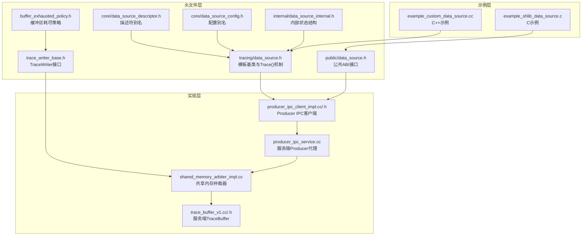
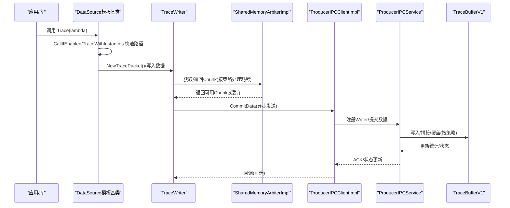
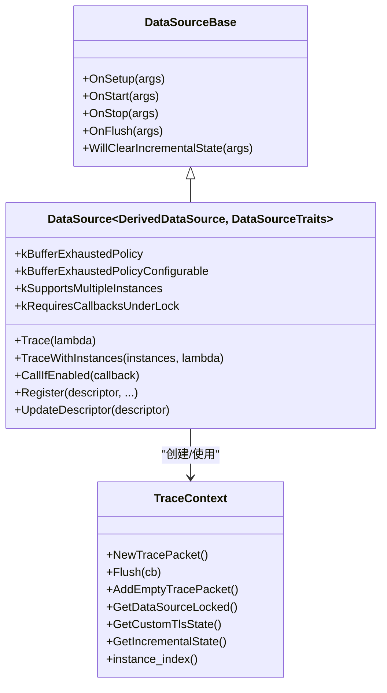
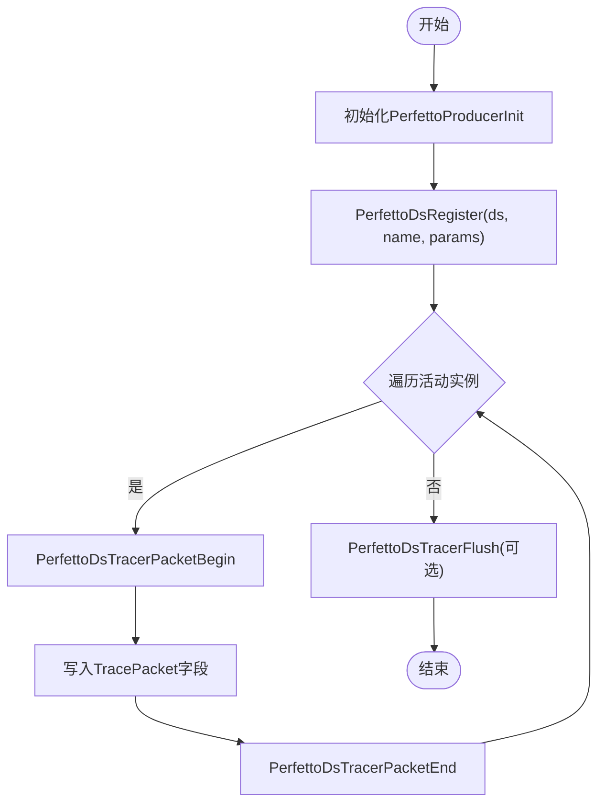
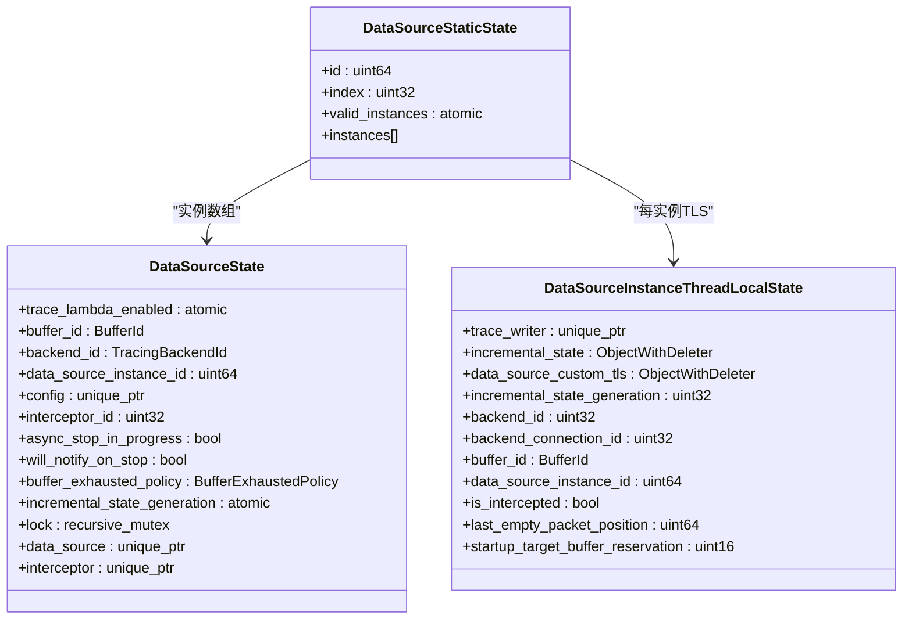
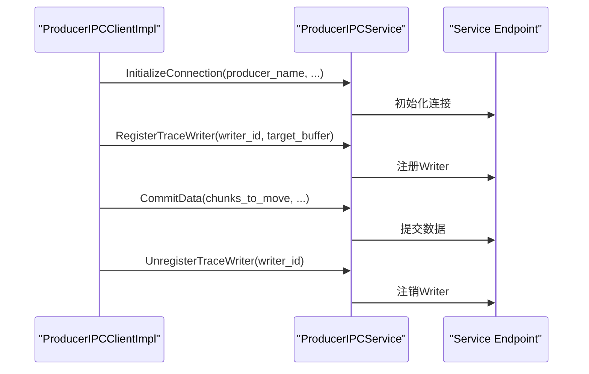
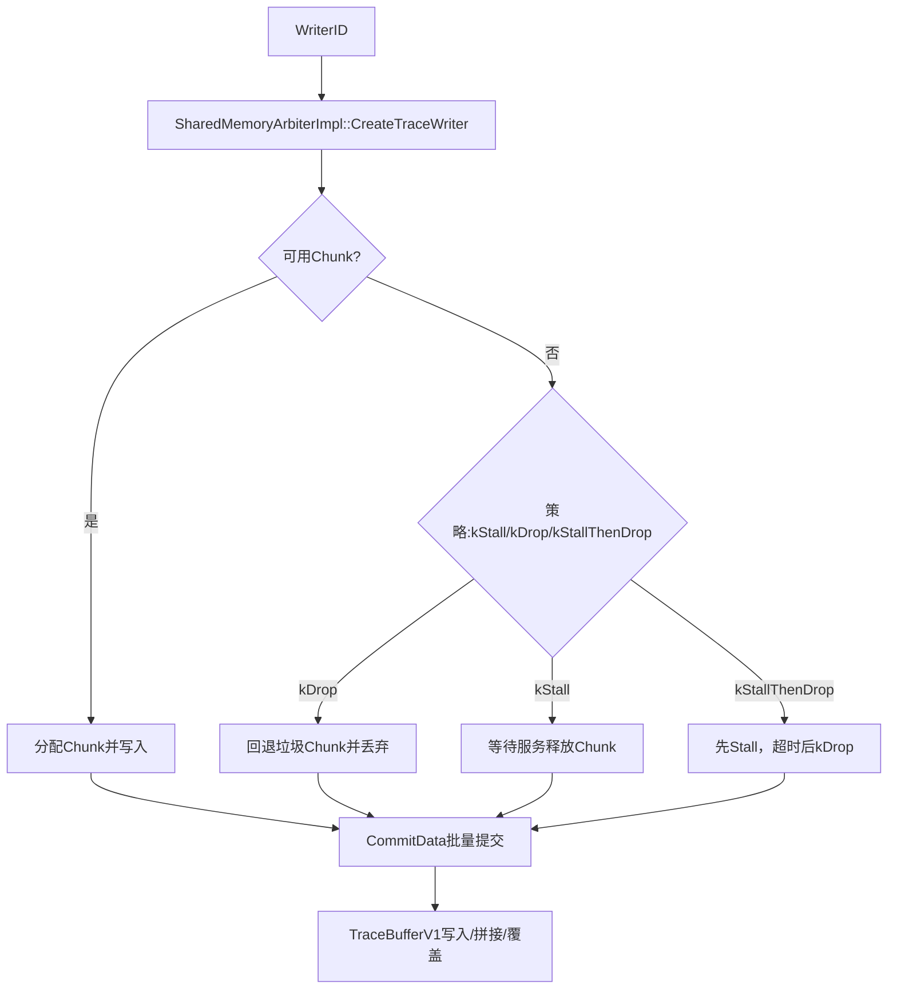
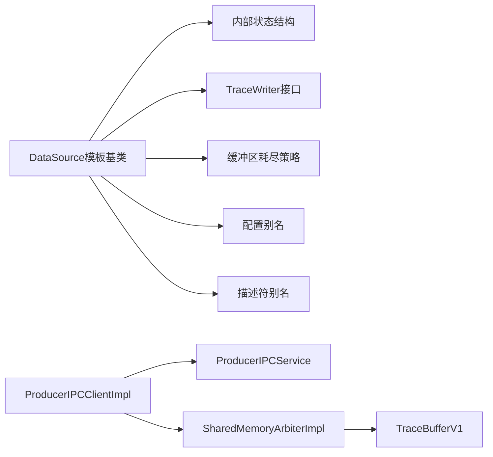

# 数据源接口

<cite>
**本文引用的文件**
- [include/perfetto/tracing/data_source.h](file://include/perfetto/tracing/data_source.h)
- [include/perfetto/public/data_source.h](file://include/perfetto/public/data_source.h)
- [include/perfetto/tracing/core/data_source_descriptor.h](file://include/perfetto/tracing/core/data_source_descriptor.h)
- [include/perfetto/tracing/core/data_source_config.h](file://include/perfetto/tracing/core/data_source_config.h)
- [include/perfetto/tracing/internal/data_source_internal.h](file://include/perfetto/tracing/internal/data_source_internal.h)
- [include/perfetto/tracing/buffer_exhausted_policy.h](file://include/perfetto/tracing/buffer_exhausted_policy.h)
- [include/perfetto/tracing/trace_writer_base.h](file://include/perfetto/tracing/trace_writer_base.h)
- [src/tracing/ipc/producer/producer_ipc_client_impl.cc](file://src/tracing/ipc/producer/producer_ipc_client_impl.cc)
- [src/tracing/ipc/producer/producer_ipc_client_impl.h](file://src/tracing/ipc/producer/producer_ipc_client_impl.h)
- [src/tracing/ipc/service/producer_ipc_service.cc](file://src/tracing/ipc/service/producer_ipc_service.cc)
- [src/tracing/core/shared_memory_arbiter_impl.cc](file://src/tracing/core/shared_memory_arbiter_impl.cc)
- [src/tracing/service/trace_buffer_v1.cc](file://src/tracing/service/trace_buffer_v1.cc)
- [src/tracing/service/trace_buffer_v1.h](file://src/tracing/service/trace_buffer_v1.h)
- [examples/sdk/example_custom_data_source.cc](file://examples/sdk/example_custom_data_source.cc)
- [examples/shared_lib/example_shlib_data_source.c](file://examples/shared_lib/example_shlib_data_source.c)
</cite>

## 目录
1. [简介](#简介)
2. [项目结构](#项目结构)
3. [核心组件](#核心组件)
4. [架构总览](#架构总览)
5. [详细组件分析](#详细组件分析)
6. [依赖关系分析](#依赖关系分析)
7. [性能考量](#性能考量)
8. [故障排查指南](#故障排查指南)
9. [结论](#结论)
10. [附录](#附录)

## 简介
本参考文档面向希望在Perfetto中开发自定义数据源（DataSource）的工程师，系统性阐述数据源接口、Producer端接口、数据源配置、生命周期管理、事件生成机制、缓冲区与共享内存仲裁、以及与追踪服务的交互协议与通信机制。文档同时提供从零开始的开发指南、常见实现模式与最佳实践，帮助读者高效、安全地构建高性能的自定义数据源。

## 项目结构
围绕数据源接口的关键目录与文件如下：
- 头文件层：提供DataSource模板基类、公共ABI接口、描述符与配置别名、内部状态结构与缓冲区耗尽策略等。
- 实现层：Producer端IPC客户端、服务端Producer代理、共享内存仲裁器、服务端TraceBuffer等。
- 示例层：C++与C两种风格的自定义数据源示例，演示注册、事件写入与停止流程。

**图表来源**
- [include/perfetto/tracing/data_source.h](file://include/perfetto/tracing/data_source.h)
- [include/perfetto/public/data_source.h](file://include/perfetto/public/data_source.h)
- [include/perfetto/tracing/core/data_source_descriptor.h](file://include/perfetto/tracing/core/data_source_descriptor.h)
- [include/perfetto/tracing/core/data_source_config.h](file://include/perfetto/tracing/core/data_source_config.h)
- [include/perfetto/tracing/internal/data_source_internal.h](file://include/perfetto/tracing/internal/data_source_internal.h)
- [include/perfetto/tracing/buffer_exhausted_policy.h](file://include/perfetto/tracing/buffer_exhausted_policy.h)
- [include/perfetto/tracing/trace_writer_base.h](file://include/perfetto/tracing/trace_writer_base.h)
- [src/tracing/ipc/producer/producer_ipc_client_impl.cc](file://src/tracing/ipc/producer/producer_ipc_client_impl.cc)
- [src/tracing/ipc/service/producer_ipc_service.cc](file://src/tracing/ipc/service/producer_ipc_service.cc)
- [src/tracing/core/shared_memory_arbiter_impl.cc](file://src/tracing/core/shared_memory_arbiter_impl.cc)
- [src/tracing/service/trace_buffer_v1.cc](file://src/tracing/service/trace_buffer_v1.cc)
- [examples/sdk/example_custom_data_source.cc](file://examples/sdk/example_custom_data_source.cc)
- [examples/shared_lib/example_shlib_data_source.c](file://examples/shared_lib/example_shlib_data_source.c)

**章节来源**
- [include/perfetto/tracing/data_source.h](file://include/perfetto/tracing/data_source.h)
- [include/perfetto/public/data_source.h](file://include/perfetto/public/data_source.h)
- [include/perfetto/tracing/internal/data_source_internal.h](file://include/perfetto/tracing/internal/data_source_internal.h)
- [src/tracing/ipc/producer/producer_ipc_client_impl.cc](file://src/tracing/ipc/producer/producer_ipc_client_impl.cc)
- [src/tracing/ipc/service/producer_ipc_service.cc](file://src/tracing/ipc/service/producer_ipc_service.cc)
- [src/tracing/core/shared_memory_arbiter_impl.cc](file://src/tracing/core/shared_memory_arbiter_impl.cc)
- [src/tracing/service/trace_buffer_v1.cc](file://src/tracing/service/trace_buffer_v1.cc)
- [examples/sdk/example_custom_data_source.cc](file://examples/sdk/example_custom_data_source.cc)
- [examples/shared_lib/example_shlib_data_source.c](file://examples/shared_lib/example_shlib_data_source.c)

## 核心组件
- DataSource模板基类：提供OnSetup/OnStart/OnStop/OnFlush/WillClearIncrementalState等回调；支持多实例、线程局部状态与增量状态；提供Trace()与TraceWithInstances()的快速路径与迭代机制。
- 公共ABI接口（C）：提供PerfettoDs与PerfettoDsParams，用于以C ABI方式注册数据源类型、遍历活动实例、写入TracePacket与Flush。
- 描述符与配置：DataSourceDescriptor与DataSourceConfig别名，简化上层使用。
- 内部状态结构：包含静态全局状态、实例状态、线程局部状态，支撑跨线程、跨会话的Trace()执行。
- 缓冲区耗尽策略：kStall/kDrop/kStallThenDrop三种策略，决定TraceWriter在共享内存不足时的行为。
- TraceWriter接口：单线程写入接口，直接写入共享缓冲区，避免拷贝；支持FinishTracePacket与Flush。

**章节来源**
- [include/perfetto/tracing/data_source.h](file://include/perfetto/tracing/data_source.h)
- [include/perfetto/public/data_source.h](file://include/perfetto/public/data_source.h)
- [include/perfetto/tracing/core/data_source_descriptor.h](file://include/perfetto/tracing/core/data_source_descriptor.h)
- [include/perfetto/tracing/core/data_source_config.h](file://include/perfetto/tracing/core/data_source_config.h)
- [include/perfetto/tracing/internal/data_source_internal.h](file://include/perfetto/tracing/internal/data_source_internal.h)
- [include/perfetto/tracing/buffer_exhausted_policy.h](file://include/perfetto/tracing/buffer_exhausted_policy.h)
- [include/perfetto/tracing/trace_writer_base.h](file://include/perfetto/tracing/trace_writer_base.h)

## 架构总览
下图展示了从应用/库发起Trace()到服务端接收并存储的全链路：

**图表来源**
- [include/perfetto/tracing/data_source.h](file://include/perfetto/tracing/data_source.h)
- [include/perfetto/tracing/trace_writer_base.h](file://include/perfetto/tracing/trace_writer_base.h)
- [src/tracing/core/shared_memory_arbiter_impl.cc](file://src/tracing/core/shared_memory_arbiter_impl.cc)
- [src/tracing/ipc/producer/producer_ipc_client_impl.cc](file://src/tracing/ipc/producer/producer_ipc_client_impl.cc)
- [src/tracing/ipc/service/producer_ipc_service.cc](file://src/tracing/ipc/service/producer_ipc_service.cc)
- [src/tracing/service/trace_buffer_v1.cc](file://src/tracing/service/trace_buffer_v1.cc)

## 详细组件分析

### DataSource模板基类与生命周期
- 生命周期回调
  - OnSetup：在配置生效后、实际开始前调用，适合基于TraceConfig进行初始化。
  - OnStart：实际开始采集时调用。
  - OnStop：停止前调用；可通过HandleStopAsynchronously推迟停止，但需在超时前显式Flush并确保最后事件已提交。
  - OnFlush：服务请求Flush时调用；可通过HandleFlushAsynchronously推迟ACK。
  - WillClearIncrementalState：增量状态清理前调用。
- 多实例与线程局部状态
  - 支持kSupportsMultipleInstances控制是否允许多实例。
  - kRequiresCallbacksUnderLock控制回调是否在内部锁下执行（默认true以兼容旧实现）。
  - TraceContext提供NewTracePacket、Flush、AddEmptyTracePacket、GetDataSourceLocked、GetCustomTlsState、GetIncrementalState等能力。
- 注册与更新
  - Register通过DataSourceDescriptor与工厂函数注册；UpdateDescriptor用于动态更新描述符。
- 快速路径与迭代
  - CallIfEnabled与TraceWithInstances实现无锁快速路径与实例迭代，减少开销。

**图表来源**
- [include/perfetto/tracing/data_source.h](file://include/perfetto/tracing/data_source.h)

**章节来源**
- [include/perfetto/tracing/data_source.h](file://include/perfetto/tracing/data_source.h)

### 公共ABI接口（C）
- PerfettoDs与PerfettoDsParams：描述数据源类型、回调、缓冲区耗尽策略、增量/自定义TLS回调等。
- 注册流程：PerfettoDsRegister创建描述符、设置回调与策略、调用底层实现注册。
- 遍历与写包：PerfettoDsTraceIterateBegin/Next/Break遍历活动实例；PerfettoDsTracerPacketBegin/End写入TracePacket；PerfettoDsTracerFlush触发Flush。

**图表来源**
- [include/perfetto/public/data_source.h](file://include/perfetto/public/data_source.h)
- [examples/shared_lib/example_shlib_data_source.c](file://examples/shared_lib/example_shlib_data_source.c)

**章节来源**
- [include/perfetto/public/data_source.h](file://include/perfetto/public/data_source.h)
- [examples/shared_lib/example_shlib_data_source.c](file://examples/shared_lib/example_shlib_data_source.c)

### 描述符与配置
- DataSourceDescriptor别名：简化上层对protos::gen::DataSourceDescriptor的使用。
- DataSourceConfig别名：简化上层对protos::gen::DataSourceConfig的使用。
- 在DataSource::Register中传入描述符，服务端据此识别数据源类型与特性（如will_notify_on_stop、handles_incremental_state_clear等）。

**章节来源**
- [include/perfetto/tracing/core/data_source_descriptor.h](file://include/perfetto/tracing/core/data_source_descriptor.h)
- [include/perfetto/tracing/core/data_source_config.h](file://include/perfetto/tracing/core/data_source_config.h)
- [include/perfetto/tracing/data_source.h](file://include/perfetto/tracing/data_source.h)

### 内部状态结构与线程局部状态
- DataSourceStaticState：全局唯一ID、索引、有效实例位图、实例数组。
- DataSourceState：每个实例的运行期状态（缓冲区ID、后端ID、实例ID、拦截器ID、增量状态generation、锁、数据源对象、拦截器对象等）。
- DataSourceInstanceThreadLocalState：每个实例在线程局部的TraceWriter、增量状态、自定义TLS、启动目标保留等。
- DataSourceThreadLocalState：每个数据源类型在线程局部的静态状态指针与实例数组。

**图表来源**
- [include/perfetto/tracing/internal/data_source_internal.h](file://include/perfetto/tracing/internal/data_source_internal.h)

**章节来源**
- [include/perfetto/tracing/internal/data_source_internal.h](file://include/perfetto/tracing/internal/data_source_internal.h)

### 缓冲区耗尽策略与TraceWriter
- 缓冲区耗尽策略
  - kStall：等待服务释放Chunk，若长时间无响应则终止进程。
  - kDrop：返回无效Chunk，回退到垃圾Chunk并丢弃数据，直到成功获取新Chunk。
  - kStallThenDrop：先Stall，超时后转为Drop。
- TraceWriter接口
  - NewTracePacket/Finalize/FinishTracePacket/Flush/written/drop_count等。
  - 与SharedMemoryArbiter配合，按策略分配Chunk并提交。

**章节来源**
- [include/perfetto/tracing/buffer_exhausted_policy.h](file://include/perfetto/tracing/buffer_exhausted_policy.h)
- [include/perfetto/tracing/trace_writer_base.h](file://include/perfetto/tracing/trace_writer_base.h)

### Producer端IPC客户端与服务端代理
- ProducerIPCClientImpl
  - 连接服务端、绑定Producer端口、初始化连接、注册/注销TraceWriter、CommitData。
  - 支持异步socket创建、共享内存adopt、直连SMB补丁支持查询等。
- ProducerIPCService
  - 接收来自Producer的InitializeConnection/RegisterTraceWriter/UnregisterTraceWriter/CommitData等请求，转发至服务端Endpoint。

**图表来源**
- [src/tracing/ipc/producer/producer_ipc_client_impl.cc](file://src/tracing/ipc/producer/producer_ipc_client_impl.cc)
- [src/tracing/ipc/producer/producer_ipc_client_impl.h](file://src/tracing/ipc/producer/producer_ipc_client_impl.h)
- [src/tracing/ipc/service/producer_ipc_service.cc](file://src/tracing/ipc/service/producer_ipc_service.cc)

**章节来源**
- [src/tracing/ipc/producer/producer_ipc_client_impl.cc](file://src/tracing/ipc/producer/producer_ipc_client_impl.cc)
- [src/tracing/ipc/producer/producer_ipc_client_impl.h](file://src/tracing/ipc/producer/producer_ipc_client_impl.h)
- [src/tracing/ipc/service/producer_ipc_service.cc](file://src/tracing/ipc/service/producer_ipc_service.cc)

### 共享内存仲裁器与服务端TraceBuffer
- SharedMemoryArbiterImpl
  - 为多个Writer分配WriterID，协调Chunk获取与返回，按策略处理耗尽，批量提交CommitData请求。
- TraceBufferV1
  - 服务端侧的环形缓冲区实现，支持覆盖策略、页/块布局、片段化处理与只读克隆。

**图表来源**
- [src/tracing/core/shared_memory_arbiter_impl.cc](file://src/tracing/core/shared_memory_arbiter_impl.cc)
- [src/tracing/service/trace_buffer_v1.cc](file://src/tracing/service/trace_buffer_v1.cc)
- [src/tracing/service/trace_buffer_v1.h](file://src/tracing/service/trace_buffer_v1.h)

**章节来源**
- [src/tracing/core/shared_memory_arbiter_impl.cc](file://src/tracing/core/shared_memory_arbiter_impl.cc)
- [src/tracing/service/trace_buffer_v1.cc](file://src/tracing/service/trace_buffer_v1.cc)
- [src/tracing/service/trace_buffer_v1.h](file://src/tracing/service/trace_buffer_v1.h)

### 自定义数据源开发指南（C++）
- 步骤
  - 继承DataSource<Derived>，重写OnSetup/OnStart/OnStop等回调。
  - 在合适时机调用Register(DataSourceDescriptor)注册。
  - 使用Trace({...})写入事件；必要时在OnStop中调用Flush确保最后事件被提交。
  - 示例参见example_custom_data_source.cc。
- 宏声明
  - 在源文件中放置PERFETTO_DECLARE_DATA_SOURCE_STATIC_MEMBERS与PERFETTO_DEFINE_DATA_SOURCE_STATIC_MEMBERS宏以暴露静态成员。

**章节来源**
- [examples/sdk/example_custom_data_source.cc](file://examples/sdk/example_custom_data_source.cc)
- [include/perfetto/tracing/data_source.h](file://include/perfetto/tracing/data_source.h)

### 自定义数据源开发指南（C）
- 步骤
  - 初始化Producer（PerfettoProducerInit），注册数据源类型（PerfettoDsRegister），在循环中使用PERFETTO_DS_TRACE遍历活动实例，调用PerfettoDsTracerPacketBegin/End写入事件，必要时调用PerfettoDsTracerFlush。
  - 示例参见example_shlib_data_source.c。
- 注意
  - C ABI不提供DataSource模板基类，需自行管理生命周期与回调。

**章节来源**
- [examples/shared_lib/example_shlib_data_source.c](file://examples/shared_lib/example_shlib_data_source.c)
- [include/perfetto/public/data_source.h](file://include/perfetto/public/data_source.h)

## 依赖关系分析
- DataSource模板基类依赖内部状态结构、TraceWriter接口、缓冲区耗尽策略与配置别名。
- Producer端IPC客户端依赖服务端Producer代理与共享内存仲裁器。
- 服务端TraceBuffer依赖共享内存ABI与仲裁器提交的Chunk。

**图表来源**
- [include/perfetto/tracing/data_source.h](file://include/perfetto/tracing/data_source.h)
- [include/perfetto/tracing/internal/data_source_internal.h](file://include/perfetto/tracing/internal/data_source_internal.h)
- [include/perfetto/tracing/trace_writer_base.h](file://include/perfetto/tracing/trace_writer_base.h)
- [include/perfetto/tracing/buffer_exhausted_policy.h](file://include/perfetto/tracing/buffer_exhausted_policy.h)
- [src/tracing/ipc/producer/producer_ipc_client_impl.cc](file://src/tracing/ipc/producer/producer_ipc_client_impl.cc)
- [src/tracing/ipc/service/producer_ipc_service.cc](file://src/tracing/ipc/service/producer_ipc_service.cc)
- [src/tracing/core/shared_memory_arbiter_impl.cc](file://src/tracing/core/shared_memory_arbiter_impl.cc)
- [src/tracing/service/trace_buffer_v1.cc](file://src/tracing/service/trace_buffer_v1.cc)

**章节来源**
- [include/perfetto/tracing/data_source.h](file://include/perfetto/tracing/data_source.h)
- [src/tracing/ipc/producer/producer_ipc_client_impl.cc](file://src/tracing/ipc/producer/producer_ipc_client_impl.cc)
- [src/tracing/ipc/service/producer_ipc_service.cc](file://src/tracing/ipc/service/producer_ipc_service.cc)
- [src/tracing/core/shared_memory_arbiter_impl.cc](file://src/tracing/core/shared_memory_arbiter_impl.cc)
- [src/tracing/service/trace_buffer_v1.cc](file://src/tracing/service/trace_buffer_v1.cc)

## 性能考量
- Trace()快速路径
  - CallIfEnabled使用原子位图快速判断是否启用，避免进入慢路径。
  - TraceWithInstances按实例迭代，减少不必要的上下文切换。
- 缓冲区策略选择
  - kStall：保证不丢包，但可能阻塞写线程；适用于关键路径。
  - kDrop：避免阻塞，但可能丢包；适用于高吞吐场景。
  - kStallThenDrop：先Stall再降级为Drop，兼顾可靠性与吞吐。
- TraceWriter批处理
  - 仲裁器批量提交CommitData，降低IPC次数与CPU开销。
- TraceBuffer性能
  - V2相较V1在多Writer场景有更好吞吐，建议优先使用V2。

[本节为通用指导，无需特定文件来源]

## 故障排查指南
- 停止超时导致数据丢失
  - 若使用HandleStopAsynchronously，务必在超时前调用Flush并确保最后事件已提交；否则TraceContext析构会强制Flush，但可能错过服务端ACK。
- 缓冲区耗尽
  - 观察drop_count增长；根据业务重要性调整策略（kDrop/kStall/kStallThenDrop）。
  - 合理增大buffers大小或拆分数据源，避免单一Writer占满。
- IPC断连
  - ProducerIPCClientImpl在断连时会重置端点并触发OnDisconnect；检查服务端连接状态与网络。
- 描述符未生效
  - 确认UpdateDescriptor调用顺序与服务端状态同步；确认will_notify_on_stop等标志符合预期。

**章节来源**
- [include/perfetto/tracing/data_source.h](file://include/perfetto/tracing/data_source.h)
- [include/perfetto/tracing/trace_writer_base.h](file://include/perfetto/tracing/trace_writer_base.h)
- [src/tracing/ipc/producer/producer_ipc_client_impl.cc](file://src/tracing/ipc/producer/producer_ipc_client_impl.cc)
- [src/tracing/ipc/service/producer_ipc_service.cc](file://src/tracing/ipc/service/producer_ipc_service.cc)

## 结论
Perfetto数据源接口通过模板基类与公共ABI双通道，既满足C++的强类型与高性能需求，也兼容C ABI的广泛集成场景。依托高效的Trace()快速路径、灵活的缓冲区耗尽策略与强大的共享内存仲裁机制，开发者可以构建低开销、可扩展的自定义数据源。结合本文的注册流程、事件编码与缓冲区管理建议，可在不同平台与场景下稳定落地。

## 附录
- 关键API与文件索引
  - DataSource模板基类与Trace()：[include/perfetto/tracing/data_source.h](file://include/perfetto/tracing/data_source.h)
  - 公共ABI接口（C）：[include/perfetto/public/data_source.h](file://include/perfetto/public/data_source.h)
  - 描述符与配置别名：[include/perfetto/tracing/core/data_source_descriptor.h](file://include/perfetto/tracing/core/data_source_descriptor.h)、[include/perfetto/tracing/core/data_source_config.h](file://include/perfetto/tracing/core/data_source_config.h)
  - 内部状态结构：[include/perfetto/tracing/internal/data_source_internal.h](file://include/perfetto/tracing/internal/data_source_internal.h)
  - 缓冲区耗尽策略：[include/perfetto/tracing/buffer_exhausted_policy.h](file://include/perfetto/tracing/buffer_exhausted_policy.h)
  - TraceWriter接口：[include/perfetto/tracing/trace_writer_base.h](file://include/perfetto/tracing/trace_writer_base.h)
  - Producer端IPC客户端：[src/tracing/ipc/producer/producer_ipc_client_impl.cc](file://src/tracing/ipc/producer/producer_ipc_client_impl.cc)、[src/tracing/ipc/producer/producer_ipc_client_impl.h](file://src/tracing/ipc/producer/producer_ipc_client_impl.h)
  - 服务端Producer代理：[src/tracing/ipc/service/producer_ipc_service.cc](file://src/tracing/ipc/service/producer_ipc_service.cc)
  - 共享内存仲裁器：[src/tracing/core/shared_memory_arbiter_impl.cc](file://src/tracing/core/shared_memory_arbiter_impl.cc)
  - 服务端TraceBuffer：[src/tracing/service/trace_buffer_v1.cc](file://src/tracing/service/trace_buffer_v1.cc)、[src/tracing/service/trace_buffer_v1.h](file://src/tracing/service/trace_buffer_v1.h)
  - 示例（C++）：[examples/sdk/example_custom_data_source.cc](file://examples/sdk/example_custom_data_source.cc)
  - 示例（C）：[examples/shared_lib/example_shlib_data_source.c](file://examples/shared_lib/example_shlib_data_source.c)