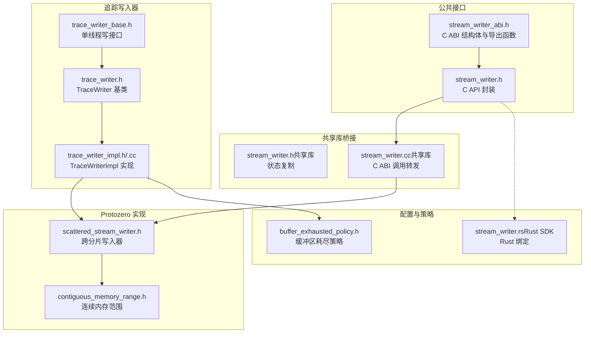
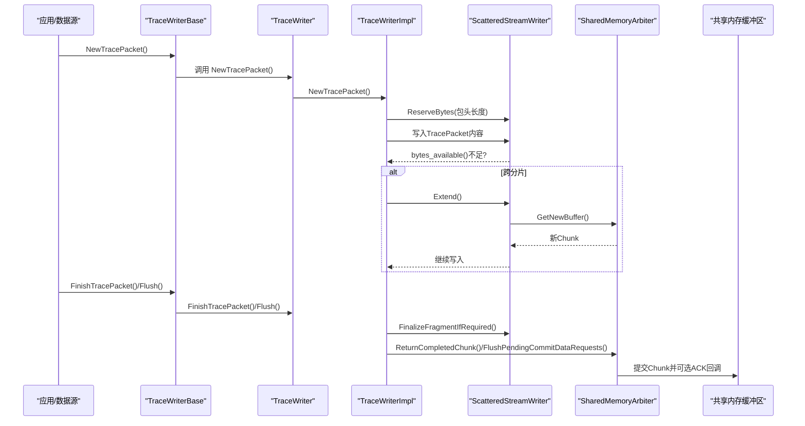
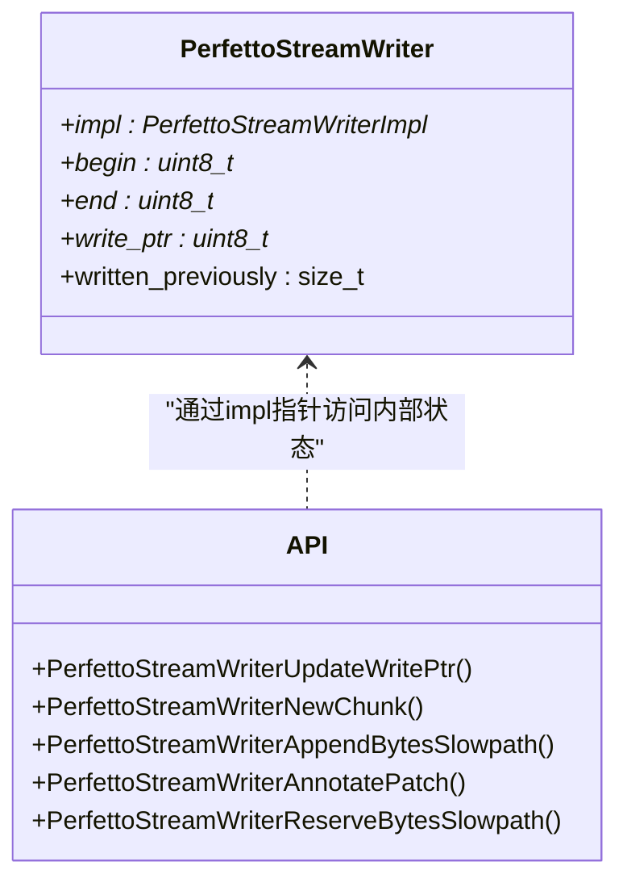
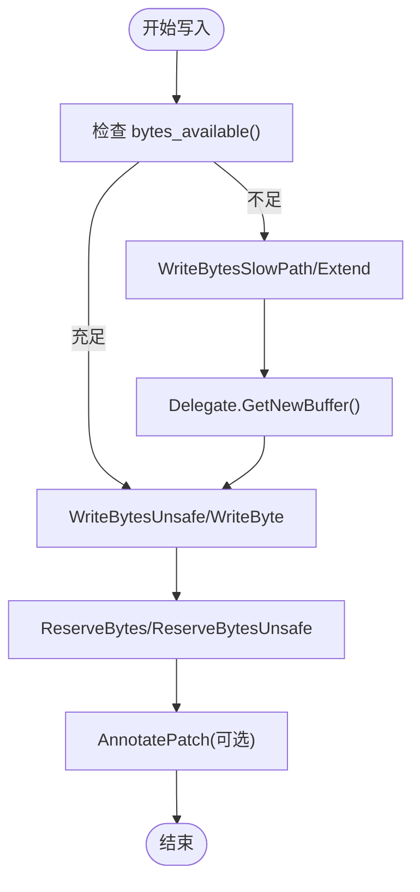
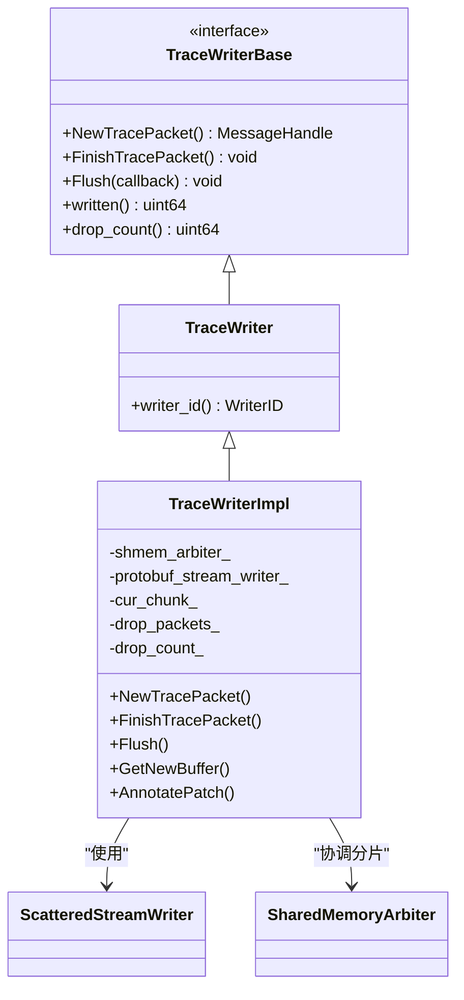
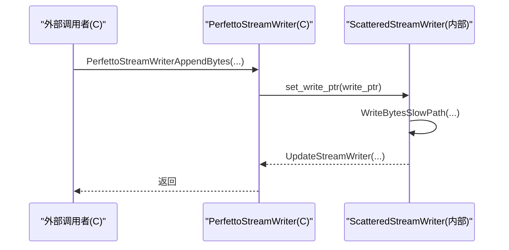

# 流写入器API

<cite>
**本文引用的文件**
- [stream_writer.h](file://include/perfetto/public/stream_writer.h)
- [stream_writer_abi.h](file://include/perfetto/public/abi/stream_writer_abi.h)
- [scattered_stream_writer.h](file://include/perfetto/protozero/scattered_stream_writer.h)
- [contiguous_memory_range.h](file://include/perfetto/protozero/contiguous_memory_range.h)
- [trace_writer_base.h](file://include/perfetto/tracing/trace_writer_base.h)
- [trace_writer.h](file://include/perfetto/ext/tracing/core/trace_writer.h)
- [trace_writer_impl.h](file://src/tracing/core/trace_writer_impl.h)
- [trace_writer_impl.cc](file://src/tracing/core/trace_writer_impl.cc)
- [stream_writer.h（共享库）](file://src/shared_lib/stream_writer.h)
- [stream_writer.cc（共享库）](file://src/shared_lib/stream_writer.cc)
- [buffer_exhausted_policy.h](file://include/perfetto/tracing/buffer_exhausted_policy.h)
- [stream_writer.rs（Rust SDK）](file://contrib/rust-sdk/permetto/src/stream_writer.rs)
</cite>

## 目录
1. [简介](#简介)
2. [项目结构](#项目结构)
3. [核心组件](#核心组件)
4. [架构总览](#架构总览)
5. [详细组件分析](#详细组件分析)
6. [依赖关系分析](#依赖关系分析)
7. [性能考量](#性能考量)
8. [故障排查指南](#故障排查指南)
9. [结论](#结论)
10. [附录](#附录)

## 简介
本文件为 Perfetto 流写入器API的权威参考文档，覆盖以下主题：
- 流写入器核心接口：StreamWriter 基类、TraceWriterBase 与具体实现 TraceWriter 及 TraceWriterImpl
- 追踪数据的编码与写入流程：基于 protozero 的 ScatteredStreamWriter 实现跨分片写入
- 缓冲区管理与写入策略：分片边界、补丁回填、丢包策略与重试
- 配置选项与性能调优：缓冲区大小、丢包策略、写指针更新与分片预留
- 与后端集成：共享内存仲裁器、服务端提交与ACK、Rust SDK桥接
- 错误处理与恢复：进程fork检测、丢包模式、片段化与补丁列表

## 项目结构
围绕流写入器的关键代码分布在公共头文件、protozero实现、核心追踪写入器以及共享库桥接层中。

**图示来源**
- [stream_writer_abi.h:44-60](file://include/perfetto/public/abi/stream_writer_abi.h#L44-L60)
- [stream_writer.h:26-101](file://include/perfetto/public/stream_writer.h#L26-L101)
- [scattered_stream_writer.h:47-175](file://include/perfetto/protozero/scattered_stream_writer.h#L47-L175)
- [contiguous_memory_range.h:27-34](file://include/perfetto/protozero/contiguous_memory_range.h#L27-L34)
- [trace_writer_base.h:39-96](file://include/perfetto/tracing/trace_writer_base.h#L39-L96)
- [trace_writer.h:35-49](file://include/perfetto/ext/tracing/core/trace_writer.h#L35-L49)
- [trace_writer_impl.h:49-205](file://src/tracing/core/trace_writer_impl.h#L49-L205)
- [stream_writer.h（共享库）:26-33](file://src/shared_lib/stream_writer.h#L26-L33)
- [stream_writer.cc（共享库）:26-63](file://src/shared_lib/stream_writer.cc#L26-L63)
- [buffer_exhausted_policy.h:24-50](file://include/perfetto/tracing/buffer_exhausted_policy.h#L24-L50)
- [stream_writer.rs（Rust SDK）:138-177](file://contrib/rust-sdk/perfetto/src/stream_writer.rs#L138-L177)

**章节来源**
- [stream_writer.h:26-101](file://include/perfetto/public/stream_writer.h#L26-L101)
- [stream_writer_abi.h:44-112](file://include/perfetto/public/abi/stream_writer_abi.h#L44-L112)
- [scattered_stream_writer.h:47-175](file://include/perfetto/protozero/scattered_stream_writer.h#L47-L175)
- [contiguous_memory_range.h:27-34](file://include/perfetto/protozero/contiguous_memory_range.h#L27-L34)
- [trace_writer_base.h:39-96](file://include/perfetto/tracing/trace_writer_base.h#L39-L96)
- [trace_writer.h:35-49](file://include/perfetto/ext/tracing/core/trace_writer.h#L35-L49)
- [trace_writer_impl.h:49-205](file://src/tracing/core/trace_writer_impl.h#L49-L205)
- [stream_writer.h（共享库）:26-33](file://src/shared_lib/stream_writer.h#L26-L33)
- [stream_writer.cc（共享库）:26-63](file://src/shared_lib/stream_writer.cc#L26-L63)
- [buffer_exhausted_policy.h:24-50](file://include/perfetto/tracing/buffer_exhausted_policy.h#L24-L50)
- [stream_writer.rs（Rust SDK）:138-177](file://contrib/rust-sdk/perfetto/src/stream_writer.rs#L138-L177)

## 核心组件
- C ABI 层：PerfettoStreamWriter 结构体与一组导出函数，用于在C/C++与共享库之间传递写入器状态。
- Protozero 层：ScatteredStreamWriter 抽象跨分片写入，支持预留空间、慢路径写入与补丁回填。
- 追踪写入器层：TraceWriterBase 定义单线程写接口；TraceWriter 扩展包含 WriterID；TraceWriterImpl 实现与共享内存仲裁器交互。
- 共享库桥接：将 ScatteredStreamWriter 的内部状态映射到 C ABI 结构体，并转发调用。
- Rust SDK：提供 StreamWriter 的安全封装，暴露可用字节、已写字节数等查询方法。

**章节来源**
- [stream_writer_abi.h:44-112](file://include/perfetto/public/abi/stream_writer_abi.h#L44-L112)
- [stream_writer.h:26-101](file://include/perfetto/public/stream_writer.h#L26-L101)
- [scattered_stream_writer.h:47-175](file://include/perfetto/protozero/scattered_stream_writer.h#L47-L175)
- [trace_writer_base.h:39-96](file://include/perfetto/tracing/trace_writer_base.h#L39-L96)
- [trace_writer.h:35-49](file://include/perfetto/ext/tracing/core/trace_writer.h#L35-L49)
- [trace_writer_impl.h:49-205](file://src/tracing/core/trace_writer_impl.h#L49-L205)
- [stream_writer.h（共享库）:26-33](file://src/shared_lib/stream_writer.h#L26-L33)
- [stream_writer.cc（共享库）:26-63](file://src/shared_lib/stream_writer.cc#L26-L63)
- [stream_writer.rs（Rust SDK）:138-177](file://contrib/rust-sdk/perfetto/src/stream_writer.rs#L138-L177)

## 架构总览
下图展示了从应用侧到共享内存的写入链路，以及丢包策略与补丁回填的协作关系。

**图示来源**
- [trace_writer_base.h:62-84](file://include/perfetto/tracing/trace_writer_base.h#L62-L84)
- [trace_writer_impl.cc:120-199](file://src/tracing/core/trace_writer_impl.cc#L120-L199)
- [trace_writer_impl.cc:95-118](file://src/tracing/core/trace_writer_impl.cc#L95-L118)
- [scattered_stream_writer.h:138-145](file://include/perfetto/protozero/scattered_stream_writer.h#L138-L145)
- [buffer_exhausted_policy.h:24-50](file://include/perfetto/tracing/buffer_exhausted_policy.h#L24-L50)

## 详细组件分析

### C ABI 层：PerfettoStreamWriter 与 C API
- 结构体字段：包含实现指针、当前块起止指针、写指针与累计已写字节。
- 关键函数：
  - 更新写指针：将外部写指针同步至内部写入器
  - 新分片：提交当前块并获取新块
  - 慢路径写入：当剩余空间不足时的后备路径
  - 补丁注解：预留4字节补丁位，用于回填消息长度
  - 字节预留：在不跨越分片的前提下预留连续空间

**图示来源**
- [stream_writer_abi.h:44-112](file://include/perfetto/public/abi/stream_writer_abi.h#L44-L112)
- [stream_writer.h:26-101](file://include/perfetto/public/stream_writer.h#L26-L101)

**章节来源**
- [stream_writer_abi.h:44-112](file://include/perfetto/public/abi/stream_writer_abi.h#L44-L112)
- [stream_writer.h:26-101](file://include/perfetto/public/stream_writer.h#L26-L101)

### Protozero 层：ScatteredStreamWriter
- 设计目标：在固定分片或堆分配缓冲区上提供追加写入抽象，避免跨分片拷贝与realloc。
- 核心能力：
  - 快速写入：在当前分片内直接写入
  - 慢路径写入：跨分片时自动扩展
  - 预留空间：保证不跨越分片的连续预留
  - 回退写入：支持Rewind进行局部回填
  - 补丁回填：委托AnnotatePatch在后续Chunk可用时回填长度字段
- 与 TraceWriterImpl 协作：作为 RootMessage 的写入器，驱动分片切换与补丁收集

**图示来源**
- [scattered_stream_writer.h:73-109](file://include/perfetto/protozero/scattered_stream_writer.h#L73-L109)
- [scattered_stream_writer.h:138-165](file://include/perfetto/protozero/scattered_stream_writer.h#L138-L165)
- [contiguous_memory_range.h:27-34](file://include/perfetto/protozero/contiguous_memory_range.h#L27-L34)

**章节来源**
- [scattered_stream_writer.h:47-175](file://include/perfetto/protozero/scattered_stream_writer.h#L47-L175)
- [contiguous_memory_range.h:27-34](file://include/perfetto/protozero/contiguous_memory_range.h#L27-L34)

### 追踪写入器层：TraceWriterBase、TraceWriter、TraceWriterImpl
- TraceWriterBase：定义 NewTracePacket、FinishTracePacket、Flush、written、drop_count 等接口。
- TraceWriter：在 Base 基础上增加 WriterID。
- TraceWriterImpl：
  - 与 SharedMemoryArbiter 协作获取/归还分片
  - 在 NewTracePacket 中预留包头长度并记录片段起点
  - 在 FinalizeFragmentIfRequired 中写入片段长度
  - 支持丢包模式：进入 Drop 后写入垃圾分片并统计 drop_count
  - 支持 Stall/ Drop/ StallThenDrop 三种缓冲区耗尽策略

**图示来源**
- [trace_writer_base.h:39-96](file://include/perfetto/tracing/trace_writer_base.h#L39-L96)
- [trace_writer.h:35-49](file://include/perfetto/ext/tracing/core/trace_writer.h#L35-L49)
- [trace_writer_impl.h:49-205](file://src/tracing/core/trace_writer_impl.h#L49-L205)

**章节来源**
- [trace_writer_base.h:39-96](file://include/perfetto/tracing/trace_writer_base.h#L39-L96)
- [trace_writer.h:35-49](file://include/perfetto/ext/tracing/core/trace_writer.h#L35-L49)
- [trace_writer_impl.h:49-205](file://src/tracing/core/trace_writer_impl.h#L49-L205)
- [trace_writer_impl.cc:95-118](file://src/tracing/core/trace_writer_impl.cc#L95-L118)
- [trace_writer_impl.cc:120-199](file://src/tracing/core/trace_writer_impl.cc#L120-L199)

### 共享库桥接：C ABI 与内部写入器同步
- UpdateStreamWriter：将 ScatteredStreamWriter 的当前范围与写指针复制到 C ABI 结构体
- PerfettoStreamWriter* 系列函数：将外部调用转发给内部写入器，并在必要时更新 ABI 状态

**图示来源**
- [stream_writer.h（共享库）:26-33](file://src/shared_lib/stream_writer.h#L26-L33)
- [stream_writer.cc（共享库）:48-63](file://src/shared_lib/stream_writer.cc#L48-L63)

**章节来源**
- [stream_writer.h（共享库）:26-33](file://src/shared_lib/stream_writer.h#L26-L33)
- [stream_writer.cc（共享库）:26-63](file://src/shared_lib/stream_writer.cc#L26-L63)

### Rust SDK：StreamWriter
- 提供安全封装：available_bytes、get_written_size、has_valid_writer 等
- 通过借用内部状态进行断言与计算，避免越界访问

**章节来源**
- [stream_writer.rs（Rust SDK）:138-177](file://contrib/rust-sdk/perfetto/src/stream_writer.rs#L138-L177)

## 依赖关系分析
- TraceWriterImpl 依赖 SharedMemoryArbiter 获取/归还分片，依赖 ScatteredStreamWriter 进行跨分片写入
- ScatteredStreamWriter 依赖 ContiguousMemoryRange 描述当前分片范围
- C ABI 通过 UpdateStreamWriter 与内部写入器保持状态一致
- 缓冲区耗尽策略由 BufferExhaustedPolicy 控制，影响 TraceWriterImpl 的行为

**图示来源**
- [trace_writer_impl.h:101-126](file://src/tracing/core/trace_writer_impl.h#L101-L126)
- [scattered_stream_writer.h:171-175](file://include/perfetto/protozero/scattered_stream_writer.h#L171-L175)
- [contiguous_memory_range.h:27-34](file://include/perfetto/protozero/contiguous_memory_range.h#L27-L34)
- [stream_writer.h（共享库）:26-33](file://src/shared_lib/stream_writer.h#L26-L33)
- [buffer_exhausted_policy.h:24-50](file://include/perfetto/tracing/buffer_exhausted_policy.h#L24-L50)

**章节来源**
- [trace_writer_impl.h:101-126](file://src/tracing/core/trace_writer_impl.h#L101-L126)
- [scattered_stream_writer.h:171-175](file://include/perfetto/protozero/scattered_stream_writer.h#L171-L175)
- [contiguous_memory_range.h:27-34](file://include/perfetto/protozero/contiguous_memory_range.h#L27-L34)
- [stream_writer.h（共享库）:26-33](file://src/shared_lib/stream_writer.h#L26-L33)
- [buffer_exhausted_policy.h:24-50](file://include/perfetto/tracing/buffer_exhausted_policy.h#L24-L50)

## 性能考量
- 写入路径优化
  - 快路径：在当前分片内直接写入，减少分支判断
  - 慢路径：跨分片时调用 Extend 并从仲裁器获取新分片
- 预留与回填
  - ReserveBytes/ReserveBytesUnsafe 提前预留连续空间，避免跨分片
  - AnnotatePatch 用于延迟回填长度字段，降低二次写入成本
- 分片大小与包头
  - 包头预留与片段化控制：NewTracePacket 中预留包头长度，避免频繁分片
  - 最大包数限制：单分片内包计数上限，触发提前换片
- 丢包策略
  - Stall：阻塞等待可用分片，适合低延迟场景
  - Drop：进入丢包模式，写入垃圾分片，适合高吞吐容忍丢包
  - StallThenDrop：先阻塞，超时后降级为丢包
- 内存与拷贝
  - ScatteredStreamWriter 避免 realloc 与全量拷贝，提升写入吞吐
  - Rust SDK 通过借用避免所有权转移带来的额外开销

[本节为通用性能建议，无需特定文件引用]

## 故障排查指南
- 进程fork检测
  - TraceWriterImpl 在构造与每次写入前校验进程ID，若fork则断言失败，防止双进程写入同一SMB
- 丢包模式
  - drop_packets_ 标志指示是否处于丢包模式；drop_count_ 记录进入丢包模式次数
  - 进入 Drop 后会写入“previous_packet_dropped”标记，便于服务端识别数据丢失
- 片段化与补丁
  - 当包被分片时，TraceWriterImpl 会在返回分片时发送补丁列表，服务端负责回填
  - 若出现补丁未回填，检查 Flush 调用时机与分片生命周期
- 写入器状态
  - C ABI 与内部写入器状态需保持一致：确保 PerfettoStreamWriterUpdateWritePtr 被及时调用
  - Rust SDK 的 get_written_size 依赖内部状态一致性，异常时检查 borrow 与断言

**章节来源**
- [trace_writer_impl.cc:120-199](file://src/tracing/core/trace_writer_impl.cc#L120-L199)
- [trace_writer_impl.cc:95-118](file://src/tracing/core/trace_writer_impl.cc#L95-L118)
- [trace_writer_impl.h:155-204](file://src/tracing/core/trace_writer_impl.h#L155-L204)
- [stream_writer.cc（共享库）:26-36](file://src/shared_lib/stream_writer.cc#L26-L36)
- [stream_writer.rs（Rust SDK）:138-177](file://contrib/rust-sdk/perfetto/src/stream_writer.rs#L138-L177)

## 结论
Perfetto 流写入器API通过清晰的分层设计实现了高效的跨分片写入与灵活的缓冲区管理。TraceWriterImpl 将应用侧的写入请求转化为对共享内存的有序提交，结合丢包策略与补丁回填机制，在高负载场景下仍能保持稳定与可观的吞吐。配合 C ABI 与 Rust SDK 的桥接，开发者可在多语言环境中以最小开销完成高性能追踪数据写入。

[本节为总结性内容，无需特定文件引用]

## 附录

### 配置选项与最佳实践
- 缓冲区大小与分片
  - 合理设置分片大小，避免频繁跨分片；根据典型包大小预留头部空间
- 丢包策略选择
  - 对实时性敏感场景优先 Stall；对吞吐敏感且可容忍丢包场景选择 Drop
- 写入节奏
  - 批量写入时尽量使用 ReserveBytes 预留连续空间，减少慢路径
  - 使用 Flush 在关键节点提交，确保服务端及时可见
- Rust SDK 使用
  - 通过 available_bytes 与 get_written_size 监控写入进度，避免越界
  - 注意写入器有效性检查，防止在无效状态下继续写入

[本节为通用指导，无需特定文件引用]