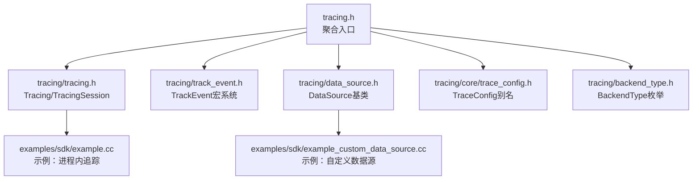
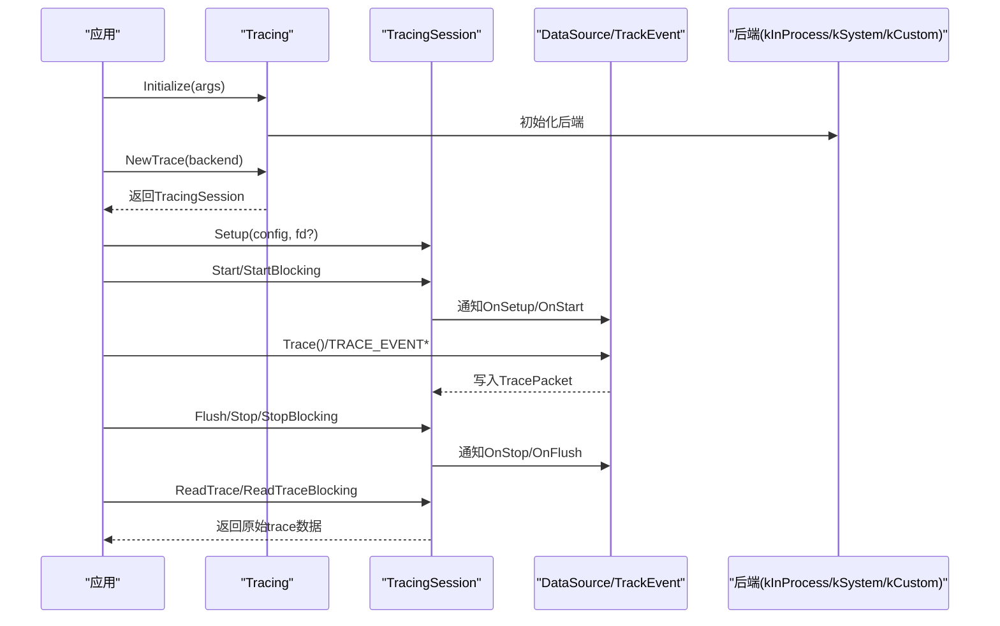
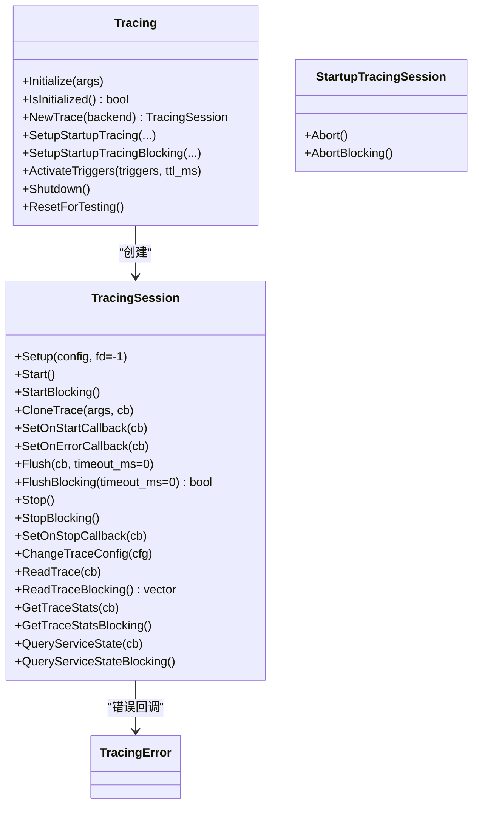
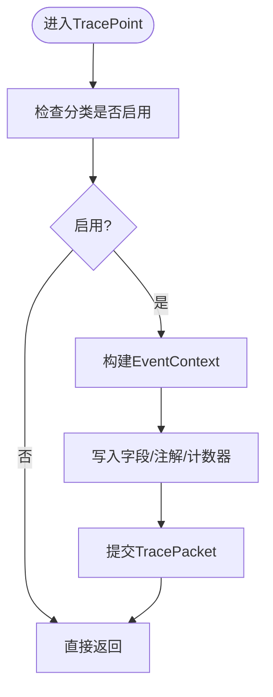
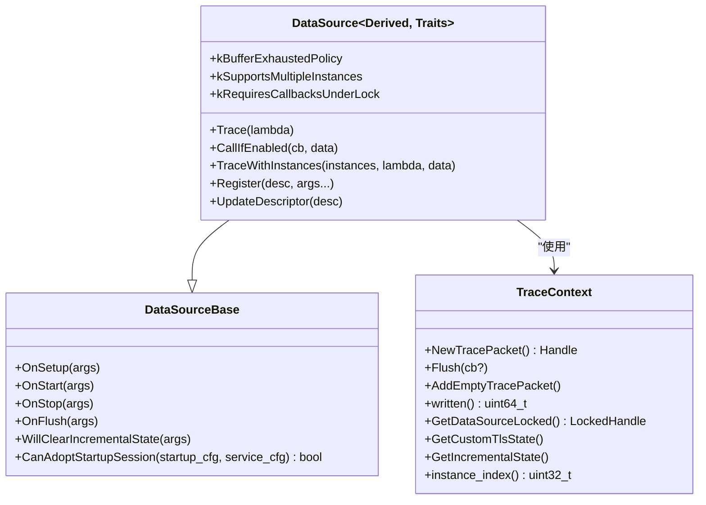
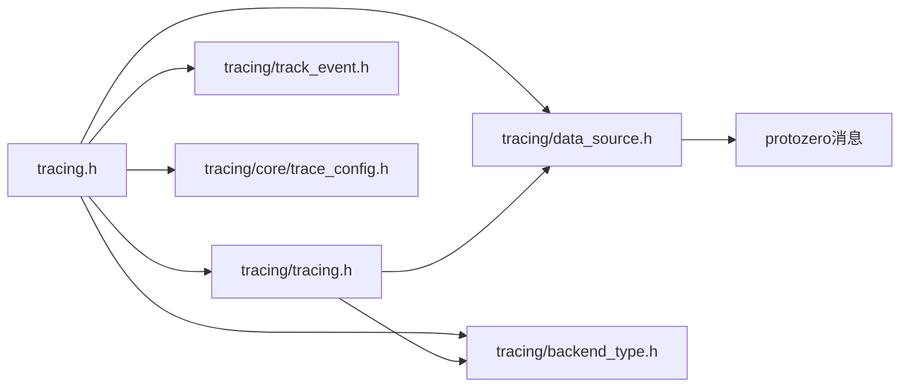

# 追踪SDK API

<cite>
**本文引用的文件**
- [tracing.h](file://include/perfetto/tracing.h)
- [tracing.h](file://include/perfetto/tracing/tracing.h)
- [track_event.h](file://include/perfetto/tracing/track_event.h)
- [data_source.h](file://include/perfetto/tracing/data_source.h)
- [trace_config.h](file://include/perfetto/tracing/core/trace_config.h)
- [backend_type.h](file://include/perfetto/tracing/backend_type.h)
- [example.cc](file://examples/sdk/example.cc)
- [example_custom_data_source.cc](file://examples/sdk/example_custom_data_source.cc)
</cite>

## 目录
1. [简介](#简介)
2. [项目结构](#项目结构)
3. [核心组件](#核心组件)
4. [架构总览](#架构总览)
5. [详细组件分析](#详细组件分析)
6. [依赖关系分析](#依赖关系分析)
7. [性能考量](#性能考量)
8. [故障排查指南](#故障排查指南)
9. [结论](#结论)
10. [附录：API使用示例与最佳实践](#附录api使用示例与最佳实践)

## 简介
本文件为 Perfetto 追踪 SDK 的参考文档，聚焦于应用内集成与扩展的 API，涵盖以下主题：
- Tracing 类与追踪会话生命周期（初始化、启动、停止、配置、读取）
- TrackEvent 宏系统与事件记录
- DataSource 基类与自定义数据源开发
- 后端类型与系统/进程内后端选择
- 错误处理、回调与调试技巧
- 线程安全、性能优化与内存管理最佳实践

## 项目结构
Perfetto SDK 的公共头文件位于 include/perfetto/tracing 及其子目录，核心入口为 tracing.h，它聚合了追踪 API 所需的关键头文件；追踪会话与初始化由 tracing/tracing.h 提供；事件记录通过 tracing/track_event.h 暴露宏；自定义数据源通过 tracing/data_source.h 提供基类；追踪配置由 tracing/core/trace_config.h 暴露；后端类型由 tracing/backend_type.h 定义。

**图表来源**
- [tracing.h:26-41](file://include/perfetto/tracing.h#L26-L41)
- [tracing.h:188-330](file://include/perfetto/tracing/tracing.h#L188-L330)
- [track_event.h:30-116](file://include/perfetto/tracing/track_event.h#L30-L116)
- [data_source.h:88-201](file://include/perfetto/tracing/data_source.h#L88-L201)
- [trace_config.h:24-38](file://include/perfetto/tracing/core/trace_config.h#L24-L38)
- [backend_type.h:24-40](file://include/perfetto/tracing/backend_type.h#L24-L40)
- [example.cc:35-83](file://examples/sdk/example.cc#L35-L83)
- [example_custom_data_source.cc:52-103](file://examples/sdk/example_custom_data_source.cc#L52-L103)

**章节来源**
- [tracing.h:26-41](file://include/perfetto/tracing.h#L26-L41)
- [tracing.h:188-330](file://include/perfetto/tracing/tracing.h#L188-L330)

## 核心组件
- Tracing：SDK 初始化与入口点，负责选择后端、创建追踪会话、启动/停止/触发追踪。
- TracingSession：追踪会话生命周期控制，支持异步/同步启动、停止、Flush、读取追踪数据、查询统计与服务状态。
- TrackEvent：事件记录宏系统，提供 TRACE_EVENT、TRACE_EVENT_BEGIN/END、TRACE_EVENT_INSTANT、TRACE_COUNTER 等，支持分类、参数、计数器与时间戳。
- DataSource：自定义数据源基类，派生类可实现 OnSetup/OnStart/OnStop/OnFlush 生命周期回调，并通过 Trace() 方法写入 TracePacket。
- TraceConfig：追踪配置对象，用于声明缓冲区大小、数据源列表及具体数据源配置（如 TrackEventConfig）。
- BackendType：后端类型枚举，支持进程内、系统、自定义后端。

**章节来源**
- [tracing.h:188-330](file://include/perfetto/tracing/tracing.h#L188-L330)
- [track_event.h:372-440](file://include/perfetto/tracing/track_event.h#L372-L440)
- [data_source.h:88-201](file://include/perfetto/tracing/data_source.h#L88-L201)
- [trace_config.h:24-38](file://include/perfetto/tracing/core/trace_config.h#L24-L38)
- [backend_type.h:24-40](file://include/perfetto/tracing/backend_type.h#L24-L40)

## 架构总览
下图展示了从应用调用到追踪服务的数据流与职责边界：

**图表来源**
- [tracing.h:198-225](file://include/perfetto/tracing/tracing.h#L198-L225)
- [tracing.h:332-519](file://include/perfetto/tracing/tracing.h#L332-L519)
- [data_source.h:293-392](file://include/perfetto/tracing/data_source.h#L293-L392)
- [track_event.h:372-386](file://include/perfetto/tracing/track_event.h#L372-L386)

## 详细组件分析

### Tracing 类与追踪会话
- 初始化
  - Initialize(TracingInitArgs)：选择后端（kInProcess/kSystem/kCustom），可注入自定义平台、共享内存参数、日志回调、策略对象等。
  - ResetForTesting/Shutdown：测试重置与安全关闭（需确保无活动追踪线程）。
- 会话管理
  - NewTrace(BackendType)：创建追踪会话，支持自动选择可用后端。
  - Setup/Start/StartBlocking：配置并启动追踪；StartBlocking 在所有数据源确认启动后返回。
  - Stop/StopBlocking/Flush/FlushBlocking：停止追踪、强制可见性栅栏；Flush 保证在 ReadTrace 前可见。
  - ReadTrace/ReadTraceBlocking：异步/同步读回原始 trace 数据。
  - ChangeTraceConfig：运行时变更部分配置字段。
  - GetTraceStats/QueryServiceState：查询统计与服务状态快照。
  - 启动追踪（StartupTracingSession）：预热数据源，等待后续会话绑定。
- 回调与错误
  - SetOnStartCallback/SetOnStopCallback/SetOnErrorCallback：分别在启动/停止/错误时回调。
  - TracingError：断连或 Start 失败等错误码与消息。

**图表来源**
- [tracing.h:188-330](file://include/perfetto/tracing/tracing.h#L188-L330)
- [tracing.h:332-519](file://include/perfetto/tracing/tracing.h#L332-L519)
- [tracing.h:521-536](file://include/perfetto/tracing/tracing.h#L521-L536)

**章节来源**
- [tracing.h:188-330](file://include/perfetto/tracing/tracing.h#L188-L330)
- [tracing.h:332-519](file://include/perfetto/tracing/tracing.h#L332-L519)

### TrackEvent 宏系统
- 分类注册
  - 使用 PERFETTO_DEFINE_CATEGORIES/PERFETTO_TRACK_EVENT_STATIC_STORAGE 在编译单元中定义分类与静态存储。
  - 使用 PERFETTO_USE_CATEGORIES_FROM_NAMESPACE 或块作用域版本切换默认分类集。
- 事件记录
  - TRACE_EVENT：带作用域的切片事件，自动匹配 BEGIN/END。
  - TRACE_EVENT_BEGIN/TRACE_EVENT_END：显式切片开始/结束。
  - TRACE_EVENT_INSTANT：零持续时间事件。
  - TRACE_COUNTER：数值计数器采样，支持单位与倍率。
- 参数与时间戳
  - 支持传入 Track、timestamp、任意数量 debug annotations，以及 lambda 写入强类型字段。
- 动态分类与测试前缀
  - 支持动态分类与测试分类前缀，便于在生产二进制中剔除测试事件。

**图表来源**
- [track_event.h:372-440](file://include/perfetto/tracing/track_event.h#L372-L440)
- [track_event.h:269-386](file://include/perfetto/tracing/track_event.h#L269-L386)

**章节来源**
- [track_event.h:30-116](file://include/perfetto/tracing/track_event.h#L30-L116)
- [track_event.h:177-230](file://include/perfetto/tracing/track_event.h#L177-L230)
- [track_event.h:269-386](file://include/perfetto/tracing/track_event.h#L269-L386)
- [track_event.h:387-440](file://include/perfetto/tracing/track_event.h#L387-L440)

### DataSource 基类与自定义数据源
- 生命周期回调
  - OnSetup：配置阶段，接收 DataSourceConfig 与后端类型。
  - OnStart/OnStop：实际开始/停止时回调；OnStop 可通过 HandleStopAsynchronously 延迟停止。
  - OnFlush：请求 Flush 时回调；可通过 HandleFlushAsynchronously 延迟 ACK。
  - WillClearIncrementalState：增量状态清理前回调。
- Trace 上下文
  - TraceContext：提供 NewTracePacket、Flush、AddEmptyTracePacket、written 统计、锁定访问数据源实例等能力。
- 注册与描述符
  - Register(DataSourceDescriptor,...)：注册数据源类型，支持多实例与回调锁策略。
  - UpdateDescriptor：更新描述符信息。
- 快速路径
  - CallIfEnabled/TraceWithInstances：高效判断启用状态并遍历实例写入。

**图表来源**
- [data_source.h:88-201](file://include/perfetto/tracing/data_source.h#L88-L201)
- [data_source.h:264-392](file://include/perfetto/tracing/data_source.h#L264-L392)
- [data_source.h:394-470](file://include/perfetto/tracing/data_source.h#L394-L470)

**章节来源**
- [data_source.h:88-201](file://include/perfetto/tracing/data_source.h#L88-L201)
- [data_source.h:264-392](file://include/perfetto/tracing/data_source.h#L264-L392)
- [data_source.h:394-470](file://include/perfetto/tracing/data_source.h#L394-L470)

### 追踪配置与后端类型
- TraceConfig
  - 通过 add_buffers 设置缓冲区大小，add_data_sources 配置具体数据源及其配置（如 TrackEventConfig）。
  - 提供 TriggerConfig 辅助函数以兼容快照模式。
- BackendType
  - kUnspecifiedBackend、kInProcessBackend、kSystemBackend、kCustomBackend。
  - Tracing::NewTrace 可按需选择后端；系统后端需要消费者连接。

**章节来源**
- [trace_config.h:24-38](file://include/perfetto/tracing/core/trace_config.h#L24-L38)
- [backend_type.h:24-40](file://include/perfetto/tracing/backend_type.h#L24-L40)

## 依赖关系分析
- 聚合入口
  - tracing.h 将追踪所需头文件统一导出，避免使用者逐一包含。
- 组件耦合
  - Tracing 对后端工厂有选择性内联以减少未使用后端的链接体积。
  - TracingSession 与 DataSource 通过回调与快速路径解耦，降低跨模块耦合。
  - TrackEvent 通过宏与内部注册表实现低开销事件记录。
- 外部依赖
  - Protobuf 零拷贝序列化（protozero）用于 TracePacket。
  - 平台抽象（Platform）与日志回调（LogMessageCallback）用于嵌入式定制。

**图表来源**
- [tracing.h:26-41](file://include/perfetto/tracing.h#L26-L41)
- [tracing.h:36-38](file://include/perfetto/tracing/tracing.h#L36-L38)
- [data_source.h:49-51](file://include/perfetto/tracing/data_source.h#L49-L51)

**章节来源**
- [tracing.h:26-41](file://include/perfetto/tracing.h#L26-L41)

## 性能考量
- 快速路径与内联
  - Tracing::Initialize/NewTrace 对未使用后端进行死代码消除，减少链接体积与启动成本。
- 缓冲与批处理
  - 共享内存页大小、批提交延迟、直接补丁等参数可在 TracingInitArgs 中精细调节，平衡 IPC 开销与突发写入能力。
- 事件记录
  - 使用 TRACE_EVENT 宏时，尽量避免在禁用状态下计算昂贵参数；利用分类启用检查与弱类型注解。
- Flush 与停止
  - 在异步停止场景中，务必在最后 Trace() 后显式 Flush，确保数据可见。
- 计数器与跟踪
  - TRACE_COUNTER 支持单位与倍率，有助于 UI 展示与减小 trace 体积。

[本节为通用指导，无需特定文件来源]

## 故障排查指南
- 初始化失败
  - 检查 TracingInitArgs 的 backends 与平台设置；确认已调用 Tracing::Initialize。
- 启动失败
  - 查看 TracingError::code 与 message；核对 TraceConfig 的数据源名称与配置。
- 无数据或数据不完整
  - 确保在 Stop 前调用 Flush；在异步停止场景中，使用 StopArgs::HandleStopAsynchronously 并在回调中 Flush。
- 读取数据为空
  - ReadTrace 前通常需要 Flush；且 ReadTrace 是破坏性操作，多次调用需谨慎。
- 日志与回调
  - 通过 SetOnErrorCallback 获取错误；通过日志回调或日志级别定位问题。

**章节来源**
- [tracing.h:51-68](file://include/perfetto/tracing/tracing.h#L51-L68)
- [tracing.h:384-413](file://include/perfetto/tracing/tracing.h#L384-L413)
- [data_source.h:131-159](file://include/perfetto/tracing/data_source.h#L131-L159)

## 结论
Perfetto 追踪 SDK 提供了从初始化、会话管理到事件记录与自定义数据源的完整能力。通过合理的后端选择、配置与回调使用，可以在应用中高效地采集与导出 trace 数据。遵循本文的线程安全、性能与内存管理建议，可获得稳定且低开销的追踪体验。

[本节为总结，无需特定文件来源]

## 附录：API使用示例与最佳实践

### 示例一：进程内追踪（TrackEvent）
- 步骤概览
  - 初始化：Tracing::Initialize(含 kInProcessBackend)。
  - 注册：perfetto::TrackEvent::Register()。
  - 配置：构造 TraceConfig，启用 track_event 并设置分类。
  - 启动：NewTrace()->Setup(cfg)->StartBlocking()。
  - 录制：在业务逻辑中使用 TRACE_EVENT/TRACE_COUNTER 等宏。
  - 停止与读取：StopBlocking() 后 ReadTraceBlocking() 写入文件。
- 关键注意
  - 在停止前调用 TrackEvent::Flush() 保证最后事件可见。
  - 使用分类启用/禁用控制事件粒度，避免生产二进制中包含测试事件。

**章节来源**
- [example.cc:35-83](file://examples/sdk/example.cc#L35-L83)
- [example.cc:85-130](file://examples/sdk/example.cc#L85-L130)
- [track_event.h:372-440](file://include/perfetto/tracing/track_event.h#L372-L440)

### 示例二：自定义数据源
- 步骤概览
  - 定义派生类并实现 OnSetup/OnStart/OnStop。
  - 在 main 中 Initialize 后注册 DataSourceDescriptor。
  - 在 TraceConfig 中启用自定义数据源名称。
  - 使用 CustomDataSource::Trace 写入 TracePacket。
  - 停止时在 OnStop 异步路径中调用 ctx.Flush() 确保可见。
- 关键注意
  - 使用 PERFETTO_DECLARE_DATA_SOURCE_STATIC_MEMBERS 与定义宏分配静态存储。
  - 若需要多实例，确保 kSupportsMultipleInstances 与回调锁策略符合预期。

**章节来源**
- [example_custom_data_source.cc:38-65](file://examples/sdk/example_custom_data_source.cc#L38-L65)
- [example_custom_data_source.cc:67-103](file://examples/sdk/example_custom_data_source.cc#L67-L103)
- [data_source.h:264-392](file://include/perfetto/tracing/data_source.h#L264-L392)

### 最佳实践清单
- 线程安全
  - 回调中避免长时间阻塞；必要时使用 HandleStopAsynchronously/HandleFlushAsynchronously。
  - 使用 TraceContext::GetDataSourceLocked() 在回调中安全访问数据源实例。
- 性能优化
  - 合理设置共享内存页大小与批提交延迟；仅在需要时启用高开销分类。
  - 使用分类启用检查与弱类型注解，避免在禁用状态下计算昂贵参数。
- 内存管理
  - 使用 NewTracePacket 与 Flush 控制写入节奏；长 trace 优先直接写文件 fd。
  - 自定义数据源增量状态可复用，减少频繁分配。

[本节为通用指导，无需特定文件来源]