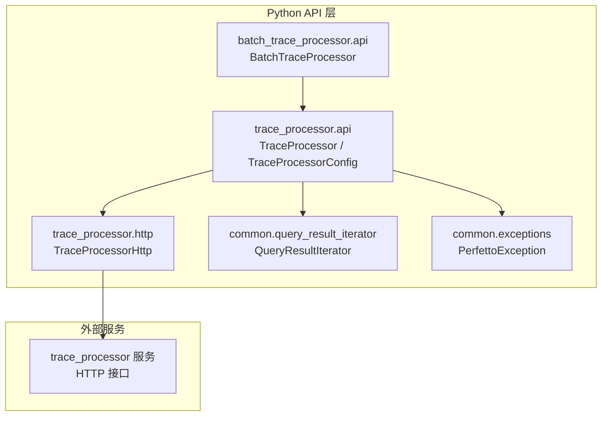
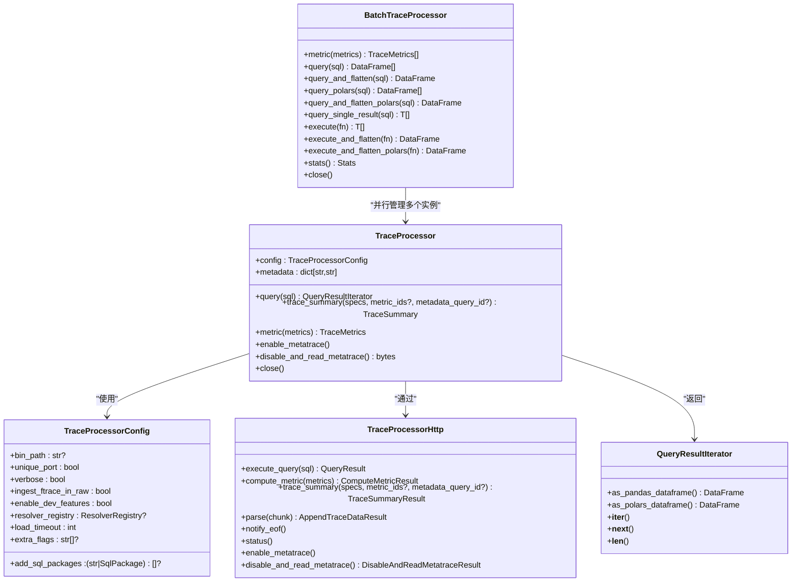
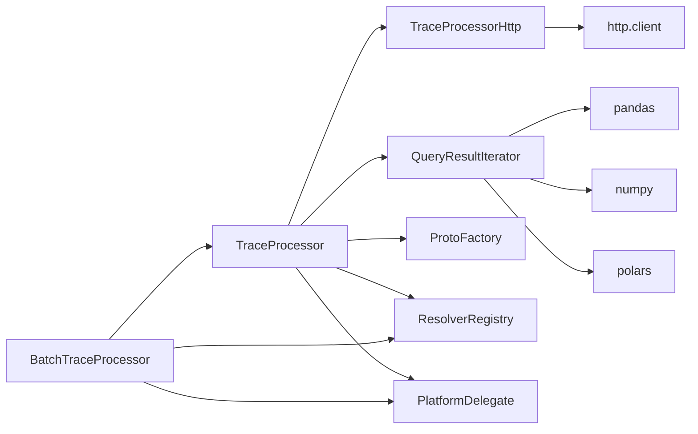

# Python API参考

<cite>
**本文引用的文件**
- [python/perfetto/trace_processor/api.py](file://python/perfetto/trace_processor/api.py)
- [python/perfetto/trace_processor/http.py](file://python/perfetto/trace_processor/http.py)
- [python/perfetto/common/query_result_iterator.py](file://python/perfetto/common/query_result_iterator.py)
- [python/perfetto/common/exceptions.py](file://python/perfetto/common/exceptions.py)
- [python/perfetto/batch_trace_processor/api.py](file://python/perfetto/batch_trace_processor/api.py)
- [python/example.py](file://python/example.py)
- [python/tools/trace_processor.py](file://python/tools/trace_processor.py)
</cite>

## 目录
1. [简介](#简介)
2. [项目结构](#项目结构)
3. [核心组件](#核心组件)
4. [架构总览](#架构总览)
5. [详细组件分析](#详细组件分析)
6. [依赖分析](#依赖分析)
7. [性能考虑](#性能考虑)
8. [故障排查指南](#故障排查指南)
9. [结论](#结论)
10. [附录](#附录)

## 简介
本参考文档面向使用 Perfetto Python API 的开发者，系统性介绍 TraceProcessor 与 BatchTraceProcessor 的 Python 绑定，涵盖连接建立、SQL 查询执行、结果处理、指标计算、元跟踪（metatrace）控制、以及与 C++ 后端的交互方式。文档同时提供参数说明、返回值类型、异常处理策略，并给出可直接定位到源码路径的示例用法，帮助读者快速上手轨迹分析、数据导入导出与批处理任务。

## 项目结构
Perfetto Python 包含以下与 TraceProcessor 相关的关键模块：
- trace_processor.api：TraceProcessor 核心类、配置类、异常类型与入口导出
- trace_processor.http：HTTP 客户端封装，负责与后端 trace_processor 服务通信
- common.query_result_iterator：查询结果迭代器与 DataFrame 转换工具
- common.exceptions：通用异常类型
- batch_trace_processor.api：批量处理 TraceProcessor 的高级 API
- tools/trace_processor.py：预编译二进制入口脚本
- 示例脚本 example.py：演示基本用法

图表来源
- [python/perfetto/trace_processor/api.py:122-361](file://python/perfetto/trace_processor/api.py#L122-L361)
- [python/perfetto/trace_processor/http.py:22-109](file://python/perfetto/trace_processor/http.py#L22-L109)
- [python/perfetto/common/query_result_iterator.py:73-181](file://python/perfetto/common/query_result_iterator.py#L73-L181)
- [python/perfetto/common/exceptions.py:16-19](file://python/perfetto/common/exceptions.py#L16-L19)
- [python/perfetto/batch_trace_processor/api.py:104-507](file://python/perfetto/batch_trace_processor/api.py#L104-L507)

章节来源
- [python/perfetto/trace_processor/api.py:1-361](file://python/perfetto/trace_processor/api.py#L1-L361)
- [python/perfetto/trace_processor/http.py:1-109](file://python/perfetto/trace_processor/http.py#L1-L109)
- [python/perfetto/common/query_result_iterator.py:1-181](file://python/perfetto/common/query_result_iterator.py#L1-L181)
- [python/perfetto/common/exceptions.py:1-19](file://python/perfetto/common/exceptions.py#L1-L19)
- [python/perfetto/batch_trace_processor/api.py:1-507](file://python/perfetto/batch_trace_processor/api.py#L1-L507)
- [python/tools/trace_processor.py:1-34](file://python/tools/trace_processor.py#L1-L34)

## 核心组件
- TraceProcessorConfig：用于配置 trace_processor 实例的行为，如二进制路径、端口策略、超时、是否启用开发特性、是否原始解析 ftrace、附加 SQL 包等。
- TraceProcessor：主要的 Python API 入口，支持从本地文件、流式字节、URI 或自定义解析器加载轨迹；提供 SQL 查询、指标计算、结构化摘要、元跟踪控制、资源清理等能力。
- TraceProcessorHttp：内部 HTTP 客户端，封装与后端的 REST 风格通信，包括 /query、/compute_metric、/trace_summary、/parse、/notify_eof、/status、/enable_metatrace、/disable_and_read_metatrace 等端点。
- QueryResultIterator：对查询结果进行迭代与 DataFrame 转换的适配层，支持 pandas 与 polars。
- BatchTraceProcessor：在多条轨迹上并行执行 SQL 查询或指标计算，提供统计与观察者回调机制。
- PerfettoException：统一的异常类型，用于包装后端错误。

章节来源
- [python/perfetto/trace_processor/api.py:58-120](file://python/perfetto/trace_processor/api.py#L58-L120)
- [python/perfetto/trace_processor/api.py:122-361](file://python/perfetto/trace_processor/api.py#L122-L361)
- [python/perfetto/trace_processor/http.py:22-109](file://python/perfetto/trace_processor/http.py#L22-L109)
- [python/perfetto/common/query_result_iterator.py:73-181](file://python/perfetto/common/query_result_iterator.py#L73-L181)
- [python/perfetto/batch_trace_processor/api.py:104-507](file://python/perfetto/batch_trace_processor/api.py#L104-L507)
- [python/perfetto/common/exceptions.py:16-19](file://python/perfetto/common/exceptions.py#L16-L19)

## 架构总览
下图展示了 Python API 与后端 trace_processor 服务之间的交互流程，以及关键对象的关系。

图表来源
- [python/perfetto/trace_processor/api.py:58-120](file://python/perfetto/trace_processor/api.py#L58-L120)
- [python/perfetto/trace_processor/api.py:122-361](file://python/perfetto/trace_processor/api.py#L122-L361)
- [python/perfetto/trace_processor/http.py:22-109](file://python/perfetto/trace_processor/http.py#L22-L109)
- [python/perfetto/common/query_result_iterator.py:73-181](file://python/perfetto/common/query_result_iterator.py#L73-L181)
- [python/perfetto/batch_trace_processor/api.py:104-507](file://python/perfetto/batch_trace_processor/api.py#L104-L507)

## 详细组件分析

### TraceProcessor 类
- 角色与职责
  - 连接建立：支持通过地址直连已运行的服务或自动拉起本地 trace_processor 二进制；支持唯一端口分配、启动超时、额外标志位传递、SQL 包加载等。
  - 数据导入：通过解析器注册表解析多种来源（文件路径、文件对象、生成器、URI、自定义解析器），并将数据分块发送至后端。
  - SQL 查询：将 SQL 文本提交给后端，接收分批结果并封装为 QueryResultIterator。
  - 指标与摘要：提供旧版 metric 与新版 trace_summary 接口，后者更灵活且返回结构化消息。
  - 元跟踪：启用/禁用并读取元跟踪数据，便于诊断后端执行路径。
  - 生命周期管理：提供上下文管理器与显式 close，确保进程与连接正确释放。

- 关键方法与签名要点
  - 构造函数
    - 参数：trace（支持多种来源）、addr（已有服务地址）、config（TraceProcessorConfig）、file_path（兼容字段，不可与 trace 同时指定）
    - 返回：TraceProcessor 实例
    - 异常：当 trace 与 file_path 同时指定时抛出 TraceProcessorException
  - query(sql)
    - 参数：sql（字符串）
    - 返回：QueryResultIterator；可通过 as_pandas_dataframe()/as_polars_dataframe() 转 DataFrame
    - 异常：若后端返回错误，抛出 TraceProcessorException
  - trace_summary(specs, metric_ids?, metadata_query_id?)
    - 参数：specs（文本 proto 或二进制 proto 列表）、metric_ids（可选）、metadata_query_id（可选）
    - 返回：TraceSummary 原生消息
    - 异常：若后端返回错误，抛出 TraceProcessorException
  - metric(metrics)
    - 参数：metrics（字符串列表）
    - 返回：TraceMetrics 原生消息（已标记为弃用，推荐使用 trace_summary）
    - 异常：若后端返回错误，抛出 TraceProcessorException
  - enable_metatrace()/disable_and_read_metatrace()
    - 功能：启用/禁用并读取元跟踪
    - 返回：bytes（元跟踪序列化数据）
    - 异常：若后端返回错误，抛出 TraceProcessorException
  - metadata 属性
    - 返回：由解析器提供的元数据字典
  - close()
    - 行为：终止子进程、关闭输出流与 HTTP 连接
  - 上下文管理器：with 语句自动调用 close

- 与 C++ 后端的对应关系
  - TraceProcessorHttp 封装了与后端的 HTTP 通信，对应 C++ trace_processor 服务的 /query、/compute_metric、/trace_summary、/parse、/notify_eof、/status、/enable_metatrace、/disable_and_read_metatrace 端点。

章节来源
- [python/perfetto/trace_processor/api.py:122-361](file://python/perfetto/trace_processor/api.py#L122-L361)
- [python/perfetto/trace_processor/http.py:22-109](file://python/perfetto/trace_processor/http.py#L22-L109)

### TraceProcessorConfig 类
- 字段说明
  - bin_path：trace_processor 二进制路径；未指定则自动下载并运行最新预编译版本
  - unique_port：每个实例使用唯一端口
  - verbose：启用详细日志输出
  - ingest_ftrace_in_raw：是否将 ftrace 事件写入原始表
  - enable_dev_features：启用开发特性（不稳定）
  - resolver_registry：自定义 URI 解析器注册表
  - load_timeout：二进制启动超时（秒）
  - extra_flags：传递给 trace_processor 的额外命令行标志（低级选项）
  - add_sql_packages：要加载的 PerfettoSQL 包列表（字符串路径或 SqlPackage 对象）

- 用途
  - 在 TraceProcessor 初始化时传入，影响后端行为与启动方式

章节来源
- [python/perfetto/trace_processor/api.py:58-120](file://python/perfetto/trace_processor/api.py#L58-L120)

### TraceProcessorHttp 类
- 方法与端点映射
  - execute_query(sql)：POST /query
  - compute_metric(metrics)：POST /compute_metric
  - trace_summary(specs, metric_ids?, metadata_query_id?)：POST /trace_summary
  - parse(chunk)：POST /parse
  - notify_eof()：GET /notify_eof
  - status()：GET /status
  - enable_metatrace()：GET /enable_metatrace
  - disable_and_read_metatrace()：GET /disable_and_read_metatrace

- 错误处理
  - 所有方法均基于 HTTP 响应体反序列化为相应结果消息；若后端返回错误，调用方需自行检查错误字段并按需抛出 TraceProcessorException

章节来源
- [python/perfetto/trace_processor/http.py:22-109](file://python/perfetto/trace_processor/http.py#L22-L109)

### QueryResultIterator 类
- 角色
  - 将后端分批返回的列式数据转换为行迭代器，并提供 pandas/polars DataFrame 转换接口
- 关键方法
  - as_pandas_dataframe()：返回 pandas DataFrame；需要 pandas 与 numpy
  - as_polars_dataframe()：返回 polars DataFrame；需要 polars
  - __iter__/__next__/__len__：支持迭代与长度查询
- 数据一致性校验
  - 断言最后一批必须标记为“最后一片”
  - 断言单元总数必须能被列数整除

章节来源
- [python/perfetto/common/query_result_iterator.py:73-181](file://python/perfetto/common/query_result_iterator.py#L73-L181)

### BatchTraceProcessor 类
- 角色
  - 在多条轨迹上并行执行 SQL 查询或指标计算，提供统计与观察者回调
- 并发模型
  - 加载阶段：限制最大并发（默认不超过 CPU 核心数与 32 的较小值）
  - 查询阶段：根据平台委托创建查询执行器（默认线程池）
- 主要方法
  - metric(metrics)：并行计算指标，返回每条轨迹对应的 TraceMetrics
  - query(sql)/query_and_flatten(sql)：返回每条轨迹的 pandas DataFrame，后者将结果拼接为单个 DataFrame
  - query_polars(sql)/query_and_flatten_polars(sql)：返回每条轨迹的 polars DataFrame，后者将结果拼接为单个 DataFrame
  - query_single_result(sql)：要求每条轨迹仅返回单行单列，返回对应标量值列表
  - execute(fn)/execute_and_flatten(fn)/execute_and_flatten_polars(fn)：通用执行器，支持任意函数
  - stats()：返回统计信息（加载失败数、执行失败数）
  - close()：关闭所有子 TraceProcessor 实例
- 失败处理策略
  - 可配置 FailureHandling：遇到加载或执行失败时选择抛出异常或累加统计

章节来源
- [python/perfetto/batch_trace_processor/api.py:104-507](file://python/perfetto/batch_trace_processor/api.py#L104-L507)

### 示例与用法
- 基本查询与 DataFrame 转换
  - 参考路径：[python/example.py:21-65](file://python/example.py#L21-L65)
- 使用预编译二进制入口
  - 参考路径：[python/tools/trace_processor.py:23-31](file://python/tools/trace_processor.py#L23-L31)

章节来源
- [python/example.py:1-70](file://python/example.py#L1-L70)
- [python/tools/trace_processor.py:1-34](file://python/tools/trace_processor.py#L1-L34)

## 依赖分析
- 内部依赖
  - TraceProcessor 依赖 TraceProcessorHttp、QueryResultIterator、ProtoFactory、ResolverRegistry、PlatformDelegate
  - BatchTraceProcessor 依赖 TraceProcessor、ResolverRegistry、PlatformDelegate、线程池执行器
- 外部依赖
  - pandas、numpy（DataFrame 转换）
  - polars（DataFrame 转换）
  - http.client（HTTP 通信）
  - typing、dataclasses、signal、multiprocessing 等标准库

图表来源
- [python/perfetto/trace_processor/api.py:15-30](file://python/perfetto/trace_processor/api.py#L15-L30)
- [python/perfetto/trace_processor/http.py:16-26](file://python/perfetto/trace_processor/http.py#L16-L26)
- [python/perfetto/common/query_result_iterator.py:15-42](file://python/perfetto/common/query_result_iterator.py#L15-L42)
- [python/perfetto/batch_trace_processor/api.py:16-42](file://python/perfetto/batch_trace_processor/api.py#L16-L42)

章节来源
- [python/perfetto/trace_processor/api.py:15-30](file://python/perfetto/trace_processor/api.py#L15-L30)
- [python/perfetto/trace_processor/http.py:16-26](file://python/perfetto/trace_processor/http.py#L16-L26)
- [python/perfetto/common/query_result_iterator.py:15-42](file://python/perfetto/common/query_result_iterator.py#L15-L42)
- [python/perfetto/batch_trace_processor/api.py:16-42](file://python/perfetto/batch_trace_processor/api.py#L16-L42)

## 性能考虑
- 并行度
  - BatchTraceProcessor 默认使用 CPU 核心数作为加载并发上限（最多 32），查询阶段使用平台委托创建的执行器（通常为线程池）
- 数据帧转换
  - pandas/polars 转换在内存中进行，建议在大数据集上谨慎使用，必要时先过滤或采样
- 端口与进程
  - unique_port 可避免端口冲突，但会增加进程管理开销；在大量实例场景下可权衡
- 开发特性
  - enable_dev_features 仅用于开发测试，不保证稳定性，生产环境建议关闭

## 故障排查指南
- 常见异常
  - TraceProcessorException：统一异常类型，用于包装后端错误
  - PerfettoException：通用异常类型，用于依赖缺失或数据格式错误
- 常见问题与对策
  - 无法解析 trace：确认 trace 参数类型与解析器配置；若解析为多条轨迹，BatchTraceProcessor 会拒绝
  - 查询结果为空或列数不匹配：检查 SQL 与表结构；QueryResultIterator 会在列数不匹配时抛错
  - 缺少 pandas/polars/numpy：DataFrame 转换前需安装对应依赖
  - 后端启动超时：调整 load_timeout 或检查二进制下载与网络代理
  - 元跟踪未启用：先调用 enable_metatrace，再调用 disable_and_read_metatrace 获取数据

章节来源
- [python/perfetto/common/exceptions.py:16-19](file://python/perfetto/common/exceptions.py#L16-L19)
- [python/perfetto/common/query_result_iterator.py:92-100](file://python/perfetto/common/query_result_iterator.py#L92-L100)
- [python/perfetto/trace_processor/api.py:314-328](file://python/perfetto/trace_processor/api.py#L314-L328)

## 结论
Perfetto Python API 提供了从本地二进制到远程服务的灵活连接方式，结合强大的 SQL 查询与结构化摘要能力，能够高效完成轨迹分析、指标计算与批处理任务。通过 QueryResultIterator 与 pandas/polars 的无缝对接，用户可以快速将查询结果转化为常用的数据分析格式。BatchTraceProcessor 则进一步简化了大规模轨迹的并行处理流程，配合失败处理策略与统计信息，适合在生产环境中稳定运行。

## 附录

### API 一览与参数说明

- TraceProcessorConfig
  - bin_path：字符串或 None
  - unique_port：布尔
  - verbose：布尔
  - ingest_ftrace_in_raw：布尔
  - enable_dev_features：布尔
  - resolver_registry：ResolverRegistry 或 None
  - load_timeout：整数（秒）
  - extra_flags：字符串列表或 None
  - add_sql_packages：字符串路径或 SqlPackage 对象的列表或 None

- TraceProcessor
  - 构造函数
    - trace：TraceReference 或 None
    - addr：字符串或 None
    - config：TraceProcessorConfig
    - file_path：字符串或 None（不推荐）
  - query(sql)
    - 输入：SQL 字符串
    - 输出：QueryResultIterator
  - trace_summary(specs, metric_ids=None, metadata_query_id=None)
    - 输入：specs（文本 proto 或二进制 proto 列表）、可选 metric_ids、可选 metadata_query_id
    - 输出：TraceSummary 原生消息
  - metric(metrics)
    - 输入：字符串列表
    - 输出：TraceMetrics 原生消息
  - enable_metatrace()
    - 输出：无
  - disable_and_read_metatrace()
    - 输出：字节串（元跟踪）
  - metadata：只读属性，字典
  - close()：无

- TraceProcessorHttp
  - execute_query(sql)：QueryResult
  - compute_metric(metrics)：ComputeMetricResult
  - trace_summary(specs, metric_ids?, metadata_query_id?)：TraceSummaryResult
  - parse(chunk)：AppendTraceDataResult
  - notify_eof()：字节串
  - status()：StatusResult
  - enable_metatrace()：字节串
  - disable_and_read_metatrace()：DisableAndReadMetatraceResult

- QueryResultIterator
  - as_pandas_dataframe()：DataFrame
  - as_polars_dataframe()：DataFrame
  - __iter__/__next__/__len__

- BatchTraceProcessor
  - 构造函数
    - traces：TraceListReference
    - config：BatchTraceProcessorConfig
    - observer：Observer 或 None
  - metric(metrics)：TraceMetrics[]
  - query(sql)：DataFrame[]
  - query_and_flatten(sql)：DataFrame
  - query_polars(sql)：DataFrame[]
  - query_and_flatten_polars(sql)：DataFrame
  - query_single_result(sql)：标量值[]
  - execute(fn)：任意类型[]
  - execute_and_flatten(fn)：DataFrame
  - execute_and_flatten_polars(fn)：DataFrame
  - stats()：Stats
  - close()：无

章节来源
- [python/perfetto/trace_processor/api.py:58-120](file://python/perfetto/trace_processor/api.py#L58-L120)
- [python/perfetto/trace_processor/api.py:122-361](file://python/perfetto/trace_processor/api.py#L122-L361)
- [python/perfetto/trace_processor/http.py:22-109](file://python/perfetto/trace_processor/http.py#L22-L109)
- [python/perfetto/common/query_result_iterator.py:73-181](file://python/perfetto/common/query_result_iterator.py#L73-L181)
- [python/perfetto/batch_trace_processor/api.py:104-507](file://python/perfetto/batch_trace_processor/api.py#L104-L507)

### 与 C++ API 的功能映射
- TraceProcessorHttp 的各方法与后端 HTTP 端点一一对应，具体映射参见“TraceProcessorHttp 类”章节。

章节来源
- [python/perfetto/trace_processor/http.py:22-109](file://python/perfetto/trace_processor/http.py#L22-L109)

### 示例参考路径
- 基本查询与 DataFrame 转换：[python/example.py:21-65](file://python/example.py#L21-L65)
- 预编译二进制入口：[python/tools/trace_processor.py:23-31](file://python/tools/trace_processor.py#L23-L31)

章节来源
- [python/example.py:1-70](file://python/example.py#L1-L70)
- [python/tools/trace_processor.py:1-34](file://python/tools/trace_processor.py#L1-L34)