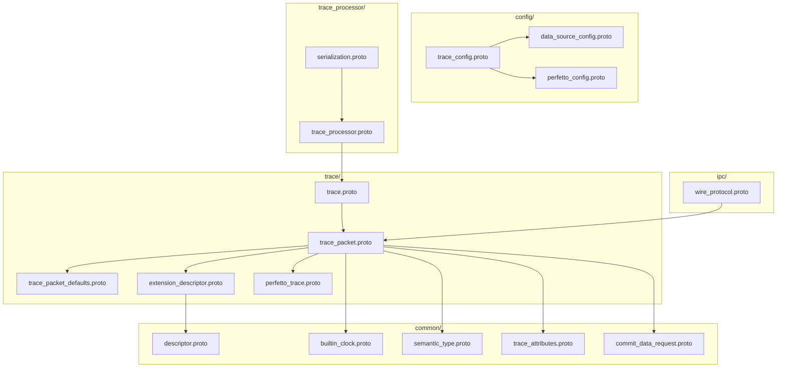
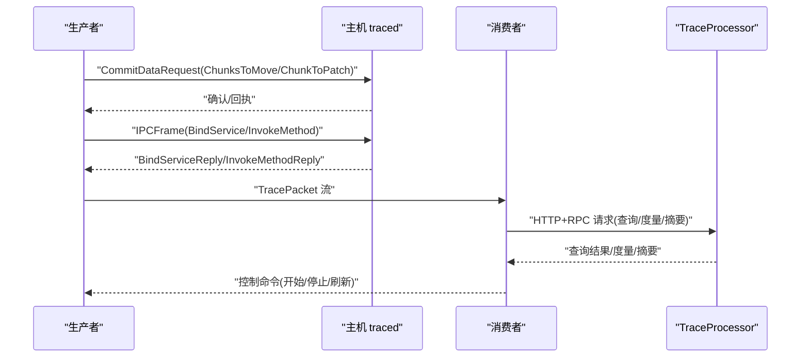
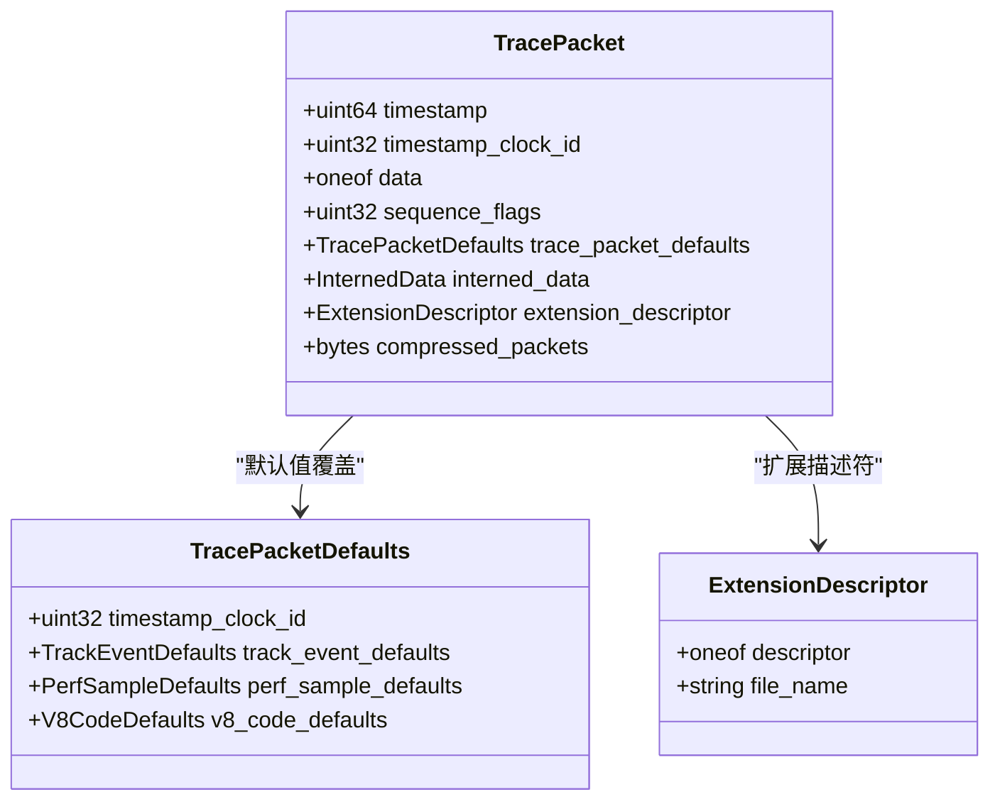
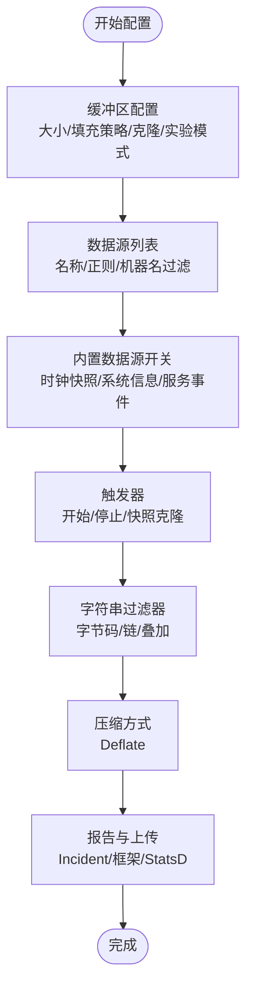
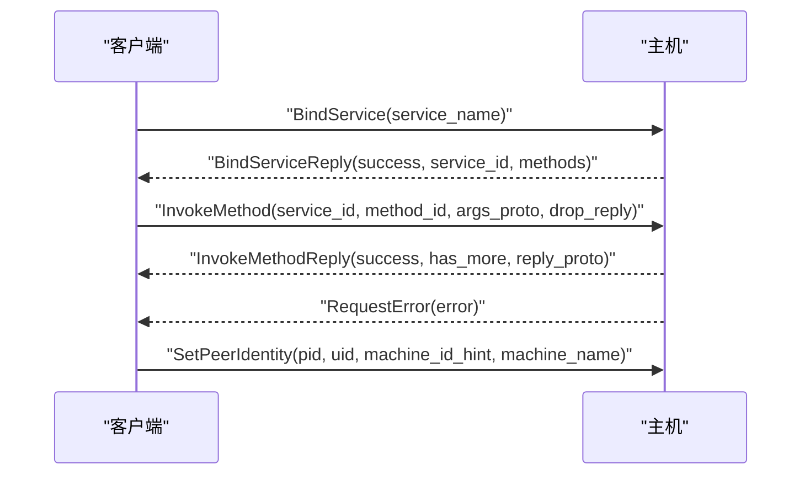
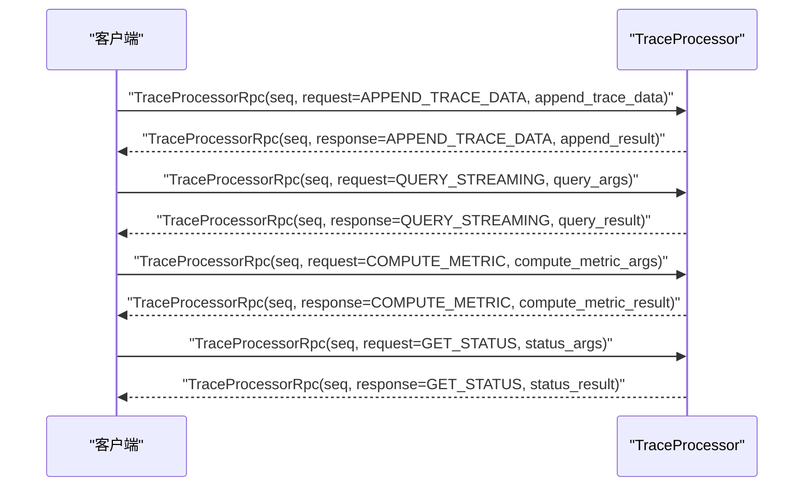
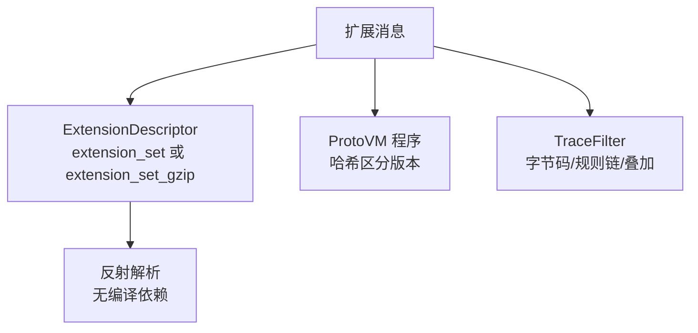
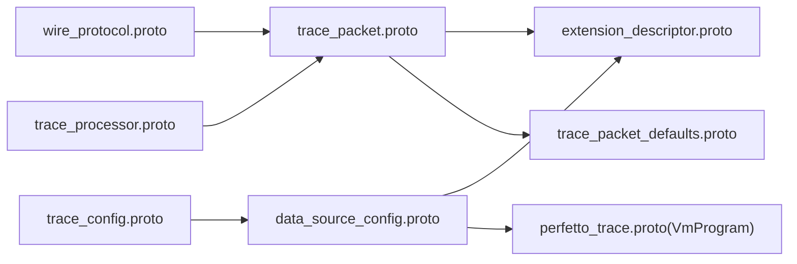

# 协议和标准规范

<cite>
**本文引用的文件**
- [protos/README.md](file://protos/README.md)
- [perfetto_trace.proto](file://protos/perfetto/trace/perfetto_trace.proto)
- [trace_packet.proto](file://protos/perfetto/trace/trace_packet.proto)
- [trace.proto](file://protos/perfetto/trace/trace.proto)
- [trace_packet_defaults.proto](file://protos/perfetto/trace/trace_packet_defaults.proto)
- [extension_descriptor.proto](file://protos/perfetto/trace/extension_descriptor.proto)
- [descriptor.proto](file://protos/perfetto/common/descriptor.proto)
- [trace_config.proto](file://protos/perfetto/config/trace_config.proto)
- [data_source_config.proto](file://protos/perfetto/config/data_source_config.proto)
- [perfetto_config.proto](file://protos/perfetto/config/perfetto_config.proto)
- [wire_protocol.proto](file://protos/perfetto/ipc/wire_protocol.proto)
- [serialization.proto](file://protos/perfetto/trace_processor/serialization.proto)
- [trace_processor.proto](file://protos/perfetto/trace_processor/trace_processor.proto)
- [commit_data_request.proto](file://protos/perfetto/common/commit_data_request.proto)
- [builtin_clock.proto](file://protos/perfetto/common/builtin_clock.proto)
- [semantic_type.proto](file://protos/perfetto/common/semantic_type.proto)
- [trace_attributes.proto](file://protos/perfetto/common/trace_attributes.proto)
</cite>

## 目录
1. [简介](#简介)
2. [项目结构](#项目结构)
3. [核心组件](#核心组件)
4. [架构总览](#架构总览)
5. [详细组件分析](#详细组件分析)
6. [依赖关系分析](#依赖关系分析)
7. [性能考量](#性能考量)
8. [故障排查指南](#故障排查指南)
9. [结论](#结论)
10. [附录](#附录)

## 简介
本规范系统性地梳理并阐述 Perfetto 的协议与标准，覆盖以下方面：
- Protobuf 消息格式：轨迹数据格式（TracePacket 及其子消息）、配置消息（TraceConfig、DataSourceConfig）、IPC 通信协议（IPCFrame）以及 TraceProcessor 的 RPC 接口。
- 字节序、打包与对齐规则：基于 Protobuf 规范的编码行为与序列化特性。
- 版本管理与向后兼容策略：通过字段保留、版本号、弃用字段与增量状态机制保障兼容。
- 数据序列化与反序列化：消息字段类型、标签编号、默认值与语义说明。
- 扩展机制与自定义字段：扩展描述符、ProtoVM 程序、字符串过滤器与增量状态。
- 验证规则与错误处理：字段约束、保留段、弃用策略与错误回传。
- 与其他系统的互操作性：Chrome/ETW/StatsD 等数据源配置与 TraceProcessor 的 HTTP+RPC 接口。

## 项目结构
Perfetto 的协议以 Protobuf 定义为核心，按功能域分层组织在三个主要目录中：
- trace/：采集输出的轨迹数据消息，如 TracePacket、各类事件包等。
- config/：输入配置，包括 TraceConfig、各数据源的 DataSourceConfig 以及融合后的 PerfettoConfig。
- ipc/：组件间 IPC 表面，如 Producer/Host/Consumer 之间的 RPC 帧格式。

图表来源
- [trace.proto:23-31](file://protos/perfetto/trace/trace.proto#L23-L31)
- [trace_packet.proto:121-415](file://protos/perfetto/trace/trace_packet.proto#L121-L415)
- [trace_packet_defaults.proto:32-43](file://protos/perfetto/trace/trace_packet_defaults.proto#L32-L43)
- [extension_descriptor.proto:27-40](file://protos/perfetto/trace/extension_descriptor.proto#L27-L40)
- [perfetto_trace.proto:1-18859](file://protos/perfetto/trace/perfetto_trace.proto#L1-L18859)
- [trace_config.proto:32-954](file://protos/perfetto/config/trace_config.proto#L32-L954)
- [data_source_config.proto:68-325](file://protos/perfetto/config/data_source_config.proto#L68-L325)
- [perfetto_config.proto:1-5480](file://protos/perfetto/config/perfetto_config.proto#L1-L5480)
- [wire_protocol.proto:21-114](file://protos/perfetto/ipc/wire_protocol.proto#L21-L114)
- [trace_processor.proto:74-198](file://protos/perfetto/trace_processor/trace_processor.proto#L74-L198)
- [serialization.proto:29-118](file://protos/perfetto/trace_processor/serialization.proto#L29-L118)
- [descriptor.proto:24-238](file://protos/perfetto/common/descriptor.proto#L24-L238)
- [builtin_clock.proto:473-511](file://protos/perfetto/common/builtin_clock.proto#L473-L511)
- [semantic_type.proto:521-526](file://protos/perfetto/common/semantic_type.proto#L521-L526)
- [trace_attributes.proto:38-50](file://protos/perfetto/common/trace_attributes.proto#L38-L50)
- [commit_data_request.proto:21-94](file://protos/perfetto/common/commit_data_request.proto#L21-L94)

章节来源
- [protos/README.md:1-21](file://protos/README.md#L1-L21)

## 核心组件
本节聚焦于关键消息的字段类型、标签编号、默认值与语义说明，并给出与实现相关的约束与建议。

- 轨迹根消息
  - Trace：包装一组 TracePacket，便于文件落盘场景；实际解析应以 TracePacket 为主。
  - TracePacket：线性序列中的最小单元，包含时间戳、时钟域、增量状态标志、默认值覆盖、扩展描述符、压缩包等。字段众多，涵盖系统信息、进程/线程描述、跟踪事件、GPU/电源/网络/帧事件、V8/WASM/JS 代码、远程时钟同步、WinETW、Pixel Modem、蓝牙、内核 wakelock、CPU per UID、Evdev、用户列表等。
  - TracePacketDefaults：为同一写入序列提供默认值覆盖，如时间戳时钟域、TrackEvent 默认、PerfSample 默认、V8 代码默认等。
  - ExtensionDescriptor：用于解析扩展字段的描述符集合或预压缩的描述符集，支持反射式反序列化扩展消息。
  - perfetto_trace.proto：包含大量内置描述符与计数器规格，如 GPU 计数器、TrackEvent 分类、ProtoVM 程序与指令等。

- 配置消息
  - TraceConfig：整体追踪会话配置，含缓冲区配置、数据源列表、内置数据源开关、持续时间、触发器、增量状态清理周期、压缩方式、字符串过滤器、报告配置、延迟启动等。
  - DataSourceConfig：每个数据源的独立配置，支持按名称或索引映射到缓冲区，支持优先使用挂起时间计数器、拦截器、ProtoVM 处理补丁、各平台特定配置（Android/Chrome/ETW/GPU/Profiling 等）。
  - PerfettoConfig：融合后的配置，便于跨平台传递。

- IPC 与服务接口
  - IPCFrame：Producer/Host/Consumer 间的 RPC 帧，支持绑定服务、调用方法、错误上报与对端身份设置；请求需单调递增的 request_id，流式响应可多次返回同 id。
  - TraceProcessor RPC：HTTP+RPC 或 WASM 桥接的二进制接口，定义方法枚举、请求/响应参数、查询结果批处理、元跟踪启用/读取、状态查询、度量计算、摘要生成与销毁等。

- 公共与通用消息
  - descriptor.proto：子集化的 FileDescriptorSet/DescriptorProto/FieldDescriptorProto 等，用于描述符传输与反射。
  - builtin_clock.proto：内置时钟域枚举，用于 TracePacket 时间戳与转换。
  - semantic_type.proto：字符串字段的语义类型，用于字符串过滤规则。
  - trace_attributes.proto：键值对形式的 Trace 属性，用于上下文附加。
  - commit_data_request.proto：生产者提交共享内存页/块、打补丁与 Flush 请求回执的请求消息。

章节来源
- [trace.proto:23-31](file://protos/perfetto/trace/trace.proto#L23-L31)
- [trace_packet.proto:121-415](file://protos/perfetto/trace/trace_packet.proto#L121-L415)
- [trace_packet_defaults.proto:32-43](file://protos/perfetto/trace/trace_packet_defaults.proto#L32-L43)
- [extension_descriptor.proto:27-40](file://protos/perfetto/trace/extension_descriptor.proto#L27-L40)
- [perfetto_trace.proto:1-18859](file://protos/perfetto/trace/perfetto_trace.proto#L1-L18859)
- [trace_config.proto:32-954](file://protos/perfetto/config/trace_config.proto#L32-L954)
- [data_source_config.proto:68-325](file://protos/perfetto/config/data_source_config.proto#L68-L325)
- [perfetto_config.proto:1-5480](file://protos/perfetto/config/perfetto_config.proto#L1-L5480)
- [wire_protocol.proto:21-114](file://protos/perfetto/ipc/wire_protocol.proto#L21-L114)
- [trace_processor.proto:74-198](file://protos/perfetto/trace_processor/trace_processor.proto#L74-L198)
- [descriptor.proto:24-238](file://protos/perfetto/common/descriptor.proto#L24-L238)
- [builtin_clock.proto:473-511](file://protos/perfetto/common/builtin_clock.proto#L473-L511)
- [semantic_type.proto:521-526](file://protos/perfetto/common/semantic_type.proto#L521-L526)
- [trace_attributes.proto:38-50](file://protos/perfetto/common/trace_attributes.proto#L38-L50)
- [commit_data_request.proto:21-94](file://protos/perfetto/common/commit_data_request.proto#L21-L94)

## 架构总览
下图展示从生产者到消费者与 TraceProcessor 的典型数据通路，以及 IPC 与 RPC 的交互。

图表来源
- [commit_data_request.proto:21-94](file://protos/perfetto/common/commit_data_request.proto#L21-L94)
- [wire_protocol.proto:21-114](file://protos/perfetto/ipc/wire_protocol.proto#L21-L114)
- [trace_processor.proto:74-198](file://protos/perfetto/trace_processor/trace_processor.proto#L74-L198)

## 详细组件分析

### 轨迹数据格式（TracePacket）
- 时间戳与时钟域
  - timestamp：TracePacket 的时间戳，默认对应系统时钟域（如 BOOTTIME），可通过 timestamp_clock_id 覆盖。
  - timestamp_clock_id：内置时钟域枚举，见 builtin_clock.proto。
- 增量状态与默认值
  - sequence_flags：包含增量状态清除与需要增量状态等标志位。
  - trace_packet_defaults：为同一写入序列提供默认值覆盖，避免重复携带字段。
  - interned_data：序列内增量内联数据，需配合 SEQ_INCREMENTAL_STATE_CLEARED 使用。
- 扩展与压缩
  - extension_descriptor：扩展描述符集合或压缩版，用于反射式解析扩展消息。
  - compressed_packets：Deflate 压缩的 TracePacket 序列片段。
- 数据源事件
  - 包含系统信息、进程树/统计、inode 文件映射、Chrome 事件、ftrace 事件、GPU/电源/网络/帧事件、V8/WASM/JS 代码、远程时钟同步、WinETW、Pixel Modem、蓝牙、内核 wakelock、CPU per UID、Evdev、用户列表等。

图表来源
- [trace_packet.proto:121-415](file://protos/perfetto/trace/trace_packet.proto#L121-L415)
- [trace_packet_defaults.proto:32-43](file://protos/perfetto/trace/trace_packet_defaults.proto#L32-L43)
- [extension_descriptor.proto:27-40](file://protos/perfetto/trace/extension_descriptor.proto#L27-L40)

章节来源
- [trace_packet.proto:121-415](file://protos/perfetto/trace/trace_packet.proto#L121-L415)
- [trace_packet_defaults.proto:32-43](file://protos/perfetto/trace/trace_packet_defaults.proto#L32-L43)
- [extension_descriptor.proto:27-40](file://protos/perfetto/trace/extension_descriptor.proto#L27-L40)
- [builtin_clock.proto:473-511](file://protos/perfetto/common/builtin_clock.proto#L473-L511)

### 配置协议（TraceConfig 与 DataSourceConfig）
- TraceConfig
  - 缓冲区配置：大小、填充策略（环形/丢弃）、克隆转移、清空克隆前缓冲、实验模式等。
  - 数据源列表：按名称/正则过滤目标生产者，按机器名过滤，支持内置数据源开关与主时钟域。
  - 触发器：支持开始/停止/快照克隆模式，带超时、停止延时、概率跳过与 24 小时上限。
  - 增量状态清理周期：定期通知数据源清理增量状态。
  - 过滤与压缩：字符串过滤器字节码、过滤链与叠加；压缩方式（Deflate）。
  - 报告与上传：Incident 报告、Android 框架报告、StatsD 日志开关。
- DataSourceConfig
  - 目标缓冲区映射：按索引或名称映射；支持优先使用挂起时间计数器。
  - 优先级提升、拦截器、ProtoVM 处理补丁。
  - 各平台特定配置：Android/Chrome/ETW/GPU/Profiling/Power/SysStats 等。

图表来源
- [trace_config.proto:32-954](file://protos/perfetto/config/trace_config.proto#L32-L954)
- [data_source_config.proto:68-325](file://protos/perfetto/config/data_source_config.proto#L68-L325)

章节来源
- [trace_config.proto:32-954](file://protos/perfetto/config/trace_config.proto#L32-L954)
- [data_source_config.proto:68-325](file://protos/perfetto/config/data_source_config.proto#L68-L325)
- [perfetto_config.proto:1-5480](file://protos/perfetto/config/perfetto_config.proto#L1-L5480)

### IPC 通信协议（IPCFrame）
- 绑定服务：客户端向主机声明服务名，主机返回可用方法列表与服务 ID。
- 方法调用：携带请求参数 Proto 编码，支持无需回复的“丢弃回复”优化。
- 错误上报：统一的错误消息体。
- 对端身份：在非 UNIX 域套接字场景下，由中继服务注入生产者身份与机器标识提示。

图表来源
- [wire_protocol.proto:21-114](file://protos/perfetto/ipc/wire_protocol.proto#L21-L114)

章节来源
- [wire_protocol.proto:21-114](file://protos/perfetto/ipc/wire_protocol.proto#L21-L114)

### TraceProcessor RPC 接口
- 方法枚举：追加数据、最终化、流式查询、度量计算、元跟踪启用/读取、状态查询、重置、SQL 包注册、摘要生成与销毁等。
- 查询结果批处理：Cell 类型与批量编码，支持 VARINT/FLOAT64/STRING/BLOB，字符串拼接并以 NUL 分隔。
- API 版本：当前版本号与 UI/服务匹配策略。

图表来源
- [trace_processor.proto:74-198](file://protos/perfetto/trace_processor/trace_processor.proto#L74-L198)
- [trace_processor.proto:205-278](file://protos/perfetto/trace_processor/trace_processor.proto#L205-L278)

章节来源
- [trace_processor.proto:74-198](file://protos/perfetto/trace_processor/trace_processor.proto#L74-L198)
- [trace_processor.proto:205-278](file://protos/perfetto/trace_processor/trace_processor.proto#L205-L278)

### 扩展机制与自定义字段
- 扩展描述符：ExtensionDescriptor 支持 FileDescriptorSet 或 gzip 压缩的扩展集，用于反射解析扩展消息。
- ProtoVM 程序：数据源注册时提供的程序，服务计算哈希区分不同版本，必要时为每个数据源实例化专用 VM。
- 字符串过滤器：TraceConfig 中的 TraceFilter 提供字节码与规则链，支持正则匹配、部分搜索与覆盖叠加。

图表来源
- [extension_descriptor.proto:27-40](file://protos/perfetto/trace/extension_descriptor.proto#L27-L40)
- [descriptor.proto:24-238](file://protos/perfetto/common/descriptor.proto#L24-L238)
- [trace_config.proto:569-737](file://protos/perfetto/config/trace_config.proto#L569-L737)

章节来源
- [extension_descriptor.proto:27-40](file://protos/perfetto/trace/extension_descriptor.proto#L27-L40)
- [descriptor.proto:24-238](file://protos/perfetto/common/descriptor.proto#L24-L238)
- [trace_config.proto:569-737](file://protos/perfetto/config/trace_config.proto#L569-L737)

### 版本管理与向后兼容
- 字段保留与弃用：大量 reserved/optional 字段用于向前兼容，新增字段采用新编号，旧字段保持语义不变。
- 版本号与 API：TraceProcessorApiVersion 用于 UI 与服务版本匹配；TraceConfig 中的 guardrail 覆盖与字符串过滤器叠加版本。
- 增量状态与清理：通过序列标志与周期性清理策略，确保在环形缓冲模式下的正确性与一致性。

章节来源
- [trace_config.proto:32-954](file://protos/perfetto/config/trace_config.proto#L32-L954)
- [trace_processor.proto:40-66](file://protos/perfetto/trace_processor/trace_processor.proto#L40-L66)

## 依赖关系分析
- 模块耦合
  - trace_packet.proto 引入大量子消息与扩展，形成强耦合的数据包模型。
  - config 与 trace 之间通过 DataSourceDescriptor 与 DataSourceConfig 建立连接。
  - IPC 与 TraceProcessor 作为外部接口，解耦生产者与消费者。
- 外部依赖
  - Chrome/ETW/StatsD 等平台特定配置通过 data_source_config.proto 的 lazy 字段承载，避免生成重型 C++ 类。
  - TraceProcessor 的 HTTP+RPC 接口与 WASM 桥接，提供多运行时的统一访问。

图表来源
- [trace_packet.proto:121-415](file://protos/perfetto/trace/trace_packet.proto#L121-L415)
- [extension_descriptor.proto:27-40](file://protos/perfetto/trace/extension_descriptor.proto#L27-L40)
- [trace_packet_defaults.proto:32-43](file://protos/perfetto/trace/trace_packet_defaults.proto#L32-L43)
- [trace_config.proto:32-954](file://protos/perfetto/config/trace_config.proto#L32-L954)
- [data_source_config.proto:68-325](file://protos/perfetto/config/data_source_config.proto#L68-L325)
- [wire_protocol.proto:21-114](file://protos/perfetto/ipc/wire_protocol.proto#L21-L114)
- [trace_processor.proto:74-198](file://protos/perfetto/trace_processor/trace_processor.proto#L74-L198)
- [perfetto_trace.proto:171-282](file://protos/perfetto/trace/perfetto_trace.proto#L171-L282)

章节来源
- [trace_packet.proto:121-415](file://protos/perfetto/trace/trace_packet.proto#L121-L415)
- [data_source_config.proto:68-325](file://protos/perfetto/config/data_source_config.proto#L68-L325)
- [wire_protocol.proto:21-114](file://protos/perfetto/ipc/wire_protocol.proto#L21-L114)
- [trace_processor.proto:74-198](file://protos/perfetto/trace_processor/trace_processor.proto#L74-L198)

## 性能考量
- 缓冲区与填充策略：RING_BUFFER 适合高吞吐低延迟场景，DISCARD 在缓冲区满时保护数据完整性。
- 增量状态与压缩：合理使用 interned_data 与 compressed_packets 减少带宽与存储开销。
- 触发器与周期性刷新：避免过高频率的 flush 导致性能下降。
- 字符串过滤器：在服务端应用过滤可减少下游处理成本，但需权衡配置复杂度。

## 故障排查指南
- IPC 错误上报：IPCFrame.RequestError 提供统一错误载体，结合 SetPeerIdentity 与 request_id 进行定位。
- 生产者提交异常：CommitDataRequest.ChunksToMove/ChunkToPatch 的 offset/data/has_more_patches 需严格对齐与校验。
- TraceProcessor 状态：StatusResult 提供版本号与 API 版本，用于判断 UI/服务版本匹配问题。
- 字段保留与弃用：遇到字段缺失或行为异常，检查 reserved/optional 字段与弃用策略。

章节来源
- [wire_protocol.proto:68-114](file://protos/perfetto/ipc/wire_protocol.proto#L68-L114)
- [commit_data_request.proto:63-87](file://protos/perfetto/common/commit_data_request.proto#L63-L87)
- [trace_processor.proto:284-307](file://protos/perfetto/trace_processor/trace_processor.proto#L284-L307)

## 结论
Perfetto 协议以 Protobuf 为核心，围绕 TracePacket 构建了完备的轨迹数据模型，并通过 TraceConfig/DataSourceConfig 实现灵活的采集配置。IPC 与 TraceProcessor RPC 提供了清晰的组件间通信与查询能力。版本管理与扩展机制确保了长期演进的稳定性与兼容性。遵循本规范可实现跨平台、跨组件的一致性集成与互操作。

## 附录
- 术语
  - 时钟域：内置时钟域枚举，用于统一时间基准与转换。
  - 增量状态：序列内可复用的内联数据与默认值，需配合序列标志与清理策略。
  - 扩展描述符：用于反射解析扩展消息的描述符集合。
  - ProtoVM：轻量虚拟机，用于处理覆盖包补丁。
- 互操作性要点
  - Chrome/ETW/StatsD 等平台特定配置通过 lazy 字段传递，避免强耦合。
  - TraceProcessor 的 HTTP+RPC 接口支持多运行时访问，便于前端与工具链集成。