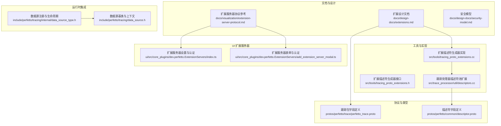
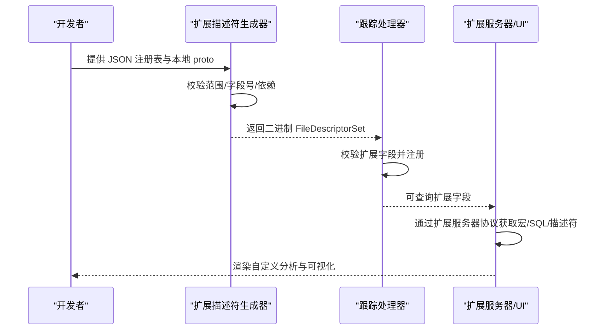
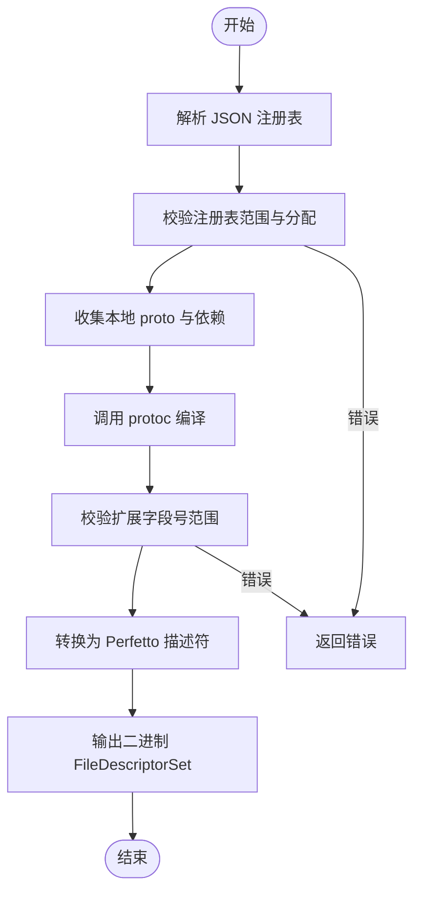
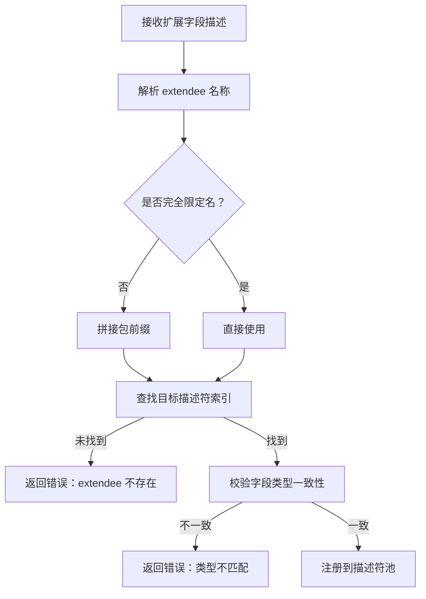
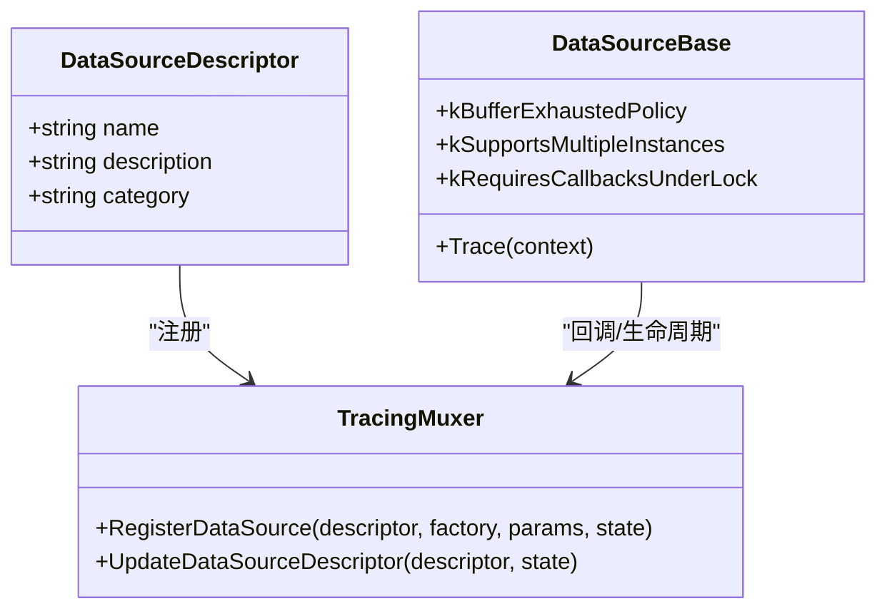
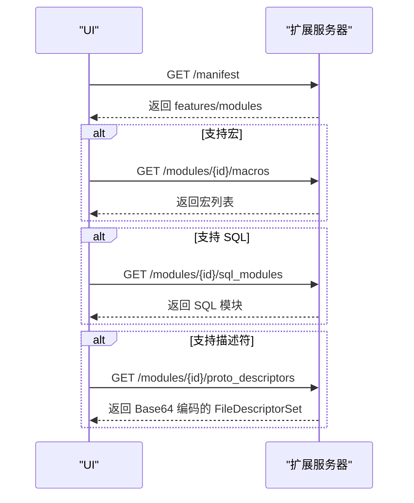
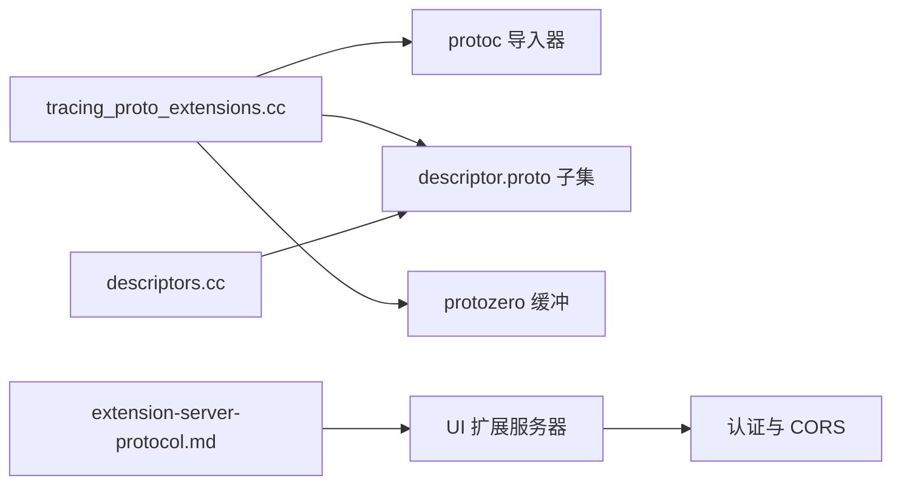

# 扩展协议

<cite>
**本文引用的文件**
- [扩展设计文档](file://docs/design-docs/extensions.md)
- [扩展描述符生成器接口](file://src/tools/tracing_proto_extensions.h)
- [扩展描述符生成器实现](file://src/tools/tracing_proto_extensions.cc)
- [跟踪处理器描述符池扩展](file://src/trace_processor/util/descriptors.cc)
- [扩展服务器协议参考](file://docs/visualization/extension-server-protocol.md)
- [扩展服务器设置与认证](file://ui/src/core_plugins/dev.perfetto.ExtensionServers/index.ts)
- [扩展服务器表单与认证](file://ui/src/core_plugins/dev.perfetto.ExtensionServers/add_extension_server_modal.ts)
- [安全模型](file://docs/design-docs/security-model.md)
- [跟踪包字段定义](file://protos/perfetto/trace/perfetto_trace.proto)
- [描述符字段定义](file://protos/perfetto/common/descriptor.proto)
- [ProtoZero 字段工具](file://include/perfetto/protozero/proto_utils.h)
- [数据源注册与生命周期](file://include/perfetto/tracing/internal/data_source_type.h)
- [数据源基类与上下文](file://include/perfetto/tracing/data_source.h)
- [扩展单元测试（解析）](file://src/tools/tracing_proto_extensions_unittest.cc)
- [构建与开发环境建议](file://docs/contributing/build-instructions.md)
</cite>

## 目录
1. [简介](#简介)
2. [项目结构](#项目结构)
3. [核心组件](#核心组件)
4. [架构总览](#架构总览)
5. [详细组件分析](#详细组件分析)
6. [依赖关系分析](#依赖关系分析)
7. [性能考量](#性能考量)
8. [故障排查指南](#故障排查指南)
9. [结论](#结论)
10. [附录](#附录)

## 简介
本文件系统化阐述 Perfetto 扩展协议的设计与实现，覆盖以下主题：
- 扩展机制：基于 Protozero 的 Protobuf 扩展支持、扩展描述符注入与运行时解析。
- 自定义数据源：扩展追踪事件与数据源注册流程。
- 第三方插件支持：扩展服务器协议与 UI 插件生态。
- 扩展描述符：结构、注册与版本管理、兼容性校验。
- 扩展消息格式：命名空间约定、字段标签分配、数据类型限制。
- 开发指南：环境搭建、编译配置、测试方法。
- 部署与分发：版本控制与向后兼容保障。
- 安全与访问控制：服务隔离、认证与 CORS 要求。

## 项目结构
围绕扩展协议的关键目录与文件：
- 设计与文档：docs/design-docs/extensions.md、docs/visualization/extension-server-protocol.md、docs/design-docs/security-model.md
- 工具与实现：src/tools/tracing_proto_extensions.{h,cc}、src/trace_processor/util/descriptors.cc
- 协议与类型：protos/perfetto/trace/perfetto_trace.proto、protos/perfetto/common/descriptor.proto
- 运行时集成：include/perfetto/tracing/data_source.h、include/perfetto/tracing/internal/data_source_type.h
- UI 扩展服务器：ui/src/core_plugins/dev.perfetto.ExtensionServers/*
- 测试：src/tools/tracing_proto_extensions_unittest.cc
- 构建与开发：docs/contributing/build-instructions.md

**图表来源**
- [扩展设计文档:1-68](file://docs/design-docs/extensions.md#L1-L68)
- [扩展描述符生成器接口:1-84](file://src/tools/tracing_proto_extensions.h#L1-L84)
- [扩展描述符生成器实现:1-684](file://src/tools/tracing_proto_extensions.cc#L1-L684)
- [跟踪处理器描述符池扩展:67-136](file://src/trace_processor/util/descriptors.cc#L67-L136)
- [扩展服务器协议参考:1-278](file://docs/visualization/extension-server-protocol.md#L1-L278)
- [扩展服务器设置与认证:105-350](file://ui/src/core_plugins/dev.perfetto.ExtensionServers/index.ts#L105-L350)
- [扩展服务器表单与认证:1-620](file://ui/src/core_plugins/dev.perfetto.ExtensionServers/add_extension_server_modal.ts#L1-L620)
- [跟踪包字段定义:8784-8822](file://protos/perfetto/trace/perfetto_trace.proto#L8784-L8822)
- [描述符字段定义:145-188](file://protos/perfetto/common/descriptor.proto#L145-L188)
- [数据源注册与生命周期:59-88](file://include/perfetto/tracing/internal/data_source_type.h#L59-L88)
- [数据源基类与上下文:270-295](file://include/perfetto/tracing/data_source.h#L270-L295)

**章节来源**
- [扩展设计文档:1-68](file://docs/design-docs/extensions.md#L1-L68)
- [扩展服务器协议参考:1-278](file://docs/visualization/extension-server-protocol.md#L1-L278)
- [扩展描述符生成器接口:1-84](file://src/tools/tracing_proto_extensions.h#L1-L84)
- [扩展描述符生成器实现:1-684](file://src/tools/tracing_proto_extensions.cc#L1-L684)
- [跟踪处理器描述符池扩展:67-136](file://src/trace_processor/util/descriptors.cc#L67-L136)
- [跟踪包字段定义:8784-8822](file://protos/perfetto/trace/perfetto_trace.proto#L8784-L8822)
- [描述符字段定义:145-188](file://protos/perfetto/common/descriptor.proto#L145-L188)
- [数据源注册与生命周期:59-88](file://include/perfetto/tracing/internal/data_source_type.h#L59-L88)
- [数据源基类与上下文:270-295](file://include/perfetto/tracing/data_source.h#L270-L295)
- [扩展服务器设置与认证:105-350](file://ui/src/core_plugins/dev.perfetto.ExtensionServers/index.ts#L105-L350)
- [扩展服务器表单与认证:1-620](file://ui/src/core_plugins/dev.perfetto.ExtensionServers/add_extension_server_modal.ts#L1-L620)

## 核心组件
- 扩展描述符生成器：解析 JSON 注册表、校验字段号范围、编译本地 proto 并生成二进制描述符集合，供 TraceProcessor 使用。
- 跟踪处理器描述符池：接收并校验扩展字段，确保类型一致性与可解析性。
- 数据源扩展：通过 DataSourceDescriptor 注册自定义数据源，支持增量状态与 TLS 生命周期回调。
- 扩展服务器协议：UI 通过 HTTP(S) 拉取宏、SQL 模块与 proto 描述符，支持多种认证方式与 CORS。
- 安全模型：服务端隔离、消费者信任边界、共享内存点对点隔离、包字段防篡改与 UID 原子性。

**章节来源**
- [扩展描述符生成器接口:28-84](file://src/tools/tracing_proto_extensions.h#L28-L84)
- [扩展描述符生成器实现:597-684](file://src/tools/tracing_proto_extensions.cc#L597-L684)
- [跟踪处理器描述符池扩展:72-136](file://src/trace_processor/util/descriptors.cc#L72-L136)
- [数据源注册与生命周期:64-85](file://include/perfetto/tracing/internal/data_source_type.h#L64-L85)
- [扩展服务器协议参考:1-278](file://docs/visualization/extension-server-protocol.md#L1-L278)
- [安全模型:1-60](file://docs/design-docs/security-model.md#L1-L60)

## 架构总览
扩展协议贯穿“生成—注册—解析—消费”链路：
- 生成阶段：开发者维护 JSON 注册表，声明作用域、范围与分配；工具编译本地 proto，产出二进制描述符集合。
- 注册阶段：TraceProcessor 加载扩展描述符，建立字段映射与类型约束。
- 解析阶段：解析 TracePacket 中的扩展字段，写入数据库以便 SQL 查询。
- 消费阶段：UI 通过扩展服务器协议拉取宏与 SQL 模块，结合 proto 描述符渲染自定义内容。

**图表来源**
- [扩展描述符生成器实现:597-684](file://src/tools/tracing_proto_extensions.cc#L597-L684)
- [跟踪处理器描述符池扩展:72-136](file://src/trace_processor/util/descriptors.cc#L72-L136)
- [扩展服务器协议参考:1-278](file://docs/visualization/extension-server-protocol.md#L1-L278)

## 详细组件分析

### 组件A：扩展描述符生成器
- 输入：JSON 注册表（支持顶层与子注册表）、本地 .proto 文件路径、protoc include 路径。
- 处理流程：
  - 解析 JSON，提取 scope、ranges、allocations。
  - 校验范围不重叠、连续、互斥；校验分配项字段约束。
  - 收集本地 proto 与依赖，调用 protoc 编译。
  - 校验扩展字段号在分配范围内；转换为 Perfetto 描述符格式。
  - 输出二进制 FileDescriptorSet。
- 关键数据结构：Registry、Allocation、Range（闭区间）。
- 错误处理：字段号越界、无目标扩展、重复/冲突分配等。

**图表来源**
- [扩展描述符生成器实现:429-684](file://src/tools/tracing_proto_extensions.cc#L429-L684)

**章节来源**
- [扩展描述符生成器接口:28-84](file://src/tools/tracing_proto_extensions.h#L28-L84)
- [扩展描述符生成器实现:429-684](file://src/tools/tracing_proto_extensions.cc#L429-L684)
- [扩展单元测试（解析）:211-257](file://src/tools/tracing_proto_extensions_unittest.cc#L211-L257)

### 组件B：跟踪处理器描述符池扩展
- 功能：接收扩展字段描述，解析 extendee 名称，校验字段类型一致性，避免重复或冲突。
- 兼容性：支持短名称解析与完全限定名解析，确保跨包查找正确。
- 错误处理：类型不一致、extendee 不存在、字段重复等。

**图表来源**
- [跟踪处理器描述符池扩展:117-136](file://src/trace_processor/util/descriptors.cc#L117-L136)

**章节来源**
- [跟踪处理器描述符池扩展:72-136](file://src/trace_processor/util/descriptors.cc#L72-L136)

### 组件C：数据源扩展与生命周期
- 数据源注册：通过 DataSourceDescriptor 与工厂函数注册，支持增量状态与 TLS 生命周期回调。
- 上下文：TraceContext 提供 TracePacket 写入能力，支持多实例与回调锁策略。
- 行为：缓冲区耗尽策略、多实例支持标志、回调锁要求等。

**图表来源**
- [数据源注册与生命周期:64-85](file://include/perfetto/tracing/internal/data_source_type.h#L64-L85)
- [数据源基类与上下文:270-295](file://include/perfetto/tracing/data_source.h#L270-L295)

**章节来源**
- [数据源注册与生命周期:59-88](file://include/perfetto/tracing/internal/data_source_type.h#L59-L88)
- [数据源基类与上下文:270-295](file://include/perfetto/tracing/data_source.h#L270-L295)

### 组件D：扩展服务器协议与 UI 插件
- 协议端点：/manifest、/modules/{module_id}/macros、/modules/{module_id}/sql_modules、/modules/{module_id}/proto_descriptors。
- 特性：宏、SQL 模块、proto 描述符三类可选功能。
- 认证：支持无认证、GitHub PAT、Basic、Bearer、X-API-Key、SSO 等。
- CORS：HTTPS 服务器需允许来自 UI 的跨域请求头。
- UI 设置：添加/编辑/删除扩展服务器，合并共享链接中的模块列表。

**图表来源**
- [扩展服务器协议参考:1-278](file://docs/visualization/extension-server-protocol.md#L1-L278)
- [扩展服务器设置与认证:105-350](file://ui/src/core_plugins/dev.perfetto.ExtensionServers/index.ts#L105-L350)
- [扩展服务器表单与认证:1-620](file://ui/src/core_plugins/dev.perfetto.ExtensionServers/add_extension_server_modal.ts#L1-L620)

**章节来源**
- [扩展服务器协议参考:1-278](file://docs/visualization/extension-server-protocol.md#L1-L278)
- [扩展服务器设置与认证:105-350](file://ui/src/core_plugins/dev.perfetto.ExtensionServers/index.ts#L105-L350)
- [扩展服务器表单与认证:1-620](file://ui/src/core_plugins/dev.perfetto.ExtensionServers/add_extension_server_modal.ts#L1-L620)

## 依赖关系分析
- 工具链依赖：protoc 导入器、descriptor.proto 子集转换、protozero 缓冲区。
- 运行时依赖：TraceProcessor 描述符池、ProtoToArgs 工具（扩展字段解析至 args 表）。
- UI 依赖：扩展服务器协议、认证与 CORS、模块清单与共享链接。

**图表来源**
- [扩展描述符生成器实现:624-680](file://src/tools/tracing_proto_extensions.cc#L624-L680)
- [跟踪处理器描述符池扩展:117-136](file://src/trace_processor/util/descriptors.cc#L117-L136)
- [扩展服务器协议参考:151-189](file://docs/visualization/extension-server-protocol.md#L151-L189)

**章节来源**
- [扩展描述符生成器实现:624-680](file://src/tools/tracing_proto_extensions.cc#L624-L680)
- [跟踪处理器描述符池扩展:117-136](file://src/trace_processor/util/descriptors.cc#L117-L136)
- [扩展服务器协议参考:151-189](file://docs/visualization/extension-server-protocol.md#L151-L189)

## 性能考量
- 描述符生成：本地 proto 编译与依赖扫描可能较重，建议缓存中间产物与增量编译。
- 运行时解析：扩展字段解析在 TraceProcessor 中进行，应避免过多扩展字段导致解析开销上升。
- UI 加载：按需加载扩展服务器模块，减少网络与解析负担。
- 数据源写入：合理设置缓冲区耗尽策略与多实例标志，平衡吞吐与资源占用。

## 故障排查指南
- 扩展字段号越界：检查 JSON 注册表中分配范围与实际 proto 扩展字段号是否匹配。
- 类型不一致：同一字段号在不同扩展中类型或消息类型不一致，将触发校验失败。
- extendee 不存在：确认扩展目标消息完整限定名正确，或使用包前缀拼接。
- CORS 失败：HTTPS 扩展服务器未设置允许的 Origin/Headers，UI 将跳过该服务器。
- 认证失败：检查认证类型与凭据配置，SSO 失败会尝试刷新会话后重试一次。

**章节来源**
- [扩展描述符生成器实现:206-261](file://src/tools/tracing_proto_extensions.cc#L206-L261)
- [跟踪处理器描述符池扩展:72-91](file://src/trace_processor/util/descriptors.cc#L72-L91)
- [扩展服务器协议参考:151-189](file://docs/visualization/extension-server-protocol.md#L151-L189)

## 结论
Perfetto 扩展协议以“描述符驱动 + 运行时解析”的方式，实现了对 Protobuf 扩展的可控引入与安全解析。通过 JSON 注册表与工具链，开发者可以安全地分配字段号并生成描述符；通过 TraceProcessor 描述符池与 UI 扩展服务器协议，扩展内容得以在分析与可视化层面被充分利用。配合严格的安全模型与访问控制策略，扩展生态在功能增强的同时保持了系统的安全性与稳定性。

## 附录

### 扩展消息格式规范（字段与命名空间）
- 命名空间约定：
  - 扩展服务器的 namespace 必须为反向域名形式，宏 ID 与 SQL 模块名必须以此为前缀。
  - proto 描述符本身具有包级命名空间，不受 UI 命名强制。
- 字段标签分配：
  - 使用 JSON 注册表声明范围与分配，扩展字段号必须落在分配范围内。
  - 支持单个范围与多个范围数组两种表达方式，且互斥。
- 数据类型限制：
  - 扩展字段类型需与现有定义一致，否则解析失败。
  - 枚举与消息类型需完全匹配，避免歧义。

**章节来源**
- [扩展服务器协议参考:139-149](file://docs/visualization/extension-server-protocol.md#L139-L149)
- [扩展描述符生成器实现:263-425](file://src/tools/tracing_proto_extensions.cc#L263-L425)
- [跟踪包字段定义:8784-8822](file://protos/perfetto/trace/perfetto_trace.proto#L8784-L8822)
- [描述符字段定义:145-188](file://protos/perfetto/common/descriptor.proto#L145-L188)
- [ProtoZero 字段工具:88-128](file://include/perfetto/protozero/proto_utils.h#L88-L128)

### 开发指南（环境、编译、测试）
- 环境搭建：参考构建与开发环境建议，安装必要工具链与 IDE 扩展。
- 编译配置：使用 GN/Bazel 构建系统，确保 protoc 与 proto 头文件可用。
- 测试方法：运行扩展描述符生成器单元测试，验证 JSON 解析、范围校验与字段号检查。

**章节来源**
- [构建与开发环境建议:424-466](file://docs/contributing/build-instructions.md#L424-L466)
- [扩展单元测试（解析）:211-257](file://src/tools/tracing_proto_extensions_unittest.cc#L211-L257)

### 部署与分发（版本控制与兼容性）
- 版本控制：通过 JSON 注册表与子注册表树形结构管理扩展版本与依赖。
- 向后兼容：字段号分配采用“分配—校验—转换”流程，确保扩展字段在运行时可被正确解析。
- 分发策略：静态 JSON 文件或动态 HTTP(S) 服务器，结合 UI 扩展服务器协议进行分发。

**章节来源**
- [扩展描述符生成器实现:567-684](file://src/tools/tracing_proto_extensions.cc#L567-L684)
- [扩展服务器协议参考:1-278](file://docs/visualization/extension-server-protocol.md#L1-L278)

### 安全考虑与访问控制
- 服务隔离：生产者不可信，消费者受控；共享内存点对点隔离，避免跨实体泄露。
- 认证与 CORS：HTTPS 扩展服务器需设置允许的跨域请求头；UI 支持多种认证方式。
- 包字段防篡改：服务端拒绝伪造 TracePacket 字段，附加生产者 UID 用于离线溯源。

**章节来源**
- [安全模型:1-60](file://docs/design-docs/security-model.md#L1-L60)
- [扩展服务器协议参考:151-189](file://docs/visualization/extension-server-protocol.md#L151-L189)