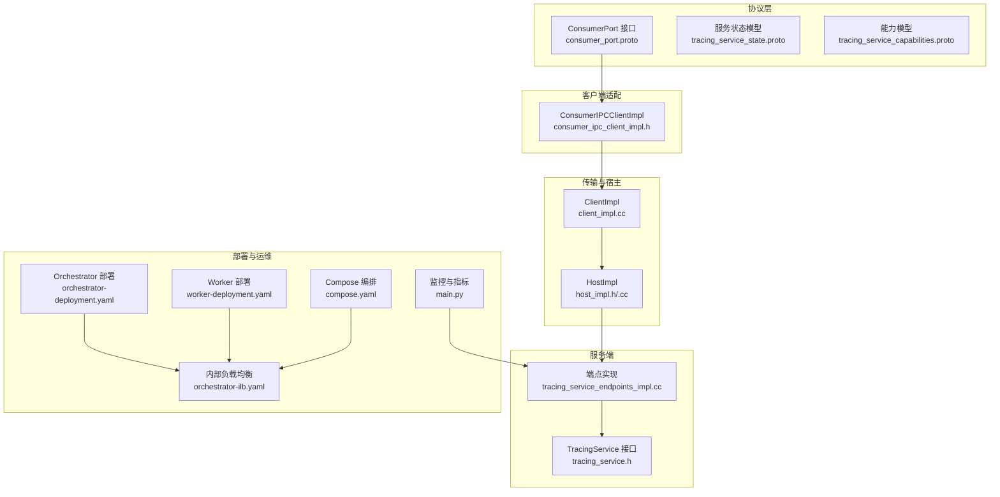
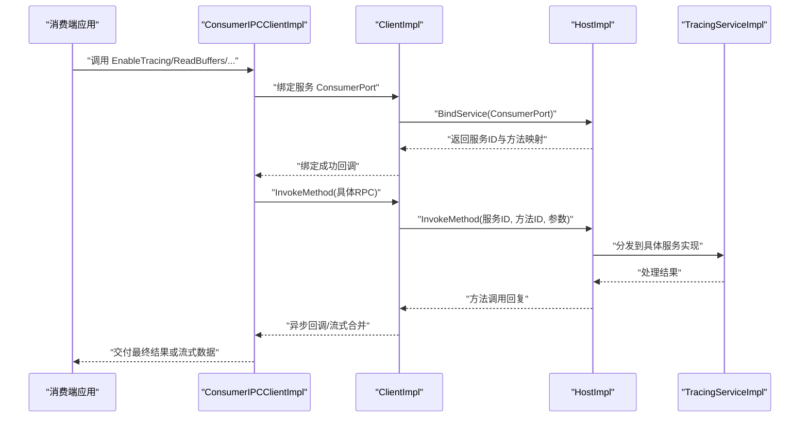
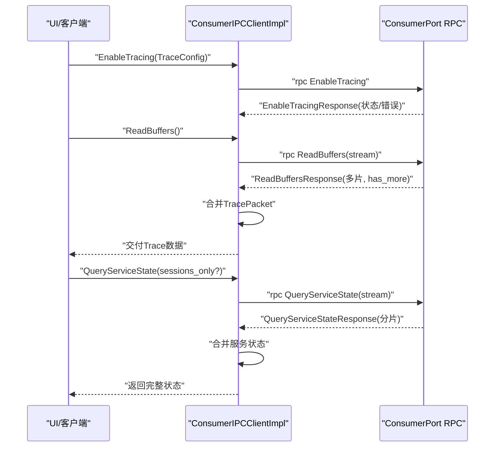
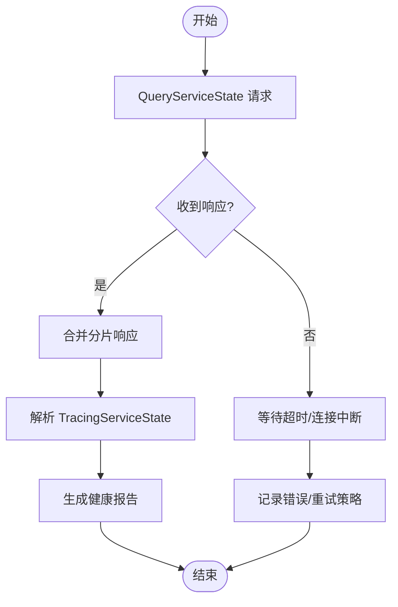
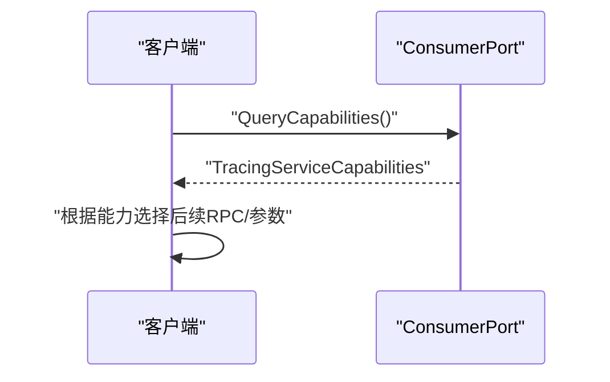
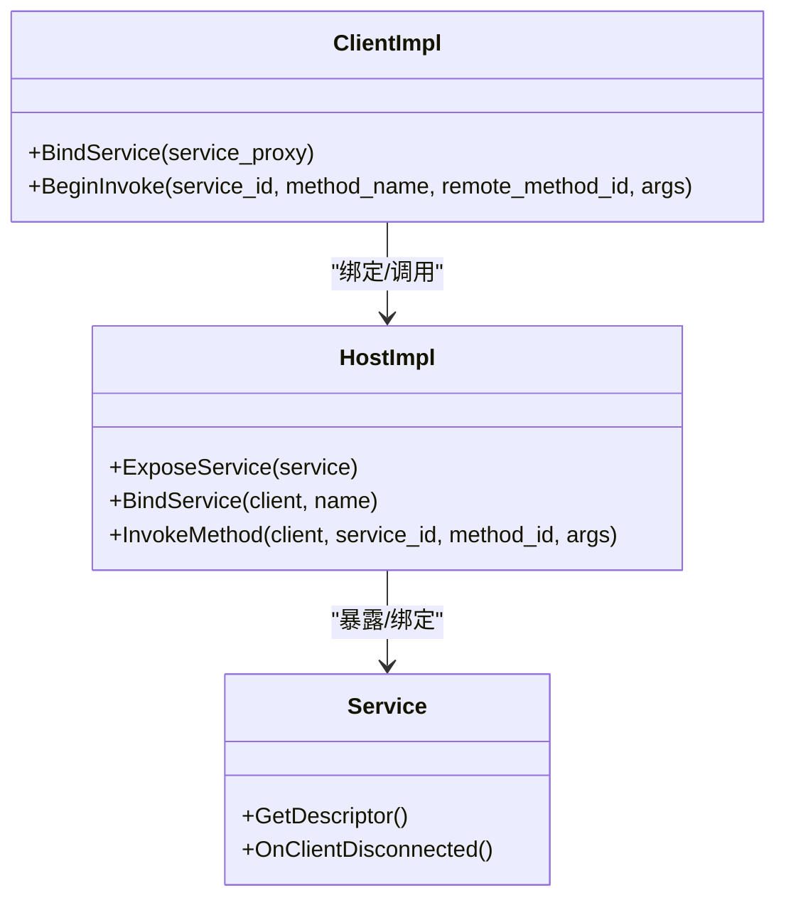
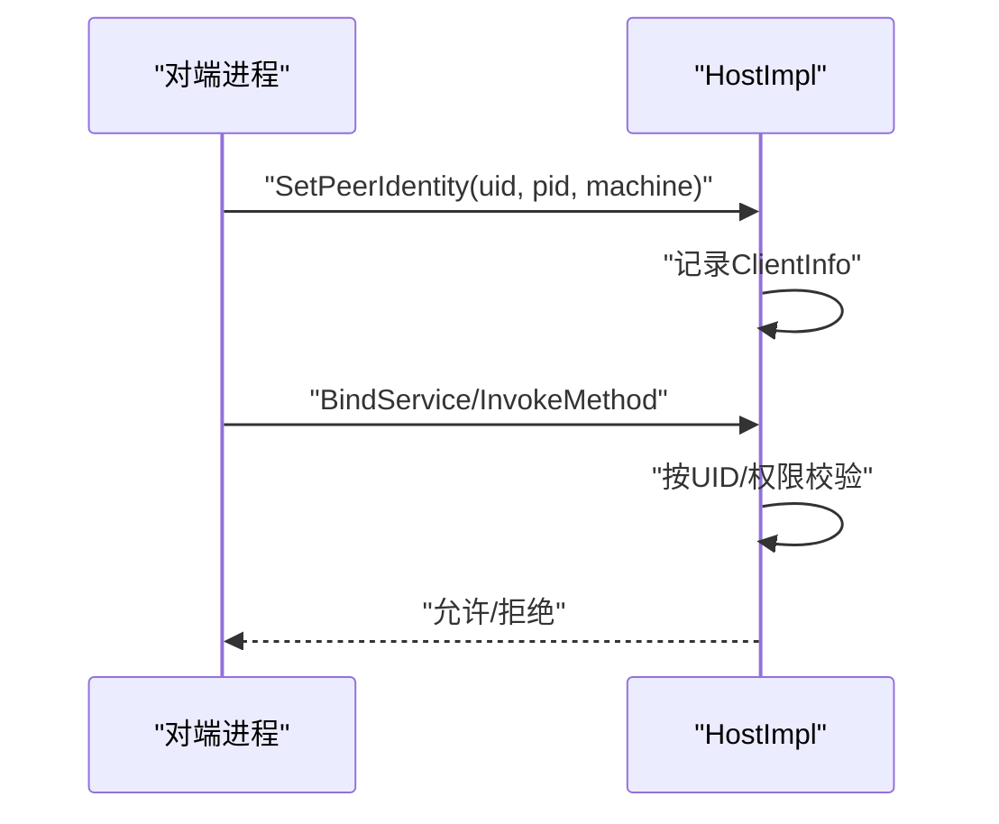
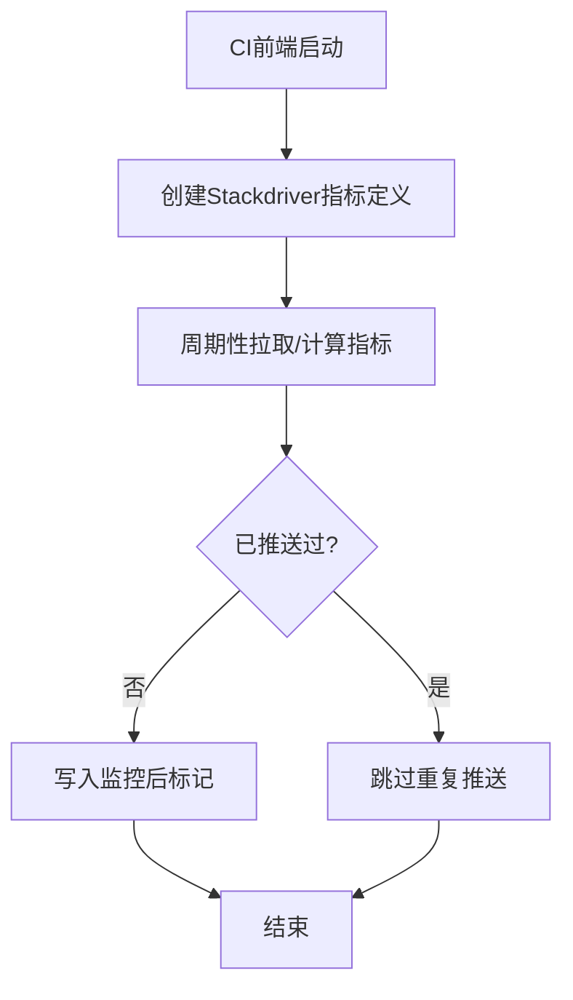
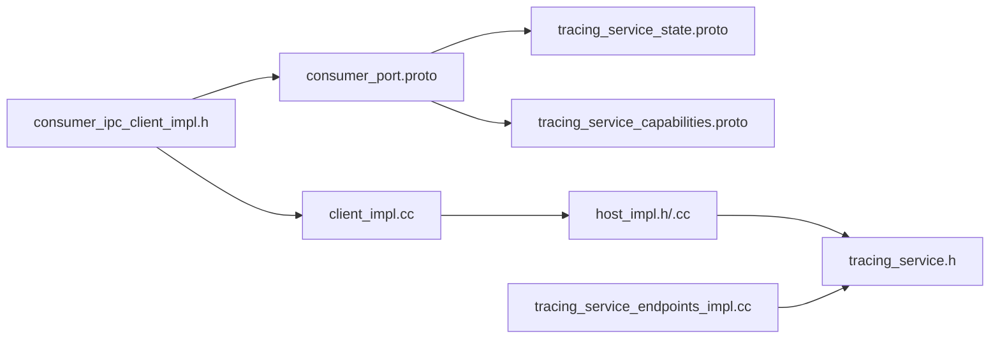

# 服务通信协议

<cite>
**本文引用的文件**
- [consumer_port.proto](file://protos/perfetto/ipc/consumer_port.proto)
- [tracing_service_state.proto](file://protos/perfetto/common/tracing_service_state.proto)
- [tracing_service_capabilities.proto](file://protos/perfetto/common/tracing_service_capabilities.proto)
- [consumer_ipc_client_impl.h](file://src/tracing/ipc/consumer/consumer_ipc_client_impl.h)
- [tracing.cc](file://src/tracing/tracing.cc)
- [host_impl.h](file://src/ipc/host_impl.h)
- [host_impl.cc](file://src/ipc/host_impl.cc)
- [client_impl.cc](file://src/ipc/client_impl.cc)
- [tracing_service.h](file://include/perfetto/ext/tracing/core/tracing_service.h)
- [tracing_service_endpoints_impl.cc](file://src/tracing/service/tracing_service_endpoints_impl.cc)
- [orchestrator_main.cc](file://src/bigtrace/orchestrator/orchestrator_main.cc)
- [orchestrator-deployment.yaml](file://infra/bigtrace/minikube/orchestrator-deployment.yaml)
- [worker-deployment.yaml](file://infra/bigtrace/minikube/worker-deployment.yaml)
- [orchestrator-ilb.yaml](file://infra/bigtrace/gke/orchestrator-ilb.yaml)
- [compose.yaml](file://infra/bigtrace/docker/compose.yaml)
- [main.py](file://infra/ci/frontend/main.py)
- [adb_platform_checks.ts](file://ui/src/plugins/dev.perfetto.RecordTraceV2/adb/adb_platform_checks.ts)
- [health_hal.cc](file://src/android_internal/health_hal.cc)
- [cpu_reader.cc](file://src/traced/probes/ftrace/cpu_reader.cc)
- [stats.h](file://src/trace_processor/storage/stats.h)
</cite>

## 目录
1. [简介](#简介)
2. [项目结构](#项目结构)
3. [核心组件](#核心组件)
4. [架构总览](#架构总览)
5. [详细组件分析](#详细组件分析)
6. [依赖关系分析](#依赖关系分析)
7. [性能考量](#性能考量)
8. [故障排查指南](#故障排查指南)
9. [结论](#结论)
10. [附录](#附录)

## 简介
本文件面向Perfetto服务通信协议，系统化梳理TracingService的RPC接口与服务模型，覆盖会话管理、状态查询与控制命令；文档化服务状态协议（可用性检查、健康状态、故障诊断）；说明服务能力协商机制（功能检测、版本协商、特性支持查询）；给出服务端点发现与注册机制（服务发现、负载均衡策略）；阐述服务间认证与授权（令牌管理、权限验证、访问控制）；并提供服务监控与日志协议（性能指标采集、错误报告格式），以及服务部署与运维相关协议规范。

## 项目结构
- 协议层：以proto定义服务接口与数据模型，位于protos目录
- 客户端适配层：消费端通过ConsumerIPCClientImpl代理调用服务
- 传输与宿主：IPC Host/Client实现服务暴露、绑定、方法分发与连接生命周期
- 服务端实现：TracingService接口与具体实现负责会话、数据源、缓冲区管理
- 部署与运维：Kubernetes/Docker编排与健康检查、指标上报示例

**图示来源**
- [consumer_port.proto:28-130](file://protos/perfetto/ipc/consumer_port.proto#L28-L130)
- [consumer_ipc_client_impl.h:52-128](file://src/tracing/ipc/consumer/consumer_ipc_client_impl.h#L52-L128)
- [host_impl.h:72-106](file://src/ipc/host_impl.h#L72-L106)
- [host_impl.cc:282-311](file://src/ipc/host_impl.cc#L282-L311)
- [client_impl.cc:78-116](file://src/ipc/client_impl.cc#L78-L116)
- [tracing_service.h:428-451](file://include/perfetto/ext/tracing/core/tracing_service.h#L428-L451)
- [tracing_service_endpoints_impl.cc:403-445](file://src/tracing/service/tracing_service_endpoints_impl.cc#L403-L445)
- [orchestrator-deployment.yaml:15-35](file://infra/bigtrace/minikube/orchestrator-deployment.yaml#L15-L35)
- [worker-deployment.yaml:15-34](file://infra/bigtrace/minikube/worker-deployment.yaml#L15-L34)
- [orchestrator-ilb.yaml:15-30](file://infra/bigtrace/gke/orchestrator-ilb.yaml#L15-L30)
- [compose.yaml:15-31](file://infra/bigtrace/docker/compose.yaml#L15-L31)
- [main.py:76-121](file://infra/ci/frontend/main.py#L76-L121)

**章节来源**
- [consumer_port.proto:28-130](file://protos/perfetto/ipc/consumer_port.proto#L28-L130)
- [consumer_ipc_client_impl.h:52-128](file://src/tracing/ipc/consumer/consumer_ipc_client_impl.h#L52-L128)
- [host_impl.h:72-106](file://src/ipc/host_impl.h#L72-L106)
- [host_impl.cc:282-311](file://src/ipc/host_impl.cc#L282-L311)
- [client_impl.cc:78-116](file://src/ipc/client_impl.cc#L78-L116)
- [tracing_service.h:428-451](file://include/perfetto/ext/tracing/core/tracing_service.h#L428-L451)
- [tracing_service_endpoints_impl.cc:403-445](file://src/tracing/service/tracing_service_endpoints_impl.cc#L403-L445)
- [orchestrator-deployment.yaml:15-35](file://infra/bigtrace/minikube/orchestrator-deployment.yaml#L15-L35)
- [worker-deployment.yaml:15-34](file://infra/bigtrace/minikube/worker-deployment.yaml#L15-L34)
- [orchestrator-ilb.yaml:15-30](file://infra/bigtrace/gke/orchestrator-ilb.yaml#L15-L30)
- [compose.yaml:15-31](file://infra/bigtrace/docker/compose.yaml#L15-L31)
- [main.py:76-121](file://infra/ci/frontend/main.py#L76-L121)

## 核心组件
- 消费端RPC接口：ConsumerPort定义了启用/禁用追踪、读取缓冲、释放缓冲、刷新、启动/变更配置、分离/附加、统计查询、事件观察、服务状态查询、能力查询、克隆会话等RPC
- 服务状态模型：TracingServiceState聚合生产者、数据源、会话等信息，用于状态查询与UI展示
- 能力模型：TracingServiceCapabilities描述服务支持的特性集合，用于能力协商
- 客户端代理：ConsumerIPCClientImpl封装RPC调用、流式响应合并、事件观察、能力查询等
- 传输宿主：HostImpl负责服务暴露、绑定、方法分发、连接生命周期管理
- 服务端接口：TracingService定义Producer/Consumer端点接入与会话管理契约

**章节来源**
- [consumer_port.proto:28-130](file://protos/perfetto/ipc/consumer_port.proto#L28-L130)
- [tracing_service_state.proto:26-133](file://protos/perfetto/common/tracing_service_state.proto#L26-L133)
- [tracing_service_capabilities.proto:23-41](file://protos/perfetto/common/tracing_service_capabilities.proto#L23-L41)
- [consumer_ipc_client_impl.h:52-128](file://src/tracing/ipc/consumer/consumer_ipc_client_impl.h#L52-L128)
- [host_impl.h:72-106](file://src/ipc/host_impl.h#L72-L106)
- [tracing_service.h:428-451](file://include/perfetto/ext/tracing/core/tracing_service.h#L428-L451)

## 架构总览
下图展示了从消费端发起RPC到服务端处理的完整链路，包括服务发现、绑定、方法调用与响应合并。

**图示来源**
- [consumer_ipc_client_impl.h:52-128](file://src/tracing/ipc/consumer/consumer_ipc_client_impl.h#L52-L128)
- [client_impl.cc:78-116](file://src/ipc/client_impl.cc#L78-L116)
- [host_impl.cc:301-311](file://src/ipc/host_impl.cc#L301-L311)
- [tracing_service_endpoints_impl.cc:403-445](file://src/tracing/service/tracing_service_endpoints_impl.cc#L403-L445)

## 详细组件分析

### 1) TracingService RPC接口定义（会话管理、状态查询与控制）
- 启动/停止/变更配置
  - EnableTracing/DisableTracing：启用/禁用追踪，支持延迟启动与通知重连
  - StartTracing：在延迟启动模式下显式开始
  - ChangeTraceConfig：运行中变更部分配置
- 缓冲区管理
  - ReadBuffers：流式读取缓冲区内容，支持切片合并
  - FreeBuffers：销毁缓冲区
  - Flush：请求生产者提交数据，带超时与标志位
- 会话控制
  - Detach/Attach：分离/附加会话，支持断线重连
  - CloneSession：克隆现有会话，支持写入文件目标
- 状态与能力
  - GetTraceStats：获取当前会话统计
  - ObserveEvents：订阅状态变化事件
  - QueryServiceState：查询服务状态（可能分片多次返回）
  - QueryCapabilities：查询服务能力集

**图示来源**
- [consumer_port.proto:28-130](file://protos/perfetto/ipc/consumer_port.proto#L28-L130)
- [consumer_port.proto:173-197](file://protos/perfetto/ipc/consumer_port.proto#L173-L197)
- [consumer_port.proto:254-267](file://protos/perfetto/ipc/consumer_port.proto#L254-L267)
- [consumer_ipc_client_impl.h:52-128](file://src/tracing/ipc/consumer/consumer_ipc_client_impl.h#L52-L128)

**章节来源**
- [consumer_port.proto:28-130](file://protos/perfetto/ipc/consumer_port.proto#L28-L130)
- [consumer_port.proto:173-197](file://protos/perfetto/ipc/consumer_port.proto#L173-L197)
- [consumer_port.proto:254-267](file://protos/perfetto/ipc/consumer_port.proto#L254-L267)
- [consumer_ipc_client_impl.h:52-128](file://src/tracing/ipc/consumer/consumer_ipc_client_impl.h#L52-L128)
- [tracing.cc:151-201](file://src/tracing/tracing.cc#L151-L201)

### 2) 服务状态协议（可用性检查、健康状态、故障诊断）
- 可用性检查
  - 通过QueryServiceState与ObserveEvents进行服务可达性与状态变化观测
  - UI侧可基于服务状态生成“Traced状态”摘要
- 健康状态报告
  - TracingServiceState包含生产者、数据源、会话数量、版本等字段
  - 支持按UID过滤可见会话，避免越权查看
- 故障诊断信息
  - 读缓冲切片合并失败、RPC超时、错误码与错误消息
  - 追踪解析错误、数据丢失计数、内核/应用异常事件

**图示来源**
- [consumer_port.proto:254-267](file://protos/perfetto/ipc/consumer_port.proto#L254-L267)
- [tracing_service_state.proto:26-133](file://protos/perfetto/common/tracing_service_state.proto#L26-L133)
- [adb_platform_checks.ts:65-77](file://ui/src/plugins/dev.perfetto.RecordTraceV2/adb/adb_platform_checks.ts#L65-L77)

**章节来源**
- [tracing_service_state.proto:26-133](file://protos/perfetto/common/tracing_service_state.proto#L26-L133)
- [consumer_port.proto:254-267](file://protos/perfetto/ipc/consumer_port.proto#L254-L267)
- [adb_platform_checks.ts:65-77](file://ui/src/plugins/dev.perfetto.RecordTraceV2/adb/adb_platform_checks.ts#L65-L77)

### 3) 能力协商机制（功能检测、版本协商、特性支持）
- 能力查询
  - QueryCapabilities返回服务是否支持该RPC、可观测事件类型、输出路径、克隆会话等
- 版本协商
  - 通过服务版本字符串与能力标志判断兼容性
- 特性支持
  - 输出路径写入、克隆快照触发、事件观察范围等

**图示来源**
- [consumer_port.proto:104-107](file://protos/perfetto/ipc/consumer_port.proto#L104-L107)
- [tracing_service_capabilities.proto:23-41](file://protos/perfetto/common/tracing_service_capabilities.proto#L23-L41)

**章节来源**
- [consumer_port.proto:104-107](file://protos/perfetto/ipc/consumer_port.proto#L104-L107)
- [tracing_service_capabilities.proto:23-41](file://protos/perfetto/common/tracing_service_capabilities.proto#L23-L41)

### 4) 服务端点发现与注册机制（服务发现、负载均衡）
- 服务发现
  - 通过Unix域套接字或TCP监听端口暴露服务，HostImpl负责绑定与方法分发
- 注册与绑定
  - 客户端通过BindService获取服务ID与方法映射，随后InvokeMethod调用
- 负载均衡策略
  - 大规模场景可通过Kubernetes多副本与内部负载均衡器实现横向扩展
  - 示例：Orchestrator单副本部署 + 内部负载均衡；Worker多副本部署

**图示来源**
- [host_impl.h:72-106](file://src/ipc/host_impl.h#L72-L106)
- [host_impl.cc:282-311](file://src/ipc/host_impl.cc#L282-L311)
- [client_impl.cc:78-116](file://src/ipc/client_impl.cc#L78-L116)

**章节来源**
- [host_impl.h:72-106](file://src/ipc/host_impl.h#L72-L106)
- [host_impl.cc:282-311](file://src/ipc/host_impl.cc#L282-L311)
- [client_impl.cc:78-116](file://src/ipc/client_impl.cc#L78-L116)
- [orchestrator-deployment.yaml:15-35](file://infra/bigtrace/minikube/orchestrator-deployment.yaml#L15-L35)
- [worker-deployment.yaml:15-34](file://infra/bigtrace/minikube/worker-deployment.yaml#L15-L34)
- [orchestrator-ilb.yaml:15-30](file://infra/bigtrace/gke/orchestrator-ilb.yaml#L15-L30)
- [compose.yaml:15-31](file://infra/bigtrace/docker/compose.yaml#L15-L31)

### 5) 认证与授权机制（令牌管理、权限验证、访问控制）
- 权限模型
  - 通过进程UID/PID与机器标识建立对等身份（SetPeerIdentity）
  - 会话可见性按UID过滤，root可查看全部
- 访问控制
  - 仅匹配UID或root的消费者可克隆会话
  - 服务端在OnClientDisconnected时清理上下文
- 令牌与安全
  - 本仓库未见通用令牌管理流程；建议结合外部鉴权系统（如SSO/密钥）在上层接入

**图示来源**
- [host_impl.h:72-85](file://src/ipc/host_impl.h#L72-L85)
- [host_impl.cc:432-448](file://src/ipc/host_impl.cc#L432-L448)
- [tracing_service_state.proto:67-70](file://protos/perfetto/common/tracing_service_state.proto#L67-L70)

**章节来源**
- [host_impl.h:72-85](file://src/ipc/host_impl.h#L72-L85)
- [host_impl.cc:432-448](file://src/ipc/host_impl.cc#L432-L448)
- [tracing_service_state.proto:67-70](file://protos/perfetto/common/tracing_service_state.proto#L67-L70)

### 6) 监控与日志协议（性能指标、错误报告）
- 性能指标
  - CI前端示例：创建Stackdriver指标定义、周期性更新指标，避免重复推送
- 错误报告
  - 追踪解析错误、数据丢失、无效时钟快照、内核wakelock异常等
  - 解析错误分类与统计，便于定位问题根因

**图示来源**
- [main.py:76-121](file://infra/ci/frontend/main.py#L76-L121)

**章节来源**
- [main.py:76-121](file://infra/ci/frontend/main.py#L76-L121)
- [stats.h:111-143](file://src/trace_processor/storage/stats.h#L111-L143)
- [cpu_reader.cc:172-204](file://src/traced/probes/ftrace/cpu_reader.cc#L172-L204)

### 7) 部署与运维协议
- Kubernetes部署
  - Orchestrator单副本部署 + 内部负载均衡Service
  - Worker多副本部署，支持水平扩展
- Docker Compose
  - 本地快速编排：Orchestrator + 多Worker副本
- 健康与可观测
  - 通过内部负载均衡暴露服务端口，结合监控脚本上报指标

**章节来源**
- [orchestrator-deployment.yaml:15-35](file://infra/bigtrace/minikube/orchestrator-deployment.yaml#L15-L35)
- [worker-deployment.yaml:15-34](file://infra/bigtrace/minikube/worker-deployment.yaml#L15-L34)
- [orchestrator-ilb.yaml:15-30](file://infra/bigtrace/gke/orchestrator-ilb.yaml#L15-L30)
- [compose.yaml:15-31](file://infra/bigtrace/docker/compose.yaml#L15-L31)

## 依赖关系分析
- 协议依赖：ConsumerPort依赖TracingServiceState、Capabilities、TraceConfig、TraceStats等模型
- 客户端依赖：ConsumerIPCClientImpl依赖IPC Client与Consumer端口代理
- 传输依赖：HostImpl负责服务暴露与方法分发，ClientImpl负责绑定与调用
- 服务端依赖：TracingService接口定义Producer/Consumer端点契约

**图示来源**
- [consumer_port.proto:19-25](file://protos/perfetto/ipc/consumer_port.proto#L19-L25)
- [tracing_service_state.proto:17-22](file://protos/perfetto/common/tracing_service_state.proto#L17-L22)
- [tracing_service_capabilities.proto:17-21](file://protos/perfetto/common/tracing_service_capabilities.proto#L17-L21)
- [consumer_ipc_client_impl.h:34-34](file://src/tracing/ipc/consumer/consumer_ipc_client_impl.h#L34-L34)
- [client_impl.cc:78-116](file://src/ipc/client_impl.cc#L78-L116)
- [host_impl.h:72-106](file://src/ipc/host_impl.h#L72-L106)
- [tracing_service.h:428-451](file://include/perfetto/ext/tracing/core/tracing_service.h#L428-L451)
- [tracing_service_endpoints_impl.cc:403-445](file://src/tracing/service/tracing_service_endpoints_impl.cc#L403-L445)

**章节来源**
- [consumer_port.proto:19-25](file://protos/perfetto/ipc/consumer_port.proto#L19-L25)
- [tracing_service_state.proto:17-22](file://protos/perfetto/common/tracing_service_state.proto#L17-L22)
- [tracing_service_capabilities.proto:17-21](file://protos/perfetto/common/tracing_service_capabilities.proto#L17-L21)
- [consumer_ipc_client_impl.h:34-34](file://src/tracing/ipc/consumer/consumer_ipc_client_impl.h#L34-L34)
- [client_impl.cc:78-116](file://src/ipc/client_impl.cc#L78-L116)
- [host_impl.h:72-106](file://src/ipc/host_impl.h#L72-L106)
- [tracing_service.h:428-451](file://include/perfetto/ext/tracing/core/tracing_service.h#L428-L451)
- [tracing_service_endpoints_impl.cc:403-445](file://src/tracing/service/tracing_service_endpoints_impl.cc#L403-L445)

## 性能考量
- 流式读取与切片合并：ReadBuffers采用分片传输，避免单次消息过大；客户端需正确合并包切片
- 分片查询：QueryServiceState可能分多次返回，客户端需累积直到has_more=false
- 能力协商：优先使用QueryCapabilities决定是否启用高级特性，避免不兼容调用
- 负载均衡：多副本部署与内部负载均衡提升吞吐与可用性
- 监控开销：指标上报应去重，避免重复推送造成额外开销

## 故障排查指南
- 服务不可达
  - 检查服务端口/套接字是否监听，客户端是否成功BindService
  - 观察ObserveEvents事件，确认服务状态变化
- 读取异常
  - 检查ReadBuffers响应中的has_more与切片last_slice_for_packet标志
  - 关注TracePacket合并逻辑，确保无丢包
- 能力不匹配
  - 使用QueryCapabilities确认服务支持项，避免调用不存在的RPC
- 克隆会话失败
  - 确认UID匹配或root权限，检查错误消息与触发信息
- 解析与数据丢失
  - 查看解析错误统计、数据丢失计数与无效时钟快照

**章节来源**
- [consumer_port.proto:173-197](file://protos/perfetto/ipc/consumer_port.proto#L173-L197)
- [consumer_port.proto:254-267](file://protos/perfetto/ipc/consumer_port.proto#L254-L267)
- [stats.h:111-143](file://src/trace_processor/storage/stats.h#L111-L143)
- [cpu_reader.cc:172-204](file://src/traced/probes/ftrace/cpu_reader.cc#L172-L204)

## 结论
本文档系统化梳理了Perfetto服务通信协议，覆盖RPC接口、状态模型、能力协商、服务发现与注册、认证授权、监控日志及部署运维。通过协议与实现的对应关系，读者可据此实现稳定、可扩展的服务集成与运维体系。

## 附录
- 术语
  - Consumer：消费端应用/客户端
  - Producer：数据源生产者
  - TracingService：服务端核心接口
  - IPC：进程间通信
  - UID/PID：用户/进程标识
- 参考实现位置
  - RPC接口定义：[consumer_port.proto:28-130](file://protos/perfetto/ipc/consumer_port.proto#L28-L130)
  - 状态模型：[tracing_service_state.proto:26-133](file://protos/perfetto/common/tracing_service_state.proto#L26-L133)
  - 能力模型：[tracing_service_capabilities.proto:23-41](file://protos/perfetto/common/tracing_service_capabilities.proto#L23-L41)
  - 客户端代理：[consumer_ipc_client_impl.h:52-128](file://src/tracing/ipc/consumer/consumer_ipc_client_impl.h#L52-L128)
  - 传输宿主：[host_impl.h:72-106](file://src/ipc/host_impl.h#L72-L106)、[host_impl.cc:282-311](file://src/ipc/host_impl.cc#L282-L311)
  - 服务端接口：[tracing_service.h:428-451](file://include/perfetto/ext/tracing/core/tracing_service.h#L428-L451)
  - 端点实现：[tracing_service_endpoints_impl.cc:403-445](file://src/tracing/service/tracing_service_endpoints_impl.cc#L403-L445)
  - 部署样例：[orchestrator-deployment.yaml:15-35](file://infra/bigtrace/minikube/orchestrator-deployment.yaml#L15-L35)、[worker-deployment.yaml:15-34](file://infra/bigtrace/minikube/worker-deployment.yaml#L15-L34)、[orchestrator-ilb.yaml:15-30](file://infra/bigtrace/gke/orchestrator-ilb.yaml#L15-L30)、[compose.yaml:15-31](file://infra/bigtrace/docker/compose.yaml#L15-L31)
  - 监控示例：[main.py:76-121](file://infra/ci/frontend/main.py#L76-L121)