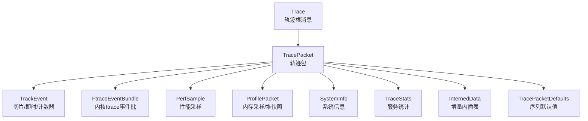
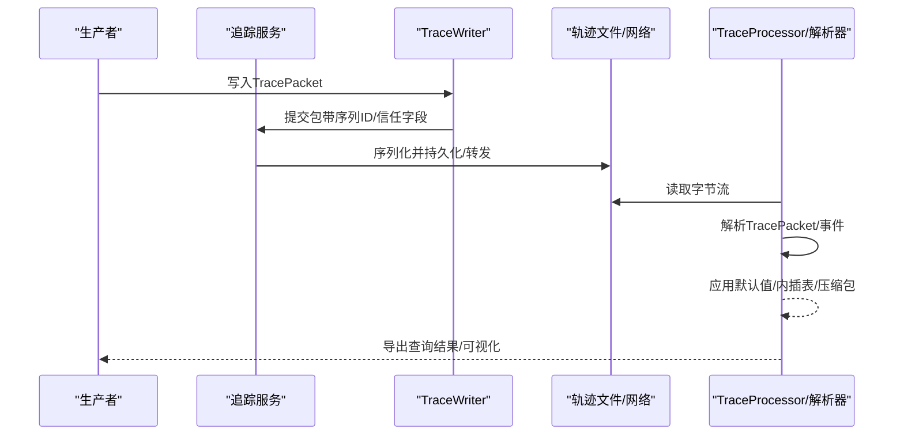
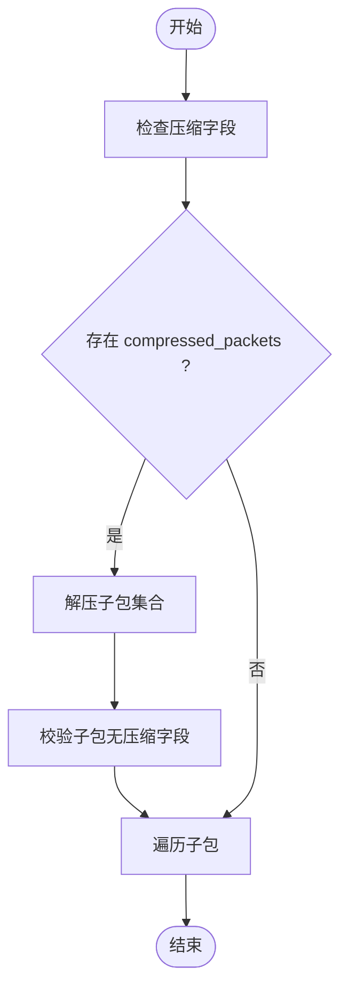
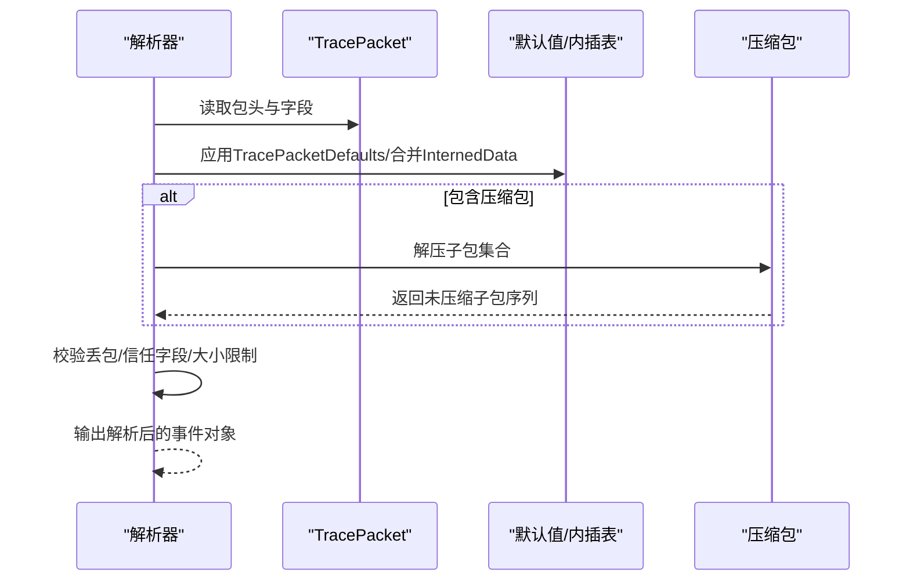
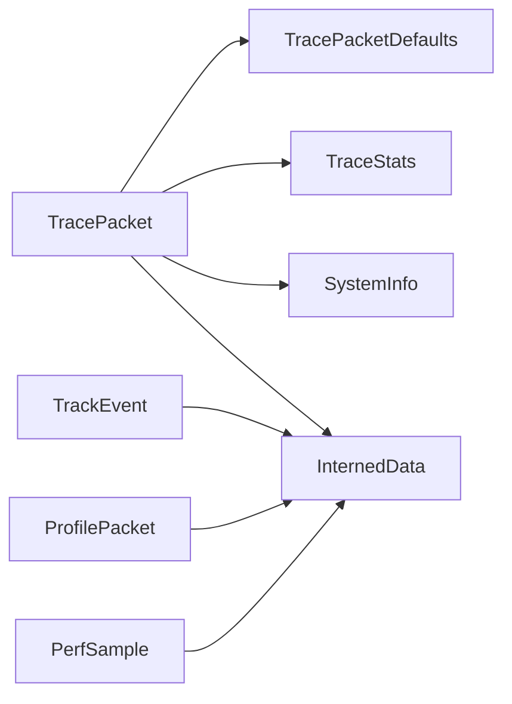

# 轨迹数据协议

<cite>
**本文引用的文件**
- [protos/perfetto/trace/trace.proto](file://protos/perfetto/trace/trace.proto)
- [protos/perfetto/trace/trace_packet.proto](file://protos/perfetto/trace/trace_packet.proto)
- [protos/perfetto/trace/track_event/track_event.proto](file://protos/perfetto/trace/track_event/track_event.proto)
- [protos/perfetto/trace/ftrace/ftrace_event_bundle.proto](file://protos/perfetto/trace/ftrace/ftrace_event_bundle.proto)
- [protos/perfetto/trace/profiling/profile_packet.proto](file://protos/perfetto/trace/profiling/profile_packet.proto)
- [protos/perfetto/common/system_info.proto](file://protos/perfetto/common/system_info.proto)
- [protos/perfetto/common/trace_stats.proto](file://protos/perfetto/common/trace_stats.proto)
- [protos/perfetto/trace/interned_data/interned_data.proto](file://protos/perfetto/trace/interned_data/interned_data.proto)
- [protos/perfetto/trace/trace_packet_defaults.proto](file://protos/perfetto/trace/trace_packet_defaults.proto)
- [include/perfetto/ext/tracing/core/trace_packet.h](file://include/perfetto/ext/tracing/core/trace_packet.h)
- [src/traceconv/utils.cc](file://src/traceconv/utils.cc)
- [src/trace_processor/read_trace_integrationtest.cc](file://src/trace_processor/read_trace_integrationtest.cc)
- [src/trace_processor/util/zip_reader.cc](file://src/trace_processor/util/zip_reader.cc)
- [src/trace_processor/util/zip_reader.h](file://src/trace_processor/util/zip_reader.h)
</cite>

## 目录
1. [引言](#引言)
2. [项目结构](#项目结构)
3. [核心组件](#核心组件)
4. [架构总览](#架构总览)
5. [详细组件分析](#详细组件分析)
6. [依赖关系分析](#依赖关系分析)
7. [性能考量](#性能考量)
8. [故障排查指南](#故障排查指南)
9. [结论](#结论)
10. [附录](#附录)

## 引言
本规范文档面向Perfetto轨迹数据协议，系统阐述轨迹文件的二进制格式与消息结构，覆盖以下要点：
- 轨迹文件根结构与TracePacket消息模型
- 时间戳编码与时钟域约定
- 事件类型与数据载荷格式（同步/异步/计数器/流事件等）
- 头部信息、元数据与属性
- 压缩与打包机制
- 版本兼容性与迁移策略
- 解析流程与验证规则
- 实际示例与解析代码片段路径

## 项目结构
Perfetto通过Protocol Buffers定义轨迹数据的消息模型，并在运行时以二进制形式序列化为TracePacket列表。核心文件如下：
- 根消息：Trace（包含若干TracePacket）
- 核心包：TracePacket（事件容器，含时间戳、序列标志、增量状态、默认值、压缩包等）
- 事件族：TrackEvent（切片/即时/计数器）、ftrace事件包、性能采样（PerfSample）、内存采样（ProfilePacket）等
- 元数据：SystemInfo、TraceStats、InternedData、TracePacketDefaults
- 工具链：压缩写入与解压工具、ZIP读取器

图表来源
- [protos/perfetto/trace/trace.proto:23-31](file://protos/perfetto/trace/trace.proto#L23-L31)
- [protos/perfetto/trace/trace_packet.proto:121-415](file://protos/perfetto/trace/trace_packet.proto#L121-L415)
- [protos/perfetto/trace/track_event/track_event.proto:107-500](file://protos/perfetto/trace/track_event/track_event.proto#L107-L500)
- [protos/perfetto/trace/ftrace/ftrace_event_bundle.proto:27-154](file://protos/perfetto/trace/ftrace/ftrace_event_bundle.proto#L27-L154)
- [protos/perfetto/trace/profiling/profile_packet.proto:76-212](file://protos/perfetto/trace/profiling/profile_packet.proto#L76-L212)
- [protos/perfetto/common/system_info.proto:29-93](file://protos/perfetto/common/system_info.proto#L29-L93)
- [protos/perfetto/common/trace_stats.proto:24-257](file://protos/perfetto/common/trace_stats.proto#L24-L257)
- [protos/perfetto/trace/interned_data/interned_data.proto:61-163](file://protos/perfetto/trace/interned_data/interned_data.proto#L61-L163)
- [protos/perfetto/trace/trace_packet_defaults.proto:32-44](file://protos/perfetto/trace/trace_packet_defaults.proto#L32-L44)

章节来源
- [protos/perfetto/trace/trace.proto:23-31](file://protos/perfetto/trace/trace.proto#L23-L31)
- [protos/perfetto/trace/trace_packet.proto:121-415](file://protos/perfetto/trace/trace_packet.proto#L121-L415)

## 核心组件
- 轨迹根消息：Trace，包含重复的TracePacket字段，用于文件保存场景；流式传输中也可直接发送TracePacket。
- TracePacket：线性序列中的最小单元，包含时间戳、时钟域、序列标志、增量状态、默认值、压缩包、扩展描述等。
- 事件族：
  - TrackEvent：切片（开始/结束）、即时事件、计数器事件，支持流连接、关联ID、调用栈、调试注解等。
  - FtraceEventBundle：Linux内核ftrace事件批，支持紧凑编码、时钟对齐、错误记录等。
  - PerfSample：基于perf_event_open的采样，包含CPU/进程/线程、计数器、可选调用栈、跳过/丢失标记。
  - ProfilePacket：内存采样/堆快照，包含映射/帧/调用栈、进程堆样本、直方图、统计信息等。

章节来源
- [protos/perfetto/trace/trace.proto:23-31](file://protos/perfetto/trace/trace.proto#L23-L31)
- [protos/perfetto/trace/trace_packet.proto:121-415](file://protos/perfetto/trace/trace_packet.proto#L121-L415)
- [protos/perfetto/trace/track_event/track_event.proto:107-500](file://protos/perfetto/trace/track_event/track_event.proto#L107-L500)
- [protos/perfetto/trace/ftrace/ftrace_event_bundle.proto:27-154](file://protos/perfetto/trace/ftrace/ftrace_event_bundle.proto#L27-L154)
- [protos/perfetto/trace/profiling/profile_packet.proto:76-212](file://protos/perfetto/trace/profiling/profile_packet.proto#L76-L212)

## 架构总览
下图展示从生产到消费的关键交互：生产者生成TracePacket，服务端/消费者按需解析，TraceProcessor进行导入与查询。

图表来源
- [protos/perfetto/trace/trace_packet.proto:121-415](file://protos/perfetto/trace/trace_packet.proto#L121-L415)
- [src/traceconv/utils.cc:140-160](file://src/traceconv/utils.cc#L140-L160)
- [src/trace_processor/read_trace_integrationtest.cc:65-83](file://src/trace_processor/read_trace_integrationtest.cc#L65-L83)

## 详细组件分析

### TracePacket 消息结构与字段语义
- 时间戳与时钟域
  - timestamp：包的时间戳，默认使用跟踪时钟（Android上为CLOCK_BOOTTIME），可通过timestamp_clock_id覆盖。
  - timestamp_clock_id：指定clock域ID，支持内置时钟或生产者自定义ID。
- 序列控制与增量状态
  - sequence_flags：SEQ_INCREMENTAL_STATE_CLEARED/SEQ_NEEDS_INCREMENTAL_STATE等，指示增量状态重置与依赖。
  - trace_packet_defaults：序列默认值，覆盖后续包字段。
  - interned_data：同一序列内的增量内插表。
  - previous_packet_dropped/first_packet_on_sequence：丢包检测与首次包标识。
  - machine_id：多机会话中的机器标识。
- 数据载荷
  - data字段为oneof，包含多种事件类型（TrackEvent、FtraceEventBundle、PerfSample、ProfilePacket、Chrome事件、GPU事件、系统信息等）。
  - synchronization_marker：周期性同步标记，便于分区。
  - compressed_packets：压缩的TracePacket集合（每个子包大小限制）。
  - extension_descriptor：扩展协议描述，支持反射反序列化。
- 可信字段
  - trusted_uid/trusted_pid/trusted_packet_sequence_id：由服务写入，用于安全与溯源。

章节来源
- [protos/perfetto/trace/trace_packet.proto:137-415](file://protos/perfetto/trace/trace_packet.proto#L137-L415)

### 时间戳编码与时钟同步
- 默认时钟域为CLOCK_BOOTTIME（Android），可通过ClockSnapshot与timestamp_clock_id调整。
- ftrace事件包支持ftrace_clock与boot_timestamp配对，实现跨时钟域对齐。
- 时钟域与单位可在TracePacketDefaults中统一设定，避免重复声明。

章节来源
- [protos/perfetto/trace/trace_packet.proto:137-151](file://protos/perfetto/trace/trace_packet.proto#L137-L151)
- [protos/perfetto/trace/ftrace/ftrace_event_bundle.proto:69-101](file://protos/perfetto/trace/ftrace/ftrace_event_bundle.proto#L69-L101)

### 事件类型与数据载荷

#### 同步/异步事件（TrackEvent）
- 类型
  - 切片：TYPE_SLICE_BEGIN/END成对出现，支持嵌套。
  - 即时：TYPE_INSTANT，可作为事件点。
  - 计数器：TYPE_COUNTER，绑定计数器轨道，携带整数/双精度计数器值。
- 关联与优化
  - track_uuid：事件归属的轨道。
  - extra_counter_values/extra_counter_track_uuids：批量附加计数器值。
  - flow_ids/terminating_flow_ids：跨事件/跨轨道的流连接。
  - correlation_id系列：逻辑操作集关联。
  - 调用栈/调试注解/源位置等，均支持内插以降低体积。

章节来源
- [protos/perfetto/trace/track_event/track_event.proto:131-500](file://protos/perfetto/trace/track_event/track_event.proto#L131-L500)

#### ftrace 事件批（FtraceEventBundle）
- 承载来自各CPU核的ftrace事件页，支持：
  - 事件列表、丢包标记lost_events。
  - CompactSched：调度事件的结构化数组紧凑编码（delta时间戳、状态、PID、优先级、comm索引）。
  - ftrace_clock/boot_timestamp配对，实现跨时钟域对齐。
  - 错误记录与最后有效时间戳字段，辅助处理环形缓冲覆盖问题。

章节来源
- [protos/perfetto/trace/ftrace/ftrace_event_bundle.proto:27-154](file://protos/perfetto/trace/ftrace/ftrace_event_bundle.proto#L27-L154)

#### 性能采样（PerfSample）
- 字段含义
  - cpu/pid/tid：采样上下文。
  - timebase_count/follower_counts：基准计数器与跟随计数器值。
  - callstack_iid：可选调用栈内插ID。
  - unwind_error：栈展开错误码。
  - kernel_records_lost：内核环形缓冲记录丢失指示。
  - sample_skipped_reason：采样被跳过的理由。
  - producer_event：采样实现中的显著事件（如停止原因）。
- 默认值
  - PerfSampleDefaults：时间基、跟随事件描述、进程分桶信息等。

章节来源
- [protos/perfetto/trace/profiling/profile_packet.proto:295-372](file://protos/perfetto/trace/profiling/profile_packet.proto#L295-L372)

#### 内存采样/堆快照（ProfilePacket）
- 结构
  - ProcessHeapSamples：进程与堆标识、堆样本、内部统计。
  - HeapSample：调用栈ID、分配/释放字节数、样本计数、最大时刻统计等。
  - Histogram：直方图桶定义与计数。
  - continued/index：跨包续传与序号，用于检测丢包。
- 内插表
  - InternedString/Mappings/Frames/Callstacks：跨包复用，减少冗余。

章节来源
- [protos/perfetto/trace/profiling/profile_packet.proto:76-212](file://protos/perfetto/trace/profiling/profile_packet.proto#L76-L212)
- [protos/perfetto/trace/interned_data/interned_data.proto:61-163](file://protos/perfetto/trace/interned_data/interned_data.proto#L61-L163)

### 头部信息、元数据与属性
- SystemInfo：系统名称、构建指纹、设备厂商/SoC/存储/RAM信息、SDK版本、页大小、CPU数、时区偏移、RAM大小等。
- TraceStats：缓冲区统计（写入/覆盖/读取、块数、补丁成功率、乱序提交次数等）、写者统计（块负载直方图）、过滤器统计、刷新请求与结果等。
- TraceAttributes：键值对元数据，UI与TraceProcessor中以trace_attribute.*呈现。
- InternedData：增量内插表，涵盖事件名/类别、函数名、源路径、映射、帧、调用栈、图形上下文、V8字符串、Protolog字符串等。

章节来源
- [protos/perfetto/common/system_info.proto:29-93](file://protos/perfetto/common/system_info.proto#L29-L93)
- [protos/perfetto/common/trace_stats.proto:24-257](file://protos/perfetto/common/trace_stats.proto#L24-L257)
- [protos/perfetto/trace/interned_data/interned_data.proto:61-163](file://protos/perfetto/trace/interned_data/interned_data.proto#L61-L163)

### 压缩与打包机制
- 压缩包字段
  - TracePacket.compressed_packets：包含零个或多个压缩的TracePacket，每个子包大小限制。
- 生产端压缩
  - DeflateTraceWriter：使用zlib deflate进行增量压缩，达到缓冲阈值后刷新。
- 消费端解压
  - Decoding测试：读取压缩轨迹，解压后逐包校验不再包含压缩包字段。
  - ZIP读取：ZipReader支持增量解析ZIP文件中的压缩轨迹条目，忽略末尾中心目录。

图表来源
- [protos/perfetto/trace/trace_packet.proto:234-237](file://protos/perfetto/trace/trace_packet.proto#L234-L237)
- [src/traceconv/utils.cc:140-160](file://src/traceconv/utils.cc#L140-L160)
- [src/trace_processor/read_trace_integrationtest.cc:65-83](file://src/trace_processor/read_trace_integrationtest.cc#L65-L83)
- [src/trace_processor/util/zip_reader.cc:255-286](file://src/trace_processor/util/zip_reader.cc#L255-L286)
- [src/trace_processor/util/zip_reader.h:134-163](file://src/trace_processor/util/zip_reader.h#L134-L163)

章节来源
- [protos/perfetto/trace/trace_packet.proto:234-237](file://protos/perfetto/trace/trace_packet.proto#L234-L237)
- [src/traceconv/utils.cc:140-160](file://src/traceconv/utils.cc#L140-L160)
- [src/trace_processor/read_trace_integrationtest.cc:65-83](file://src/trace_processor/read_trace_integrationtest.cc#L65-L83)
- [src/trace_processor/util/zip_reader.cc:255-286](file://src/trace_processor/util/zip_reader.cc#L255-L286)
- [src/trace_processor/util/zip_reader.h:134-163](file://src/trace_processor/util/zip_reader.h#L134-L163)

### 版本兼容性与迁移策略
- 字段保留与oneof设计：大量oneof字段与reserved区域确保向后兼容。
- InternedData迁移：ProfilePacket在旧版Android Q仍使用包内内插表，新版本迁移到序列内共享的InternedData。
- 事件类型演进：TrackEvent/Profiling等消息持续扩展，但保持稳定公共API的字段不变。
- 默认值与增量状态：TracePacketDefaults/SequenceFlags保证在丢包或状态重置后仍可正确重建上下文。

章节来源
- [protos/perfetto/trace/trace_packet.proto:121-415](file://protos/perfetto/trace/trace_packet.proto#L121-L415)
- [protos/perfetto/trace/profiling/profile_packet.proto:76-87](file://protos/perfetto/trace/profiling/profile_packet.proto#L76-L87)
- [protos/perfetto/trace/trace_packet_defaults.proto:32-44](file://protos/perfetto/trace/trace_packet_defaults.proto#L32-L44)

### 解析流程与验证规则
- 解析步骤
  - 读取字节流，识别TracePacket边界。
  - 解析TracePacket：应用TracePacketDefaults、合并InternedData、处理压缩包。
  - 针对具体事件类型（TrackEvent、PerfSample、FtraceEventBundle等）进行细化解析。
- 验证规则
  - 丢包检测：previous_packet_dropped与SEQ_INCREMENTAL_STATE_CLEARED配合，确保增量数据一致性。
  - 信任字段：trusted_uid/trusted_pid/trusted_packet_sequence_id用于安全与溯源。
  - 子包大小限制：compressed_packets中每个TracePacket大小上限约束。
  - ZIP条目完整性：ZipReader解析时校验签名与长度。

图表来源
- [protos/perfetto/trace/trace_packet.proto:342-415](file://protos/perfetto/trace/trace_packet.proto#L342-L415)
- [protos/perfetto/trace/trace_packet_defaults.proto:32-44](file://protos/perfetto/trace/trace_packet_defaults.proto#L32-L44)
- [src/trace_processor/read_trace_integrationtest.cc:65-83](file://src/trace_processor/read_trace_integrationtest.cc#L65-L83)

章节来源
- [protos/perfetto/trace/trace_packet.proto:342-415](file://protos/perfetto/trace/trace_packet.proto#L342-L415)
- [protos/perfetto/trace/trace_packet_defaults.proto:32-44](file://protos/perfetto/trace/trace_packet_defaults.proto#L32-L44)
- [src/trace_processor/read_trace_integrationtest.cc:65-83](file://src/trace_processor/read_trace_integrationtest.cc#L65-L83)

### 实际示例与解析代码片段
- 示例轨迹文件
  - 测试用例中包含压缩的示例轨迹文件，解析后应确认不再包含压缩字段。
  - 参考路径：[src/trace_processor/read_trace_integrationtest.cc:65-83](file://src/trace_processor/read_trace_integrationtest.cc#L65-L83)
- 压缩写入
  - 使用zlib deflate进行增量压缩，缓冲满则刷新。
  - 参考路径：[src/traceconv/utils.cc:140-160](file://src/traceconv/utils.cc#L140-L160)
- ZIP读取
  - 增量解析ZIP文件中的压缩轨迹条目，支持任意分块读取。
  - 参考路径：[src/trace_processor/util/zip_reader.h:134-163](file://src/trace_processor/util/zip_reader.h#L134-L163)，[src/trace_processor/util/zip_reader.cc:255-286](file://src/trace_processor/util/zip_reader.cc#L255-L286)
- C++包装类
  - TracePacket封装原始字节切片，支持生成proto前导、拼接原始字节等。
  - 参考路径：[include/perfetto/ext/tracing/core/trace_packet.h:39-112](file://include/perfetto/ext/tracing/core/trace_packet.h#L39-L112)

章节来源
- [src/trace_processor/read_trace_integrationtest.cc:65-83](file://src/trace_processor/read_trace_integrationtest.cc#L65-L83)
- [src/traceconv/utils.cc:140-160](file://src/traceconv/utils.cc#L140-L160)
- [src/trace_processor/util/zip_reader.h:134-163](file://src/trace_processor/util/zip_reader.h#L134-L163)
- [src/trace_processor/util/zip_reader.cc:255-286](file://src/trace_processor/util/zip_reader.cc#L255-L286)
- [include/perfetto/ext/tracing/core/trace_packet.h:39-112](file://include/perfetto/ext/tracing/core/trace_packet.h#L39-L112)

## 依赖关系分析
- 协议依赖
  - TracePacket依赖SystemInfo、TraceStats、InternedData、TracePacketDefaults等。
  - TrackEvent依赖InternedData中的名称/类别/调用栈等。
  - PerfSample/ProfilePacket依赖通用的映射/帧/调用栈内插表。
- 运行时依赖
  - TracePacket包装类仅在需要时解码，避免对libprotobuf的强依赖。
  - 压缩/解压与ZIP读取器独立模块化，便于替换与裁剪。

图表来源
- [protos/perfetto/trace/trace_packet.proto:121-415](file://protos/perfetto/trace/trace_packet.proto#L121-L415)
- [protos/perfetto/common/system_info.proto:29-93](file://protos/perfetto/common/system_info.proto#L29-L93)
- [protos/perfetto/common/trace_stats.proto:24-257](file://protos/perfetto/common/trace_stats.proto#L24-L257)
- [protos/perfetto/trace/interned_data/interned_data.proto:61-163](file://protos/perfetto/trace/interned_data/interned_data.proto#L61-L163)
- [protos/perfetto/trace/trace_packet_defaults.proto:32-44](file://protos/perfetto/trace/trace_packet_defaults.proto#L32-L44)
- [protos/perfetto/trace/track_event/track_event.proto:107-500](file://protos/perfetto/trace/track_event/track_event.proto#L107-L500)
- [protos/perfetto/trace/profiling/profile_packet.proto:76-212](file://protos/perfetto/trace/profiling/profile_packet.proto#L76-L212)

章节来源
- [protos/perfetto/trace/trace_packet.proto:121-415](file://protos/perfetto/trace/trace_packet.proto#L121-L415)
- [protos/perfetto/trace/track_event/track_event.proto:107-500](file://protos/perfetto/trace/track_event/track_event.proto#L107-L500)
- [protos/perfetto/trace/profiling/profile_packet.proto:76-212](file://protos/perfetto/trace/profiling/profile_packet.proto#L76-L212)
- [protos/perfetto/trace/interned_data/interned_data.proto:61-163](file://protos/perfetto/trace/interned_data/interned_data.proto#L61-L163)

## 性能考量
- 内插表与增量状态：通过InternedData与TracePacketDefaults减少重复字段，显著降低体积。
- 紧凑编码：FtraceEventBundle的CompactSched采用结构化数组与delta编码，提升批处理效率。
- 压缩策略：compressed_packets与DeflateTraceWriter结合，按需压缩子包，避免一次性大包导致内存峰值。
- 丢包恢复：通过SEQ_INCREMENTAL_STATE_CLEARED与previous_packet_dropped定位重置点，减少无效解析成本。

## 故障排查指南
- 丢包与增量状态
  - 现象：解析到SEQ_INCREMENTAL_STATE_CLEARED前的内插数据不可用。
  - 排查：检查previous_packet_dropped与序列标志，定位重置点。
- 压缩包异常
  - 现象：子包过大或仍包含压缩字段。
  - 排查：确认compressed_packets子包大小限制与解压流程。
- ZIP条目缺失
  - 现象：ZipReader无法完整解析ZIP文件。
  - 排查：检查签名、长度与增量解析状态。

章节来源
- [protos/perfetto/trace/trace_packet.proto:342-415](file://protos/perfetto/trace/trace_packet.proto#L342-L415)
- [src/trace_processor/read_trace_integrationtest.cc:65-83](file://src/trace_processor/read_trace_integrationtest.cc#L65-L83)
- [src/trace_processor/util/zip_reader.cc:255-286](file://src/trace_processor/util/zip_reader.cc#L255-L286)

## 结论
Perfetto轨迹数据协议以TracePacket为核心，通过oneof事件载荷、内插表、默认值与压缩机制，实现了高吞吐、低冗余与强兼容性的轨迹文件格式。遵循本文档的解析与验证规则，可稳定地处理多来源、多类型的轨迹事件，并在多机/多时钟域场景下保持一致性与可追溯性。

## 附录
- 关键消息与字段参考
  - TracePacket：时间戳、时钟域、序列标志、增量状态、默认值、压缩包、扩展描述、可信字段
  - TrackEvent：切片/即时/计数器、流/关联ID、调用栈、调试注解
  - FtraceEventBundle：事件批、紧凑编码、时钟对齐、错误记录
  - PerfSample：计数器/调用栈/跳过/丢失标记、默认值
  - ProfilePacket：进程堆样本、直方图、统计、内插表
  - SystemInfo/TraceStats/InternedData/TraceAttributes：元数据与统计