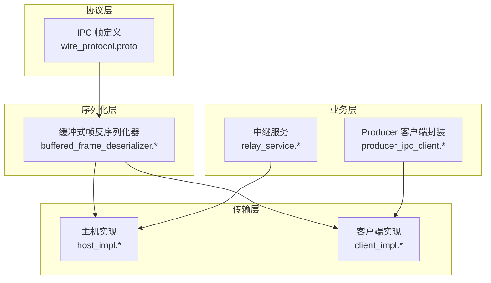
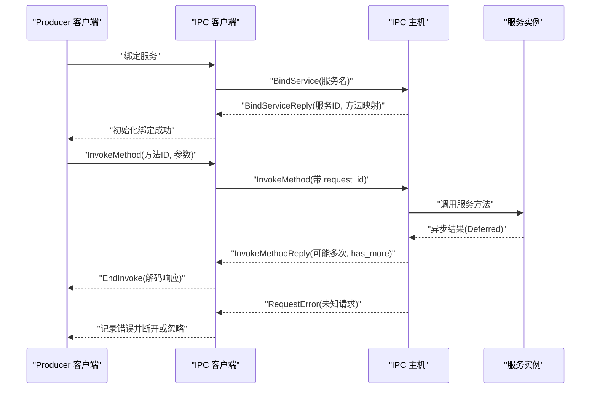
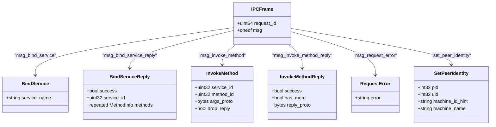
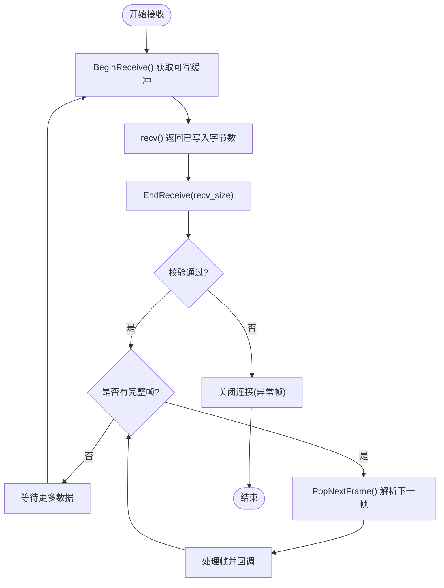
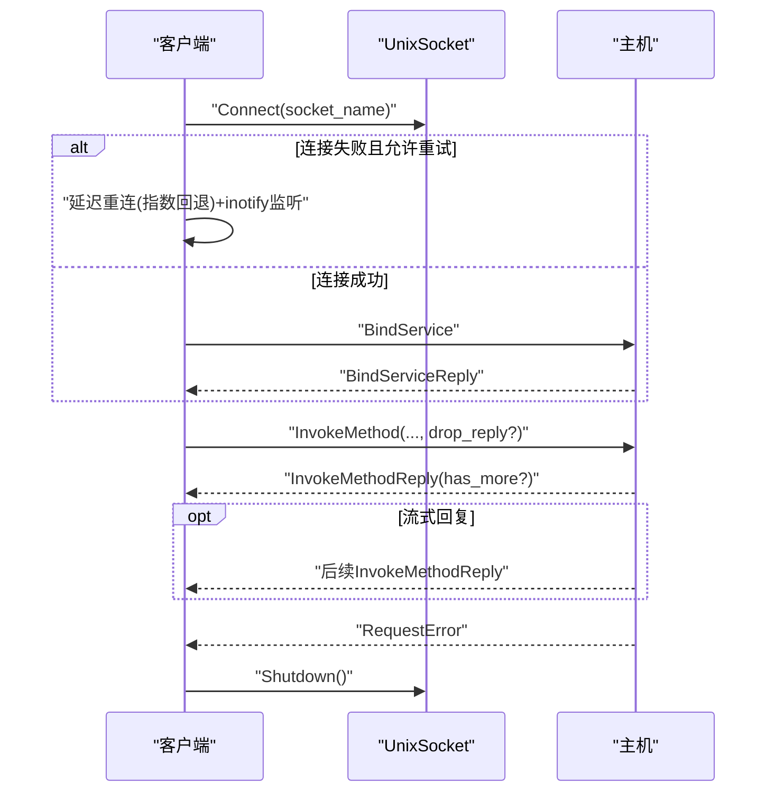
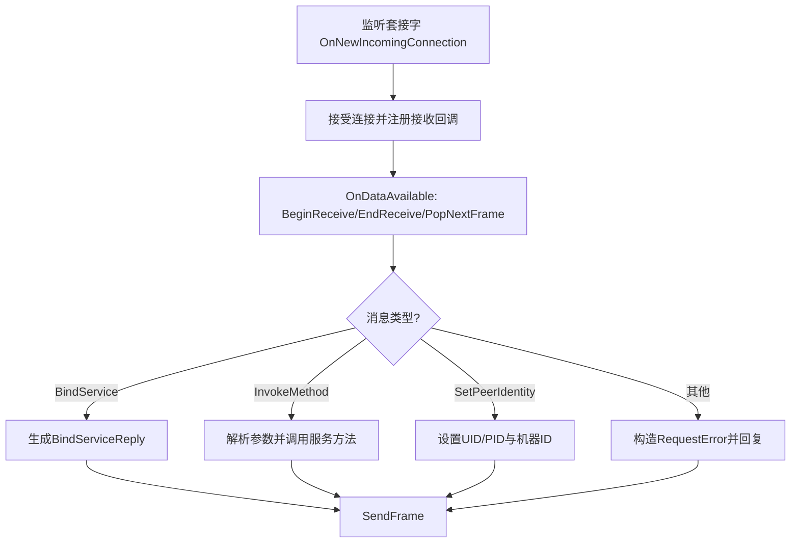
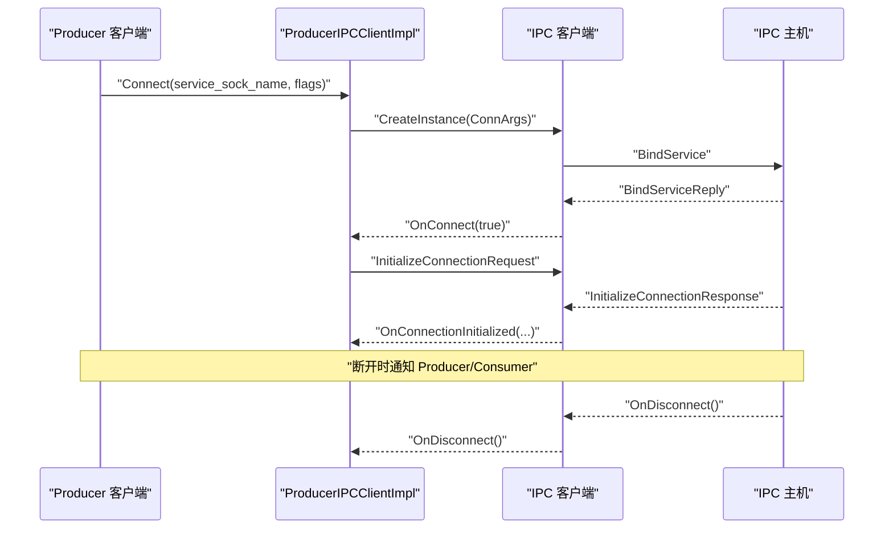
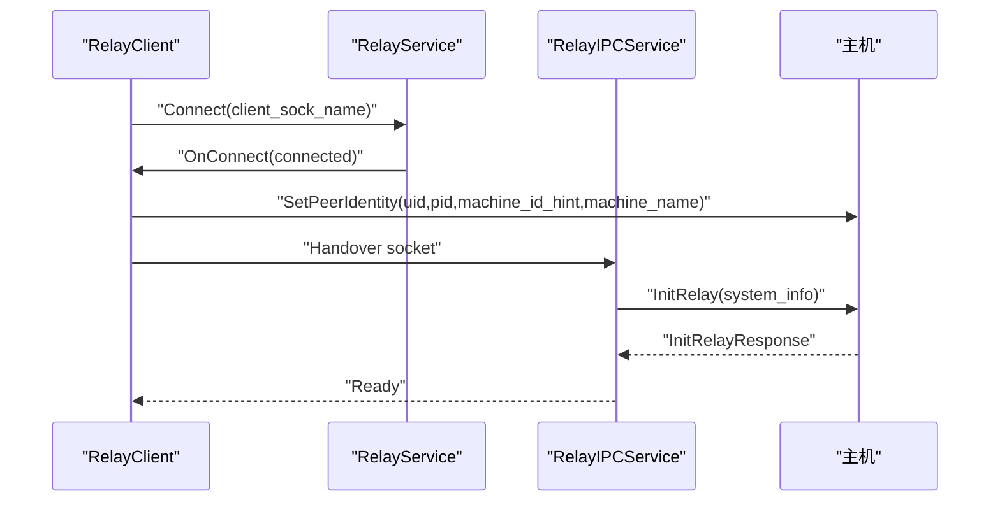
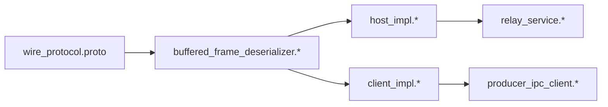

# 进程间通信协议

<cite>
**本文引用的文件**
- [wire_protocol.proto](file://protos/perfetto/ipc/wire_protocol.proto)
- [buffered_frame_deserializer.h](file://src/ipc/buffered_frame_deserializer.h)
- [buffered_frame_deserializer.cc](file://src/ipc/buffered_frame_deserializer.cc)
- [buffered_frame_deserializer_unittest.cc](file://src/ipc/buffered_frame_deserializer_unittest.cc)
- [client_impl.h](file://src/ipc/client_impl.h)
- [client_impl.cc](file://src/ipc/client_impl.cc)
- [host_impl.h](file://src/ipc/host_impl.h)
- [host_impl.cc](file://src/ipc/host_impl.cc)
- [producer_ipc_client.h](file://include/perfetto/ext/tracing/ipc/producer_ipc_client.h)
- [producer_ipc_client_impl.cc](file://src/tracing/ipc/producer/producer_ipc_client_impl.cc)
- [tracing_integration_test.cc](file://src/tracing/test/tracing_integration_test.cc)
- [relay_service.h](file://src/traced_relay/relay_service.h)
- [relay_service.cc](file://src/traced_relay/relay_service.cc)
- [relay_ipc_service.cc](file://src/tracing/ipc/service/relay_ipc_service.cc)
- [socket_relay_handler_unittest.cc](file://src/traced_relay/socket_relay_handler_unittest.cc)
- [unix_socket_unittest.cc](file://src/base/unix_socket_unittest.cc)
</cite>

## 目录
1. [简介](#简介)
2. [项目结构](#项目结构)
3. [核心组件](#核心组件)
4. [架构总览](#架构总览)
5. [详细组件分析](#详细组件分析)
6. [依赖关系分析](#依赖关系分析)
7. [性能考量](#性能考量)
8. [故障排查指南](#故障排查指南)
9. [结论](#结论)
10. [附录](#附录)

## 简介
本文件系统性地定义 Perfetto 的进程间通信（IPC）协议规范，覆盖 Producer-Consumer 通信模型、端口建立、消息传递与连接管理、消息类型与序列化格式、帧结构与协议头部字段、安全机制（身份认证、授权与数据加密）、连接重试策略与错误恢复、超时处理，以及网络拓扑支持（本地、远程与代理模式）。文档同时提供客户端与服务端实现指南与最佳实践，帮助开发者正确集成与扩展 Perfetto IPC。

## 项目结构
Perfetto 的 IPC 协议由以下层次构成：
- 协议层：定义 IPC 帧结构与消息类型（wire_protocol.proto）
- 序列化层：帧头 + Protobuf 消息的缓冲式反序列化（buffered_frame_deserializer.*）
- 传输层：基于 Unix/TCP/vsock 的流式套接字（host_impl.*, client_impl.*）
- 业务层：Producer/Consumer 与 Relay 客户端封装（producer_ipc_client.*、relay_service.*）

**图表来源**
- [wire_protocol.proto:21-114](file://protos/perfetto/ipc/wire_protocol.proto#L21-L114)
- [buffered_frame_deserializer.h:41-82](file://src/ipc/buffered_frame_deserializer.h#L41-L82)
- [client_impl.h:48-71](file://src/ipc/client_impl.h#L48-L71)
- [host_impl.h:39-59](file://src/ipc/host_impl.h#L39-L59)
- [producer_ipc_client.h:37-64](file://include/perfetto/ext/tracing/ipc/producer_ipc_client.h#L37-L64)
- [relay_service.h:36-64](file://src/traced_relay/relay_service.h#L36-L64)

**章节来源**
- [wire_protocol.proto:1-115](file://protos/perfetto/ipc/wire_protocol.proto#L1-L115)
- [buffered_frame_deserializer.h:1-142](file://src/ipc/buffered_frame_deserializer.h#L1-L142)
- [client_impl.h:1-121](file://src/ipc/client_impl.h#L1-L121)
- [host_impl.h:1-128](file://src/ipc/host_impl.h#L1-L128)
- [producer_ipc_client.h:37-64](file://include/perfetto/ext/tracing/ipc/producer_ipc_client.h#L37-L64)
- [relay_service.h:36-64](file://src/traced_relay/relay_service.h#L36-L64)

## 核心组件
- IPC 帧与消息类型：定义了绑定服务、调用方法、错误、设置对端身份等消息体
- 缓冲式帧反序列化器：负责按帧头长度切分与拼接接收数据，保证帧完整性与内存连续性
- 客户端与主机实现：分别负责连接、发送/接收、请求排队与回复匹配、错误处理与重连
- Producer/Consumer 封装：面向上层的数据源与消费者接口，屏蔽底层 IPC 细节
- 中继服务：在远程/代理场景下桥接本地与远端 traced

**章节来源**
- [wire_protocol.proto:21-114](file://protos/perfetto/ipc/wire_protocol.proto#L21-L114)
- [buffered_frame_deserializer.h:41-136](file://src/ipc/buffered_frame_deserializer.h#L41-L136)
- [client_impl.cc:144-155](file://src/ipc/client_impl.cc#L144-L155)
- [host_impl.cc:398-425](file://src/ipc/host_impl.cc#L398-L425)
- [producer_ipc_client.h:37-64](file://include/perfetto/ext/tracing/ipc/producer_ipc_client.h#L37-L64)
- [relay_service.cc:154-168](file://src/traced_relay/relay_service.cc#L154-L168)

## 架构总览
下面以序列图展示典型 Producer-Consumer 通信流程（含握手、方法调用与错误处理）：

**图表来源**
- [client_impl.cc:86-108](file://src/ipc/client_impl.cc#L86-L108)
- [host_impl.cc:280-348](file://src/ipc/host_impl.cc#L280-L348)
- [wire_protocol.proto:21-114](file://protos/perfetto/ipc/wire_protocol.proto#L21-L114)

## 详细组件分析

### 协议与帧结构
- 帧头：固定 32 位小端无符号整数，表示帧体（Protobuf IPCFrame）长度
- 帧体：Protobuf IPCFrame，oneof 内含多种消息类型
- request_id：单调递增，用于匹配请求与回复；流式 RPC 可能多次回复同一 request_id
- 消息类型：
  - BindService/BindServiceReply：服务发现与方法映射
  - InvokeMethod/InvokeMethodReply：方法调用与回复，支持 drop_reply 与 has_more
  - RequestError：主机返回的错误
  - SetPeerIdentity：在非 AF_UNIX 场景下设置对端 UID/PID 与机器标识

**图表来源**
- [wire_protocol.proto:21-114](file://protos/perfetto/ipc/wire_protocol.proto#L21-L114)

**章节来源**
- [wire_protocol.proto:21-114](file://protos/perfetto/ipc/wire_protocol.proto#L21-L114)
- [buffered_frame_deserializer.cc:32-42](file://src/ipc/buffered_frame_deserializer.cc#L32-L42)

### 序列化与反序列化
- 发送侧：将 IPCFrame 序列化为字符串，前置 4 字节长度后发送
- 接收侧：使用缓冲式反序列化器按帧头长度拼接数据，支持零拷贝连续内存，避免散页复制
- 边界保护：限制最大缓存容量，拒绝异常大帧；支持多帧粘包与拆包恢复

**图表来源**
- [buffered_frame_deserializer.h:61-82](file://src/ipc/buffered_frame_deserializer.h#L61-L82)
- [buffered_frame_deserializer.cc:38-42](file://src/ipc/buffered_frame_deserializer.cc#L38-L42)
- [buffered_frame_deserializer_unittest.cc:174-246](file://src/ipc/buffered_frame_deserializer_unittest.cc#L174-L246)

**章节来源**
- [buffered_frame_deserializer.h:41-136](file://src/ipc/buffered_frame_deserializer.h#L41-L136)
- [buffered_frame_deserializer.cc:32-42](file://src/ipc/buffered_frame_deserializer.cc#L32-L42)
- [buffered_frame_deserializer_unittest.cc:1-347](file://src/ipc/buffered_frame_deserializer_unittest.cc#L1-L347)

### 客户端实现（Producer/Relay 使用）
- 连接与重连：支持指数回退与 inotify 事件触发的延迟重连
- 请求队列：按 request_id 跟踪未完成请求，匹配回复
- 方法调用：支持 drop_reply（无需回复）与 has_more（流式回复）
- 错误处理：收到 RequestError 或帧过大时断开连接

**图表来源**
- [client_impl.cc:77-84](file://src/ipc/client_impl.cc#L77-L84)
- [client_impl.cc:157-210](file://src/ipc/client_impl.cc#L157-L210)
- [client_impl.cc:114-142](file://src/ipc/client_impl.cc#L114-L142)
- [client_impl.cc:262-289](file://src/ipc/client_impl.cc#L262-L289)

**章节来源**
- [client_impl.h:48-115](file://src/ipc/client_impl.h#L48-L115)
- [client_impl.cc:77-210](file://src/ipc/client_impl.cc#L77-L210)
- [client_impl.cc:235-260](file://src/ipc/client_impl.cc#L235-L260)
- [client_impl.cc:262-352](file://src/ipc/client_impl.cc#L262-L352)

### 主机实现（Consumer/Relay 服务端）
- 监听与接入：支持从监听套接字接入新连接，设置发送超时
- 身份识别：AF_UNIX 使用 SO_PEERCRED；非 AF_UNIX 使用 SetPeerIdentity 设置 UID/PID 与机器标识
- 服务暴露：根据服务名返回服务 ID 与方法映射
- 方法分发：解析参数，调用服务方法，异步返回结果
- 错误处理：未知请求返回 RequestError；帧过大断开

**图表来源**
- [host_impl.cc:216-230](file://src/ipc/host_impl.cc#L216-L230)
- [host_impl.cc:232-262](file://src/ipc/host_impl.cc#L232-L262)
- [host_impl.cc:264-278](file://src/ipc/host_impl.cc#L264-L278)
- [host_impl.cc:280-348](file://src/ipc/host_impl.cc#L280-L348)
- [host_impl.cc:350-371](file://src/ipc/host_impl.cc#L350-L371)

**章节来源**
- [host_impl.h:39-122](file://src/ipc/host_impl.h#L39-L122)
- [host_impl.cc:216-278](file://src/ipc/host_impl.cc#L216-L278)
- [host_impl.cc:350-371](file://src/ipc/host_impl.cc#L350-L371)

### Producer-Consumer 通信模型
- Producer 作为客户端，绑定服务后发起方法调用；Consumer 作为服务端暴露服务并处理调用
- Producer 端提供连接标志位控制是否无限重试；连接成功后进行握手与初始化
- Consumer 端在连接断开时通知所有已绑定的服务

**图表来源**
- [producer_ipc_client.h:37-64](file://include/perfetto/ext/tracing/ipc/producer_ipc_client.h#L37-L64)
- [producer_ipc_client_impl.cc:127-187](file://src/tracing/ipc/producer/producer_ipc_client_impl.cc#L127-L187)
- [tracing_integration_test.cc:160-193](file://src/tracing/test/tracing_integration_test.cc#L160-L193)

**章节来源**
- [producer_ipc_client.h:37-64](file://include/perfetto/ext/tracing/ipc/producer_ipc_client.h#L37-L64)
- [producer_ipc_client_impl.cc:127-187](file://src/tracing/ipc/producer/producer_ipc_client_impl.cc#L127-L187)
- [tracing_integration_test.cc:160-193](file://src/tracing/test/tracing_integration_test.cc#L160-L193)

### 中继与代理模式
- RelayClient 在非 AF_UNIX 场景下先发送 SetPeerIdentity，再将套接字交给 RelayIPCClient
- RelayIPCService 维护每个客户端的中继端点，处理 InitRelay/SyncClock 等请求
- SocketRelayHandler 在本地桥接两个套接字，支持双向数据转发与随机化测试

**图表来源**
- [relay_service.h:36-64](file://src/traced_relay/relay_service.h#L36-L64)
- [relay_service.cc:154-168](file://src/traced_relay/relay_service.cc#L154-L168)
- [relay_ipc_service.cc:53-71](file://src/tracing/ipc/service/relay_ipc_service.cc#L53-L71)
- [socket_relay_handler_unittest.cc:58-76](file://src/traced_relay/socket_relay_handler_unittest.cc#L58-L76)

**章节来源**
- [relay_service.h:36-64](file://src/traced_relay/relay_service.h#L36-L64)
- [relay_service.cc:154-168](file://src/traced_relay/relay_service.cc#L154-L168)
- [relay_ipc_service.cc:53-71](file://src/tracing/ipc/service/relay_ipc_service.cc#L53-L71)
- [socket_relay_handler_unittest.cc:58-76](file://src/traced_relay/socket_relay_handler_unittest.cc#L58-L76)

## 依赖关系分析
- wire_protocol.proto 是 IPC 帧的权威定义，被 buffered_frame_deserializer 与 host/client 实现共同依赖
- buffered_frame_deserializer 提供通用的帧边界与内存布局保障，降低上层复杂度
- host_impl 与 client_impl 分别实现服务端与客户端的生命周期、错误处理与重连逻辑
- producer_ipc_client 与 relay_service 作为高层封装，依赖底层 IPC 实现

**图表来源**
- [wire_protocol.proto:21-114](file://protos/perfetto/ipc/wire_protocol.proto#L21-L114)
- [buffered_frame_deserializer.h:41-82](file://src/ipc/buffered_frame_deserializer.h#L41-L82)
- [client_impl.h:48-71](file://src/ipc/client_impl.h#L48-L71)
- [host_impl.h:39-59](file://src/ipc/host_impl.h#L39-L59)
- [producer_ipc_client.h:37-64](file://include/perfetto/ext/tracing/ipc/producer_ipc_client.h#L37-L64)
- [relay_service.h:36-64](file://src/traced_relay/relay_service.h#L36-L64)

**章节来源**
- [wire_protocol.proto:21-114](file://protos/perfetto/ipc/wire_protocol.proto#L21-L114)
- [buffered_frame_deserializer.h:41-82](file://src/ipc/buffered_frame_deserializer.h#L41-L82)
- [client_impl.h:48-71](file://src/ipc/client_impl.h#L48-L71)
- [host_impl.h:39-59](file://src/ipc/host_impl.h#L39-L59)
- [producer_ipc_client.h:37-64](file://include/perfetto/ext/tracing/ipc/producer_ipc_client.h#L37-L64)
- [relay_service.h:36-64](file://src/traced_relay/relay_service.h#L36-L64)

## 性能考量
- 非阻塞发送与背压：当前实现采用阻塞发送以简化逻辑，建议在高负载场景改为非阻塞 I/O 并向调用方传播背压
- 帧缓冲与内存布局：缓冲区按系统页大小对齐，避免散页复制，提升反序列化效率
- 流式 RPC：利用 has_more 减少往返开销，但需注意累积内存占用与超时控制
- 超时与监控：主机端设置发送超时，避免慢生产者导致资源泄漏；客户端重连策略应结合平台能力选择 inotify 或时间轮询

[本节为通用指导，不直接分析具体文件]

## 故障排查指南
- 帧过大或格式错误：反序列化器会拒绝异常帧并触发断开；检查序列化与帧头长度
- 未知请求：主机返回 RequestError，确认服务名与方法 ID 映射是否正确
- 连接失败与重连：启用重试标志后，观察指数回退与 inotify 监听是否生效
- 非 AF_UNIX 身份缺失：在远程/代理场景必须先发送 SetPeerIdentity，否则主机无法识别对端身份
- 断线通知：主机断开时会通知所有已绑定服务，确保上层清理资源

**章节来源**
- [buffered_frame_deserializer_unittest.cc:248-255](file://src/ipc/buffered_frame_deserializer_unittest.cc#L248-L255)
- [host_impl.cc:273-278](file://src/ipc/host_impl.cc#L273-L278)
- [client_impl.cc:164-193](file://src/ipc/client_impl.cc#L164-L193)
- [host_impl.cc:350-371](file://src/ipc/host_impl.cc#L350-L371)
- [host_impl.cc:427-449](file://src/ipc/host_impl.cc#L427-L449)

## 结论
Perfetto 的 IPC 协议以清晰的帧结构与稳健的缓冲反序列化为基础，结合客户端的重连与主机的超时控制，实现了跨本地与远程场景的可靠通信。通过 SetPeerIdentity 与 AF_UNIX SO_PEERCRED 的组合，协议在不同网络拓扑下均能提供一致的身份与授权语义。建议在生产环境中进一步完善非阻塞发送、流控与可观测性，以获得更优的吞吐与稳定性。

[本节为总结性内容，不直接分析具体文件]

## 附录

### 消息类型与字段速查
- BindService：服务名
- BindServiceReply：成功标志、服务 ID、方法列表（名称与 ID）
- InvokeMethod：服务 ID、方法 ID、请求参数、是否丢弃回复
- InvokeMethodReply：成功标志、是否还有更多、回复参数、可携带 FD
- RequestError：错误信息
- SetPeerIdentity：PID、UID、机器 ID 建议值、机器名称

**章节来源**
- [wire_protocol.proto:21-114](file://protos/perfetto/ipc/wire_protocol.proto#L21-L114)

### 端口建立与握手流程
- 客户端连接主机，发送 BindService
- 主机返回 BindServiceReply，建立服务 ID 与方法映射
- 客户端可选择发送 InitializeConnectionRequest（Producer 特有），主机返回 InitializeConnectionResponse

**章节来源**
- [client_impl.cc:86-108](file://src/ipc/client_impl.cc#L86-L108)
- [host_impl.cc:280-299](file://src/ipc/host_impl.cc#L280-L299)
- [producer_ipc_client_impl.cc:177-187](file://src/tracing/ipc/producer/producer_ipc_client_impl.cc#L177-L187)

### 数据传输与流式 RPC
- drop_reply：客户端声明不需要回复，减少往返
- has_more：服务端在流式场景中多次回复同一 request_id
- FD 透传：SendFrame 支持随帧发送文件描述符（特定平台）

**章节来源**
- [wire_protocol.proto:49-65](file://protos/perfetto/ipc/wire_protocol.proto#L49-L65)
- [host_impl.cc:398-425](file://src/ipc/host_impl.cc#L398-L425)
- [client_impl.cc:144-155](file://src/ipc/client_impl.cc#L144-L155)

### 安全机制
- 身份认证与授权：
  - AF_UNIX：使用 SO_PEERCRED 获取对端 UID/PID
  - 非 AF_UNIX：使用 SetPeerIdentity 设置对端身份，主机据此生成机器 ID
- 数据加密：协议未内置加密；建议在传输层（如 vsock、TCP/TLS）或应用层加密
- 权限控制：主机在处理方法调用前设置 ClientInfo，服务可据此做权限判断

**章节来源**
- [host_impl.cc:92-117](file://src/ipc/host_impl.cc#L92-L117)
- [host_impl.cc:350-371](file://src/ipc/host_impl.cc#L350-L371)
- [wire_protocol.proto:72-95](file://protos/perfetto/ipc/wire_protocol.proto#L72-L95)

### 连接重试策略与超时处理
- 客户端重连：指数回退 + inotify 监听；支持“不可达时无限重试”标志
- 发送超时：主机为每个连接设置发送超时，避免慢消费者阻塞
- 断线通知：主机断开时通知所有已绑定服务

**章节来源**
- [client_impl.cc:157-210](file://src/ipc/client_impl.cc#L157-L210)
- [host_impl.cc:225-225](file://src/ipc/host_impl.cc#L225-L225)
- [host_impl.cc:427-449](file://src/ipc/host_impl.cc#L427-L449)

### 网络拓扑支持
- 本地通信：AF_UNIX 套接字，自动获取对端身份
- 远程通信：TCP/vsock，需先发送 SetPeerIdentity
- 代理模式：RelayClient 先行握手，再将套接字交由 RelayIPCClient 处理

**章节来源**
- [host_impl.cc:50-89](file://src/ipc/host_impl.cc#L50-L89)
- [relay_service.cc:154-168](file://src/traced_relay/relay_service.cc#L154-L168)
- [socket_relay_handler_unittest.cc:58-76](file://src/traced_relay/socket_relay_handler_unittest.cc#L58-L76)
- [unix_socket_unittest.cc:298-333](file://src/base/unix_socket_unittest.cc#L298-L333)

### 客户端与服务端实现指南与最佳实践
- 客户端
  - 启用重试标志以提升鲁棒性；合理设置回退上限
  - 对于大流量场景，考虑实现非阻塞发送与背压策略
  - 使用 drop_reply 优化高频无状态调用
- 服务端
  - 严格校验 request_id 与方法 ID，未知请求返回 RequestError
  - 设置合理的发送超时，防止慢客户端占用资源
  - 在非 AF_UNIX 场景下依赖 SetPeerIdentity，避免身份缺失
- 中继
  - 先发送 SetPeerIdentity 再移交套接字
  - 在单元测试中使用随机化请求/响应验证可靠性

**章节来源**
- [client_impl.h:48-115](file://src/ipc/client_impl.h#L48-L115)
- [client_impl.cc:157-210](file://src/ipc/client_impl.cc#L157-L210)
- [host_impl.h:37-51](file://src/ipc/host_impl.h#L37-L51)
- [host_impl.cc:210-214](file://src/ipc/host_impl.cc#L210-L214)
- [relay_service.h:36-64](file://src/traced_relay/relay_service.h#L36-L64)
- [relay_service.cc:154-168](file://src/traced_relay/relay_service.cc#L154-L168)
- [socket_relay_handler_unittest.cc:112-145](file://src/traced_relay/socket_relay_handler_unittest.cc#L112-L145)