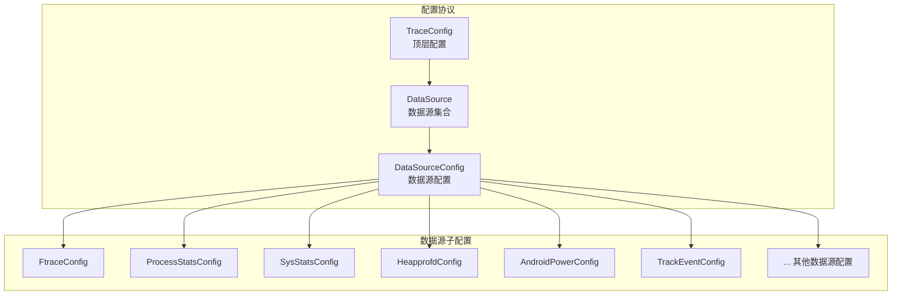
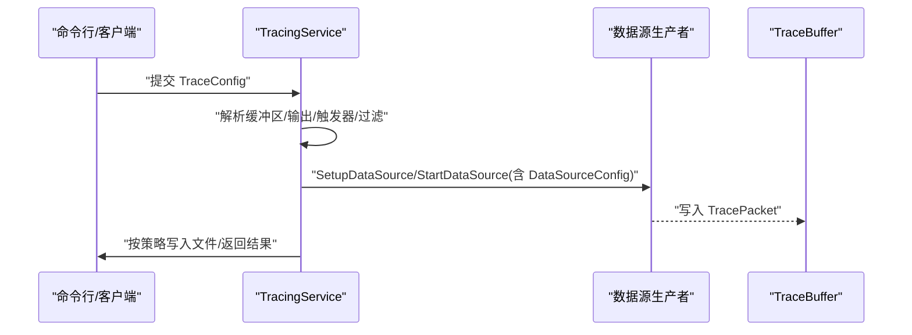
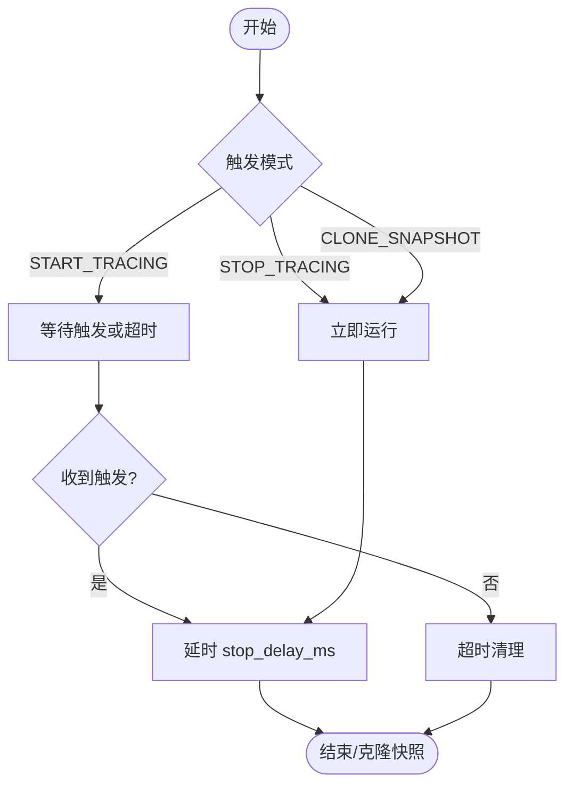
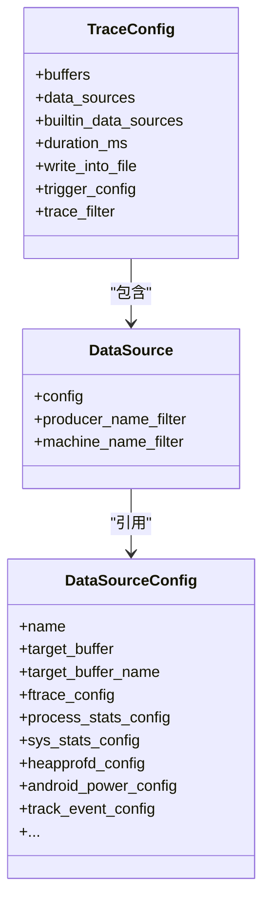

# 配置协议

<cite>
**本文引用的文件**
- [trace_config.proto](file://protos/perfetto/config/trace_config.proto)
- [data_source_config.proto](file://protos/perfetto/config/data_source_config.proto)
- [config.md](file://docs/concepts/config.md)
- [system_wide_trace_cfg.pbtxt](file://examples/sdk/system_wide_trace_cfg.pbtxt)
- [txt_to_pb_unittest.cc](file://src/proto_utils/txt_to_pb_unittest.cc)
- [priority_boost_config.h](file://include/perfetto/ext/tracing/core/priority_boost_config.h)
</cite>

## 目录
1. [简介](#简介)
2. [项目结构](#项目结构)
3. [核心组件](#核心组件)
4. [架构总览](#架构总览)
5. [详细组件分析](#详细组件分析)
6. [依赖分析](#依赖分析)
7. [性能考量](#性能考量)
8. [故障排查指南](#故障排查指南)
9. [结论](#结论)
10. [附录](#附录)

## 简介
本文件为 Perfetto 配置协议的完整规范文档，聚焦 TraceConfig 消息的结构与字段语义，涵盖数据源配置、缓冲区设置、输出选项、触发器、过滤与安全策略等。文档同时梳理了配置格式（文本、二进制）、验证规则与默认行为、继承与覆盖机制（全局、会话、数据源），并给出热重载与动态更新的实现要点与最佳实践。

## 项目结构
- 配置协议定义位于 protos/perfetto/config 下，核心消息为 TraceConfig 与 DataSourceConfig。
- 文档 docs/concepts/config.md 提供高层概念与使用示例。
- 示例 examples/sdk/system_wide_trace_cfg.pbtxt 展示常见数据源组合与字段用法。
- 单元测试 src/proto_utils/txt_to_pb_unittest.cc 验证文本格式解析与兼容性。
- 优先级提升配置在 include/perfetto/ext/tracing/core/priority_boost_config.h 中有校验逻辑。

图表来源
- [trace_config.proto](file://protos/perfetto/config/trace_config.proto)
- [data_source_config.proto](file://protos/perfetto/config/data_source_config.proto)

章节来源
- [trace_config.proto](file://protos/perfetto/config/trace_config.proto)
- [data_source_config.proto](file://protos/perfetto/config/data_source_config.proto)
- [config.md](file://docs/concepts/config.md)

## 核心组件
- TraceConfig：顶层配置消息，定义缓冲区、数据源映射、输出、触发器、过滤、安全与统计等。
- DataSource：包含目标数据源名称与过滤条件，以及对应的 DataSourceConfig。
- DataSourceConfig：承载具体数据源的配置，采用 lazy 字段以透明传递原始二进制，确保向前/向后兼容。
- 触发器 TriggerConfig：支持按事件启动或停止跟踪，含超时与概率跳过等控制。
- 过滤 TraceFilter：支持字节码与字符串过滤链，用于运行时对 trace 内容进行后处理。
- 输出与持久化：write_into_file、output_path、file_write_period_ms、max_file_size_bytes 等。

章节来源
- [trace_config.proto](file://protos/perfetto/config/trace_config.proto)
- [data_source_config.proto](file://protos/perfetto/config/data_source_config.proto)
- [config.md](file://docs/concepts/config.md)

## 架构总览
TraceConfig 在服务端被解析与分发，分别作用于：
- 缓冲区管理：大小、填充策略、克隆与清空策略、实验模式。
- 数据源启用：按名称匹配、进程/机器过滤、增量状态清理。
- 输出策略：写入文件、周期写入、最大文件大小、压缩类型。
- 生命周期控制：持续时间、延迟启动、触发器、快照与克隆。

图表来源
- [trace_config.proto](file://protos/perfetto/config/trace_config.proto)
- [data_source_config.proto](file://protos/perfetto/config/data_source_config.proto)

## 详细组件分析

### TraceConfig 结构与字段
- 缓冲区 BufferConfig
  - size_kb：缓冲区大小（KB）。
  - fill_policy：填充策略（默认环形缓冲 RING_BUFFER；丢弃 DISCARD）。
  - transfer_on_clone/clear_before_clone：克隆时移动/清空策略。
  - name：命名缓冲区，便于通过 target_buffer_name 引用。
  - experimental_mode：实验模式（V1/V2/V2Shadow）。
- 数据源 DataSource
  - config：对应 DataSourceConfig。
  - producer_name_filter/producer_name_regex_filter：按进程名过滤。
  - machine_name_filter：按机器名过滤。
- 内置数据源 BuiltinDataSource
  - 关闭内置事件/系统信息/时钟快照等开关。
  - primary_trace_clock/snapshot_interval_ms/prefer_suspend_clock_for_snapshot：时钟域与快照策略。
- 时长与守护规则
  - duration_ms：跟踪持续时间（不计挂起）。
  - prefer_suspend_clock_for_duration：使用挂起感知时钟。
  - enable_extra_guardrails：额外资源限制。
- 生产者共享内存
  - producers[].shm_size_kb/page_size_kb：共享内存偏好尺寸与页大小。
- 输出与文件
  - write_into_file：是否写入文件。
  - output_path：输出文件路径（存在则拒绝覆盖）。
  - file_write_period_ms/max_file_size_bytes：周期写入与最大文件大小。
  - compression_type：压缩类型（如 Deflate）。
- 触发器 TriggerConfig
  - trigger_mode：START_TRACING/STOP_TRACING/CLONE_SNAPSHOT。
  - triggers[]：触发项（名称、正则、stop_delay_ms、24小时上限、跳过概率）。
  - trigger_timeout_ms：等待触发的超时。
  - use_clone_snapshot_if_available：向后兼容标记。
- 增量状态 IncrementalStateConfig
  - clear_period_ms：周期性通知数据源清理增量状态。
- 过滤 TraceFilter
  - bytecode/bytecode_v2：字节码过滤。
  - string_filter_chain/string_filter_chain_v54：字符串过滤链与覆盖。
- 安全与报告
  - lockdown_mode：仅允许同 UID 生产者。
  - statsd_metadata/incident_report_config/android_report_config：统计与上报配置。
- 其他
  - unique_session_name：唯一会话名。
  - trace_all_machines：跨机器匹配默认行为。
  - notes：键值注释。
  - write_flush_mode/fflush_post_write：文件写入与落盘策略。
  - session_semaphores/exclusive_prio：并发与独占优先级控制。
  - priority_boost：优先级提升策略（见下节）。

章节来源
- [trace_config.proto](file://protos/perfetto/config/trace_config.proto)

### DataSource 与 DataSourceConfig
- DataSource
  - config：指向 DataSourceConfig。
  - 进程/机器过滤：producer_name_filter/producer_name_regex_filter/machine_name_filter。
- DataSourceConfig
  - name/target_buffer/target_buffer_name：数据源标识与缓冲区映射。
  - trace_duration_ms/stop_timeout_ms/enable_extra_guardrails/session_initiator/tracing_session_id：服务侧注入的运行时信息。
  - buffer_exhausted_policy：共享内存耗尽时策略（丢弃/停顿后丢弃/停顿后中止）。
  - priority_boost/protovm_config：优先级与 ProtoVM 处理。
  - 各类数据源配置字段（ftrace_config、process_stats_config、sys_stats_config、heapprofd_config、android_power_config、track_event_config 等），均以 lazy=true 透传原始二进制，确保兼容性。

章节来源
- [data_source_config.proto](file://protos/perfetto/config/data_source_config.proto)

### 触发器工作流

图表来源
- [trace_config.proto](file://protos/perfetto/config/trace_config.proto)

章节来源
- [trace_config.proto](file://protos/perfetto/config/trace_config.proto)

### 优先级提升配置校验
- 支持策略：SCHED_OTHER（0~20）、SCHED_FIFO（1~99）。
- POLICY_UNSPECIFIED 被拒绝。
- 优先级超出范围将返回错误状态。

章节来源
- [priority_boost_config.h](file://include/perfetto/ext/tracing/core/priority_boost_config.h)

### 配置格式规范
- 文本格式（PBTX）
  - 使用 protos/perfetto/config/trace_config.proto 的 schema。
  - 支持枚举、嵌套消息、重复字段、注释与分号结尾。
  - 参考单元测试中的解析行为与示例。
- 二进制格式
  - 使用 protoc 将 PBTX 编码为二进制。
  - 通过 perfetto 命令行以二进制方式传递。
- JSON 格式
  - 仓库未提供直接的 JSON 到 TraceConfig 的编译/解析入口；建议通过 PBTX 或二进制格式传递配置。

章节来源
- [config.md](file://docs/concepts/config.md)
- [txt_to_pb_unittest.cc](file://src/proto_utils/txt_to_pb_unittest.cc)

### 配置验证规则与默认值
- 缓冲区
  - 至少定义一个缓冲区；默认填策略为 RING_BUFFER；命名缓冲区需唯一。
- 输出
  - write_into_file 与 output_path 互斥；若指定文件已存在则拒绝覆盖。
  - file_write_period_ms 最小 100ms；默认周期由服务自动平衡。
- 触发器
  - trigger_timeout_ms 必须为正且指定 TriggerConfig 才可生效。
  - stop_delay_ms 与 skip_probability 控制触发后的动作与概率跳过。
- 过滤
  - bytecode 与 bytecode_v2 任选其一；string_filter_chain_v54 支持规则覆盖。
- 优先级提升
  - 策略与优先级范围严格校验，非法范围将报错。
- 默认行为
  - 未显式设置时，服务采用保守策略（自动平衡写入频率、默认环形缓冲等）。

章节来源
- [trace_config.proto](file://protos/perfetto/config/trace_config.proto)
- [priority_boost_config.h](file://include/perfetto/ext/tracing/core/priority_boost_config.h)

### 继承与覆盖机制
- 全局配置（TraceConfig）
  - 影响服务整体行为：缓冲区、输出、触发器、过滤、安全策略。
- 会话配置（DataSourceConfig）
  - 由服务转发给对应数据源，保持原始二进制，避免平台强耦合。
- 数据源配置（各子配置）
  - 通过 lazy=true 透传，确保新增字段无需升级服务即可生效。
- 覆盖顺序
  - 服务侧注入字段（如 tracing_session_id、stop_timeout_ms）会覆盖消费者传入值。
  - target_buffer 与 target_buffer_name 同时出现时必须指向同一缓冲区。

章节来源
- [data_source_config.proto](file://protos/perfetto/config/data_source_config.proto)
- [trace_config.proto](file://protos/perfetto/config/trace_config.proto)

### 热重载与动态更新
- 服务端动态能力
  - 服务端具备周期性刷新、写入与落盘策略的动态控制（write_flush_mode/fflush_post_write）。
  - 触发器可在会话生命周期内动态激活，实现“飞行记录器”模式。
- 客户端热重载
  - 仓库前端 Live Reload 机制用于开发环境的样式与页面热替换，非配置热重载。
  - 配置热重载需通过服务端接口（如重新下发 TraceConfig）实现，不在现有代码中直接暴露。

章节来源
- [trace_config.proto](file://protos/perfetto/config/trace_config.proto)
- [config.md](file://docs/concepts/config.md)

### 常见配置场景与最佳实践
- 系统级宽轨跟踪
  - 使用 DISCARD 策略缓冲区分离高吞吐数据源（如调度）与低频采样（如内存统计）。
  - 示例参考：examples/sdk/system_wide_trace_cfg.pbtxt。
- 长时跟踪
  - 开启 write_into_file 并设置合理的 file_write_period_ms 与 max_file_size_bytes。
  - 使用 prefer_suspend_clock_for_duration 以挂起感知时钟计时。
- 触发器模式
  - START_TRACING：等待特定事件后再记录一段时间。
  - STOP_TRACING：先运行再根据事件提前终止，适合“飞行记录器”。
- 过滤与隐私
  - 使用 TraceFilter 的字符串过滤链对敏感字段进行脱敏或截断。
- 安全与合规
  - 使用 lockdown_mode 限制生产者来源；谨慎开启额外 guardrails。

章节来源
- [config.md](file://docs/concepts/config.md)
- [system_wide_trace_cfg.pbtxt](file://examples/sdk/system_wide_trace_cfg.pbtxt)

## 依赖分析
- TraceConfig 依赖 DataSourceConfig 与各类数据源子配置。
- DataSourceConfig 通过 lazy 字段避免对上游数据源类型的强耦合。
- 服务端在启动阶段解析 TraceConfig 并分发到对应生产者。

图表来源
- [trace_config.proto](file://protos/perfetto/config/trace_config.proto)
- [data_source_config.proto](file://protos/perfetto/config/data_source_config.proto)

章节来源
- [trace_config.proto](file://protos/perfetto/config/trace_config.proto)
- [data_source_config.proto](file://protos/perfetto/config/data_source_config.proto)

## 性能考量
- 缓冲区策略
  - RING_BUFFER：吞吐高但可能丢失旧数据；DISCARD：避免覆盖但可能丢弃尾部数据。
- 写入与落盘
  - write_flush_mode 提供自动/禁用/强制三种策略；fflush_post_write 控制每次写入后是否同步。
- 触发器与克隆
  - CLONE_SNAPSHOT 在新版本中可用，避免长时间会话；老版本回退至 STOP_TRACING。
- 过滤开销
  - 字节码与字符串过滤在 ReadBuffers 时执行，建议仅在必要时启用。

章节来源
- [trace_config.proto](file://protos/perfetto/config/trace_config.proto)

## 故障排查指南
- 文本格式解析问题
  - 确认字段拼写、枚举值正确；参考单元测试中的边界与兼容性用例。
- 输出路径权限
  - output_path 指定的文件必须不存在；Android 上需在受控目录。
- 触发器无效
  - 确保 trigger_timeout_ms 为正数；START_TRACING 与 duration_ms 不可同时使用。
- 优先级提升失败
  - 检查策略与优先级范围；POLICY_UNSPECIFIED 不被接受。
- 过滤异常
  - bytecode 与 bytecode_v2 二选一；string_filter_chain_v54 仅在新版本生效。

章节来源
- [txt_to_pb_unittest.cc](file://src/proto_utils/txt_to_pb_unittest.cc)
- [trace_config.proto](file://protos/perfetto/config/trace_config.proto)
- [priority_boost_config.h](file://include/perfetto/ext/tracing/core/priority_boost_config.h)

## 结论
本规范系统梳理了 Perfetto 配置协议的结构、字段语义、格式与验证规则，并结合实际示例与最佳实践指导用户高效、安全地构建跟踪配置。对于动态更新与热重载，建议通过服务端接口与触发器机制实现，避免直接修改运行中的配置。

## 附录
- 示例配置参考：examples/sdk/system_wide_trace_cfg.pbtxt
- 文档与参考：docs/concepts/config.md