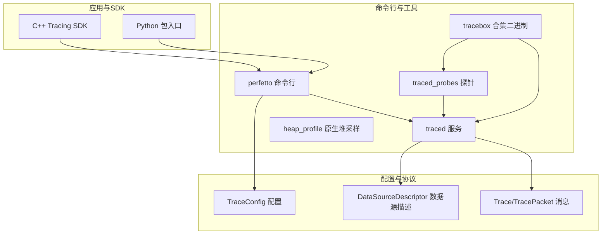
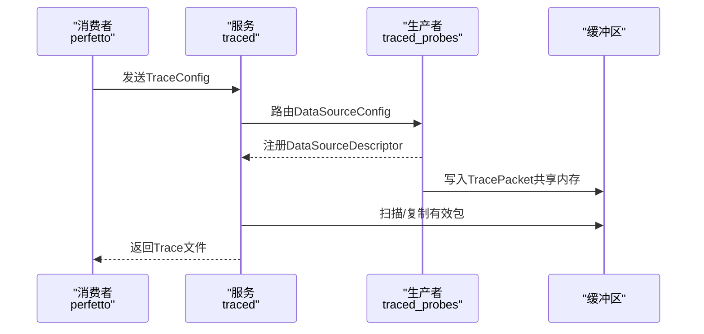
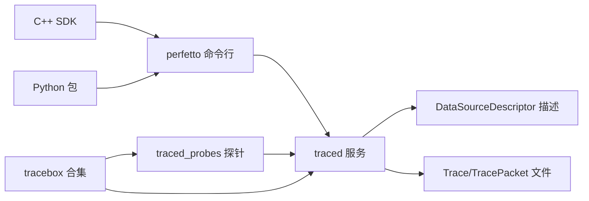

# 参考手册

<cite>
**本文引用的文件**
- [README.md](file://README.md)
- [perfetto-cli.md](file://docs/reference/perfetto-cli.md)
- [traced.md](file://docs/reference/traced.md)
- [traced_probes.md](file://docs/reference/traced_probes.md)
- [tracebox.md](file://docs/reference/tracebox.md)
- [heap_profile-cli.md](file://docs/reference/heap_profile-cli.md)
- [android-version-notes.md](file://docs/reference/android-version-notes.md)
- [config.md](file://docs/concepts/config.md)
- [tracing-sdk.md](file://docs/instrumentation/tracing-sdk.md)
- [cpu-scheduling.md](file://docs/data-sources/cpu-scheduling.md)
- [trace.proto](file://protos/perfetto/trace/trace.proto)
- [trace_config.proto](file://protos/perfetto/config/trace_config.proto)
- [data_source_descriptor.proto](file://protos/perfetto/common/data_source_descriptor.proto)
- [__init__.py](file://python/perfetto/__init__.py)
</cite>

## 目录
1. [简介](#简介)
2. [项目结构](#项目结构)
3. [核心组件](#核心组件)
4. [架构总览](#架构总览)
5. [详细组件分析](#详细组件分析)
6. [依赖关系分析](#依赖关系分析)
7. [性能考量](#性能考量)
8. [故障排查指南](#故障排查指南)
9. [结论](#结论)
10. [附录](#附录)

## 简介
本参考手册面向Perfetto的使用者与集成者，系统梳理以下内容：
- 公共API：C++ Tracing SDK、Python API（包初始化）、命令行工具（perfetto、traced、traced_probes、tracebox、heap_profile）与配置选项的完整参考
- Protobuf消息格式与协议规范：Trace、TraceConfig、DataSourceDescriptor等核心消息的数据结构、字段语义与约束
- 命令行工具使用手册：参数说明、选项配置与示例
- 配置选项：追踪配置、数据源设置、触发器、缓冲区策略与性能调优
- 协议与格式规范：确保与其他系统的互操作性
- 版本兼容性与迁移指南：Android版本差异、废弃功能与替代方案
- 索引与可搜索格式：便于快速定位特定信息

## 项目结构
Perfetto由多组件协作构成：守护进程服务、系统级探针、用户态SDK、浏览器UI与SQL分析引擎。命令行工具与配置文件驱动服务完成采集与导出。

图示来源
- [traced.md:18-75](file://docs/reference/traced.md#L18-L75)
- [traced_probes.md:15-27](file://docs/reference/traced_probes.md#L15-L27)
- [tracebox.md:9-18](file://docs/reference/tracebox.md#L9-L18)
- [trace_config.proto:26-31](file://protos/perfetto/config/trace_config.proto#L26-L31)
- [data_source_descriptor.proto:26-29](file://protos/perfetto/common/data_source_descriptor.proto#L26-L29)
- [trace.proto:23-31](file://protos/perfetto/trace/trace.proto#L23-L31)

章节来源
- [README.md:12-31](file://README.md#L12-L31)
- [traced.md:18-75](file://docs/reference/traced.md#L18-L75)
- [tracebox.md:9-18](file://docs/reference/tracebox.md#L9-L18)

## 核心组件
- 命令行工具
  - perfetto：在Android/Linux/Windows上采集Trace，支持轻量模式与正常模式（PB文本或二进制）
  - traced：中心化Tracing服务，管理会话、缓冲区与数据源注册
  - traced_probes：特权探针，提供内核/系统级数据源
  - tracebox：打包版工具，自动启动traced/traced_probes并作为perfetto客户端
  - heap_profile：Android原生堆采样工具
- 配置与协议
  - TraceConfig：整体追踪配置（时长、缓冲区、数据源、触发器等）
  - DataSourceDescriptor：数据源能力描述（名称、ID、通知行为、增量状态等）
  - Trace/TracePacket：Trace文件的包装与数据包序列
- 应用与SDK
  - C++ Tracing SDK：用户态事件注入、自定义数据源、会话控制
  - Python 包入口：仓库内轻量包初始化，便于内部导入

章节来源
- [perfetto-cli.md:1-215](file://docs/reference/perfetto-cli.md#L1-L215)
- [traced.md:1-114](file://docs/reference/traced.md#L1-L114)
- [traced_probes.md:1-464](file://docs/reference/traced_probes.md#L1-L464)
- [tracebox.md:1-104](file://docs/reference/tracebox.md#L1-L104)
- [heap_profile-cli.md:1-100](file://docs/reference/heap_profile-cli.md#L1-L100)
- [trace_config.proto:26-31](file://protos/perfetto/config/trace_config.proto#L26-L31)
- [data_source_descriptor.proto:26-29](file://protos/perfetto/common/data_source_descriptor.proto#L26-L29)
- [trace.proto:23-31](file://protos/perfetto/trace/trace.proto#L23-L31)
- [tracing-sdk.md:1-419](file://docs/instrumentation/tracing-sdk.md#L1-L419)
- [__init__.py:14-19](file://python/perfetto/__init__.py#L14-L19)

## 架构总览
Perfetto采用服务模型：消费者发起配置，服务中转到生产者；生产者写入共享内存，服务汇总到Trace文件。traced负责会话与缓冲区管理，traced_probes提供系统级数据源。

图示来源
- [traced.md:36-58](file://docs/reference/traced.md#L36-L58)
- [traced_probes.md:15-27](file://docs/reference/traced_probes.md#L15-L27)
- [data_source_descriptor.proto:26-29](file://protos/perfetto/common/data_source_descriptor.proto#L26-L29)

章节来源
- [traced.md:36-58](file://docs/reference/traced.md#L36-L58)
- [traced_probes.md:15-27](file://docs/reference/traced_probes.md#L15-L27)

## 详细组件分析

### 命令行工具：perfetto
- 模式
  - 轻量模式：通过命令行标志直接选择ftrace/atrace事件
  - 正常模式：以PB配置文件指定数据源与缓冲策略
- 关键选项
  - 输出与覆盖：-o/--out、--no-clobber
  - 后台运行：-d/--background、-D/--background-wait、--notify-fd
  - 克隆会话：--clone、--clone-by-name、--clone-for-bugreport
  - 统计元数据：--alert-id、--config-id、--config-uid、--subscription-id
  - 报告上传：--upload（Android）
  - 查询与分离：--query、--long、--query-raw、--detach、--attach、--stop、--is_detached
  - 版本与帮助：--version、-h/--help
- 使用示例
  - 轻量模式：指定时间、缓冲大小、事件列表
  - 正常模式：PB文本或二进制配置文件，配合--txt或不带--txt

章节来源
- [perfetto-cli.md:140-215](file://docs/reference/perfetto-cli.md#L140-L215)

### 命令行工具：traced
- 角色与职责：会话管理、缓冲区管理、数据源注册、配置路由、数据整合与安全隔离
- 交互通道：IPC（UNIX流套接字）用于低频控制；共享内存用于高频数据传输
- 选项
  - --background、--version
  - --set-socket-permissions：设置生产者/消费者套接字权限
  - --enable-relay-endpoint：启用多机trace relay

章节来源
- [traced.md:18-114](file://docs/reference/traced.md#L18-L114)

### 命令行工具：traced_probes
- 作用：特权探针，提供系统/内核级数据源（如ftrace、进程统计、系统统计、电源信息等）
- 配置：在TraceConfig的DataSource中声明对应名称与子配置
- 平台数据源举例
  - Linux：linux.ftrace、linux.process_stats、linux.sys_stats、linux.sysfs_power、inode_file_map、metatrace、linux.system_info
  - Android：android.power、android.log、android.system_property、android.packages_list、android.game_interventions、android.cpu.uid、android.kernel_wakelocks、android.polled_state、android.statsd

章节来源
- [traced_probes.md:38-464](file://docs/reference/traced_probes.md#L38-L464)

### 命令行工具：tracebox
- 自动启动模式：同时启动traced/traced_probes，并作为perfetto客户端运行
- 手动模式：分别调用traced、traced_probes、traced_relay、traced_perf、perfetto、trigger_perfetto、websocket_bridge
- 选项：--system-sockets（强制使用系统套接字）

章节来源
- [tracebox.md:15-104](file://docs/reference/tracebox.md#L15-L104)

### 命令行工具：heap_profile
- 用途：在Android设备上采集原生堆采样
- 关键选项：进程名/PID过滤、采样间隔、输出目录、持续dump、SELinux相关开关、缓冲区大小、阻塞策略等

章节来源
- [heap_profile-cli.md:1-100](file://docs/reference/heap_profile-cli.md#L1-L100)

### C++ Tracing SDK
- 初始化与后端
  - 支持kInProcessBackend与kSystemBackend组合
  - 系统模式需traced服务可达
- 两种注入方式
  - Track Events：基于简单的时间片/计数器事件，适合大多数场景
  - 自定义数据源：实现DataSource子类，按需扩展强类型Schema
- API要点
  - 新建会话、Setup/Start/Stop/ReadTrace
  - 在配置中启用track_event或自定义数据源

章节来源
- [tracing-sdk.md:24-419](file://docs/instrumentation/tracing-sdk.md#L24-L419)

### Python 包入口
- 仓库内轻量包初始化，支持内部导入路径扩展

章节来源
- [__init__.py:14-19](file://python/perfetto/__init__.py#L14-L19)

### Protobuf消息与协议规范

#### Trace 与 TracePacket
- Trace：对TracePacket的便捷封装，便于保存为文件
- TracePacket：Trace中的最小单元，承载事件与数据包

章节来源
- [trace.proto:23-31](file://protos/perfetto/trace/trace.proto#L23-L31)

#### TraceConfig（追踪配置）
- 整体行为
  - duration_ms：追踪时长（不计挂起）
  - buffers：缓冲区数组（size_kb、fill_policy、transfer_on_clone、clear_before_clone、name、experimental_mode）
  - data_sources：数据源列表（config、producer_name_filter/regex_filter、machine_name_filter）
  - builtin_data_sources：内置数据源控制（禁用时钟快照、禁用系统信息、主时钟域、快照间隔等）
  - prefer_suspend_clock_for_duration：使用挂起感知时钟
- 文本/二进制格式
  - PB文本（PBTX）：--txt；二进制：protoc编码
- 触发器
  - START_TRACING：触发后开始，带超时与停止延迟
  - STOP_TRACING：立即开始，触发后提前结束
- 多进程数据源过滤
  - producer_name_filter/regex_filter：仅在匹配的生产者中启用数据源
- 长Trace流式写入
  - write_into_file、file_write_period_ms、max_file_size_bytes

章节来源
- [config.md:14-499](file://docs/concepts/config.md#L14-L499)
- [trace_config.proto:32-96](file://protos/perfetto/config/trace_config.proto#L32-L96)
- [trace_config.proto:99-127](file://protos/perfetto/config/trace_config.proto#L99-L127)
- [trace_config.proto:129-179](file://protos/perfetto/config/trace_config.proto#L129-L179)
- [trace_config.proto:181-197](file://protos/perfetto/config/trace_config.proto#L181-L197)

#### DataSourceDescriptor（数据源描述）
- 字段
  - name：数据源名称
  - id：生产者内唯一ID（用于UpdateDataSource区分）
  - will_notify_on_start/stop：是否通过IPC确认启停
  - handles_incremental_state_clear：是否处理增量状态清理
  - no_flush：Flush无效，减少IPC
  - protovm_program：重写包补丁的ProtoVM程序
  - gpu_counter_descriptor、track_event_descriptor、ftrace_descriptor：可选能力描述

章节来源
- [data_source_descriptor.proto:26-77](file://protos/perfetto/common/data_source_descriptor.proto#L26-L77)

#### 数据源配置示例（CPU调度）
- 启用linux.ftrace与linux.process_stats
- 事件选择：sched/sched_switch、可选sched_process_*与task_*事件
- UI与SQL：在UI中以切片展示，在SQL表sched_slice中查询

章节来源
- [cpu-scheduling.md:56-85](file://docs/data-sources/cpu-scheduling.md#L56-L85)
- [cpu-scheduling.md:87-182](file://docs/data-sources/cpu-scheduling.md#L87-L182)

### 配置选项详解与最佳实践
- 缓冲区策略
  - RING_BUFFER：环形缓冲，新写入覆盖旧数据
  - DISCARD：满则丢弃，注意对“结束时提交”的数据源影响
  - 动态映射：通过target_buffer或target_buffer_name将不同速率数据源分流
- 文本/二进制配置
  - PBTX：人类可读，适合探索；二进制：机器间交互首选
  - Android 10前仅支持二进制
- 触发器
  - START_TRACING：先等待触发再记录，避免无谓开销
  - STOP_TRACING：循环录制，遇触发即终止
- 多进程数据源
  - 使用producer_name_filter/regex_filter限定目标进程
- 长Trace
  - write_into_file + 合理file_write_period_ms + max_file_size_bytes

章节来源
- [config.md:94-269](file://docs/concepts/config.md#L94-L269)
- [config.md:329-370](file://docs/concepts/config.md#L329-L370)
- [config.md:478-494](file://docs/concepts/config.md#L478-L494)

### 命令行工具使用手册与示例

#### perfetto
- 轻量模式语法与事件选择
- 正常模式语法与--txt/--config

章节来源
- [perfetto-cli.md:140-215](file://docs/reference/perfetto-cli.md#L140-L215)

#### tracebox
- 自动启动模式：同时启动traced/traced_probes并作为perfetto客户端
- 手动模式：调用各子工具
- --system-sockets选项

章节来源
- [tracebox.md:15-104](file://docs/reference/tracebox.md#L15-L104)

#### heap_profile
- 进程筛选、采样间隔、输出目录、持续dump、SELinux开关、缓冲区大小、阻塞策略

章节来源
- [heap_profile-cli.md:1-100](file://docs/reference/heap_profile-cli.md#L1-L100)

### 版本兼容性与迁移指南
- Android版本注意事项
  - CLONE_SNAPSHOT触发模式、字符串字段过滤引入
  - T-设备不支持CLONE_SNAPSHOT，存在边缘风险
  - P版本首次纳入系统镜像
  - Q前不支持--txt，需使用二进制配置
- 迁移建议
  - 从P/Q迁移到更高版本时，逐步启用新特性并验证稳定性
  - 对于触发器，优先使用STOP_TRACING实现飞行记录器模式

章节来源
- [android-version-notes.md:1-33](file://docs/reference/android-version-notes.md#L1-L33)

### 废弃功能与替代方案
- Dropbox上传（--dropbox）已废弃，改用--upload
- guardrails相关选项（--no-guardrails、--reset-guardrails）兼容性保留，实际保护机制已调整

章节来源
- [perfetto-cli.md:70-111](file://docs/reference/perfetto-cli.md#L70-L111)

## 依赖关系分析

图示来源
- [traced.md:18-35](file://docs/reference/traced.md#L18-L35)
- [traced_probes.md:15-27](file://docs/reference/traced_probes.md#L15-L27)
- [tracebox.md:9-18](file://docs/reference/tracebox.md#L9-L18)
- [data_source_descriptor.proto:26-29](file://protos/perfetto/common/data_source_descriptor.proto#L26-L29)
- [trace.proto:23-31](file://protos/perfetto/trace/trace.proto#L23-L31)

章节来源
- [traced.md:18-35](file://docs/reference/traced.md#L18-L35)
- [traced_probes.md:15-27](file://docs/reference/traced_probes.md#L15-L27)
- [tracebox.md:9-18](file://docs/reference/tracebox.md#L9-L18)
- [data_source_descriptor.proto:26-29](file://protos/perfetto/common/data_source_descriptor.proto#L26-L29)
- [trace.proto:23-31](file://protos/perfetto/trace/trace.proto#L23-L31)

## 性能考量
- 缓冲区策略
  - 高频数据源（如调度）与低频数据源（如内存快照）混配时，建议分拆缓冲区，避免高吞吐覆盖低吞吐事件
- 流式写入
  - 长Trace开启write_into_file，结合合适的file_write_period_ms与max_file_size_bytes，平衡I/O与内存占用
- 触发器模式
  - 使用STOP_TRACING实现飞行记录器模式，降低常态开销
- 线程与IPC
  - traced_probes特权模式与共享内存通道降低用户态开销，但需注意权限与隔离

章节来源
- [config.md:94-184](file://docs/concepts/config.md#L94-L184)
- [config.md:235-269](file://docs/concepts/config.md#L235-L269)
- [traced.md:69-75](file://docs/reference/traced.md#L69-L75)

## 故障排查指南
- Android设备
  - Ctrl+C在ADB shell中可能不传播，使用--background并kill PID停止
  - 非root设备在P之前无法直接pull /data/misc/perfetto-traces，可通过cat重定向
  - P之前无法直接传配置至perfetto，需经stdin或/data/misc/perfetto-configs
- 配置问题
  - 文本配置仅Q及以上支持；若报错，检查--txt与设备版本
  - 触发器与duration不可同时使用
- 权限与套接字
  - 使用--set-socket-permissions控制生产者/消费者连接权限
- 上传与报告
  - 使用--upload替代已废弃的--dropbox；必要时使用--save-for-bugreport或--save-all-for-bugreport

章节来源
- [config.md:478-494](file://docs/concepts/config.md#L478-L494)
- [perfetto-cli.md:70-111](file://docs/reference/perfetto-cli.md#L70-L111)
- [traced.md:82-87](file://docs/reference/traced.md#L82-L87)

## 结论
本参考手册系统化梳理了Perfetto的命令行工具、配置协议与SDK接口，给出了协议规范、使用示例与故障排查建议。建议在生产环境中优先采用二进制配置与触发器模式，合理规划缓冲区与流式写入策略，并依据Android版本差异进行兼容性处理。

## 附录
- 快速索引
  - 命令行：perfetto、traced、traced_probes、tracebox、heap_profile
  - 配置：TraceConfig、DataSourceDescriptor、Trace/TracePacket
  - SDK：C++ Tracing SDK、Python 包入口
  - 数据源：linux.ftrace、linux.process_stats、android.power、android.log等
- 相关文档
  - 配置概念与示例：参见docs/concepts/config.md
  - 数据源详情：参见docs/data-sources/*
  - SDK使用：参见docs/instrumentation/tracing-sdk.md