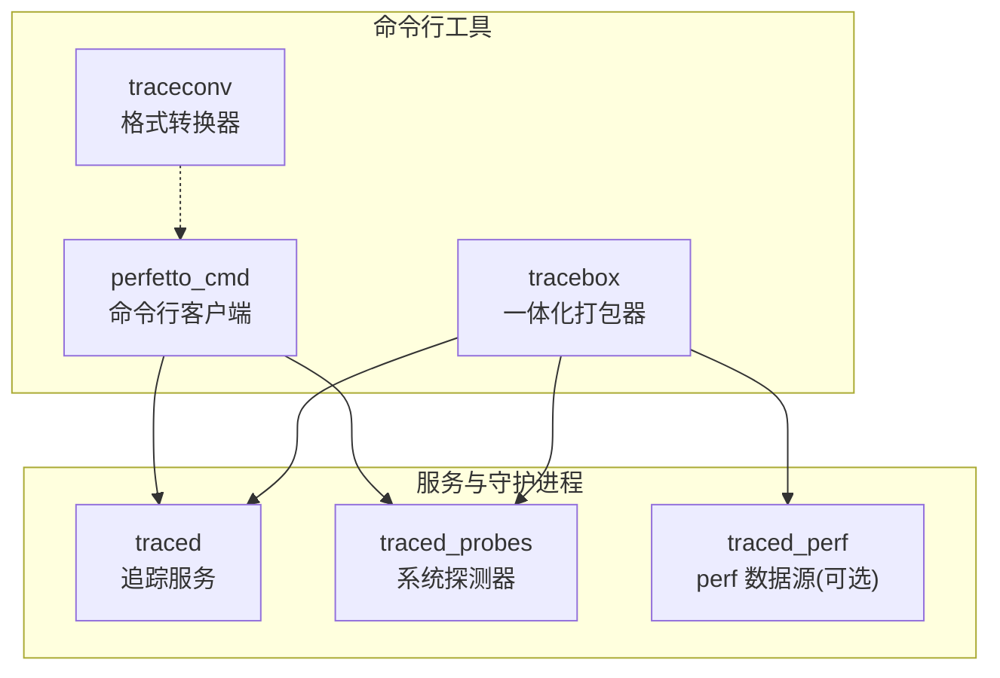
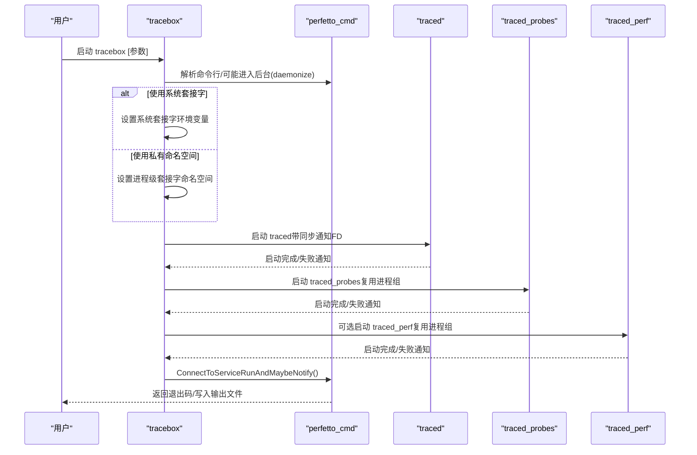
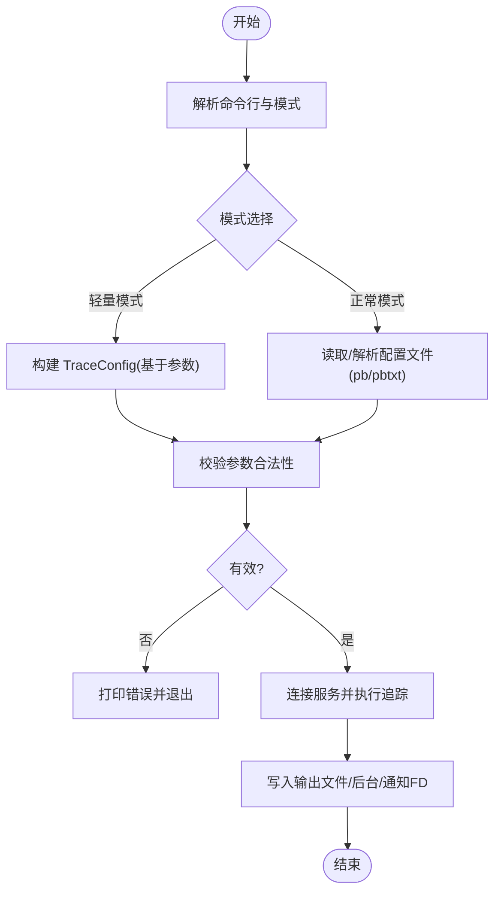
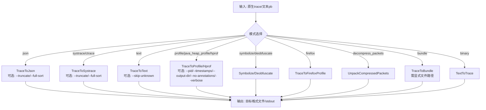
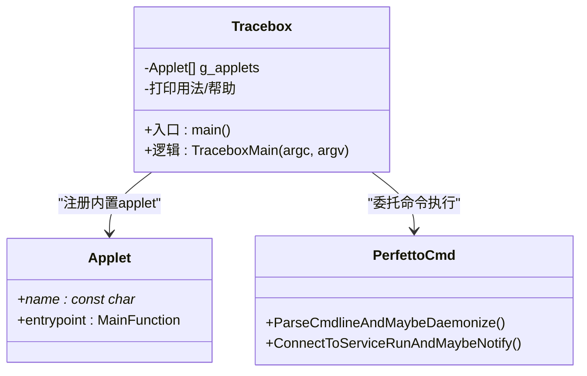
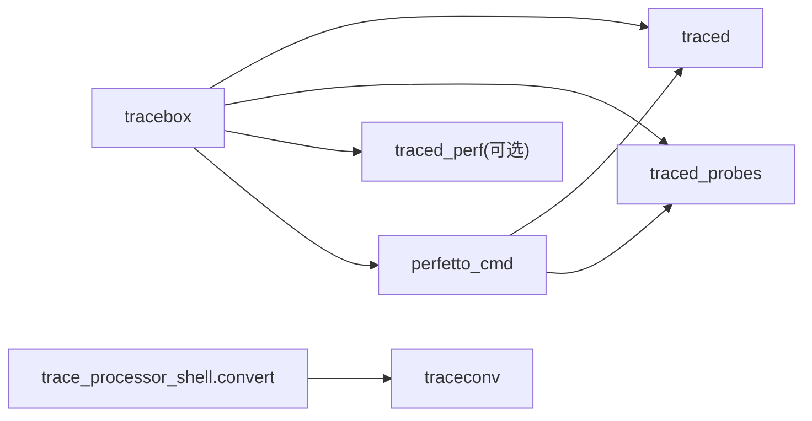
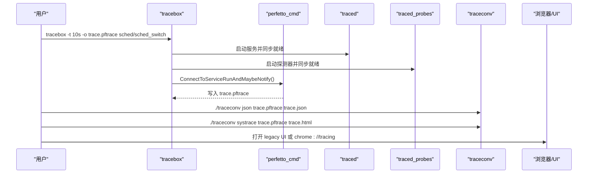
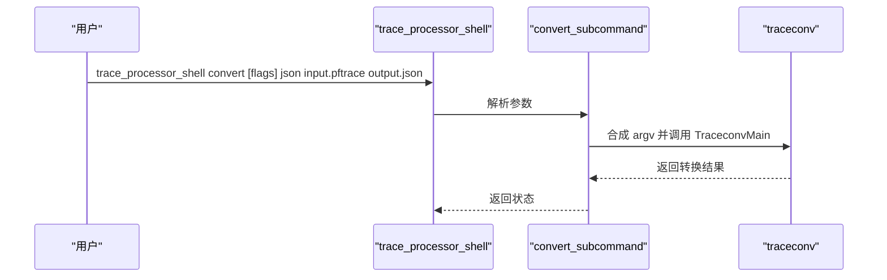

# 命令行工具参考

<cite>
**本文引用的文件**
- [src/perfetto_cmd/main.cc](file://src/perfetto_cmd/main.cc)
- [src/perfetto_cmd/perfetto_cmd.cc](file://src/perfetto_cmd/perfetto_cmd.cc)
- [src/perfetto_cmd/config.cc](file://src/perfetto_cmd/config.cc)
- [docs/reference/perfetto-cli.md](file://docs/reference/perfetto-cli.md)
- [docs/reference/tracebox.md](file://docs/reference/tracebox.md)
- [src/tracebox/tracebox.cc](file://src/tracebox/tracebox.cc)
- [src/traceconv/main.cc](file://src/traceconv/main.cc)
- [src/traceconv/traceconv.cc](file://src/traceconv/traceconv.cc)
- [docs/reference/tracebox.md](file://docs/reference/tracebox.md)
- [docs/quickstart/traceconv.md](file://docs/quickstart/traceconv.md)
- [src/trace_processor/shell/convert_subcommand.cc](file://src/trace_processor/shell/convert_subcommand.cc)
- [include/perfetto/ext/traceconv/traceconv.h](file://include/perfetto/ext/traceconv/traceconv.h)
- [python/tools/traceconv.py](file://python/tools/traceconv.py)
- [python/tools/tracebox.py](file://python/tools/tracebox.py)
</cite>

## 目录
1. [简介](#简介)
2. [项目结构](#项目结构)
3. [核心组件](#核心组件)
4. [架构总览](#架构总览)
5. [详细组件分析](#详细组件分析)
6. [依赖关系分析](#依赖关系分析)
7. [性能与资源特性](#性能与资源特性)
8. [故障排除指南](#故障排除指南)
9. [结论](#结论)
10. [附录：工作流示例](#附录工作流示例)

## 简介
本参考文档面向使用 Perfetto 命令行工具的工程师与运维人员，系统性介绍以下核心工具的用途、参数、输入输出格式与典型用法：
- perfetto_cmd：用于在设备或主机上采集与控制追踪会话的命令行客户端
- traceconv：用于将 Perfetto 原生二进制追踪转换为多种外部格式（如 JSON、systrace、pprof、hprof 等）
- tracebox：一体化打包器，内含 traced/traced_probes/perfetto 等服务与客户端，支持“自启动模式”自动拉起服务并采集

文档同时提供端到端工作流示例、常见问题排查与性能特性说明，帮助读者快速上手并稳定落地。

## 项目结构
围绕命令行工具的相关目录与文件组织如下：
- perfetto_cmd：命令行客户端入口与实现
- tracebox：一体化打包器，负责服务生命周期管理与自动启动
- traceconv：转换器，负责将原生 trace 转换为多种外部格式
- 文档：官方 man 页面与快速开始指南，覆盖 CLI 使用说明与格式支持清单

**图示来源**
- [src/tracebox/tracebox.cc:48-58](file://src/tracebox/tracebox.cc#L48-L58)
- [docs/reference/tracebox.md:82-104](file://docs/reference/tracebox.md#L82-L104)

**章节来源**
- [src/perfetto_cmd/main.cc:17-22](file://src/perfetto_cmd/main.cc#L17-L22)
- [src/traceconv/main.cc:17-21](file://src/traceconv/main.cc#L17-L21)
- [src/tracebox/tracebox.cc:48-58](file://src/tracebox/tracebox.cc#L48-L58)

## 核心组件
- perfetto_cmd
  - 功能：在 Android 或主机上采集与控制追踪会话；支持“轻量模式（简单参数）”与“正常模式（pbtxt/pb 配置）”
  - 输入：命令行参数、配置文件（pb/pbtxt）、事件选择器
  - 输出：原生 Perfetto 追踪文件（.perfetto-trace/.pftrace），或后台运行、通知状态等
  - 关键能力：会话克隆、附加/分离、查询服务状态、上传/保存报告等
- traceconv
  - 功能：将原生 trace 转换为 text/json/systrace/profile/hprof/firefox 等格式；支持符号化、去混淆、打包等
  - 输入：原生 trace 文件或 stdin；部分模式支持 stdin/stdout
  - 输出：目标格式文件或 stdout
- tracebox
  - 功能：一体化二进制，既可作为 perfetto 客户端，也可在“自启动模式”下自动拉起 traced/traced_probes/traced_perf，并在需要时启动 websocket 桥接
  - 输入：perfetto 命令行参数 + tracebox 特有开关
  - 输出：与 perfetto 相同的追踪结果，但由 tracebox 管理服务生命周期

**章节来源**
- [docs/reference/perfetto-cli.md:1-215](file://docs/reference/perfetto-cli.md#L1-L215)
- [docs/reference/tracebox.md:1-104](file://docs/reference/tracebox.md#L1-L104)
- [src/traceconv/traceconv.cc:59-127](file://src/traceconv/traceconv.cc#L59-L127)

## 架构总览
下面以序列图展示 tracebox 在“自启动模式”下的关键调用链：它解析命令行、决定是否使用系统套接字命名空间、拉起 traced/traced_probes/traced_perf，再委托 perfetto_cmd 连接服务并执行追踪。

**图示来源**
- [src/tracebox/tracebox.cc:95-251](file://src/tracebox/tracebox.cc#L95-L251)

**章节来源**
- [src/tracebox/tracebox.cc:95-251](file://src/tracebox/tracebox.cc#L95-L251)
- [docs/reference/tracebox.md:15-71](file://docs/reference/tracebox.md#L15-L71)

## 详细组件分析

### perfetto_cmd 组件
- 入口与职责
  - 主程序入口调用统一的 PerfettoCmdMain，交由内部状态机处理命令行与会话控制
  - 支持两种配置模式：轻量模式（直接通过命令行参数指定事件与时长/缓冲区大小）与正常模式（pb/pbtxt 配置文件）
- 关键参数与行为
  - 通用选项：后台运行、等待启动、通知 FD、输出文件、防覆盖、克隆会话、添加注记、版本、查询/长查询、附加/分离、停止、上传/保存报告等
  - 轻量模式：时间、缓冲区大小、最大文件大小、应用级别 atrace 分类、ftrace 事件
  - 正常模式：配置文件路径、pbtxt 解析开关
- 错误与约束
  - 查询/长查询必须与附加/分离/后台互斥
  - 轻量模式与配置文件不可混用
  - 未指定有效配置时拒绝继续

**图示来源**
- [src/perfetto_cmd/perfetto_cmd.cc:623-657](file://src/perfetto_cmd/perfetto_cmd.cc#L623-L657)
- [src/perfetto_cmd/config.cc:98-126](file://src/perfetto_cmd/config.cc#L98-L126)

**章节来源**
- [src/perfetto_cmd/main.cc:17-22](file://src/perfetto_cmd/main.cc#L17-L22)
- [src/perfetto_cmd/perfetto_cmd.cc:531-589](file://src/perfetto_cmd/perfetto_cmd.cc#L531-L589)
- [src/perfetto_cmd/perfetto_cmd.cc:623-657](file://src/perfetto_cmd/perfetto_cmd.cc#L623-L657)
- [src/perfetto_cmd/config.cc:98-126](file://src/perfetto_cmd/config.cc#L98-L126)
- [docs/reference/perfetto-cli.md:26-215](file://docs/reference/perfetto-cli.md#L26-L215)

### traceconv 组件
- 功能与模式
  - 支持多种转换模式：json、systrace、ctrace、text、profile、java_heap_profile、hprof、symbolize、deobfuscate、firefox、decompress_packets、bundle、binary
  - 大多数模式支持输入/输出文件路径或 stdin/stdout；bundle 模式要求显式文件路径
- 关键参数
  - 通用：--truncate=start|end、--full-sort、--skip-unknown
  - profile/hprof/java_heap_profile：--pid、--timestamps、--output-dir、--no-annotations、--verbose、--symbol-paths、--no-auto-symbol-paths
  - bundle：--symbol-paths、--no-auto-symbol-paths、--verbose
- 输入输出
  - 输入：原生 trace（.perfetto-trace/.pftrace）或文本 pb（binary 模式）
  - 输出：对应格式文件或 stdout；profile 模式默认输出到临时目录，可通过 --output-dir 指定

**图示来源**
- [src/traceconv/traceconv.cc:156-405](file://src/traceconv/traceconv.cc#L156-L405)

**章节来源**
- [src/traceconv/main.cc:17-21](file://src/traceconv/main.cc#L17-L21)
- [src/traceconv/traceconv.cc:59-127](file://src/traceconv/traceconv.cc#L59-L127)
- [src/traceconv/traceconv.cc:267-405](file://src/traceconv/traceconv.cc#L267-L405)
- [docs/quickstart/traceconv.md:1-46](file://docs/quickstart/traceconv.md#L1-L46)

### tracebox 组件
- 自启动模式
  - 若未指定 applet 名称，则行为类似 perfetto 客户端，但会自动拉起 traced/traced_probes/traced_perf
  - 支持 --system-sockets 切换到系统套接字命名空间，便于与系统级 traced 交互
- 手动模式
  - 可直接调用内置 applet：traced、traced_probes、traced_relay、traced_perf、perfetto、trigger_perfetto、websocket_bridge
- 生命周期与同步
  - 使用子进程管理服务；通过环境变量与管道 FD 实现服务就绪同步与优雅终止

**图示来源**
- [src/tracebox/tracebox.cc:42-58](file://src/tracebox/tracebox.cc#L42-L58)
- [src/tracebox/tracebox.cc:95-251](file://src/tracebox/tracebox.cc#L95-L251)

**章节来源**
- [src/tracebox/tracebox.cc:42-58](file://src/tracebox/tracebox.cc#L42-L58)
- [src/tracebox/tracebox.cc:95-251](file://src/tracebox/tracebox.cc#L95-L251)
- [docs/reference/tracebox.md:15-104](file://docs/reference/tracebox.md#L15-L104)

## 依赖关系分析
- perfetto_cmd 依赖 traced/traced_probes 提供数据源与会话管理
- tracebox 将 traced/traced_probes/traced_perf 作为内置 applet，按需启动
- traceconv 作为独立转换器，可被 tracebox/trace_processor shell 调用
- trace_processor shell 的 convert 子命令通过合成 argv 委托给 traceconv

**图示来源**
- [src/tracebox/tracebox.cc:48-58](file://src/tracebox/tracebox.cc#L48-L58)
- [src/trace_processor/shell/convert_subcommand.cc:93-167](file://src/trace_processor/shell/convert_subcommand.cc#L93-L167)

**章节来源**
- [src/tracebox/tracebox.cc:48-58](file://src/tracebox/tracebox.cc#L48-L58)
- [src/trace_processor/shell/convert_subcommand.cc:93-167](file://src/trace_processor/shell/convert_subcommand.cc#L93-L167)

## 性能与资源特性
- tracebox 自启动模式
  - 通过进程组隔离与命名空间避免与系统级 traced 冲突；在 Linux/Android 使用抽象域套接字，Apple 使用临时路径
  - 通过通知 FD 与管道同步服务就绪，减少不必要的轮询与等待
- perfetto_cmd
  - 支持后台运行与通知 FD，适合长时间采集与批处理场景
  - 轻量模式参数（时间、缓冲区、大小）直接影响内存占用与磁盘 IO
- traceconv
  - 多数模式为纯转换，CPU 占用与内存开销取决于 trace 规模；profile/hprof/bundle 等模式可能产生大量中间文件
  - 建议在大 trace 上使用 --full-sort 与 --truncate 时评估排序成本

[本节为通用性能讨论，不直接分析具体文件，故无“章节来源”]

## 故障排除指南
- tracebox 启动失败
  - 检查服务就绪通知：若 traced/traced_probes/traced_perf 未就绪，tracebox 会记录致命日志并退出
  - 系统套接字冲突：尝试移除 --system-sockets 或检查现有系统级服务
- perfetto_cmd
  - 查询/长查询与附加/分离/后台互斥：请仅使用其一
  - 轻量模式与配置文件混用：二者不可同时指定
  - 输出文件被占用：使用 --no-clobber 或更换输出路径
- traceconv
  - bundle 模式要求显式文件路径：stdin/stdout 不可用
  - profile/hprof/java_heap_profile 专属参数（--pid/--timestamps/--output-dir）仅在这些模式生效
  - text 模式不支持 --truncate/--full-sort；请改用 json/systrace/ctrace

**章节来源**
- [src/tracebox/tracebox.cc:192-223](file://src/tracebox/tracebox.cc#L192-L223)
- [src/perfetto_cmd/perfetto_cmd.cc:574-589](file://src/perfetto_cmd/perfetto_cmd.cc#L574-L589)
- [src/traceconv/traceconv.cc:362-402](file://src/traceconv/traceconv.cc#L362-L402)

## 结论
- perfetto_cmd 提供灵活的采集与控制能力，适合从简单到复杂的各类追踪场景
- traceconv 提供丰富的外部格式转换能力，满足分析与可视化需求
- tracebox 将服务与客户端整合，简化部署与调试，尤其适用于一次性采集与自动化脚本

[本节为总结性内容，不直接分析具体文件，故无“章节来源”]

## 附录：工作流示例

### 工作流一：tracebox 自启动模式采集 + traceconv 转换
- 在自启动模式下采集 10 秒 sched/sched_switch 追踪
- 使用 traceconv 将原生 trace 转换为 JSON 与 systrace
- 使用浏览器打开 legacy UI 或 chrome://tracing

**图示来源**
- [docs/reference/tracebox.md:27-71](file://docs/reference/tracebox.md#L27-L71)
- [docs/quickstart/traceconv.md:22-46](file://docs/quickstart/traceconv.md#L22-L46)

**章节来源**
- [docs/reference/tracebox.md:27-71](file://docs/reference/tracebox.md#L27-L71)
- [docs/quickstart/traceconv.md:22-46](file://docs/quickstart/traceconv.md#L22-L46)

### 工作流二：trace_processor shell convert 子命令
- 使用 trace_processor shell 的 convert 子命令，内部委派 traceconv 完成转换
- 支持 --truncate、--full-sort、--pid、--timestamps、--alloc/--perf/--java-heap、--no-annotations、--output-dir、--symbol-paths、--no-auto-symbol-paths、--verbose、--skip-unknown

**图示来源**
- [src/trace_processor/shell/convert_subcommand.cc:93-167](file://src/trace_processor/shell/convert_subcommand.cc#L93-L167)

**章节来源**
- [src/trace_processor/shell/convert_subcommand.cc:68-167](file://src/trace_processor/shell/convert_subcommand.cc#L68-L167)

### 工具与环境要求
- perfetto_cmd/traceconv/tracebox
  - 支持平台：Linux、macOS；Windows 对部分特性有限制（如 --notify-fd）
  - 依赖：原生 trace 文件（.perfetto-trace/.pftrace）；traceconv 需要目标格式所需的数据（如符号表、映射）
- tracebox
  - 可选支持 traced_perf（Linux.perf 数据源），编译时由构建标志控制

**章节来源**
- [docs/reference/perfetto-cli.md:30-44](file://docs/reference/perfetto-cli.md#L30-L44)
- [src/tracebox/tracebox.cc:35-37](file://src/tracebox/tracebox.cc#L35-L37)