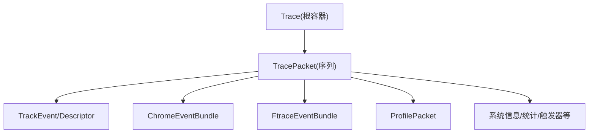
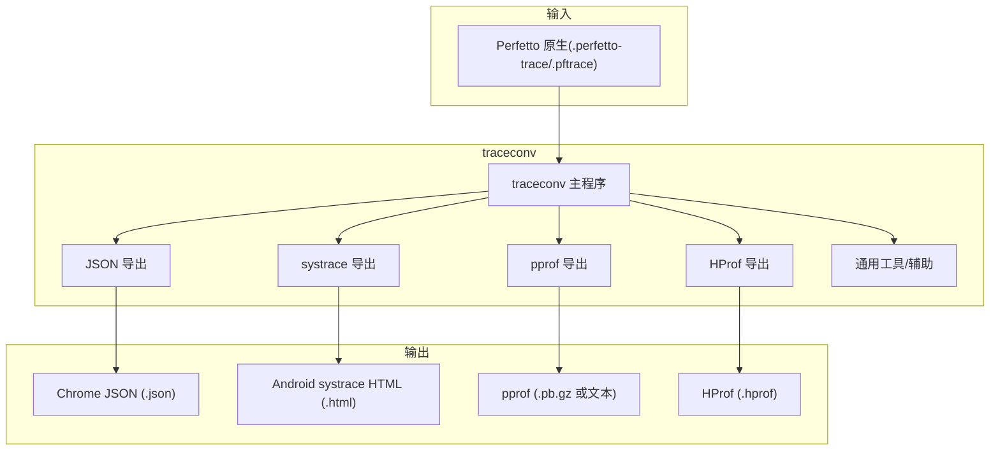
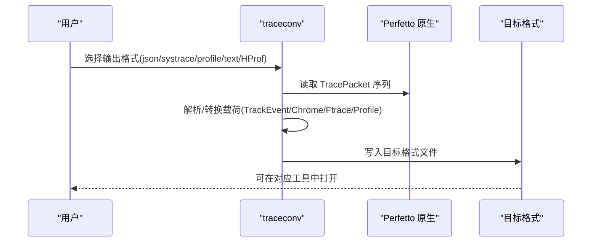

# 数据格式规范

<cite>
**本文引用的文件**
- [docs/quickstart/traceconv.md](file://docs/quickstart/traceconv.md)
- [docs/getting-started/converting.md](file://docs/getting-started/converting.md)
- [docs/getting-started/other-formats.md](file://docs/getting-started/other-formats.md)
- [docs/getting-started/chrome-tracing.md](file://docs/getting-started/chrome-tracing.md)
- [docs/getting-started/atrace.md](file://docs/getting-started/atrace.md)
- [protos/perfetto/trace/trace.proto](file://protos/perfetto/trace/trace.proto)
- [protos/perfetto/trace/trace_packet.proto](file://protos/perfetto/trace/trace_packet.proto)
- [protos/perfetto/trace/track_event/track_event.proto](file://protos/perfetto/trace/track_event/track_event.proto)
- [protos/perfetto/trace/track_event/track_descriptor.proto](file://protos/perfetto/trace/track_event/track_descriptor.proto)
- [protos/perfetto/trace/chrome/chrome_trace_event.proto](file://protos/perfetto/trace/chrome/chrome_trace_event.proto)
- [protos/perfetto/trace/profiling/profile_packet.proto](file://protos/perfetto/trace/profiling/profile_packet.proto)
- [protos/perfetto/trace/profiling/profile_common.proto](file://protos/perfetto/trace/profiling/profile_common.proto)
- [src/traceconv/traceconv.cc](file://src/traceconv/traceconv.cc)
- [src/traceconv/trace_to_json.cc](file://src/traceconv/trace_to_json.cc)
- [src/traceconv/trace_to_systrace.cc](file://src/traceconv/trace_to_systrace.cc)
- [src/traceconv/trace_to_profile.cc](file://src/traceconv/trace_to_profile.cc)
- [src/traceconv/trace_to_hprof.cc](file://src/traceconv/trace_to_hprof.cc)
- [src/traceconv/utils.cc](file://src/traceconv/utils.cc)
- [src/traceconv/utils.h](file://src/traceconv/utils.h)
- [docs/reference/heap_profile-cli.md](file://docs/reference/heap_profile-cli.md)
</cite>

## 目录
1. [简介](#简介)
2. [项目结构与范围](#项目结构与范围)
3. [核心组件与数据模型](#核心组件与数据模型)
4. [架构总览](#架构总览)
5. [详细格式规范](#详细格式规范)
6. [依赖关系与兼容性](#依赖关系与兼容性)
7. [性能特征与适用场景](#性能特征与适用场景)
8. [故障排查与验证](#故障排查与验证)
9. [结论](#结论)
10. [附录：格式选择指南](#附录格式选择指南)

## 简介
本规范系统梳理 Perfetto 支持的所有输入输出数据格式，覆盖原生 Perfetto 二进制格式（Trace/TracePacket）、Chrome JSON 格式、Android systrace HTML、Firefox Profiler JSON、Linux perf 文本与简单 perf 原型、Android ART 方法跟踪、macOS Instruments XML、以及 Ninja 构建日志等。文档从数据结构、编码方式、压缩与文件布局、转换工具链、版本演进与兼容性、验证与诊断、性能特征与场景建议等方面进行深入说明，并提供格式选择指南。

## 项目结构与范围
- 原生格式定义集中在 Protobuf 模型中，核心消息为 Trace 与 TracePacket，后者承载各类事件与元数据。
- 外部格式通过 traceconv 工具实现导入/导出，涵盖 JSON、systrace、pprof、HProf 等。
- 文档与示例位于 docs 目录，提供 UI/Trace Processor 的解析能力说明与生成流程。

图示来源
- [protos/perfetto/trace/trace.proto:23-31](file://protos/perfetto/trace/trace.proto#L23-L31)
- [protos/perfetto/trace/trace_packet.proto:121-306](file://protos/perfetto/trace/trace_packet.proto#L121-L306)

章节来源
- [protos/perfetto/trace/trace.proto:23-31](file://protos/perfetto/trace/trace.proto#L23-L31)
- [protos/perfetto/trace/trace_packet.proto:121-306](file://protos/perfetto/trace/trace_packet.proto#L121-L306)

## 核心组件与数据模型
- Trace/TracePacket：原生 Perfetto 文件由若干 TracePacket 组成，每个包可携带多种类型的数据载荷（如 TrackEvent、ChromeEvent、FtraceEvent、ProfilePacket 等）。
- TrackEvent/TrackDescriptor：用于合成时间线切片、计数器、流连接等可视化元素；TrackDescriptor 描述轨道层次与分组。
- ChromeTraceEvent：Chrome JSON 的事件模型映射到 Perfetto 的 ChromeEventBundle。
- ProfilePacket/ProfileCommon：CPU/堆采样与调用栈在 Perfetto 中以 ProfilePacket 存储，支持聚合为 pprof。

章节来源
- [protos/perfetto/trace/trace.proto:23-31](file://protos/perfetto/trace/trace.proto#L23-L31)
- [protos/perfetto/trace/trace_packet.proto:152-306](file://protos/perfetto/trace/trace_packet.proto#L152-L306)
- [protos/perfetto/trace/track_event/track_event.proto](file://protos/perfetto/trace/track_event/track_event.proto)
- [protos/perfetto/trace/track_event/track_descriptor.proto](file://protos/perfetto/trace/track_event/track_descriptor.proto)
- [protos/perfetto/trace/chrome/chrome_trace_event.proto](file://protos/perfetto/trace/chrome/chrome_trace_event.proto)
- [protos/perfetto/trace/profiling/profile_packet.proto](file://protos/perfetto/trace/profiling/profile_packet.proto)
- [protos/perfetto/trace/profiling/profile_common.proto](file://protos/perfetto/trace/profiling/profile_common.proto)

## 架构总览
下图展示 traceconv 转换工具如何将 Perfetto 原生格式转换为外部格式，以及各格式的典型用途与限制。

图示来源
- [docs/quickstart/traceconv.md:1-46](file://docs/quickstart/traceconv.md#L1-L46)
- [src/traceconv/traceconv.cc](file://src/traceconv/traceconv.cc)
- [src/traceconv/trace_to_json.cc](file://src/traceconv/trace_to_json.cc)
- [src/traceconv/trace_to_systrace.cc](file://src/traceconv/trace_to_systrace.cc)
- [src/traceconv/trace_to_profile.cc](file://src/traceconv/trace_to_profile.cc)
- [src/traceconv/trace_to_hprof.cc](file://src/traceconv/trace_to_hprof.cc)
- [src/traceconv/utils.cc](file://src/traceconv/utils.cc)
- [src/traceconv/utils.h](file://src/traceconv/utils.h)

## 详细格式规范

### 原生 Perfetto 格式（Trace/TracePacket）
- 文件扩展名：.perfetto-trace 或 .pftrace
- 结构：Trace 包含一个 TracePacket 序列；每个 TracePacket 可承载多种数据载荷（TrackEvent、ChromeEvent、FtraceEvent、ProfilePacket 等）。
- 时间戳与时钟域：TracePacket 支持指定 timestamp_clock_id，默认 BOOTTIME；可通过 ClockSnapshot/默认值调整单位与绝对/相对编码。
- 内容内联与增量状态：支持 InternedData、TracePacketDefaults、SequenceFlags 等机制保证高效序列化与顺序一致性。
- 压缩：TracePacket 支持 compressed_packets 字段，采用 deflate 压缩，单个压缩包大小受约束。
- 同步标记：周期性插入同步标记字节，便于大文件分区与快速定位。

章节来源
- [protos/perfetto/trace/trace.proto:23-31](file://protos/perfetto/trace/trace.proto#L23-L31)
- [protos/perfetto/trace/trace_packet.proto:137-150](file://protos/perfetto/trace/trace_packet.proto#L137-L150)
- [protos/perfetto/trace/trace_packet.proto:234-237](file://protos/perfetto/trace/trace_packet.proto#L234-L237)
- [protos/perfetto/trace/trace_packet.proto:342-368](file://protos/perfetto/trace/trace_packet.proto#L342-L368)

### Chrome JSON 格式
- 描述：基于 JSON 数组的事件对象，常见字段包括 pid、tid、ts（微秒）、ph（阶段：B/E/X/I/C/M/s/t/f）、name、cat、args 等。
- 兼容性与限制：严格嵌套 B/E 对；重叠非嵌套事件可能不被正确渲染；对部分 JSON 特性支持有限。
- UI/Trace Processor：UI 支持切片、计数器、元数据、流事件；Trace Processor 解析为标准表（slice、track、process、thread、counter、args）。

章节来源
- [docs/getting-started/other-formats.md:34-104](file://docs/getting-started/other-formats.md#L34-L104)

### Android systrace HTML
- 描述：旧版 Android 系统级跟踪工具，通常生成包含嵌入 ftrace 与 ATrace 数据的交互式 HTML。
- 兼容性：主要用于历史数据兼容；新 Android 版本推荐使用 Perfetto。
- UI/Trace Processor：可直接打开 HTML 并解析其中 ftrace 文本；Trace Processor 将 ftrace 事件导入标准表。

章节来源
- [docs/getting-started/other-formats.md:276-333](file://docs/getting-started/other-formats.md#L276-L333)

### Firefox Profiler JSON
- 描述：主要面向 CPU 采样与调用栈，支持“传统字符串表+schema/data”与“预处理数组列”两种变体。
- 兼容性：仅 CPU 样本导入；不支持 Firefox Profiler 的 markers 与浏览器特定元数据。
- UI/Trace Processor：导入为 perf_sample、stack_profile_* 等表，支持火焰图可视化。

章节来源
- [docs/getting-started/other-formats.md:105-275](file://docs/getting-started/other-formats.md#L105-L275)

### Linux perf 文本（perf script 输出）
- 描述：perf script 的人类可读输出，常包含 CPU 样本、调用栈、时间戳、进程/线程标识等。
- 兼容性：主要导入 CPU 样本与调用栈；高度定制化的输出可能解析失败；建议转换为 Firefox Profiler JSON 以获得更丰富功能。
- UI/Trace Processor：导入到 cpu_profile_* 与 stack_profile_* 表，支持火焰图与 SQL 查询。

章节来源
- [docs/getting-started/other-formats.md:334-432](file://docs/getting-started/other-formats.md#L334-L432)

### Simpleperf 原型（Android）
- 描述：Android 上基于 Linux perf 的原型格式，包含 CPU 样本、调用栈、符号表与文件映射。
- 兼容性：上下文切换记录与事件元数据尚不导入。
- UI/Trace Processor：导入到 cpu_profile_stack_sample 与 stack_profile_* 表，支持火焰图与 SQL 查询。

章节来源
- [docs/getting-started/other-formats.md:433-506](file://docs/getting-started/other-formats.md#L433-L506)

### Linux ftrace 文本
- 描述：内核 ftrace 的原始文本输出，按行呈现事件，如 sched_switch、print 等。
- 兼容性：主要用于历史兼容；建议优先使用 Perfetto 原生 ftrace 数据源。
- UI/Trace Processor：识别的事件（如 sched_switch、print）导入到相应表；通用事件不进入宽泛的 ftrace_event 表。

章节来源
- [docs/getting-started/other-formats.md:507-606](file://docs/getting-started/other-formats.md#L507-L606)

### ART 方法跟踪（.trace）
- 描述：Android ART 的二进制方法跟踪文件，记录 Java/Kotlin 方法的入口/出口。
- 兼容性：高开销，可能改变被测行为；建议使用采样或系统级调用栈。
- UI/Trace Processor：导入为 slice 表，支持 SQL 分析。

章节来源
- [docs/getting-started/other-formats.md:607-690](file://docs/getting-started/other-formats.md#L607-L690)

### macOS Instruments XML
- 描述：从 Instruments 导出的 XML，主要用于提取 CPU 采样与调用栈。
- 兼容性：主要导入 CPU 样本；其他 Instruments 数据类型支持有限。
- UI/Trace Processor：导入到 cpu_profile_* 与 stack_profile_* 表。

章节来源
- [docs/getting-started/other-formats.md:691-740](file://docs/getting-started/other-formats.md#L691-L740)

### Ninja 日志（.ninja_log）
- 描述：Ninja 构建系统的日志文件，记录命令的起止时间、输出文件、命令哈希等。
- 兼容性：仅记录已完成命令；无法直接表达依赖关系。
- UI/Trace Processor：导入为 slice 表，按时间轴可视化构建步骤。

章节来源
- [docs/getting-started/other-formats.md:740-795](file://docs/getting-started/other-formats.md#L740-L795)

### Chrome 浏览器记录（UI/CLI）
- 描述：Perfetto UI 可直接从桌面 Chrome 捕获跨标签页的 trace；支持配置与自动化。
- 使用要点：注意隐私信息暴露风险，分享前审阅内容。

章节来源
- [docs/getting-started/chrome-tracing.md:1-83](file://docs/getting-started/chrome-tracing.md#L1-L83)

### ATrace 注入与记录
- 描述：Android 平台早期的注释 API，仍与 Perfetto 互操作良好；支持线程内切片、计数器与跨线程异步切片。
- 差异：平台私有 API 可指定 tag，SDK/NDK 默认使用 TRACE_TAG_APP。
- 记录：需启用 linux.ftrace 数据源并在 ftrace_config 中配置 atrace_categories 或 atrace_apps。

章节来源
- [docs/getting-started/atrace.md:1-528](file://docs/getting-started/atrace.md#L1-L528)

### HProf（Java 堆快照）
- 描述：Java 堆快照格式，Perfetto 通过 heapprofd 采集并支持导出为 HProf。
- CLI：heap_profile 工具支持采样间隔、持续时间、进程筛选、连续转储等参数。
- 适用：内存剖析与堆图分析。

章节来源
- [docs/reference/heap_profile-cli.md:1-100](file://docs/reference/heap_profile-cli.md#L1-L100)
- [src/traceconv/trace_to_hprof.cc](file://src/traceconv/trace_to_hprof.cc)

## 依赖关系与兼容性

### traceconv 工具链
- 输入：Perfetto 原生 .perfetto-trace/.pftrace
- 输出：text（文本 proto）、json（Chrome JSON）、systrace（ftrace 文本）、profile（pprof）
- 限制：pprof 导出支持 heapprofd、perf、Android Java 堆图等聚合；HProf 导出由专用模块负责。

图示来源
- [docs/quickstart/traceconv.md:1-46](file://docs/quickstart/traceconv.md#L1-L46)
- [src/traceconv/traceconv.cc](file://src/traceconv/traceconv.cc)
- [src/traceconv/trace_to_json.cc](file://src/traceconv/trace_to_json.cc)
- [src/traceconv/trace_to_systrace.cc](file://src/traceconv/trace_to_systrace.cc)
- [src/traceconv/trace_to_profile.cc](file://src/traceconv/trace_to_profile.cc)
- [src/traceconv/trace_to_hprof.cc](file://src/traceconv/trace_to_hprof.cc)

### 外部格式导入/导出兼容性矩阵（摘要）
- Chrome JSON：UI/TP 完整支持；严格嵌套 B/E；重叠事件可能受限。
- Firefox Profiler JSON：CPU 样本导入为主；markers 与浏览器元数据不导入。
- systrace HTML：历史兼容；建议使用 Perfetto 新方案。
- perf 文本：CPU 样本导入；定制化输出可能不兼容。
- simpleperf 原型：CPU 样本与调用栈导入；上下文切换与事件元数据尚不导入。
- ftrace 文本：历史兼容；建议使用 Perfetto 原生 ftrace。
- ART .trace：方法级切片导入；高开销。
- Instruments XML：CPU 样本导入为主；其他类型支持有限。
- Ninja .ninja_log：构建步骤切片导入；无依赖表达。
- HProf：heapprofd 采集后导出；支持堆图分析。

章节来源
- [docs/getting-started/other-formats.md:34-795](file://docs/getting-started/other-formats.md#L34-L795)
- [docs/reference/heap_profile-cli.md:1-100](file://docs/reference/heap_profile-cli.md#L1-L100)

## 性能特征与适用场景
- 原生 Perfetto（Trace/TracePacket）
  - 特征：二进制紧凑、支持压缩、时钟域灵活、增量内联数据减少冗余。
  - 场景：系统级全量追踪、大规模并发数据源、低开销录制与高性能分析。
- Chrome JSON
  - 特征：易生成、生态广泛；严格嵌套要求。
  - 场景：第三方工具输出、DevTools 导出、遗留数据。
- systrace HTML
  - 特征：历史兼容；新版本已弃用。
  - 场景：旧版 Android 数据回溯。
- Firefox Profiler JSON
  - 特征：CPU 样本丰富；不支持 markers。
  - 场景：Linux/Android perf 到 Firefox Profiler 的桥接。
- perf 文本
  - 特征：灵活但解析依赖格式；建议转换为 pprof。
  - 场景：快速检查与火焰图脚本。
- simpleperf 原型
  - 特征：Android 采样；上下文切换与事件元数据待完善。
  - 场景：Android CPU 分析。
- ftrace 文本
  - 特征：原始文本；建议使用原生 ftrace。
  - 场景：历史日志分析。
- ART .trace
  - 特征：方法级精确；开销高。
  - 场景：深度 Java/Kotlin 方法剖析。
- Instruments XML
  - 特征：CPU 样本导入为主。
  - 场景：macOS CPU 分析。
- Ninja .ninja_log
  - 特征：构建步骤切片；无依赖。
  - 场景：构建性能分析。
- HProf
  - 特征：堆快照；适合堆图分析。
  - 场景：Java 堆内存剖析。

## 故障排查与验证
- 验证与诊断
  - UI 打开：在 ui.perfetto.dev 打开目标文件，观察事件是否正确显示。
  - Trace Processor：使用 SQL 查询关键表（如 slice、counter、process、thread、ftrace_event、perf_sample 等）。
  - traceconv：确认输入格式与输出格式匹配；必要时使用 --print-config 或本地调试选项。
  - 常见问题：
    - Chrome JSON 重叠事件未正确显示：严格嵌套要求。
    - Firefox Profiler markers 不导入：仅 CPU 样本导入。
    - systrace 为历史格式：建议迁移至 Perfetto。
    - perf 文本定制化导致解析失败：转换为 pprof。
- 建议流程
  - 先用 UI 快速定位异常事件类型；
  - 再用 Trace Processor SQL 进行结构化验证；
  - 最后使用 traceconv 导出到目标格式进行交叉验证。

章节来源
- [docs/getting-started/other-formats.md:71-84](file://docs/getting-started/other-formats.md#L71-L84)
- [docs/quickstart/traceconv.md:1-46](file://docs/quickstart/traceconv.md#L1-L46)

## 结论
Perfetto 在多格式支持方面具备强大的生态适配能力：既能作为统一的原生格式承载丰富的系统与应用事件，又能通过 traceconv 将其转换为业界广泛接受的 JSON、systrace、pprof、HProf 等格式。针对不同场景（系统级全量追踪、CPU/内存采样、构建性能、浏览器分析等），应优先选择原生格式以获得最佳性能与功能完整性，同时在需要与其他工具链协作时使用相应的导出格式。

## 附录：格式选择指南
- 需要系统级全量追踪且追求低开销与高性能分析：首选原生 Perfetto（.perfetto-trace/.pftrace）。
- 需要与 Chrome DevTools/About:Tracing 生态互通：使用 Chrome JSON（.json）。
- 需要历史 systrace 数据兼容：使用 systrace HTML（.html），但建议迁移至 Perfetto。
- 需要 CPU 样本与火焰图：优先 Firefox Profiler JSON；或转换为 pprof。
- Android CPU 分析：simpleperf 原型；或使用 heapprofd 生成 HProf。
- ART 方法级剖析：使用 ART .trace，但注意高开销。
- macOS CPU 分析：使用 Instruments XML。
- 构建性能分析：使用 Ninja .ninja_log。
- 跨平台/遗留数据：先尝试 Chrome JSON；若为 Linux perf 文本，建议转换为 pprof。