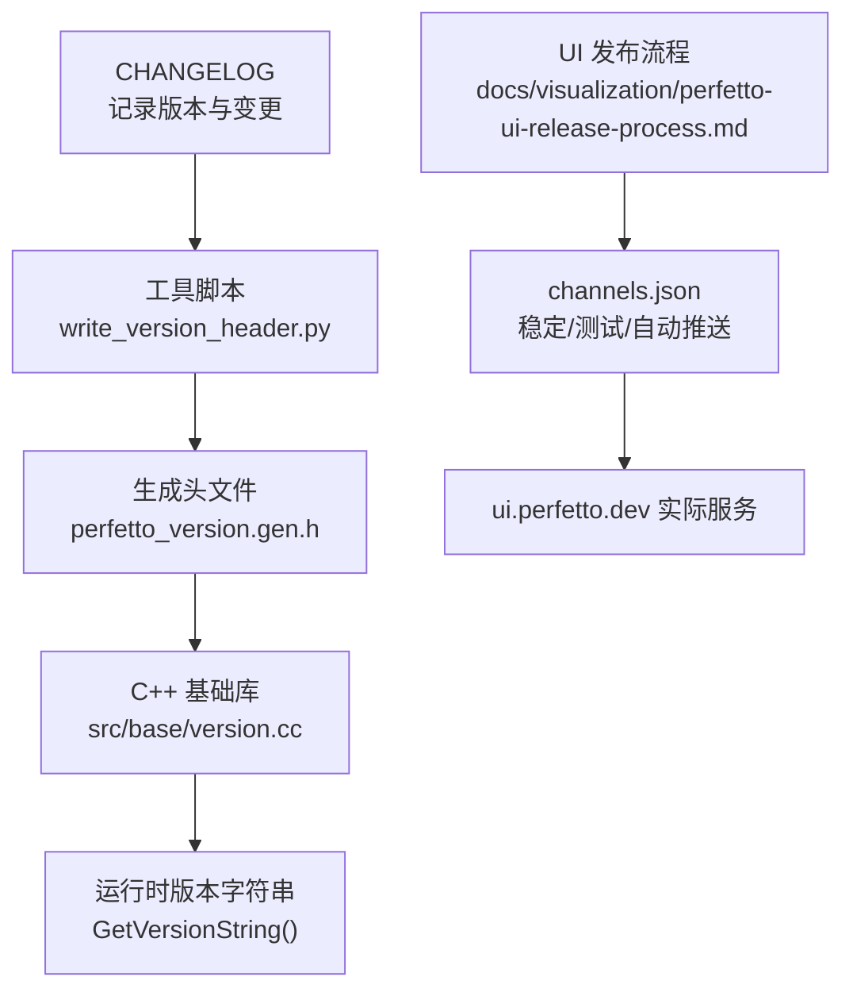
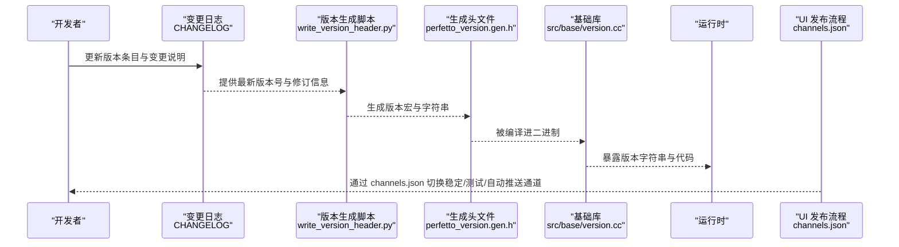
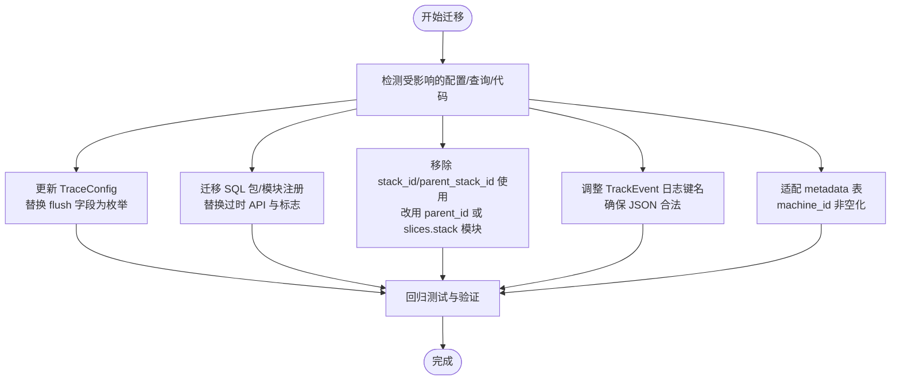
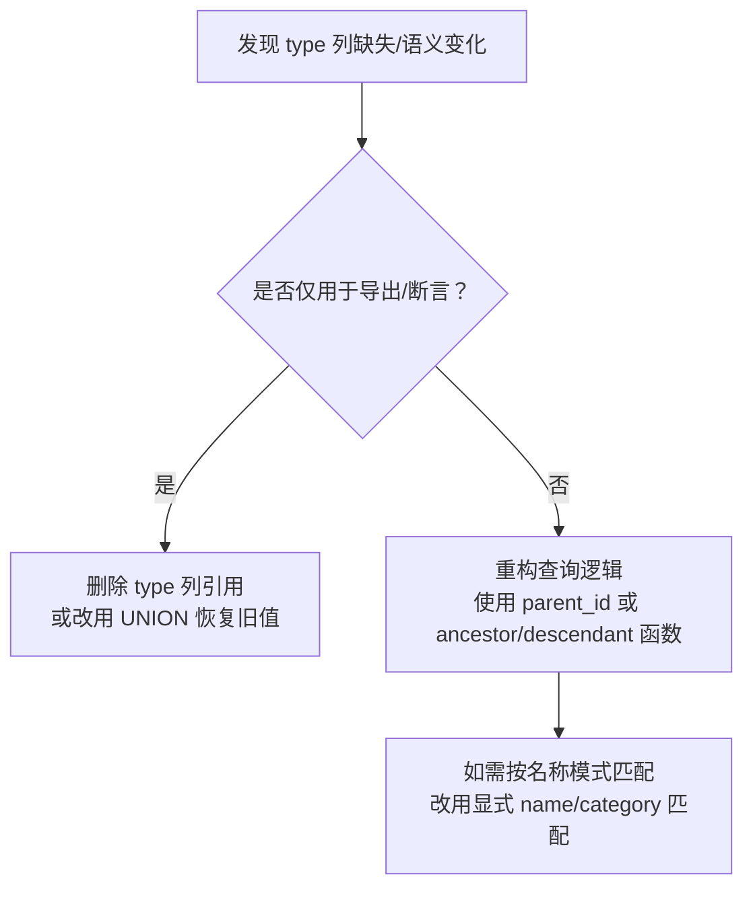
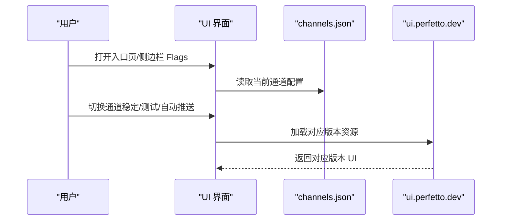
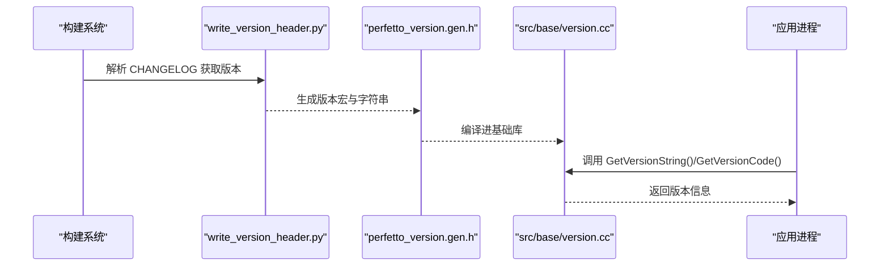
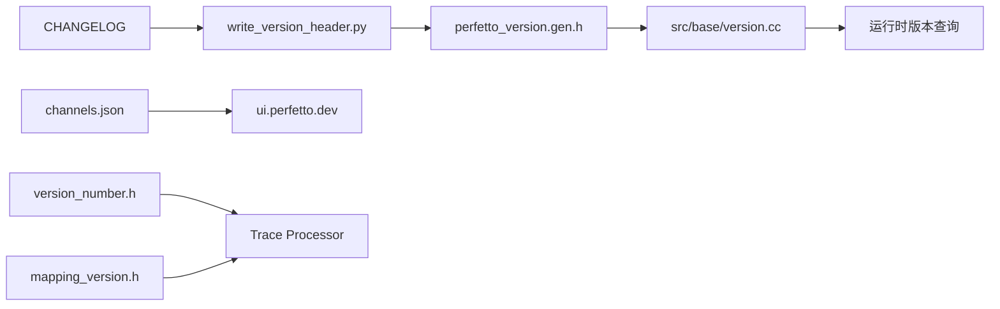

# 版本兼容性

<cite>
**本文引用的文件**
- [CHANGELOG](file://CHANGELOG)
- [src/base/version.cc](file://src/base/version.cc)
- [gn/gen_perfetto_version_header.gni](file://gn/gen_perfetto_version_header.gni)
- [docs/analysis/perfetto-sql-backcompat.md](file://docs/analysis/perfetto-sql-backcompat.md)
- [docs/reference/android-version-notes.md](file://docs/reference/android-version-notes.md)
- [docs/visualization/perfetto-ui-release-process.md](file://docs/visualization/perfetto-ui-release-process.md)
- [python/tools/update_permalink.py](file://python/tools/update_permalink.py)
- [src/trace_processor/types/version_number.h](file://src/trace_processor/types/version_number.h)
- [src/trace_processor/importers/etm/mapping_version.h](file://src/trace_processor/importers/etm/mapping_version.h)
</cite>

## 目录
1. [简介](#简介)
2. [项目结构与版本标识](#项目结构与版本标识)
3. [核心组件与版本管理](#核心组件与版本管理)
4. [架构总览](#架构总览)
5. [详细组件分析](#详细组件分析)
6. [依赖关系分析](#依赖关系分析)
7. [性能考量](#性能考量)
8. [故障排查指南](#故障排查指南)
9. [结论](#结论)
10. [附录：版本选择与升级指南](#附录版本选择与升级指南)

## 简介
本文件面向使用 Perfetto 的工程师与平台维护者，系统梳理仓库中的版本兼容性策略、破坏性变更与迁移路径、UI 发布通道与回滚机制、以及面向不同场景（Android、Linux、Chrome）的版本注意事项。文档基于仓库内的变更日志、版本生成脚本与发布流程文档，结合 Trace Processor 的内部版本号与映射版本头文件，给出可操作的升级与迁移建议。

## 项目结构与版本标识
Perfetto 在构建阶段从变更日志中解析当前版本号，并在运行时通过基础库暴露版本字符串；同时 UI 有独立的三通道发布流程。下图展示了版本标识与生成的关键位置：

**图表来源**
- [CHANGELOG](file://CHANGELOG)
- [gn/gen_perfetto_version_header.gni](file://gn/gen_perfetto_version_header.gni)
- [src/base/version.cc](file://src/base/version.cc)
- [docs/visualization/perfetto-ui-release-process.md](file://docs/visualization/perfetto-ui-release-process.md)

**章节来源**
- [CHANGELOG](file://CHANGELOG)
- [gn/gen_perfetto_version_header.gni](file://gn/gen_perfetto_version_header.gni)
- [src/base/version.cc](file://src/base/version.cc)
- [docs/visualization/perfetto-ui-release-process.md](file://docs/visualization/perfetto-ui-release-process.md)

## 核心组件与版本管理
- 变更日志驱动版本号生成：构建系统读取变更日志以生成版本宏，供 C++ 与 TypeScript 使用。
- 运行时版本查询：基础库提供版本字符串与版本代码的查询接口。
- UI 发布通道：稳定版（约四周一更）、测试版（约一周一更）、自动推送 HEAD 版本。
- Trace Processor 内部版本号与映射版本：用于追踪导入器与映射规则的演进，确保跨版本兼容。

**章节来源**
- [gn/gen_perfetto_version_header.gni](file://gn/gen_perfetto_version_header.gni)
- [src/base/version.cc](file://src/base/version.cc)
- [docs/visualization/perfetto-ui-release-process.md](file://docs/visualization/perfetto-ui-release-process.md)
- [src/trace_processor/types/version_number.h](file://src/trace_processor/types/version_number.h)
- [src/trace_processor/importers/etm/mapping_version.h](file://src/trace_processor/importers/etm/mapping_version.h)

## 架构总览
下图展示版本信息在构建与运行时的流转，以及 UI 的发布通道与回溯机制：

**图表来源**
- [CHANGELOG](file://CHANGELOG)
- [gn/gen_perfetto_version_header.gni](file://gn/gen_perfetto_version_header.gni)
- [src/base/version.cc](file://src/base/version.cc)
- [docs/visualization/perfetto-ui-release-process.md](file://docs/visualization/perfetto-ui-release-process.md)

## 详细组件分析

### 组件A：破坏性变更与迁移指南（以 v54.0 为例）
v54.0 引入了多项破坏性变更，涉及 TraceConfig、Trace Processor 表结构、SQL 标准库与 UI 行为。以下为关键变更与迁移要点：

- TraceConfig 变更
  - 移除旧的 flush 控制字段，引入新的枚举以精细化控制写入与刷新行为。
  - traced_relay 用户需显式开启“对所有机器进行匹配”的选项以恢复旧行为。
  - 新增命令行选项防止覆盖已有文件。
- Trace Processor 变更
  - 移除了过时的 SQL 模块注册 API 与其 Shell 标志，改用新的包级 API。
  - 移除 slice 表中的 stack_id 与 parent_stack_id 列，相关函数迁移到 slices.stack 标准库模块。
  - TrackEvent 日志消息解析键名调整，确保参数集合可转为合法 JSON。
  - metadata 表重构以支持多 Trace 与多机器上下文，machine_id 成为非空列。
  - 支持 Collapsed Stack 与 Firefox Profiler 预处理 JSON 格式。
- SQL 标准库变更
  - 新增 heap_graph_stats 模块与 dmabuf 支持。
  - android_anrs 表新增 intent 与 component 列。
  - 废弃 UINT/INT 整数类型与 FLOAT 浮点类型，推荐使用 LONG/DOUBLE/TIMESTAMP/DURATION 等新类型。
- UI 变更
  - 支持直接通过 URL 参数打开公开 trace。
  - 堆分析可视化改为按时间段快照聚合。
  - 录制页面提供常见问题的预设配置。
  - 数据网格增强（透视表、过滤器、去重选择器等）。
  - 性能优化：搜索、参数值渲染、长时段平移缩放抖动降低。

**图表来源**
- [CHANGELOG](file://CHANGELOG)
- [docs/analysis/perfetto-sql-backcompat.md](file://docs/analysis/perfetto-sql-backcompat.md)

**章节来源**
- [CHANGELOG](file://CHANGELOG)
- [docs/analysis/perfetto-sql-backcompat.md](file://docs/analysis/perfetto-sql-backcompat.md)

### 组件B：SQL 兼容性与回退指南（以 v49.0 与 v54.0 为例）
- v49.0：移除非 track 表的 type 列；track 表的 type 列语义改为“轨道数据类型”而非“最具体表名”。迁移建议包括直接查询具体表或通过 UNION 恢复旧 type 值。
- v54.0：移除 slice 表的 stack_id 与 parent_stack_id 列，相关函数迁移到 slices.stack 模块；提供迁移辅助但注意新旧哈希算法差异导致的不兼容。

**图表来源**
- [docs/analysis/perfetto-sql-backcompat.md](file://docs/analysis/perfetto-sql-backcompat.md)

**章节来源**
- [docs/analysis/perfetto-sql-backcompat.md](file://docs/analysis/perfetto-sql-backcompat.md)

### 组件C：UI 发布通道与回溯（稳定/测试/自动推送）
- 稳定版：默认服务，约四周一更新，适合生产环境。
- 测试版：更频繁更新，适合早期采用者与集成测试。
- 自动推送：HEAD 版本，不稳定，适合贡献者与内测。
- 回溯与切换：可通过界面切换通道，或通过 flags 页面选择 autopush；版本号显示在底部左下角，点击可跳转到对应提交。

**图表来源**
- [docs/visualization/perfetto-ui-release-process.md](file://docs/visualization/perfetto-ui-release-process.md)

**章节来源**
- [docs/visualization/perfetto-ui-release-process.md](file://docs/visualization/perfetto-ui-release-process.md)

### 组件D：运行时版本查询与构建集成
- 构建阶段：通过工具脚本从变更日志提取版本号与修订信息，生成 C++/TypeScript 版本头文件。
- 运行时：基础库提供版本字符串与版本代码查询接口，便于诊断与日志输出。

**图表来源**
- [gn/gen_perfetto_version_header.gni](file://gn/gen_perfetto_version_header.gni)
- [src/base/version.cc](file://src/base/version.cc)

**章节来源**
- [gn/gen_perfetto_version_header.gni](file://gn/gen_perfetto_version_header.gni)
- [src/base/version.cc](file://src/base/version.cc)

### 组件E：Android 版本注意事项与破坏性变更
- 不同 Android 版本存在功能差异与已知缺陷，例如某些触发模式在特定版本不存在或存在边缘情况，需要在配置下发时规避。
- 旧版本设备可能不支持某些 CLI 选项（如二进制配置限制），需在集成时考虑降级策略。

**章节来源**
- [docs/reference/android-version-notes.md](file://docs/reference/android-version-notes.md)

## 依赖关系分析
- 版本生成链路：CHANGELOG → 工具脚本 → 头文件 → 基础库 → 运行时。
- UI 通道：channels.json → 服务端部署 → 用户访问。
- Trace Processor：内部版本号与映射版本头文件用于追踪导入器与映射规则演进，避免跨版本数据模型不一致。

**图表来源**
- [CHANGELOG](file://CHANGELOG)
- [gn/gen_perfetto_version_header.gni](file://gn/gen_perfetto_version_header.gni)
- [src/base/version.cc](file://src/base/version.cc)
- [docs/visualization/perfetto-ui-release-process.md](file://docs/visualization/perfetto-ui-release-process.md)
- [src/trace_processor/types/version_number.h](file://src/trace_processor/types/version_number.h)
- [src/trace_processor/importers/etm/mapping_version.h](file://src/trace_processor/importers/etm/mapping_version.h)

**章节来源**
- [CHANGELOG](file://CHANGELOG)
- [gn/gen_perfetto_version_header.gni](file://gn/gen_perfetto_version_header.gni)
- [src/base/version.cc](file://src/base/version.cc)
- [docs/visualization/perfetto-ui-release-process.md](file://docs/visualization/perfetto-ui-release-process.md)
- [src/trace_processor/types/version_number.h](file://src/trace_processor/types/version_number.h)
- [src/trace_processor/importers/etm/mapping_version.h](file://src/trace_processor/importers/etm/mapping_version.h)

## 性能考量
- Trace Processor 在多个版本中持续优化数据结构与查询执行，显著提升大 Trace 加载与查询性能。
- UI 在 v52 起引入暗色主题、批量轨道设置、启动命令等，同时修复大量崩溃与性能问题。
- 建议在升级前评估自身 Trace 规模与查询复杂度，优先升级到包含性能改进的版本。

[本节为通用指导，无需列出具体文件来源]

## 故障排查指南
- UI 版本与通道
  - 若遇到 UI 行为异常，先确认当前通道（稳定/测试/自动推送），必要时切换至稳定版定位问题。
  - 版本号显示于界面右下角，点击可直达对应提交。
- 运行时版本
  - 通过基础库接口获取版本字符串，便于在日志与诊断报告中附带版本信息。
- Permalink 状态迁移
  - 对于使用 Permalink 的用户，若状态版本落后，可使用工具脚本进行升级，逐步应用迁移函数。

**章节来源**
- [docs/visualization/perfetto-ui-release-process.md](file://docs/visualization/perfetto-ui-release-process.md)
- [src/base/version.cc](file://src/base/version.cc)
- [python/tools/update_permalink.py](file://python/tools/update_permalink.py)

## 结论
Perfetto 的版本兼容性策略强调最小化破坏性变更，并通过变更日志、SQL 兼容性文档与 UI 发布通道提供清晰的迁移路径与回溯手段。建议在升级前对照变更日志与 SQL 兼容性说明，优先升级到包含关键性能改进与安全修复的版本，并在测试环境中充分验证后再推广到生产。

[本节为总结性内容，无需列出具体文件来源]

## 附录：版本选择与升级指南

### 版本选择建议
- 生产环境优先选择“稳定版”，获得最长稳定性保障。
- 开发与集成测试可选用“测试版”，以尽早验证新功能与修复。
- 贡献者与内测用户可使用“自动推送”通道，获取最新功能与修复。

**章节来源**
- [docs/visualization/perfetto-ui-release-process.md](file://docs/visualization/perfetto-ui-release-process.md)

### 升级步骤与迁移清单
- 读取最新变更日志，识别影响范围（配置、SQL 查询、SDK 接口、UI 插件）。
- 配置迁移
  - 替换 TraceConfig 中的旧 flush 字段为新枚举。
  - traced_relay 用户启用“对所有机器进行匹配”以恢复旧行为。
  - 新增命令行选项防止覆盖已有文件。
- SQL 迁移
  - 升级到新的包级 API，替换过时的模块注册与 Shell 标志。
  - 移除对 stack_id/parent_stack_id 的依赖，改用 parent_id 或 slices.stack 模块。
  - 调整 TrackEvent 日志键名，确保参数集合可转为合法 JSON。
  - 适配 metadata 表与 machine_id 非空化。
  - 如需保留旧 type 列行为，使用 UNION 方案恢复。
- UI 与插件
  - 切换至目标通道进行集成测试，关注暗色主题、批量设置、启动命令等功能。
  - 若使用 Permalink，使用状态升级工具逐步迁移。
- Android 平台
  - 避免在不支持的版本上使用特定触发模式或 CLI 选项，必要时做降级处理。

**章节来源**
- [CHANGELOG](file://CHANGELOG)
- [docs/analysis/perfetto-sql-backcompat.md](file://docs/analysis/perfetto-sql-backcompat.md)
- [docs/reference/android-version-notes.md](file://docs/reference/android-version-notes.md)
- [docs/visualization/perfetto-ui-release-process.md](file://docs/visualization/perfetto-ui-release-process.md)
- [python/tools/update_permalink.py](file://python/tools/update_permalink.py)