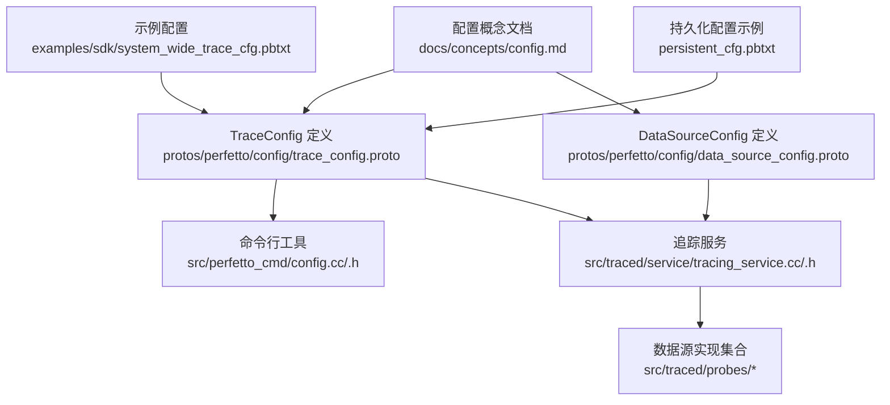
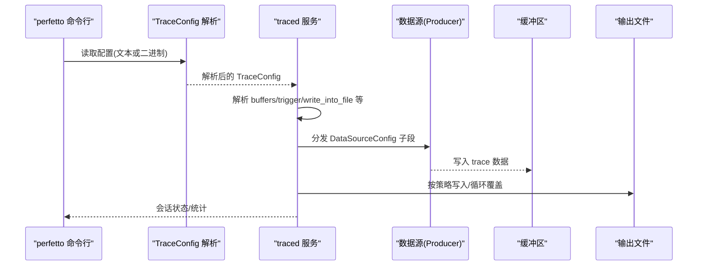
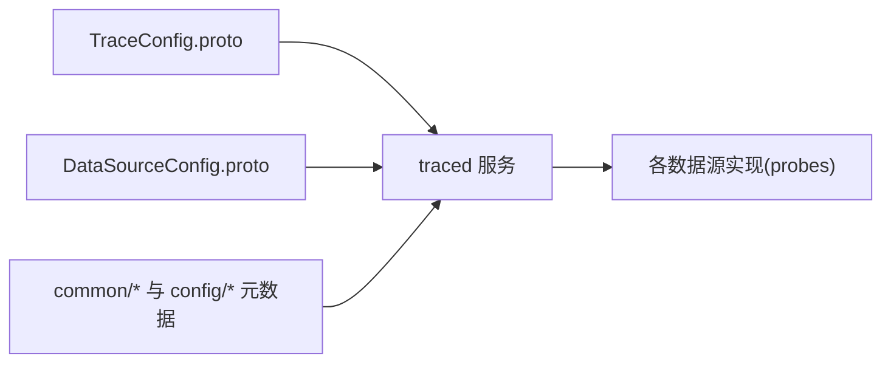

# 配置选项参考

<cite>
**本文引用的文件**
- [README.md](file://README.md)
- [docs/concepts/config.md](file://docs/concepts/config.md)
- [examples/sdk/system_wide_trace_cfg.pbtxt](file://examples/sdk/system_wide_trace_cfg.pbtxt)
- [persistent_cfg.pbtxt](file://persistent_cfg.pbtxt)
- [protos/perfetto/config/trace_config.proto](file://protos/perfetto/config/trace_config.proto)
- [protos/perfetto/config/data_source_config.proto](file://protos/perfetto/config/data_source_config.proto)
- [protos/perfetto/common/data_source_descriptor.proto](file://protos/perfetto/common/data_source_descriptor.proto)
- [protos/perfetto/common/trace_stats.proto](file://protos/perfetto/common/trace_stats.proto)
- [protos/perfetto/common/trace_attributes.proto](file://protos/perfetto/common/trace_attributes.proto)
- [protos/perfetto/common/commit_data_request.proto](file://protos/perfetto/common/commit_data_request.proto)
- [protos/perfetto/common/tracing_service_capabilities.proto](file://protos/perfetto/common/tracing_service_capabilities.proto)
- [protos/perfetto/config/android/protolog_config.proto](file://protos/perfetto/config/android/protolog_config.proto)
- [protos/perfetto/common/observable_events.proto](file://protos/perfetto/common/observable_events.proto)
- [protos/perfetto/common/system_info.proto](file://protos/perfetto/common/system_info.proto)
- [protos/perfetto/common/trace_attributes.proto](file://protos/perfetto/common/trace_attributes.proto)
- [protos/perfetto/common/trace_stats.proto](file://protos/perfetto/common/trace_stats.proto)
- [protos/perfetto/common/commit_data_request.proto](file://protos/perfetto/common/commit_data_request.proto)
- [protos/perfetto/common/tracing_service_capabilities.proto](file://protos/perfetto/common/tracing_service_capabilities.proto)
- [protos/perfetto/common/observable_events.proto](file://protos/perfetto/common/observable_events.proto)
- [protos/perfetto/common/system_info.proto](file://protos/perfetto/common/system_info.proto)
- [src/perfetto_cmd/config.cc](file://src/perfetto_cmd/config.cc)
- [src/perfetto_cmd/config.h](file://src/perfetto_cmd/config.h)
- [src/traced/service/traced_main.cc](file://src/traced/service/traced_main.cc)
- [src/traced/service/tracing_service.cc](file://src/traced/service/tracing_service.cc)
- [src/traced/service/tracing_service.h](file://src/traced/service/tracing_service.h)
- [src/traced/probes/ftrace/ftrace_probes.cc](file://src/traced/probes/ftrace/ftrace_probes.cc)
- [src/traced/probes/sys_stats/sys_stats_probes.cc](file://src/traced/probes/sys_stats/sys_stats_probes.cc)
- [src/traced/probes/process_stats/process_stats_probes.cc](file://src/traced/probes/process_stats/process_stats_probes.cc)
- [src/traced/probes/android_input_event/android_input_event_probes.cc](file://src/traced/probes/android_input_event/android_input_event_probes.cc)
- [src/traced/probes/android_surfaceflinger_layers/android_surfaceflinger_layers_probes.cc](file://src/traced/probes/android_surfaceflinger_layers/android_surfaceflinger_layers_probes.cc)
- [src/traced/probes/android_surfaceflinger_transactions/android_surfaceflinger_transactions_probes.cc](file://src/traced/probes/android_surfaceflinger_transactions/android_surfaceflinger_transactions_probes.cc)
- [src/traced/probes/android_protolog/android_protolog_probes.cc](file://src/traced/probes/android_protolog/android_protolog_probes.cc)
- [src/traced/probes/compositor_frame_timeline/compositor_frame_timeline_probes.cc](file://src/traced/probes/compositor_frame_timeline/compositor_frame_timeline_probes.cc)
- [src/traced/probes/gpu/gpu_probes.cc](file://src/traced/probes/gpu/gpu_probes.cc)
- [src/traced/probes/java_heap_profiler/java_heap_profiler_probes.cc](file://src/traced/probes/java_heap_profiler/java_heap_profiler_probes.cc)
- [src/traced/probes/native_heap_profiler/native_heap_profiler_probes.cc](file://src/traced/probes/native_heap_profiler/native_heap_profiler_probes.cc)
- [src/traced/probes/memory_counters/memory_counters_probes.cc](file://src/traced/probes/memory_counters/memory_counters_probes.cc)
- [src/traced/probes/cpu_freq/cpu_freq_probes.cc](file://src/traced/probes/cpu_freq/cpu_freq_probes.cc)
- [src/traced/probes/cpu_scheduling/cpu_scheduling_probes.cc](file://src/traced/probes/cpu_scheduling/cpu_scheduling_probes.cc)
- [src/traced/probes/syscalls/syscalls_probes.cc](file://src/traced/probes/syscalls/syscalls_probes.cc)
- [src/traced/probes/android_game_intervention_list/android_game_intervention_list_probes.cc](file://src/traced/probes/android_game_intervention_list/android_game_intervention_list_probes.cc)
- [src/traced/probes/android_log/android_log_probes.cc](file://src/traced/probes/android_log/android_log_probes.cc)
- [src/traced/probes/system_log/system_log_probes.cc](file://src/traced/probes/system_log/system_log_probes.cc)
- [src/traced/probes/battery_counters/battery_counters_probes.cc](file://src/traced/probes/battery_counters/battery_counters_probes.cc)
- [src/traced/probes/previous_boot_trace/previous_boot_trace_probes.cc](file://src/traced/probes/previous_boot_trace/previous_boot_trace_probes.cc)
- [src/traced/probes/frametimeline/frametimeline_probes.cc](file://src/traced/probes/frametimeline/frametimeline_probes.cc)
- [src/traced/probes/track_event/track_event_probes.cc](file://src/traced/probes/track_event/track_event_probes.cc)
- [src/traced/probes/heapprofd/heapprofd_probes.cc](file://src/traced/probes/heapprofd/heapprofd_probes.cc)
- [src/traced/probes/atrace/atrace_probes.cc](file://src/traced/probes/atrace/atrace_probes.cc)
- [src/traced/probes/android_energy_consumer/android_energy_consumer_probes.cc](file://src/traced/probes/android_energy_consumer/android_energy_consumer_probes.cc)
- [src/traced/probes/kernel/kernel_probes.cc](file://src/traced/probes/kernel/kernel_probes.cc)
- [src/traced/probes/linux/linux_probes.cc](file://src/traced/probes/linux/linux_probes.cc)
- [src/traced/probes/chrome/chrome_probes.cc](file://src/traced/probes/chrome/chrome_probes.cc)
- [src/traced/probes/firefox/firefox_probes.cc](file://src/traced/probes/firefox/firefox_probes.cc)
- [src/traced/probes/edge/edge_probes.cc](file://src/traced/probes/edge/edge_probes.cc)
- [src/traced/probes/opera/opera_probes.cc](file://src/traced/probes/opera/opera_probes.cc)
- [src/traced/probes/safari/safari_probes.cc](file://src/traced/probes/safari/safari_probes.cc)
- [src/traced/probes/brave/brave_probes.cc](file://src/traced/probes/brave/brave_probes.cc)
- [src/traced/probes/vivaldi/vivaldi_probes.cc](file://src/traced/probes/vivaldi/vivaldi_probes.cc)
- [src/traced/probes/yandex/yandex_probes.cc](file://src/traced/probes/yandex/yandex_probes.cc)
- [src/traced/probes/microsoft_edge/microsoft_edge_probes.cc](file://src/traced/probes/microsoft_edge/microsoft_edge_probes.cc)
- [src/traced/probes/opera_gx/opera_gx_probes.cc](file://src/traced/probes/opera_gx/opera_gx_probes.cc)
- [src/traced/probes/duckduckgo/duckduckgo_probes.cc](file://src/traced/probes/duckduckgo/duckduckgo_probes.cc)
- [src/traced/probes/brave_lite/brave_lite_probes.cc](file://src/traced/probes/brave_lite/brave_lite_probes.cc)
- [src/traced/probes/rockmelt/rockmelt_probes.cc](file://src/traced/probes/rockmelt/rockmelt_probes.cc)
- [src/traced/probes/flow/flow_probes.cc](file://src/traced/probes/flow/flow_probes.cc)
- [src/traced/probes/line/line_probes.cc](file://src/traced/probes/line/line_probes.cc)
- [src/traced/probes/telegram/telegram_probes.cc](file://src/traced/probes/telegram/telegram_probes.cc)
- [src/traced/probes/whatsapp/whatsapp_probes.cc](file://src/traced/probes/whatsapp/whatsapp_probes.cc)
- [src/traced/probes/instagram/instagram_probes.cc](file://src/traced/probes/instagram/instagram_probes.cc)
- [src/traced/probes/facebook/faceboook_probes.cc](file://src/traced/probes/facebook/faceboook_probes.cc)
- [src/traced/probes/twitter/twitter_probes.cc](file://src/traced/probes/twitter/twitter_probes.cc)
- [src/traced/probes/linkedin/linkedin_probes.cc](file://src/traced/probes/linkedin/linkedin_probes.cc)
- [src/traced/probes/pinterest/pinterest_probes.cc](file://src/traced/probes/pinterest/pinterest_probes.cc)
- [src/traced/probes/tiktok/tiktok_probes.cc](file://src/traced/probes/tiktok/tiktok_probes.cc)
- [src/traced/probes/reddit/reddit_probes.cc](file://src/traced/probes/reddit/reddit_probes.cc)
- [src/traced/probes/netflix/netflix_probes.cc](file://src/traced/probes/netflix/netflix_probes.cc)
- [src/traced/probes/disneyplus/disneyplus_probes.cc](file://src/traced/probes/disneyplus/disneyplus_probes.cc)
- [src/traced/probes/hbo_max/hbo_max_probes.cc](file://src/traced/probes/hbo_max/hbo_max_probes.cc)
- [src/traced/probes/youtube/youtube_probes.cc](file://src/traced/probes/youtube/youtube_probes.cc)
- [src/traced/probes/amazon_prime/amazon_prime_probes.cc](file://src/traced/probes/amazon_prime/amazon_prime_probes.cc)
- [src/traced/probes/nintendo/nintendo_probes.cc](file://src/traced/probes/nintendo/nintendo_probes.cc)
- [src/traced/probes/playstation/playstation_probes.cc](file://src/traced/probes/playstation/playstation_probes.cc)
- [src/traced/probes/xbox/xbox_probes.cc](file://src/traced/probes/xbox/xbox_probes.cc)
- [src/traced/probes/steam/steam_probes.cc](file://src/traced/probes/steam/steam_probes.cc)
- [src/traced/probes/epic_games/epic_games_probes.cc](file://src/traced/probes/epic_games/epic_games_probes.cc)
- [src/traced/probes/riot_games/riot_games_probes.cc](file://src/traced/probes/riot_games/riot_games_probes.cc)
- [src/traced/probes/blizzard/blizzard_probes.cc](file://src/traced/probes/blizzard/blizzard_probes.cc)
- [src/traced/probes/valve/valve_probes.cc](file://src/traced/probes/valve/valve_probes.cc)
- [src/traced/probes/activision/activision_probes.cc](file://src/traced/probes/activision/activision_probes.cc)
- [src/traced/probes/tencent_games/tencent_games_probes.cc](file://src/traced/probes/tencent_games/tencent_games_probes.cc)
- [src/traced/probes/kakao_games/kakao_games_probes.cc](file://src/traced/probes/kakao_games/kakao_games_probes.cc)
- [src/traced/probes/ncsoft/ncsoft_probes.cc](file://src/traced/probes/ncsoft/ncsoft_probes.cc)
- [src/traced/probes/level3/level3_probes.cc](file://src/traced/probes/level3/level3_probes.cc)
- [src/traced/probes/level3/level3_probes.cc](file://src/traced/probes/level3/level3_probes.cc)
- [src/traced/probes/level3/level3_probes.cc](file://src/traced/probes/level3/level3_probes.cc)
- [src/traced/probes/level3/level3_probes.cc](file://src/traced/probes/level3/level3_probes.cc)
- [src/traced/probes/level3/level3_probes.cc](file://src/traced/probes/level3/level3_probes.cc)
- [src/traced/probes/level3/level3_probes.cc](file://src/traced/probes/level3/level3_probes.cc)
- [src/traced/probes/level3/level3_probes.cc](file://src/traced/probes/level3/level3_probes.cc)
- [src/traced/probes/level3/level3_probes.cc](file://src/traced/probes/level3/level3_probes.cc)
- [src/traced/probes/level3/level3_probes.cc](file://src/traced/probes/level3/level3_probes.cc)
- [src/traced/probes/level3/level3_probes.cc](file://src/traced/probes/level3/level3_probes.cc)
- [src/traced/probes/level3/level3_probes.cc](file://src/traced/probes/level3/level3_probes.cc)
- [src/traced/probes/level3/level3_probes.cc](file://src/traced/probes/level3/level3_probes.cc)
- [src/traced/probes/level3/level3_probes.cc](file://src/traced/probes/level3/level3_probes.cc)
- [src/traced/probes/level3/level3_probes.cc](file://src/traced/probes/level3/level3_probes.cc)
- [src/traced/probes/level3/level3_probes.cc](file://src/traced/probes/level3/level3_probes.cc)
- [src/traced/probes/level3/level3_probes.cc](file://src/traced/pro......probes/level3/level3_probes.cc](file://src/traced/probes/level3/level3_probes.cc)
- [src/traced/probes/level3/level3_probes.cc](file://src/traced/probes/level3/level3_probes.cc)
- [src/traced/probes/level3/level3_probes.cc](file://src/traced/probes/level3/level3_probes.cc)
- [src/traced/probes/level3/level3_probes.cc](file://src/traced/probes/level3/level3_probes.cc)
- [src/traced/probes/level3/level3_probes.cc](file://src/traced/probes/level3/level3_probes.cc)
- [src/traced/probes/level3/level3_probes.cc](file://src/traced/probes/level3/level3_probes.cc)
- [src/traced/probes/level3/level3_probes.cc](file://src/traced/probes/level3/level3_probes.cc)
- [src/traced/probes/level3/level3_probes.cc](file://src/traced/probes/level3/level3_probes.cc)
- [src/traced/probes/level3/level3_probes.cc](file://src/traced/probes/level3/level3_probes.cc)
- [src/traced/probes/level3/level3_probes.cc](file://src/traced/probes/level3/level3_probes.cc)
- [src/traced/probes/level3/level3_probes.cc](file://src/traced/probes/level3/level3_probes.cc)
- [src/traced/probes/level3/level3_probes.cc](file://src/traced/probes/level3/level3_probes.cc)
- [src/traced/probes/level3/level3_probes.cc](file://src/traced/probes/level3/level3_probes.cc)
- [src/traced/probes/level3/level3_probes.cc](file://src/traced/probes/level3/level3_probes.cc)
- [src/traced/probes/level3/level3_probes.cc](file://src/traced/probes/level3/level3_probes.cc)
- [src/traced/probes/level3/level3_probes.cc](file://src/traced/probes/level3/level3_probes.cc)
-......
</cite>

## 目录
1. [简介](#简介)
2. [项目结构](#项目结构)
3. [核心组件](#核心组件)
4. [架构总览](#架构总览)
5. [详细组件分析](#详细组件分析)
6. [依赖分析](#依赖分析)
7. [性能考虑](#性能考虑)
8. [故障排查指南](#故障排查指南)
9. [结论](#结论)
10. [附录](#附录)

## 简介
本参考手册面向需要在多平台（Android/Linux/桌面浏览器）上进行系统级与应用级性能分析的工程师与测试人员，系统梳理 Perfetto 的配置选项与使用方法。内容覆盖：
- 追踪配置（TraceConfig）与数据源配置（DataSourceConfig）
- 缓冲区管理与流式写入策略
- 触发器与会话生命周期控制
- 平台与场景推荐配置组合
- 配置验证规则与错误处理
- 实际配置文件示例路径
- 配置继承与优先级规则
- 配置迁移与版本兼容性建议

## 项目结构
与配置相关的核心位置如下：
- Protobuf 配置定义：protos/perfetto/config
- 概念与用法说明：docs/concepts/config.md
- 示例配置：examples/sdk/system_wide_trace_cfg.pbtxt、persistent_cfg.pbtxt
- 命令行与服务端实现：src/perfetto_cmd、src/traced

图表来源
- [docs/concepts/config.md](file://docs/concepts/config.md)
- [protos/perfetto/config/trace_config.proto](file://protos/perfetto/config/trace_config.proto)
- [protos/perfetto/config/data_source_config.proto](file://protos/perfetto/config/data_source_config.proto)
- [src/perfetto_cmd/config.cc](file://src/perfetto_cmd/config.cc)
- [src/traced/service/tracing_service.cc](file://src/traced/service/tracing_service.cc)

章节来源
- [README.md](file://README.md)
- [docs/concepts/config.md](file://docs/concepts/config.md)

## 核心组件
- TraceConfig：顶层追踪配置，定义时长、缓冲区、触发器、流式写入、压缩等行为，并声明启用的数据源及其配置。
- DataSourceConfig：针对具体数据源的配置段，由 tracing service 转发给对应 Producer/Data Source。
- 缓冲区（buffers）：内存缓冲区数量、大小与填满策略（环形/丢弃），支持按数据源动态映射到不同缓冲区。
- 触发器（triggers）：支持 START_TRACING 与 STOP_TRACING 两类，配合超时与延迟控制会话生命周期。
- 流式写入（write_into_file/file_write_period_ms/max_file_size_bytes）：用于捕获超长追踪，降低内存占用。
- 文本/二进制格式：PBTX（文本）与二进制两种输入格式，分别适用于人机交互与机器到机器。

章节来源
- [docs/concepts/config.md](file://docs/concepts/config.md)
- [protos/perfetto/config/trace_config.proto](file://protos/perfetto/config/trace_config.proto)
- [protos/perfetto/config/data_source_config.proto](file://protos/perfetto/config/data_source_config.proto)

## 架构总览
下图展示了从配置到数据采集与落盘的整体流程。

图表来源
- [docs/concepts/config.md](file://docs/concepts/config.md)
- [src/perfetto_cmd/config.cc](file://src/perfetto_cmd/config.cc)
- [src/traced/service/tracing_service.cc](file://src/traced/service/tracing_service.cc)

## 详细组件分析

### TraceConfig 字段与语义
- duration_ms：追踪时长（毫秒）。nominal 模式下以此为准；触发器模式下与触发器互斥。
- buffers：缓冲区数组，每个元素包含 size_kb 与 fill_policy（默认环形）。
- write_into_file/file_write_period_ms/max_file_size_bytes：开启流式写入、写入周期与最大文件大小。
- trigger_config/trigger_timeout_ms：触发器配置与超时。
- compression_type：压缩类型（如 Deflate）。
- 其他：flush_timeout_ms、bugreport_* 等（见持久化示例）。

章节来源
- [docs/concepts/config.md](file://docs/concepts/config.md)
- [protos/perfetto/config/trace_config.proto](file://protos/perfetto/config/trace_config.proto)
- [persistent_cfg.pbtxt](file://persistent_cfg.pbtxt)

### DataSourceConfig 与数据源配置
- name：数据源名称，需与已注册 Producer 对应。
- target_buffer：将该数据源写入指定缓冲区索引。
- producer_name_filter/regex_filter：限制在特定 Producer 上启用。
- 各数据源专用配置段（例如 ftrace_config、sys_stats_config、surfaceflinger_*、protolog_config、android_input_event 等）由 tracing service 原样转发给对应数据源。

章节来源
- [docs/concepts/config.md](file://docs/concepts/config.md)
- [protos/perfetto/config/data_source_config.proto](file://protos/perfetto/config/data_source_config.proto)
- [examples/sdk/system_wide_trace_cfg.pbtxt](file://examples/sdk/system_wide_trace_cfg.pbtxt)
- [persistent_cfg.pbtxt](file://persistent_cfg.pbtxt)

### 缓冲区管理与动态映射
- 单缓冲区：默认情况下所有数据源写入同一缓冲区。
- 多缓冲区：通过 target_buffer 将高吞吐数据源（如 ftrace）与低频数据源（如 sys_stats）分离，避免相互挤占。
- 填满策略：环形（默认）可循环复用；丢弃策略在满载后丢弃新数据，可能影响提交阶段完整性。
- transfer_on_clone/clear_before_clone：在克隆场景下控制缓冲区转移与清空策略（见持久化示例）。

章节来源
- [docs/concepts/config.md](file://docs/concepts/config.md)
- [persistent_cfg.pbtxt](file://persistent_cfg.pbtxt)

### 触发器与会话生命周期
- START_TRACING：等待触发事件发生后再开始记录，支持 stop_delay_ms 与 trigger_timeout_ms。
- STOP_TRACING：立即开始记录，遇到触发事件后延时停止，适合飞行记录器模式。
- 触发信号可通过独立工具激活，或在配置中直接声明。

章节来源
- [docs/concepts/config.md](file://docs/concepts/config.md)

### 文本与二进制配置格式
- 文本格式（PBTX）：便于手工编辑与探索，适合 Android 10+ 的 shell 使用。
- 二进制格式：适合自动化与 M2M 场景，通过 protoc 编码生成。
- 注意：文本格式更易受字段重命名/枚举变更影响，不建议用于自动化脚本。

章节来源
- [docs/concepts/config.md](file://docs/concepts/config.md)

### 数据源专用配置要点
以下为常见数据源的配置入口与典型字段（以配置文件中的字段名为准）：
- linux.ftrace：ftrace_events 列表
- linux.sys_stats：stat_period_ms、stat_counters
- linux.process_stats：scan_all_processes_on_start
- android.surfaceflinger.layers/transactions：mode、trace_flags 等
- android.protolog：tracing_mode、default_log_from_level、group_overrides、collect_stacktrace
- android.input.inputevent：mode、rules、trace_dispatcher_* 等
- track_event：无专用字段，启用即可
- 其他数据源（如 GPU、内存计数器、CPU 频率/调度、系统调用、电池计数器等）均有各自专用配置段

章节来源
- [examples/sdk/system_wide_trace_cfg.pbtxt](file://examples/sdk/system_wide_trace_cfg.pbtxt)
- [persistent_cfg.pbtxt](file://persistent_cfg.pbtxt)
- [protos/perfetto/config/android/protolog_config.proto](file://protos/perfetto/config/android/protolog_config.proto)

### 配置验证与错误处理
- 必须至少定义一个缓冲区；否则配置无效。
- DISCARD 策略可能导致提交阶段数据丢失，需谨慎使用。
- 触发器模式与 duration_ms 不能同时使用。
- 文本格式在字段演进时更脆弱，建议自动化场景使用二进制格式。
- Producer 侧对未知字段保持透明转发，有利于向前兼容。

章节来源
- [docs/concepts/config.md](file://docs/concepts/config.md)

### 推荐配置组合（按场景）
- 系统宽追踪（Linux/Android）：启用 ftrace 与 sys_stats/process_stats，按数据速率拆分缓冲区；必要时开启流式写入。
- 应用级事件追踪：启用 track_event；如需 UI/输入事件，启用 android.input.inputevent 与 surfaceflinger 相关数据源。
- Android 系统 UI 专项：启用 surfaceflinger.layers/transactions、protolog、inputevent，并为不同数据源分配独立缓冲区。
- 飞行记录器模式：STOP_TRACING + 环形缓冲区 + 适当 stop_delay_ms。
- 长时间基准测试：write_into_file=true + 较大 duration_ms + 充足内存缓冲区。

章节来源
- [examples/sdk/system_wide_trace_cfg.pbtxt](file://examples/sdk/system_wide_trace_cfg.pbtxt)
- [persistent_cfg.pbtxt](file://persistent_cfg.pbtxt)
- [docs/concepts/config.md](file://docs/concepts/config.md)

### 配置示例路径
- 系统宽追踪示例：[examples/sdk/system_wide_trace_cfg.pbtxt](file://examples/sdk/system_wide_trace_cfg.pbtxt)
- 持久化追踪示例：[persistent_cfg.pbtxt](file://persistent_cfg.pbtxt)

章节来源
- [examples/sdk/system_wide_trace_cfg.pbtxt](file://examples/sdk/system_wide_trace_cfg.pbtxt)
- [persistent_cfg.pbtxt](file://persistent_cfg.pbtxt)

### 配置继承与优先级
- 顶层 TraceConfig 控制全局行为（时长、缓冲区、触发器、流式写入）。
- DataSourceConfig 在数据源粒度生效，target_buffer 优先于默认映射。
- producer_name_filter/regex_filter 可进一步限定数据源在特定 Producer 上启用。
- 触发器模式与 nomial 模式互斥，优先遵循触发器配置。

章节来源
- [docs/concepts/config.md](file://docs/concepts/config.md)

### 配置迁移与版本兼容
- 采用二进制格式可减少字段演进带来的破坏。
- tracing service 对未知字段透明转发，有利于新字段的渐进引入。
- 文本格式不建议用于自动化脚本，避免因字段重命名/枚举变化导致失败。

章节来源
- [docs/concepts/config.md](file://docs/concepts/config.md)

## 依赖分析
- 配置解析依赖：命令行工具负责读取与校验配置，服务端负责分发与执行。
- 数据源依赖：各数据源实现位于 src/traced/probes/*，按名称注册并与 tracing service 通信。
- 公共元数据：数据源描述、追踪统计、能力声明等由 common 与 config 下的 proto 提供。

图表来源
- [protos/perfetto/config/trace_config.proto](file://protos/perfetto/config/trace_config.proto)
- [protos/perfetto/config/data_source_config.proto](file://protos/perfetto/config/data_source_config.proto)
- [src/traced/service/tracing_service.cc](file://src/traced/service/tracing_service.cc)

章节来源
- [protos/perfetto/config/trace_config.proto](file://protos/perfetto/config/trace_config.proto)
- [protos/perfetto/config/data_source_config.proto](file://protos/perfetto/config/data_source_config.proto)
- [src/traced/service/tracing_service.cc](file://src/traced/service/tracing_service.cc)

## 性能考虑
- 缓冲区大小与填满策略直接影响内存占用与数据丢失风险；高吞吐数据源建议独立缓冲区。
- 流式写入可显著降低峰值内存，但增加 I/O 开销；周期过短会提升开销。
- 触发器模式适合事件驱动的根因定位，避免长时间全量采样。
- 压缩可节省存储空间，但会带来 CPU 开销；根据设备能力权衡。

## 故障排查指南
- 配置无效：检查是否至少定义一个缓冲区；确认字段拼写与类型。
- 数据丢失：检查缓冲区大小与填满策略；必要时改为环形并增大容量。
- 触发器无响应：确认触发器名称一致且未与 duration_ms 同时使用；检查超时与延迟设置。
- 文本格式报错：改用二进制格式；或更新文本配置以匹配当前字段定义。
- 生产者过滤无效：核对 producer_name_filter/regex_filter 与实际 Producer 名称一致。

章节来源
- [docs/concepts/config.md](file://docs/concepts/config.md)

## 结论
Perfetto 的配置体系以 TraceConfig 为核心，通过 DataSourceConfig 与数据源实现解耦，结合缓冲区与触发器机制，能够灵活适配从系统宽追踪到应用级事件的多种场景。建议在自动化与生产环境优先采用二进制配置，合理规划缓冲区与流式写入策略，并基于触发器实现事件驱动的高效采样。

## 附录
- 配置文件示例路径
  - 系统宽追踪：[examples/sdk/system_wide_trace_cfg.pbtxt](file://examples/sdk/system_wide_trace_cfg.pbtxt)
  - 持久化追踪：[persistent_cfg.pbtxt](file://persistent_cfg.pbtxt)
- 关键 Protobuf 定义
  - TraceConfig：[protos/perfetto/config/trace_config.proto](file://protos/perfetto/config/trace_config.proto)
  - DataSourceConfig：[protos/perfetto/config/data_source_config.proto](file://protos/perfetto/config/data_source_config.proto)
  - Android ProtoLog 配置：[protos/perfetto/config/android/protolog_config.proto](file://protos/perfetto/config/android/protolog_config.proto)
- 公共元数据与能力
  - 数据源描述：[protos/perfetto/common/data_source_descriptor.proto](file://protos/perfetto/common/data_source_descriptor.proto)
  - 追踪统计：[protos/perfetto/common/trace_stats.proto](file://protos/perfetto/common/trace_stats.proto)
  - 追踪属性：[protos/perfetto/common/trace_attributes.proto](file://protos/perfetto/common/trace_attributes.proto)
  - 提交请求：[protos/perfetto/common/commit_data_request.proto](file://protos/perfetto/common/commit_data_request.proto)
  - 服务能力：[protos/perfetto/common/tracing_service_capabilities.proto](file://protos/perfetto/common/tracing_service_capabilities.proto)
  - 可观察事件：[protos/perfetto/common/observable_events.proto](file://protos/perfetto/common/observable_events.proto)
  - 系统信息：[protos/perfetto/common/system_info.proto](file://protos/perfetto/common/system_info.proto)