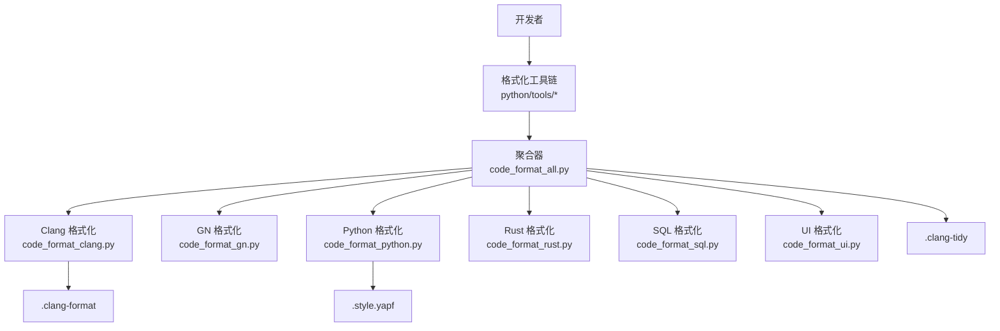
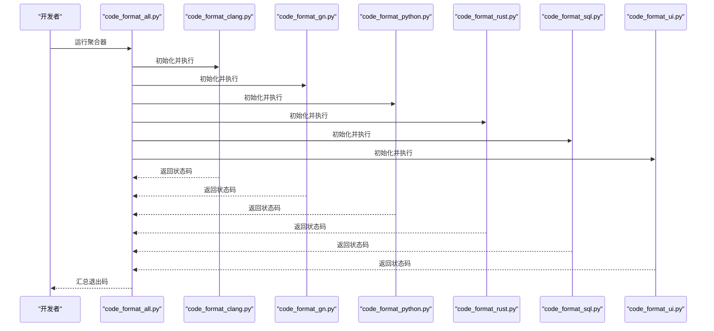
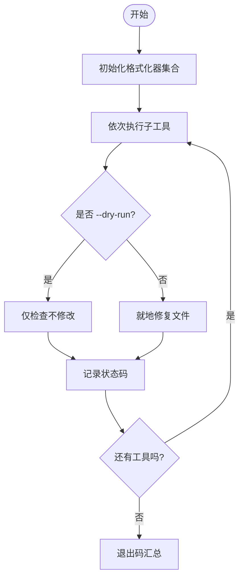
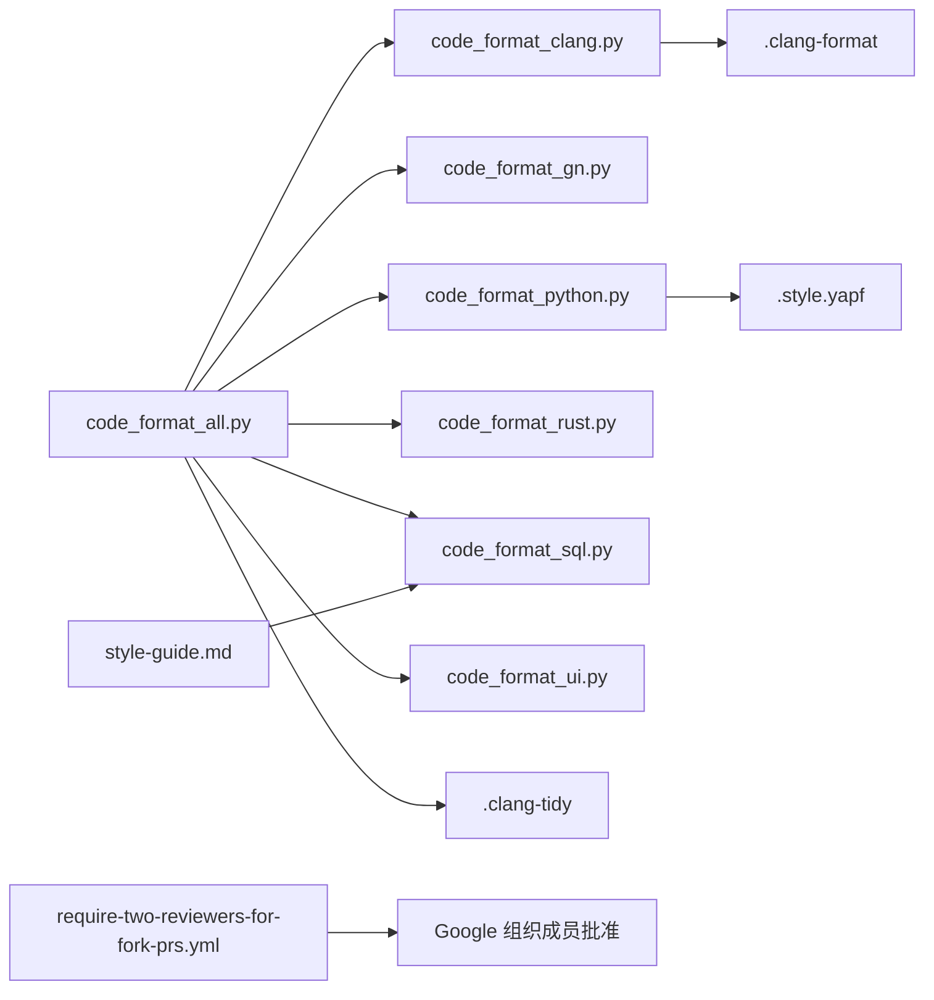

# 代码规范

<cite>
**本文引用的文件**
- [README.md](file://README.md)
- [AGENTS.md](file://docs/AGENTS.md)
- [.clang-format](file://.clang-format)
- [.clang-tidy](file://.clang-tidy)
- [.style.yapf](file://.style.yapf)
- [code_format_all.py](file://python/tools/code_format_all.py)
- [code_format_clang.py](file://python/tools/code_format_clang.py)
- [code_format_gn.py](file://python/tools/code_format_gn.py)
- [code_format_python.py](file://python/tools/code_format_python.py)
- [code_format_rust.py](file://python/tools/code_format_rust.py)
- [code_format_sql.py](file://python/tools/code_format_sql.py)
- [code_format_ui.py](file://python/tools/code_format_ui.py)
- [code_format_utils.py](file://python/tools/code_format_utils.py)
- [logging.h](file://include/perfetto/base/logging.h)
- [style-guide.md](file://docs/analysis/style-guide.md)
- [pull_request_template.md](file://.github/pull_request_template.md)
- [require-two-reviewers-for-fork-prs.yml](file://.github/workflows/require-two-reviewers-for-fork-prs.yml)
- [check_sql_modules.py](file://tools/check_sql_modules.py)
</cite>

## 目录
1. [引言](#引言)
2. [项目结构](#项目结构)
3. [核心组件](#核心组件)
4. [架构总览](#架构总览)
5. [详细组件分析](#详细组件分析)
6. [依赖关系分析](#依赖关系分析)
7. [性能考量](#性能考量)
8. [故障排查指南](#故障排查指南)
9. [结论](#结论)
10. [附录](#附录)

## 引言
本文件为 Perfetto 的代码规范文档，聚焦 C++ 编码标准与 Google 风格指南在本仓库中的落地要求，涵盖命名约定、代码格式化工具链、注释与文档标准、代码审查清单与质量要求，并提供常见错误与最佳实践示例。Perfetto 在 README 中明确采用 C++17，并在贡献指南中强调遵循 Google 风格与内部规范。

章节来源
- [README.md:19](file://README.md#L19)

## 项目结构
本仓库采用多语言混合工程：C++ 核心库、Python 工具链、Rust 扩展、前端 UI、以及大量 Protobuf/SQL 资源。与代码规范直接相关的关键位置如下：
- C++ 规范与日志宏定义位于 include/perfetto/base/logging.h
- C++ 格式化工具链由 Python 工具统一调度
- SQL 风格指南位于 docs/analysis/style-guide.md
- GitHub Actions 工作流包含审查与批准策略
- .clang-format/.clang-tidy/.style.yapf 等格式化配置文件

图表来源
- [code_format_all.py:26-34](file://python/tools/code_format_all.py#L26-L34)
- [code_format_clang.py:22-36](file://python/tools/code_format_clang.py#L22-L36)
- [code_format_gn.py](file://python/tools/code_format_gn.py)
- [code_format_python.py](file://python/tools/code_format_python.py)
- [code_format_rust.py](file://python/tools/code_format_rust.py)
- [code_format_sql.py](file://python/tools/code_format_sql.py)
- [code_format_ui.py](file://python/tools/code_format_ui.py)
- [.clang-format](file://.clang-format)
- [.clang-tidy](file://.clang-tidy)
- [.style.yapf](file://.style.yapf)

章节来源
- [code_format_all.py:1-34](file://python/tools/code_format_all.py#L1-L34)
- [code_format_clang.py:1-43](file://python/tools/code_format_clang.py#L1-L43)
- [style-guide.md:1-33](file://docs/analysis/style-guide.md#L1-L33)

## 核心组件
- C++17 与 Google 风格
  - 明确使用 C++17；避免异常与 try/catch；模板使用尽量精简；优先前向声明；失败即断言（PERFETTO_CHECK/PERFETTO_DCHECK）；变量命名与作用域匹配；避免引入额外库。
- 日志与断言宏
  - 使用 PERFETTO_LOG/ILOG/ELOG/FATAL；调试日志 PERFETTO_DLOG；生产断言 PERFETTO_CHECK；调试断言 PERFETTO_DCHECK；严格区分有无 errno 的打印宏。
- 命名约定
  - 类型名：大驼峰（如 XyzAbc）
  - 变量/函数/成员：小驼峰（如 xyzAbc）
  - 宏：全大写下划线（如 XYZ_ABC）
  - 文件/命名空间：全小写（如 perfetto::base）
  - 常量：全大写下划线或 constexpr 小驼峰（如 kXyzAbc 或 kXyzAbc）
- 格式化工具链
  - 统一入口：python/tools/code_format_all.py
  - 子工具：clang-format、gn、yapf、sqlglot、rustfmt、UI
  - 检查模式：--dry-run；修复模式：-i
- 注释与文档
  - C++ 头文件：模块级注释、类/接口/函数注释、TODO/XXX 标记
  - SQL：函数/宏/视图命名统一为小蛇形；关键字大写；行宽建议 80 字符；连接词换行时置于下一行开头
  - PR 描述：需附带问题或清晰的问题描述
- 代码审查与质量
  - Fork 提交 PR 需至少 2 名 Google 组织成员批准
  - 非 trivial 补丁需具备充分理由与价值；提交前自检，避免明显缺陷
  - SQL 模块检查：禁止新增顶级公共包；确保嵌套标签层级正确

章节来源
- [AGENTS.md:78-94](file://docs/AGENTS.md#L78-L94)
- [logging.h:193-254](file://include/perfetto/base/logging.h#L193-L254)
- [style-guide.md:7-33](file://docs/analysis/style-guide.md#L7-L33)
- [pull_request_template.md:1-7](file://.github/pull_request_template.md#L1-L7)
- [require-two-reviewers-for-fork-prs.yml:97-106](file://.github/workflows/require-two-reviewers-for-fork-prs.yml#L97-L106)
- [check_sql_modules.py:614-646](file://tools/check_sql_modules.py#L614-L646)

## 架构总览
以下序列图展示“统一格式化工具链”的调用流程，从命令行到各子工具执行，再到检查/修复模式切换。

图表来源
- [code_format_all.py:26-34](file://python/tools/code_format_all.py#L26-L34)
- [code_format_clang.py:22-36](file://python/tools/code_format_clang.py#L22-L36)
- [code_format_gn.py](file://python/tools/code_format_gn.py)
- [code_format_python.py](file://python/tools/code_format_python.py)
- [code_format_rust.py](file://python/tools/code_format_rust.py)
- [code_format_sql.py](file://python/tools/code_format_sql.py)
- [code_format_ui.py](file://python/tools/code_format_ui.py)

## 详细组件分析

### C++ 编码标准与 Google 风格
- 语言版本与异常策略
  - 使用 C++17；不使用异常与 try/catch；失败即断言（PERFETTO_CHECK/PERFETTO_DCHECK）
- 模板与头文件
  - 模板使用尽量精简；头文件优先前向声明，必要头文件放入 .cc
- 断言与日志
  - 生产断言：PERFETTO_CHECK；调试断言：PERFETTO_DCHECK；日志：PERFETTO_LOG/ILOG/ELOG；致命错误：PERFETTO_FATAL
  - 注意：PERFETTO_DCHECK 内不得包含副作用，否则发布构建会失效
- 参数传递与拷贝语义
  - 输入/输出参数使用指针而非引用
  - 如需拷贝/移动构造，遵循现有模式（如 circular_queue.h）
- 命名约定（类型/变量/函数/宏）
  - 类型：大驼峰（XyzAbc）
  - 变量/函数/成员：小驼峰（xyzAbc）
  - 宏：全大写下划线（XYZ_ABC）
  - 文件/命名空间：全小写（perfetto::base）
  - 常量：全大写下划线或 constexpr 小驼峰（kXyzAbc）
- 库使用限制
  - 优先使用 STL、POSIX/Unix 常用头；避免引入新库；如确需引入，先征询维护者

章节来源
- [AGENTS.md:80-94](file://docs/AGENTS.md#L80-L94)
- [logging.h:193-254](file://include/perfetto/base/logging.h#L193-L254)

### 命名约定（C++）
- 类型：大驼峰（如 XyzAbc）
- 变量/函数/成员：小驼峰（如 xyzAbc）
- 宏：全大写下划线（如 XYZ_ABC）
- 文件/命名空间：全小写（如 perfetto::base）
- 常量：全大写下划线或 constexpr 小驼峰（如 kXyzAbc）

章节来源
- [AGENTS.md:90](file://docs/AGENTS.md#L90)

### 命名约定（SQL）
- 函数名、宏名、表/视图名：小蛇形（lower_snake_case）
- SQL 关键字：大写
- 行宽：建议不超过 80 字符
- 换行：连接词（AND/OR）置于下一行开头

章节来源
- [style-guide.md:10-14](file://docs/analysis/style-guide.md#L10-L14)

### 代码格式化工具链
- 统一入口
  - python/tools/code_format_all.py：聚合所有格式化器，支持 --dry-run 检查与 -i 修复
- 子工具职责
  - clang-format：C/C++/Proto/Inc 文件
  - gn：GN/BUILD 文件
  - yapf：Python 文件
  - sqlglot：SQL 文件
  - rustfmt：Rust 文件
  - UI：前端代码（TS/JS/CSS 等）
- 工具链执行顺序与返回值
  - 各工具通过统一基类执行，最终汇总退出码
- 配置文件
  - .clang-format：Clang 格式化规则
  - .clang-tidy：静态检查规则
  - .style.yapf：Python 格式化规则

图表来源
- [code_format_all.py:26-34](file://python/tools/code_format_all.py#L26-L34)
- [code_format_clang.py:28-36](file://python/tools/code_format_clang.py#L28-L36)
- [code_format_utils.py](file://python/tools/code_format_utils.py)

章节来源
- [code_format_all.py:1-34](file://python/tools/code_format_all.py#L1-L34)
- [code_format_clang.py:1-43](file://python/tools/code_format_clang.py#L1-L43)
- [.clang-format](file://.clang-format)
- [.clang-tidy](file://.clang-tidy)
- [.style.yapf](file://.style.yapf)

### 注释与文档标准
- C++ 头文件注释
  - 模块级注释：说明用途与边界
  - 类/接口/函数：参数、返回值、异常、线程安全、性能特性
  - TODO/XXX：短期方案与风险提示
- SQL 文档
  - 函数/宏/视图命名统一为小蛇形；关键字大写；行宽建议 80 字符
  - 自动格式化脚本：tools/format_sql.py；Presubmit 检查
- PR 描述
  - 必须附带问题或清晰的问题描述；参考 .github/pull_request_template.md

章节来源
- [style-guide.md:16-33](file://docs/analysis/style-guide.md#L16-L33)
- [pull_request_template.md:1-7](file://.github/pull_request_template.md#L1-L7)

### 代码审查清单与质量要求
- 审查数量
  - Fork 提交 PR 需至少 2 名 Google 组织成员批准
- 补丁质量
  - 非 trivial 补丁需具备充分理由与价值；提交前自检，避免明显缺陷
- SQL 模块检查
  - 禁止新增顶级公共包；确保嵌套标签层级正确；工具：tools/check_sql_modules.py

章节来源
- [require-two-reviewers-for-fork-prs.yml:97-106](file://.github/workflows/require-two-reviewers-for-fork-prs.yml#L97-L106)
- [check_sql_modules.py:614-646](file://tools/check_sql_modules.py#L614-L646)

### 常见编码错误与最佳实践
- 常见错误
  - 在 PERFETTO_DCHECK 中放置有副作用的代码（发布构建会失效）
  - 输入/输出参数使用引用而非指针
  - 过度使用模板导致编译时间与二进制膨胀
  - 引入未允许的新第三方库
- 最佳实践
  - 优先使用前向声明减少编译依赖
  - 使用 PERFETTO_CHECK/PERFETTO_DCHECK 进行快速失败
  - 使用统一格式化工具链保证一致性
  - SQL 使用小蛇形命名与关键字大写，保持可读性

章节来源
- [AGENTS.md:85-94](file://docs/AGENTS.md#L85-L94)
- [logging.h:211-254](file://include/perfetto/base/logging.h#L211-L254)

## 依赖关系分析
- 工具链依赖
  - code_format_all.py 依赖各子格式化器模块
  - 子工具依赖各自配置文件（.clang-format、.clang-tidy、.style.yapf 等）
- 规则依赖
  - SQL 风格指南与自动格式化脚本相互依赖
  - GitHub 工作流对审查批准数量进行约束

图表来源
- [code_format_all.py:26-34](file://python/tools/code_format_all.py#L26-L34)
- [code_format_clang.py:22-36](file://python/tools/code_format_clang.py#L22-L36)
- [style-guide.md:16-25](file://docs/analysis/style-guide.md#L16-L25)
- [require-two-reviewers-for-fork-prs.yml:97-106](file://.github/workflows/require-two-reviewers-for-fork-prs.yml#L97-L106)

章节来源
- [code_format_all.py:1-34](file://python/tools/code_format_all.py#L1-L34)
- [style-guide.md:1-33](file://docs/analysis/style-guide.md#L1-L33)

## 性能考量
- 模板使用应尽量精简，避免过度泛化导致编译时间与二进制体积膨胀
- 优先前向声明，减少头文件包含以降低编译依赖
- 使用统一格式化工具链，避免手工调整带来的重复工作与不一致

章节来源
- [AGENTS.md:82-83](file://docs/AGENTS.md#L82-L83)

## 故障排查指南
- 格式化失败
  - 使用 --dry-run 检查差异；根据提示运行修复命令
  - 若 clang-format 不存在，请按提示安装依赖
- 日志与断言
  - 生产断言失败会立即崩溃；调试断言仅在调试构建生效
  - 使用带 errno 的宏（如 ELOG/PLOG）获取系统错误信息
- SQL 模块检查失败
  - 确认未新增顶级公共包；检查嵌套标签层级

章节来源
- [code_format_clang.py:28-36](file://python/tools/code_format_clang.py#L28-L36)
- [logging.h:193-254](file://include/perfetto/base/logging.h#L193-L254)
- [check_sql_modules.py:614-646](file://tools/check_sql_modules.py#L614-L646)

## 结论
Perfetto 的代码规范以 C++17 与 Google 风格为基础，结合内部实践形成统一的命名、格式化、注释与审查标准。通过 Python 工具链统一管理多语言格式化，配合 SQL 风格指南与 GitHub 工作流，确保代码一致性与可维护性。建议开发者在提交前使用统一格式化工具链，并遵循审查清单与质量要求。

## 附录
- 参考文件路径
  - C++ 规范与日志：include/perfetto/base/logging.h
  - SQL 风格指南：docs/analysis/style-guide.md
  - 格式化工具链：python/tools/code_format_*.py
  - 配置文件：.clang-format、.clang-tidy、.style.yapf
  - 审查工作流：.github/workflows/require-two-reviewers-for-fork-prs.yml
  - PR 模板：.github/pull_request_template.md
  - SQL 模块检查：tools/check_sql_modules.py