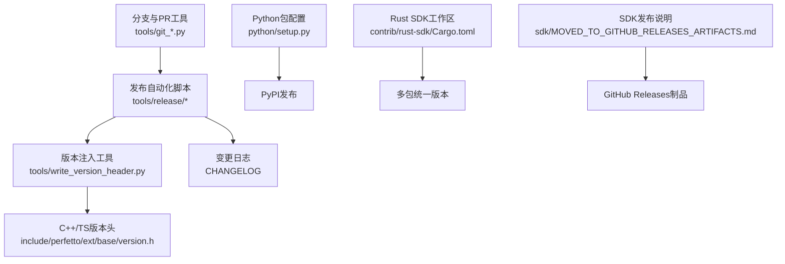
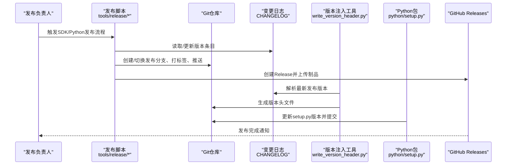
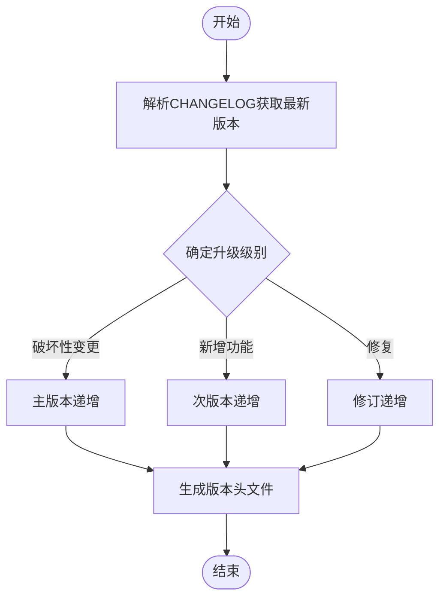
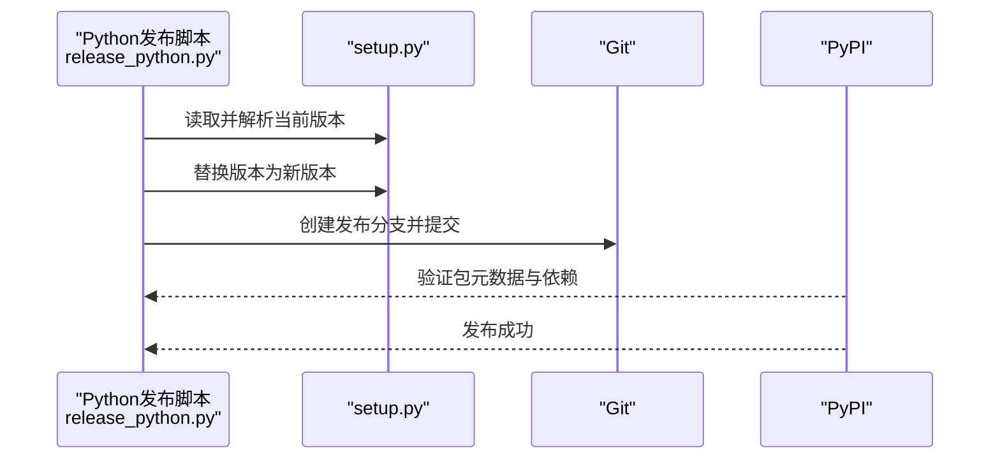
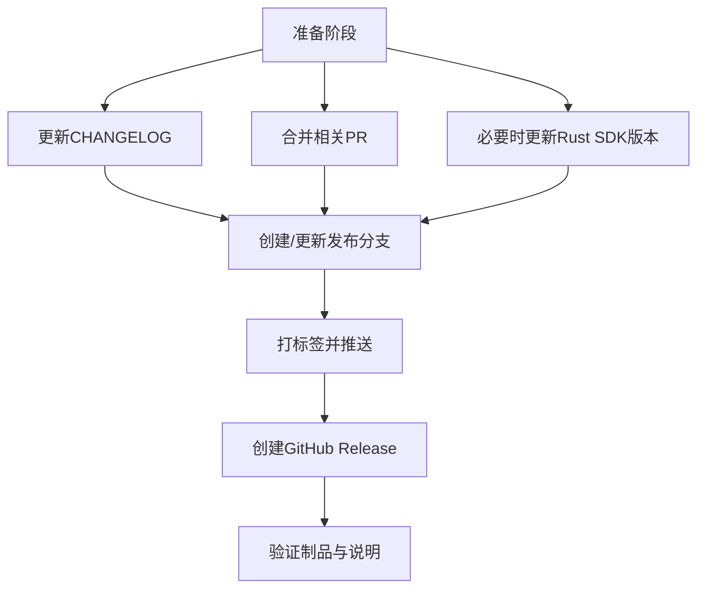
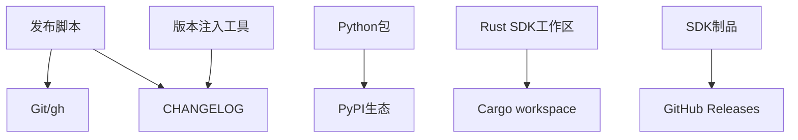

# 发布管理

<cite>
**本文引用的文件**
- [CHANGELOG](file://CHANGELOG)
- [tools/release/release_perfetto.py](file://tools/release/release_perfetto.py)
- [tools/release/release_python.py](file://tools/release/release_python.py)
- [python/setup.py](file://python/setup.py)
- [tools/write_version_header.py](file://tools/write_version_header.py)
- [include/perfetto/ext/base/version.h](file://include/perfetto/ext/base/version.h)
- [src/trace_processor/importers/common/system_info_tracker.cc](file://src/trace_processor/importers/common/system_info_tracker.cc)
- [tools/git_new_branch.py](file://tools/git_new_branch.py)
- [tools/git_sync_stack.py](file://tools/git_sync_stack.py)
- [contrib/rust-sdk/Cargo.toml](file://contrib/rust-sdk/Cargo.toml)
- [sdk/MOVED_TO_GITHUB_RELEASES_ARTIFACTS.md](file://sdk/MOVED_TO_GITHUB_RELEASES_ARTIFACTS.md)
- [README.md](file://README.md)
</cite>

## 目录
1. [引言](#引言)
2. [项目结构](#项目结构)
3. [核心组件](#核心组件)
4. [架构总览](#架构总览)
5. [详细组件分析](#详细组件分析)
6. [依赖关系分析](#依赖关系分析)
7. [性能考量](#性能考量)
8. [故障排查指南](#故障排查指南)
9. [结论](#结论)
10. [附录](#附录)

## 引言
本文件面向Perfetto项目的发布管理，系统阐述版本号与语义化版本控制策略、Python包发布流程与自动化工具、SDK发布准备与检查清单、CI/CD流水线中的发布步骤与质量门控、发布前测试与兼容性验证方法、发布后监控与回滚策略，以及发布文档（如变更日志）的生成与维护流程。内容以仓库现有脚本、配置与文档为依据，确保可操作与可追溯。

## 项目结构
围绕发布管理的关键位置与职责如下：
- 版本与发布自动化：tools/release 下的脚本负责SDK与Python包的版本推进、分支与标签、GitHub Release创建等。
- 变更日志：根目录CHANGELOG用于记录每个版本的功能、修复与破坏性变更。
- 版本注入：tools/write_version_header.py从CHANGELOG解析最新发布版本，并生成C++/TypeScript头文件，供运行时获取版本字符串与代码版本号。
- Python包：python/setup.py定义包元数据与当前版本，作为PyPI发布的入口。
- 分支与PR同步：tools/git_* 提供分支创建、父子关系设置与批量PR同步能力，支撑发布分支与合入流程。
- Rust SDK工作区：contrib/rust-sdk/Cargo.toml声明多成员包，便于统一版本与构建。
- SDK发布状态：sdk/MOVED_TO_GITHUB_RELEASES_ARTIFACTS.md说明SDK制品迁移至GitHub Releases的现状。

图表来源
- [tools/release/release_perfetto.py:124-257](file://tools/release/release_perfetto.py#L124-L257)
- [tools/release/release_python.py:84-122](file://tools/release/release_python.py#L84-L122)
- [tools/write_version_header.py:69-110](file://tools/write_version_header.py#L69-L110)
- [include/perfetto/ext/base/version.h:20-45](file://include/perfetto/ext/base/version.h#L20-L45)
- [python/setup.py:1-43](file://python/setup.py#L1-L43)
- [contrib/rust-sdk/Cargo.toml:1-4](file://contrib/rust-sdk/Cargo.toml#L1-L4)
- [sdk/MOVED_TO_GITHUB_RELEASES_ARTIFACTS.md](file://sdk/MOVED_TO_GITHUB_RELEASES_ARTIFACTS.md)

章节来源
- [README.md:1-101](file://README.md#L1-L101)
- [CHANGELOG:1-20](file://CHANGELOG#L1-L20)
- [tools/release/release_perfetto.py:124-257](file://tools/release/release_perfetto.py#L124-L257)
- [tools/release/release_python.py:84-122](file://tools/release/release_python.py#L84-L122)
- [tools/write_version_header.py:69-110](file://tools/write_version_header.py#L69-L110)
- [python/setup.py:1-43](file://python/setup.py#L1-L43)
- [contrib/rust-sdk/Cargo.toml:1-4](file://contrib/rust-sdk/Cargo.toml#L1-L4)
- [sdk/MOVED_TO_GITHUB_RELEASES_ARTIFACTS.md](file://sdk/MOVED_TO_GITHUB_RELEASES_ARTIFACTS.md)

## 核心组件
- 版本号与语义化版本控制
  - 采用“主.次.修订”格式 vX.Y.Z 或 vX.Y；主版本号在重大破坏性变更时递增；次版本号在新增向后兼容功能时递增；修订号用于修复与小改动。
  - 变更日志按版本分节，明确记录破坏性变更、新增功能与修复，便于判断语义化版本升级级别。
- 发布自动化脚本
  - SDK发布：tools/release/release_perfetto.py 支持创建/更新发布分支、打标签、推送远程标签、创建GitHub Release。
  - Python包发布：tools/release/release_python.py 负责在setup.py中更新版本、创建发布分支并提交。
- 版本注入与运行时版本
  - tools/write_version_header.py 从CHANGELOG提取最新发布版本，生成C++/TypeScript版本头文件，供运行时查询版本字符串与版本代码。
  - include/perfetto/ext/base/version.h 声明版本查询接口，供客户端/服务端识别构建版本。
- Python包配置
  - python/setup.py 定义包名、版本、许可证、关键字、安装依赖与Python版本范围，作为PyPI发布入口。
- 分支与PR同步
  - tools/git_new_branch.py 创建新分支并设置父分支配置。
  - tools/git_sync_stack.py 同步分支栈、推送与PR创建/基线更新，支持草稿PR与强制推送选项。
- Rust SDK工作区
  - contrib/rust-sdk/Cargo.toml 以workspace统一管理多个子包，便于一次版本升级与构建。
- SDK发布状态
  - sdk/MOVED_TO_GITHUB_RELEASES_ARTIFACTS.md 指出SDK制品已迁移到GitHub Releases，发布流程需结合该说明。

章节来源
- [CHANGELOG:1-20](file://CHANGELOG#L1-L20)
- [tools/release/release_perfetto.py:124-257](file://tools/release/release_perfetto.py#L124-L257)
- [tools/release/release_python.py:84-122](file://tools/release/release_python.py#L84-L122)
- [tools/write_version_header.py:69-110](file://tools/write_version_header.py#L69-L110)
- [include/perfetto/ext/base/version.h:20-45](file://include/perfetto/ext/base/version.h#L20-L45)
- [python/setup.py:1-43](file://python/setup.py#L1-L43)
- [tools/git_new_branch.py:18-56](file://tools/git_new_branch.py#L18-L56)
- [tools/git_sync_stack.py:47-199](file://tools/git_sync_stack.py#L47-L199)
- [contrib/rust-sdk/Cargo.toml:1-4](file://contrib/rust-sdk/Cargo.toml#L1-L4)
- [sdk/MOVED_TO_GITHUB_RELEASES_ARTIFACTS.md](file://sdk/MOVED_TO_GITHUB_RELEASES_ARTIFACTS.md)

## 架构总览
下图展示从版本决策到制品发布的端到端流程，包括版本注入、Python包发布与SDK/GitHub Release发布。

图表来源
- [tools/release/release_perfetto.py:124-257](file://tools/release/release_perfetto.py#L124-L257)
- [tools/release/release_python.py:84-122](file://tools/release/release_python.py#L84-L122)
- [tools/write_version_header.py:69-110](file://tools/write_version_header.py#L69-L110)
- [python/setup.py:1-43](file://python/setup.py#L1-L43)
- [CHANGELOG:1-20](file://CHANGELOG#L1-L20)

## 详细组件分析

### 版本号管理与语义化版本控制
- 策略要点
  - 主版本：破坏性变更或API不兼容时递增。
  - 次版本：新增向后兼容功能时递增。
  - 修订：仅用于修复与小改动。
  - 变更日志：每个版本分节记录破坏性变更、新增与修复，作为升级级别的依据。
- 实施证据
  - 变更日志示例：[CHANGELOG:11-99](file://CHANGELOG#L11-L99) 展示破坏性变更与功能增强的分组与描述。
  - 版本注入：从CHANGELOG解析最新发布版本，生成运行时可用的版本字符串与版本代码。[tools/write_version_header.py:69-110](file://tools/write_version_header.py#L69-L110)、[include/perfetto/ext/base/version.h:20-45](file://include/perfetto/ext/base/version.h#L20-L45)。

图表来源
- [CHANGELOG:11-99](file://CHANGELOG#L11-L99)
- [tools/write_version_header.py:69-110](file://tools/write_version_header.py#L69-L110)
- [include/perfetto/ext/base/version.h:20-45](file://include/perfetto/ext/base/version.h#L20-L45)

章节来源
- [CHANGELOG:11-99](file://CHANGELOG#L11-L99)
- [tools/write_version_header.py:69-110](file://tools/write_version_header.py#L69-L110)
- [include/perfetto/ext/base/version.h:20-45](file://include/perfetto/ext/base/version.h#L20-L45)

### Python包发布流程与自动化工具
- 流程概览
  - 使用tools/release/release_python.py在setup.py中更新版本，创建发布分支并提交。
  - 通过PyPI渠道发布（setup.py中定义了包名、版本、依赖与Python版本范围）。
- 关键点
  - 版本更新：正则匹配与替换版本字段，确保格式正确。
  - 分支与提交：自动创建分支并提交变更，便于后续PR与审核。
  - 依赖与生态：setup.py声明protobuf为主依赖，pandas/polars/numpy为可选扩展，覆盖常见数据分析场景。

图表来源
- [tools/release/release_python.py:84-122](file://tools/release/release_python.py#L84-L122)
- [python/setup.py:1-43](file://python/setup.py#L1-L43)

章节来源
- [tools/release/release_python.py:84-122](file://tools/release/release_python.py#L84-L122)
- [python/setup.py:1-43](file://python/setup.py#L1-L43)

### SDK发布准备与发布检查清单
- 准备工作
  - 在CHANGELOG中添加本次发布条目，明确破坏性变更与功能增强。
  - 确认所有相关PR已合并至目标发布分支。
  - 如有需要，更新Rust SDK工作区版本（contrib/rust-sdk/Cargo.toml）。
- 发布步骤
  - 使用tools/release/release_perfetto.py创建/更新发布分支、打标签、推送远程标签并创建GitHub Release。
  - SDK制品已迁移至GitHub Releases，遵循该说明进行制品上传与发布说明编写。
- 检查清单
  - [ ] CHANGELOG已更新且通过审查
  - [ ] 发布分支已创建并指向正确基线
  - [ ] 标签已本地与远程创建
  - [ ] GitHub Release已创建并包含制品
  - [ ] 运行时版本头文件已生成并纳入构建
  - [ ] SDK制品已上传至GitHub Releases

图表来源
- [tools/release/release_perfetto.py:124-257](file://tools/release/release_perfetto.py#L124-L257)
- [sdk/MOVED_TO_GITHUB_RELEASES_ARTIFACTS.md](file://sdk/MOVED_TO_GITHUB_RELEASES_ARTIFACTS.md)

章节来源
- [tools/release/release_perfetto.py:124-257](file://tools/release/release_perfetto.py#L124-L257)
- [sdk/MOVED_TO_GITHUB_RELEASES_ARTIFACTS.md](file://sdk/MOVED_TO_GITHUB_RELEASES_ARTIFACTS.md)

### CI/CD流水线中的发布步骤与质量门控
- 发布前质量门控建议
  - 代码审查：确保发布分支与标签变更均经审查。
  - 自动化测试：在发布前执行关键集成测试与回归测试，确保无重大回归。
  - 兼容性验证：针对不同平台与Python版本进行最小化验证。
- 发布步骤（基于现有脚本）
  - 通过tools/release/release_perfetto.py与tools/release/release_python.py完成版本推进、分支与标签、GitHub Release创建。
  - 版本注入：tools/write_version_header.py从CHANGELOG生成版本头文件，确保运行时可识别版本。
- 质量门控落地
  - 将上述脚本与版本注入流程纳入CI流水线的“发布作业”，在满足条件（如PR审查通过、测试通过）后自动执行。

章节来源
- [tools/release/release_perfetto.py:124-257](file://tools/release/release_perfetto.py#L124-L257)
- [tools/release/release_python.py:84-122](file://tools/release/release_python.py#L84-L122)
- [tools/write_version_header.py:69-110](file://tools/write_version_header.py#L69-L110)

### 发布前测试验证与兼容性检查
- 测试建议
  - 单元与集成测试：确保Trace Processor、Trace Service与UI在目标版本下的稳定性。
  - Python API测试：验证trace_processor与trace_builder模块在目标Python版本上的可用性。
  - 兼容性矩阵：覆盖setup.py中声明的Python版本范围（3.9–3.12）。
- 兼容性检查
  - 运行时版本一致性：通过include/perfetto/ext/base/version.h提供的接口校验客户端/服务端版本匹配。
  - Trace Processor版本解析：src/trace_processor/importers/common/system_info_tracker.cc对版本字符串进行解析，确保导入流程稳定。

章节来源
- [python/setup.py:34-42](file://python/setup.py#L34-L42)
- [include/perfetto/ext/base/version.h:20-45](file://include/perfetto/ext/base/version.h#L20-L45)
- [src/trace_processor/importers/common/system_info_tracker.cc:35-52](file://src/trace_processor/importers/common/system_info_tracker.cc#L35-L52)

### 发布后监控与回滚策略
- 监控建议
  - 运行时版本追踪：通过版本头文件与接口输出，监控线上版本分布与异常。
  - 用户反馈与问题单：关注GitHub Issues与讨论区中与新版本相关的报告。
- 回滚策略
  - 标签与分支：若发现问题，可回退至上一稳定标签并创建热修复版本。
  - 制品回滚：在GitHub Releases中替换或删除有问题的制品，并补充说明。
  - 变更回滚：必要时通过选择性合并或cherry-pick回滚特定提交。

章节来源
- [tools/release/release_perfetto.py:171-196](file://tools/release/release_perfetto.py#L171-L196)
- [tools/release/release_python.py:102-122](file://tools/release/release_python.py#L102-L122)

### 发布文档生成与维护
- 变更日志维护
  - 每次发布前在根目录CHANGELOG中添加新版本条目，分组记录破坏性变更、功能与修复。
  - 保持条目清晰、可追溯，便于用户理解升级影响。
- 版本注入与文档一致性
  - tools/write_version_header.py从CHANGELOG解析版本，生成版本头文件，确保文档与运行时版本一致。
- Python包文档
  - python/setup.py中描述与关键词有助于PyPI页面的检索与理解。

章节来源
- [CHANGELOG:1-20](file://CHANGELOG#L1-L20)
- [tools/write_version_header.py:69-110](file://tools/write_version_header.py#L69-L110)
- [python/setup.py:20-26](file://python/setup.py#L20-L26)

## 依赖关系分析
- 组件耦合
  - 发布脚本依赖于Git与GitHub CLI（gh），用于分支、标签与PR管理。
  - 版本注入工具依赖CHANGELOG解析，确保版本头文件与发布版本一致。
  - Python包发布依赖setup.py元数据与PyPI生态。
- 外部依赖
  - GitHub Releases用于SDK制品分发。
  - Rust SDK工作区通过Cargo workspace统一版本与构建。

图表来源
- [tools/release/release_perfetto.py:124-257](file://tools/release/release_perfetto.py#L124-L257)
- [tools/release/release_python.py:84-122](file://tools/release/release_python.py#L84-L122)
- [tools/write_version_header.py:69-110](file://tools/write_version_header.py#L69-L110)
- [python/setup.py:1-43](file://python/setup.py#L1-L43)
- [contrib/rust-sdk/Cargo.toml:1-4](file://contrib/rust-sdk/Cargo.toml#L1-L4)
- [sdk/MOVED_TO_GITHUB_RELEASES_ARTIFACTS.md](file://sdk/MOVED_TO_GITHUB_RELEASES_ARTIFACTS.md)

章节来源
- [tools/release/release_perfetto.py:124-257](file://tools/release/release_perfetto.py#L124-L257)
- [tools/release/release_python.py:84-122](file://tools/release/release_python.py#L84-L122)
- [tools/write_version_header.py:69-110](file://tools/write_version_header.py#L69-L110)
- [python/setup.py:1-43](file://python/setup.py#L1-L43)
- [contrib/rust-sdk/Cargo.toml:1-4](file://contrib/rust-sdk/Cargo.toml#L1-L4)
- [sdk/MOVED_TO_GITHUB_RELEASES_ARTIFACTS.md](file://sdk/MOVED_TO_GITHUB_RELEASES_ARTIFACTS.md)

## 性能考量
- 版本注入开销：版本注入工具仅在构建阶段运行，对CI/CD整体耗时影响有限。
- Python包发布：PyPI上传与验证通常较快，建议在流水线中并行执行其他测试任务以提升吞吐。
- SDK制品：制品体积较大时，建议使用增量上传与断点续传策略（如适用）。

## 故障排查指南
- 发布脚本错误
  - 检查版本格式是否符合 vX.Y 或 vX.Y.Z。
  - 确认分支与上游配置正确，避免推送失败。
- 版本注入失败
  - 确保CHANGELOG存在且格式正确，版本行可被解析。
  - 若无Git环境，使用相应参数跳过Git SHA解析。
- Python包发布失败
  - 校验setup.py中的版本、依赖与Python版本范围。
  - 确认PyPI凭证与网络连通性。
- PR与分支同步问题
  - 使用tools/git_sync_stack.py同步栈与PR基线，必要时使用草稿PR与强制推送选项。

章节来源
- [tools/release/release_perfetto.py:230-257](file://tools/release/release_perfetto.py#L230-L257)
- [tools/release/release_python.py:102-122](file://tools/release/release_python.py#L102-L122)
- [tools/git_sync_stack.py:47-199](file://tools/git_sync_stack.py#L47-L199)

## 结论
Perfetto的发布管理以脚本化与文档化为核心：通过CHANGELOG驱动语义化版本，借助发布脚本自动化完成分支、标签与GitHub Release创建，配合版本注入工具确保运行时版本一致，Python包发布由setup.py与脚本协同完成。建议在CI/CD中固化上述流程，并建立完善的质量门控与回滚机制，保障发布稳定与可追溯。

## 附录
- 分支与PR工具
  - 新建分支与设置父分支：[tools/git_new_branch.py:18-56](file://tools/git_new_branch.py#L18-L56)
  - 批量同步分支与PR：[tools/git_sync_stack.py:47-199](file://tools/git_sync_stack.py#L47-L199)
- Rust SDK工作区
  - 工作区配置与成员包：[contrib/rust-sdk/Cargo.toml:1-4](file://contrib/rust-sdk/Cargo.toml#L1-L4)
- SDK发布说明
  - 制品迁移至GitHub Releases：[sdk/MOVED_TO_GITHUB_RELEASES_ARTIFACTS.md](file://sdk/MOVED_TO_GITHUB_RELEASES_ARTIFACTS.md)