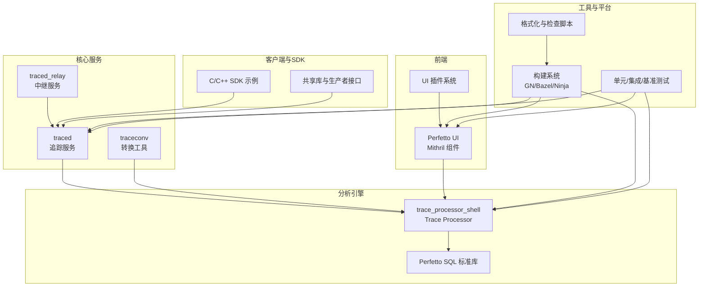
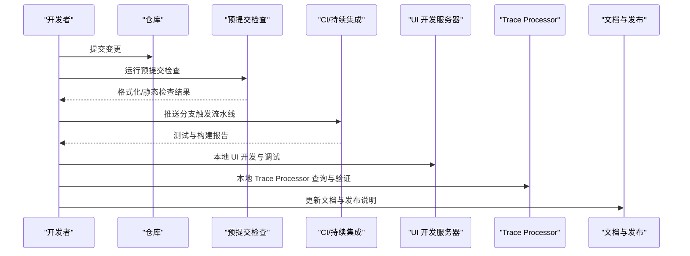
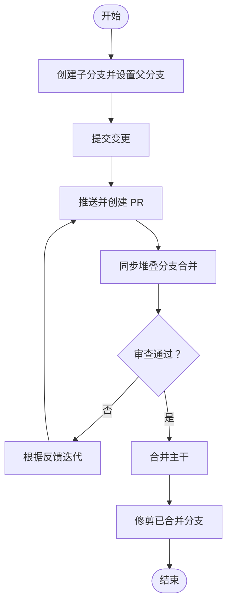
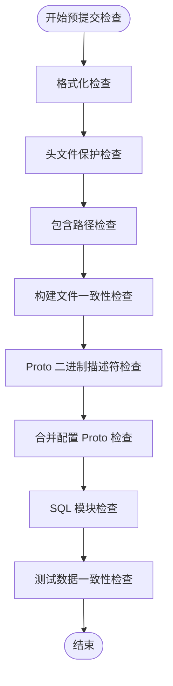
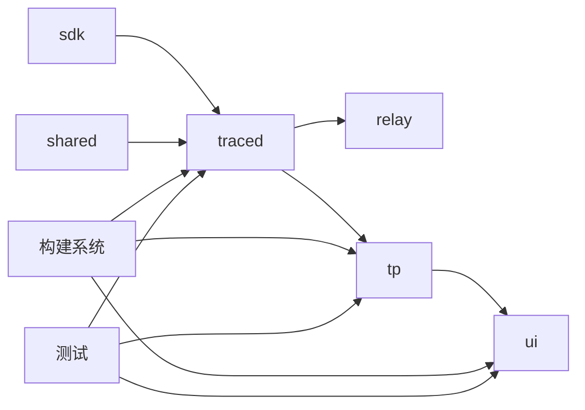

# 开发流程

<cite>
**本文引用的文件**
- [README.md](file://README.md)
- [docs/贡献/入门指南.md](file://docs/contributing/getting-started.md)
- [docs/贡献/常见任务.md](file://docs/contributing/common-tasks.md)
- [docs/贡献/构建说明.md](file://docs/contributing/build-instructions.md)
- [docs/贡献/测试.md](file://docs/contributing/testing.md)
- [docs/贡献/UI 开发入门.md](file://docs/contributing/ui-getting-started.md)
- [docs/贡献/UI 插件.md](file://docs/contributing/ui-plugins.md)
- [.github/PULL 请求模板.md](file://.github/pull_request_template.md)
- [docs/贡献/开发者工具.md](file://docs/contributing/developer-tools.md)
- [docs/贡献/Chrome 分支.md](file://docs/contributing/chrome-branches.md)
- [docs/贡献/SDK 发布.md](file://docs/contributing/sdk-releasing.md)
- [docs/贡献/SQLite 升级指南.md](file://docs/contributing/sqlite-upgrade-guide.md)
- [tools/run_presubmit](file://tools/run_presubmit)
- [tools/format-sources](file://tools/format-sources)
- [tools/git_new_branch.py](file://tools/git_new_branch.py)
- [tools/git_update_stack.py](file://tools/git_update_stack.py)
</cite>

## 目录
1. [简介](#简介)
2. [项目结构](#项目结构)
3. [核心组件](#核心组件)
4. [架构总览](#架构总览)
5. [详细组件分析](#详细组件分析)
6. [依赖分析](#依赖分析)
7. [性能考虑](#性能考虑)
8. [故障排查指南](#故障排查指南)
9. [结论](#结论)
10. [附录](#附录)

## 简介
本指南面向 Perfetto 的日常开发工作流，覆盖从本地环境搭建、构建与测试，到新增数据源、扩展现有功能、修复缺陷、编写与审查 Pull Request（PR）、以及 UI 插件开发与与 Chrome/Android 平台集成的完整流程。同时提供预提交检查（Presubmit）与开发工具的使用技巧，帮助你高效迭代。

## 项目结构
Perfetto 是一个由多语言模块组成的大型工程，核心包括：
- C++ 核心库与服务：traced、trace_processor、共享库与生产者接口
- UI 前端：基于 Mithril 的浏览器内可视化界面
- Trace Processor SQL 引擎：用于查询与分析 trace 数据
- 工具链与脚本：构建、格式化、测试、发布与集成工具
- 文档与示例：数据源、UI 插件、SDK 使用示例

图示来源
- [docs/贡献/构建说明.md:1-492](file://docs/contributing/build-instructions.md#L1-L492)
- [docs/贡献/测试.md:1-249](file://docs/contributing/testing.md#L1-L249)

章节来源
- [README.md:1-101](file://README.md#L1-L101)
- [docs/贡献/构建说明.md:1-492](file://docs/contributing/build-instructions.md#L1-L492)

## 核心组件
- 构建与工具链：GN/Bazel/Ninja 驱动，支持多平台与交叉编译；提供一键安装依赖与生成配置的脚本
- Trace Processor：解析与查询 trace 的核心引擎，支持 SQL 扩展与标准库模块化
- UI 与插件：浏览器内可视化界面，支持插件扩展与工作区组织
- 测试体系：单元测试、集成测试、Diff 测试、像素对比测试与持续集成
- 预提交检查：统一的格式化、静态检查与一致性校验脚本

章节来源
- [docs/贡献/构建说明.md:1-492](file://docs/contributing/build-instructions.md#L1-L492)
- [docs/贡献/测试.md:1-249](file://docs/contributing/testing.md#L1-L249)
- [docs/贡献/UI 开发入门.md:1-121](file://docs/contributing/ui-getting-started.md#L1-L121)

## 架构总览
下图展示了从变更到验证与发布的典型路径，涵盖本地开发、CI、以及与 Chrome/Android 的集成点。

图示来源
- [docs/贡献/测试.md:1-249](file://docs/contributing/testing.md#L1-L249)
- [docs/贡献/开发者工具.md:1-137](file://docs/contributing/developer-tools.md#L1-L137)
- [tools/run_presubmit:1-1075](file://tools/run_presubmit#L1-L1075)

## 详细组件分析

### 日常开发任务与工作流
- 本地环境准备
  - 安装依赖与生成配置：参考“快速开始”中的安装与配置步骤
  - 构建目标：按需选择 traced、trace_processor_shell、traceconv、perfetto 等
- 新增数据源（以 ftrace 为例）
  - 复制事件 format 文件至合成数据目录
  - 更新事件列表并生成协议与描述符
  - 在 Trace Processor 中实现解析逻辑
  - 添加 Diff 测试并验证
- 扩展 Trace Processor 功能
  - 新增 SQL 标准库模块或表/视图/函数
  - 注册新表与导入器，完善 diff 测试
  - 如涉及 API 版本变更，更新 API 版本号并同步 UI
- 修复缺陷
  - 编写最小可复现的测试用例
  - 通过单元/集成/Diff 测试定位问题
  - 修复后回归测试并通过预提交检查

章节来源
- [docs/贡献/常见任务.md:1-216](file://docs/contributing/common-tasks.md#L1-L216)
- [docs/贡献/构建说明.md:1-492](file://docs/contributing/build-instructions.md#L1-L492)
- [docs/贡献/测试.md:1-249](file://docs/contributing/testing.md#L1-L249)

### Pull Request 工作流与分支管理
- 分支模型与同步
  - 使用“堆叠分支”模型，通过工具脚本维护父子关系与合并
  - 使用 git 新分支、设置父分支、在父子分支间跳转、同步与修剪分支
- PR 创建与审查
  - 模板要求清晰描述问题或变更范围
  - 保持 PR 小而专一，便于审查
- 同步与合并
  - 使用“通过合并而非变基”的方式同步堆叠分支，减少审查负担
  - 合并后修剪无用分支

图示来源
- [docs/贡献/开发者工具.md:1-137](file://docs/contributing/developer-tools.md#L1-L137)
- [tools/git_new_branch.py:1-56](file://tools/git_new_branch.py#L1-L56)
- [tools/git_update_stack.py:1-127](file://tools/git_update_stack.py#L1-L127)
- [.github/PULL 请求模板.md:1-7](file://.github/pull_request_template.md#L1-L7)

章节来源
- [docs/贡献/开发者工具.md:1-137](file://docs/contributing/developer-tools.md#L1-L137)
- [tools/git_new_branch.py:1-56](file://tools/git_new_branch.py#L1-L56)
- [tools/git_update_stack.py:1-127](file://tools/git_update_stack.py#L1-L127)
- [.github/PULL 请求模板.md:1-7](file://.github/pull_request_template.md#L1-L7)

### 测试策略与手动运行预提交检查
- 测试类型
  - 单元测试：类级别测试，确保模块行为正确
  - 集成测试：端到端验证，含 ftrace 与 IPC 层
  - Trace Processor Diff 测试：解析 trace 并执行查询，比对输出
  - UI 像素对比测试：Headless Chrome 截图比对，CI 失败时可查看差异页面
- 运行测试
  - Linux/Mac：直接运行对应测试二进制
  - Android：连接设备或启动模拟器后运行测试脚本
  - Chromium：可通过修改 DEPS 或钩子临时引入待测 CL
- 预提交检查（Presubmit）
  - 自动运行于每次推送
  - 手动运行：tools/run_presubmit
  - 主要检查：格式化、头文件保护、包含路径、构建文件一致性、Proto 描述符、SQL 模块与指标、测试数据一致性等

图示来源
- [tools/run_presubmit:1-1075](file://tools/run_presubmit#L1-L1075)
- [docs/贡献/测试.md:1-249](file://docs/contributing/testing.md#L1-L249)

章节来源
- [docs/贡献/测试.md:1-249](file://docs/contributing/testing.md#L1-L249)
- [tools/run_presubmit:1-1075](file://tools/run_presubmit#L1-L1075)

### UI 开发的特殊要求与流程
- 依赖与构建
  - 安装 UI 依赖后构建与启动开发服务器
  - 支持热重载，快速迭代
- 插件开发
  - 使用 Skeleton 插件作为起点，复制到 plugins 目录
  - 生命周期：onActivate（应用启动）、onTraceLoad（加载 trace）
  - 注册命令、轨道与工作区，支持选择区域、跟踪与状态管理
- 样式与命名
  - 使用 SCSS 并遵循命名前缀规范
  - 避免与全局样式冲突
- 调试与测试
  - 单元测试就近存放，使用 run-unittests
  - 像素对比测试通过 run-integrationtests，必要时在容器中进行再基准更新

章节来源
- [docs/贡献/UI 开发入门.md:1-121](file://docs/contributing/ui-getting-started.md#L1-L121)
- [docs/贡献/UI 插件.md:1-800](file://docs/contributing/ui-plugins.md#L1-L800)

### 与 Chrome Tracing 和 Android 平台的集成开发注意事项
- Chrome 集成
  - Perfetto 作为 chrome://tracing 的后端
  - 可通过修改 DEPS 或钩子将待测 CL 引入 Chromium CI
  - 可在本地触发 Chromium TryBots 验证跨平台兼容性
- Android 集成
  - 通过 AOSP 构建系统集成 traced 与 traced_probes
  - 使用 record_android_trace 脚本侧载本地 tracebox 并录制 trace
  - Android CTS/Treehugger/APCT 等流水线验证平台兼容性

章节来源
- [docs/贡献/测试.md:182-249](file://docs/contributing/testing.md#L182-L249)
- [docs/贡献/常见任务.md:175-216](file://docs/contributing/common-tasks.md#L175-L216)

### 开发工具使用技巧与效率提升
- 预提交检查自动化
  - 使用 tools/format-sources 统一格式化
  - 在 IDE 中启用 ESLint/Prettier，保存即格式化
- 分支管理工具
  - git 新分支、设置父分支、跳转父子分支、同步堆叠、修剪分支
  - 通过合并同步避免强制推送导致的审查成本
- IDE 配置
  - 生成编译数据库，接入 CLion/VS Code/clangd
  - 配置 ESLint/Prettier 与 TypeScript 设置，提升开发体验

章节来源
- [tools/format-sources:1-19](file://tools/format-sources#L1-L19)
- [docs/贡献/开发者工具.md:1-137](file://docs/contributing/developer-tools.md#L1-L137)
- [docs/贡献/构建说明.md:411-492](file://docs/contributing/build-instructions.md#L411-L492)

## 依赖分析
- 组件耦合
  - traced 与 traced_relay：服务间通信与中继
  - Trace Processor 与 UI：通过 RPC/HTTP 交互，版本号用于兼容性控制
  - SDK 与生产者：通过共享库与生产者接口对接
- 外部依赖
  - 构建系统：GN/Bazel/Ninja
  - 工具链：clang/gcc、Python、NodeJS（UI）
  - 测试与 CI：Docker、Headless Chrome、LUCI、GitHub Actions

图示来源
- [docs/贡献/构建说明.md:1-492](file://docs/contributing/build-instructions.md#L1-L492)
- [docs/贡献/测试.md:1-249](file://docs/contributing/testing.md#L1-L249)

章节来源
- [docs/贡献/构建说明.md:1-492](file://docs/contributing/build-instructions.md#L1-L492)
- [docs/贡献/测试.md:1-249](file://docs/contributing/testing.md#L1-L249)

## 性能考虑
- 构建与调试
  - Debug 构建便于本地开发，但性能较慢，建议仅在本地使用
  - 使用 ccache 加速重复构建
- Trace Processor
  - Diff 测试与指标测试应尽量聚焦，避免不必要的全量扫描
  - SQL 查询优化：使用索引列与合适的时间窗口
- UI
  - 插件异步初始化，避免阻塞主线程
  - 轨道渲染尽量使用查询驱动的轻量渲染器

## 故障排查指南
- 预提交失败
  - 格式化/静态检查：运行 tools/format-sources 与对应检查脚本
  - 包含路径/头文件保护：按提示修正
  - 构建文件不一致：运行 gen_android_bp/gen_bazel 并提交更新
- 测试失败
  - 单元/集成测试：根据日志定位问题，补充最小复现用例
  - Diff 测试：核对期望输出，必要时更新测试数据
  - UI 像素测试：在容器中运行 run-integrationtests，按 CI 提供的链接更新基准
- 平台相关问题
  - Android：确认设备/模拟器可用，ftrace 权限与路径正确
  - Chrome：检查 DEPS 修改是否生效，TryBots 报错时回溯 CL

章节来源
- [tools/run_presubmit:1-1075](file://tools/run_presubmit#L1-L1075)
- [docs/贡献/测试.md:1-249](file://docs/contributing/testing.md#L1-L249)

## 结论
Perfetto 的开发流程强调“小步快跑、持续验证”。通过统一的构建与测试体系、严格的预提交检查、完善的 UI 插件机制以及与 Chrome/Android 的紧密集成，开发者可以高效地完成从需求到上线的全流程。建议在日常工作中优先使用工具脚本与 IDE 集成，确保代码质量与一致性。

## 附录
- 发布与分支管理
  - Chrome 分支：按里程碑创建分支、挑选变更并更新 Chromium DEPS
  - SDK 发布：按月度节奏创建主版本，minor 补丁通过 cherry-pick 合并
  - SQLite 升级：遵循升级指南，更新解析器与绑定文件并充分测试

章节来源
- [docs/贡献/Chrome 分支.md:1-64](file://docs/contributing/chrome-branches.md#L1-L64)
- [docs/贡献/SDK 发布.md:1-150](file://docs/contributing/sdk-releasing.md#L1-L150)
- [docs/贡献/SQLite 升级指南.md:1-67](file://docs/contributing/sqlite-upgrade-guide.md#L1-L67)