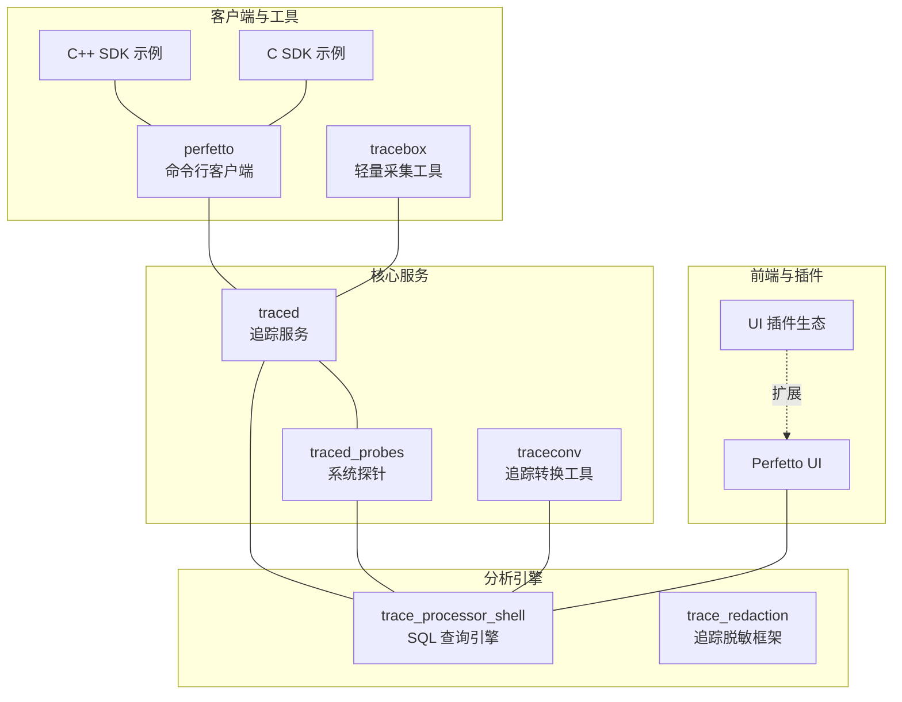
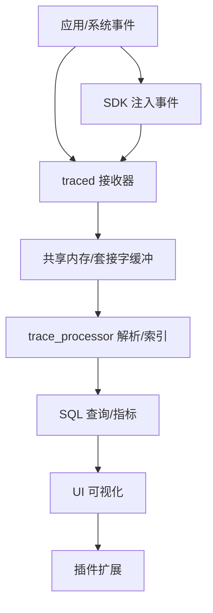
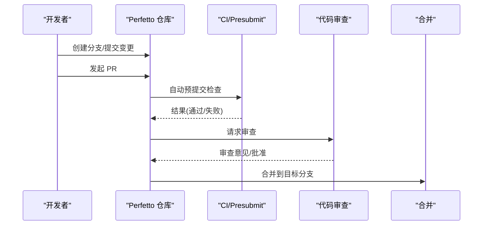
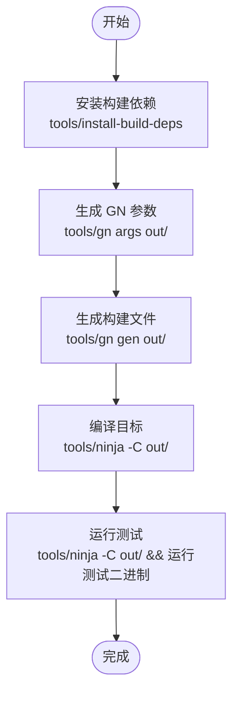
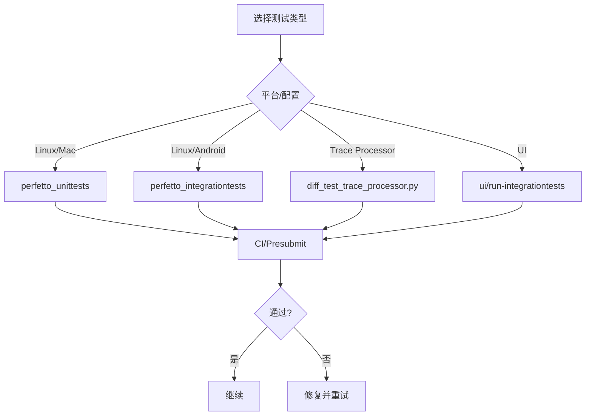
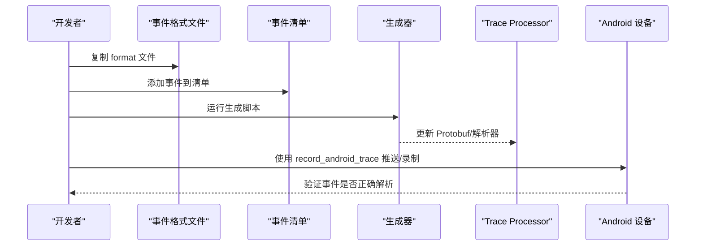
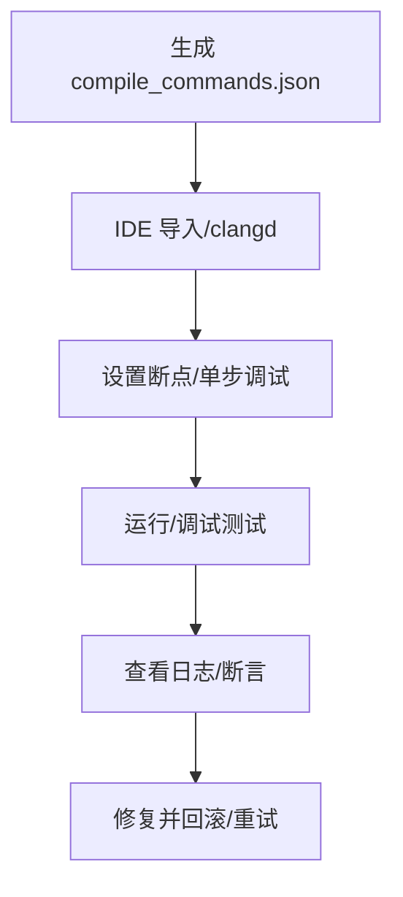
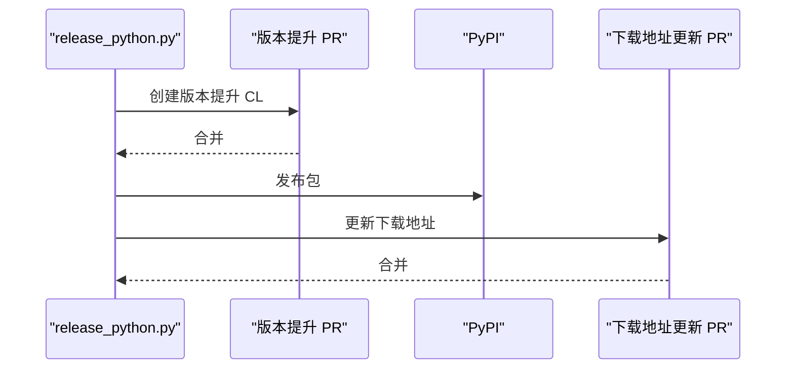
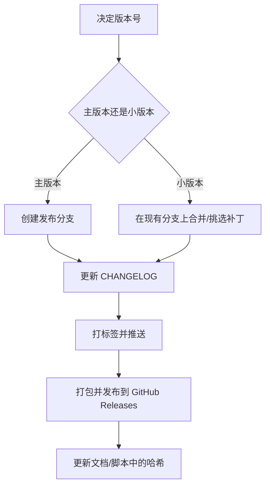
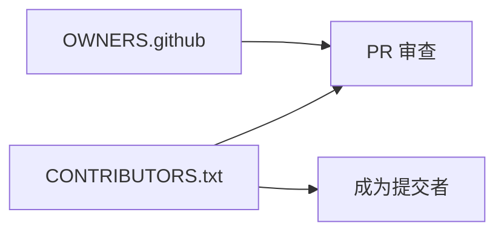

# 开发者指南

<cite>
**本文引用的文件**
- [README.md](file://README.md)
- [CONTRIBUTORS.txt](file://CONTRIBUTORS.txt)
- [OWNERS.github](file://OWNERS.github)
- [docs/faq.md](file://docs/faq.md)
- [docs/contributing/getting-started.md](file://docs/contributing/getting-started.md)
- [docs/contributing/build-instructions.md](file://docs/contributing/build-instructions.md)
- [docs/contributing/testing.md](file://docs/contributing/testing.md)
- [docs/contributing/common-tasks.md](file://docs/contributing/common-tasks.md)
- [docs/contributing/developer-tools.md](file://docs/contributing/developer-tools.md)
- [docs/contributing/ui-getting-started.md](file://docs/contributing/ui-getting-started.md)
- [docs/contributing/ui-plugins.md](file://docs/contributing/ui-plugins.md)
- [docs/contributing/python-releasing.md](file://docs/contributing/python-releasing.md)
- [docs/contributing/sdk-releasing.md](file://docs/contributing/sdk-releasing.md)
- [docs/contributing/chrome-branches.md](file://docs/contributing/chrome-branches.md)
- [docs/contributing/become-a-committer.md](file://docs/contributing/become-a-committer.md)
- [docs/contributing/sqlite-upgrade-guide.md](file://docs/contributing/sqlite-upgrade-guide.md)
</cite>

## 目录
1. [简介](#简介)
2. [项目结构](#项目结构)
3. [核心组件](#核心组件)
4. [架构总览](#架构总览)
5. [详细组件分析](#详细组件分析)
6. [依赖关系分析](#依赖关系分析)
7. [性能考量](#性能考量)
8. [故障排查指南](#故障排查指南)
9. [结论](#结论)
10. [附录](#附录)

## 简介
本指南面向希望为 Perfetto 贡献代码与功能的开发者，覆盖从环境搭建、构建与测试、代码规范、贡献流程、Pull Request 审查、常见开发任务（新增数据源、扩展现有功能、修复缺陷）、调试与工具使用，到发布与版本管理策略，并提供常见问题解答。内容基于仓库内官方文档整理，确保与当前主干保持一致。

## 项目结构
Perfetto 是一个跨平台的系统级追踪与分析套件，包含服务端守护进程、用户态 SDK、浏览器 UI、SQL 分析引擎以及大量数据源导入器与可视化扩展。其核心由以下部分组成：
- 高性能追踪守护进程：在单机多进程场景下统一采集追踪数据。
- 低开销追踪 SDK：用于应用内直接记录时间点与状态变化。
- 广泛的操作系统级探针：在 Android 与 Linux 上采集调度、频率、内存、系统调用等上下文。
- 浏览器端 UI：本地化、无需安装即可在主流浏览器中打开与分析大型追踪文件。
- 基于 SQL 的分析库：通过 SQL 对追踪进行程序化查询与自动化提取指标。

此外，项目还包含 UI 插件生态、Trace Processor 标准库、Python SDK、示例工程、CI/CD 配置与发布脚本等。

**章节来源**
- [README.md:12-31](file://README.md#L12-L31)

## 核心组件
- 追踪服务与探针：负责与操作系统交互，采集 ftrace、系统事件与应用自定义事件，统一写入追踪缓冲区。
- Trace Processor：解析与索引追踪数据，提供 SQL 查询能力与指标计算。
- UI 与插件：提供可视化界面与可扩展的分析工作流。
- Python SDK：提供 Python 包装与工具链，便于自动化与集成。
- 发布与版本：提供 SDK 与 Python 库的发布流程与分支策略。

**章节来源**
- [docs/contributing/build-instructions.md:130-176](file://docs/contributing/build-instructions.md#L130-L176)
- [docs/contributing/ui-getting-started.md:1-121](file://docs/contributing/ui-getting-started.md#L1-L121)
- [docs/contributing/python-releasing.md:1-48](file://docs/contributing/python-releasing.md#L1-L48)
- [docs/contributing/sdk-releasing.md:1-150](file://docs/contributing/sdk-releasing.md#L1-L150)

## 架构总览
Perfetto 的整体架构围绕“采集—存储—分析—可视化”展开。采集层通过 traced 与 traced_probes 汇聚来自内核与用户态的数据；Trace Processor 将原始包解码为结构化表；UI 与插件对结构化数据进行可视化与扩展分析；Python SDK 提供自动化与集成能力。

**图表来源**
- [docs/contributing/build-instructions.md:130-176](file://docs/contributing/build-instructions.md#L130-L176)

## 详细组件分析

### 贡献流程与社区参与
- 快速开始：克隆仓库、安装依赖、生成构建配置、编译与运行测试。
- 贡献方式：外部贡献者遵循 GitHub 工作流；Googler 使用内部指导文档。
- CLA：贡献需签署贡献者许可协议。
- 社区沟通：邮件列表、Discord、GitHub 讨论与问题跟踪。

**图表来源**
- [docs/contributing/getting-started.md:69-106](file://docs/contributing/getting-started.md#L69-L106)
- [docs/contributing/become-a-committer.md:1-122](file://docs/contributing/become-a-committer.md#L1-L122)

**章节来源**
- [docs/contributing/getting-started.md:1-151](file://docs/contributing/getting-started.md#L1-L151)
- [docs/contributing/become-a-committer.md:1-122](file://docs/contributing/become-a-committer.md#L1-L122)
- [OWNERS.github:1-21](file://OWNERS.github#L1-L21)

### 开发环境设置与构建系统
- 构建系统：以 GN 为主，支持 Android.bp 与 Bazel 的自动生成。
- 平台支持：Linux、Android、macOS、Windows（clang-cl 更稳定）。
- 工具链：Hermetic clang、系统 clang、GCC；可启用 ccache、Sanitizers。
- IDE 支持：生成 compile_commands.json，适配 CLion、VS Code、clangd。
- UI 开发：NodeJS 与 npm 依赖，开发服务器与热重载。

**图表来源**
- [docs/contributing/build-instructions.md:31-90](file://docs/contributing/build-instructions.md#L31-L90)
- [docs/contributing/build-instructions.md:411-492](file://docs/contributing/build-instructions.md#L411-L492)

**章节来源**
- [docs/contributing/build-instructions.md:1-492](file://docs/contributing/build-instructions.md#L1-L492)

### 测试策略与持续集成
- 单元测试：平台无关的类级别单元测试。
- 集成测试：涉及 protobuf IPC 与 ftrace（Linux/Android），支持生产模式与独立模式。
- Trace Processor Diff 测试：对比查询输出与期望值。
- UI 像素差异测试：通过无头浏览器截图比对。
- Chromium/Android CI：按平台与配置矩阵运行。

**图表来源**
- [docs/contributing/testing.md:19-157](file://docs/contributing/testing.md#L19-L157)

**章节来源**
- [docs/contributing/testing.md:1-249](file://docs/contributing/testing.md#L1-L249)

### 代码规范与风格指南
- C++ 编码标准：遵循 Google C++ 风格，目标语言标准为 C++17。
- 格式化：使用 clang-format 与 .clang-format；VS Code 推荐扩展。
- 文档注释：SQL 标准库模块需遵循严格的注释与格式化规范，以便自动生成文档。
- 命名约定：遵循项目内既有命名与目录组织，避免破坏一致性。

**章节来源**
- [docs/contributing/getting-started.md:94-95](file://docs/contributing/getting-started.md#L94-L95)
- [docs/contributing/build-instructions.md:411-464](file://docs/contributing/build-instructions.md#L411-L464)
- [docs/contributing/common-tasks.md:12-44](file://docs/contributing/common-tasks.md#L12-L44)

### 常见开发任务

#### 添加新的 ftrace 事件
- 复制格式文件至代码库对应位置。
- 在事件清单中注册事件。
- 生成 Protobuf 描述与 Trace Processor 解析逻辑。
- 如需特殊处理，在解析器中实现相应逻辑。
- 使用本地构建的 tracebox 进行设备侧验证。

**图表来源**
- [docs/contributing/common-tasks.md:159-174](file://docs/contributing/common-tasks.md#L159-L174)

**章节来源**
- [docs/contributing/common-tasks.md:159-174](file://docs/contributing/common-tasks.md#L159-L174)

#### 扩展 Trace Processor 标准库（SQL）
- 新增或编辑 SQL 文件，遵循模块命名与注释规范。
- 在 BUILD.gn 中注册新文件或新包。
- 编写 diff 测试并运行验证。
- 上传并合入。

**章节来源**
- [docs/contributing/common-tasks.md:10-44](file://docs/contributing/common-tasks.md#L10-L44)

#### 添加 UI 插件
- 复制示例插件骨架，按指引完善。
- 在开发服务器中启用并调试。
- 通过 OWNERS 与评审流程提交。

**章节来源**
- [docs/contributing/ui-plugins.md:1-800](file://docs/contributing/ui-plugins.md#L1-L800)
- [docs/contributing/ui-getting-started.md:1-121](file://docs/contributing/ui-getting-started.md#L1-L121)

#### 修复缺陷与回归测试
- 针对平台补充权限或环境准备（如 ftrace 权限）。
- 使用 diff 测试与 UI 像素测试定位回归。
- 在 CI 中确认修复有效。

**章节来源**
- [docs/contributing/testing.md:21-34](file://docs/contributing/testing.md#L21-L34)
- [docs/contributing/testing.md:125-157](file://docs/contributing/testing.md#L125-L157)

### 调试技巧与开发工具
- 生成 compile_commands.json 并在 IDE 中使用 clangd/VS Code 进行导航与补全。
- 使用 VS Code 调试配置启动单元测试或特定二进制。
- 使用开发者工具（如 open_trace_in_ui）快速在 UI 中打开追踪文件。
- 使用 stacked diffs 工具链维护分支栈，减少强制推送带来的审查成本。

**图表来源**
- [docs/contributing/build-instructions.md:411-492](file://docs/contributing/build-instructions.md#L411-L492)
- [docs/contributing/developer-tools.md:20-87](file://docs/contributing/developer-tools.md#L20-L87)
- [docs/faq.md:3-22](file://docs/faq.md#L3-L22)

**章节来源**
- [docs/contributing/build-instructions.md:411-492](file://docs/contributing/build-instructions.md#L411-L492)
- [docs/contributing/developer-tools.md:1-137](file://docs/contributing/developer-tools.md#L1-L137)
- [docs/faq.md:1-71](file://docs/faq.md#L1-L71)

### 发布流程与版本管理策略

#### Python 库发布
- 阶段一：提升版本号并创建 PR。
- 阶段二：发布到 PyPI 并更新下载地址。

**图表来源**
- [docs/contributing/python-releasing.md:8-48](file://docs/contributing/python-releasing.md#L8-L48)

**章节来源**
- [docs/contributing/python-releasing.md:1-48](file://docs/contributing/python-releasing.md#L1-L48)

#### SDK 发布
- 主版本：校验主干可构建，创建发布分支，更新 CHANGELOG，打标签，打包并发布到 GitHub Releases。
- 小版本：在现有发布分支上合并/挑选补丁，更新 CHANGELOG，打标签并发布。

**图表来源**
- [docs/contributing/sdk-releasing.md:15-150](file://docs/contributing/sdk-releasing.md#L15-L150)

**章节来源**
- [docs/contributing/sdk-releasing.md:1-150](file://docs/contributing/sdk-releasing.md#L1-L150)

#### Chrome 分支与里程碑
- 在 Perfetto 仓库创建分支，基于 Chromium DEPS 指定的基线提交。
- 在 Perfetto 分支上挑选变更并发起 PR，随后在 Chromium DEPS 中更新指向。

**章节来源**
- [docs/contributing/chrome-branches.md:1-64](file://docs/contributing/chrome-branches.md#L1-L64)

### 依赖关系分析
- 代码所有者：通过 OWNERS.github 定义 GitHub PR 的代码所有者规则。
- 维护者名单：CONTRIBUTORS.txt 列出各子系统的维护者与提交者。

**图表来源**
- [OWNERS.github:1-21](file://OWNERS.github#L1-L21)
- [CONTRIBUTORS.txt:1-60](file://CONTRIBUTORS.txt#L1-L60)

**章节来源**
- [OWNERS.github:1-21](file://OWNERS.github#L1-L21)
- [CONTRIBUTORS.txt:1-60](file://CONTRIBUTORS.txt#L1-L60)

## 性能考量
- 构建优化：启用 ccache、Sanitizers（ASAN/LSAN/MSAN/TSAN/UBSAN）辅助定位问题，但注意调试构建会显著降低性能。
- 跨平台与交叉编译：根据目标平台选择合适的工具链与 sysroot，避免不必要的依赖。
- UI 构建：使用开发服务器的热重载减少反复打包时间；像素测试建议在容器中执行以保证一致性。

**章节来源**
- [docs/contributing/build-instructions.md:278-329](file://docs/contributing/build-instructions.md#L278-L329)
- [docs/contributing/build-instructions.md:219-251](file://docs/contributing/build-instructions.md#L219-L251)
- [docs/contributing/ui-getting-started.md:21-39](file://docs/contributing/ui-getting-started.md#L21-L39)

## 故障排查指南
- 无法打开 UI：使用 open_trace_in_ui 脚本快速在浏览器中打开追踪文件。
- JSON 格式兼容性：JSON 跟踪格式为尽力而为支持，推荐改用原生 TrackEvent。
- 多进程追踪：使用 SDK 的系统模式连接 traced，使多进程事件汇聚在同一追踪中。
- UI 像素测试失败：在 Linux 机器上更新基线截图并通过 CI 验证。

**章节来源**
- [docs/faq.md:1-71](file://docs/faq.md#L1-L71)
- [docs/contributing/testing.md:125-157](file://docs/contributing/testing.md#L125-L157)

## 结论
本指南系统梳理了 Perfetto 的贡献流程、开发环境、测试与发布策略，并提供了常见任务的操作步骤与故障排查建议。建议新贡献者先从“快速开始”与“构建说明”入手，逐步掌握 IDE 配置、测试运行与 PR 审查流程，再深入到具体组件（Trace Processor、UI 插件、数据源）的扩展与维护。

## 附录

### 常用命令速查
- 安装依赖：tools/install-build-deps [--android] [--ui] [--linux-arm]
- 生成 GN 参数：tools/gn args out/<target>
- 生成构建文件：tools/gn gen out/<target>
- 编译：tools/ninja -C out/<target> [targets...]
- 运行测试：tools/ninja -C out/<target> && 运行对应测试二进制
- UI 构建与开发服务器：ui/build, ui/run-dev-server
- Trace Processor Diff 测试：tools/diff_test_trace_processor.py <path/to/trace_processor_shell>
- Python 发布（分阶段）：tools/release/release_python.py --bump-version / --publish --commit <sha>
- SDK 发布：tools/release/package-github-release-artifacts vX.Y, tools/roll-prebuilts vX.Y

**章节来源**
- [docs/contributing/build-instructions.md:31-90](file://docs/contributing/build-instructions.md#L31-L90)
- [docs/contributing/ui-getting-started.md:8-39](file://docs/contributing/ui-getting-started.md#L8-L39)
- [docs/contributing/python-releasing.md:8-48](file://docs/contributing/python-releasing.md#L8-L48)
- [docs/contributing/sdk-releasing.md:108-150](file://docs/contributing/sdk-releasing.md#L108-L150)