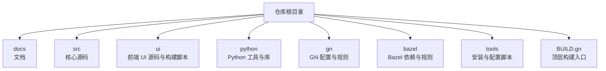
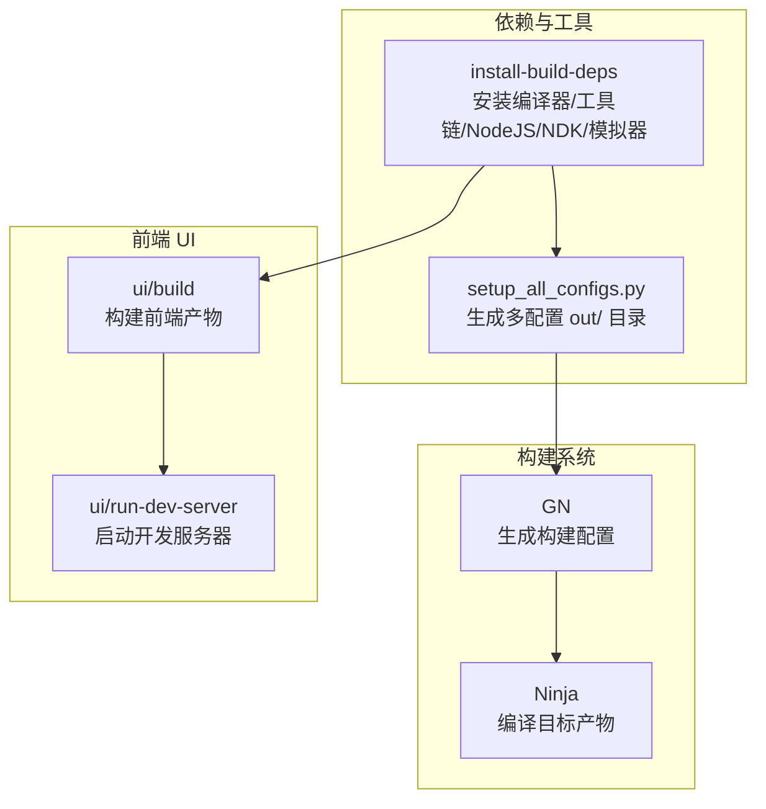
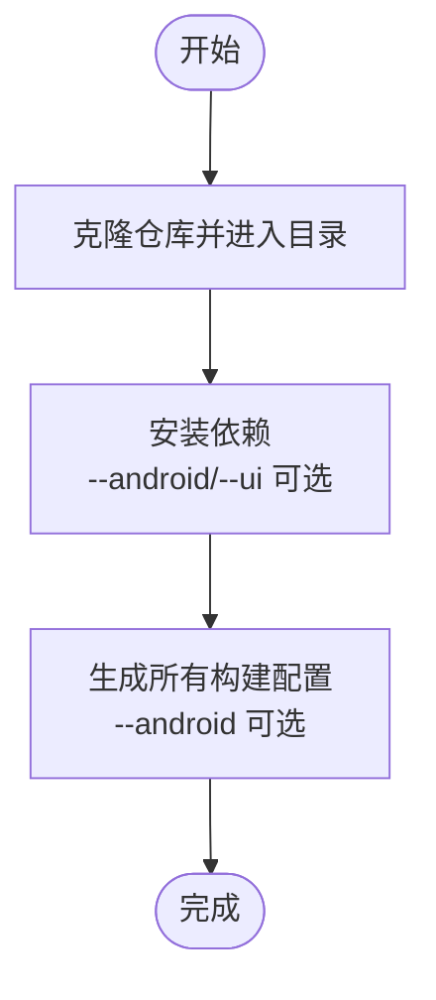
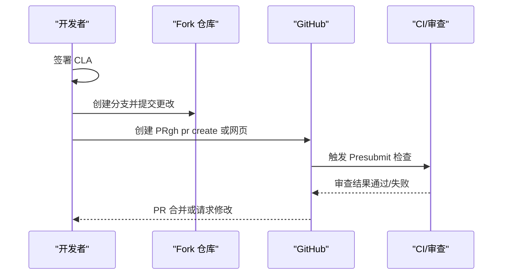
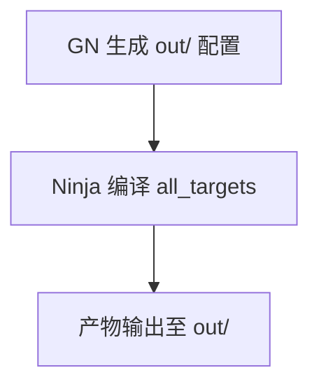
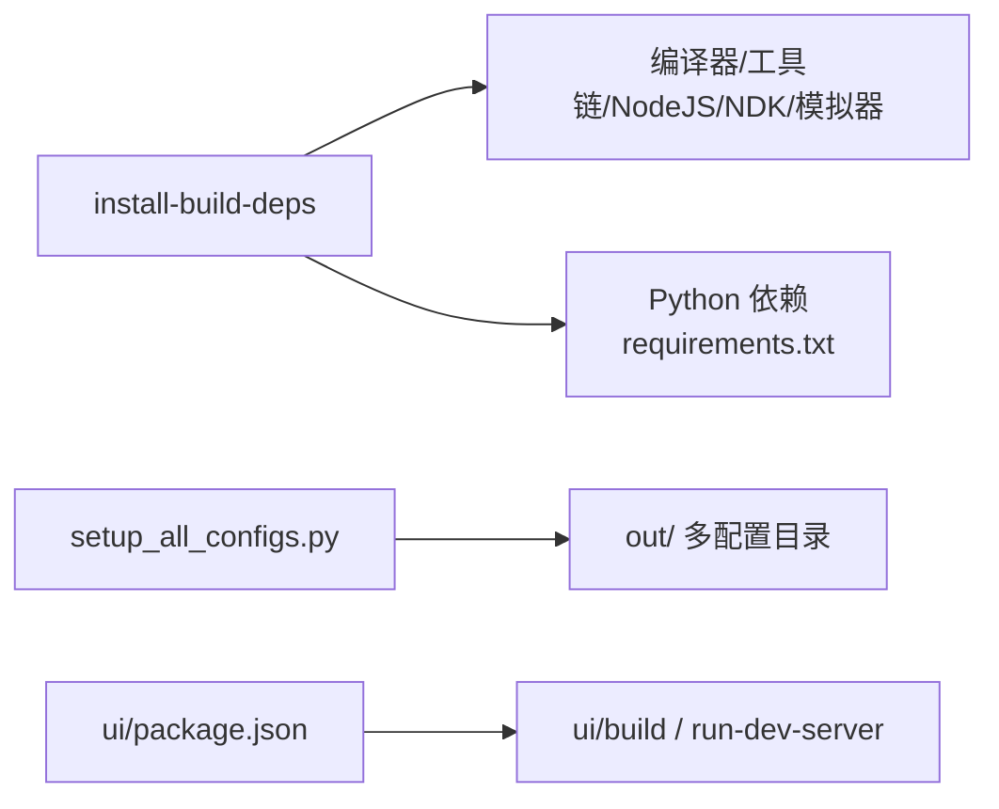

# 快速开始

<cite>
**本文引用的文件**
- [README.md](file://README.md)
- [docs/贡献/快速开始.md](file://docs/contributing/getting-started.md)
- [docs/贡献/构建说明.md](file://docs/contributing/build-instructions.md)
- [docs/贡献/UI 开发入门.md](file://docs/contributing/ui-getting-started.md)
- [docs/FAQ.md](file://docs/faq.md)
- [.github/PULL 请求模板.md](file://.github/pull_request_template.md)
- [tools/install-build-deps](file://tools/install-build-deps)
- [tools/setup_all_configs.py](file://tools/setup_all_configs.py)
- [BUILD.gn](file://BUILD.gn)
- [gn/standalone/BUILD.gn](file://gn/standalone/BUILD.gn)
- [ui/package.json](file://ui/package.json)
</cite>

## 目录
1. [简介](#简介)
2. [项目结构](#项目结构)
3. [核心组件](#核心组件)
4. [架构总览](#架构总览)
5. [详细组件分析](#详细组件分析)
6. [依赖关系分析](#依赖关系分析)
7. [性能注意事项](#性能注意事项)
8. [故障排查指南](#故障排查指南)
9. [结论](#结论)
10. [附录](#附录)

## 简介
本指南面向首次参与 Perfetto 的开发者，帮助你在本地完成开发环境搭建、克隆与依赖安装、构建与运行、UI 构建与开发服务器启动，并给出贡献流程（含 Google CLA、分支与提交、PR 创建）以及常见问题解答与后续学习资源。

## 项目结构
Perfetto 是一个跨平台的系统级追踪与分析工具集，包含服务端守护进程、用户态 SDK、浏览器 UI、SQL 分析引擎等模块。仓库采用 GN/Bazel 作为主要构建系统，支持 Linux、macOS、Windows 与 Android 平台。

图示来源
- [BUILD.gn](file://BUILD.gn)

章节来源
- [README.md](file://README.md)
- [BUILD.gn](file://BUILD.gn)

## 核心组件
- 高性能追踪守护进程：在单机多进程中统一采集追踪数据。
- 低开销追踪 SDK：C++17 用户态库，用于应用内自定义时序与状态追踪。
- 广泛的操作系统级探针：在 Android 与 Linux 上采集调度、CPU 频率、内存等上下文。
- 基于浏览器的 UI：本地化、零安装、支持多 GB 级大追踪可视化。
- 基于 SQL 的分析库：以 SQL 查询追踪数据，自动化提取指标。

章节来源
- [README.md](file://README.md)

## 架构总览
Perfetto 的构建与运行涉及以下关键路径：
- 依赖安装：通过安装脚本拉取编译器、工具链、NodeJS、NPM、NDK、模拟器等。
- 构建配置：使用 GN 生成各平台/架构的 out/ 配置目录。
- 构建执行：使用 Ninja 编译目标产物。
- UI 构建与开发：前端使用 NodeJS 生态，支持热重载开发服务器。
- 贡献流程：GitHub PR 流程，遵循 CLA 与社区准则。

图示来源
- [docs/贡献/构建说明.md](file://docs/contributing/build-instructions.md)
- [tools/install-build-deps](file://tools/install-build-deps)
- [tools/setup_all_configs.py](file://tools/setup_all_configs.py)
- [ui/package.json](file://ui/package.json)

## 详细组件分析

### 开发环境与依赖安装
- 安装前置条件：git 与 Python3。
- 克隆仓库并进入目录。
- 安装依赖：可选择性安装 Android NDK、模拟器与 UI 所需 NodeJS/NPM。
- 初始化所有构建配置：可选择生成 Android 构建配置。

图示来源
- [docs/贡献/快速开始.md](file://docs/contributing/getting-started.md)
- [tools/install-build-deps](file://tools/install-build-deps)
- [tools/setup_all_configs.py](file://tools/setup_all_configs.py)

章节来源
- [docs/贡献/快速开始.md](file://docs/contributing/getting-started.md)
- [docs/贡献/构建说明.md](file://docs/contributing/build-instructions.md)
- [tools/install-build-deps](file://tools/install-build-deps)
- [tools/setup_all_configs.py](file://tools/setup_all_configs.py)

### 平台构建命令与输出目录
- Linux
  - 生产构建：tools/ninja -C out/linux_clang_release
  - 调试构建：tools/ninja -C out/linux_clang_debug
- macOS
  - 生产构建：tools/ninja -C out/mac_release
  - 调试构建：tools/ninja -C out/mac_debug
- Android（桌面交叉编译）
  - 生产构建（arm64）：tools/ninja -C out/android_release_arm64
  - 调试构建（arm64）：tools/ninja -C out/android_debug_arm64

章节来源
- [docs/贡献/快速开始.md](file://docs/contributing/getting-started.md)

### UI 构建与开发服务器
- 构建 UI：ui/build（默认输出到 ./out/ui，最终产物位于 ./ui/out/dist/）
- 启动开发服务器：ui/run-dev-server（自动热重载，支持“快速热重载”开关）
- 单元测试：ui/run-unittests（可配合 --no-build 与 --watch）

章节来源
- [docs/贡献/UI 开发入门.md](file://docs/contributing/ui-getting-started.md)
- [ui/package.json](file://ui/package.json)

### 贡献流程（CLA、分支、提交、PR）
- Google CLA：贡献前需签署 Google CLA。
- 分支与提交：基于主干创建特性分支，进行变更、添加与提交。
- PR 创建：使用 gh pr create（需要 GitHub CLI），或在 GitHub 页面创建 PR。
- 提交规范：遵循 Google C++ 风格与 C++17 标准；Presubmit 自动检查。

图示来源
- [docs/贡献/快速开始.md](file://docs/contributing/getting-started.md)
- [.github/PULL 请求模板.md](file://.github/pull_request_template.md)

章节来源
- [docs/贡献/快速开始.md](file://docs/contributing/getting-started.md)
- [.github/PULL 请求模板.md](file://.github/pull_request_template.md)

### 构建系统与工具链
- GN：作为主要构建系统，生成 out/ 配置目录。
- Ninja：执行具体编译任务。
- 顶层构建入口：BUILD.gn 统一管理 all_targets 与条件编译。
- 稳定版工具链：Hermetic Clang、libc++、GN、Ninja 等由仓库内置或下载。

图示来源
- [BUILD.gn](file://BUILD.gn)
- [gn/standalone/BUILD.gn](file://gn/standalone/BUILD.gn)

章节来源
- [docs/贡献/构建说明.md](file://docs/contributing/build-instructions.md)
- [BUILD.gn](file://BUILD.gn)
- [gn/standalone/BUILD.gn](file://gn/standalone/BUILD.gn)

## 依赖关系分析
- 依赖安装脚本负责下载与缓存编译器、工具链、NodeJS、NPM、NDK、模拟器、gRPC、Protobuf、SQLite、RE2/PCRE2、Zlib、Emscripten 等。
- setup_all_configs.py 自动生成多平台/多架构的 out/ 配置，便于快速迭代。
- UI 依赖通过 package.json 管理，构建与测试脚本由 ui/build.js 与 package.json scripts 驱动。

图示来源
- [tools/install-build-deps](file://tools/install-build-deps)
- [tools/setup_all_configs.py](file://tools/setup_all_configs.py)
- [ui/package.json](file://ui/package.json)

章节来源
- [tools/install-build-deps](file://tools/install-build-deps)
- [tools/setup_all_configs.py](file://tools/setup_all_configs.py)
- [ui/package.json](file://ui/package.json)

## 性能注意事项
- 使用 ccache 包装器加速重复构建（在 GN 参数中启用 cc_wrapper="ccache"）。
- Debug 构建会开启调试符号与断言，性能较 Release 较慢，建议仅在本地开发使用。
- Windows 支持 clang-cl 与 MSVC 两种编译器，clang-cl 更稳定，适合日常开发。

章节来源
- [docs/贡献/构建说明.md](file://docs/contributing/build-instructions.md)

## 故障排查指南
- 无法打开命令行收集的追踪文件：使用 tools/open_trace_in_ui 脚本一键打开本地 UI。
- JSON 追踪格式兼容性：JSON 为遗留格式，不保证与 chrome://tracing 完全一致；推荐使用原生 TrackEvent。
- 多进程追踪：使用 Tracing SDK 的“系统模式”，所有进程连接 traced 并合并为单一追踪。
- 常见问题与更多 FAQ：参见 docs/faq.md。

章节来源
- [docs/faq.md](file://docs/faq.md)

## 结论
通过本快速开始指南，你已掌握 Perfetto 的环境准备、依赖安装、多平台构建、UI 构建与开发服务器运行方法，并了解了贡献流程与常见问题处理方式。建议结合官方文档进一步深入学习各模块设计与实现细节。

## 附录
- 下一步学习资源与参考文档入口可从 README.md 中获取。
- 贡献者需遵守 Google 开源社区行为准则。

章节来源
- [README.md](file://README.md)
- [docs/贡献/快速开始.md](file://docs/contributing/getting-started.md)