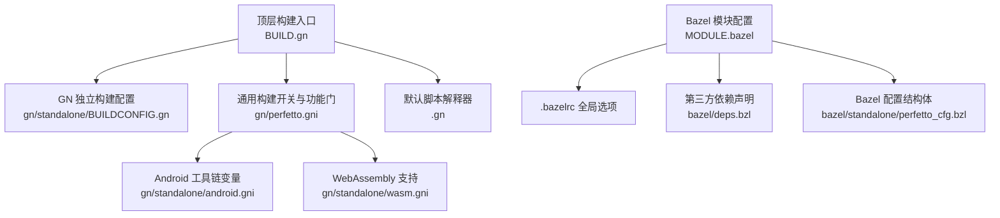
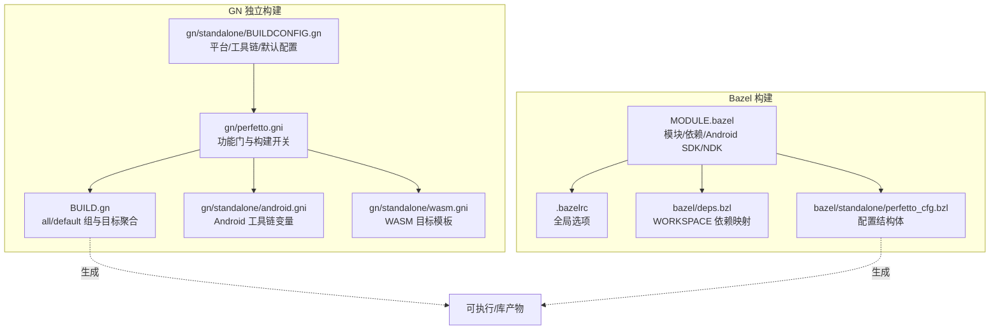
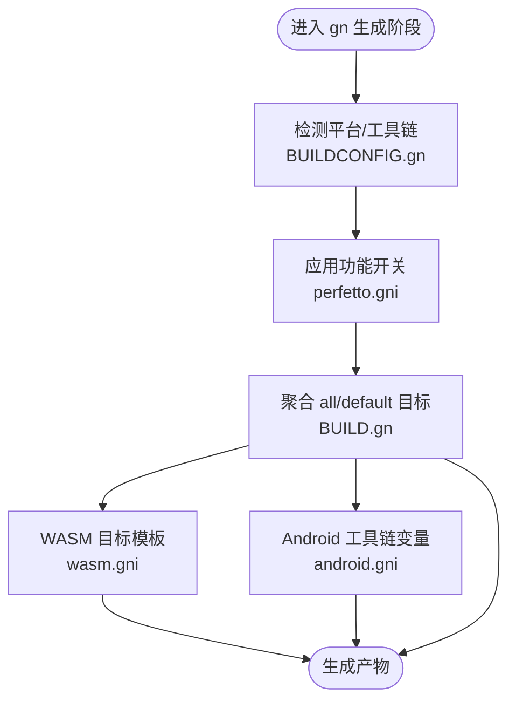
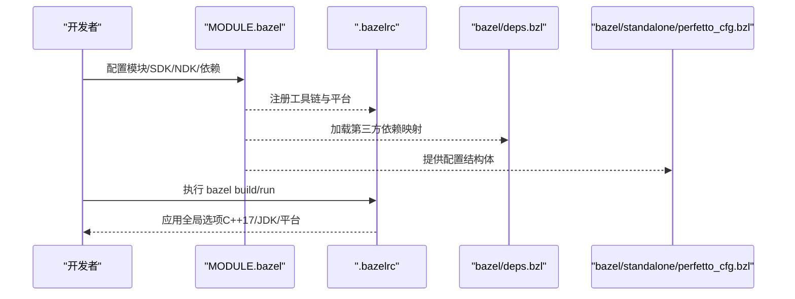
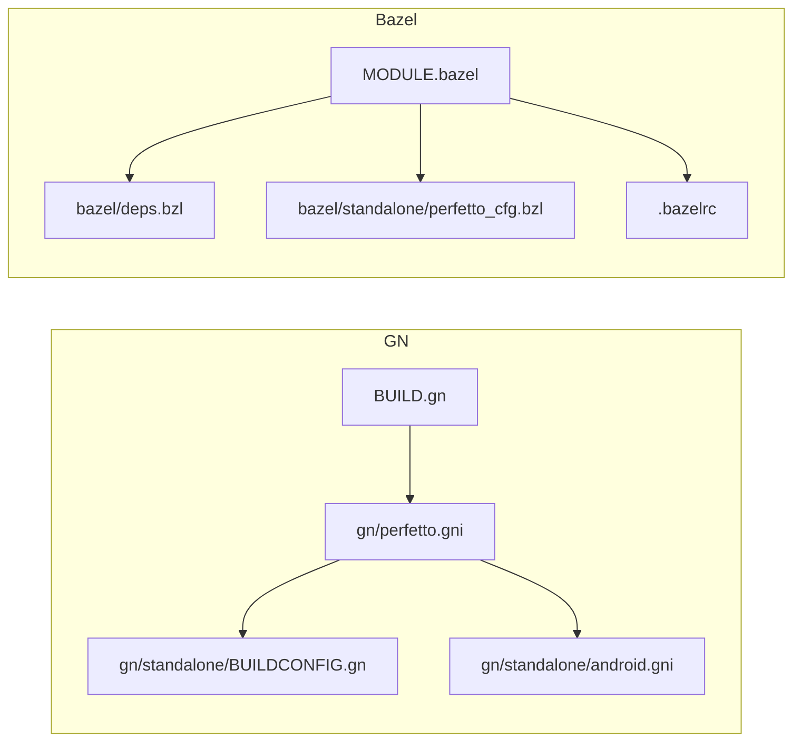

# 构建系统

<cite>
**本文引用的文件**
- [BUILD.gn](file://BUILD.gn)
- [.gn](file://.gn)
- [MODULE.bazel](file://MODULE.bazel)
- [.bazelrc](file://.bazelrc)
- [gn/perfetto.gni](file://gn/perfetto.gni)
- [gn/standalone/BUILDCONFIG.gn](file://gn/standalone/BUILDCONFIG.gn)
- [build_overrides/build.gni](file://build_overrides/build.gni)
- [bazel/deps.bzl](file://bazel/deps.bzl)
- [bazel/standalone/perfetto_cfg.bzl](file://bazel/standalone/perfetto_cfg.bzl)
- [gn/standalone/android.gni](file://gn/standalone/android.gni)
- [gn/standalone/wasm.gni](file://gn/standalone/wasm.gni)
</cite>

## 目录
1. [简介](#简介)
2. [项目结构](#项目结构)
3. [核心组件](#核心组件)
4. [架构总览](#架构总览)
5. [详细组件分析](#详细组件分析)
6. [依赖关系分析](#依赖关系分析)
7. [性能考虑](#性能考虑)
8. [故障排除指南](#故障排除指南)
9. [结论](#结论)
10. [附录](#附录)

## 简介
本文件为 Perfetto 提供全面的构建系统文档，覆盖以下内容：
- GN 与 Bazel 两种构建系统的配置与使用方法
- 构建依赖的安装与管理（含各平台特定要求）
- 不同构建目标（生产、调试、交叉编译）的说明
- 构建配置文件的作用与自定义方法
- 持续集成中的构建流程与自动化测试思路
- 构建故障排除与性能优化建议

## 项目结构
Perfetto 同时支持 GN 与 Bazel 两种构建系统，并通过统一的顶层配置与模块化扩展实现跨树复用。关键位置如下：
- 顶层构建入口与默认行为：BUILD.gn、.gn
- GN 独立构建配置：gn/standalone/BUILDCONFIG.gn、gn/perfetto.gni、gn/standalone/android.gni、gn/standalone/wasm.gni
- Bazel 配置：MODULE.bazel、.bazelrc、bazel/deps.bzl、bazel/standalone/perfetto_cfg.bzl
- 构建覆盖与开关：build_overrides/build.gni

图表来源
- [BUILD.gn:15-385](file://BUILD.gn#L15-L385)
- [gn/perfetto.gni:15-520](file://gn/perfetto.gni#L15-L520)
- [gn/standalone/BUILDCONFIG.gn:15-130](file://gn/standalone/BUILDCONFIG.gn#L15-L130)
- [gn/standalone/android.gni:15-62](file://gn/standalone/android.gni#L15-L62)
- [gn/standalone/wasm.gni:15-173](file://gn/standalone/wasm.gni#L15-L173)
- [.gn:15-17](file://.gn#L15-L17)
- [MODULE.bazel:17-124](file://MODULE.bazel#L17-L124)
- [.bazelrc:1-7](file://.bazelrc#L1-L7)
- [bazel/deps.bzl:33-148](file://bazel/deps.bzl#L33-L148)
- [bazel/standalone/perfetto_cfg.bzl:19-160](file://bazel/standalone/perfetto_cfg.bzl#L19-L160)

章节来源
- [BUILD.gn:15-385](file://BUILD.gn#L15-L385)
- [.gn:15-17](file://.gn#L15-L17)

## 核心组件
- GN 独立构建配置（gn/standalone/BUILDCONFIG.gn）
  - 定义平台检测、工具链默认配置、调试/发布开关、可执行与库的默认配置集合
  - 控制是否交叉编译、主机工具链选择等
- 通用构建开关与功能门（gn/perfetto.gni）
  - 声明大量可由用户或工具脚本覆盖的构建参数，控制平台服务、Trace Processor、IPC、UI、Zlib、RE2、LLVM 符号化等功能的启用
  - 提供嵌入式场景（Chromium/Android/其他嵌入器）与独立构建的差异化路径
- Bazel 模块与依赖（MODULE.bazel、.bazelrc、bazel/deps.bzl、bazel/standalone/perfetto_cfg.bzl）
  - MODULE.bazel 声明模块版本、外部依赖（abseil、re2、protobuf、rules_python 等）、Android SDK/NDK 注册、maven 测试依赖
  - .bazelrc 设置 C++17、多平台 APK 平台、JDK 版本等全局选项
  - bazel/deps.bzl 为 WORKSPACE 用户提供第三方依赖仓库映射
  - bazel/standalone/perfetto_cfg.bzl 提供 Bazel 下的配置结构体（root、deps、rule_overrides、cxxopts 等）

章节来源
- [gn/standalone/BUILDCONFIG.gn:15-130](file://gn/standalone/BUILDCONFIG.gn#L15-L130)
- [gn/perfetto.gni:15-520](file://gn/perfetto.gni#L15-L520)
- [MODULE.bazel:17-124](file://MODULE.bazel#L17-L124)
- [.bazelrc:1-7](file://.bazelrc#L1-L7)
- [bazel/deps.bzl:33-148](file://bazel/deps.bzl#L33-L148)
- [bazel/standalone/perfetto_cfg.bzl:19-160](file://bazel/standalone/perfetto_cfg.bzl#L19-L160)

## 架构总览
下图展示 Perfetto 在不同构建系统下的关键配置与目标生成路径。

图表来源
- [gn/standalone/BUILDCONFIG.gn:15-130](file://gn/standalone/BUILDCONFIG.gn#L15-L130)
- [gn/perfetto.gni:15-520](file://gn/perfetto.gni#L15-L520)
- [BUILD.gn:15-385](file://BUILD.gn#L15-L385)
- [gn/standalone/android.gni:15-62](file://gn/standalone/android.gni#L15-L62)
- [gn/standalone/wasm.gni:15-173](file://gn/standalone/wasm.gni#L15-L173)
- [MODULE.bazel:17-124](file://MODULE.bazel#L17-L124)
- [.bazelrc:1-7](file://.bazelrc#L1-L7)
- [bazel/deps.bzl:33-148](file://bazel/deps.bzl#L33-L148)
- [bazel/standalone/perfetto_cfg.bzl:19-160](file://bazel/standalone/perfetto_cfg.bzl#L19-L160)

## 详细组件分析

### GN 构建系统
- 默认行为与脚本解释器
  - 顶层 .gn 指定独立构建使用的 BUILDCONFIG 与脚本解释器（如 python3），确保在独立环境中的可重复性
- 独立构建配置（BUILDCONFIG.gn）
  - 平台检测：根据 host_os/current_os/target_os 判定当前/目标平台
  - 工具链选择：Windows 使用 MSVC，其他平台使用 gcc-like；支持交叉编译判断与主机工具链
  - 默认配置集：包含警告级别、可见性、RTTI、异常禁用、C++17 等
- 功能开关与目标聚合（BUILD.gn）
  - all/default 组合目标：按条件启用 traced、trace_processor、traceconv、heapprofd、UI、站点等
  - 条件编译：针对 Android、Chromium、嵌入器、独立构建等场景分别启用/禁用目标
  - 交叉编译：当 is_cross_compiling 为真时，额外为目标添加主机版本依赖
- 构建开关与平台特性（perfetto.gni）
  - enable_perfetto_platform_services、enable_perfetto_trace_processor、enable_perfetto_ipc 等
  - Android API 级别、IPC、系统消费者、SQLite 百分位、HTTPD、Zlib、RE2、LLVM 符号化、Winscope 等
  - monolithic_binaries、DLOG/DCHECK 强制策略、线程安全注解、优先继承互斥锁、sock inotify 等
- Android 工具链（android.gni）
  - 定义 Android NDK 路径、ABI、sysroot、Clang 运行时目录等
- WebAssembly 支持（wasm.gni）
  - 提供 wasm_lib 模板，生成 .wasm/.js/.d.ts，设置运行时导出、内存上限、调试符号等

图表来源
- [gn/standalone/BUILDCONFIG.gn:15-130](file://gn/standalone/BUILDCONFIG.gn#L15-L130)
- [gn/perfetto.gni:15-520](file://gn/perfetto.gni#L15-L520)
- [BUILD.gn:15-385](file://BUILD.gn#L15-L385)
- [gn/standalone/android.gni:15-62](file://gn/standalone/android.gni#L15-L62)
- [gn/standalone/wasm.gni:15-173](file://gn/standalone/wasm.gni#L15-L173)

章节来源
- [.gn:15-17](file://.gn#L15-L17)
- [gn/standalone/BUILDCONFIG.gn:15-130](file://gn/standalone/BUILDCONFIG.gn#L15-L130)
- [gn/perfetto.gni:15-520](file://gn/perfetto.gni#L15-L520)
- [BUILD.gn:15-385](file://BUILD.gn#L15-L385)
- [gn/standalone/android.gni:15-62](file://gn/standalone/android.gni#L15-L62)
- [gn/standalone/wasm.gni:15-173](file://gn/standalone/wasm.gni#L15-L173)

### Bazel 构建系统
- 模块与依赖（MODULE.bazel）
  - 声明模块名与版本，引入 abseil、re2、bazel_skylib、platforms、protobuf、rules_python、rules_android 等
  - 配置 Android SDK/NDK：通过扩展注册工具链与仓库，指定 API 级别、构建工具版本
  - maven 依赖：为 Android 仪器测试提供 runner/monitor/truth/junit 等
- 全局选项（.bazelrc）
  - C++17 标准、多平台 APK 平台（arm64-v8a/x86_64）、Hermetic JDK
- 第三方依赖映射（bazel/deps.bzl）
  - 为 WORKSPACE 用户提供 protobuf、sqlite、linenoise、expat、zlib、llvm_demangle、OpenCSD、re2、abseil 等仓库映射
- 配置结构体（bazel/standalone/perfetto_cfg.bzl）
  - root、deps（zlib、re2、expat、linenoise、sqlite、protoc、demangle_wrapper 等）、rule_overrides、visibility、cxxopts 等

图表来源
- [MODULE.bazel:17-124](file://MODULE.bazel#L17-L124)
- [.bazelrc:1-7](file://.bazelrc#L1-L7)
- [bazel/deps.bzl:33-148](file://bazel/deps.bzl#L33-L148)
- [bazel/standalone/perfetto_cfg.bzl:19-160](file://bazel/standalone/perfetto_cfg.bzl#L19-L160)

章节来源
- [MODULE.bazel:17-124](file://MODULE.bazel#L17-L124)
- [.bazelrc:1-7](file://.bazelrc#L1-L7)
- [bazel/deps.bzl:33-148](file://bazel/deps.bzl#L33-L148)
- [bazel/standalone/perfetto_cfg.bzl:19-160](file://bazel/standalone/perfetto_cfg.bzl#L19-L160)

### 构建目标与配置文件
- 构建目标
  - 平台服务：traced、traced_probes、traced_relay、perfetto_cmd、trigger_perfetto
  - Trace Processor：trace_processor_shell、export_json、storage_minimal、BigTrace 组件
  - 工具：traceconv、proto_utils、tools/
  - 性能分析：heapprofd、traced_perf
  - UI/站点：UI（TypeScript/HTML/WASM）、站点（可选）
  - 示例与测试：examples/sdk、examples/shared_lib、integration tests、unittests、benchmarks、fuzzers
- 配置文件作用与自定义
  - gn/perfetto.gni：通过 declare_args 定义功能开关，覆盖 build_with_chromium、is_perfetto_build_generator、monolithic_binaries 等
  - gn/standalone/BUILDCONFIG.gn：定义 is_debug、is_clang、is_cross_compiling、默认 configs、工具链选择
  - build_overrides/build.gni：在嵌入器中覆盖 build_with_chromium 等全局标志
  - bazel/standalone/perfetto_cfg.bzl：提供 root、deps、rule_overrides、visibility、cxxopts 等，便于嵌入器定制

章节来源
- [BUILD.gn:15-385](file://BUILD.gn#L15-L385)
- [gn/perfetto.gni:15-520](file://gn/perfetto.gni#L15-L520)
- [gn/standalone/BUILDCONFIG.gn:15-130](file://gn/standalone/BUILDCONFIG.gn#L15-L130)
- [build_overrides/build.gni:15-22](file://build_overrides/build.gni#L15-L22)
- [bazel/standalone/perfetto_cfg.bzl:19-160](file://bazel/standalone/perfetto_cfg.bzl#L19-L160)

### 持续集成与自动化测试
- Bazel 集成要点
  - .bazelrc 中已设定 C++17、多平台 APK 平台与 Hermetic JDK，便于 CI 复现
  - MODULE.bazel 注册 Android SDK/NDK 工具链，确保在 CI 中可直接构建 Android 相关目标
  - bazel/deps.bzl 与 MODULE.bazel 的依赖声明保证第三方库一致性
- 自动化测试建议
  - 将单元测试、集成测试、基准测试、模糊测试分别作为独立 Bazel 目标，配合 .bazelrc 的平台与工具链配置
  - 对 Android 相关测试，利用 MODULE.bazel 中的 android_tools 与 maven 依赖，确保仪器测试可用

章节来源
- [.bazelrc:1-7](file://.bazelrc#L1-L7)
- [MODULE.bazel:17-124](file://MODULE.bazel#L17-L124)
- [bazel/deps.bzl:33-148](file://bazel/deps.bzl#L33-L148)

## 依赖关系分析
- GN 侧
  - BUILD.gn 依赖 gn/perfetto.gni 的功能开关，按条件向 all_targets 添加平台服务、Trace Processor、traceconv、heapprofd、UI、站点等
  - gn/perfetto.gni 进一步依赖 gn/standalone/BUILDCONFIG.gn 的平台/工具链信息
  - Android 场景依赖 gn/standalone/android.gni 的工具链变量
- Bazel 侧
  - MODULE.bazel 依赖 bazel/deps.bzl 与 bazel/standalone/perfetto_cfg.bzl 提供的依赖与配置
  - .bazelrc 为所有 Bazel 操作提供统一的编译与运行选项

图表来源
- [BUILD.gn:15-385](file://BUILD.gn#L15-L385)
- [gn/perfetto.gni:15-520](file://gn/perfetto.gni#L15-L520)
- [gn/standalone/BUILDCONFIG.gn:15-130](file://gn/standalone/BUILDCONFIG.gn#L15-L130)
- [gn/standalone/android.gni:15-62](file://gn/standalone/android.gni#L15-L62)
- [MODULE.bazel:17-124](file://MODULE.bazel#L17-L124)
- [bazel/deps.bzl:33-148](file://bazel/deps.bzl#L33-L148)
- [bazel/standalone/perfetto_cfg.bzl:19-160](file://bazel/standalone/perfetto_cfg.bzl#L19-L160)
- [.bazelrc:1-7](file://.bazelrc#L1-L7)

章节来源
- [BUILD.gn:15-385](file://BUILD.gn#L15-L385)
- [gn/perfetto.gni:15-520](file://gn/perfetto.gni#L15-L520)
- [gn/standalone/BUILDCONFIG.gn:15-130](file://gn/standalone/BUILDCONFIG.gn#L15-L130)
- [gn/standalone/android.gni:15-62](file://gn/standalone/android.gni#L15-L62)
- [MODULE.bazel:17-124](file://MODULE.bazel#L17-L124)
- [bazel/deps.bzl:33-148](file://bazel/deps.bzl#L33-L148)
- [bazel/standalone/perfetto_cfg.bzl:19-160](file://bazel/standalone/perfetto_cfg.bzl#L19-L160)
- [.bazelrc:1-7](file://.bazelrc#L1-L7)

## 性能考虑
- 编译器与标准
  - GN：默认启用 C++17，独立构建在调试/发布模式下分别附加不同优化与调试配置
  - Bazel：.bazelrc 明确 C++17 标准，有助于跨平台一致的编译体验
- 二进制大小与链接
  - GN 支持 monolithic_binaries，可在非 Android 平台减少共享库开销，加速本地开发
  - Chromium/嵌入器场景下，libperfetto 与 libtrace_processor 采用 source_set/component 等方式控制链接范围
- 第三方库与功能开关
  - 仅启用必要的功能（如 enable_perfetto_grpc、enable_perfetto_llvm_symbolizer、enable_perfetto_ui）以降低构建时间与体积
- 平台特定优化
  - x64 CPU 优化、优先继承互斥锁、线程安全注解等仅在满足平台与构建类型条件下启用

章节来源
- [gn/standalone/BUILDCONFIG.gn:70-130](file://gn/standalone/BUILDCONFIG.gn#L70-L130)
- [.bazelrc:1-7](file://.bazelrc#L1-L7)
- [gn/perfetto.gni:241-308](file://gn/perfetto.gni#L241-L308)
- [gn/perfetto.gni:285-288](file://gn/perfetto.gni#L285-L288)
- [gn/perfetto.gni:275-278](file://gn/perfetto.gni#L275-L278)

## 故障排除指南
- 构建失败与平台不匹配
  - traced_probes 仅在 Linux/Mac/Android 上启用；relay 服务在 Windows 上禁用；确认目标平台与功能开关一致
- 交叉编译问题
  - 当 is_cross_compiling 为真时，需确保主机工具链可用；BUILD.gn 中对 traceconv 等工具会显式添加主机版本依赖
- Android 工具链
  - android.gni 定义了 NDK 路径、ABI、sysroot 等；若构建 Android 目标，请确保 HOST 预装对应平台的预编译工具链
- Bazel 依赖冲突
  - MODULE.bazel 已集中声明 abseil、re2、protobuf、rules_android 等；若嵌入器自行提供依赖，请保持版本一致或通过 perfetto_cfg.bzl 的 deps 覆盖
- 调试与日志
  - perfetto_force_dlog 与 perfetto_force_dcheck 可强制开启/关闭日志与断言，便于定位问题
- 版本头与构建标志
  - enable_perfetto_version_gen 控制版本头生成；未启用时 base/version.h 返回 unknown

章节来源
- [BUILD.gn:64-77](file://BUILD.gn#L64-L77)
- [gn/standalone/android.gni:15-62](file://gn/standalone/android.gni#L15-L62)
- [gn/perfetto.gni:330-336](file://gn/perfetto.gni#L330-L336)
- [gn/perfetto.gni:157-308](file://gn/perfetto.gni#L157-L308)
- [gn/perfetto.gni:421-461](file://gn/perfetto.gni#L421-L461)

## 结论
Perfetto 的构建系统通过 GN 与 Bazel 双轨并行，既满足独立开发的灵活性，又兼容 Chromium/Android/其他嵌入器的复杂需求。通过明确的功能开关、平台检测与工具链配置，开发者可以快速搭建适合自身场景的构建环境。建议在 CI 中统一使用 .bazelrc 的全局选项与 MODULE.bazel 的依赖声明，以获得最佳的可重复性与可维护性。

## 附录
- 常用构建命令与参数（示例）
  - GN：gn args、gn gen、ninja -C out/xxx
  - Bazel：bazel build //path/to:target、bazel test //path/to:test
- 平台特定安装
  - Android：按 MODULE.bazel 的 SDK/NDK 配置准备工具链
  - Linux/macOS：确保 C++17 编译器与 Python3 可用
  - Windows：MSVC 工具链与 Visual Studio 组件