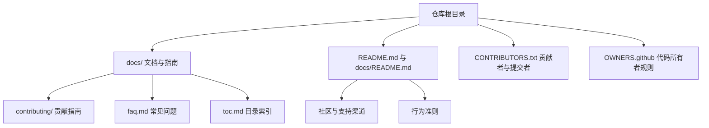
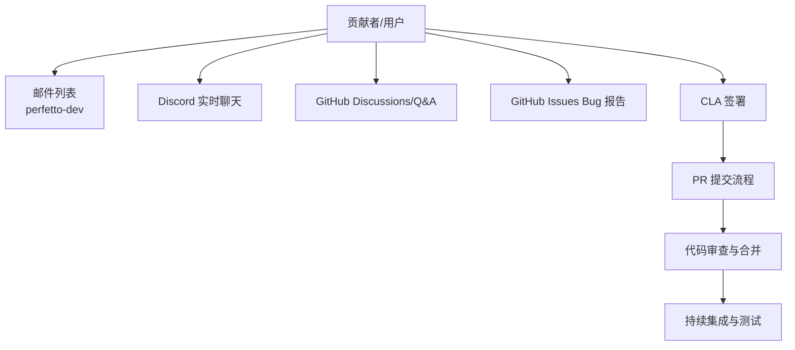
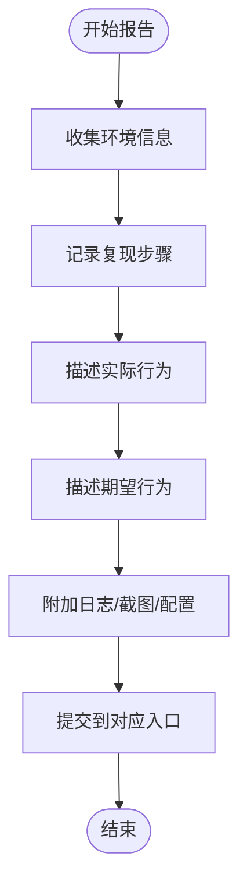
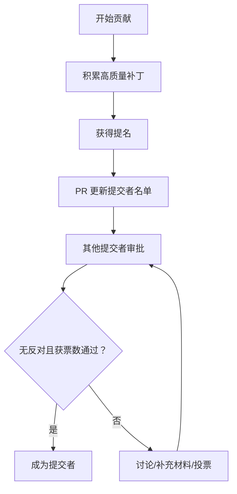
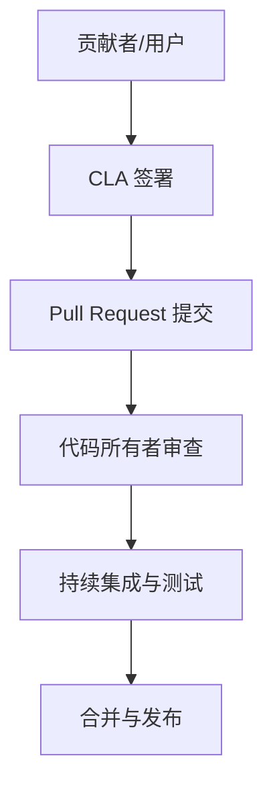

# 社区规范

<cite>
**本文引用的文件**   
- [README.md](file://README.md)
- [docs/README.md](file://docs/README.md)
- [docs/faq.md](file://docs/faq.md)
- [docs/toc.md](file://docs/toc.md)
- [docs/contributing/getting-started.md](file://docs/contributing/getting-started.md)
- [docs/contributing/become-a-committer.md](file://docs/contributing/become-a-committer.md)
- [docs/contributing/common-tasks.md](file://docs/contributing/common-tasks.md)
- [docs/contributing/testing.md](file://docs/contributing/testing.md)
- [CONTRIBUTORS.txt](file://CONTRIBUTORS.txt)
- [OWNERS.github](file://OWNERS.github)
</cite>

## 目录
1. [简介](#简介)
2. [项目结构](#项目结构)
3. [核心组件](#核心组件)
4. [架构总览](#架构总览)
5. [详细组件分析](#详细组件分析)
6. [依赖关系分析](#依赖关系分析)
7. [性能考量](#性能考量)
8. [故障排查指南](#故障排查指南)
9. [结论](#结论)
10. [附录](#附录)

## 简介
本指南面向希望参与 Perfetto 社区的贡献者与用户，系统说明以下内容：
- Google 开源社区行为准则与沟通礼仪
- 邮件列表、Discord 等沟通渠道的使用方式
- Bug 报告的标准格式与分类方法
- 贡献者许可协议（CLA）的签署流程与要求
- 如何成为项目的正式贡献者与提交者（Committer）
- 社区活动与会议信息
- 常见问题解答与获取帮助的途径

Perfetto 是 Android 与 Chromium 的默认追踪系统，社区以开放、协作、尊重为原则运作，并通过 GitHub Discussions、邮件列表与 Discord 等渠道进行交流。

**章节来源**
- [README.md:99-101](file://README.md#L99-L101)
- [docs/README.md:197-234](file://docs/README.md#L197-L234)

## 项目结构
Perfetto 仓库包含代码、文档、CI 工作流、贡献指南与测试策略等模块。与社区参与相关的关键位置包括：
- 文档与贡献指南：docs/ 目录下的 contributing、faq、toc 等
- 沟通渠道与支持：根目录 README 与 docs/README 中的“获取帮助”部分
- 贡献者与提交者名单：CONTRIBUTORS.txt
- 代码所有者规则：OWNERS.github

**图表来源**
- [docs/toc.md:1-205](file://docs/toc.md#L1-L205)
- [docs/README.md:197-234](file://docs/README.md#L197-L234)
- [README.md:99-101](file://README.md#L99-L101)

**章节来源**
- [docs/toc.md:1-205](file://docs/toc.md#L1-L205)
- [docs/README.md:197-234](file://docs/README.md#L197-L234)
- [README.md:99-101](file://README.md#L99-L101)

## 核心组件
- 行为准则与沟通礼仪
  - 项目遵循 Google 开源社区行为准则，倡导尊重、包容与协作。
  - 在 GitHub Discussions、邮件列表与 Discord 上提问时，请保持礼貌、清晰与具体。
- 沟通渠道
  - GitHub Discussions/Q&A：用于问答与一般讨论
  - 邮件列表：perfetto-dev 公共邮件列表；Googlers 使用 YAQS 或内部邮件列表
  - Discord：实时聊天，支持为尽力而为
  - GitHub Issues：Bug 报告
- Bug 分类与上报路径
  - Android 或追踪内核相关问题：GitHub Issues（非 Googlers）或内部 bug 追踪器（Googlers）
  - Chrome Tracing 相关问题：crbug.com 并标注相应组件与标签
- CLA 要求与流程
  - 所有贡献需附带有效的 CLA；首次签署后通常无需重复
  - 外部贡献者按常规 GitHub 流程提交 PR；Googlers 遵循内部指引

**章节来源**
- [README.md:99-101](file://README.md#L99-L101)
- [docs/README.md:197-234](file://docs/README.md#L197-L234)
- [docs/contributing/getting-started.md:124-151](file://docs/contributing/getting-started.md#L124-L151)

## 架构总览
下图展示社区参与者与主要沟通与支持渠道之间的关系：

**图表来源**
- [docs/README.md:197-234](file://docs/README.md#L197-L234)
- [docs/contributing/getting-started.md:124-151](file://docs/contributing/getting-started.md#L124-L151)

## 详细组件分析

### 组件一：沟通渠道与礼仪
- GitHub Discussions/Q&A
  - 适合提问、分享经验与一般性讨论
- 邮件列表
  - perfetto-dev 公共邮件列表；Googlers 可用 YAQS 或内部邮件列表
- Discord
  - 实时聊天，支持为尽力而为
- 行为准则
  - 遵循 Google 开源社区行为准则，营造尊重、包容与协作的环境

建议在各渠道提问时：
- 明确描述问题背景、复现步骤与期望结果
- 提供必要的上下文（平台、版本、配置等）
- 使用清晰标题与分段，便于他人快速理解

**章节来源**
- [docs/README.md:197-234](file://docs/README.md#L197-L234)
- [README.md:99-101](file://README.md#L99-L101)

### 组件二：Bug 报告标准与分类
- 分类与入口
  - Android 或追踪内核相关：GitHub Issues（非 Googlers）或内部 bug 追踪器（Googlers）
  - Chrome Tracing 相关：crbug.com 并标注相应组件与标签
- 报告要素（建议）
  - 环境信息：操作系统、浏览器、Perfetto 版本、设备型号（如适用）
  - 复现步骤：最小可复现实例、命令行或配置片段
  - 期望行为 vs 实际行为
  - 日志与截图（必要时）
  - 影响范围与严重程度

**图表来源**
- [docs/contributing/getting-started.md:129-139](file://docs/contributing/getting-started.md#L129-L139)

**章节来源**
- [docs/contributing/getting-started.md:129-139](file://docs/contributing/getting-started.md#L129-L139)

### 组件三：贡献者许可协议（CLA）
- 要求
  - 所有贡献必须附带有效的 CLA；版权归贡献者或其雇主保留，授予项目使用与再分发权限
- 签署与查询
  - 访问 CLA 官网查看当前协议状态或签署新协议
  - 首次签署后通常无需重复
- 贡献者类型
  - 外部贡献者：按常规 GitHub 流程提交 PR
  - Googlers：遵循内部指引

**章节来源**
- [docs/contributing/getting-started.md:140-151](file://docs/contributing/getting-started.md#L140-L151)

### 组件四：成为正式贡献者与提交者（Committer）
- 权利与责任
  - 提交者拥有对 dev/* 分支与 CI 的写入权限；除提交外，还需承担审查与协作责任
- 成为提交者的条件
  - 至少合并 10 个高质量非 trivial 补丁
  - 获得至少一名现有提交者提名，其中至少一位为顶级所有者
  - 其他两位提交者同意
- 提名流程
  - 提名者通过编辑 CONTRIBUTORS.txt 中的提交者条目发起 PR
  - PR 评论中需说明理由与代表性已落地补丁
  - 等待投票与讨论周期，无反对则成为提交者
- 维持状态
  - 若长期不活跃（一年以上），可能撤销权限；恢复需联系维护者
  - 若破坏社区良好公民精神，可启动撤销流程

**图表来源**
- [docs/contributing/become-a-committer.md:30-112](file://docs/contributing/become-a-committer.md#L30-L112)

**章节来源**
- [docs/contributing/become-a-committer.md:1-122](file://docs/contributing/become-a-committer.md#L1-L122)
- [CONTRIBUTORS.txt:1-60](file://CONTRIBUTORS.txt#L1-L60)

### 组件五：代码所有者与审查规则
- 代码所有者（OWNERS.github）
  - 定义了 GitHub PR 的代码所有者规则，确保关键变更由相关领域维护者审查
  - 通用规则优先于特定文件/目录规则
- 审查建议
  - 提交前请确认变更影响范围与所有者覆盖
  - 遇到复杂变更，主动寻求领域专家意见

**章节来源**
- [OWNERS.github:1-21](file://OWNERS.github#L1-L21)

### 组件六：常见任务与贡献场景
- UI 插件开发、Trace Processor 标准库与指标扩展、ftrace 事件添加等常见任务均有明确流程与规范
- 建议在贡献前先阅读对应指南，确保遵循风格与测试要求

**章节来源**
- [docs/contributing/common-tasks.md:1-216](file://docs/contributing/common-tasks.md#L1-L216)

### 组件七：测试与持续集成
- 测试目标与运行方式
  - 单元测试、集成测试、基准测试等目标覆盖多平台与构建配置
  - 集成测试在 Linux/MacOS 与 Android 上有不同的运行方式
- 持续测试
  - Perfetto CI、Android CI、Treehugger、APCT、CTS 等多处流水线协同验证
- Trace Processor Diff 测试与 UI 像素对比测试
  - 通过 diff 测试保证查询与指标输出稳定性；UI 像素测试确保关键用户旅程一致

**章节来源**
- [docs/contributing/testing.md:1-249](file://docs/contributing/testing.md#L1-L249)

## 依赖关系分析
社区参与流程中的关键依赖关系如下：

**图表来源**
- [docs/contributing/getting-started.md:140-151](file://docs/contributing/getting-started.md#L140-L151)
- [OWNERS.github:1-21](file://OWNERS.github#L1-L21)
- [docs/contributing/testing.md:51-71](file://docs/contributing/testing.md#L51-L71)

**章节来源**
- [docs/contributing/getting-started.md:140-151](file://docs/contributing/getting-started.md#L140-L151)
- [OWNERS.github:1-21](file://OWNERS.github#L1-L21)
- [docs/contributing/testing.md:51-71](file://docs/contributing/testing.md#L51-L71)

## 性能考量
- 社区协作效率
  - 清晰的问题描述与最小复现有助于快速定位与修复
  - 遵循贡献流程与测试要求，减少返工与审查成本
- 沟通渠道选择
  - 复杂问题优先使用 GitHub Discussions/Q&A 或邮件列表，便于归档与检索
  - 紧急问题可尝试 Discord，但需注意支持为尽力而为

## 故障排查指南
- 获取帮助的渠道
  - GitHub Discussions/Q&A 或公共邮件列表；Googlers 使用 YAQS 或内部邮件列表
  - GitHub Issues 提交 Bug；Chrome Tracing 相关问题在 crbug.com 标注组件与标签
  - Discord 实时聊天
- 常见问题
  - 如何从命令行打开 UI 查看轨迹：使用提供的脚本工具
  - JSON 格式兼容性与限制：作为遗留格式，支持以尽力而为方式处理
  - 多进程轨迹聚合：使用 Tracing SDK 的系统模式连接 traced

**章节来源**
- [docs/README.md:197-234](file://docs/README.md#L197-L234)
- [docs/faq.md:1-71](file://docs/faq.md#L1-L71)

## 结论
Perfetto 社区以开放、协作与尊重为核心，通过多渠道沟通与完善的贡献流程，鼓励高质量贡献与持续改进。建议贡献者在提交前熟悉行为准则、CLA 要求与测试策略，并根据问题类型选择合适的沟通与报告渠道。

## 附录
- 社区与支持渠道速览
  - GitHub Discussions/Q&A：用于问答与一般讨论
  - 邮件列表：perfetto-dev（公共）；Googlers 使用 YAQS 或内部邮件列表
  - Discord：实时聊天，支持为尽力而为
  - GitHub Issues：Bug 报告
  - 行为准则：遵循 Google 开源社区行为准则

**章节来源**
- [docs/README.md:197-234](file://docs/README.md#L197-L234)
- [README.md:99-101](file://README.md#L99-L101)